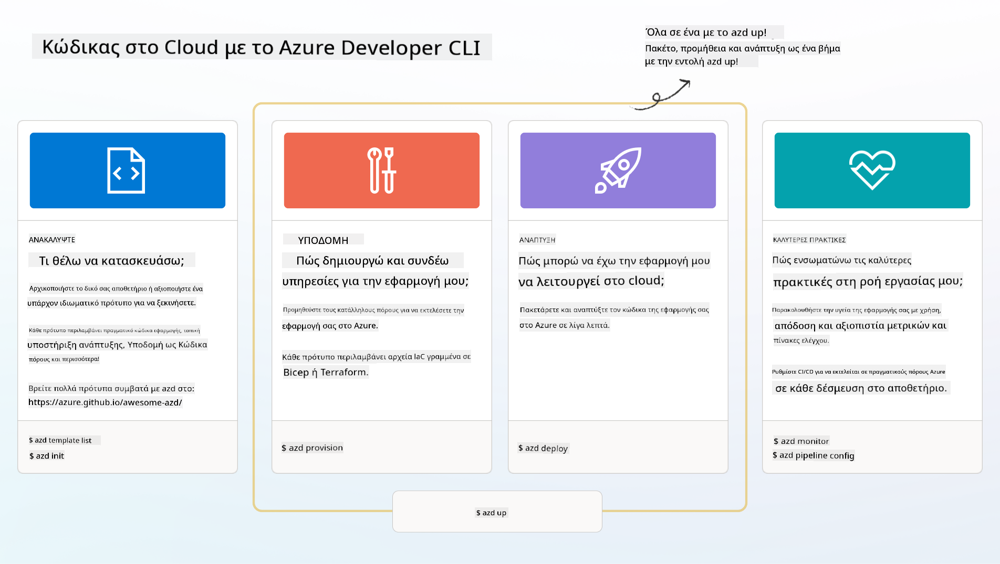

<!--
CO_OP_TRANSLATOR_METADATA:
{
  "original_hash": "06d6207eff634aefcaa41739490a5324",
  "translation_date": "2025-09-24T21:29:23+00:00",
  "source_file": "workshop/docs/instructions/1-Select-AI-Template.md",
  "language_code": "el"
}
-->
# 1. Επιλογή Προτύπου

!!! tip "ΜΕΧΡΙ ΤΟ ΤΕΛΟΣ ΑΥΤΗΣ ΤΗΣ ΕΝΟΤΗΤΑΣ ΘΑ ΜΠΟΡΕΙΤΕ ΝΑ"

    - [ ] Περιγράψετε τι είναι τα πρότυπα AZD
    - [ ] Ανακαλύψετε και χρησιμοποιήσετε πρότυπα AZD για AI
    - [ ] Ξεκινήσετε με το πρότυπο AI Agents
    - [ ] **Εργαστήριο 1:** Γρήγορη εκκίνηση AZD με GitHub Codespaces

---

## 1. Αναλογία Κατασκευαστή

Η δημιουργία μιας σύγχρονης AI εφαρμογής για επιχειρήσεις _από την αρχή_ μπορεί να φαίνεται τρομακτική. Είναι λίγο σαν να χτίζετε το νέο σας σπίτι μόνοι σας, τούβλο-τούβλο. Ναι, μπορεί να γίνει! Αλλά δεν είναι ο πιο αποτελεσματικός τρόπος για να πετύχετε το επιθυμητό αποτέλεσμα!

Αντίθετα, συχνά ξεκινάμε με ένα υπάρχον _σχέδιο αρχιτεκτονικής_ και συνεργαζόμαστε με έναν αρχιτέκτονα για να το προσαρμόσουμε στις προσωπικές μας απαιτήσεις. Και αυτή είναι ακριβώς η προσέγγιση που πρέπει να ακολουθήσετε όταν δημιουργείτε έξυπνες εφαρμογές. Πρώτα, βρείτε μια καλή αρχιτεκτονική σχεδίασης που ταιριάζει στον χώρο του προβλήματός σας. Στη συνέχεια, συνεργαστείτε με έναν αρχιτέκτονα λύσεων για να προσαρμόσετε και να αναπτύξετε τη λύση για το συγκεκριμένο σενάριό σας.

Αλλά πού μπορούμε να βρούμε αυτά τα σχέδια αρχιτεκτονικής; Και πώς βρίσκουμε έναν αρχιτέκτονα που είναι πρόθυμος να μας διδάξει πώς να προσαρμόσουμε και να αναπτύξουμε αυτά τα σχέδια μόνοι μας; Σε αυτό το εργαστήριο, απαντάμε σε αυτές τις ερωτήσεις παρουσιάζοντάς σας τρεις τεχνολογίες:

1. [Azure Developer CLI](https://aka.ms/azd) - ένα εργαλείο ανοιχτού κώδικα που επιταχύνει τη διαδρομή του προγραμματιστή από την τοπική ανάπτυξη (build) στην ανάπτυξη στο cloud (ship).
1. [Azure AI Foundry Templates](https://ai.azure.com/templates) - τυποποιημένα αποθετήρια ανοιχτού κώδικα που περιέχουν δείγματα κώδικα, αρχεία υποδομής και ρυθμίσεων για την ανάπτυξη μιας αρχιτεκτονικής λύσης AI.
1. [GitHub Copilot Agent Mode](https://code.visualstudio.com/docs/copilot/chat/chat-agent-mode) - ένας βοηθός προγραμματισμού βασισμένος στη γνώση του Azure, που μπορεί να μας καθοδηγήσει στην πλοήγηση στον κώδικα και στις αλλαγές - χρησιμοποιώντας φυσική γλώσσα.

Με αυτά τα εργαλεία στα χέρια μας, μπορούμε τώρα να _ανακαλύψουμε_ το σωστό πρότυπο, να το _αναπτύξουμε_ για να επιβεβαιώσουμε ότι λειτουργεί και να το _προσαρμόσουμε_ ώστε να ταιριάζει στα συγκεκριμένα σενάριά μας. Ας ξεκινήσουμε και ας μάθουμε πώς λειτουργούν αυτά.

---

## 2. Azure Developer CLI

Το [Azure Developer CLI](https://learn.microsoft.com/en-us/azure/developer/azure-developer-cli/) (ή `azd`) είναι ένα εργαλείο γραμμής εντολών ανοιχτού κώδικα που μπορεί να επιταχύνει τη διαδρομή σας από τον κώδικα στο cloud με ένα σύνολο εντολών φιλικών προς τον προγραμματιστή που λειτουργούν με συνέπεια σε περιβάλλοντα IDE (ανάπτυξη) και CI/CD (devops).

Με το `azd`, η διαδρομή ανάπτυξης μπορεί να είναι τόσο απλή όσο:

- `azd init` - Αρχικοποιεί ένα νέο AI project από ένα υπάρχον πρότυπο AZD.
- `azd up` - Δημιουργεί υποδομή και αναπτύσσει την εφαρμογή σας σε ένα βήμα.
- `azd monitor` - Παρέχει παρακολούθηση και διαγνωστικά σε πραγματικό χρόνο για την εφαρμογή που έχετε αναπτύξει.
- `azd pipeline config` - Ρυθμίζει pipelines CI/CD για αυτοματοποιημένη ανάπτυξη στο Azure.

**🎯 | ΑΣΚΗΣΗ**: <br/> Εξερευνήστε το εργαλείο γραμμής εντολών `azd` στο περιβάλλον GitHub Codespaces σας τώρα. Ξεκινήστε πληκτρολογώντας αυτήν την εντολή για να δείτε τι μπορεί να κάνει το εργαλείο:

```bash title="" linenums="0"
azd help
```


---

## 3. Το Πρότυπο AZD

Για να επιτύχει το `azd` αυτό, πρέπει να γνωρίζει την υποδομή που θα δημιουργήσει, τις ρυθμίσεις που θα εφαρμόσει και την εφαρμογή που θα αναπτύξει. Εδώ έρχονται τα [πρότυπα AZD](https://learn.microsoft.com/en-us/azure/developer/azure-developer-cli/azd-templates?tabs=csharp).

Τα πρότυπα AZD είναι αποθετήρια ανοιχτού κώδικα που συνδυάζουν δείγματα κώδικα με αρχεία υποδομής και ρυθμίσεων που απαιτούνται για την ανάπτυξη της αρχιτεκτονικής λύσης. 
Χρησιμοποιώντας μια προσέγγιση _Infrastructure-as-Code_ (IaC), επιτρέπουν τον έλεγχο εκδόσεων των ορισμών πόρων και των ρυθμίσεων του προτύπου (όπως ακριβώς και ο πηγαίος κώδικας της εφαρμογής) - δημιουργώντας επαναχρησιμοποιήσιμες και συνεπείς ροές εργασίας μεταξύ των χρηστών αυτού του project.

Όταν δημιουργείτε ή χρησιμοποιείτε ένα πρότυπο AZD για το _δικό σας_ σενάριο, σκεφτείτε αυτές τις ερωτήσεις:

1. Τι δημιουργείτε; → Υπάρχει κάποιο πρότυπο που έχει αρχικό κώδικα για αυτό το σενάριο;
1. Πώς είναι αρχιτεκτονικά η λύση σας; → Υπάρχει κάποιο πρότυπο που έχει τους απαραίτητους πόρους;
1. Πώς αναπτύσσεται η λύση σας; → Σκεφτείτε `azd deploy` με hooks πριν/μετά την επεξεργασία!
1. Πώς μπορείτε να την βελτιστοποιήσετε περαιτέρω; → Σκεφτείτε ενσωματωμένη παρακολούθηση και αυτοματοποιημένα pipelines!

**🎯 | ΑΣΚΗΣΗ**: <br/> 
Επισκεφθείτε τη [συλλογή Awesome AZD](https://azure.github.io/awesome-azd/) και χρησιμοποιήστε τα φίλτρα για να εξερευνήσετε τα 250+ πρότυπα που είναι διαθέσιμα αυτή τη στιγμή. Δείτε αν μπορείτε να βρείτε κάποιο που να ταιριάζει στις απαιτήσεις του _δικού σας_ σεναρίου.



---

## 4. Πρότυπα Εφαρμογών AI

---

