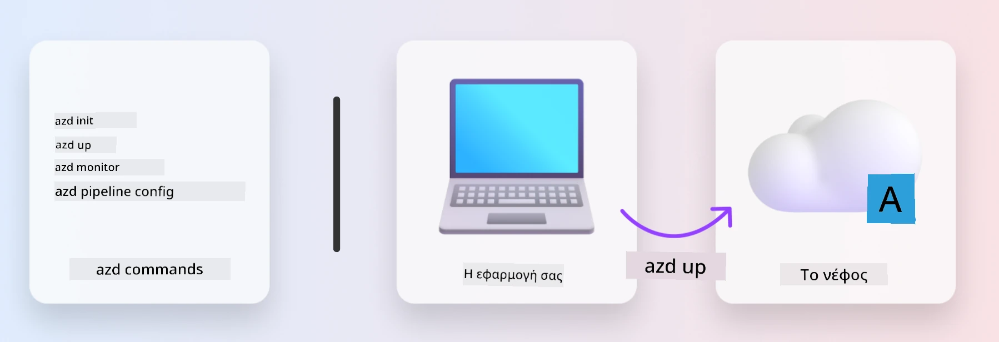
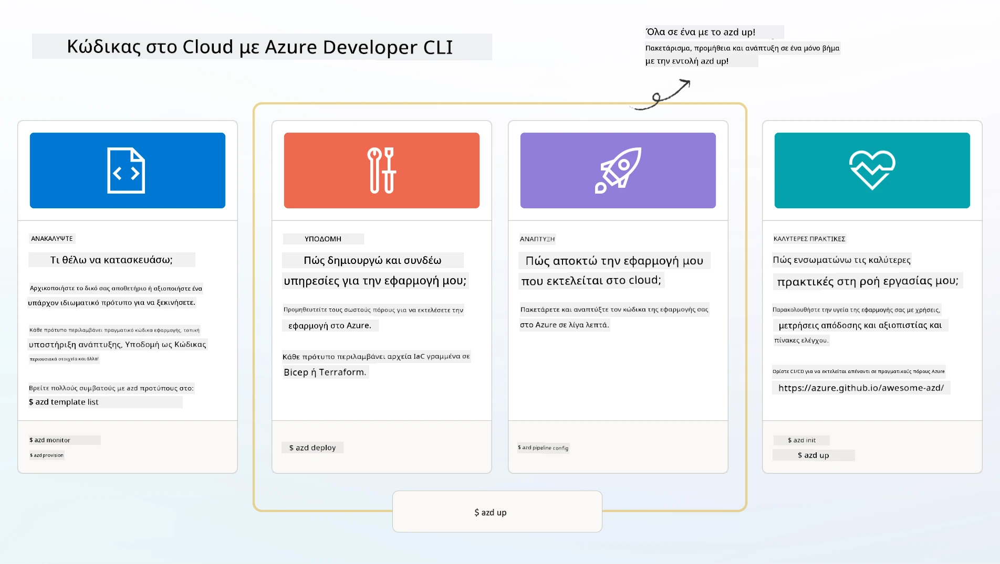

# 1. Επιλογή Προτύπου

!!! tip "ΣΤΟ ΤΕΛΟΣ ΑΥΤΟΥ ΤΟΥ ΜΟΝΤΟΥΛΟΥ ΘΑ ΜΠΟΡΕΙΤΕ ΝΑ"

    - [ ] Περιγράψετε τι είναι τα πρότυπα AZD
    - [ ] Ανακαλύψετε και χρησιμοποιήσετε πρότυπα AZD για AI
    - [ ] Ξεκινήσετε με το πρότυπο AI Agents
    - [ ] **Εργαστήριο 1:** AZD Quickstart με GitHub Codespaces

---

## 1. Αναλογία Κατασκευαστή

Η δημιουργία μιας σύγχρονης, έτοιμης για επιχειρήσεις AI εφαρμογής _από το μηδέν_ μπορεί να είναι τρομακτική. Είναι λίγο σαν να χτίζετε το νέο σας σπίτι μόνοι σας, τούβλο το τούβλο. Ναι, μπορεί να γίνει! Αλλά δεν είναι ο πιο αποδοτικός τρόπος για να πετύχετε το επιθυμητό τελικό αποτέλεσμα!

Αντίθετα, συχνά ξεκινάμε με ένα υπάρχον _σχέδιο αρχιτεκτονικής_, και συνεργαζόμαστε με έναν αρχιτέκτονα για να το προσαρμόσουμε στις προσωπικές μας απαιτήσεις. Και αυτή είναι ακριβώς η προσέγγιση που πρέπει να ακολουθήσετε όταν χτίζετε έξυπνες εφαρμογές. Πρώτα, βρείτε μια καλή σχεδιαστική αρχιτεκτονική που ταιριάζει στο χώρο προβλημάτων σας. Στη συνέχεια συνεργαστείτε με έναν solution architect για να προσαρμόσετε και να αναπτύξετε τη λύση για το συγκεκριμένο σας σενάριο.

Αλλά πού μπορούμε να βρούμε αυτά τα σχέδια αρχιτεκτονικής; Και πώς βρίσκουμε έναν αρχιτέκτονα που είναι πρόθυμος να μας διδάξει πώς να προσαρμόζουμε και να αναπτύσσουμε αυτά τα σχέδια μόνοι μας; Σε αυτό το εργαστήριο, απαντάμε σε αυτά τα ερωτήματα εισάγοντάς σας σε τρεις τεχνολογίες:

1. [Azure Developer CLI](https://aka.ms/azd) - ένα ανοιχτού κώδικα εργαλείο που επιταχύνει τη διαδρομή του προγραμματιστή από την τοπική ανάπτυξη (build) έως την αποστολή στο cloud (ship).
1. [Microsoft Foundry Templates](https://ai.azure.com/templates) - τυποποιημένα αποθετήρια ανοιχτού κώδικα που περιέχουν δείγματα κώδικα, υποδομή και αρχεία διαμόρφωσης για την ανάπτυξη μιας αρχιτεκτονικής λύσης AI.
1. [GitHub Copilot Agent Mode](https://code.visualstudio.com/docs/copilot/chat/chat-agent-mode) - ένας coding agent τεκμηριωμένος με γνώση του Azure, που μπορεί να μας καθοδηγήσει στην πλοήγηση του κώδικα και στις αλλαγές — χρησιμοποιώντας φυσική γλώσσα.

Με αυτά τα εργαλεία στο χέρι, μπορούμε τώρα να _ανακαλύψουμε_ το σωστό πρότυπο, να το _αναπτύξουμε_ για να επαληθεύσουμε ότι λειτουργεί, και να το _προσαρμόσουμε_ ώστε να ταιριάζει στα δικά μας σενάρια. Ας βουτήξουμε και να μάθουμε πώς λειτουργούν.

---

## 2. Azure Developer CLI

Το [Azure Developer CLI](https://learn.microsoft.com/en-us/azure/developer/azure-developer-cli/) (ή `azd`) είναι ένα ανοιχτού κώδικα εργαλείο γραμμής εντολών που μπορεί να επιταχύνει το ταξίδι σας από τον κώδικα στο cloud με ένα σύνολο φιλικών προς τον προγραμματιστή εντολών που λειτουργούν με συνέπεια στο IDE σας (development) και στα περιβάλλοντα CI/CD (devops).

Με το `azd`, το ταξίδι ανάπτυξής σας μπορεί να είναι τόσο απλό όσο:

- `azd init` - Αρχικοποιεί ένα νέο έργο AI από ένα υπάρχον πρότυπο AZD.
- `azd up` - Προβλέπει την υποδομή και αναπτύσσει την εφαρμογή σας σε ένα βήμα.
- `azd monitor` - Παρέχει παρακολούθηση σε πραγματικό χρόνο και διαγνωστικά για την αναπτυγμένη εφαρμογή σας.
- `azd pipeline config` - Ρυθμίζει CI/CD pipelines για αυτοματοποίηση της ανάπτυξης στο Azure.

**🎯 | ΑΣΚΗΣΗ**: <br/> Εξερευνήστε το εργαλείο γραμμής εντολών `azd` στο περιβάλλον GitHub Codespaces σας τώρα. Ξεκινήστε πληκτρολογώντας αυτή την εντολή για να δείτε τι μπορεί να κάνει το εργαλείο:

```bash title="" linenums="0"
azd help
```



---

## 3. Το Πρότυπο AZD

Για να επιτύχει αυτό το `azd`, χρειάζεται να γνωρίζει την υποδομή που θα προβλέψει, τις ρυθμίσεις διαμόρφωσης που θα εφαρμόσει, και την εφαρμογή που θα αναπτύξει. Εδώ μπαίνουν τα [AZD templates](https://learn.microsoft.com/en-us/azure/developer/azure-developer-cli/azd-templates?tabs=csharp).

Τα πρότυπα AZD είναι αποθετήρια ανοιχτού κώδικα που συνδυάζουν δείγματα κώδικα με αρχεία υποδομής και διαμόρφωσης που απαιτούνται για την ανάπτυξη της αρχιτεκτονικής λύσης. Χρησιμοποιώντας μια προσέγγιση _Infrastructure-as-Code_ (IaC), επιτρέπουν στον ορισμό πόρων προτύπου και στις ρυθμίσεις διαμόρφωσης να τελούν υπό έλεγχο έκδοσης (όπως ακριβώς και ο πηγαίος κώδικας της εφαρμογής) - δημιουργώντας επαναχρησιμοποιήσιμες και συνεπείς ροές εργασίας για τους χρήστες του έργου.

Όταν δημιουργείτε ή επαναχρησιμοποιείτε ένα πρότυπο AZD για _το_ σενάριό σας, σκεφτείτε αυτές τις ερωτήσεις:

1. Τι χτίζετε; → Υπάρχει πρότυπο που περιλαμβάνει αρχικό κώδικα για αυτό το σενάριο;
1. Πώς είναι σχεδιασμένη η λύση σας; → Υπάρχει πρότυπο που έχει τους απαραίτητους πόρους;
1. Πώς αναπτύσσεται η λύση σας; → Σκεφτείτε `azd deploy` με hooks προ/μετά επεξεργασίας!
1. Πώς μπορείτε να την βελτιστοποιήσετε περαιτέρω; → Σκεφτείτε ενσωματωμένη παρακολούθηση και αυτοματισμούς pipelines!

**🎯 | ΑΣΚΗΣΗ**: <br/> 
Επισκεφτείτε την γκαλερί [Awesome AZD](https://azure.github.io/awesome-azd/) και χρησιμοποιήστε τα φίλτρα για να εξερευνήσετε τα 250+ πρότυπα που είναι διαθέσιμα αυτή τη στιγμή. Δείτε αν μπορείτε να βρείτε ένα που να ταιριάζει στις απαιτήσεις _του δικού σας_ σεναρίου.



---

## 4. Πρότυπα Εφαρμογών AI

Για εφαρμογές με δυνατότητες AI, η Microsoft παρέχει εξειδικευμένα πρότυπα που περιλαμβάνουν **Microsoft Foundry** και **Foundry Agents**. Αυτά τα πρότυπα επιταχύνουν τη διαδρομή σας για να δημιουργήσετε έξυπνες, έτοιμες για παραγωγή εφαρμογές.

### Πρότυπα Microsoft Foundry & Foundry Agents

Επιλέξτε ένα πρότυπο παρακάτω για να το αναπτύξετε. Κάθε πρότυπο είναι διαθέσιμο στο [Awesome AZD](https://azure.github.io/awesome-azd/) και μπορεί να αρχικοποιηθεί με μία εντολή.

| Template | Description | Deploy Command |
|----------|-------------|----------------|
| **[AI Chat with RAG](https://azure.github.io/awesome-azd/?tags=ai&tags=rag)** | Εφαρμογή συνομιλίας με Retrieval Augmented Generation χρησιμοποιώντας το Microsoft Foundry | `azd init -t azure-samples/azure-search-openai-demo` |
| **[Foundry Agent Service Starter](https://azure.github.io/awesome-azd/?tags=ai&tags=agents)** | Δημιουργήστε AI agents με Foundry Agents για αυτοδύναμη εκτέλεση εργασιών | `azd init -t azure-samples/foundry-agent-service-starter` |
| **[Multi-Agent Orchestration](https://azure.github.io/awesome-azd/?tags=ai&tags=agents)** | Συντονίστε πολλαπλούς Foundry Agents για σύνθετα workflows | `azd init -t azure-samples/multi-agent-orchestration` |
| **[AI Document Intelligence](https://azure.github.io/awesome-azd/?tags=ai&tags=document)** | Εξαγωγή και ανάλυση εγγράφων με μοντέλα Microsoft Foundry | `azd init -t azure-samples/ai-document-processing` |
| **[Conversational AI Bot](https://azure.github.io/awesome-azd/?tags=ai&tags=bot)** | Δημιουργήστε έξυπνα chatbots με ενσωμάτωση Microsoft Foundry | `azd init -t azure-samples/ai-chat-protocol` |
| **[AI Image Generation](https://azure.github.io/awesome-azd/?tags=ai&tags=dalle)** | Δημιουργία εικόνων χρησιμοποιώντας DALL-E μέσω Microsoft Foundry | `azd init -t azure-samples/ai-image-generation` |
| **[Semantic Kernel Agent](https://azure.github.io/awesome-azd/?tags=ai&tags=semantic-kernel)** | AI agents που χρησιμοποιούν Semantic Kernel με Foundry Agents | `azd init -t azure-samples/semantic-kernel-agent` |
| **[AutoGen Multi-Agent](https://azure.github.io/awesome-azd/?tags=ai&tags=autogen)** | Πολυ-πρακτορικά συστήματα που χρησιμοποιούν το πλαίσιο AutoGen | `azd init -t azure-samples/autogen-multi-agent` |

### Γρήγορη Εκκίνηση

1. **Περιηγηθείτε στα πρότυπα**: Επισκεφτείτε [https://azure.github.io/awesome-azd/](https://azure.github.io/awesome-azd/) και φιλτράρετε κατά `AI`, `Agents`, ή `Microsoft Foundry`
2. **Επιλέξτε το πρότυπό σας**: Διαλέξτε ένα που ταιριάζει στην περίπτωσή σας
3. **Αρχικοποιήστε**: Εκτελέστε την εντολή `azd init` για το πρότυπο που επιλέξατε
4. **Αναπτύξτε**: Εκτελέστε `azd up` για να προβλέψετε και να αναπτύξετε

**🎯 | ΑΣΚΗΣΗ**: <br/>
Επιλέξτε ένα από τα παραπάνω πρότυπα με βάση το σενάριό σας:

- **Θέλετε να φτιάξετε chatbot;** → Ξεκινήστε με **AI Chat with RAG** ή **Conversational AI Bot**
- **Χρειάζεστε αυτόνομους agents;** → Δοκιμάστε **Foundry Agent Service Starter** ή **Multi-Agent Orchestration**
- **Επεξεργασία εγγράφων;** → Χρησιμοποιήστε **AI Document Intelligence**
- **Θέλετε βοήθεια στον κώδικα με AI;** → Εξερευνήστε **Semantic Kernel Agent** ή **AutoGen Multi-Agent**

```bash title="Example: Deploy the AI Chat with RAG template" linenums="0"
azd init -t azure-samples/azure-search-openai-demo
azd up
```

!!! info "Εξερευνήστε Περισσότερα Πρότυπα"
    Η συλλογή [Awesome AZD](https://azure.github.io/awesome-azd/) περιέχει πάνω από 250 πρότυπα. Χρησιμοποιήστε τα φίλτρα για να βρείτε πρότυπα που ταιριάζουν στις συγκεκριμένες απαιτήσεις σας για γλώσσα, πλαίσιο και υπηρεσίες Azure.

---

<!-- CO-OP TRANSLATOR DISCLAIMER START -->
Αποποίηση ευθυνών:
Αυτό το έγγραφο έχει μεταφραστεί χρησιμοποιώντας την υπηρεσία αυτόματης μετάφρασης με τεχνητή νοημοσύνη Co-op Translator (https://github.com/Azure/co-op-translator). Παρόλο που καταβάλλουμε προσπάθειες για την ακρίβεια, να λάβετε υπόψη ότι οι αυτοματοποιημένες μεταφράσεις ενδέχεται να περιέχουν σφάλματα ή ανακρίβειες. Το αρχικό έγγραφο στη γλώσσα του θεωρείται η αυθεντική πηγή. Για κρίσιμες πληροφορίες συνιστάται επαγγελματική ανθρώπινη μετάφραση. Δεν φέρουμε ευθύνη για οποιεσδήποτε παρερμηνείες ή λανθασμένες ερμηνείες που προκύπτουν από τη χρήση αυτής της μετάφρασης.
<!-- CO-OP TRANSLATOR DISCLAIMER END -->