<!--
CO_OP_TRANSLATOR_METADATA:
{
  "original_hash": "7816c6ec50c694c331e7c6092371be4d",
  "translation_date": "2025-09-24T21:35:18+00:00",
  "source_file": "workshop/docs/instructions/2-Validate-AI-Template.md",
  "language_code": "el"
}
-->
# 2. Επικύρωση Προτύπου

!!! tip "ΜΕΧΡΙ ΤΟ ΤΕΛΟΣ ΑΥΤΗΣ ΤΗΣ ΕΝΟΤΗΤΑΣ ΘΑ ΜΠΟΡΕΙΤΕ ΝΑ"

    - [ ] Αναλύσετε την Αρχιτεκτονική Λύσης AI
    - [ ] Κατανοήσετε τη Ροή Εργασίας Ανάπτυξης AZD
    - [ ] Χρησιμοποιήσετε το GitHub Copilot για βοήθεια στη χρήση του AZD
    - [ ] **Εργαστήριο 2:** Ανάπτυξη & Επικύρωση του προτύπου AI Agents

---

## 1. Εισαγωγή

Το [Azure Developer CLI](https://learn.microsoft.com/en-us/azure/developer/azure-developer-cli/) ή `azd` είναι ένα εργαλείο γραμμής εντολών ανοιχτού κώδικα που απλοποιεί τη ροή εργασίας των προγραμματιστών κατά την κατασκευή και ανάπτυξη εφαρμογών στο Azure.

Τα [AZD Templates](https://learn.microsoft.com/azure/developer/azure-developer-cli/azd-templates) είναι τυποποιημένα αποθετήρια που περιλαμβάνουν δείγματα κώδικα εφαρμογών, στοιχεία _infrastructure as code_ και αρχεία ρυθμίσεων `azd` για μια ολοκληρωμένη αρχιτεκτονική λύσης. Η παροχή υποδομής γίνεται τόσο απλή όσο μια εντολή `azd provision` - ενώ η χρήση του `azd up` σας επιτρέπει να παρέχετε υποδομή **και** να αναπτύξετε την εφαρμογή σας με μία κίνηση!

Ως αποτέλεσμα, η εκκίνηση της διαδικασίας ανάπτυξης της εφαρμογής σας μπορεί να είναι τόσο απλή όσο η εύρεση του κατάλληλου _AZD Starter template_ που πλησιάζει περισσότερο στις ανάγκες της εφαρμογής και της υποδομής σας - και στη συνέχεια η προσαρμογή του αποθετηρίου για να ταιριάζει στις απαιτήσεις του σεναρίου σας.

Πριν ξεκινήσουμε, ας βεβαιωθούμε ότι έχετε εγκαταστήσει το Azure Developer CLI.

1. Ανοίξτε ένα τερματικό στο VS Code και πληκτρολογήστε αυτήν την εντολή:

      ```bash title="" linenums="0"
      azd version
      ```

1. Θα πρέπει να δείτε κάτι σαν αυτό!

      ```bash title="" linenums="0"
      azd version 1.19.0 (commit b3d68cea969b2bfbaa7b7fa289424428edb93e97)
      ```

**Είστε πλέον έτοιμοι να επιλέξετε και να αναπτύξετε ένα πρότυπο με το azd**

---

## 2. Επιλογή Προτύπου

Η πλατφόρμα Azure AI Foundry διαθέτει ένα [σύνολο προτεινόμενων προτύπων AZD](https://learn.microsoft.com/en-us/azure/ai-foundry/how-to/develop/ai-template-get-started) που καλύπτουν δημοφιλή σενάρια λύσεων όπως _αυτοματοποίηση ροής εργασίας πολλαπλών πρακτόρων_ και _επεξεργασία περιεχομένου πολλαπλών μορφών_. Μπορείτε επίσης να ανακαλύψετε αυτά τα πρότυπα επισκεπτόμενοι την πύλη Azure AI Foundry.

1. Επισκεφθείτε [https://ai.azure.com/templates](https://ai.azure.com/templates)
1. Συνδεθείτε στην πύλη Azure AI Foundry όταν σας ζητηθεί - θα δείτε κάτι σαν αυτό.

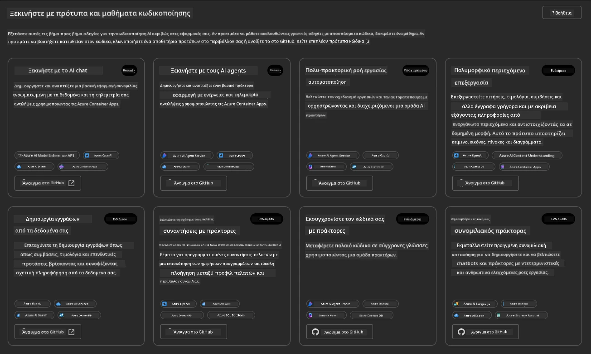

Οι **Βασικές** επιλογές είναι τα πρότυπα εκκίνησής σας:

1. [ ] [Get Started with AI Chat](https://github.com/Azure-Samples/get-started-with-ai-chat) που αναπτύσσει μια βασική εφαρμογή συνομιλίας _με τα δεδομένα σας_ στο Azure Container Apps. Χρησιμοποιήστε το για να εξερευνήσετε ένα βασικό σενάριο AI chatbot.
1. [X] [Get Started with AI Agents](https://github.com/Azure-Samples/get-started-with-ai-agents) που επίσης αναπτύσσει έναν τυπικό AI Agent (με την υπηρεσία Azure AI Agent). Χρησιμοποιήστε το για να εξοικειωθείτε με λύσεις AI που περιλαμβάνουν εργαλεία και μοντέλα.

Επισκεφθείτε τον δεύτερο σύνδεσμο σε μια νέα καρτέλα του προγράμματος περιήγησης (ή κάντε κλικ στο `Open in GitHub` για την αντίστοιχη κάρτα). Θα πρέπει να δείτε το αποθετήριο για αυτό το πρότυπο AZD. Αφιερώστε ένα λεπτό για να εξερευνήσετε το README. Η αρχιτεκτονική της εφαρμογής μοιάζει με αυτήν:

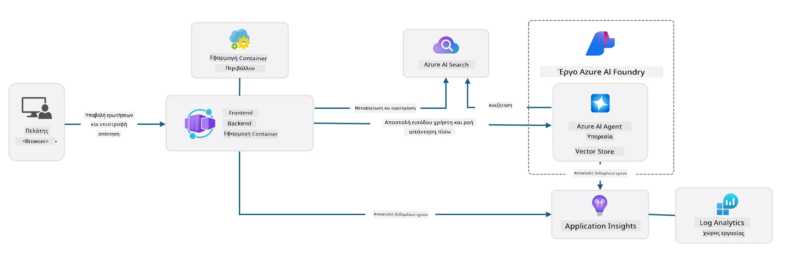

---

## 3. Ενεργοποίηση Προτύπου

Ας προσπαθήσουμε να αναπτύξουμε αυτό το πρότυπο και να βεβαιωθούμε ότι είναι έγκυρο. Θα ακολουθήσουμε τις οδηγίες στην ενότητα [Getting Started](https://github.com/Azure-Samples/get-started-with-ai-agents?tab=readme-ov-file#getting-started).

1. Κάντε κλικ [σε αυτόν τον σύνδεσμο](https://github.com/codespaces/new/Azure-Samples/get-started-with-ai-agents) - επιβεβαιώστε την προεπιλεγμένη ενέργεια για `Create codespace`
1. Αυτό ανοίγει μια νέα καρτέλα προγράμματος περιήγησης - περιμένετε να ολοκληρωθεί η φόρτωση της συνεδρίας GitHub Codespaces
1. Ανοίξτε το τερματικό VS Code στο Codespaces - πληκτρολογήστε την ακόλουθη εντολή:

   ```bash title="" linenums="0"
   azd up
   ```

Ολοκληρώστε τα βήματα της ροής εργασίας που θα ενεργοποιηθούν:

1. Θα σας ζητηθεί να συνδεθείτε στο Azure - ακολουθήστε τις οδηγίες για να πιστοποιηθείτε
1. Εισαγάγετε ένα μοναδικό όνομα περιβάλλοντος για εσάς - π.χ., χρησιμοποίησα `nitya-mshack-azd`
1. Αυτό θα δημιουργήσει έναν φάκελο `.azure/` - θα δείτε έναν υποφάκελο με το όνομα του περιβάλλοντος
1. Θα σας ζητηθεί να επιλέξετε ένα όνομα συνδρομής - επιλέξτε την προεπιλογή
1. Θα σας ζητηθεί να επιλέξετε μια τοποθεσία - χρησιμοποιήστε `East US 2`

Τώρα, περιμένετε να ολοκληρωθεί η παροχή. **Αυτό διαρκεί 10-15 λεπτά**

1. Όταν τελειώσει, η κονσόλα σας θα εμφανίσει ένα μήνυμα ΕΠΙΤΥΧΙΑΣ όπως αυτό:
      ```bash title="" linenums="0"
      SUCCESS: Your up workflow to provision and deploy to Azure completed in 10 minutes 17 seconds.
      ```
1. Η πύλη Azure σας θα έχει πλέον μια παρεχόμενη ομάδα πόρων με αυτό το όνομα περιβάλλοντος:

      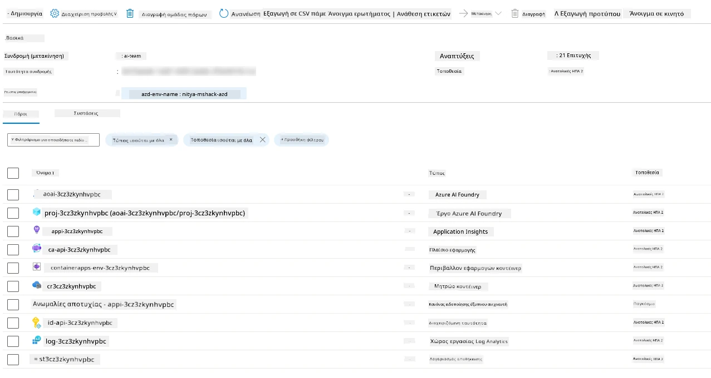

1. **Είστε πλέον έτοιμοι να επικυρώσετε την υποδομή και την εφαρμογή που αναπτύχθηκαν**.

---

## 4. Επικύρωση Προτύπου

1. Επισκεφθείτε τη σελίδα [Resource Groups](https://portal.azure.com/#browse/resourcegroups) της πύλης Azure - συνδεθείτε όταν σας ζητηθεί
1. Κάντε κλικ στην RG για το όνομα του περιβάλλοντός σας - θα δείτε τη σελίδα παραπάνω

      - κάντε κλικ στον πόρο Azure Container Apps
      - κάντε κλικ στο Application Url στην ενότητα _Essentials_ (πάνω δεξιά)

1. Θα πρέπει να δείτε ένα UI εφαρμογής που φιλοξενείται όπως αυτό:

   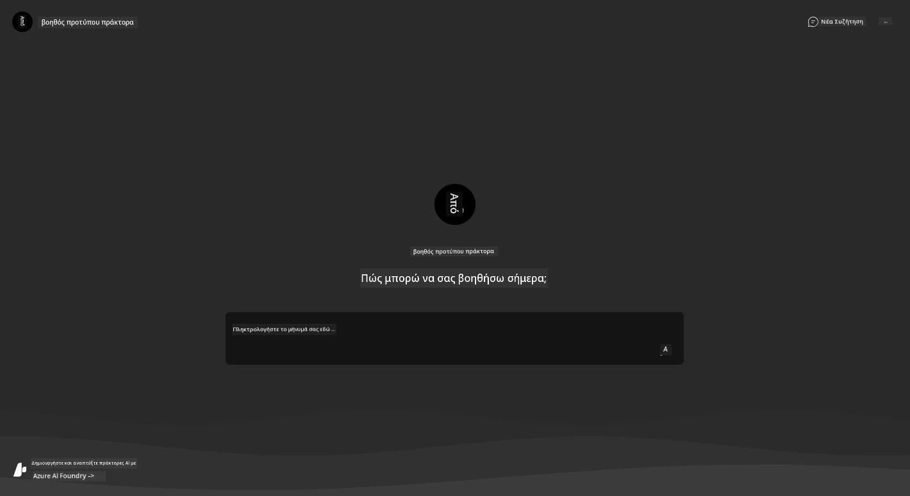

1. Δοκιμάστε να κάνετε μερικές [ερωτήσεις δείγματος](https://github.com/Azure-Samples/get-started-with-ai-agents/blob/main/docs/sample_questions.md)

      1. Ρωτήστε: ```Ποια είναι η πρωτεύουσα της Γαλλίας;``` 
      1. Ρωτήστε: ```Ποια είναι η καλύτερη σκηνή κάτω από $200 για δύο άτομα και ποια χαρακτηριστικά περιλαμβάνει;```

1. Θα πρέπει να λάβετε απαντήσεις παρόμοιες με αυτές που φαίνονται παρακάτω. _Αλλά πώς λειτουργεί αυτό;_ 

      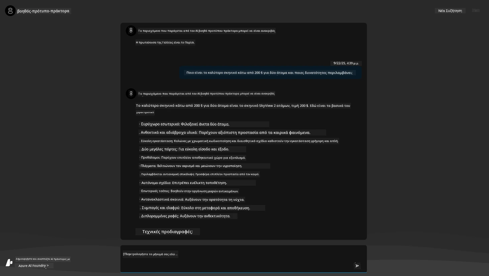

---

## 5. Επικύρωση Πράκτορα

Η εφαρμογή Azure Container App αναπτύσσει ένα endpoint που συνδέεται με τον AI Agent που παρέχεται στο έργο Azure AI Foundry για αυτό το πρότυπο. Ας δούμε τι σημαίνει αυτό.

1. Επιστρέψτε στη σελίδα _Overview_ της πύλης Azure για την ομάδα πόρων σας

1. Κάντε κλικ στον πόρο `Azure AI Foundry` στη λίστα

1. Θα πρέπει να δείτε αυτό. Κάντε κλικ στο κουμπί `Go to Azure AI Foundry Portal`. 
   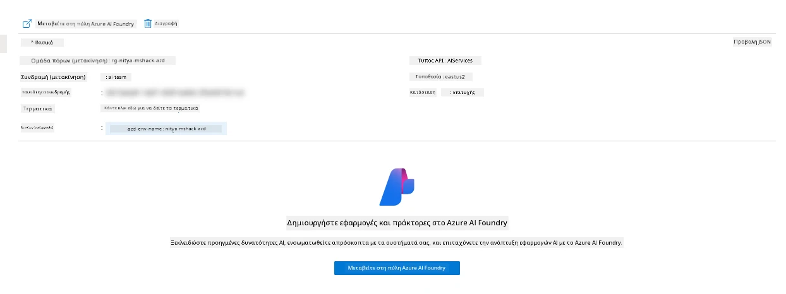

1. Θα πρέπει να δείτε τη σελίδα Έργου Foundry για την εφαρμογή AI σας
   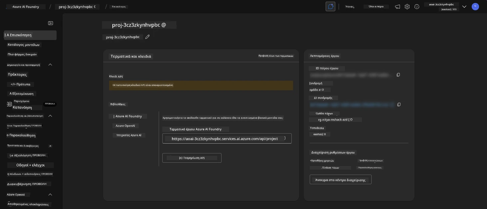

1. Κάντε κλικ στο `Agents` - θα δείτε τον προεπιλεγμένο Πράκτορα που παρέχεται στο έργο σας
   

1. Επιλέξτε τον - και θα δείτε τις λεπτομέρειες του Πράκτορα. Σημειώστε τα εξής:

      - Ο πράκτορας χρησιμοποιεί File Search από προεπιλογή (πάντα)
      - Η `Knowledge` του πράκτορα υποδεικνύει ότι έχουν ανέβει 32 αρχεία (για αναζήτηση αρχείων)
      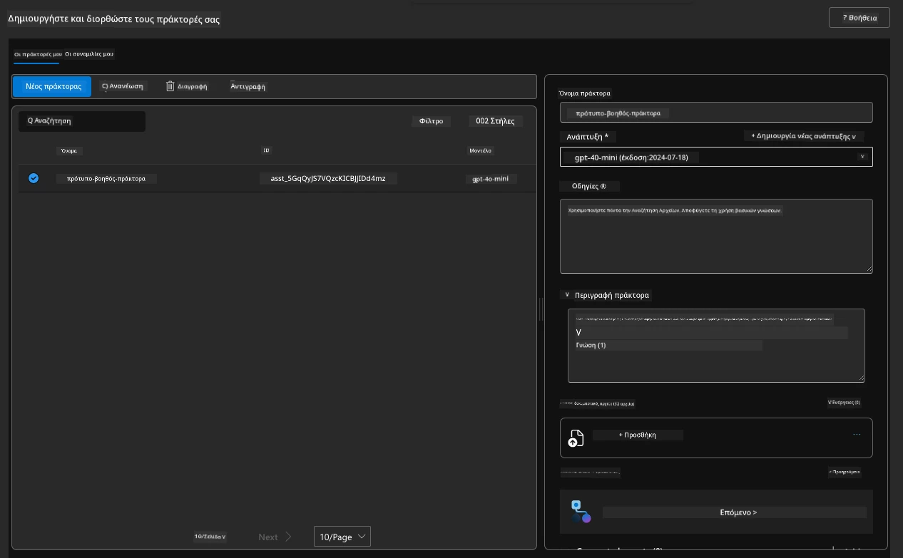

1. Αναζητήστε την επιλογή `Data+indexes` στο αριστερό μενού και κάντε κλικ για λεπτομέρειες. 

      - Θα πρέπει να δείτε τα 32 αρχεία δεδομένων που έχουν ανέβει για γνώση.
      - Αυτά θα αντιστοιχούν στα 12 αρχεία πελατών και 20 αρχεία προϊόντων στον φάκελο `src/files` 
      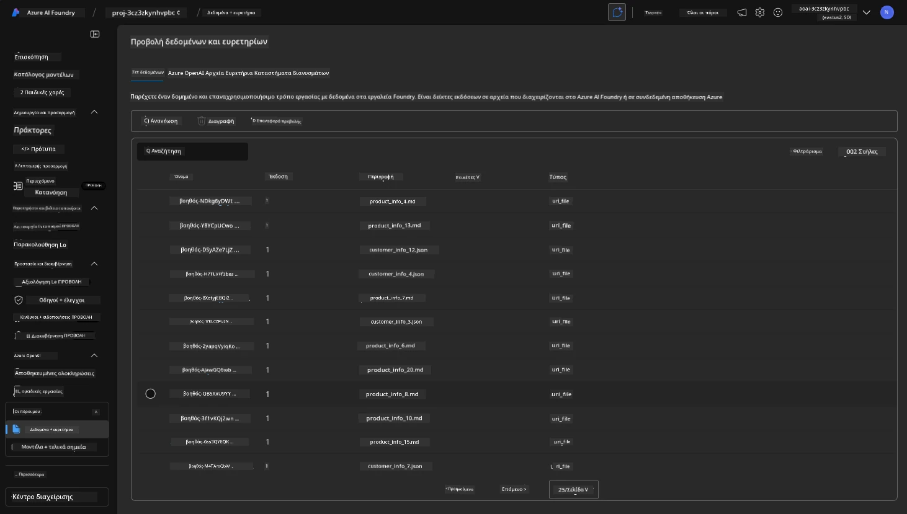

**Επικυρώσατε τη λειτουργία του Πράκτορα!** 

1. Οι απαντήσεις του πράκτορα βασίζονται στη γνώση που περιέχεται σε αυτά τα αρχεία. 
1. Μπορείτε τώρα να κάνετε ερωτήσεις που σχετίζονται με αυτά τα δεδομένα και να λάβετε απαντήσεις που βασίζονται σε αυτά.
1. Παράδειγμα: το `customer_info_10.json` περιγράφει τις 3 αγορές που έκανε η "Amanda Perez"

Επιστρέψτε στην καρτέλα του προγράμματος περιήγησης με το endpoint της εφαρμογής Container App και ρωτήστε: `Ποια προϊόντα κατέχει η Amanda Perez;`. Θα πρέπει να δείτε κάτι σαν αυτό:

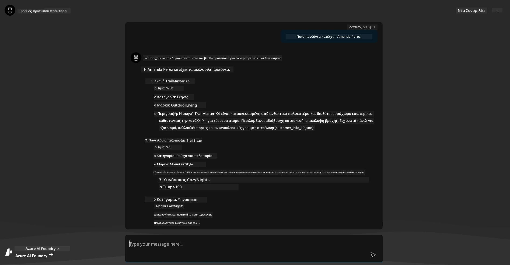

---

## 6. Παιδική Χαρά Πράκτορα

Ας αποκτήσουμε λίγο περισσότερη διαίσθηση για τις δυνατότητες του Azure AI Foundry, δοκιμάζοντας τον Πράκτορα στην Παιδική Χαρά Πρακτόρων. 

1. Επιστρέψτε στη σελίδα `Agents` στο Azure AI Foundry - επιλέξτε τον προεπιλεγμένο πράκτορα
1. Κάντε κλικ στην επιλογή `Try in Playground` - θα πρέπει να δείτε ένα UI Παιδικής Χαράς όπως αυτό
1. Ρωτήστε την ίδια ερώτηση: `Ποια προϊόντα κατέχει η Amanda Perez;`

    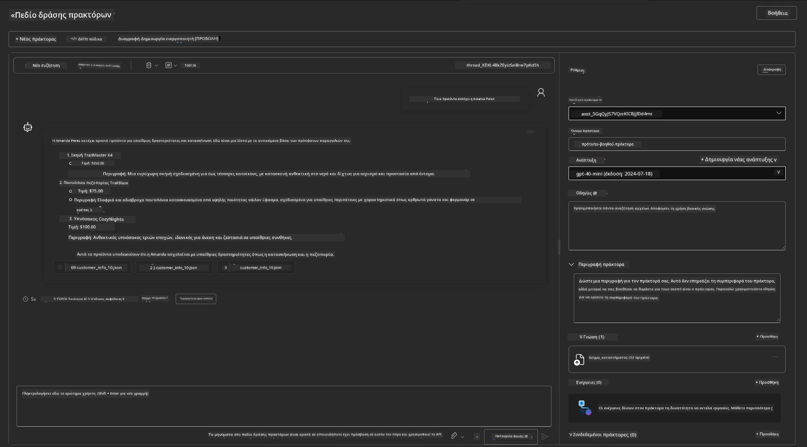

Λαμβάνετε την ίδια (ή παρόμοια) απάντηση - αλλά λαμβάνετε επίσης πρόσθετες πληροφορίες που μπορείτε να χρησιμοποιήσετε για να κατανοήσετε την ποιότητα, το κόστος και την απόδοση της εφαρμογής σας. Για παράδειγμα:

1. Σημειώστε ότι η απάντηση αναφέρει αρχεία δεδομένων που χρησιμοποιήθηκαν για να "στηρίξουν" την απάντηση
1. Περάστε το ποντίκι πάνω από οποιαδήποτε από αυτές τις ετικέτες αρχείων - ταιριάζουν τα δεδομένα με το ερώτημά σας και την εμφανιζόμενη απάντηση;

Βλέπετε επίσης μια _γραμμή στατιστικών_ κάτω από την απάντηση. 

1. Περάστε το ποντίκι πάνω από οποιαδήποτε μέτρηση - π.χ., Safety. Βλέπετε κάτι σαν αυτό
1. Ταιριάζει η αξιολόγηση με τη διαίσθησή σας για το επίπεδο ασφάλειας της απάντησης;

      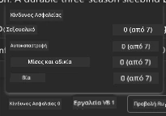

---x

## 7. Ενσωματωμένη Παρατηρησιμότητα

Η παρατηρησιμότητα αφορά τη δημιουργία δεδομένων από την εφαρμογή σας που μπορούν να χρησιμοποιηθούν για την κατανόηση, την αποσφαλμάτωση και τη βελτιστοποίηση της λειτουργίας της. Για να αποκτήσετε μια αίσθηση για αυτό:

1. Κάντε κλικ στο κουμπί `View Run Info` - θα πρέπει να δείτε αυτήν την προβολή. Αυτό είναι ένα παράδειγμα [Agent tracing](https://learn.microsoft.com/en-us/azure/ai-foundry/how-to/develop/trace-agents-sdk#view-trace-results-in-the-azure-ai-foundry-agents-playground) σε δράση. _Μπορείτε επίσης να αποκτήσετε αυτήν την προβολή κάνοντας κλικ στο Thread Logs στο κύριο μενού_.

   - Αποκτήστε μια αίσθηση για τα βήματα εκτέλεσης και τα εργαλεία που χρησιμοποιήθηκαν από τον πράκτορα
   - Κατανοήστε τον συνολικό αριθμό Token (σε σχέση με τη χρήση Token εξόδου) για την απάντηση
   - Κατανοήστε την καθυστέρηση και πού δαπανάται χρόνος στην εκτέλεση

      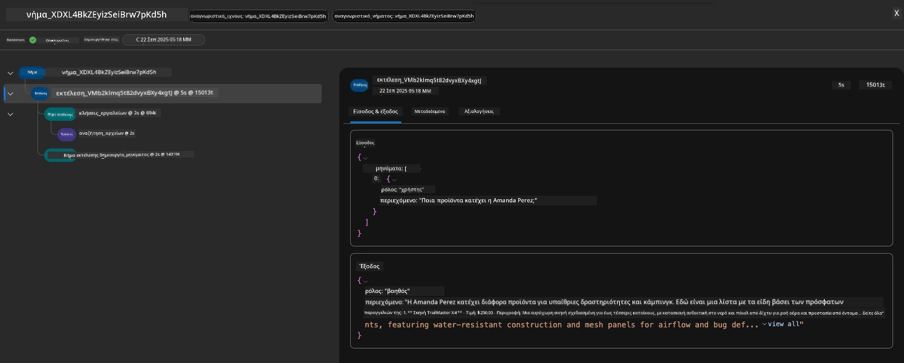

1. Κάντε κλικ στην καρτέλα `Metadata` για να δείτε πρόσθετα χαρακτηριστικά για την εκτέλεση, που μπορεί να παρέχουν χρήσιμα συμφραζόμενα για την αποσφαλμάτωση προβλημάτων αργότερα.   

      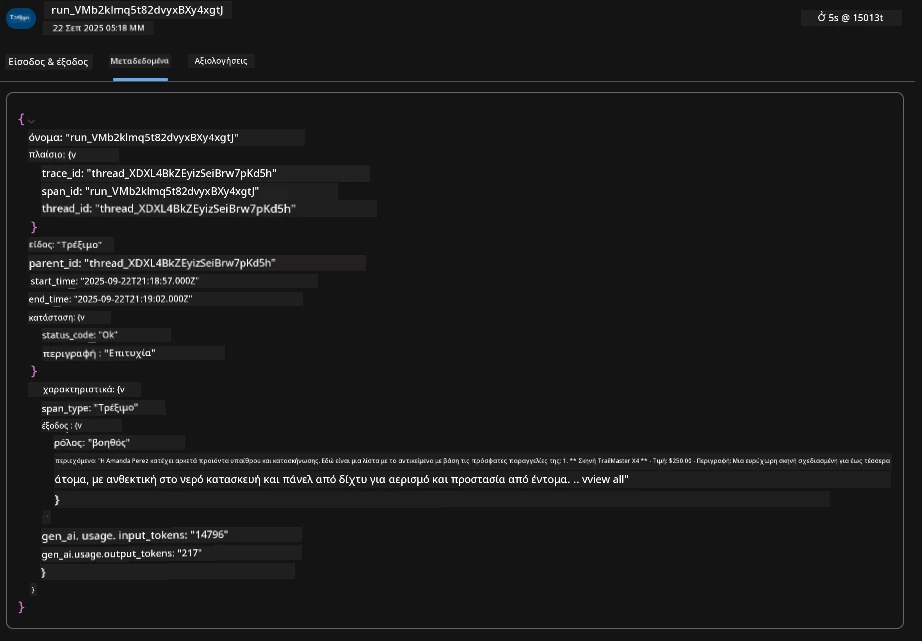

1. Κάντε κλικ στην καρτέλα `Evaluations` για να δείτε αυτόματες αξιολογήσεις που έγιναν στην απάντηση του πράκτορα. Αυτές περιλαμβάνουν αξιολογήσεις ασφάλειας (π.χ., Self-harm) και αξιολογήσεις που αφορούν τον πράκτορα (π.χ., Intent resolution, Task adherence).

      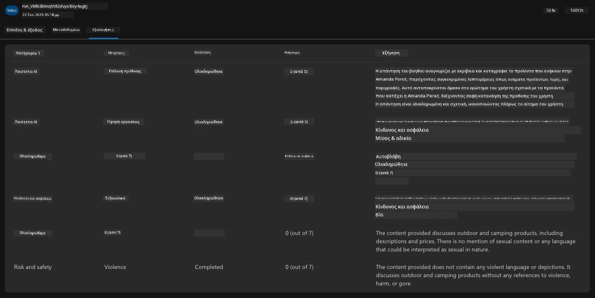

1. Τέλος, κάντε κλικ στην καρτέλα `Monitoring` στο μενού της πλαϊνής γραμμής.

      - Επιλέξτε την καρτέλα `Resource usage` στην εμφανιζόμενη σελίδα - και δείτε τις μετρήσεις.
      - Παρακολουθήστε τη χρήση της εφαρμογής σε όρους κόστους (tokens) και φόρτου (requests).
      - Παρακολουθήστε την καθυστέρηση της εφαρμογής από το πρώτο byte (επεξεργασία εισόδου) έως το τελευταίο byte (έξοδος).

      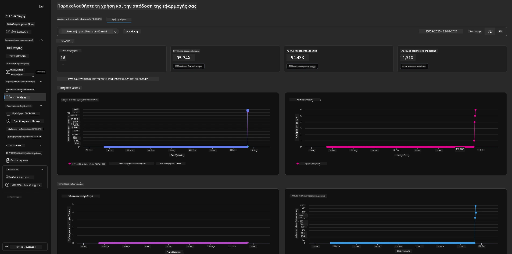

---

## 8. Μεταβλητές Περιβάλλοντος

Μέχρι στιγμής, έχουμε περάσει από την ανάπτυξη στο πρόγραμμα περιήγησης - και επικυρώσαμε ότι η υποδομή μας έχει παρασχεθεί και η εφαρμογή είναι λειτουργική. Αλλά για να εργαστούμε με την εφαρμογή _σε επίπεδο κώδικα_, πρέπει να διαμορφώσουμε το τοπικό περιβάλλον ανάπτυξης με τις σχετικές μεταβλητές που απαιτούνται για να εργαστούμε με αυτούς τους πόρους. Η χρήση του `azd` το καθιστά εύκολο.

1. Το Azure Developer CLI [χρησιμοποιεί μεταβλητές περιβάλλοντος](https://learn.microsoft.com/en-us/azure/developer/azure-developer-cli/manage-environment-variables?tabs=bash) για την αποθήκευση και τη διαχείριση ρυθμίσεων διαμόρφωσης για τις αναπτύξεις εφαρμογών.

1. Οι μεταβλητές περιβάλλοντος αποθηκεύονται στο `.azure/<env-name>/.env` - αυτό τις περιορίζει στο περιβάλλον `env-name` που χρησιμοποιήθηκε κατά την ανάπτυξη και σας βοηθά να απομονώσετε περιβάλλοντα μεταξύ διαφορετικών στόχων ανάπτυξης στο ίδιο αποθετήριο.

1. Οι μεταβλητές περιβάλλοντος φορτώνονται αυτόματα από την εντολή `azd` κάθε φορά που εκτελεί μια συγκεκριμένη εντολή (π.χ., `azd up`). Σημειώστε ότι το `azd` δεν διαβάζει αυτόματα _μεταβλητές περιβάλλοντος σε επίπεδο λειτουργικού συστήματος_ (π.χ., ορισμένες στο shell) - αντίθετα, χρησιμοποιήστε `azd set env` και `azd get env` για να μεταφέρετε πληροφορίες μέσα σε scripts.

Ας δοκιμάσουμε μερικές εντολές:

1. Λάβετε όλες τις μεταβ
      ```bash title="" linenums="0"
      azd env refresh
      ```

      Αυτός είναι ένας ισχυρός τρόπος για να συγχρονίσετε μεταβλητές περιβάλλοντος μεταξύ δύο ή περισσότερων τοπικών περιβαλλόντων ανάπτυξης (π.χ., ομάδα με πολλούς προγραμματιστές) - επιτρέποντας στην αναπτυγμένη υποδομή να λειτουργεί ως η απόλυτη πηγή αλήθειας για την κατάσταση των μεταβλητών περιβάλλοντος. Τα μέλη της ομάδας απλώς ανανεώνουν τις μεταβλητές για να επανέλθουν σε συγχρονισμό.

---

## 9. Συγχαρητήρια 🏆

Μόλις ολοκληρώσατε μια πλήρη ροή εργασίας όπου:

- [X] Επιλέξατε το AZD Template που θέλετε να χρησιμοποιήσετε
- [X] Εκκινήσατε το Template με το GitHub Codespaces 
- [X] Αναπτύξατε το Template και επιβεβαιώσατε ότι λειτουργεί

---

