# 2. Validate a Template

!!! tip "ΣΤΟ ΤΕΛΟΣ ΑΥΤΗΣ ΤΗΣ ΕΝΟΤΗΤΑΣ ΘΑ ΜΠΟΡΕΙΤΕ ΝΑ"

    - [ ] Αναλύσετε την Αρχιτεκτονική Λύσης AI
    - [ ] Κατανοήσετε τη ροή εργασίας ανάπτυξης με AZD
    - [ ] Χρησιμοποιήσετε το GitHub Copilot για βοήθεια στη χρήση του AZD
    - [ ] **Lab 2:** Αναπτύξτε και Επαληθεύστε το πρότυπο AI Agents

---


## 1. Introduction

The [Azure Developer CLI](https://learn.microsoft.com/en-us/azure/developer/azure-developer-cli/) or `azd` is an open-source commandline tool that streamlines the developer workflow when building and deploying applications to Azure. 

[AZD Templates](https://learn.microsoft.com/azure/developer/azure-developer-cli/azd-templates) are standardized repositories that include sample application code, _υποδομή-ως-κώδικα_ assets, and `azd` configuration files for a cohesive solution architecture. Provisioning the infrastructure becomes as simple as an `azd provision` command - while using `azd up` allows you to provision infrastructure **and** deploy your application at one shot!

As a result, jumpstarting your application development process can be as simple as finding the right _AZD Starter template_ that comes closest to your application and infrastructure needs - then customizing the repository to suit your scenario requirements.

Before we begin, let's make sure you have the Azure Developer CLI installed.

1. Open a VS Code terminal and type this command:

      ```bash title="" linenums="0"
      azd version
      ```

1. You should see something like this!

      ```bash title="" linenums="0"
      azd version 1.19.0 (commit b3d68cea969b2bfbaa7b7fa289424428edb93e97)
      ```

**You are now ready to select and deploy a template with azd**

---

## 2. Template Selection

The Microsoft Foundry platform comes with a [set of recommended AZD templates](https://learn.microsoft.com/en-us/azure/ai-foundry/how-to/develop/ai-template-get-started) that cover popular solution scenarios like _multi-agent workflow atomation_ and _multi-modal content processing_. You can also discover these templates by visiting the Microsoft Foundry portal.

1. Επισκεφτείτε [https://ai.azure.com/templates](https://ai.azure.com/templates)
1. Συνδεθείτε στο Microsoft Foundry portal όταν σας ζητηθεί - θα δείτε κάτι σαν αυτό.

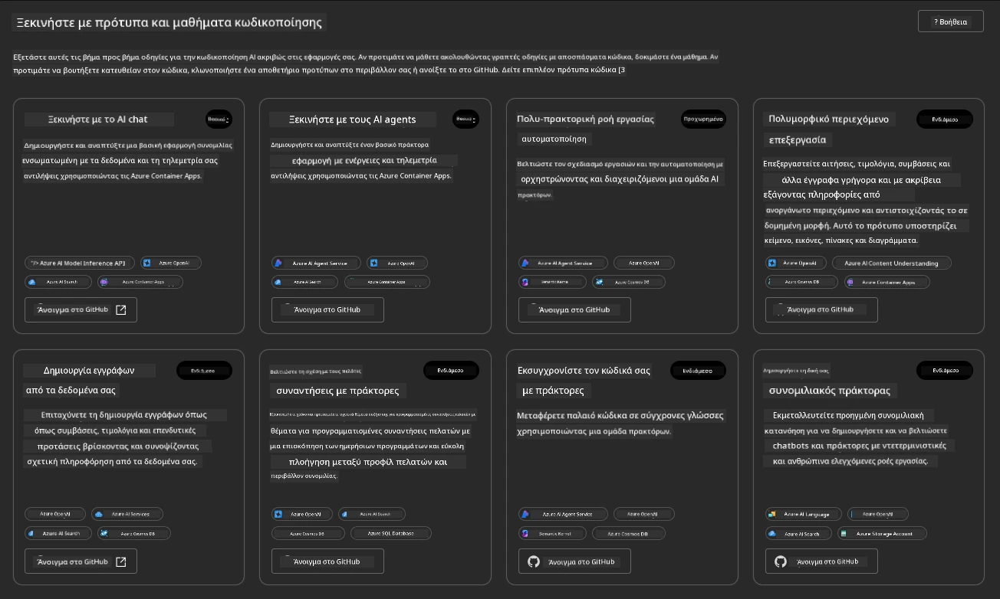


The **Basic** options are your starter templates:

1. [ ] [Get Started with AI Chat](https://github.com/Azure-Samples/get-started-with-ai-chat) που αναπτύσσει μια βασική εφαρμογή συνομιλίας _με τα δεδομένα σας_ στο Azure Container Apps. Χρησιμοποιήστε αυτό για να εξερευνήσετε ένα βασικό σενάριο chatbot AI.
1. [X] [Get Started with AI Agents](https://github.com/Azure-Samples/get-started-with-ai-agents) που επίσης αναπτύσσει ένα πρότυπο AI Agent (με τους Foundry Agents). Χρησιμοποιήστε το για να εξοικειωθείτε με λύσεις AI που χρησιμοποιούν πράκτορες και περιλαμβάνουν εργαλεία και μοντέλα.

Visit the second link in a new browser tab (or click `Open in GitHub` for the related card). You should see the repository for this AZD Template. Take a minute to explore the README. The application architecture looks like this:

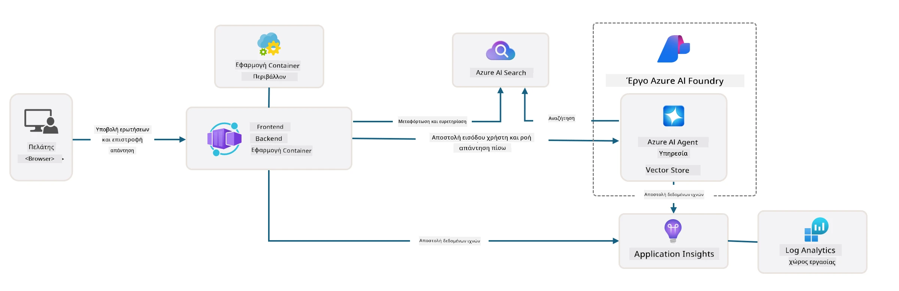

---

## 3. Template Activation

Let's try to deploy this template and make sure it is valid. We'll follow the guidelines in the [Getting Started](https://github.com/Azure-Samples/get-started-with-ai-agents?tab=readme-ov-file#getting-started) section.

1. Κάντε κλικ σε [αυτόν τον σύνδεσμο](https://github.com/codespaces/new/Azure-Samples/get-started-with-ai-agents) - επιβεβαιώστε την προεπιλεγμένη ενέργεια `Create codespace`
1. Αυτό ανοίγει μια νέα καρτέλα προγράμματος περιήγησης - περιμένετε μέχρι να ολοκληρωθεί η φόρτωση της συνεδρίας GitHub Codespaces
1. Ανοίξτε το τερματικό του VS Code στα Codespaces - πληκτρολογήστε την ακόλουθη εντολή:

   ```bash title="" linenums="0"
   azd up
   ```

Complete the workflow steps that this will trigger:

1. Θα σας ζητηθεί να συνδεθείτε στο Azure - ακολουθήστε τις οδηγίες για να πιστοποιηθείτε
1. Εισαγάγετε ένα μοναδικό όνομα περιβάλλοντος για εσάς - π.χ., εγώ χρησιμοποίησα `nitya-mshack-azd`
1. Αυτό θα δημιουργήσει έναν φάκελο `.azure/` - θα δείτε έναν υποφάκελο με το όνομα του περιβάλλοντος
1. Θα σας ζητηθεί να επιλέξετε ένα όνομα συνδρομής - επιλέξτε την προεπιλογή
1. Θα σας ζητηθεί μια τοποθεσία - χρησιμοποιήστε `East US 2`

Now, you wait for the provisioning to complete. **This takes 10-15 minutes**

1. When done, your console will show a SUCCESS message like this:
      ```bash title="" linenums="0"
      SUCCESS: Your up workflow to provision and deploy to Azure completed in 10 minutes 17 seconds.
      ```
1. Your Azure Portal will now have a provisioned resource group with that env name:

      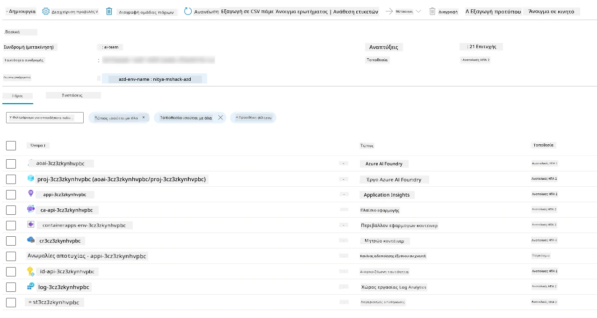

1. **You are now ready to validate the deployed infrastructure and application**.

---

## 4. Template Validation

1. Επισκεφτείτε τη σελίδα Azure Portal [Ομάδες πόρων](https://portal.azure.com/#browse/resourcegroups) - συνδεθείτε όταν σας ζητηθεί
1. Κάντε κλικ στην RG για το όνομα του περιβάλλοντός σας - θα δείτε τη σελίδα παραπάνω

      - κάντε κλικ στον πόρο Azure Container Apps
      - κάντε κλικ στο Application Url στην ενότητα _Essentials_ (επάνω δεξιά)

1. Θα πρέπει να δείτε ένα φιλοξενούμενο front-end UI εφαρμογής όπως αυτό:

   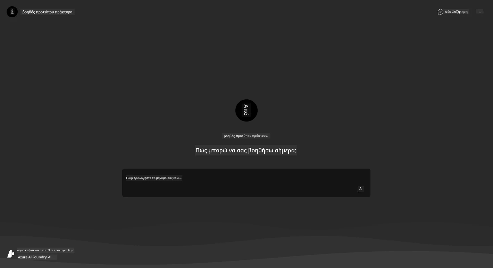

1. Δοκιμάστε να κάνετε μερικές από τις [παραδείγματα ερωτήσεων](https://github.com/Azure-Samples/get-started-with-ai-agents/blob/main/docs/sample_questions.md)

      1. Ρωτήστε: ```What is the capital of France?``` 
      1. Ρωτήστε: ```What's the best tent under $200 for two people, and what features does it include?```

1. Θα πρέπει να λάβετε απαντήσεις παρόμοιες με αυτές που εμφανίζονται παρακάτω. _Αλλά πώς λειτουργεί αυτό;_ 

      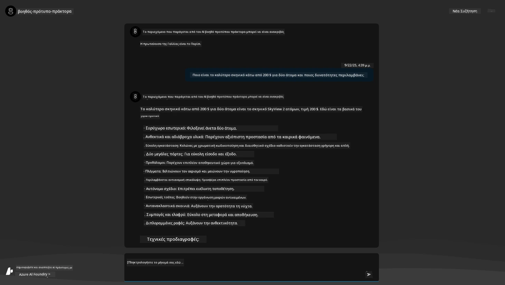

---

## 5.  Agent Validation

The Azure Container App deploys an endpoint that connects to the AI Agent provisioned in the Microsoft Foundry project for this template. Let's take a look at what that means.

1. Επιστρέψτε στη σελίδα _Overview_ του Azure Portal για την ομάδα πόρων σας

1. Κάντε κλικ στον πόρο `Microsoft Foundry` στη λίστα

1. Θα δείτε αυτό. Κάντε κλικ στο κουμπί `Go to Microsoft Foundry Portal`. 
   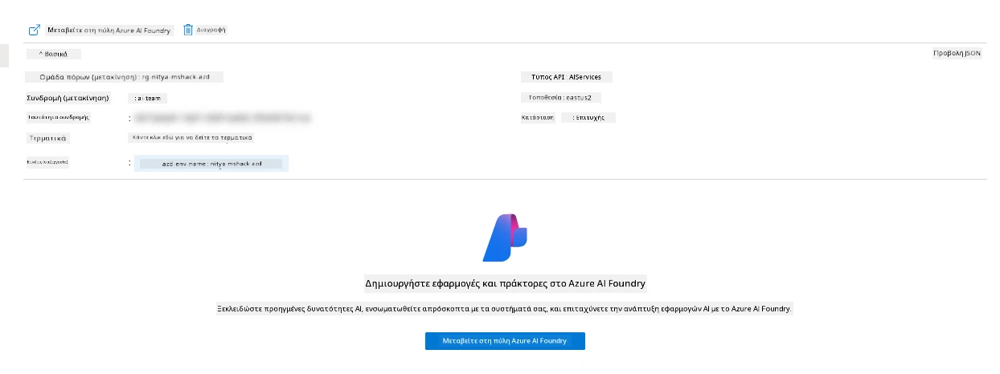

1. Θα δείτε τη σελίδα έργου Foundry για την εφαρμογή AI σας
   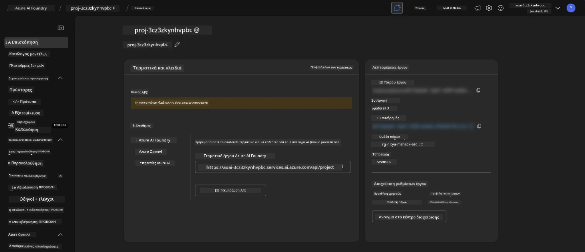

1. Κάντε κλικ στο `Agents` - θα δείτε τον προεπιλεγμένο Πράκτορα που έχει προμηθευτεί στο έργο σας
   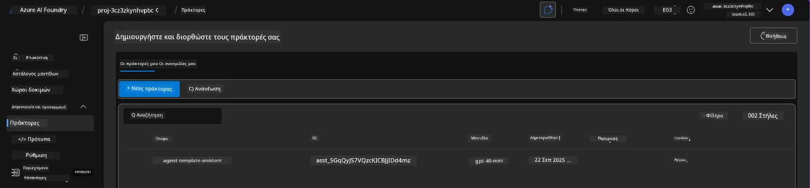

1. Επιλέξτε τον - και θα δείτε τις λεπτομέρειες του Πράκτορα. Σημειώστε τα εξής:

      - Ο πράκτορας χρησιμοποιεί File Search εξ ορισμού (πάντα)
      - Η ένδειξη `Knowledge` υποδεικνύει ότι έχουν ανεβεί 32 αρχεία (για αναζήτηση αρχείων)
      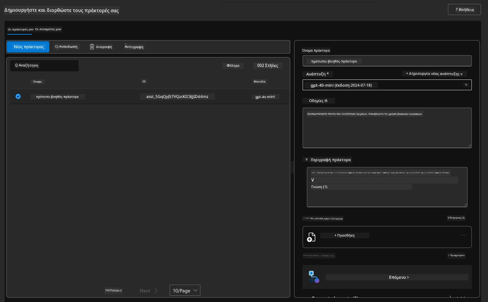

1. Αναζητήστε την επιλογή `Data+indexes` στο αριστερό μενού και κάντε κλικ για λεπτομέρειες. 

      - Θα δείτε τα 32 αρχεία δεδομένων που ανεβήκαν για γνώση.
      - Αυτά αντιστοιχούν στα 12 αρχεία πελατών και τα 20 αρχεία προϊόντων κάτω από `src/files` 
      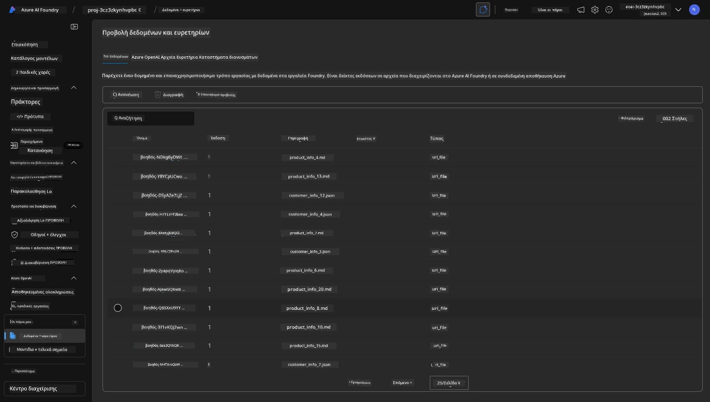

**Επικυρώσατε τη λειτουργία του Πράκτορα!** 

1. Οι απαντήσεις του πράκτορα βασίζονται στη γνώση αυτών των αρχείων. 
1. Τώρα μπορείτε να κάνετε ερωτήσεις σχετικές με αυτά τα δεδομένα και να λαμβάνετε τεκμηριωμένες απαντήσεις.
1. Παράδειγμα: `customer_info_10.json` περιγράφει τις 3 αγορές που έκανε η "Amanda Perez"

Επιστρέψτε στην καρτέλα του προγράμματος περιήγησης με το endpoint του Container App και ρωτήστε: `What products does Amanda Perez own?`. Θα πρέπει να δείτε κάτι σαν αυτό:

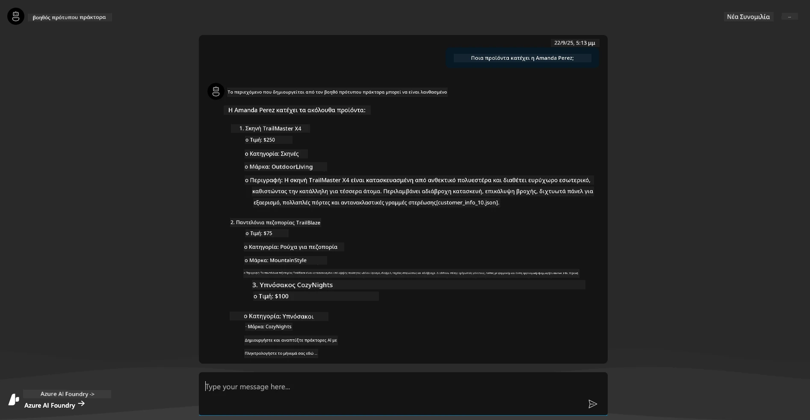

---

## 6. Agent Playground

Let's build a bit more intuition for the capabilities of Microsoft Foundry, by taking the Agent for a spin in the Agents Playground. 

1. Επιστρέψτε στη σελίδα `Agents` στο Microsoft Foundry - επιλέξτε τον προεπιλεγμένο πράκτορα
1. Κάντε κλικ στην επιλογή `Try in Playground` - θα δείτε ένα UI Playground όπως αυτό
1. Ρωτήστε την ίδια ερώτηση: `What products does Amanda Perez own?`

    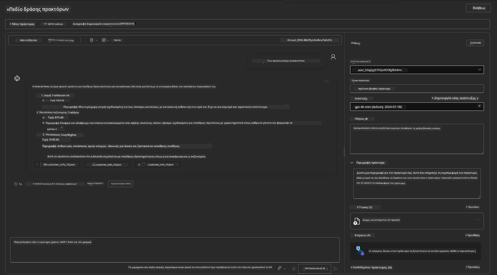

You get the same (or similar) response - but you also get additional information that you can use to understand the quality, cost, and performance of your agentic app. For example:

1. Σημειώστε ότι η απάντηση αναφέρει αρχεία δεδομένων που χρησιμοποιήθηκαν για να "τεκμηριώσουν" την απάντηση
1. Τοποθετήστε το δείκτη πάνω από οποιαδήποτε από αυτές τις ετικέτες αρχείων - τα δεδομένα ταιριάζουν με το ερώτημά σας και την εμφανιζόμενη απάντηση;

You also see a _stats_ row below the response. 

1. Τοποθετήστε το δείκτη πάνω από οποιοδήποτε μέτρικο - π.χ., Safety. Θα δείτε κάτι σαν αυτό
1. Η εκτιμημένη βαθμολογία ταιριάζει με την αντίληψή σας για το επίπεδο ασφάλειας της απάντησης;

      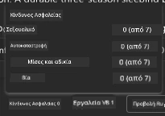

---

## 7. Built-in Observability

Observability is about instrumenting your application to generate data that can be used to understand, debug, and optimize, its operations. To get a sense for this:

1. Κάντε κλικ στο κουμπί `View Run Info` - θα δείτε αυτή την προβολή. Αυτό είναι ένα παράδειγμα [Agent tracing](https://learn.microsoft.com/en-us/azure/ai-foundry/how-to/develop/trace-agents-sdk#view-trace-results-in-the-azure-ai-foundry-agents-playground) σε δράση. _Μπορείτε επίσης να αποκτήσετε αυτήν την προβολή κάνοντας κλικ στο Thread Logs στο μενού ανώτατου επιπέδου_.

   - Πάρτε μια ιδέα για τα βήματα εκτέλεσης και τα εργαλεία που χρησιμοποίησε ο πράκτορας
   - Κατανοήστε τον συνολικό αριθμό Token (σε σχέση με τη χρήση token εξόδου) για την απάντηση
   - Κατανοήστε την καθυστέρηση και πού δαπανάται ο χρόνος στην εκτέλεση

      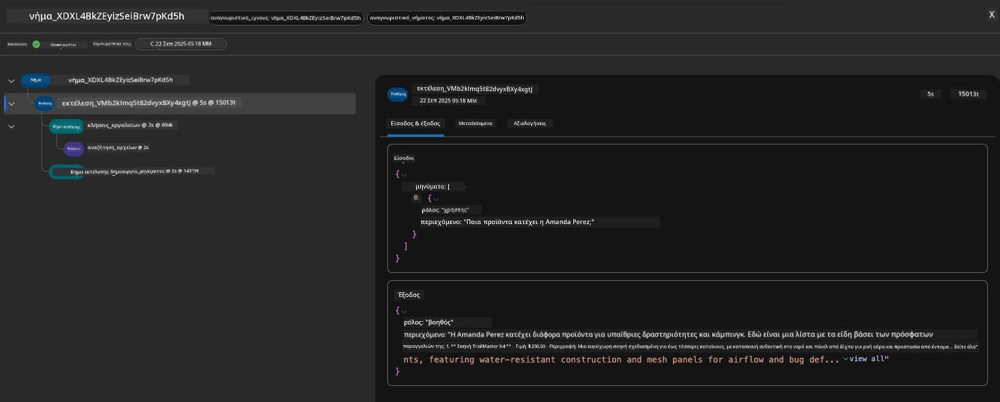

1. Κάντε κλικ στην καρτέλα `Metadata` για να δείτε επιπλέον χαρακτηριστικά της εκτέλεσης, που μπορεί να παρέχουν χρήσιμο πλαίσιο για τον εντοπισμό σφαλμάτων αργότερα.   

      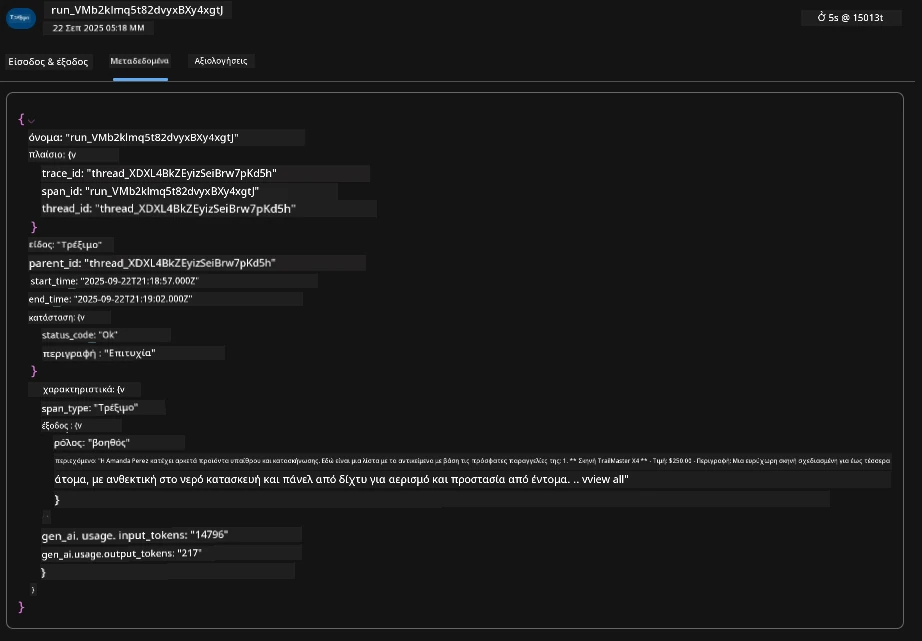


1. Κάντε κλικ στην καρτέλα `Evaluations` για να δείτε τις αυτόματες αξιολογήσεις που έγιναν στην απάντηση του πράκτορα. Αυτές περιλαμβάνουν αξιολογήσεις ασφάλειας (π.χ., Self-harm) και αξιολογήσεις συγκεκριμένες για τον πράκτορα (π.χ., Επίλυση προθέσεων, Συμμόρφωση με το έργο).

      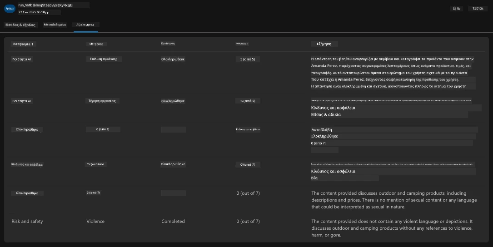

1. Τέλος, κάντε κλικ στην καρτέλα `Monitoring` στο πλαϊνό μενού.

      - Επιλέξτε την καρτέλα `Resource usage` στη σελίδα που εμφανίζεται - και δείτε τα metrics.
      - Παρακολουθήστε τη χρήση της εφαρμογής σε όρους κόστους (tokens) και φόρτου (αιτήσεις).
      - Παρακολουθήστε την καθυστέρηση της εφαρμογής από το πρώτο byte (επεξεργασία εισόδου) μέχρι το τελευταίο byte (έξοδος).

      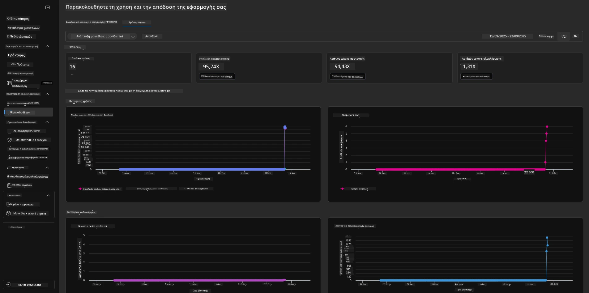

---

## 8. Environment Variables

So far, we've walked through the deployment in the browser - and validated that our infrastructure is provisioned and the application is operational. But to work with the application _code-first_, we need to configure our local development environment with the relevant variables required to work with these resources. Using `azd` makes it easy.

1. The Azure Developer CLI [uses environment variables](https://learn.microsoft.com/en-us/azure/developer/azure-developer-cli/manage-environment-variables?tabs=bash) to store and manage configuration settings for  the application deployments.

1. Environment variables are stored in `.azure/<env-name>/.env` - this scopes them to the `env-name` environment used during deployment and helps you isolate environments between different deployment targets in the same repo.

1. Environment variables are automatically loaded by the `azd` command whenever it executes a specific command (e.g., `azd up`). Note that `azd` does not automatically read _OS-level_ environment variables (e.g., set in the shell) - instead use `azd set env` and `azd get env` to transfer information within scripts.


Let's try out a few commands:

1. Get all the environment variables set for `azd` in this environment:

      ```bash title="" linenums="0"
      azd env get-values
      ```
      
      You see something like:

      ```bash title="" linenums="0"
      AZURE_AI_AGENT_DEPLOYMENT_NAME="gpt-4o-mini"
      AZURE_AI_AGENT_NAME="agent-template-assistant"
      AZURE_AI_EMBED_DEPLOYMENT_NAME="text-embedding-3-small"
      AZURE_AI_EMBED_DIMENSIONS=100
      ...
      ```

1. Get a specific value - e.g., I want to know if we set the `AZURE_AI_AGENT_MODEL_NAME` value

      ```bash title="" linenums="0"
      azd env get-value AZURE_AI_AGENT_MODEL_NAME 
      ```
      
      You see something like this - it was not set by default!

      ```bash title="" linenums="0"
      ERROR: key 'AZURE_AI_AGENT_MODEL_NAME' not found in the environment values
      ```

1. Set a new environment variable for `azd`. Here, we update the agent model name. _Note: any changes made will be immediately reflected in the `.azure/<env-name>/.env` file.

      ```bash title="" linenums="0"
      azd env set AZURE_AI_AGENT_MODEL_NAME gpt-4.1
      azd env set AZURE_AI_AGENT_MODEL_VERSION 2025-04-14
      azd env set AZURE_AI_AGENT_DEPLOYMENT_CAPACITY 150
      ```

      Now, we should find the value is set:

      ```bash title="" linenums="0"
      azd env get-value AZURE_AI_AGENT_MODEL_NAME 
      ```

1. Note that some resources are persistent (e.g., model deployments) and will require more than just an `azd up` to force the redeployment. Let's try tearing down the original deployment and redeploying with changed env vars.

1. **Refresh** If you had previously deployed infrastructure using an azd template - you can _refresh_ the state of your local environment variables based on the current state of your Azure deployment using this command:

      ```bash title="" linenums="0"
      azd env refresh
      ```

      Αυτός είναι ένας ισχυρός τρόπος για να _συγχρονίσετε_ τις μεταβλητές περιβάλλοντος ανάμεσα σε δύο ή περισσότερα τοπικά περιβάλλοντα ανάπτυξης (π.χ., ομάδα με πολλούς προγραμματιστές) - επιτρέποντας στην αναπτυγμένη υποδομή να λειτουργεί ως η κύρια πηγή αλήθειας για την κατάσταση των μεταβλητών περιβάλλοντος. Τα μέλη της ομάδας απλώς _ανανεώνουν_ τις μεταβλητές για να συγχρονιστούν ξανά.

---

## 9. Συγχαρητήρια 🏆

Μόλις ολοκληρώσατε μια ροή εργασίας από άκρη σε άκρη όπου σας:

- [X] Επιλέξατε το πρότυπο AZD που θέλετε να χρησιμοποιήσετε
- [X] Εκκινήσατε το πρότυπο με το GitHub Codespaces 
- [X] Αναπτύξατε το πρότυπο και επαληθεύσατε ότι λειτουργεί

---

<!-- CO-OP TRANSLATOR DISCLAIMER START -->
Αποποίηση ευθυνών:
Αυτό το έγγραφο έχει μεταφραστεί με χρήση της υπηρεσίας αυτόματης μετάφρασης AI Co‑op Translator (https://github.com/Azure/co-op-translator). Παρά τις προσπάθειές μας για ακρίβεια, παρακαλούμε λάβετε υπόψη ότι οι αυτοματοποιημένες μεταφράσεις ενδέχεται να περιέχουν σφάλματα ή ανακρίβειες. Το πρωτότυπο έγγραφο στη γλώσσα του πρέπει να θεωρείται η αυθεντική/επίσημη πηγή. Για κρίσιμες πληροφορίες συνιστάται επαγγελματική ανθρώπινη μετάφραση. Δεν φέρουμε ευθύνη για τυχόν παρεξηγήσεις ή λανθασμένες ερμηνείες που προκύπτουν από τη χρήση αυτής της μετάφρασης.
<!-- CO-OP TRANSLATOR DISCLAIMER END -->