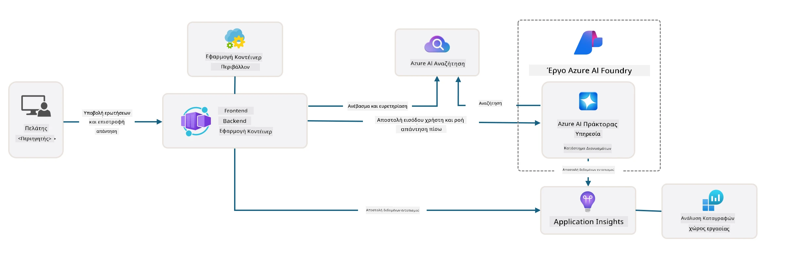

# 3. Αποσυναρμολόγηση ενός Προτύπου

!!! tip "ΜΕΧΡΙ ΤΟ ΤΕΛΟΣ ΑΥΤΗΣ ΤΗΣ ΕΝΟΤΗΤΑΣ ΘΑ ΜΠΟΡΕΙΤΕ ΝΑ"

    - [ ] Στοιχείο
    - [ ] Στοιχείο
    - [ ] Στοιχείο
    - [ ] **Εργαστήριο 3:** 

---

Με τα πρότυπα AZD και το Azure Developer CLI (`azd`), μπορούμε να ξεκινήσουμε γρήγορα την ανάπτυξη AI με τυποποιημένα αποθετήρια που παρέχουν δείγματα κώδικα, υποδομή και αρχεία ρυθμίσεων - με τη μορφή ενός έτοιμου προς ανάπτυξη _starter_ project.

**Αλλά τώρα, πρέπει να κατανοήσουμε τη δομή του έργου και τη βάση του κώδικα - και να μπορούμε να προσαρμόσουμε το πρότυπο AZD - χωρίς προηγούμενη εμπειρία ή γνώση του AZD!**

---

## 1. Ενεργοποίηση του GitHub Copilot

### 1.1 Εγκατάσταση του GitHub Copilot Chat

Ήρθε η ώρα να εξερευνήσετε το [GitHub Copilot με Agent Mode](https://code.visualstudio.com/docs/copilot/chat/chat-agent-mode). Τώρα, μπορούμε να χρησιμοποιήσουμε φυσική γλώσσα για να περιγράψουμε την εργασία μας σε υψηλό επίπεδο και να λάβουμε βοήθεια στην εκτέλεση. Για αυτό το εργαστήριο, θα χρησιμοποιήσουμε το [Copilot Free plan](https://github.com/github-copilot/signup), το οποίο έχει μηνιαίο όριο για ολοκληρώσεις και αλληλεπιδράσεις συνομιλίας.

Η επέκταση μπορεί να εγκατασταθεί από το marketplace, αλλά θα πρέπει να είναι ήδη διαθέσιμη στο περιβάλλον σας Codespaces. _Κάντε κλικ στο `Open Chat` από το αναπτυσσόμενο εικονίδιο Copilot - και πληκτρολογήστε μια προτροπή όπως `What can you do?`_ - μπορεί να σας ζητηθεί να συνδεθείτε. **Το GitHub Copilot Chat είναι έτοιμο**.

### 1.2 Εγκατάσταση MCP Servers

Για να είναι αποτελεσματική η λειτουργία Agent mode, χρειάζεται πρόσβαση στα κατάλληλα εργαλεία για να βοηθήσει στην ανάκτηση γνώσης ή την εκτέλεση ενεργειών. Εδώ έρχονται να βοηθήσουν οι MCP servers. Θα ρυθμίσουμε τους εξής servers:

1. [Azure MCP Server](../../../../../workshop/docs/instructions)
1. [Microsoft Docs MCP Server](../../../../../workshop/docs/instructions)

Για να τους ενεργοποιήσετε:

1. Δημιουργήστε ένα αρχείο με όνομα `.vscode/mcp.json` αν δεν υπάρχει
1. Αντιγράψτε το παρακάτω στο αρχείο - και ξεκινήστε τους servers!
   ```json title=".vscode/mcp.json"
   {
      "servers": {
         "Azure MCP Server": {
            "command": "npx",
            "args": [
            "-y",
            "@azure/mcp@latest",
            "server",
            "start"
            ]
         },
         "microsoft.docs.mcp": {
            "type": "http",
            "url": "https://learn.microsoft.com/api/mcp"
         }
      }
   }
   ```

??? warning "Μπορεί να λάβετε ένα σφάλμα ότι το `npx` δεν είναι εγκατεστημένο (κάντε κλικ για να δείτε τη διόρθωση)"

      Για να διορθώσετε αυτό, ανοίξτε το αρχείο `.devcontainer/devcontainer.json` και προσθέστε αυτή τη γραμμή στην ενότητα features. Στη συνέχεια, επαναδημιουργήστε το container. Θα πρέπει τώρα να έχετε εγκατεστημένο το `npx`.

      ```title="" linenums="0"
         "features": {
            "ghcr.io/devcontainers/features/node:1": {},
            ...
         },
      ```

---

### 1.3 Δοκιμή του GitHub Copilot Chat

**Πρώτα χρησιμοποιήστε το `az login` για να συνδεθείτε στο Azure από τη γραμμή εντολών του VS Code.**

Τώρα θα πρέπει να μπορείτε να ερωτήσετε την κατάσταση της συνδρομής σας στο Azure και να κάνετε ερωτήσεις σχετικά με τους αναπτυγμένους πόρους ή τη ρύθμιση. Δοκιμάστε αυτές τις προτροπές:

1. `List my Azure resource groups`
1. `#foundry list my current deployments`

Μπορείτε επίσης να κάνετε ερωτήσεις σχετικά με την τεκμηρίωση του Azure και να λάβετε απαντήσεις βασισμένες στον Microsoft Docs MCP server. Δοκιμάστε αυτές τις προτροπές:

1. `#microsoft_docs_search What is Azure Developer CLI?`
1. `#microsoft_docs_search Show me a Python tutorial to chat with deployed model`

Ή μπορείτε να ζητήσετε αποσπάσματα κώδικα για να ολοκληρώσετε μια εργασία. Δοκιμάστε αυτή την προτροπή:

1. `Give me a Python code example that uses AAD for an interactive chat client`

Στη λειτουργία `Ask`, αυτό θα παρέχει κώδικα που μπορείτε να αντιγράψετε και να δοκιμάσετε. Στη λειτουργία `Agent`, αυτό μπορεί να πάει ένα βήμα παραπέρα και να δημιουργήσει τους σχετικούς πόρους για εσάς - συμπεριλαμβανομένων των script εγκατάστασης και της τεκμηρίωσης - για να σας βοηθήσει να εκτελέσετε την εργασία.

**Τώρα είστε έτοιμοι να αρχίσετε να εξερευνάτε το αποθετήριο προτύπου**

---

## 2. Αποσυναρμολόγηση Αρχιτεκτονικής

??? prompt "ASK: Εξήγησε την αρχιτεκτονική της εφαρμογής στο docs/images/architecture.png σε μία παράγραφο"

      Αυτή η εφαρμογή είναι μια εφαρμογή συνομιλίας με AI που βασίζεται στο Azure και παρουσιάζει μια σύγχρονη αρχιτεκτονική βασισμένη σε agents. Η λύση επικεντρώνεται σε ένα Azure Container App που φιλοξενεί τον κύριο κώδικα της εφαρμογής, ο οποίος επεξεργάζεται την είσοδο του χρήστη και δημιουργεί έξυπνες απαντήσεις μέσω ενός AI agent. 
      
      Η αρχιτεκτονική αξιοποιεί το Azure AI Foundry Project ως τη βάση για τις δυνατότητες AI, συνδέοντας με τις υπηρεσίες Azure AI που παρέχουν τα υποκείμενα γλωσσικά μοντέλα (όπως το GPT-4o-mini) και τη λειτουργικότητα του agent. Οι αλληλεπιδράσεις των χρηστών περνούν μέσω ενός frontend βασισμένου στο React σε ένα backend FastAPI που επικοινωνεί με την υπηρεσία AI agent για τη δημιουργία απαντήσεων με βάση το περιεχόμενο. 
      
      Το σύστημα ενσωματώνει δυνατότητες ανάκτησης γνώσης μέσω είτε αναζήτησης αρχείων είτε της υπηρεσίας Azure AI Search, επιτρέποντας στον agent να έχει πρόσβαση και να παραθέτει πληροφορίες από ανεβασμένα έγγραφα. Για την επιχειρησιακή αριστεία, η αρχιτεκτονική περιλαμβάνει ολοκληρωμένη παρακολούθηση μέσω του Application Insights και του Log Analytics Workspace για ιχνηλάτηση, καταγραφή και βελτιστοποίηση απόδοσης. 
      
      Το Azure Storage παρέχει blob storage για δεδομένα εφαρμογής και ανεβασμένα αρχεία, ενώ το Managed Identity εξασφαλίζει ασφαλή πρόσβαση μεταξύ των πόρων του Azure χωρίς αποθήκευση διαπιστευτηρίων. Ολόκληρη η λύση έχει σχεδιαστεί για κλιμακωσιμότητα και συντηρησιμότητα, με την εφαρμογή σε container να κλιμακώνεται αυτόματα ανάλογα με τη ζήτηση, παρέχοντας παράλληλα ενσωματωμένη ασφάλεια, παρακολούθηση και δυνατότητες CI/CD μέσω του οικοσυστήματος διαχειριζόμενων υπηρεσιών του Azure.



---

## 3. Δομή Αποθετηρίου

!!! prompt "ASK: Εξήγησε τη δομή του φακέλου προτύπου. Ξεκίνα με ένα οπτικό ιεραρχικό διάγραμμα."

??? info "ANSWER: Οπτικό Ιεραρχικό Διάγραμμα"

      ```bash title="" 
      get-started-with-ai-agents/
      ├── 📋 Ρύθμιση & Διαμόρφωση
      │   ├── azure.yaml                    # Ρύθμιση του Azure Developer CLI
      │   ├── docker-compose.yaml           # Containers για τοπική ανάπτυξη
      │   ├── pyproject.toml                # Ρύθμιση έργου Python
      │   ├── requirements-dev.txt          # Εξαρτήσεις ανάπτυξης
      │   └── .devcontainer/                # Ρύθμιση dev container για VS Code
      │
      ├── 🏗️ Υποδομή (infra/)
      │   ├── main.bicep                    # Κύριο πρότυπο υποδομής
      │   ├── api.bicep                     # Πόροι για το API
      │   ├── main.parameters.json          # Παράμετροι υποδομής
      │   └── core/                         # Μονάδες υποδομής
      │       ├── ai/                       # Ρυθμίσεις υπηρεσιών AI
      │       ├── host/                     # Υποδομή φιλοξενίας
      │       ├── monitor/                  # Παρακολούθηση και καταγραφή
      │       ├── search/                   # Ρύθμιση Azure AI Search
      │       ├── security/                 # Ασφάλεια και ταυτότητα
      │       └── storage/                  # Ρυθμίσεις λογαριασμού αποθήκευσης
      │
      ├── 💻 Πηγαίος Κώδικας Εφαρμογής (src/)
      │   ├── api/                          # Backend API
      │   │   ├── main.py                   # Είσοδος εφαρμογής FastAPI
      │   │   ├── routes.py                 # Ορισμοί διαδρομών API
      │   │   ├── search_index_manager.py   # Λειτουργικότητα αναζήτησης
      │   │   ├── data/                     # Διαχείριση δεδομένων API
      │   │   ├── static/                   # Στατικά web assets
      │   │   └── templates/                # HTML templates
      │   ├── frontend/                     # Frontend React/TypeScript
      │   │   ├── package.json              # Εξαρτήσεις Node.js
      │   │   ├── vite.config.ts            # Ρύθμιση build Vite
      │   │   └── src/                      # Πηγαίος κώδικας frontend
      │   ├── data/                         # Δείγματα αρχείων δεδομένων
      │   │   └── embeddings.csv            # Προϋπολογισμένοι embeddings
      │   ├── files/                        # Αρχεία βάσης γνώσης
      │   │   ├── customer_info_*.json      # Δείγματα δεδομένων πελατών
      │   │   └── product_info_*.md         # Τεκμηρίωση προϊόντων
      │   ├── Dockerfile                    # Ρύθμιση container
      │   └── requirements.txt              # Εξαρτήσεις Python
      │
      ├── 🔧 Αυτοματοποίηση & Scripts (scripts/)
      │   ├── postdeploy.sh/.ps1           # Ρύθμιση μετά την ανάπτυξη
      │   ├── setup_credential.sh/.ps1     # Ρύθμιση διαπιστευτηρίων
      │   ├── validate_env_vars.sh/.ps1    # Επικύρωση περιβάλλοντος
      │   └── resolve_model_quota.sh/.ps1  # Διαχείριση ποσοστώσεων μοντέλου
      │
      ├── 🧪 Δοκιμές & Αξιολόγηση
      │   ├── tests/                        # Μονάδες και ενσωματωμένες δοκιμές
      │   │   └── test_search_index_manager.py
      │   ├── evals/                        # Πλαίσιο αξιολόγησης agent
      │   │   ├── evaluate.py               # Εκτελεστής αξιολόγησης
      │   │   ├── eval-queries.json         # Ερωτήματα δοκιμής
      │   │   └── eval-action-data-path.json
      │   ├── sandbox/                      # Χώρος δοκιμών ανάπτυξης
      │   │   ├── 1-quickstart.py           # Παραδείγματα γρήγορης εκκίνησης
      │   │   └── aad-interactive-chat.py   # Παραδείγματα αυθεντικοποίησης
      │   └── airedteaming/                 # Αξιολόγηση ασφάλειας AI
      │       └── ai_redteaming.py          # Δοκιμές red team
      │
      ├── 📚 Τεκμηρίωση (docs/)
      │   ├── deployment.md                 # Οδηγός ανάπτυξης
      │   ├── local_development.md          # Οδηγίες τοπικής ρύθμισης
      │   ├── troubleshooting.md            # Συνηθισμένα προβλήματα & λύσεις
      │   ├── azure_account_setup.md        # Προαπαιτούμενα Azure
      │   └── images/                       # Αρχεία τεκμηρίωσης
      │
      └── 📄 Μεταδεδομένα Έργου
         ├── README.md                     # Επισκόπηση έργου
         ├── CODE_OF_CONDUCT.md           # Κατευθυντήριες γραμμές κοινότητας
         ├── CONTRIBUTING.md              # Οδηγός συνεισφοράς
         ├── LICENSE                      # Όροι άδειας χρήσης
         └── next-steps.md                # Οδηγίες μετά την ανάπτυξη
      ```

### 3.1 Κεντρική Αρχιτεκτονική Εφαρμογής

Αυτό το πρότυπο ακολουθεί ένα μοτίβο **full-stack web application** με:

- **Backend**: Python FastAPI με ενσωμάτωση Azure AI
- **Frontend**: TypeScript/React με σύστημα build Vite
- **Υποδομή**: Πρότυπα Azure Bicep για πόρους cloud
- **Containerization**: Docker για συνεπή ανάπτυξη

### 3.2 Υποδομή ως Κώδικας (bicep)

Το επίπεδο υποδομής χρησιμοποιεί **Azure Bicep** πρότυπα οργανωμένα σε μονάδες:

   - **`main.bicep`**: Οργανώνει όλους τους πόρους του Azure
   - **`core/` μονάδες**: Επαναχρησιμοποιούμενα στοιχεία για διαφορετικές υπηρεσίες
      - Υπηρεσίες AI (Azure OpenAI, AI Search)
      - Φιλοξενία container (Azure Container Apps)
      - Παρακολούθηση (Application Insights, Log Analytics)
      - Ασφάλεια (Key Vault, Managed Identity)

### 3.3 Πηγαίος Κώδικας Εφαρμογής (`src/`)

**Backend API (`src/api/`)**:

- REST API βασισμένο στο FastAPI
- Ενσωμάτωση υπηρεσίας AI Agent του Azure
- Διαχείριση ευρετηρίου αναζήτησης για ανάκτηση γνώσης
- Δυνατότητες ανεβάσματος και επεξεργασίας αρχείων

**Frontend (`src/frontend/`)**:

- Σύγχρονο React/TypeScript SPA
- Vite για γρήγορη ανάπτυξη και βελτιστοποιημένα builds
- Διεπαφή συνομιλίας για αλληλεπιδράσεις με agent

**Βάση Γνώσης (`src/files/`)**:

- Δείγματα δεδομένων πελατών και προϊόντων
- Επιδεικνύει ανάκτηση γνώσης από αρχεία
- Παραδείγματα σε μορφή JSON και Markdown

### 3.4 DevOps & Αυτοματοποίηση

**Scripts (`scripts/`)**:

- Scripts PowerShell και Bash για πολλαπλές πλατφόρμες
- Επικύρωση και ρύθμιση περιβάλλοντος
- Ρύθμιση μετά την ανάπτυξη
- Διαχείριση ποσοστώσεων μοντέλου

**Ενσωμάτωση Azure Developer CLI**:

- Ρύθμιση `azure.yaml` για workflows `azd`
- Αυτοματοποιημένη προμήθεια και ανάπτυξη
- Διαχείριση μεταβλητών περιβάλλοντος

### 3.5 Δοκιμές & Διασφάλιση Ποιότητας

**Πλαίσιο Αξιολόγησης (`evals/`)**:

- Αξιολόγηση απόδοσης agent
- Δοκιμή ποιότητας ερωτήσεων-απαντήσεων
- Αυτοματοποιημένος αγωγός αξιολόγησης

**Ασφάλεια AI (`airedteaming/`)**:

- Δοκιμές red team για ασφάλεια AI
- Σάρωση ευπαθειών ασφαλείας
- Πρακτικές υπεύθυνου AI

---

## 4. Συγχαρητήρια 🏆

Χρησιμοποιήσατε επιτυχώς το GitHub Copilot Chat με MCP servers για να εξερευνήσετε το αποθετήριο.

- [X] Ενεργοποιήσατε το GitHub Copilot για Azure
- [X] Κατανοήσατε την Αρχιτεκτονική Εφαρμογής
- [X] Εξερευνήσατε τη δομή του προτύπου AZD

Αυτό σας δίνει μια εικόνα για τα _infrastructure as code_ στοιχεία αυτού του προτύπου. Στη συνέχεια, θα εξετάσουμε το αρχείο ρυθμίσεων για το AZD.

---

