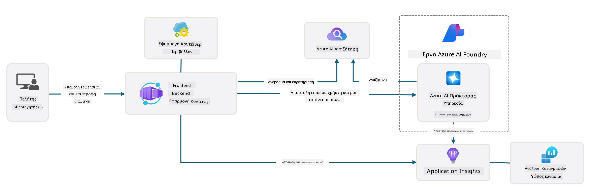

# 3. Αποδόμηση ενός προτύπου

!!! tip "ΜΕΧΡΙ ΤΟ ΤΕΛΟΣ ΑΥΤΗΣ ΤΗΣ ΕΝΟΤΗΤΑΣ ΘΑ ΜΠΟΡΕΙΤΕ ΝΑ"

    - [ ] Ενεργοποιήστε το GitHub Copilot με διακομιστές MCP για βοήθεια στο Azure
    - [ ] Κατανοήστε τη δομή φακέλων και τα στοιχεία του προτύπου AZD
    - [ ] Εξερευνήστε μοτίβα οργάνωσης υποδομής ως κώδικα (Bicep)
    - [ ] **Εργαστήριο 3:** Χρησιμοποιήστε το GitHub Copilot για να εξερευνήσετε και να κατανοήσετε την αρχιτεκτονική του αποθετηρίου 

---


Με τα πρότυπα AZD και το Azure Developer CLI (`azd`) μπορούμε γρήγορα να ξεκινήσουμε το ταξίδι ανάπτυξης AI με τυποποιημένα αποθετήρια που παρέχουν δείγματα κώδικα, υποδομή και αρχεία ρύθμισης - με τη μορφή ενός έτοιμου προς ανάπτυξη _starter_ έργου.

**Αλλά τώρα, πρέπει να κατανοήσουμε τη δομή του έργου και τον κώδικα - και να μπορούμε να προσαρμόσουμε το πρότυπο AZD - χωρίς καμία προηγούμενη εμπειρία ή κατανόηση του AZD!**

---

## 1. Ενεργοποιήστε το GitHub Copilot

### 1.1 Εγκαταστήστε το GitHub Copilot Chat

Ήρθε η ώρα να εξερευνήσουμε το [GitHub Copilot με Agent Mode](https://code.visualstudio.com/docs/copilot/chat/chat-agent-mode). Τώρα, μπορούμε να χρησιμοποιήσουμε φυσική γλώσσα για να περιγράψουμε το έργο μας σε υψηλό επίπεδο και να λάβουμε βοήθεια στην εκτέλεση. Για αυτό το εργαστήριο, θα χρησιμοποιήσουμε το [Copilot Free plan](https://github.com/github-copilot/signup) που έχει μηνιαίο όριο για ολοκληρώσεις και συνομιλίες.

Η επέκταση μπορεί να εγκατασταθεί από το marketplace, αλλά θα πρέπει να είναι ήδη διαθέσιμη στο περιβάλλον σας στο Codespaces. _Κάντε κλικ στο `Open Chat` από το αναδυόμενο μενού του εικονιδίου Copilot - και πληκτρολογήστε ένα prompt όπως `What can you do?`_ - μπορεί να σας ζητηθεί να συνδεθείτε. **Το GitHub Copilot Chat είναι έτοιμο**.

### 1.2. Εγκατάσταση διακομιστών MCP

Για να είναι αποτελεσματική η λειτουργία Agent mode, χρειάζεται πρόσβαση στα σωστά εργαλεία για να ανακτήσει γνώσεις ή να εκτελέσει ενέργειες. Εδώ μπορούν να βοηθήσουν οι διακομιστές MCP. Θα ρυθμίσουμε τους ακόλουθους διακομιστές:

1. [Azure MCP Server](../../../../../workshop/docs/instructions)
1. [Microsoft Docs MCP Server](../../../../../workshop/docs/instructions)

Για να τους ενεργοποιήσετε:

1. Δημιουργήστε ένα αρχείο με όνομα `.vscode/mcp.json` εάν δεν υπάρχει
1. Αντιγράψτε τα παρακάτω σε αυτό το αρχείο - και ξεκινήστε τους διακομιστές!
   ```json title=".vscode/mcp.json"
   {
      "servers": {
         "Azure MCP Server": {
            "command": "npx",
            "args": [
            "-y",
            "@azure/mcp@latest",
            "server",
            "start"
            ]
         },
         "microsoft.docs.mcp": {
            "type": "http",
            "url": "https://learn.microsoft.com/api/mcp"
         }
      }
   }
   ```

??? warning "Μπορεί να λάβετε ένα σφάλμα ότι το `npx` δεν είναι εγκατεστημένο (κάντε κλικ για να επεκτείνετε και να δείτε τη διόρθωση)"

      Για να το διορθώσετε, ανοίξτε αυτό το αρχείο `.devcontainer/devcontainer.json` και προσθέστε αυτή τη γραμμή στην ενότητα features. Στη συνέχεια αναδομήστε το container. Θα πρέπει τώρα να έχετε το `npx` εγκατεστημένο.

      ```title="" linenums="0"
         "features": {
            "ghcr.io/devcontainers/features/node:1": {},
            ...
         },
      ```

---

### 1.3. Δοκιμάστε το GitHub Copilot Chat

**Χρησιμοποιήστε πρώτα το `az login` για να αυθεντικοποιηθείτε στο Azure από τη γραμμή εντολών του VS Code.**

Τώρα θα πρέπει να μπορείτε να ερωτάτε την κατάσταση της συνδρομής Azure σας και να κάνετε ερωτήσεις σχετικά με αναπτυγμένους πόρους ή ρυθμίσεις. Δοκιμάστε αυτά τα prompts:

1. `List my Azure resource groups`
1. `#foundry list my current deployments`

Μπορείτε επίσης να κάνετε ερωτήσεις σχετικά με την τεκμηρίωση Azure και να λάβετε απαντήσεις βασισμένες στον Microsoft Docs MCP server. Δοκιμάστε αυτά τα prompts:

1. `#microsoft_docs_search What is Azure Developer CLI?`
1. `#microsoft_docs_search Show me a Python tutorial to chat with deployed model`

Ή μπορείτε να ζητήσετε αποσπάσματα κώδικα για να ολοκληρώσετε μια εργασία. Δοκιμάστε αυτό το prompt.

1. `Give me a Python code example that uses AAD for an interactive chat client`

Σε λειτουργία "Ask", αυτό θα παρέχει κώδικα που μπορείτε να αντιγράψετε και να δοκιμάσετε. Σε λειτουργία "Agent", αυτό μπορεί να πάει ένα βήμα παραπέρα και να δημιουργήσει τους σχετικούς πόρους για εσάς - συμπεριλαμβανομένων σεναρίων εγκατάστασης και τεκμηρίωσης - για να σας βοηθήσει να εκτελέσετε αυτή την εργασία.

**Τώρα είστε εξοπλισμένοι για να ξεκινήσετε την εξερεύνηση του αποθετηρίου προτύπου**

---

## 2. Αποδόμηση της Αρχιτεκτονικής

??? prompt "ΖΗΤΗΣΤΕ: Εξηγήστε την αρχιτεκτονική της εφαρμογής στο docs/images/architecture.png σε 1 παράγραφο"

      Αυτή η εφαρμογή είναι μια εφαρμογή συνομιλίας με δυνατότητες AI που βασίζεται στο Azure και παρουσιάζει μια σύγχρονη αρχιτεκτονική βασισμένη σε agents. Η λύση επικεντρώνεται γύρω από ένα Azure Container App που φιλοξενεί τον κύριο κώδικα της εφαρμογής, ο οποίος επεξεργάζεται την είσοδο του χρήστη και δημιουργεί έξυπνες απαντήσεις μέσω ενός AI agent.
      
      Η αρχιτεκτονική αξιοποιεί το Microsoft Foundry Project ως βάση για τις δυνατότητες AI, συνδέοντας τις υπηρεσίες Azure AI που παρέχουν τα υποκείμενα γλωσσικά μοντέλα (όπως το GPT-4o-mini) και τη λειτουργία agent. Οι αλληλεπιδράσεις των χρηστών ρέουν μέσω ενός frontend βασισμένου σε React προς ένα backend FastAPI που επικοινωνεί με την υπηρεσία agent για τη δημιουργία συμφραζόμενων απαντήσεων.
      
      Το σύστημα ενσωματώνει δυνατότητες ανάκτησης γνώσης είτε μέσω αναζήτησης αρχείων είτε μέσω της υπηρεσίας Azure AI Search, επιτρέποντας στον agent να έχει πρόσβαση και να παραθέτει πληροφορίες από ανεβασμένα έγγραφα. Για βέλτιστη λειτουργία, η αρχιτεκτονική περιλαμβάνει ολοκληρωμένη παρακολούθηση μέσω Application Insights και Log Analytics Workspace για ιχνηλάτηση, καταγραφή και βελτιστοποίηση απόδοσης.
      
      Το Azure Storage παρέχει blob storage για δεδομένα εφαρμογής και ανεβάσματα αρχείων, ενώ το Managed Identity εξασφαλίζει ασφαλή πρόσβαση μεταξύ πόρων Azure χωρίς την αποθήκευση διαπιστευτηρίων. Ολόκληρη η λύση έχει σχεδιαστεί για κλιμάκωση και διατηρησιμότητα, με την containerized εφαρμογή να κλιμακώνεται αυτόματα ανάλογα με τη ζήτηση, παρέχοντας ενσωματωμένη ασφάλεια, παρακολούθηση και δυνατότητες CI/CD μέσω του οικοσυστήματος διαχειριζόμενων υπηρεσιών του Azure.



---

## 3. Δομή Αποθετηρίου

!!! prompt "ΖΗΤΗΣΤΕ: Εξηγήστε τη δομή φακέλων του προτύπου. Ξεκινήστε με ένα οπτικό ιεραρχικό διάγραμμα."

??? info "ΑΠΑΝΤΗΣΗ: Οπτικό Ιεραρχικό Διάγραμμα"

      ```bash title="" 
      get-started-with-ai-agents/
      ├── 📋 Configuration & Setup
      │   ├── azure.yaml                    # Azure Developer CLI configuration
      │   ├── docker-compose.yaml           # Local development containers
      │   ├── pyproject.toml                # Python project configuration
      │   ├── requirements-dev.txt          # Development dependencies
      │   └── .devcontainer/                # VS Code dev container setup
      │
      ├── 🏗️ Infrastructure (infra/)
      │   ├── main.bicep                    # Main infrastructure template
      │   ├── api.bicep                     # API-specific resources
      │   ├── main.parameters.json          # Infrastructure parameters
      │   └── core/                         # Modular infrastructure components
      │       ├── ai/                       # AI service configurations
      │       ├── host/                     # Hosting infrastructure
      │       ├── monitor/                  # Monitoring and logging
      │       ├── search/                   # Azure AI Search setup
      │       ├── security/                 # Security and identity
      │       └── storage/                  # Storage account configs
      │
      ├── 💻 Application Source (src/)
      │   ├── api/                          # Backend API
      │   │   ├── main.py                   # FastAPI application entry
      │   │   ├── routes.py                 # API route definitions
      │   │   ├── search_index_manager.py   # Search functionality
      │   │   ├── data/                     # API data handling
      │   │   ├── static/                   # Static web assets
      │   │   └── templates/                # HTML templates
      │   ├── frontend/                     # React/TypeScript frontend
      │   │   ├── package.json              # Node.js dependencies
      │   │   ├── vite.config.ts            # Vite build configuration
      │   │   └── src/                      # Frontend source code
      │   ├── data/                         # Sample data files
      │   │   └── embeddings.csv            # Pre-computed embeddings
      │   ├── files/                        # Knowledge base files
      │   │   ├── customer_info_*.json      # Customer data samples
      │   │   └── product_info_*.md         # Product documentation
      │   ├── Dockerfile                    # Container configuration
      │   └── requirements.txt              # Python dependencies
      │
      ├── 🔧 Automation & Scripts (scripts/)
      │   ├── postdeploy.sh/.ps1           # Post-deployment setup
      │   ├── setup_credential.sh/.ps1     # Credential configuration
      │   ├── validate_env_vars.sh/.ps1    # Environment validation
      │   └── resolve_model_quota.sh/.ps1  # Model quota management
      │
      ├── 🧪 Testing & Evaluation
      │   ├── tests/                        # Unit and integration tests
      │   │   └── test_search_index_manager.py
      │   ├── evals/                        # Agent evaluation framework
      │   │   ├── evaluate.py               # Evaluation runner
      │   │   ├── eval-queries.json         # Test queries
      │   │   └── eval-action-data-path.json
      │   ├── sandbox/                      # Development playground
      │   │   ├── 1-quickstart.py           # Getting started examples
      │   │   └── aad-interactive-chat.py   # Authentication examples
      │   └── airedteaming/                 # AI safety evaluation
      │       └── ai_redteaming.py          # Red team testing
      │
      ├── 📚 Documentation (docs/)
      │   ├── deployment.md                 # Deployment guide
      │   ├── local_development.md          # Local setup instructions
      │   ├── troubleshooting.md            # Common issues & fixes
      │   ├── azure_account_setup.md        # Azure prerequisites
      │   └── images/                       # Documentation assets
      │
      └── 📄 Project Metadata
         ├── README.md                     # Project overview
         ├── CODE_OF_CONDUCT.md           # Community guidelines
         ├── CONTRIBUTING.md              # Contribution guide
         ├── LICENSE                      # License terms
         └── next-steps.md                # Post-deployment guidance
      ```

### 3.1. Κεντρική Αρχιτεκτονική Εφαρμογής

Αυτό το πρότυπο ακολουθεί ένα μοτίβο **εφαρμογής πλήρους στοίβας** με:

- **Backend**: Python FastAPI με ενσωμάτωση Azure AI
- **Frontend**: TypeScript/React με σύστημα build Vite
- **Infrastructure**: Πρότυπα Azure Bicep για πόρους cloud
- **Containerization**: Docker για συνεπή ανάπτυξη

### 3.2 Υποδομή ως Κώδικας (Bicep)

Το στρώμα υποδομής χρησιμοποιεί πρότυπα **Azure Bicep** οργανωμένα κατά τόπους:

   - **`main.bicep`**: Ορχηστρώνει όλους τους πόρους Azure
   - **`core/` modules**: Επαναχρησιμοποιήσιμα συστατικά για διάφορες υπηρεσίες
      - Υπηρεσίες AI (Azure OpenAI, AI Search)
      - Φιλοξενία container (Azure Container Apps)
      - Παρακολούθηση (Application Insights, Log Analytics)
      - Ασφάλεια (Key Vault, Managed Identity)

### 3.3 Πηγή Εφαρμογής (`src/`)

**Backend API (`src/api/`)**:

- REST API βασισμένο σε FastAPI
- Ενσωμάτωση Foundry Agents
- Διαχείριση ευρετηρίου αναζήτησης για ανάκτηση γνώσης
- Δυνατότητες ανεβάσματος και επεξεργασίας αρχείων

**Frontend (`src/frontend/`)**:

- Σύγχρονη SPA με React/TypeScript
- Vite για γρήγορη ανάπτυξη και βελτιστοποιημένα builds
- Διεπαφή συνομιλίας για αλληλεπιδράσεις με agents

**Βάση Γνώσης (`src/files/`)**:

- Δείγματα δεδομένων πελατών και προϊόντων
- Επιδεικνύει ανάκτηση γνώσης από αρχεία
- Παραδείγματα σε μορφή JSON και Markdown


### 3.4 DevOps & Αυτοματισμός

**Scripts (`scripts/`)**:

- Cross-platform PowerShell και Bash scripts
- Επαλήθευση και ρύθμιση περιβάλλοντος
- Μετα-αναπτυξιακή διαμόρφωση
- Διαχείριση ποσοστώσεων μοντέλων

**Ενσωμάτωση Azure Developer CLI**:

- Ρύθμιση `azure.yaml` για ροές εργασίας `azd`
- Αυτοματοποιημένη προετοιμασία και ανάπτυξη
- Διαχείριση μεταβλητών περιβάλλοντος

### 3.5 Δοκιμές & Διασφάλιση Ποιότητας

**Πλαίσιο Αξιολόγησης (`evals/`)**:

- Αξιολόγηση απόδοσης agents
- Έλεγχος ποιότητας απόκρισης σε ερωτήματα
- Αυτόματο pipeline αξιολόγησης

**Ασφάλεια AI (`airedteaming/`)**:

- Red team testing για ασφάλεια AI
- Σάρωση ευπαθειών ασφαλείας
- Πρακτικές υπεύθυνου AI

---

## 4. Συγχαρητήρια 🏆

Χρησιμοποιήσατε επιτυχώς το GitHub Copilot Chat με διακομιστές MCP για να εξερευνήσετε το αποθετήριο.

- [X] Ενεργοποιήθηκε το GitHub Copilot για Azure
- [X] Κατανοήθηκε η Αρχιτεκτονική της Εφαρμογής
- [X] Εξερευνήθηκε η δομή προτύπου AZD

Αυτό σας δίνει μια εικόνα των πόρων _infrastructure as code_ για αυτό το πρότυπο. Στη συνέχεια, θα δούμε το αρχείο ρύθμισης για το AZD.

---

<!-- CO-OP TRANSLATOR DISCLAIMER START -->
Αποποίηση ευθυνών:
Αυτό το έγγραφο έχει μεταφραστεί χρησιμοποιώντας την υπηρεσία μετάφρασης με τεχνητή νοημοσύνη Co-op Translator (https://github.com/Azure/co-op-translator). Παρόλο που καταβάλλουμε προσπάθειες για την ακρίβεια, παρακαλούμε λάβετε υπόψη ότι οι αυτοματοποιημένες μεταφράσεις ενδέχεται να περιέχουν σφάλματα ή ανακρίβειες. Το πρωτότυπο έγγραφο στη γλώσσα του πρέπει να θεωρείται η αυθεντική πηγή. Για κρίσιμες πληροφορίες, συνιστάται επαγγελματική ανθρώπινη μετάφραση. Δεν φέρουμε ευθύνη για τυχόν παρερμηνείες ή παρεξηγήσεις που προκύπτουν από τη χρήση αυτής της μετάφρασης.
<!-- CO-OP TRANSLATOR DISCLAIMER END -->