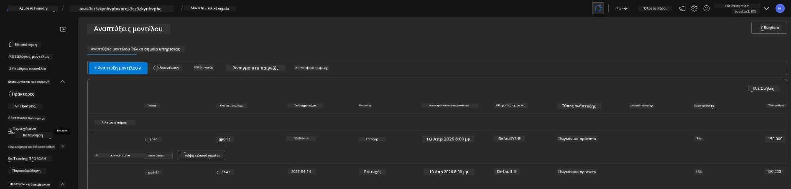

<!--
CO_OP_TRANSLATOR_METADATA:
{
  "original_hash": "6539a34c770f3ceff282370d72ee74dc",
  "translation_date": "2025-09-24T21:30:39+00:00",
  "source_file": "workshop/docs/instructions/6-Teardown-Infrastructure.md",
  "language_code": "el"
}
-->
# 6. Κατάργηση Υποδομής

!!! tip "ΜΕΧΡΙ ΤΟ ΤΕΛΟΣ ΑΥΤΗΣ ΤΗΣ ΕΝΟΤΗΤΑΣ ΘΑ ΕΙΣΤΕ ΣΕ ΘΕΣΗ ΝΑ"

    - [ ] Στοιχείο
    - [ ] Στοιχείο
    - [ ] Στοιχείο

---

## Επιπλέον Ασκήσεις

Πριν καταργήσουμε το έργο, αφιερώστε λίγα λεπτά για να κάνετε κάποια ανοιχτή εξερεύνηση.

!!! danger "NITYA-TODO: Καθορίστε κάποιες προτροπές για δοκιμή"

---

## Κατάργηση Υποδομής

1. Η κατάργηση της υποδομής είναι τόσο απλή όσο:
      
      ```bash title="" linenums="0"
      azd down --purge
      ```
1. Η σημαία `--purge` διασφαλίζει ότι διαγράφονται επίσης οι πόροι Cognitive Service που έχουν διαγραφεί προσωρινά, απελευθερώνοντας έτσι την ποσόστωση που κατέχουν αυτοί οι πόροι. Μόλις ολοκληρωθεί, θα δείτε κάτι σαν αυτό:
      
      ```bash title="" linenums="0"
      ? Total resources to delete: 11, are you sure you want to continue? Yes
      Deleting your resources can take some time.
      (✓) Done: Deleted resource group rg-nitya-mshack-azd
      (✓) Done: Purging Cognitive Account: aoai-3cz3zkynhvpbc

      SUCCESS: Your application was removed from Azure in 11 minutes 4 seconds.
      ```

1. (Προαιρετικό) Εάν τώρα εκτελέσετε ξανά την εντολή `azd up`, θα παρατηρήσετε ότι το μοντέλο gpt-4.1 αναπτύσσεται, καθώς η μεταβλητή περιβάλλοντος άλλαξε (και αποθηκεύτηκε) στον τοπικό φάκελο `.azure`.

      Εδώ είναι οι αναπτύξεις του μοντέλου **πριν**:

      

      Και εδώ είναι **μετά**:
      

---

