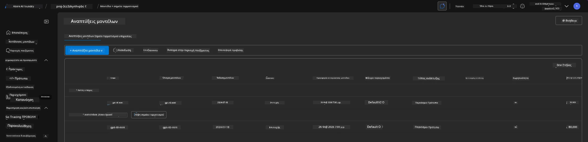
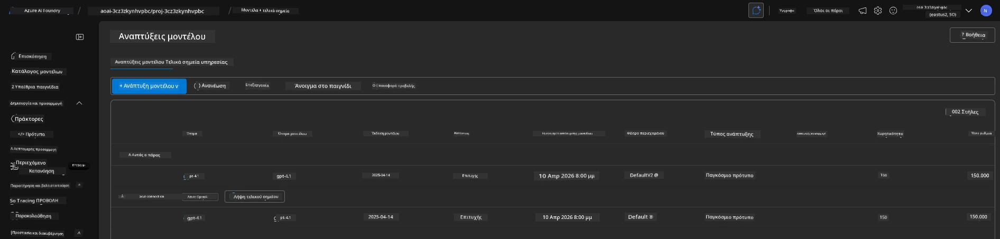

# 6. Κατάργηση Υποδομής

!!! tip "ΣΤΟ ΤΕΛΟΣ ΑΥΤΗΣ ΤΗΣ ΕΝΟΤΗΤΑΣ ΘΑ ΜΠΟΡΕΙΤΕ ΝΑ"

    - [ ] Κατανοήσετε τη σημασία του καθαρισμού πόρων και της διαχείρισης κόστους
    - [ ] Χρησιμοποιήσετε `azd down` για να απενεργοποιήσετε την υποδομή με ασφάλεια
    - [ ] Ανακτήσετε προσωρινά διαγραμμένες γνωστικές υπηρεσίες αν χρειαστεί
    - [ ] **Εργαστήριο 6:** Καθαρισμός πόρων Azure και επαλήθευση αφαίρεσης

---

## Επιπλέον Ασκήσεις

Πριν καταργήσουμε το έργο, αφιερώστε λίγα λεπτά για λίγη διερευνητική εξερεύνηση.

!!! info "Δοκιμάστε αυτές τις προτροπές εξερεύνησης"

    **Πειραματιστείτε με το GitHub Copilot:**
    
    1. Ρωτήστε: `What other AZD templates could I try for multi-agent scenarios?`
    2. Ρωτήστε: `How can I customize the agent instructions for a healthcare use case?`
    3. Ρωτήστε: `What environment variables control cost optimization?`
    
    **Εξερευνήστε το Azure Portal:**
    
    1. Ελέγξτε τις μετρήσεις του Application Insights για την ανάπτυξή σας
    2. Ελέγξτε την ανάλυση κόστους για τους πόρους που έχουν δημιουργηθεί
    3. Εξερευνήστε ξανά το agent playground στο Microsoft Foundry portal

---

## Απεγκατάσταση υποδομής

1. Η κατάργηση της υποδομής είναι τόσο απλή όσο:
      
      ```bash title="" linenums="0"
      azd down --purge
      ```
1. Το flag `--purge` εξασφαλίζει ότι επίσης διαγράφει μόνιμα προσωρινά διαγραμμένους πόρους γνωστικών υπηρεσιών, απελευθερώνοντας έτσι τα όρια που κρατούνται από αυτούς τους πόρους. Μόλις ολοκληρωθεί θα δείτε κάτι σαν κι αυτό:
      
      ```bash title="" linenums="0"
      ? Total resources to delete: 11, are you sure you want to continue? Yes
      Deleting your resources can take some time.
      (✓) Done: Deleted resource group rg-nitya-mshack-azd
      (✓) Done: Purging Cognitive Account: aoai-3cz3zkynhvpbc

      SUCCESS: Your application was removed from Azure in 11 minutes 4 seconds.
      ```

1. (Προαιρετικό) Αν τώρα τρέξετε ξανά `azd up`, θα παρατηρήσετε ότι το μοντέλο gpt-4.1 αναπτύσσεται αφού η μεταβλητή περιβάλλοντος άλλαξε (και αποθηκεύτηκε) στον τοπικό φάκελο `.azure`. 

      Εδώ είναι οι αναπτύξεις μοντέλων **πριν**:

      

      Και εδώ είναι **μετά**:
      

---

<!-- CO-OP TRANSLATOR DISCLAIMER START -->
Αποποίηση ευθυνών:

Αυτό το έγγραφο έχει μεταφραστεί με χρήση της υπηρεσίας αυτόματης μετάφρασης AI Co-op Translator (https://github.com/Azure/co-op-translator). Παρά τις προσπάθειές μας για ακρίβεια, παρακαλούμε να σημειώσετε ότι οι αυτοματοποιημένες μεταφράσεις ενδέχεται να περιέχουν σφάλματα ή ανακρίβειες. Το πρωτότυπο έγγραφο στη γλώσσα του πρέπει να θεωρείται η εγκυρή πηγή. Για κρίσιμες πληροφορίες, συνιστάται επαγγελματική μετάφραση από άνθρωπο. Δεν φέρουμε ευθύνη για οποιεσδήποτε παρεξηγήσεις ή λανθασμένες ερμηνείες προκύψουν από τη χρήση αυτής της μετάφρασης.
<!-- CO-OP TRANSLATOR DISCLAIMER END -->