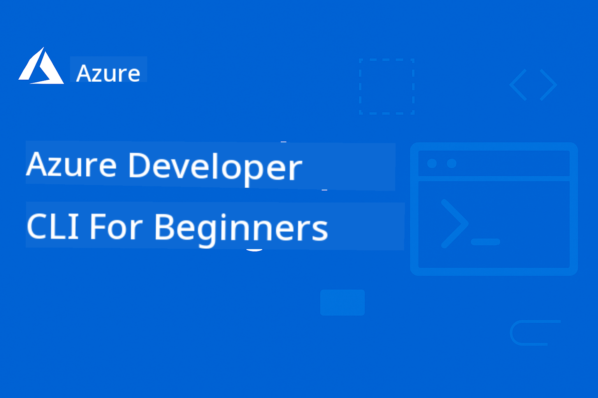

<!--
CO_OP_TRANSLATOR_METADATA:
{
  "original_hash": "3bd0e0644b110276e4364eb753ddcef8",
  "translation_date": "2025-09-10T05:32:49+00:00",
  "source_file": "README.md",
  "language_code": "en"
}
-->
# AZD For Beginners

 

[](https://GitHub.com/microsoft/azd-for-beginners/watchers/?WT.mc_id=academic-105485-koreyst)  
[](https://GitHub.com/microsoft/azd-for-beginners/network/?WT.mc_id=academic-105485-koreyst)  
[](https://GitHub.com/microsoft/azd-for-beginners/stargazers/?WT.mc_id=academic-105485-koreyst)  

[](https://discord.gg/microsoft-azure)  
[](https://discord.gg/kzRShWzttr)  

Follow these steps to start using these resources:  
1. **Fork the Repository**: Click [](https://GitHub.com/microsoft/azd-for-beginners/fork)  
2. **Clone the Repository**: `git clone https://github.com/microsoft/azd-for-beginners.git`  
3. [**Join The Azure Discord Communities and connect with experts and fellow developers**](https://discord.com/invite/ByRwuEEgH4)  

### 🌐 Multi-Language Support

#### Supported via GitHub Action (Automated & Always Up-to-Date)

[French](../fr/README.md) | [Spanish](../es/README.md) | [German](../de/README.md) | [Russian](../ru/README.md) | [Arabic](../ar/README.md) | [Persian (Farsi)](../fa/README.md) | [Urdu](../ur/README.md) | [Chinese (Simplified)](../zh/README.md) | [Chinese (Traditional, Macau)](../mo/README.md) | [Chinese (Traditional, Hong Kong)](../hk/README.md) | [Chinese (Traditional, Taiwan)](../tw/README.md) | [Japanese](../ja/README.md) | [Korean](../ko/README.md) | [Hindi](../hi/README.md) | [Bengali](../bn/README.md) | [Marathi](../mr/README.md) | [Nepali](../ne/README.md) | [Punjabi (Gurmukhi)](../pa/README.md) | [Portuguese (Portugal)](../pt/README.md) | [Portuguese (Brazil)](../br/README.md) | [Italian](../it/README.md) | [Polish](../pl/README.md) | [Turkish](../tr/README.md) | [Greek](../el/README.md) | [Thai](../th/README.md) | [Swedish](../sv/README.md) | [Danish](../da/README.md) | [Norwegian](../no/README.md) | [Finnish](../fi/README.md) | [Dutch](../nl/README.md) | [Hebrew](../he/README.md) | [Vietnamese](../vi/README.md) | [Indonesian](../id/README.md) | [Malay](../ms/README.md) | [Tagalog (Filipino)](../tl/README.md) | [Swahili](../sw/README.md) | [Hungarian](../hu/README.md) | [Czech](../cs/README.md) | [Slovak](../sk/README.md) | [Romanian](../ro/README.md) | [Bulgarian](../bg/README.md) | [Serbian (Cyrillic)](../sr/README.md) | [Croatian](../hr/README.md) | [Slovenian](../sl/README.md) | [Ukrainian](../uk/README.md) | [Burmese (Myanmar)](../my/README.md)  

**If you want additional translations, supported languages are listed [here](https://github.com/Azure/co-op-translator/blob/main/getting_started/supported-languages.md)**  

## Introduction

Welcome to the complete guide for Azure Developer CLI (azd). This repository is designed to assist developers of all levels, from students to professionals, in learning and mastering Azure Developer CLI for effective cloud deployments. This structured resource offers hands-on experience with Azure cloud deployments, troubleshooting common issues, and applying best practices for successful AZD template deployments.

## Learning Goals

By working through this repository, you will:  
- Gain a solid understanding of Azure Developer CLI fundamentals and key concepts  
- Learn how to deploy and provision Azure resources using Infrastructure as Code  
- Develop skills to troubleshoot common AZD deployment issues  
- Understand pre-deployment validation and capacity planning  
- Apply security best practices and cost optimization strategies  
- Build confidence in deploying production-ready applications to Azure  

## Learning Outcomes

After completing this course, you will be able to:  
- Successfully install, configure, and use Azure Developer CLI  
- Create and deploy applications using AZD templates  
- Troubleshoot authentication, infrastructure, and deployment issues  
- Perform pre-deployment checks, including capacity planning and SKU selection  
- Implement monitoring, security, and cost management best practices  
- Integrate AZD workflows into CI/CD pipelines  

## Table of Contents

- [What is Azure Developer CLI?](../..)  
- [Quick Start](../..)  
- [Documentation](../..)  
- [Examples & Templates](../..)  
- [Resources](../..)  
- [Contributing](../..)  

## What is Azure Developer CLI?

Azure Developer CLI (azd) is a developer-focused command-line tool that simplifies the process of building and deploying applications to Azure. It offers:  

- **Template-based deployments** - Use pre-built templates for common application patterns  
- **Infrastructure as Code** - Manage Azure resources using Bicep or Terraform  
- **Integrated workflows** - Easily provision, deploy, and monitor applications  
- **Developer-friendly** - Designed to enhance developer productivity and experience  

## Quick Start

### Prerequisites  
- Azure subscription  
- Azure CLI installed  
- Git (for cloning templates)  

### Installation  
```bash
# Windows (PowerShell)
powershell -ex AllSigned -c "Invoke-RestMethod 'https://aka.ms/install-azd.ps1' | Invoke-Expression"

# macOS/Linux
curl -fsSL https://aka.ms/install-azd.sh | bash
```  

### Your First Deployment  
```bash
# Initialize a new project
azd init --template todo-nodejs-mongo

# Provision Azure resources and deploy
azd up
```  

## Documentation

### Getting Started  
- [**AZD Basics**](docs/getting-started/azd-basics.md) - Core concepts and terminology  
- [**Installation & Setup**](docs/getting-started/installation.md) - Platform-specific installation guides  
- [**Configuration**](docs/getting-started/configuration.md) - Environment setup and authentication  
- [**Your First Project**](docs/getting-started/first-project.md) - Step-by-step tutorial  

### Deployment & Provisioning  
- [**Deployment Guide**](docs/deployment/deployment-guide.md) - Complete deployment workflows  
- [**Provisioning Resources**](docs/deployment/provisioning.md) - Azure resource management  

### Pre-Deployment Checks  
- [**Capacity Planning**](docs/pre-deployment/capacity-planning.md) - Azure resource capacity validation  
- [**SKU Selection**](docs/pre-deployment/sku-selection.md) - Choosing the right Azure SKUs  
- [**Pre-flight Checks**](docs/pre-deployment/preflight-checks.md) - Automated validation scripts  

### Troubleshooting  
- [**Common Issues**](docs/troubleshooting/common-issues.md) - Frequently encountered problems and solutions  
- [**Debugging Guide**](docs/troubleshooting/debugging.md) - Step-by-step debugging strategies  

## Examples & Templates

### Starter Templates  
- [**Simple Web Application**](../../examples/simple-web-app) - Basic Node.js web application deployment  
- [**Static Website**](../../examples/static-website) - Static website hosting on Azure Storage  
- [**Container Application**](../../examples/container-app) - Containerized application deployment  
- [**Database Application**](../../examples/database-app) - Web application with database integration  

### Advanced Scenarios  
- [**Microservices**](../../examples/microservices) - Multi-service application architecture  
- [**Serverless Functions**](../../examples/serverless-function) - Azure Functions deployment  
- [**Configuration Examples**](../../examples/configurations) - Reusable configuration patterns  

## Resources

### Quick References  
- [**Command Cheat Sheet**](resources/cheat-sheet.md) - Essential azd commands  
- [**Glossary**](resources/glossary.md) - Azure and azd terminology  
- [**FAQ**](resources/faq.md) - Frequently asked questions  
- [**Study Guide**](resources/study-guide.md) - Comprehensive learning objectives and practice exercises  

### External Resources  
- [Azure Developer CLI Documentation](https://learn.microsoft.com/en-us/azure/developer/azure-developer-cli/)  
- [Azure Architecture Center](https://learn.microsoft.com/en-us/azure/architecture/)  
- [Azure Pricing Calculator](https://azure.microsoft.com/pricing/calculator/)  
- [Azure Status](https://status.azure.com/)  

## Learning Path

### For Students & Beginners  
1. Start with [AZD Basics](docs/getting-started/azd-basics.md)  
2. Follow the [Installation Guide](docs/getting-started/installation.md)  
3. Complete [Your First Project](docs/getting-started/first-project.md)  
4. Practice with [Simple Web App Example](../../examples/simple-web-app)  

### For Developers  
1. Review [Configuration Guide](docs/getting-started/configuration.md)  
2. Study [Deployment Guide](docs/deployment/deployment-guide.md)  
3. Work through [Database App Example](../../examples/database-app)  
4. Explore [Container App Example](../../examples/container-app)  

### For DevOps Engineers  
1. Master [Provisioning Resources](docs/deployment/provisioning.md)  
2. Implement [Pre-flight Checks](docs/pre-deployment/preflight-checks.md)  
3. Practice [Capacity Planning](docs/pre-deployment/capacity-planning.md)  
4. Advanced [Microservices Example](../../examples/microservices)  

## Contributing

We welcome contributions! Please read our [Contributing Guide](CONTRIBUTING.md) for details on:  
- How to submit issues and feature requests  
- Code contribution guidelines  
- Documentation improvements  
- Community standards  

## Support

- **Issues**: [Report bugs and request features](https://github.com/microsoft/azd-for-beginners/issues)  
- **Discussions**: [Microsoft Azure Discord Community Q&A and discussions](https://discord.gg/microsoft-azure)  
- **Email**: For private inquiries  
- **Microsoft Learn**: [Official Azure Developer CLI documentation](https://learn.microsoft.com/en-us/azure/developer/azure-developer-cli/)  

## License

This project is licensed under the MIT License - see the [LICENSE](../../LICENSE) file for details.  

## 🎒 Other Courses

Our team produces other courses! Check out:  

- [**NEW** Model Context Protocol (MCP) For Beginners](https://github.com/microsoft/mcp-for-beginners?WT.mc_id=academic-105485-koreyst)  
- [AI Agents for Beginners](https://github.com/microsoft/ai-agents-for-beginners?WT.mc_id=academic-105485-koreyst)  
- [Generative AI for Beginners using .NET](https://github.com/microsoft/Generative-AI-for-beginners-dotnet?WT.mc_id=academic-105485-koreyst)  
- [Generative AI for Beginners](https://github.com/microsoft/generative-ai-for-beginners?WT.mc_id=academic-105485-koreyst)  
- [Generative AI for Beginners using Java](https://github.com/microsoft/generative-ai-for-beginners-java?WT.mc_id=academic-105485-koreyst)  
- [ML for Beginners](https://aka.ms/ml-beginners?WT.mc_id=academic-105485-koreyst)  
- [Data Science for Beginners](https://aka.ms/datascience-beginners?WT.mc_id=academic-105485-koreyst)  
- [AI for Beginners](https://aka.ms/ai-beginners?WT.mc_id=academic-105485-koreyst)  
- [Cybersecurity for Beginners](https://github.com/microsoft/Security-101??WT.mc_id=academic-96948-sayoung)  
- [Web Dev for Beginners](https://aka.ms/webdev-beginners?WT.mc_id=academic-105485-koreyst)
- [IoT for Beginners](https://aka.ms/iot-beginners?WT.mc_id=academic-105485-koreyst)
- [XR Development for Beginners](https://github.com/microsoft/xr-development-for-beginners?WT.mc_id=academic-105485-koreyst)
- [Mastering GitHub Copilot for AI Paired Programming](https://aka.ms/GitHubCopilotAI?WT.mc_id=academic-105485-koreyst)
- [Mastering GitHub Copilot for C#/.NET Developers](https://github.com/microsoft/mastering-github-copilot-for-dotnet-csharp-developers?WT.mc_id=academic-105485-koreyst)
- [Choose Your Own Copilot Adventure](https://github.com/microsoft/CopilotAdventures?WT.mc_id=academic-105485-koreyst)

---

**Navigation**
- **Next Lesson**: [AZD Basics](docs/getting-started/azd-basics.md)

---

**Disclaimer**:  
This document has been translated using the AI translation service [Co-op Translator](https://github.com/Azure/co-op-translator). While we aim for accuracy, please note that automated translations may include errors or inaccuracies. The original document in its native language should be regarded as the authoritative source. For critical information, professional human translation is advised. We are not responsible for any misunderstandings or misinterpretations resulting from the use of this translation.