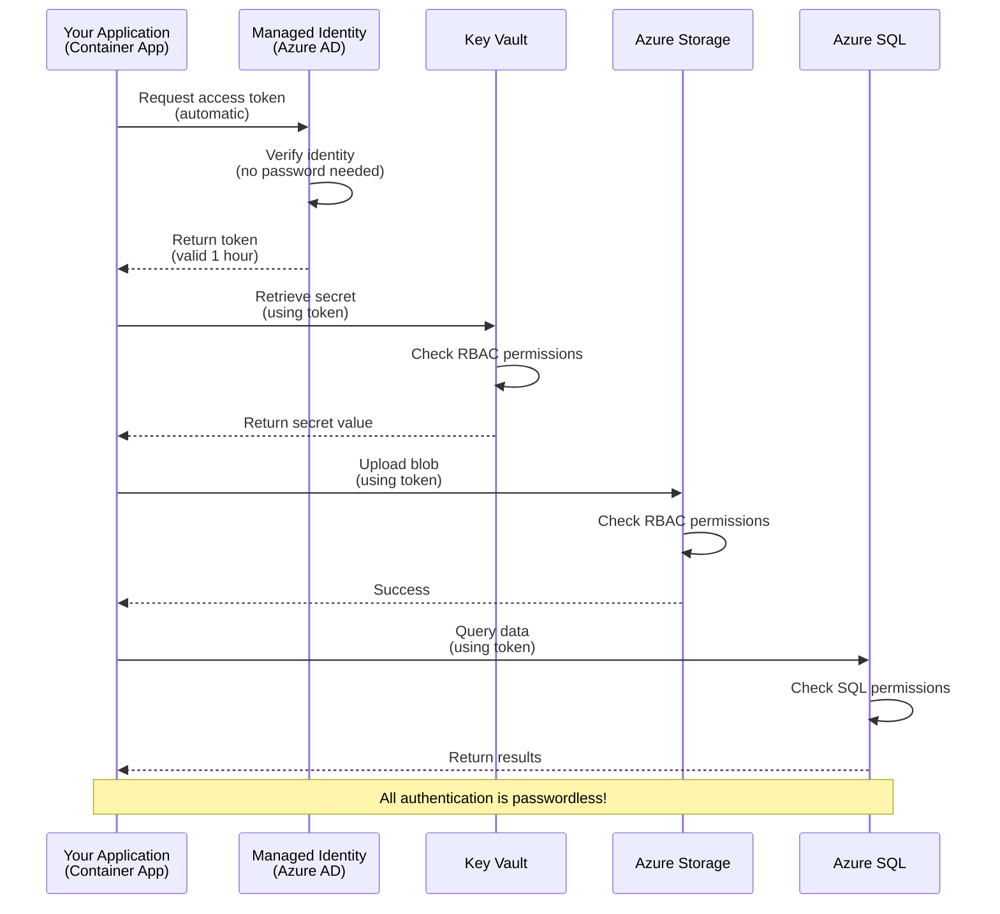
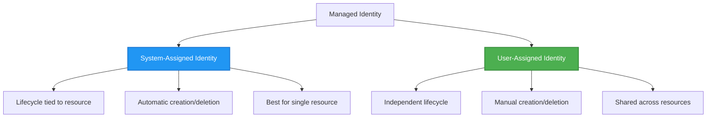

# Authentication Patterns and Managed Identity

⏱️ **Estimated Time**: 45-60 minutes | 💰 **Cost Impact**: Free (no additional charges) | ⭐ **Complexity**: Intermediate

**📚 Learning Path:**
- ← Previous: [Configuration Management](configuration.md) - Managing environment variables and secrets
- 🎯 **You Are Here**: Authentication & Security (Managed Identity, Key Vault, secure patterns)
- → Next: [First Project](first-project.md) - Build your first AZD application
- 🏠 [Course Home](../../README.md)

---

## What You'll Learn

By completing this lesson, you will:
- Understand Azure authentication patterns (keys, connection strings, managed identity)
- Implement **Managed Identity** for passwordless authentication
- Secure secrets with **Azure Key Vault** integration
- Configure **role-based access control (RBAC)** for AZD deployments
- Apply security best practices in Container Apps and Azure services
- Migrate from key-based to identity-based authentication

## Why Managed Identity Matters

### The Problem: Traditional Authentication

**Before Managed Identity:**
```javascript
// ❌ SECURITY RISK: Hardcoded secrets in code
const connectionString = "Server=mydb.database.windows.net;User=admin;Password=P@ssw0rd123";
const storageKey = "xK7mN9pQ2wR5tY8uI0oP3aS6dF1gH4jK...";
const cosmosKey = "C2x7B9n4M1p8Q5w3E6r0T2y5U8i1O4p7...";
```

**Problems:**
- 🔴 **Exposed secrets** in code, config files, environment variables
- 🔴 **Credential rotation** requires code changes and redeployment
- 🔴 **Audit nightmares** - who accessed what, when?
- 🔴 **Sprawl** - secrets scattered across multiple systems
- 🔴 **Compliance risks** - fails security audits

### The Solution: Managed Identity

**After Managed Identity:**
```javascript
// ✅ SECURE: No secrets in code
const credential = new DefaultAzureCredential();
const client = new BlobServiceClient(
  "https://mystorageaccount.blob.core.windows.net",
  credential  // Azure automatically handles authentication
);
```

**Benefits:**
- ✅ **Zero secrets** in code or configuration
- ✅ **Automatic rotation** - Azure handles it
- ✅ **Full audit trail** in Azure AD logs
- ✅ **Centralized security** - manage in Azure Portal
- ✅ **Compliance ready** - meets security standards

**Analogy**: Traditional authentication is like carrying multiple physical keys for different doors. Managed Identity is like having a security badge that automatically grants access based on who you are—no keys to lose, copy, or rotate.

---

## Architecture Overview

### Authentication Flow with Managed Identity


### Types of Managed Identities


| Feature | System-Assigned | User-Assigned |
|---------|----------------|---------------|
| **Lifecycle** | Tied to resource | Independent |
| **Creation** | Automatic with resource | Manual creation |
| **Deletion** | Deleted with resource | Persists after resource deletion |
| **Sharing** | One resource only | Multiple resources |
| **Use Case** | Simple scenarios | Complex multi-resource scenarios |
| **AZD Default** | ✅ Recommended | Optional |

---

## Prerequisites

### Required Tools

You should already have these installed from previous lessons:

```bash
# Verify Azure Developer CLI
azd version
# ✅ Expected: azd version 1.0.0 or higher

# Verify Azure CLI
az --version
# ✅ Expected: azure-cli 2.50.0 or higher
```

### Azure Requirements

- Active Azure subscription
- Permissions to:
  - Create managed identities
  - Assign RBAC roles
  - Create Key Vault resources
  - Deploy Container Apps

### Knowledge Prerequisites

You should have completed:
- [Installation Guide](installation.md) - AZD setup
- [AZD Basics](azd-basics.md) - Core concepts
- [Configuration Management](configuration.md) - Environment variables

---

## Lesson 1: Understanding Authentication Patterns

### Pattern 1: Connection Strings (Legacy - Avoid)

**How it works:**
```bash
# Connection string contains credentials
STORAGE_CONNECTION_STRING="DefaultEndpointsProtocol=https;AccountName=myaccount;AccountKey=xK7mN9pQ2wR5..."
COSMOS_CONNECTION_STRING="AccountEndpoint=https://myaccount.documents.azure.com:443/;AccountKey=C2x7..."
SQL_CONNECTION_STRING="Server=myserver.database.windows.net;User=admin;Password=P@ssw0rd..."
```

**Problems:**
- ❌ Secrets visible in environment variables
- ❌ Logged in deployment systems
- ❌ Difficult to rotate
- ❌ No audit trail of access

**When to use:** Only for local development, never production.

---

### Pattern 2: Key Vault References (Better)

**How it works:**
```bicep
// Store secret in Key Vault
resource keyVault 'Microsoft.KeyVault/vaults@2023-02-01' = {
  name: 'mykv'
  properties: {
    enableRbacAuthorization: true
  }
}

// Reference in Container App
env: [
  {
    name: 'STORAGE_KEY'
    secretRef: 'storage-key'  // References Key Vault
  }
]
```

**Benefits:**
- ✅ Secrets stored securely in Key Vault
- ✅ Centralized secret management
- ✅ Rotation without code changes

**Limitations:**
- ⚠️ Still using keys/passwords
- ⚠️ Need to manage Key Vault access

**When to use:** Transition step from connection strings to managed identity.

---

### Pattern 3: Managed Identity (Best Practice)

**How it works:**
```bicep
// Enable managed identity
resource containerApp 'Microsoft.App/containerApps@2023-05-01' = {
  name: 'myapp'
  identity: {
    type: 'SystemAssigned'  // Automatically creates identity
  }
}

// Grant permissions
resource roleAssignment 'Microsoft.Authorization/roleAssignments@2022-04-01' = {
  scope: storageAccount
  properties: {
    roleDefinitionId: storageBlobDataContributorRole
    principalId: containerApp.identity.principalId
  }
}
```

**Application code:**
```javascript
// No secrets needed!
const { DefaultAzureCredential } = require('@azure/identity');
const { BlobServiceClient } = require('@azure/storage-blob');

const credential = new DefaultAzureCredential();
const blobServiceClient = new BlobServiceClient(
  'https://mystorageaccount.blob.core.windows.net',
  credential
);
```

**Benefits:**
- ✅ Zero secrets in code/config
- ✅ Automatic credential rotation
- ✅ Full audit trail
- ✅ RBAC-based permissions
- ✅ Compliance ready

**When to use:** Always, for production applications.

---

## Lesson 2: Implementing Managed Identity with AZD

### Step-by-Step Implementation

Let's build a secure Container App that uses managed identity to access Azure Storage and Key Vault.

### Project Structure

```
secure-app/
├── azure.yaml                 # AZD configuration
├── infra/
│   ├── main.bicep            # Main infrastructure
│   ├── core/
│   │   ├── identity.bicep    # Managed identity setup
│   │   ├── keyvault.bicep    # Key Vault configuration
│   │   └── storage.bicep     # Storage with RBAC
│   └── app/
│       └── container-app.bicep
└── src/
    ├── app.js                # Application code
    ├── package.json
    └── Dockerfile
```

### 1. Configure AZD (azure.yaml)

```yaml
name: secure-app
metadata:
  template: secure-app@1.0.0

services:
  api:
    project: ./src
    language: js
    host: containerapp

# Enable managed identity (AZD handles this automatically)
```

### 2. Infrastructure: Enable Managed Identity

**File: `infra/main.bicep`**

```bicep
targetScope = 'subscription'

param environmentName string
param location string = 'eastus'

var tags = { 'azd-env-name': environmentName }

// Resource group
resource rg 'Microsoft.Resources/resourceGroups@2021-04-01' = {
  name: 'rg-${environmentName}'
  location: location
  tags: tags
}

// Storage Account
module storage './core/storage.bicep' = {
  name: 'storage'
  scope: rg
  params: {
    name: 'st${uniqueString(rg.id)}'
    location: location
    tags: tags
  }
}

// Key Vault
module keyVault './core/keyvault.bicep' = {
  name: 'keyvault'
  scope: rg
  params: {
    name: 'kv-${uniqueString(rg.id)}'
    location: location
    tags: tags
  }
}

// Container App with Managed Identity
module containerApp './app/container-app.bicep' = {
  name: 'container-app'
  scope: rg
  params: {
    name: 'ca-${environmentName}'
    location: location
    tags: tags
    storageAccountName: storage.outputs.name
    keyVaultName: keyVault.outputs.name
  }
}

// Grant Container App access to Storage
module storageRoleAssignment './core/role-assignment.bicep' = {
  name: 'storage-role'
  scope: rg
  params: {
    principalId: containerApp.outputs.identityPrincipalId
    roleDefinitionId: 'ba92f5b4-2d11-453d-a403-e96b0029c9fe'  // Storage Blob Data Contributor
    targetResourceId: storage.outputs.id
  }
}

// Grant Container App access to Key Vault
module kvRoleAssignment './core/role-assignment.bicep' = {
  name: 'kv-role'
  scope: rg
  params: {
    principalId: containerApp.outputs.identityPrincipalId
    roleDefinitionId: '4633458b-17de-408a-b874-0445c86b69e6'  // Key Vault Secrets User
    targetResourceId: keyVault.outputs.id
  }
}

// Outputs
output AZURE_STORAGE_ACCOUNT_NAME string = storage.outputs.name
output AZURE_KEY_VAULT_NAME string = keyVault.outputs.name
output APP_URL string = containerApp.outputs.url
```

### 3. Container App with System-Assigned Identity

**File: `infra/app/container-app.bicep`**

```bicep
param name string
param location string
param tags object = {}
param storageAccountName string
param keyVaultName string

resource containerApp 'Microsoft.App/containerApps@2023-05-01' = {
  name: name
  location: location
  tags: tags
  identity: {
    type: 'SystemAssigned'  // 🔑 Enable managed identity
  }
  properties: {
    configuration: {
      ingress: {
        external: true
        targetPort: 3000
      }
    }
    template: {
      containers: [
        {
          name: 'api'
          image: 'myregistry.azurecr.io/api:latest'
          resources: {
            cpu: json('0.5')
            memory: '1Gi'
          }
          env: [
            {
              name: 'AZURE_STORAGE_ACCOUNT_NAME'
              value: storageAccountName
            }
            {
              name: 'AZURE_KEY_VAULT_NAME'
              value: keyVaultName
            }
            // 🔑 No secrets - managed identity handles authentication!
          ]
        }
      ]
    }
  }
}

// Output the identity for RBAC assignments
output identityPrincipalId string = containerApp.identity.principalId
output id string = containerApp.id
output url string = 'https://${containerApp.properties.configuration.ingress.fqdn}'
```

### 4. RBAC Role Assignment Module

**File: `infra/core/role-assignment.bicep`**

```bicep
param principalId string
param roleDefinitionId string  // Azure built-in role ID
param targetResourceId string

resource roleAssignment 'Microsoft.Authorization/roleAssignments@2022-04-01' = {
  name: guid(principalId, roleDefinitionId, targetResourceId)
  scope: resourceId('Microsoft.Resources/resourceGroups', resourceGroup().name)
  properties: {
    roleDefinitionId: subscriptionResourceId('Microsoft.Authorization/roleDefinitions', roleDefinitionId)
    principalId: principalId
    principalType: 'ServicePrincipal'
  }
}

output id string = roleAssignment.id
```

### 5. Application Code with Managed Identity

**File: `src/app.js`**

```javascript
const express = require('express');
const { DefaultAzureCredential } = require('@azure/identity');
const { BlobServiceClient } = require('@azure/storage-blob');
const { SecretClient } = require('@azure/keyvault-secrets');

const app = express();
const PORT = process.env.PORT || 3000;

// 🔑 Initialize credential (works automatically with managed identity)
const credential = new DefaultAzureCredential();

// Azure Storage setup
const storageAccountName = process.env.AZURE_STORAGE_ACCOUNT_NAME;
const blobServiceClient = new BlobServiceClient(
  `https://${storageAccountName}.blob.core.windows.net`,
  credential  // No keys needed!
);

// Key Vault setup
const keyVaultName = process.env.AZURE_KEY_VAULT_NAME;
const secretClient = new SecretClient(
  `https://${keyVaultName}.vault.azure.net`,
  credential  // No keys needed!
);

// Health check
app.get('/health', (req, res) => {
  res.json({ status: 'healthy', authentication: 'managed-identity' });
});

// Upload file to blob storage
app.post('/upload', async (req, res) => {
  try {
    const containerClient = blobServiceClient.getContainerClient('uploads');
    await containerClient.createIfNotExists();
    
    const blobName = `file-${Date.now()}.txt`;
    const blockBlobClient = containerClient.getBlockBlobClient(blobName);
    
    await blockBlobClient.upload('Hello from managed identity!', 30);
    
    res.json({
      success: true,
      blobName: blobName,
      message: 'File uploaded using managed identity!'
    });
  } catch (error) {
    console.error('Upload error:', error);
    res.status(500).json({ error: error.message });
  }
});

// Get secret from Key Vault
app.get('/secret/:name', async (req, res) => {
  try {
    const secretName = req.params.name;
    const secret = await secretClient.getSecret(secretName);
    
    res.json({
      name: secretName,
      value: secret.value,
      message: 'Secret retrieved using managed identity!'
    });
  } catch (error) {
    console.error('Secret error:', error);
    res.status(500).json({ error: error.message });
  }
});

// List blob containers (demonstrates read access)
app.get('/containers', async (req, res) => {
  try {
    const containers = [];
    for await (const container of blobServiceClient.listContainers()) {
      containers.push(container.name);
    }
    
    res.json({
      containers: containers,
      count: containers.length,
      message: 'Containers listed using managed identity!'
    });
  } catch (error) {
    console.error('List error:', error);
    res.status(500).json({ error: error.message });
  }
});

app.listen(PORT, () => {
  console.log(`Secure API listening on port ${PORT}`);
  console.log('Authentication: Managed Identity (passwordless)');
});
```

**File: `src/package.json`**

```json
{
  "name": "secure-app",
  "version": "1.0.0",
  "dependencies": {
    "express": "^4.18.2",
    "@azure/identity": "^4.0.0",
    "@azure/storage-blob": "^12.17.0",
    "@azure/keyvault-secrets": "^4.7.0"
  },
  "scripts": {
    "start": "node app.js"
  }
}
```

### 6. Deploy and Test

```bash
# Initialize AZD environment
azd init

# Deploy infrastructure and application
azd up

# Get the app URL
APP_URL=$(azd env get-values | grep APP_URL | cut -d '=' -f2 | tr -d '"')

# Test health check
curl $APP_URL/health
```

**✅ Expected output:**
```json
{
  "status": "healthy",
  "authentication": "managed-identity"
}
```

**Test blob upload:**
```bash
curl -X POST $APP_URL/upload
```

**✅ Expected output:**
```json
{
  "success": true,
  "blobName": "file-1700404800000.txt",
  "message": "File uploaded using managed identity!"
}
```

**Test container listing:**
```bash
curl $APP_URL/containers
```

**✅ Expected output:**
```json
{
  "containers": ["uploads"],
  "count": 1,
  "message": "Containers listed using managed identity!"
}
```

---

## Common Azure RBAC Roles

### Built-in Role IDs for Managed Identity

| Service | Role Name | Role ID | Permissions |
|---------|-----------|---------|-------------|
| **Storage** | Storage Blob Data Reader | `2a2b9908-6b94-4a3d-8e5a-a7d8f8cc8a12` | Read blobs and containers |
| **Storage** | Storage Blob Data Contributor | `ba92f5b4-2d11-453d-a403-e96b0029c9fe` | Read, write, delete blobs |
| **Storage** | Storage Queue Data Contributor | `974c5e8b-45b9-4653-ba55-5f855dd0fb88` | Read, write, delete queue messages |
| **Key Vault** | Key Vault Secrets User | `4633458b-17de-408a-b874-0445c86b69e6` | Read secrets |
| **Key Vault** | Key Vault Secrets Officer | `b86a8fe4-44ce-4948-aee5-eccb2c155cd7` | Read, write, delete secrets |
| **Cosmos DB** | Cosmos DB Built-in Data Reader | `00000000-0000-0000-0000-000000000001` | Read Cosmos DB data |
| **Cosmos DB** | Cosmos DB Built-in Data Contributor | `00000000-0000-0000-0000-000000000002` | Read, write Cosmos DB data |
| **SQL Database** | SQL DB Contributor | `9b7fa17d-e63e-47b0-bb0a-15c516ac86ec` | Manage SQL databases |
| **Service Bus** | Azure Service Bus Data Owner | `090c5cfd-751d-490a-894a-3ce6f1109419` | Send, receive, manage messages |

### How to Find Role IDs

```bash
# List all built-in roles
az role definition list --query "[].{Name:roleName, ID:name}" --output table

# Search for specific role
az role definition list --query "[?contains(roleName, 'Storage Blob')].{Name:roleName, ID:name}" --output table

# Get role details
az role definition list --name "Storage Blob Data Contributor"
```

---

## Practical Exercises

### Exercise 1: Enable Managed Identity for Existing App ⭐⭐ (Medium)

**Goal**: Add managed identity to an existing Container App deployment

**Scenario**: You have a Container App using connection strings. Convert it to managed identity.

**Starting Point**: Container App with this configuration:

```bicep
// ❌ Current: Using connection string
env: [
  {
    name: 'STORAGE_CONNECTION_STRING'
    secretRef: 'storage-connection'
  }
]
```

**Steps**:

1. **Enable managed identity in Bicep:**

```bicep
resource containerApp 'Microsoft.App/containerApps@2023-05-01' = {
  name: 'myapp'
  identity: {
    type: 'SystemAssigned'  // Add this
  }
  // ... rest of configuration
}
```

2. **Grant Storage access:**

```bicep
// Get storage account reference
resource storageAccount 'Microsoft.Storage/storageAccounts@2023-01-01' existing = {
  name: storageAccountName
}

// Assign role
resource roleAssignment 'Microsoft.Authorization/roleAssignments@2022-04-01' = {
  name: guid(containerApp.id, 'ba92f5b4-2d11-453d-a403-e96b0029c9fe', storageAccount.id)
  scope: storageAccount
  properties: {
    roleDefinitionId: subscriptionResourceId('Microsoft.Authorization/roleDefinitions', 'ba92f5b4-2d11-453d-a403-e96b0029c9fe')
    principalId: containerApp.identity.principalId
    principalType: 'ServicePrincipal'
  }
}
```

3. **Update application code:**

**Before (connection string):**
```javascript
const { BlobServiceClient } = require('@azure/storage-blob');

const blobServiceClient = BlobServiceClient.fromConnectionString(
  process.env.STORAGE_CONNECTION_STRING
);
```

**After (managed identity):**
```javascript
const { DefaultAzureCredential } = require('@azure/identity');
const { BlobServiceClient } = require('@azure/storage-blob');

const credential = new DefaultAzureCredential();
const blobServiceClient = new BlobServiceClient(
  `https://${process.env.STORAGE_ACCOUNT_NAME}.blob.core.windows.net`,
  credential
);
```

4. **Update environment variables:**

```bicep
env: [
  {
    name: 'STORAGE_ACCOUNT_NAME'
    value: storageAccountName  // Just the name, no secrets!
  }
  // Remove STORAGE_CONNECTION_STRING
]
```

5. **Deploy and test:**

```bash
# Redeploy
azd up

# Test that it still works
curl https://myapp.azurecontainerapps.io/upload
```

**✅ Success Criteria:**
- ✅ Application deploys without errors
- ✅ Storage operations work (upload, list, download)
- ✅ No connection strings in environment variables
- ✅ Identity visible in Azure Portal under "Identity" blade

**Verification:**

```bash
# Check managed identity is enabled
az containerapp show \
  --name myapp \
  --resource-group rg-myapp \
  --query "identity.type"
# ✅ Expected: "SystemAssigned"

# Check role assignment
az role assignment list \
  --assignee $(az containerapp show --name myapp --resource-group rg-myapp --query "identity.principalId" -o tsv) \
  --scope /subscriptions/{sub-id}/resourceGroups/rg-myapp/providers/Microsoft.Storage/storageAccounts/mystorageaccount
# ✅ Expected: Shows "Storage Blob Data Contributor" role
```

**Time**: 20-30 minutes

---

### Exercise 2: Multi-Service Access with User-Assigned Identity ⭐⭐⭐ (Advanced)

**Goal**: Create a user-assigned identity shared across multiple Container Apps

**Scenario**: You have 3 microservices that all need access to the same Storage account and Key Vault.

**Steps**:

1. **Create user-assigned identity:**

**File: `infra/core/identity.bicep`**

```bicep
param name string
param location string
param tags object = {}

resource userAssignedIdentity 'Microsoft.ManagedIdentity/userAssignedIdentities@2023-01-31' = {
  name: name
  location: location
  tags: tags
}

output id string = userAssignedIdentity.id
output principalId string = userAssignedIdentity.properties.principalId
output clientId string = userAssignedIdentity.properties.clientId
```

2. **Assign roles to user-assigned identity:**

```bicep
// In main.bicep
module userIdentity './core/identity.bicep' = {
  name: 'user-identity'
  scope: rg
  params: {
    name: 'id-${environmentName}'
    location: location
    tags: tags
  }
}

// Grant Storage access
resource storageRoleAssignment 'Microsoft.Authorization/roleAssignments@2022-04-01' = {
  name: guid(userIdentity.outputs.principalId, 'storage-contributor')
  scope: storageAccount
  properties: {
    roleDefinitionId: subscriptionResourceId('Microsoft.Authorization/roleDefinitions', 'ba92f5b4-2d11-453d-a403-e96b0029c9fe')
    principalId: userIdentity.outputs.principalId
    principalType: 'ServicePrincipal'
  }
}

// Grant Key Vault access
resource kvRoleAssignment 'Microsoft.Authorization/roleAssignments@2022-04-01' = {
  name: guid(userIdentity.outputs.principalId, 'kv-secrets-user')
  scope: keyVault
  properties: {
    roleDefinitionId: subscriptionResourceId('Microsoft.Authorization/roleDefinitions', '4633458b-17de-408a-b874-0445c86b69e6')
    principalId: userIdentity.outputs.principalId
    principalType: 'ServicePrincipal'
  }
}
```

3. **Assign identity to multiple Container Apps:**

```bicep
resource apiGateway 'Microsoft.App/containerApps@2023-05-01' = {
  name: 'api-gateway'
  identity: {
    type: 'UserAssigned'
    userAssignedIdentities: {
      '${userIdentity.outputs.id}': {}
    }
  }
  // ... rest of config
}

resource productService 'Microsoft.App/containerApps@2023-05-01' = {
  name: 'product-service'
  identity: {
    type: 'UserAssigned'
    userAssignedIdentities: {
      '${userIdentity.outputs.id}': {}
    }
  }
  // ... rest of config
}

resource orderService 'Microsoft.App/containerApps@2023-05-01' = {
  name: 'order-service'
  identity: {
    type: 'UserAssigned'
    userAssignedIdentities: {
      '${userIdentity.outputs.id}': {}
    }
  }
  // ... rest of config
}
```

4. **Application code (all services use same pattern):**

```javascript
const { DefaultAzureCredential, ManagedIdentityCredential } = require('@azure/identity');

// For user-assigned identity, specify the client ID
const credential = new ManagedIdentityCredential(
  process.env.AZURE_CLIENT_ID  // User-assigned identity client ID
);

// Or use DefaultAzureCredential (auto-detects)
const credential = new DefaultAzureCredential();

const blobServiceClient = new BlobServiceClient(
  `https://${process.env.STORAGE_ACCOUNT_NAME}.blob.core.windows.net`,
  credential
);
```

5. **Deploy and verify:**

```bash
azd up

# Test all services can access storage
curl https://api-gateway.azurecontainerapps.io/upload
curl https://product-service.azurecontainerapps.io/upload
curl https://order-service.azurecontainerapps.io/upload
```

**✅ Success Criteria:**
- ✅ One identity shared across 3 services
- ✅ All services can access Storage and Key Vault
- ✅ Identity persists if you delete one service
- ✅ Centralized permission management

**Benefits of User-Assigned Identity:**
- Single identity to manage
- Consistent permissions across services
- Survives service deletion
- Better for complex architectures

**Time**: 30-40 minutes

---

### Exercise 3: Implement Key Vault Secret Rotation ⭐⭐⭐ (Advanced)

**Goal**: Store third-party API keys in Key Vault and access them using managed identity

**Scenario**: Your app needs to call an external API (OpenAI, Stripe, SendGrid) that requires API keys.

**Steps**:

1. **Create Key Vault with RBAC:**

**File: `infra/core/keyvault.bicep`**

```bicep
param name string
param location string
param tags object = {}

resource keyVault 'Microsoft.KeyVault/vaults@2023-02-01' = {
  name: name
  location: location
  tags: tags
  properties: {
    enableRbacAuthorization: true  // Use RBAC instead of access policies
    sku: {
      family: 'A'
      name: 'standard'
    }
    tenantId: subscription().tenantId
    enableSoftDelete: true
    softDeleteRetentionInDays: 90
  }
}

// Allow Container App to read secrets
output id string = keyVault.id
output name string = keyVault.name
output uri string = keyVault.properties.vaultUri
```

2. **Store secrets in Key Vault:**

```bash
# Get Key Vault name
KV_NAME=$(azd env get-values | grep AZURE_KEY_VAULT_NAME | cut -d '=' -f2 | tr -d '"')

# Store third-party API keys
az keyvault secret set \
  --vault-name $KV_NAME \
  --name "OpenAI-ApiKey" \
  --value "sk-proj-xxxxxxxxxxxxx"

az keyvault secret set \
  --vault-name $KV_NAME \
  --name "Stripe-ApiKey" \
  --value "sk_live_xxxxxxxxxxxxx"

az keyvault secret set \
  --vault-name $KV_NAME \
  --name "SendGrid-ApiKey" \
  --value "SG.xxxxxxxxxxxxx"
```

3. **Application code to retrieve secrets:**

**File: `src/config.js`**

```javascript
const { DefaultAzureCredential } = require('@azure/identity');
const { SecretClient } = require('@azure/keyvault-secrets');

class Config {
  constructor() {
    this.credential = new DefaultAzureCredential();
    this.secretClient = new SecretClient(
      `https://${process.env.AZURE_KEY_VAULT_NAME}.vault.azure.net`,
      this.credential
    );
    this.cache = {};
  }

  async getSecret(secretName) {
    // Check cache first
    if (this.cache[secretName]) {
      return this.cache[secretName];
    }

    try {
      const secret = await this.secretClient.getSecret(secretName);
      this.cache[secretName] = secret.value;
      console.log(`✅ Retrieved secret: ${secretName}`);
      return secret.value;
    } catch (error) {
      console.error(`❌ Failed to get secret ${secretName}:`, error.message);
      throw error;
    }
  }

  async getOpenAIKey() {
    return this.getSecret('OpenAI-ApiKey');
  }

  async getStripeKey() {
    return this.getSecret('Stripe-ApiKey');
  }

  async getSendGridKey() {
    return this.getSecret('SendGrid-ApiKey');
  }
}

module.exports = new Config();
```

4. **Use secrets in application:**

**File: `src/app.js`**

```javascript
const express = require('express');
const config = require('./config');
const { OpenAI } = require('openai');

const app = express();

// Initialize OpenAI with key from Key Vault
let openaiClient;

async function initializeServices() {
  const openaiKey = await config.getOpenAIKey();
  openaiClient = new OpenAI({ apiKey: openaiKey });
  console.log('✅ Services initialized with secrets from Key Vault');
}

// Call on startup
initializeServices().catch(console.error);

app.post('/chat', async (req, res) => {
  try {
    const completion = await openaiClient.chat.completions.create({
      model: 'gpt-4',
      messages: [{ role: 'user', content: 'Hello!' }]
    });
    
    res.json({
      response: completion.choices[0].message.content,
      authentication: 'Key from Key Vault via Managed Identity'
    });
  } catch (error) {
    res.status(500).json({ error: error.message });
  }
});

app.listen(3000, () => {
  console.log('Secure API with Key Vault integration running');
});
```

5. **Deploy and test:**

```bash
azd up

# Test that API keys work
curl -X POST https://myapp.azurecontainerapps.io/chat \
  -H "Content-Type: application/json" \
  -d '{"message":"Hello AI"}'
```

**✅ Success Criteria:**
- ✅ No API keys in code or environment variables
- ✅ Application retrieves keys from Key Vault
- ✅ Third-party APIs work correctly
- ✅ Can rotate keys without code changes

**Rotate a secret:**

```bash
# Update secret in Key Vault
az keyvault secret set \
  --vault-name $KV_NAME \
  --name "OpenAI-ApiKey" \
  --value "sk-proj-NEW_KEY_HERE"

# Restart app to pick up new key
az containerapp revision restart \
  --name myapp \
  --resource-group rg-myapp
```

**Time**: 25-35 minutes

---

## Knowledge Checkpoint

### 1. Authentication Patterns ✓

Test your understanding:

- [ ] **Q1**: What are the three main authentication patterns? 
  - **A**: Connection strings (legacy), Key Vault references (transition), Managed Identity (best)

- [ ] **Q2**: Why is managed identity better than connection strings?
  - **A**: No secrets in code, automatic rotation, full audit trail, RBAC permissions

- [ ] **Q3**: When would you use user-assigned identity instead of system-assigned?
  - **A**: When sharing identity across multiple resources or when identity lifecycle is independent of resource lifecycle

**Hands-On Verification:**
```bash
# Check what type of identity your app uses
az containerapp show \
  --name myapp \
  --resource-group rg-myapp \
  --query "identity.type"

# List all role assignments for the identity
az role assignment list \
  --assignee $(az containerapp show --name myapp --resource-group rg-myapp --query "identity.principalId" -o tsv)
```

---

### 2. RBAC and Permissions ✓

Test your understanding:

- [ ] **Q1**: What's the role ID for "Storage Blob Data Contributor"?
  - **A**: `ba92f5b4-2d11-453d-a403-e96b0029c9fe`

- [ ] **Q2**: What permissions does "Key Vault Secrets User" provide?
  - **A**: Read-only access to secrets (cannot create, update, or delete)

- [ ] **Q3**: How do you grant a Container App access to Azure SQL?
  - **A**: Assign "SQL DB Contributor" role or configure Azure AD authentication for SQL

**Hands-On Verification:**
```bash
# Find specific role
az role definition list --name "Storage Blob Data Contributor"

# Check what roles are assigned to your identity
PRINCIPAL_ID=$(az containerapp show --name myapp --resource-group rg-myapp --query "identity.principalId" -o tsv)
az role assignment list --assignee $PRINCIPAL_ID --output table
```

---

### 3. Key Vault Integration ✓

Test your understanding:
- [ ] **Q1**: How do you enable RBAC for Key Vault instead of access policies?  
  - **A**: Set `enableRbacAuthorization: true` in Bicep  

- [ ] **Q2**: What Azure SDK library handles managed identity authentication?  
  - **A**: `@azure/identity` with `DefaultAzureCredential` class  

- [ ] **Q3**: How long do Key Vault secrets stay in cache?  
  - **A**: Application-dependent; implement your own caching strategy  

**Hands-On Verification:**  
```bash
# Test Key Vault access
az keyvault secret show \
  --vault-name $KV_NAME \
  --name "OpenAI-ApiKey" \
  --query "value"

# Check RBAC is enabled
az keyvault show \
  --name $KV_NAME \
  --query "properties.enableRbacAuthorization"
# ✅ Expected: true
```
  
---

## Security Best Practices  

### ✅ DO:  

1. **Always use managed identity in production**  
   ```bicep
   identity: {
     type: 'SystemAssigned'
   }
   ```
  
2. **Use least-privilege RBAC roles**  
   - Use "Reader" roles when possible  
   - Avoid "Owner" or "Contributor" unless necessary  

3. **Store third-party keys in Key Vault**  
   ```javascript
   const apiKey = await secretClient.getSecret('ThirdPartyApiKey');
   ```
  
4. **Enable audit logging**  
   ```bicep
   diagnosticSettings: {
     logs: [{ category: 'AuditEvent', enabled: true }]
   }
   ```
  
5. **Use different identities for dev/staging/prod**  
   ```bash
   azd env new dev
   azd env new staging
   azd env new prod
   ```
  
6. **Rotate secrets regularly**  
   - Set expiration dates on Key Vault secrets  
   - Automate rotation with Azure Functions  

### ❌ DON'T:  

1. **Never hardcode secrets**  
   ```javascript
   // ❌ BAD
   const apiKey = "sk-proj-xxxxxxxxxxxxx";
   ```
  
2. **Don't use connection strings in production**  
   ```javascript
   // ❌ BAD
   BlobServiceClient.fromConnectionString(process.env.STORAGE_CONNECTION_STRING)
   ```
  
3. **Don't grant excessive permissions**  
   ```bicep
   // ❌ BAD - too much access
   roleDefinitionId: 'Owner'
   
   // ✅ GOOD - least privilege
   roleDefinitionId: 'Storage Blob Data Reader'
   ```
  
4. **Don't log secrets**  
   ```javascript
   // ❌ BAD
   console.log('API Key:', apiKey);
   
   // ✅ GOOD
   console.log('API Key retrieved successfully');
   ```
  
5. **Don't share production identities across environments**  
   ```bicep
   // ❌ BAD - same identity for dev and prod
   // ✅ GOOD - separate identities per environment
   ```
  
---

## Troubleshooting Guide  

### Problem: "Unauthorized" when accessing Azure Storage  

**Symptoms:**  
```
Error: Unauthorized (403)
AuthorizationPermissionMismatch: This request is not authorized to perform this operation
```
  
**Diagnosis:**  

```bash
# Check if managed identity is enabled
az containerapp show \
  --name myapp \
  --resource-group rg-myapp \
  --query "identity.type"
# ✅ Expected: "SystemAssigned" or "UserAssigned"

# Check role assignments
PRINCIPAL_ID=$(az containerapp show --name myapp --resource-group rg-myapp --query "identity.principalId" -o tsv)
az role assignment list --assignee $PRINCIPAL_ID

# Expected: Should see "Storage Blob Data Contributor" or similar role
```
  
**Solutions:**  

1. **Grant correct RBAC role:**  
```bash
STORAGE_ID=$(az storage account show --name mystorageaccount --resource-group rg-myapp --query "id" -o tsv)
az role assignment create \
  --assignee $PRINCIPAL_ID \
  --role "Storage Blob Data Contributor" \
  --scope $STORAGE_ID
```
  
2. **Wait for propagation (can take 5-10 minutes):**  
```bash
# Check role assignment status
az role assignment list --assignee $PRINCIPAL_ID --scope $STORAGE_ID
```
  
3. **Verify application code uses correct credential:**  
```javascript
// Make sure you're using DefaultAzureCredential
const credential = new DefaultAzureCredential();
```
  
---

### Problem: Key Vault access denied  

**Symptoms:**  
```
Error: Forbidden (403)
The user, group or application does not have secrets get permission
```
  
**Diagnosis:**  

```bash
# Check if Key Vault RBAC is enabled
az keyvault show \
  --name $KV_NAME \
  --query "properties.enableRbacAuthorization"
# ✅ Expected: true

# Check the role assignments
az role assignment list \
  --assignee $PRINCIPAL_ID \
  --scope /subscriptions/{sub-id}/resourceGroups/rg-myapp/providers/Microsoft.KeyVault/vaults/$KV_NAME
```
  
**Solutions:**  

1. **Enable RBAC on Key Vault:**  
```bash
az keyvault update \
  --name $KV_NAME \
  --enable-rbac-authorization true
```
  
2. **Grant Key Vault Secrets User role:**  
```bash
KV_ID=$(az keyvault show --name $KV_NAME --query "id" -o tsv)
az role assignment create \
  --assignee $PRINCIPAL_ID \
  --role "Key Vault Secrets User" \
  --scope $KV_ID
```
  
---

### Problem: DefaultAzureCredential fails locally  

**Symptoms:**  
```
Error: DefaultAzureCredential failed to retrieve a token
CredentialUnavailableError: No credential available
```
  
**Diagnosis:**  

```bash
# Check if you are logged in
az account show

# Check Azure CLI authentication
az ad signed-in-user show
```
  
**Solutions:**  

1. **Login to Azure CLI:**  
```bash
az login
```
  
2. **Set Azure subscription:**  
```bash
az account set --subscription "Your Subscription Name"
```
  
3. **For local development, use environment variables:**  
```bash
export AZURE_TENANT_ID="your-tenant-id"
export AZURE_CLIENT_ID="your-client-id"
export AZURE_CLIENT_SECRET="your-client-secret"
```
  
4. **Or use different credential locally:**  
```javascript
const { DefaultAzureCredential, AzureCliCredential } = require('@azure/identity');

// Use AzureCliCredential for local development
const credential = process.env.NODE_ENV === 'production' 
  ? new DefaultAzureCredential()
  : new AzureCliCredential();
```
  
---

### Problem: Role assignment takes too long to propagate  

**Symptoms:**  
- Role assigned successfully  
- Still getting 403 errors  
- Intermittent access (sometimes works, sometimes doesn't)  

**Explanation:**  
Azure RBAC changes can take 5-10 minutes to propagate globally.  

**Solution:**  

```bash
# Wait and retry
echo "Waiting for RBAC propagation..."
sleep 300  # Wait 5 minutes

# Test access
curl https://myapp.azurecontainerapps.io/upload

# If still failing, restart the app
az containerapp revision restart \
  --name myapp \
  --resource-group rg-myapp
```
  
---

## Cost Considerations  

### Managed Identity Costs  

| Resource | Cost |  
|----------|------|  
| **Managed Identity** | 🆓 **FREE** - No charge |  
| **RBAC Role Assignments** | 🆓 **FREE** - No charge |  
| **Azure AD Token Requests** | 🆓 **FREE** - Included |  
| **Key Vault Operations** | $0.03 per 10,000 operations |  
| **Key Vault Storage** | $0.024 per secret per month |  

**Managed identity saves money by:**  
- ✅ Eliminating Key Vault operations for service-to-service auth  
- ✅ Reducing security incidents (no leaked credentials)  
- ✅ Decreasing operational overhead (no manual rotation)  

**Example Cost Comparison (monthly):**  

| Scenario | Connection Strings | Managed Identity | Savings |  
|----------|-------------------|-----------------|---------|  
| Small app (1M requests) | ~$50 (Key Vault + ops) | ~$0 | $50/month |  
| Medium app (10M requests) | ~$200 | ~$0 | $200/month |  
| Large app (100M requests) | ~$1,500 | ~$0 | $1,500/month |  

---

## Learn More  

### Official Documentation  
- [Azure Managed Identity](https://learn.microsoft.com/entra/identity/managed-identities-azure-resources/overview)  
- [Azure RBAC](https://learn.microsoft.com/azure/role-based-access-control/overview)  
- [Azure Key Vault](https://learn.microsoft.com/azure/key-vault/general/overview)  
- [DefaultAzureCredential](https://learn.microsoft.com/dotnet/api/azure.identity.defaultazurecredential)  

### SDK Documentation  
- [@azure/identity (Node.js)](https://www.npmjs.com/package/@azure/identity)  
- [Azure.Identity (C#)](https://www.nuget.org/packages/Azure.Identity/)  
- [azure-identity (Python)](https://pypi.org/project/azure-identity/)  

### Next Steps in This Course  
- ← Previous: [Configuration Management](configuration.md)  
- → Next: [First Project](first-project.md)  
- 🏠 [Course Home](../../README.md)  

### Related Examples  
- [Azure OpenAI Chat Example](../../../../examples/azure-openai-chat) - Uses managed identity for Azure OpenAI  
- [Microservices Example](../../../../examples/microservices) - Multi-service authentication patterns  

---

## Summary  

**You've learned:**  
- ✅ Three authentication patterns (connection strings, Key Vault, managed identity)  
- ✅ How to enable and configure managed identity in AZD  
- ✅ RBAC role assignments for Azure services  
- ✅ Key Vault integration for third-party secrets  
- ✅ User-assigned vs system-assigned identities  
- ✅ Security best practices and troubleshooting  

**Key Takeaways:**  
1. **Always use managed identity in production** - Zero secrets, automatic rotation  
2. **Use least-privilege RBAC roles** - Grant only necessary permissions  
3. **Store third-party keys in Key Vault** - Centralized secret management  
4. **Separate identities per environment** - Dev, staging, prod isolation  
5. **Enable audit logging** - Track who accessed what  

**Next Steps:**  
1. Complete the practical exercises above  
2. Migrate an existing app from connection strings to managed identity  
3. Build your first AZD project with security from day one: [First Project](first-project.md)  

---

<!-- CO-OP TRANSLATOR DISCLAIMER START -->
**Disclaimer**:  
This document has been translated using the AI translation service [Co-op Translator](https://github.com/Azure/co-op-translator). While we aim for accuracy, please note that automated translations may include errors or inaccuracies. The original document in its native language should be regarded as the authoritative source. For critical information, professional human translation is advised. We are not responsible for any misunderstandings or misinterpretations resulting from the use of this translation.
<!-- CO-OP TRANSLATOR DISCLAIMER END -->