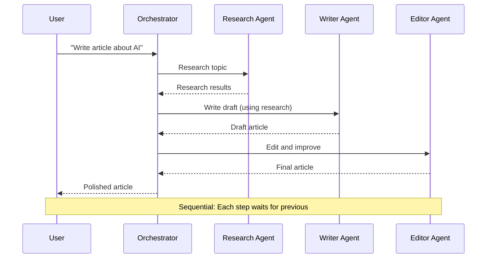
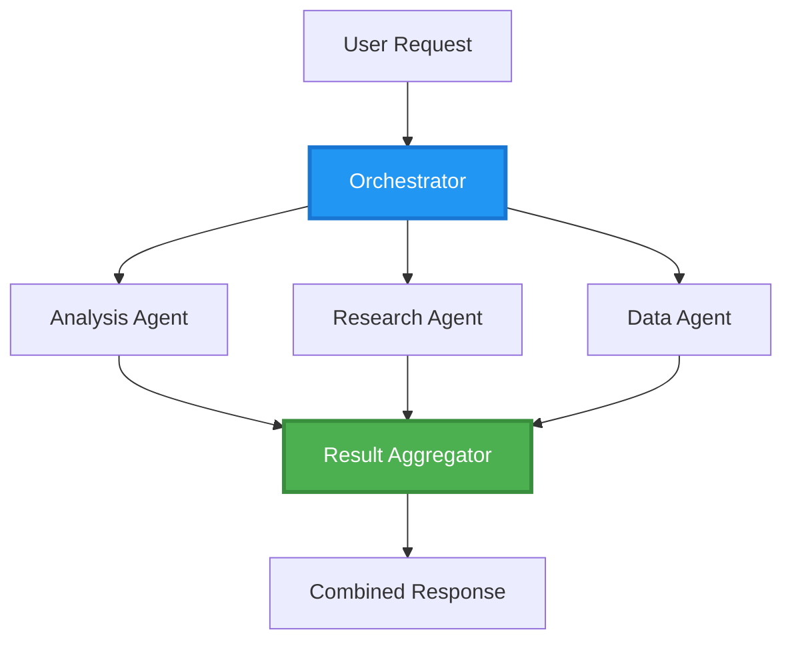
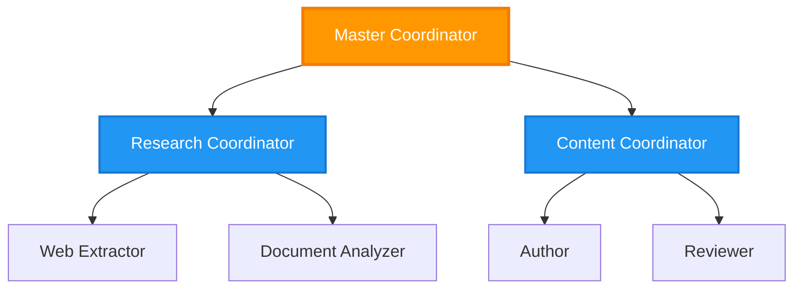
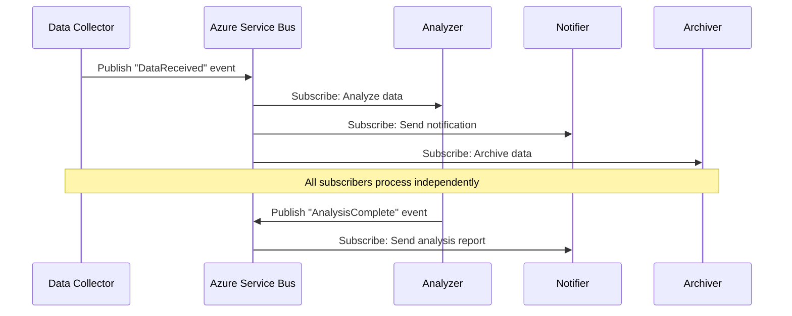
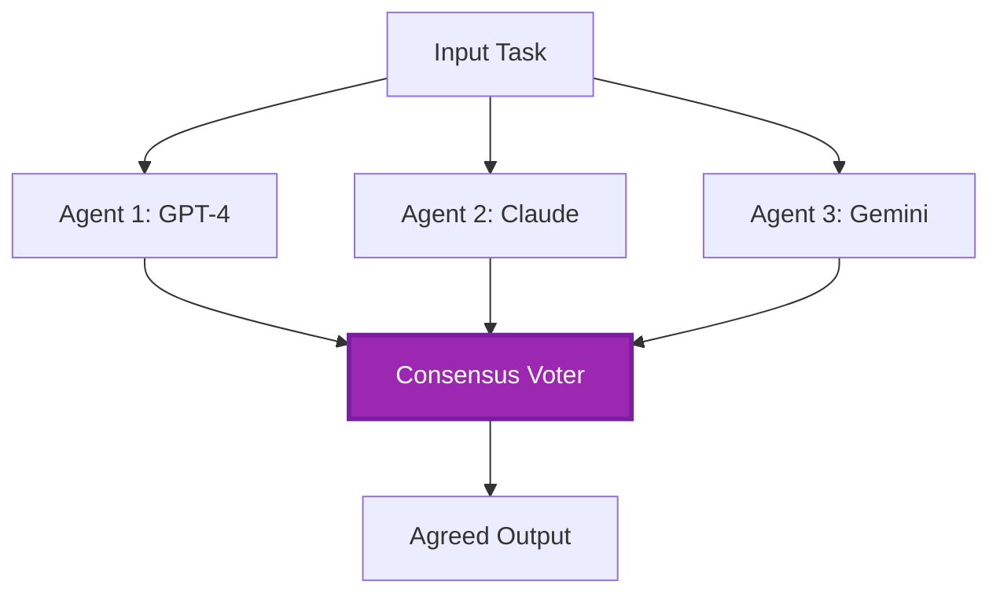
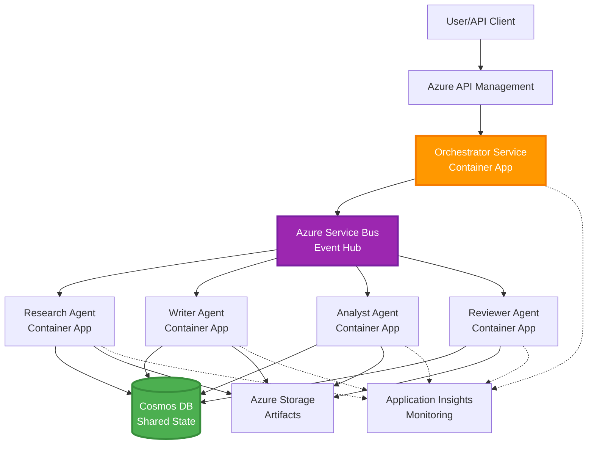

# Multi-Agent Coordination Patterns

⏱️ **Estimated Time**: 60-75 minutes | 💰 **Estimated Cost**: ~$100-300/month | ⭐ **Complexity**: Advanced

**📚 Learning Path:**
- ← Previous: [Capacity Planning](capacity-planning.md) - Strategies for resource sizing and scaling
- 🎯 **You Are Here**: Multi-Agent Coordination Patterns (Orchestration, communication, state management)
- → Next: [SKU Selection](sku-selection.md) - Selecting the right Azure services
- 🏠 [Course Home](../../README.md)

---

## What You'll Learn

By completing this lesson, you will:
- Understand **multi-agent architecture** patterns and when to apply them
- Implement **orchestration patterns** (centralized, decentralized, hierarchical)
- Design **agent communication** strategies (synchronous, asynchronous, event-driven)
- Manage **shared state** across distributed agents
- Deploy **multi-agent systems** on Azure with AZD
- Apply **coordination patterns** to real-world AI scenarios
- Monitor and debug distributed agent systems

## Why Multi-Agent Coordination Matters

### The Evolution: From Single Agent to Multi-Agent

**Single Agent (Simple):**
```
User → Agent → Response
```
- ✅ Easy to understand and implement
- ✅ Fast for simple tasks
- ❌ Limited by the capabilities of a single model
- ❌ Cannot parallelize complex tasks
- ❌ No specialization

**Multi-Agent System (Advanced):**
```
           ┌─────────────┐
           │ Orchestrator│
           └──────┬──────┘
        ┌─────────┼─────────┐
        │         │         │
    ┌───▼──┐  ┌──▼───┐  ┌──▼────┐
    │Agent1│  │Agent2│  │Agent3 │
    │(Plan)│  │(Code)│  │(Review)│
    └──────┘  └──────┘  └───────┘
```
- ✅ Specialized agents for specific tasks
- ✅ Parallel execution for faster results
- ✅ Modular and maintainable
- ✅ Better suited for complex workflows
- ⚠️ Requires coordination logic

**Analogy**: A single agent is like one person doing all the tasks. A multi-agent system is like a team where each member has specialized skills (researcher, coder, reviewer, writer) working together.

---

## Core Coordination Patterns

### Pattern 1: Sequential Coordination (Chain of Responsibility)

**When to use**: Tasks must be completed in a specific order, with each agent building on the output of the previous one.


**Benefits:**
- ✅ Clear data flow
- ✅ Easy to debug
- ✅ Predictable execution order

**Limitations:**
- ❌ Slower (no parallelism)
- ❌ One failure blocks the entire chain
- ❌ Cannot handle interdependent tasks

**Example Use Cases:**
- Content creation pipeline (research → write → edit → publish)
- Code generation (plan → implement → test → deploy)
- Report generation (data collection → analysis → visualization → summary)

---

### Pattern 2: Parallel Coordination (Fan-Out/Fan-In)

**When to use**: Independent tasks can run simultaneously, with results combined at the end.


**Benefits:**
- ✅ Fast (parallel execution)
- ✅ Fault-tolerant (partial results are acceptable)
- ✅ Scales horizontally

**Limitations:**
- ⚠️ Results may arrive out of order
- ⚠️ Requires aggregation logic
- ⚠️ Complex state management

**Example Use Cases:**
- Multi-source data gathering (APIs + databases + web scraping)
- Competitive analysis (multiple models generate solutions, best one selected)
- Translation services (translate into multiple languages simultaneously)

---

### Pattern 3: Hierarchical Coordination (Manager-Worker)

**When to use**: Complex workflows with sub-tasks that require delegation.


**Benefits:**
- ✅ Handles complex workflows
- ✅ Modular and maintainable
- ✅ Clear responsibility boundaries

**Limitations:**
- ⚠️ More complex architecture
- ⚠️ Higher latency (multiple coordination layers)
- ⚠️ Requires sophisticated orchestration

**Example Use Cases:**
- Enterprise document processing (classify → route → process → archive)
- Multi-stage data pipelines (ingest → clean → transform → analyze → report)
- Complex automation workflows (planning → resource allocation → execution → monitoring)

---

### Pattern 4: Event-Driven Coordination (Publish-Subscribe)

**When to use**: Agents need to react to events, and loose coupling is desired.


**Benefits:**
- ✅ Loose coupling between agents
- ✅ Easy to add new agents (just subscribe)
- ✅ Asynchronous processing
- ✅ Resilient (message persistence)

**Limitations:**
- ⚠️ Eventual consistency
- ⚠️ Complex debugging
- ⚠️ Message ordering challenges

**Example Use Cases:**
- Real-time monitoring systems (alerts, dashboards, logs)
- Multi-channel notifications (email, SMS, push, Slack)
- Data processing pipelines (multiple consumers of the same data)

---

### Pattern 5: Consensus-Based Coordination (Voting/Quorum)

**When to use**: Agreement from multiple agents is required before proceeding.


**Benefits:**
- ✅ Higher accuracy (multiple opinions)
- ✅ Fault-tolerant (minority failures are acceptable)
- ✅ Quality assurance built-in

**Limitations:**
- ❌ Expensive (multiple model calls)
- ❌ Slower (waiting for all agents)
- ⚠️ Conflict resolution needed

**Example Use Cases:**
- Content moderation (multiple models review content)
- Code review (multiple linters/analyzers)
- Medical diagnosis (multiple AI models, expert validation)

---

## Architecture Overview

### Complete Multi-Agent System on Azure


**Key Components:**

| Component | Purpose | Azure Service |
|-----------|---------|---------------|
| **API Gateway** | Entry point, rate limiting, authentication | API Management |
| **Orchestrator** | Coordinates agent workflows | Container Apps |
| **Message Queue** | Asynchronous communication | Service Bus / Event Hubs |
| **Agents** | Specialized AI workers | Container Apps / Functions |
| **State Store** | Shared state, task tracking | Cosmos DB |
| **Artifact Storage** | Documents, results, logs | Blob Storage |
| **Monitoring** | Distributed tracing, logs | Application Insights |

---

## Prerequisites

### Required Tools

```bash
# Verify Azure Developer CLI
azd version
# ✅ Expected: azd version 1.0.0 or higher

# Verify Azure CLI
az --version
# ✅ Expected: azure-cli 2.50.0 or higher

# Verify Docker (for local testing)
docker --version
# ✅ Expected: Docker version 20.10 or higher
```

### Azure Requirements

- Active Azure subscription
- Permissions to create:
  - Container Apps
  - Service Bus namespaces
  - Cosmos DB accounts
  - Storage accounts
  - Application Insights

### Knowledge Prerequisites

You should have completed:
- [Configuration Management](../getting-started/configuration.md)
- [Authentication & Security](../getting-started/authsecurity.md)
- [Microservices Example](../../../../examples/microservices)

---

## Implementation Guide

### Project Structure

```
multi-agent-system/
├── azure.yaml                    # AZD configuration
├── infra/
│   ├── main.bicep               # Main infrastructure
│   ├── core/
│   │   ├── servicebus.bicep     # Message queue
│   │   ├── cosmos.bicep         # State store
│   │   ├── storage.bicep        # Artifact storage
│   │   └── monitoring.bicep     # Application Insights
│   └── app/
│       ├── orchestrator.bicep   # Orchestrator service
│       └── agent.bicep          # Agent template
└── src/
    ├── orchestrator/            # Orchestration logic
    │   ├── app.py
    │   ├── workflows.py
    │   └── Dockerfile
    ├── agents/
    │   ├── research/            # Research agent
    │   ├── writer/              # Writer agent
    │   ├── analyst/             # Analyst agent
    │   └── reviewer/            # Reviewer agent
    └── shared/
        ├── state_manager.py     # Shared state logic
        └── message_handler.py   # Message handling
```

---

## Lesson 1: Sequential Coordination Pattern

### Implementation: Content Creation Pipeline

Let's build a sequential pipeline: Research → Write → Edit → Publish

### 1. AZD Configuration

**File: `azure.yaml`**

```yaml
name: content-pipeline
metadata:
  template: multi-agent-sequential@1.0.0

services:
  orchestrator:
    project: ./src/orchestrator
    language: python
    host: containerapp
  
  research-agent:
    project: ./src/agents/research
    language: python
    host: containerapp
  
  writer-agent:
    project: ./src/agents/writer
    language: python
    host: containerapp
  
  editor-agent:
    project: ./src/agents/editor
    language: python
    host: containerapp
```

### 2. Infrastructure: Service Bus for Coordination

**File: `infra/core/servicebus.bicep`**

```bicep
param name string
param location string
param tags object = {}

resource serviceBusNamespace 'Microsoft.ServiceBus/namespaces@2022-10-01-preview' = {
  name: name
  location: location
  tags: tags
  sku: {
    name: 'Standard'
    tier: 'Standard'
  }
  properties: {
    minimumTlsVersion: '1.2'
  }
}

// Queue for orchestrator → research agent
resource researchQueue 'Microsoft.ServiceBus/namespaces/queues@2022-10-01-preview' = {
  parent: serviceBusNamespace
  name: 'research-tasks'
  properties: {
    maxDeliveryCount: 3
    lockDuration: 'PT5M'
    deadLetteringOnMessageExpiration: true
  }
}

// Queue for research agent → writer agent
resource writerQueue 'Microsoft.ServiceBus/namespaces/queues@2022-10-01-preview' = {
  parent: serviceBusNamespace
  name: 'writer-tasks'
  properties: {
    maxDeliveryCount: 3
    lockDuration: 'PT5M'
  }
}

// Queue for writer agent → editor agent
resource editorQueue 'Microsoft.ServiceBus/namespaces/queues@2022-10-01-preview' = {
  parent: serviceBusNamespace
  name: 'editor-tasks'
  properties: {
    maxDeliveryCount: 3
    lockDuration: 'PT5M'
  }
}

output namespace string = serviceBusNamespace.name
output connectionString string = listKeys('${serviceBusNamespace.id}/AuthorizationRules/RootManageSharedAccessKey', serviceBusNamespace.apiVersion).primaryConnectionString
```

### 3. Shared State Manager

**File: `src/shared/state_manager.py`**

```python
from azure.cosmos import CosmosClient, PartitionKey
from datetime import datetime
import os

class StateManager:
    """Manages shared state across agents using Cosmos DB"""
    
    def __init__(self):
        endpoint = os.environ['COSMOS_ENDPOINT']
        key = os.environ['COSMOS_KEY']
        
        self.client = CosmosClient(endpoint, key)
        self.database = self.client.get_database_client('agent-state')
        self.container = self.database.get_container_client('tasks')
    
    def create_task(self, task_id: str, task_type: str, input_data: dict):
        """Create a new task"""
        task = {
            'id': task_id,
            'type': task_type,
            'status': 'pending',
            'input': input_data,
            'created_at': datetime.utcnow().isoformat(),
            'steps': []
        }
        self.container.create_item(task)
        return task
    
    def update_task_step(self, task_id: str, step_name: str, result: dict):
        """Update task with completed step"""
        task = self.container.read_item(task_id, partition_key=task_id)
        
        task['steps'].append({
            'name': step_name,
            'completed_at': datetime.utcnow().isoformat(),
            'result': result
        })
        
        self.container.replace_item(task_id, task)
        return task
    
    def complete_task(self, task_id: str, final_result: dict):
        """Mark task as complete"""
        task = self.container.read_item(task_id, partition_key=task_id)
        task['status'] = 'completed'
        task['result'] = final_result
        task['completed_at'] = datetime.utcnow().isoformat()
        self.container.replace_item(task_id, task)
        return task
    
    def get_task(self, task_id: str):
        """Retrieve task state"""
        return self.container.read_item(task_id, partition_key=task_id)
```

### 4. Orchestrator Service

**File: `src/orchestrator/app.py`**

```python
from flask import Flask, request, jsonify
from azure.servicebus import ServiceBusClient, ServiceBusMessage
import json
import uuid
import os
from shared.state_manager import StateManager

app = Flask(__name__)
state_manager = StateManager()

# Service Bus connection
servicebus_connection_str = os.environ['SERVICEBUS_CONNECTION_STRING']
servicebus_client = ServiceBusClient.from_connection_string(servicebus_connection_str)

@app.route('/health', methods=['GET'])
def health():
    return jsonify({'status': 'healthy', 'service': 'orchestrator'})

@app.route('/create-content', methods=['POST'])
def create_content():
    """
    Sequential workflow: Research → Write → Edit → Publish
    """
    data = request.json
    topic = data.get('topic')
    
    if not topic:
        return jsonify({'error': 'Topic required'}), 400
    
    # Create task in state store
    task_id = str(uuid.uuid4())
    task = state_manager.create_task(
        task_id=task_id,
        task_type='content_creation',
        input_data={'topic': topic}
    )
    
    # Send message to research agent (first step)
    sender = servicebus_client.get_queue_sender('research-tasks')
    message = ServiceBusMessage(
        body=json.dumps({
            'task_id': task_id,
            'topic': topic,
            'next_queue': 'writer-tasks'  # Where to send results
        }),
        content_type='application/json'
    )
    
    with sender:
        sender.send_messages(message)
    
    return jsonify({
        'task_id': task_id,
        'status': 'started',
        'workflow': 'sequential',
        'steps': ['research', 'write', 'edit', 'publish'],
        'message': 'Content creation pipeline initiated'
    }), 202

@app.route('/task/<task_id>', methods=['GET'])
def get_task_status(task_id):
    """Check task status"""
    try:
        task = state_manager.get_task(task_id)
        return jsonify(task)
    except Exception as e:
        return jsonify({'error': str(e)}), 404

if __name__ == '__main__':
    app.run(host='0.0.0.0', port=8080)
```

### 5. Research Agent

**File: `src/agents/research/app.py`**

```python
from azure.servicebus import ServiceBusClient, ServiceBusMessage
from openai import AzureOpenAI
import json
import os
import time
from shared.state_manager import StateManager

# Initialize clients
state_manager = StateManager()
servicebus_client = ServiceBusClient.from_connection_string(
    os.environ['SERVICEBUS_CONNECTION_STRING']
)

openai_client = AzureOpenAI(
    api_key=os.environ['AZURE_OPENAI_API_KEY'],
    api_version="2024-02-01",
    azure_endpoint=os.environ['AZURE_OPENAI_ENDPOINT']
)

def process_research_task(message_data):
    """Process research request and pass to writer"""
    task_id = message_data['task_id']
    topic = message_data['topic']
    next_queue = message_data['next_queue']
    
    print(f"🔬 Researching: {topic}")
    
    # Call Azure OpenAI for research
    response = openai_client.chat.completions.create(
        model="gpt-4",
        messages=[
            {"role": "system", "content": "You are a research assistant. Provide comprehensive research on the given topic."},
            {"role": "user", "content": f"Research this topic thoroughly: {topic}"}
        ],
        max_tokens=1500
    )
    
    research_results = response.choices[0].message.content
    
    # Update state
    state_manager.update_task_step(
        task_id=task_id,
        step_name='research',
        result={'research': research_results}
    )
    
    # Send to next agent (writer)
    sender = servicebus_client.get_queue_sender(next_queue)
    message = ServiceBusMessage(
        body=json.dumps({
            'task_id': task_id,
            'topic': topic,
            'research': research_results,
            'next_queue': 'editor-tasks'
        }),
        content_type='application/json'
    )
    
    with sender:
        sender.send_messages(message)
    
    print(f"✅ Research complete for task {task_id}")

def main():
    """Listen to research queue"""
    receiver = servicebus_client.get_queue_receiver('research-tasks')
    
    print("🔬 Research Agent started, listening for tasks...")
    
    with receiver:
        while True:
            messages = receiver.receive_messages(max_wait_time=5)
            for message in messages:
                try:
                    message_data = json.loads(str(message))
                    process_research_task(message_data)
                    receiver.complete_message(message)
                except Exception as e:
                    print(f"❌ Error processing message: {e}")
                    receiver.abandon_message(message)

if __name__ == '__main__':
    main()
```

### 6. Writer Agent

**File: `src/agents/writer/app.py`**

```python
from azure.servicebus import ServiceBusClient, ServiceBusMessage
from openai import AzureOpenAI
import json
import os
from shared.state_manager import StateManager

state_manager = StateManager()
servicebus_client = ServiceBusClient.from_connection_string(
    os.environ['SERVICEBUS_CONNECTION_STRING']
)

openai_client = AzureOpenAI(
    api_key=os.environ['AZURE_OPENAI_API_KEY'],
    api_version="2024-02-01",
    azure_endpoint=os.environ['AZURE_OPENAI_ENDPOINT']
)

def process_writing_task(message_data):
    """Write article based on research"""
    task_id = message_data['task_id']
    topic = message_data['topic']
    research = message_data['research']
    next_queue = message_data['next_queue']
    
    print(f"✍️ Writing article: {topic}")
    
    # Call Azure OpenAI to write article
    response = openai_client.chat.completions.create(
        model="gpt-4",
        messages=[
            {"role": "system", "content": "You are a professional writer. Write engaging, well-structured articles."},
            {"role": "user", "content": f"Based on this research:\n\n{research}\n\nWrite a comprehensive article about: {topic}"}
        ],
        max_tokens=2000
    )
    
    article_draft = response.choices[0].message.content
    
    # Update state
    state_manager.update_task_step(
        task_id=task_id,
        step_name='writing',
        result={'draft': article_draft}
    )
    
    # Send to editor
    sender = servicebus_client.get_queue_sender(next_queue)
    message = ServiceBusMessage(
        body=json.dumps({
            'task_id': task_id,
            'topic': topic,
            'draft': article_draft
        }),
        content_type='application/json'
    )
    
    with sender:
        sender.send_messages(message)
    
    print(f"✅ Article draft complete for task {task_id}")

def main():
    """Listen to writer queue"""
    receiver = servicebus_client.get_queue_receiver('writer-tasks')
    
    print("✍️ Writer Agent started, listening for tasks...")
    
    with receiver:
        while True:
            messages = receiver.receive_messages(max_wait_time=5)
            for message in messages:
                try:
                    message_data = json.loads(str(message))
                    process_writing_task(message_data)
                    receiver.complete_message(message)
                except Exception as e:
                    print(f"❌ Error: {e}")
                    receiver.abandon_message(message)

if __name__ == '__main__':
    main()
```

### 7. Editor Agent

**File: `src/agents/editor/app.py`**

```python
from azure.servicebus import ServiceBusClient
from openai import AzureOpenAI
import json
import os
from shared.state_manager import StateManager

state_manager = StateManager()
servicebus_client = ServiceBusClient.from_connection_string(
    os.environ['SERVICEBUS_CONNECTION_STRING']
)

openai_client = AzureOpenAI(
    api_key=os.environ['AZURE_OPENAI_API_KEY'],
    api_version="2024-02-01",
    azure_endpoint=os.environ['AZURE_OPENAI_ENDPOINT']
)

def process_editing_task(message_data):
    """Edit and finalize article"""
    task_id = message_data['task_id']
    topic = message_data['topic']
    draft = message_data['draft']
    
    print(f"📝 Editing article: {topic}")
    
    # Call Azure OpenAI to edit
    response = openai_client.chat.completions.create(
        model="gpt-4",
        messages=[
            {"role": "system", "content": "You are an expert editor. Improve grammar, clarity, and structure."},
            {"role": "user", "content": f"Edit and improve this article:\n\n{draft}"}
        ],
        max_tokens=2000
    )
    
    final_article = response.choices[0].message.content
    
    # Mark task as complete
    state_manager.complete_task(
        task_id=task_id,
        final_result={
            'topic': topic,
            'final_article': final_article,
            'word_count': len(final_article.split())
        }
    )
    
    print(f"✅ Article finalized for task {task_id}")

def main():
    """Listen to editor queue"""
    receiver = servicebus_client.get_queue_receiver('editor-tasks')
    
    print("📝 Editor Agent started, listening for tasks...")
    
    with receiver:
        while True:
            messages = receiver.receive_messages(max_wait_time=5)
            for message in messages:
                try:
                    message_data = json.loads(str(message))
                    process_editing_task(message_data)
                    receiver.complete_message(message)
                except Exception as e:
                    print(f"❌ Error: {e}")
                    receiver.abandon_message(message)

if __name__ == '__main__':
    main()
```

### 8. Deploy and Test

```bash
# Initialize and deploy
azd init
azd up

# Get orchestrator URL
ORCHESTRATOR_URL=$(azd env get-values | grep ORCHESTRATOR_URL | cut -d '=' -f2 | tr -d '"')

# Create content
curl -X POST $ORCHESTRATOR_URL/create-content \
  -H "Content-Type: application/json" \
  -d '{"topic": "The Future of AI in Healthcare"}'
```

**✅ Expected output:**
```json
{
  "task_id": "a1b2c3d4-e5f6-7890-abcd-ef1234567890",
  "status": "started",
  "workflow": "sequential",
  "steps": ["research", "write", "edit", "publish"],
  "message": "Content creation pipeline initiated"
}
```

**Check task progress:**
```bash
TASK_ID="a1b2c3d4-e5f6-7890-abcd-ef1234567890"
curl $ORCHESTRATOR_URL/task/$TASK_ID
```

**✅ Expected output (completed):**
```json
{
  "id": "a1b2c3d4-e5f6-7890-abcd-ef1234567890",
  "type": "content_creation",
  "status": "completed",
  "steps": [
    {
      "name": "research",
      "completed_at": "2025-11-19T10:30:00Z",
      "result": {"research": "..."}
    },
    {
      "name": "writing",
      "completed_at": "2025-11-19T10:32:00Z",
      "result": {"draft": "..."}
    }
  ],
  "result": {
    "topic": "The Future of AI in Healthcare",
    "final_article": "...",
    "word_count": 1500
  }
}
```

---

## Lesson 2: Parallel Coordination Pattern

### Implementation: Multi-Source Research Aggregator

Let's build a parallel system that gathers information from multiple sources simultaneously.

### Parallel Orchestrator

**File: `src/orchestrator/parallel_workflow.py`**

```python
from flask import Flask, request, jsonify
from azure.servicebus import ServiceBusClient, ServiceBusMessage
import json
import uuid
import os
from shared.state_manager import StateManager

app = Flask(__name__)
state_manager = StateManager()

servicebus_client = ServiceBusClient.from_connection_string(
    os.environ['SERVICEBUS_CONNECTION_STRING']
)

@app.route('/research-parallel', methods=['POST'])
def research_parallel():
    """
    Parallel workflow: Multiple agents work simultaneously
    """
    data = request.json
    query = data.get('query')
    
    task_id = str(uuid.uuid4())
    task = state_manager.create_task(
        task_id=task_id,
        task_type='parallel_research',
        input_data={
            'query': query,
            'agents': ['web', 'academic', 'news', 'social']
        }
    )
    
    # Fan-out: Send to all agents simultaneously
    agents = [
        ('web-research-queue', 'web'),
        ('academic-research-queue', 'academic'),
        ('news-research-queue', 'news'),
        ('social-research-queue', 'social')
    ]
    
    for queue_name, agent_type in agents:
        sender = servicebus_client.get_queue_sender(queue_name)
        message = ServiceBusMessage(
            body=json.dumps({
                'task_id': task_id,
                'query': query,
                'agent_type': agent_type,
                'result_queue': 'aggregation-queue'
            }),
            content_type='application/json'
        )
        
        with sender:
            sender.send_messages(message)
    
    return jsonify({
        'task_id': task_id,
        'status': 'started',
        'workflow': 'parallel',
        'agents_dispatched': 4,
        'message': 'Parallel research initiated'
    }), 202

if __name__ == '__main__':
    app.run(host='0.0.0.0', port=8080)
```

### Aggregation Logic

**File: `src/agents/aggregator/app.py`**

```python
from azure.servicebus import ServiceBusClient
import json
import os
from collections import defaultdict
from shared.state_manager import StateManager

state_manager = StateManager()
servicebus_client = ServiceBusClient.from_connection_string(
    os.environ['SERVICEBUS_CONNECTION_STRING']
)

# Track results per task
task_results = defaultdict(list)
expected_agents = 4  # web, academic, news, social

def process_result(message_data):
    """Aggregate results from parallel agents"""
    task_id = message_data['task_id']
    agent_type = message_data['agent_type']
    result = message_data['result']
    
    # Store result
    task_results[task_id].append({
        'agent': agent_type,
        'data': result
    })
    
    print(f"📊 Received result from {agent_type} agent ({len(task_results[task_id])}/{expected_agents})")
    
    # Check if all agents completed (fan-in)
    if len(task_results[task_id]) == expected_agents:
        print(f"✅ All agents completed for task {task_id}. Aggregating...")
        
        # Combine results
        aggregated = {
            'query': message_data['query'],
            'sources': task_results[task_id],
            'summary': generate_summary(task_results[task_id])
        }
        
        # Mark complete
        state_manager.complete_task(task_id, aggregated)
        
        # Clean up
        del task_results[task_id]
        
        print(f"✅ Aggregation complete for task {task_id}")

def generate_summary(results):
    """Generate summary from all sources"""
    summaries = [r['data'].get('summary', '') for r in results]
    return '\n\n'.join(summaries)

def main():
    """Listen to aggregation queue"""
    receiver = servicebus_client.get_queue_receiver('aggregation-queue')
    
    print("📊 Aggregator started, listening for results...")
    
    with receiver:
        while True:
            messages = receiver.receive_messages(max_wait_time=5)
            for message in messages:
                try:
                    message_data = json.loads(str(message))
                    process_result(message_data)
                    receiver.complete_message(message)
                except Exception as e:
                    print(f"❌ Error: {e}")
                    receiver.abandon_message(message)

if __name__ == '__main__':
    main()
```

**Benefits of Parallel Pattern:**
- ⚡ **4x faster** (agents run simultaneously)
- 🔄 **Fault-tolerant** (partial results are acceptable)
- 📈 **Scalable** (add more agents easily)

---

## Practical Exercises

### Exercise 1: Add Timeout Handling ⭐⭐ (Medium)

**Goal**: Implement timeout logic so the aggregator doesn't wait forever for slow agents.

**Steps**:

1. **Add timeout tracking to aggregator:**

```python
from datetime import datetime, timedelta

task_timeouts = {}  # task_id -> expiration_time

def process_result(message_data):
    task_id = message_data['task_id']
    
    # Set timeout on first result
    if task_id not in task_timeouts:
        task_timeouts[task_id] = datetime.utcnow() + timedelta(seconds=30)
    
    task_results[task_id].append({
        'agent': message_data['agent_type'],
        'data': message_data['result']
    })
    
    # Check if complete OR timed out
    if len(task_results[task_id]) == expected_agents or \
       datetime.utcnow() > task_timeouts[task_id]:
        
        print(f"📊 Aggregating with {len(task_results[task_id])}/{expected_agents} results")
        
        aggregated = {
            'query': message_data['query'],
            'sources': task_results[task_id],
            'completed_agents': len(task_results[task_id]),
            'timed_out': len(task_results[task_id]) < expected_agents
        }
        
        state_manager.complete_task(task_id, aggregated)
        
        # Cleanup
        del task_results[task_id]
        del task_timeouts[task_id]
```

2. **Test with artificial delays:**

```python
# In one agent, add delay to simulate slow processing
import time
time.sleep(35)  # Exceeds 30-second timeout
```

3. **Deploy and verify:**

```bash
azd deploy aggregator

# Submit task
curl -X POST $ORCHESTRATOR_URL/research-parallel \
  -H "Content-Type: application/json" \
  -d '{"query": "AI safety research"}'

# Check results after 30 seconds
curl $ORCHESTRATOR_URL/task/$TASK_ID
```

**✅ Success Criteria:**
- ✅ Task completes after 30 seconds even if agents are incomplete
- ✅ Response indicates partial results (`"timed_out": true`)
- ✅ Available results are returned (3 out of 4 agents)

**Time**: 20-25 minutes

---

### Exercise 2: Implement Retry Logic ⭐⭐⭐ (Advanced)

**Goal**: Retry failed agent tasks automatically before giving up.

**Steps**:

1. **Add retry tracking to orchestrator:**

```python
from dataclasses import dataclass
from typing import Dict

@dataclass
class RetryConfig:
    max_retries: int = 3
    backoff_seconds: int = 5

retry_counts: Dict[str, int] = {}  # message_id -> retry_count

def send_with_retry(queue_name: str, message_data: dict, retry_config: RetryConfig):
    """Send message with retry metadata"""
    message_id = message_data.get('message_id', str(uuid.uuid4()))
    message_data['message_id'] = message_id
    message_data['retry_count'] = retry_counts.get(message_id, 0)
    message_data['max_retries'] = retry_config.max_retries
    
    sender = servicebus_client.get_queue_sender(queue_name)
    message = ServiceBusMessage(
        body=json.dumps(message_data),
        content_type='application/json',
        message_id=message_id
    )
    
    with sender:
        sender.send_messages(message)
```

2. **Add retry handler to agents:**

```python
def process_with_retry(message, receiver, process_func):
    """Process message with automatic retry on failure"""
    try:
        message_data = json.loads(str(message))
        
        # Process the message
        process_func(message_data)
        
        # Success - complete
        receiver.complete_message(message)
        
    except Exception as e:
        message_id = message.message_id
        retry_count = message_data.get('retry_count', 0)
        max_retries = message_data.get('max_retries', 3)
        
        if retry_count < max_retries:
            # Retry: abandon and re-queue with incremented count
            print(f"⚠️ Retry {retry_count + 1}/{max_retries} for message {message_id}")
            
            message_data['retry_count'] = retry_count + 1
            
            # Send back to same queue with delay
            time.sleep(5 * (retry_count + 1))  # Exponential backoff
            send_with_retry(queue_name, message_data, RetryConfig())
            
            receiver.complete_message(message)  # Remove original
        else:
            # Max retries exceeded - move to dead letter queue
            print(f"❌ Max retries exceeded for message {message_id}")
            receiver.dead_letter_message(
                message,
                reason="MaxRetriesExceeded",
                error_description=str(e)
            )
```

3. **Monitor dead letter queue:**

```python
def monitor_dead_letters():
    """Check dead letter queue for failed messages"""
    receiver = servicebus_client.get_queue_receiver(
        'research-queue',
        sub_queue='deadletter'
    )
    
    with receiver:
        messages = receiver.receive_messages(max_wait_time=5)
        for message in messages:
            print(f"☠️ Dead letter: {message.message_id}")
            print(f"Reason: {message.dead_letter_reason}")
            print(f"Description: {message.dead_letter_error_description}")
```

**✅ Success Criteria:**
- ✅ Failed tasks retry automatically (up to 3 times)
- ✅ Exponential backoff between retries (5s, 10s, 15s)
- ✅ After max retries, messages go to the dead letter queue
- ✅ Dead letter queue can be monitored and replayed

**Time**: 30-40 minutes

---

### Exercise 3: Implement Circuit Breaker ⭐⭐⭐ (Advanced)

**Goal**: Prevent cascading failures by stopping requests to failing agents.

**Steps**:

1. **Create circuit breaker class:**

```python
from enum import Enum
from datetime import datetime, timedelta

class CircuitState(Enum):
    CLOSED = "closed"      # Normal operation
    OPEN = "open"          # Failing, reject requests
    HALF_OPEN = "half_open"  # Testing if recovered

class CircuitBreaker:
    def __init__(self, failure_threshold=5, timeout_seconds=60):
        self.failure_threshold = failure_threshold
        self.timeout_seconds = timeout_seconds
        self.failure_count = 0
        self.last_failure_time = None
        self.state = CircuitState.CLOSED
    
    def call(self, func):
        """Execute function with circuit breaker protection"""
        if self.state == CircuitState.OPEN:
            # Check if timeout expired
            if datetime.utcnow() - self.last_failure_time > timedelta(seconds=self.timeout_seconds):
                self.state = CircuitState.HALF_OPEN
                print("🔄 Circuit breaker: HALF_OPEN (testing)")
            else:
                raise Exception(f"Circuit breaker OPEN for agent. Try again in {self.timeout_seconds}s")
        
        try:
            result = func()
            
            # Success
            if self.state == CircuitState.HALF_OPEN:
                self.state = CircuitState.CLOSED
                self.failure_count = 0
                print("✅ Circuit breaker: CLOSED (recovered)")
            
            return result
            
        except Exception as e:
            self.failure_count += 1
            self.last_failure_time = datetime.utcnow()
            
            if self.failure_count >= self.failure_threshold:
                self.state = CircuitState.OPEN
                print(f"🔴 Circuit breaker: OPEN (too many failures)")
            
            raise e
```

2. **Apply to agent calls:**

```python
# In orchestrator
agent_circuits = {
    'web': CircuitBreaker(failure_threshold=5, timeout_seconds=60),
    'academic': CircuitBreaker(failure_threshold=5, timeout_seconds=60),
    'news': CircuitBreaker(failure_threshold=5, timeout_seconds=60),
    'social': CircuitBreaker(failure_threshold=5, timeout_seconds=60)
}

def send_to_agent(agent_type, message_data):
    """Send with circuit breaker protection"""
    circuit = agent_circuits[agent_type]
    
    try:
        circuit.call(lambda: send_message(agent_type, message_data))
    except Exception as e:
        print(f"⚠️ Skipping {agent_type} agent: {e}")
        # Continue with other agents
```

3. **Test circuit breaker:**

```bash
# Simulate repeated failures (stop one agent)
az containerapp stop --name web-research-agent --resource-group rg-agents

# Send multiple requests
for i in {1..10}; do
  curl -X POST $ORCHESTRATOR_URL/research-parallel \
    -H "Content-Type: application/json" \
    -d '{"query": "test query '$i'"}'
  sleep 2
done

# Check logs - should see circuit open after 5 failures
azd logs orchestrator --tail 50
```

**✅ Success Criteria:**
- ✅ After 5 failures, the circuit opens (rejects requests)
- ✅ After 60 seconds, the circuit goes half-open (tests recovery)
- ✅ Other agents continue working normally
- ✅ Circuit closes automatically when the agent recovers

**Time**: 40-50 minutes

---

## Monitoring and Debugging

### Distributed Tracing with Application Insights

**File: `src/shared/tracing.py`**

```python
from opencensus.ext.azure.log_exporter import AzureLogHandler
from opencensus.ext.azure.trace_exporter import AzureExporter
from opencensus.trace import config_integration
from opencensus.trace.tracer import Tracer
from opencensus.trace.samplers import AlwaysOnSampler
import logging
import os

# Configure tracing
config_integration.trace_integrations(['requests', 'logging'])

connection_string = os.environ.get('APPLICATIONINSIGHTS_CONNECTION_STRING')

# Create tracer
tracer = Tracer(
    exporter=AzureExporter(connection_string=connection_string),
    sampler=AlwaysOnSampler()
)

# Configure logging
logger = logging.getLogger(__name__)
logger.addHandler(AzureLogHandler(connection_string=connection_string))
logger.setLevel(logging.INFO)

def trace_agent_call(agent_name, task_id, operation):
    """Trace agent operations"""
    with tracer.span(name=f'{agent_name}.{operation}') as span:
        span.add_attribute('agent', agent_name)
        span.add_attribute('task_id', task_id)
        span.add_attribute('operation', operation)
        
        try:
            result = operation()
            span.add_attribute('status', 'success')
            return result
        except Exception as e:
            span.add_attribute('status', 'error')
            span.add_attribute('error', str(e))
            raise
```

### Application Insights Queries

**Track multi-agent workflows:**

```kusto
// Trace complete workflow for a task
traces
| where customDimensions.task_id == "a1b2c3d4-..."
| project timestamp, message, customDimensions.agent, customDimensions.operation
| order by timestamp asc
```

**Agent performance comparison:**

```kusto
// Compare agent execution times
dependencies
| where name contains "agent"
| summarize 
    avg_duration = avg(duration),
    p95_duration = percentile(duration, 95),
    count = count()
  by agent = tostring(customDimensions.agent)
| order by avg_duration desc
```

**Failure analysis:**

```kusto
// Find which agents fail most
exceptions
| where customDimensions.agent != ""
| summarize 
    failure_count = count(),
    unique_errors = dcount(outerMessage)
  by agent = tostring(customDimensions.agent)
| order by failure_count desc
```

---

## Cost Analysis

### Multi-Agent System Costs (Monthly Estimates)

| Component | Configuration | Cost |
|-----------|--------------|------|
| **Orchestrator** | 1 Container App (1 vCPU, 2GB) | $30-50 |
| **4 Agents** | 4 Container Apps (0.5 vCPU, 1GB each) | $60-120 |
| **Service Bus** | Standard tier, 10M messages | $10-20 |
| **Cosmos DB** | Serverless, 5GB storage, 1M RUs | $25-50 |
| **Blob Storage** | 10GB storage, 100K operations | $5-10 |
| **Application Insights** | 5GB ingestion | $10-15 |
| **Azure OpenAI** | GPT-4, 10M tokens | $100-300 |
| **Total** | | **$240-565/month** |

### Cost Optimization Strategies

1. **Use serverless where possible:**
   ```bicep
   // Cosmos DB serverless (no minimum cost)
   properties: {
     databaseAccountOfferType: 'Standard'
     capabilities: [{ name: 'EnableServerless' }]
   }
   ```

2. **Scale agents to zero when idle:**
   ```bicep
   scale: {
     minReplicas: 0  // Scale to zero when no messages
     maxReplicas: 10
   }
   ```

3. **Use batching for Service Bus:**
   ```python
   # Send messages in batches (cheaper)
   sender.send_messages([message1, message2, message3])
   ```

4. **Cache frequently used results:**
   ```python
   # Use Azure Cache for Redis
   if cache.exists(query_hash):
       return cache.get(query_hash)
   ```

---

## Best Practices

### ✅ DO:

1. **Use idempotent operations**
   ```python
   # Agent can safely process the same message multiple times
   def process_task(task_id):
       if state_manager.task_exists(task_id):
           print(f"Task {task_id} already processed, skipping")
           return
       # Process task...
   ```

2. **Implement comprehensive logging**
   ```python
   logger.info(f"Agent: {agent_name}, Task: {task_id}, Action: {action}")
   ```

3. **Use correlation IDs**
   ```python
   # Pass task_id through entire workflow
   message_data = {
       'task_id': task_id,  # Correlation ID
       'timestamp': datetime.utcnow().isoformat()
   }
   ```

4. **Set message TTL (time-to-live)**
   ```bicep
   properties: {
     defaultMessageTimeToLive: 'PT1H'  // 1 hour max
   }
   ```

5. **Monitor dead letter queues**
   ```python
   # Regular monitoring of failed messages
   monitor_dead_letters()
   ```

### ❌ DON'T:

1. **Don't create circular dependencies**
   ```python
   # ❌ BAD: Agent A → Agent B → Agent A (infinite loop)
   # ✅ GOOD: Define clear directed acyclic graph (DAG)
   ```

2. **Don't block agent threads**
   ```python
   # ❌ BAD: Synchronous wait
   while not task_complete:
       time.sleep(1)
   
   # ✅ GOOD: Use message queue callbacks
   ```

3. **Don't ignore partial failures**
   ```python
   # ❌ BAD: Fail the entire workflow if one agent fails
   # ✅ GOOD: Return partial results with error indicators
   ```

4. **Don't use infinite retries**
   ```python
   # ❌ BAD: retry forever
   # ✅ GOOD: max_retries = 3, then dead letter
   ```

---
## Troubleshooting Guide

### Problem: Messages stuck in queue

**Symptoms:**
- Messages are piling up in the queue
- Agents are not processing them
- Task status remains "pending"

**Diagnosis:**
```bash
# Check queue depth
az servicebus queue show \
  --namespace-name mybus \
  --name research-tasks \
  --query "countDetails"

# Check agent health
azd logs research-agent --tail 50
```

**Solutions:**

1. **Increase agent replicas:**
   ```bash
   az containerapp update \
     --name research-agent \
     --min-replicas 3 \
     --max-replicas 10
   ```

2. **Check the dead letter queue:**
   ```bash
   az servicebus queue show \
     --namespace-name mybus \
     --name research-tasks \
     --query "countDetails.deadLetterMessageCount"
   ```

---

### Problem: Task timeout/never completes

**Symptoms:**
- Task status remains "in_progress"
- Some agents finish, others do not
- No error messages appear

**Diagnosis:**
```bash
# Check task state
curl $ORCHESTRATOR_URL/task/$TASK_ID

# Check Application Insights
# Run query: traces | where customDimensions.task_id == "..."
```

**Solutions:**

1. **Set a timeout in the aggregator (Exercise 1)**

2. **Check for agent failures:**
   ```bash
   azd logs --follow | grep "ERROR\|FAIL"
   ```

3. **Ensure all agents are running:**
   ```bash
   az containerapp list \
     --resource-group rg-agents \
     --query "[].{name:name, status:properties.runningStatus}"
   ```

---

## Learn More

### Official Documentation
- [Azure Service Bus](https://learn.microsoft.com/azure/service-bus-messaging/service-bus-messaging-overview)
- [Cosmos DB](https://learn.microsoft.com/azure/cosmos-db/introduction)
- [Container Apps DAPR](https://learn.microsoft.com/azure/container-apps/dapr-overview)
- [Multi-Agent Design Patterns](https://learn.microsoft.com/azure/architecture/guide/ai/multi-agent-systems)

### Next Steps in This Course
- ← Previous: [Capacity Planning](capacity-planning.md)
- → Next: [SKU Selection](sku-selection.md)
- 🏠 [Course Home](../../README.md)

### Related Examples
- [Microservices Example](../../../../examples/microservices) - Service communication patterns
- [Azure OpenAI Example](../../../../examples/azure-openai-chat) - AI integration

---

## Summary

**You've learned:**
- ✅ Five coordination patterns (sequential, parallel, hierarchical, event-driven, consensus)
- ✅ Multi-agent architecture on Azure (Service Bus, Cosmos DB, Container Apps)
- ✅ State management across distributed agents
- ✅ Timeout handling, retries, and circuit breakers
- ✅ Monitoring and debugging distributed systems
- ✅ Cost optimization strategies

**Key Takeaways:**
1. **Choose the right pattern** - Sequential for ordered workflows, parallel for speed, event-driven for flexibility
2. **Manage state carefully** - Use Cosmos DB or similar for shared state
3. **Handle failures gracefully** - Timeouts, retries, circuit breakers, dead letter queues
4. **Monitor everything** - Distributed tracing is essential for debugging
5. **Optimize costs** - Scale to zero, use serverless, implement caching

**Next Steps:**
1. Complete the practical exercises
2. Build a multi-agent system for your use case
3. Study [SKU Selection](sku-selection.md) to optimize performance and cost

---

<!-- CO-OP TRANSLATOR DISCLAIMER START -->
**Disclaimer**:  
This document has been translated using the AI translation service [Co-op Translator](https://github.com/Azure/co-op-translator). While we aim for accuracy, please note that automated translations may include errors or inaccuracies. The original document in its native language should be regarded as the authoritative source. For critical information, professional human translation is advised. We are not responsible for any misunderstandings or misinterpretations resulting from the use of this translation.
<!-- CO-OP TRANSLATOR DISCLAIMER END -->