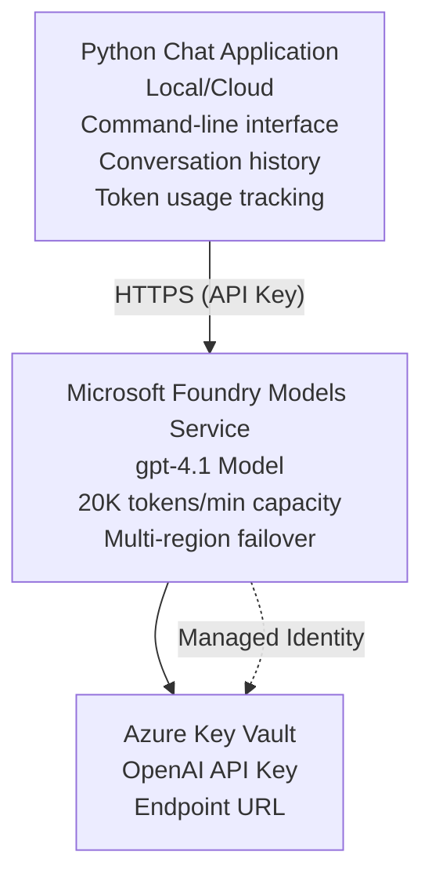

# Microsoft Foundry Models Chat Application

**Learning Path:** Intermediate ⭐⭐ | **Time:** 35-45 minutes | **Cost:** $50-200/month

A complete Microsoft Foundry Models chat application deployed using Azure Developer CLI (azd). This example demonstrates gpt-4.1 deployment, secure API access, and a simple chat interface.

## 🎯 What You'll Learn

- Deploy Microsoft Foundry Models Service with gpt-4.1 model
- Secure OpenAI API keys with Key Vault
- Build a simple chat interface with Python
- Monitor token usage and costs
- Implement rate limiting and error handling

## 📦 What's Included

✅ **Microsoft Foundry Models Service** - gpt-4.1 model deployment  
✅ **Python Chat App** - Simple command-line chat interface  
✅ **Key Vault Integration** - Secure API key storage  
✅ **ARM Templates** - Complete infrastructure as code  
✅ **Cost Monitoring** - Token usage tracking  
✅ **Rate Limiting** - Prevent quota exhaustion  

## Architecture


## Prerequisites

### Required

- **Azure Developer CLI (azd)** - [Install guide](https://learn.microsoft.com/azure/developer/azure-developer-cli/install-azd)
- **Azure subscription** with OpenAI access - [Request access](https://aka.ms/oai/access)
- **Python 3.9+** - [Install Python](https://www.python.org/downloads/)

### Verify Prerequisites

```bash
# Check azd version (need 1.5.0 or higher)
azd version

# Verify Azure login
azd auth login

# Check Python version
python --version  # or python3 --version

# Verify OpenAI access (check in Azure Portal)
az cognitiveservices account list-skus \
  --kind OpenAI \
  --location eastus
```

> **⚠️ Important:** Microsoft Foundry Models requires application approval. If you haven't applied, visit [aka.ms/oai/access](https://aka.ms/oai/access). Approval typically takes 1-2 business days.

## ⏱️ Deployment Timeline

| Phase | Duration | What Happens |
|-------|----------|--------------|
| Prerequisites check | 2-3 minutes | Verify OpenAI quota availability |
| Deploy infrastructure | 8-12 minutes | Create OpenAI, Key Vault, model deployment |
| Configure application | 2-3 minutes | Set up environment and dependencies |
| **Total** | **12-18 minutes** | Ready to chat with gpt-4.1 |

**Note:** First-time OpenAI deployment may take longer due to model provisioning.

## Quick Start

```bash
# Navigate to the example
cd examples/azure-openai-chat

# Initialize environment
azd env new myopenai

# Deploy everything (infrastructure + configuration)
azd up
# You'll be prompted to:
# 1. Select Azure subscription
# 2. Choose location with OpenAI availability (e.g., eastus, eastus2, westus)
# 3. Wait 12-18 minutes for deployment

# Install Python dependencies
pip install -r requirements.txt

# Start chatting!
python chat.py
```

**Expected Output:**
```
🤖 Microsoft Foundry Models Chat Application
Connected to: gpt-4.1 (eastus)
Type your message (or 'quit' to exit)

You: Hello! Tell me about Microsoft Foundry Models.
Assistant: Microsoft Foundry Models Service provides REST API access to OpenAI's powerful language models including gpt-4.1, GPT-3.5-Turbo, and Embeddings...

[Tokens used: 145 | Estimated cost: $0.0044]
```

## ✅ Verify Deployment

### Step 1: Check Azure Resources

```bash
# View deployed resources
azd show

# Expected output shows:
# - OpenAI Service: (resource name)
# - Key Vault: (resource name)
# - Deployment: gpt-4.1
# - Location: eastus (or your selected region)
```

### Step 2: Test OpenAI API

```bash
# 获取OpenAI端点和密钥
OPENAI_ENDPOINT=$(azd env get-value AZURE_OPENAI_ENDPOINT)
OPENAI_KEY=$(azd env get-value AZURE_OPENAI_API_KEY)

# 测试API调用
curl "$OPENAI_ENDPOINT/openai/deployments/gpt-4.1/chat/completions?api-version=2024-08-01-preview" \
  -H "Content-Type: application/json" \
  -H "api-key: $OPENAI_KEY" \
  -d '{
    "messages": [{"role": "user", "content": "Say hello!"}],
    "max_tokens": 50
  }'
```

**Expected Response:**
```json
{
  "choices": [
    {
      "message": {
        "role": "assistant",
        "content": "Hello! How can I assist you today?"
      }
    }
  ],
  "usage": {
    "prompt_tokens": 8,
    "completion_tokens": 9,
    "total_tokens": 17
  }
}
```

### Step 3: Verify Key Vault Access

```bash
# List secrets in Key Vault
KV_NAME=$(azd env get-value AZURE_KEY_VAULT_NAME)

az keyvault secret list \
  --vault-name $KV_NAME \
  --query "[].name" \
  --output table
```

**Expected Secrets:**
- `openai-api-key`
- `openai-endpoint`

**Success Criteria:**
- ✅ OpenAI service deployed with gpt-4.1
- ✅ API call returns valid completion
- ✅ Secrets stored in Key Vault
- ✅ Token usage tracking works

## Project Structure

```
azure-openai-chat/
├── README.md                   ✅ This guide
├── azure.yaml                  ✅ AZD configuration
├── infra/                      ✅ Infrastructure as Code
│   ├── main.bicep             ✅ Main Bicep template
│   ├── main.parameters.json   ✅ Parameters
│   └── openai.bicep           ✅ OpenAI resource definition
├── src/                        ✅ Application code
│   ├── chat.py                ✅ Chat interface
│   ├── config.py              ✅ Configuration loader
│   └── requirements.txt       ✅ Python dependencies
└── .gitignore                  ✅ Git ignore rules
```

## Application Features

### Chat Interface (`chat.py`)

The chat application includes:

- **Conversation History** - Maintains context across messages
- **Token Counting** - Tracks usage and estimates costs
- **Error Handling** - Graceful handling of rate limits and API errors
- **Cost Estimation** - Real-time cost calculation per message
- **Streaming Support** - Optional streaming responses

### Commands

While chatting, you can use:
- `quit` or `exit` - End the session
- `clear` - Clear conversation history
- `tokens` - Show total token usage
- `cost` - Show estimated total cost

### Configuration (`config.py`)

Loads configuration from environment variables:
```python
AZURE_OPENAI_ENDPOINT  # From Key Vault
AZURE_OPENAI_API_KEY   # From Key Vault
AZURE_OPENAI_MODEL     # Default: gpt-4.1
AZURE_OPENAI_MAX_TOKENS # Default: 800
```

## Usage Examples

### Basic Chat

```bash
python chat.py
```

### Chat with Custom Model

```bash
export AZURE_OPENAI_MODEL=gpt-35-turbo
python chat.py
```

### Chat with Streaming

```bash
python chat.py --stream
```

### Example Conversation

```
You: Explain Microsoft Foundry Models Service in 3 sentences.
Assistant: Microsoft Foundry Models Service is Microsoft Azure's cloud platform offering 
that provides access to OpenAI's powerful language models. It enables developers 
to integrate capabilities like gpt-4.1 into their applications with enterprise-grade 
security and compliance. The service includes features for content filtering, 
abuse monitoring, and responsible AI practices.

[Tokens used: 89 | Estimated cost: $0.0027]

You: What models are available?
Assistant: Microsoft Foundry Models Service offers several model families including gpt-4.1 
(most capable), GPT-3.5-Turbo (faster and cost-effective), and Embeddings models 
for vector search. Each model has different capabilities, pricing, and token limits.

[Tokens used: 67 | Estimated cost: $0.0020]

Total session: 156 tokens | $0.0047
```

## Cost Management

### Token Pricing (gpt-4.1)

| Model | Input (per 1K tokens) | Output (per 1K tokens) |
|-------|----------------------|------------------------|
| gpt-4.1 | $0.03 | $0.06 |
| GPT-3.5-Turbo | $0.0015 | $0.002 |

### Estimated Monthly Costs

Based on usage patterns:

| Usage Level | Messages/Day | Tokens/Day | Monthly Cost |
|-------------|--------------|------------|--------------|
| **Light** | 20 messages | 3,000 tokens | $3-5 |
| **Moderate** | 100 messages | 15,000 tokens | $15-25 |
| **Heavy** | 500 messages | 75,000 tokens | $75-125 |

**Base Infrastructure Cost:** $1-2/month (Key Vault + minimal compute)

### Cost Optimization Tips

```bash
# 1. Use GPT-3.5-Turbo for simpler tasks (20x cheaper)
export AZURE_OPENAI_MODEL=gpt-35-turbo

# 2. Reduce max tokens for shorter responses
export AZURE_OPENAI_MAX_TOKENS=400

# 3. Monitor token usage
python chat.py --show-tokens

# 4. Set up budget alerts
az consumption budget create \
  --budget-name "openai-budget" \
  --amount 50 \
  --time-grain Monthly
```

## Monitoring

### View Token Usage

```bash
# In Azure Portal:
# OpenAI Resource → Metrics → Select "Token Transaction"

# Or via Azure CLI:
az monitor metrics list \
  --resource $(azd env get-value AZURE_OPENAI_RESOURCE_ID) \
  --metric "TokenTransaction" \
  --start-time $(date -u -d '1 hour ago' '+%Y-%m-%dT%H:%M:%S') \
  --interval PT1M
```

### View API Logs

```bash
# Stream diagnostic logs
az monitor diagnostic-settings create \
  --resource $(azd env get-value AZURE_OPENAI_RESOURCE_ID) \
  --name openai-logs \
  --logs '[{"category": "Audit", "enabled": true}]' \
  --workspace $(azd env get-value LOG_ANALYTICS_WORKSPACE_ID)

# Query logs
az monitor log-analytics query \
  --workspace $(azd env get-value LOG_ANALYTICS_WORKSPACE_ID) \
  --analytics-query "AzureDiagnostics | where Category == 'Audit' | top 10 by TimeGenerated"
```

## Troubleshooting

### Issue: "Access Denied" Error

**Symptoms:** 403 Forbidden when calling API

**Solutions:**
```bash
# 1. Verify OpenAI access is approved
az cognitiveservices account show \
  --name $(azd env get-value AZURE_OPENAI_NAME) \
  --resource-group $(azd env get-value AZURE_RESOURCE_GROUP)

# 2. Check API key is correct
azd env get-value AZURE_OPENAI_API_KEY

# 3. Verify endpoint URL format
azd env get-value AZURE_OPENAI_ENDPOINT
# Should be: https://[name].openai.azure.com/
```

### Issue: "Rate Limit Exceeded"

**Symptoms:** 429 Too Many Requests

**Solutions:**
```bash
# 1. Check current quota
az cognitiveservices account deployment show \
  --name $(azd env get-value AZURE_OPENAI_NAME) \
  --resource-group $(azd env get-value AZURE_RESOURCE_GROUP) \
  --deployment-name gpt-4.1

# 2. Request quota increase (if needed)
# Go to Azure Portal → OpenAI Resource → Quotas → Request Increase

# 3. Implement retry logic (already in chat.py)
# The application automatically retries with exponential backoff
```

### Issue: "Model Not Found"

**Symptoms:** 404 error for deployment

**Solutions:**
```bash
# 1. List available deployments
az cognitiveservices account deployment list \
  --name $(azd env get-value AZURE_OPENAI_NAME) \
  --resource-group $(azd env get-value AZURE_RESOURCE_GROUP)

# 2. Verify model name in environment
echo $AZURE_OPENAI_MODEL

# 3. Update to correct deployment name
export AZURE_OPENAI_MODEL=gpt-4.1  # or gpt-35-turbo
```

### Issue: High Latency

**Symptoms:** Slow response times (>5 seconds)

**Solutions:**
```bash
# 1. Check regional latency
# Deploy to region closest to users

# 2. Reduce max_tokens for faster responses
export AZURE_OPENAI_MAX_TOKENS=400

# 3. Use streaming for better UX
python chat.py --stream
```

## Security Best Practices

### 1. Protect API Keys

```bash
# Never commit keys to source control
# Use Key Vault (already configured)

# Rotate keys regularly
az cognitiveservices account keys regenerate \
  --name $(azd env get-value AZURE_OPENAI_NAME) \
  --resource-group $(azd env get-value AZURE_RESOURCE_GROUP) \
  --key-name key1
```

### 2. Implement Content Filtering

```python
# Microsoft Foundry Models includes built-in content filtering
# Configure in Azure Portal:
# OpenAI Resource → Content Filters → Create Custom Filter

# Categories: Hate, Sexual, Violence, Self-harm
# Levels: Low, Medium, High filtering
```

### 3. Use Managed Identity (Production)

```bash
# For production deployments, use managed identity
# instead of API keys (requires app hosting on Azure)

# Update infra/openai.bicep to include:
# identity: { type: 'SystemAssigned' }
```

## Development

### Run Locally

```bash
# Install dependencies
pip install -r src/requirements.txt

# Set environment variables
export AZURE_OPENAI_ENDPOINT="https://[name].openai.azure.com/"
export AZURE_OPENAI_API_KEY="your-api-key"
export AZURE_OPENAI_MODEL="gpt-4.1"

# Run application
python src/chat.py
```

### Run Tests

```bash
# Install test dependencies
pip install pytest pytest-cov

# Run tests
pytest tests/ -v

# With coverage
pytest tests/ --cov=src --cov-report=html
```

### Update Model Deployment

```bash
# Deploy different model version
az cognitiveservices account deployment create \
  --name $(azd env get-value AZURE_OPENAI_NAME) \
  --resource-group $(azd env get-value AZURE_RESOURCE_GROUP) \
  --deployment-name gpt-35-turbo \
  --model-name gpt-35-turbo \
  --model-version "0613" \
  --model-format OpenAI \
  --sku-capacity 20 \
  --sku-name "Standard"
```

## Clean Up

```bash
# Delete all Azure resources
azd down --force --purge

# This removes:
# - OpenAI Service
# - Key Vault (with 90-day soft delete)
# - Resource Group
# - All deployments and configurations
```

## Next Steps

### Expand This Example

1. **Add Web Interface** - Build React/Vue frontend
   ```bash
   # Add frontend service to azure.yaml
   # Deploy to Azure Static Web Apps
   ```

2. **Implement RAG** - Add document search with Azure AI Search
   ```python
   # Integrate Azure Cognitive Search
   # Upload documents and create vector index
   ```

3. **Add Function Calling** - Enable tool use
   ```python
   # Define functions in chat.py
   # Let gpt-4.1 call external APIs
   ```

4. **Multi-Model Support** - Deploy multiple models
   ```bash
   # Add gpt-35-turbo, embeddings models
   # Implement model routing logic
   ```

### Related Examples

- **[Retail Multi-Agent](../retail-scenario.md)** - Advanced multi-agent architecture
- **[Database App](../../../../examples/database-app)** - Add persistent storage
- **[Container Apps](../../../../examples/container-app)** - Deploy as containerized service

### Learning Resources

- 📚 [AZD For Beginners Course](../../README.md) - Main course home
- 📚 [Microsoft Foundry Models Documentation](https://learn.microsoft.com/azure/ai-services/openai/) - Official docs
- 📚 [OpenAI API Reference](https://platform.openai.com/docs/api-reference) - API details
- 📚 [Responsible AI](https://www.microsoft.com/ai/responsible-ai) - Best practices

## Additional Resources

### Documentation
- **[Microsoft Foundry Models Service](https://learn.microsoft.com/azure/ai-services/openai/)** - Complete guide
- **[gpt-4.1 Models](https://learn.microsoft.com/azure/ai-services/openai/concepts/models)** - Model capabilities
- **[Content Filtering](https://learn.microsoft.com/azure/ai-services/openai/concepts/content-filter)** - Safety features
- **[Azure Developer CLI](https://learn.microsoft.com/azure/developer/azure-developer-cli/)** - azd reference

### Tutorials
- **[OpenAI Quickstart](https://learn.microsoft.com/azure/ai-services/openai/quickstart)** - First deployment
- **[Chat Completions](https://learn.microsoft.com/azure/ai-services/openai/how-to/chatgpt)** - Building chat apps
- **[Function Calling](https://learn.microsoft.com/azure/ai-services/openai/how-to/function-calling)** - Advanced features

### Tools
- **[Microsoft Foundry Models Studio](https://oai.azure.com/)** - Web-based playground
- **[Prompt Engineering Guide](https://platform.openai.com/docs/guides/prompt-engineering)** - Writing better prompts
- **[Token Calculator](https://platform.openai.com/tokenizer)** - Estimate token usage

### Community
- **[Azure AI Discord](https://discord.gg/azure)** - Get help from community
- **[GitHub Discussions](https://github.com/Azure-Samples/openai/discussions)** - Q&A forum
- **[Azure Blog](https://azure.microsoft.com/blog/tag/azure-openai-service/)** - Latest updates

---

**🎉 Success!** You've deployed Microsoft Foundry Models and built a working chat application. Start exploring gpt-4.1's capabilities and experiment with different prompts and use cases.

**Questions?** [Open an issue](https://github.com/microsoft/AZD-for-beginners/issues) or check the [FAQ](../../resources/faq.md)

**Cost Alert:** Remember to run `azd down` when done testing to avoid ongoing charges (~$50-100/month for active usage).

---

<!-- CO-OP TRANSLATOR DISCLAIMER START -->
**Disclaimer**:
This document has been translated using the AI translation service [Co-op Translator](https://github.com/Azure/co-op-translator). While we strive for accuracy, please be aware that automated translations may contain errors or inaccuracies. The original document in its native language should be considered the authoritative source. For critical information, professional human translation is recommended. We are not liable for any misunderstandings or misinterpretations arising from the use of this translation.
<!-- CO-OP TRANSLATOR DISCLAIMER END -->