# Microservices Architecture - Container App Example

⏱️ **Estimated Time**: 25-35 minutes | 💰 **Estimated Cost**: ~$50-100/month | ⭐ **Complexity**: Advanced

**📚 Learning Path:**
- ← Previous: [Simple Flask API](../../../../examples/container-app/simple-flask-api) - Single container basics
- 🎯 **You Are Here**: Microservices Architecture (2-service foundation)
- → Next: [AI Integration](../../../../docs/ai-foundry) - Add intelligence to your services
- 🏠 [Course Home](../../README.md)

---

A **simplified but functional** microservices architecture deployed to Azure Container Apps using AZD CLI. This example demonstrates service-to-service communication, container orchestration, and monitoring with a practical 2-service setup.

> **📚 Learning Approach**: This example starts with a minimal 2-service architecture (API Gateway + Backend Service) that you can actually deploy and learn from. After mastering this foundation, we provide guidance for expanding to a full microservices ecosystem.

## What You'll Learn

By completing this example, you will:
- Deploy multiple containers to Azure Container Apps
- Implement service-to-service communication with internal networking
- Configure environment-based scaling and health checks
- Monitor distributed applications with Application Insights
- Understand microservices deployment patterns and best practices
- Learn progressive expansion from simple to complex architectures

## Architecture

### Phase 1: What We're Building (Included in This Example)


**Component Details:**

| Component | Purpose | Access | Resources |
|-----------|---------|--------|-----------|
| **API Gateway** | Routes external requests to backend services | Public (HTTPS) | 1 vCPU, 2GB RAM, 2-20 replicas |
| **Product Service** | Manages product catalog with in-memory data | Internal only | 0.5 vCPU, 1GB RAM, 1-10 replicas |
| **Application Insights** | Centralized logging and distributed tracing | Azure Portal | 1-2 GB/month data ingestion |

**Why Start Simple?**
- ✅ Deploy and understand quickly (25-35 minutes)
- ✅ Learn core microservices patterns without complexity
- ✅ Working code you can modify and experiment with
- ✅ Lower cost for learning (~$50-100/month vs $300-1400/month)
- ✅ Build confidence before adding databases and message queues

**Analogy**: Think of this like learning to drive. You start with an empty parking lot (2 services), master the basics, then progress to city traffic (5+ services with databases).

### Phase 2: Future Expansion (Reference Architecture)

Once you master the 2-service architecture, you can expand to:

```mermaid
graph TB
    User[User]
    Gateway[API Gateway<br/>✅ Included]
    Product[Product Service<br/>✅ Included]
    Order[Order Service<br/>🔜 Add Next]
    UserSvc[User Service<br/>🔜 Add Next]
    Notify[Notification Service<br/>🔜 Add Last]
    
    CosmosDB[(Cosmos DB<br/>🔜 Product Data)]
    AzureSQL[(Azure SQL<br/>🔜 Order Data)]
    ServiceBus[Azure Service Bus<br/>🔜 Async Events]
    AppInsights[Application Insights<br/>✅ Included]
    
    User --> Gateway
    Gateway --> Product
    Gateway --> Order
    Gateway --> UserSvc
    
    Product --> CosmosDB
    Order --> AzureSQL
    UserSvc --> AzureSQL
    
    Product -.->|ProductCreated Event| ServiceBus
    ServiceBus -.->|Subscribe| Notify
    ServiceBus -.->|Subscribe| Order
    
    Gateway -.-> AppInsights
    Product -.-> AppInsights
    Order -.-> AppInsights
    UserSvc -.-> AppInsights
    Notify -.-> AppInsights
    
    style Product fill:#4CAF50,stroke:#388E3C,stroke-width:3px,color:#fff
    style Gateway fill:#2196F3,stroke:#1976D2,stroke-width:3px,color:#fff
    style Order fill:#9E9E9E,stroke:#616161,stroke-width:2px,color:#fff
    style UserSvc fill:#9E9E9E,stroke:#616161,stroke-width:2px,color:#fff
    style Notify fill:#9E9E9E,stroke:#616161,stroke-width:2px,color:#fff
```


See "Expansion Guide" section at the end for step-by-step instructions.

## Features Included

✅ **Service Discovery**: Automatic DNS-based discovery between containers  
✅ **Load Balancing**: Built-in load balancing across replicas  
✅ **Auto-scaling**: Independent scaling per service based on HTTP requests  
✅ **Health Monitoring**: Liveness and readiness probes for both services  
✅ **Distributed Logging**: Centralized logging with Application Insights  
✅ **Internal Networking**: Secure service-to-service communication  
✅ **Container Orchestration**: Automatic deployment and scaling  
✅ **Zero-Downtime Updates**: Rolling updates with revision management  

## Prerequisites

### Required Tools

Before starting, verify you have these tools installed:

1. **[Azure Developer CLI (azd)](https://learn.microsoft.com/azure/developer/azure-developer-cli/install-azd)** (version 1.0.0 or higher)
   ```bash
   azd version
   # Expected output: azd version 1.0.0 or higher
   ```

2. **[Azure CLI](https://learn.microsoft.com/cli/azure/install-azure-cli)** (version 2.50.0 or higher)
   ```bash
   az --version
   # Expected output: azure-cli 2.50.0 or higher
   ```

3. **[Docker](https://www.docker.com/get-started)** (for local development/testing - optional)
   ```bash
   docker --version
   # Expected output: Docker version 20.10 or higher
   ```

### Verify Your Setup

Run these commands to confirm you're ready:

```bash
# Check Azure Developer CLI
azd version
# ✅ Expected: azd version 1.0.0 or higher

# Check Azure CLI
az --version
# ✅ Expected: azure-cli 2.50.0 or higher

# Check Docker (optional)
docker --version
# ✅ Expected: Docker version 20.10 or higher
```

**Success Criteria**: All commands return version numbers matching or exceeding minimums.

### Azure Requirements

- An active **Azure subscription** ([create a free account](https://azure.microsoft.com/free/))
- Permissions to create resources in your subscription
- **Contributor** role on the subscription or resource group

### Knowledge Prerequisites

This is an **advanced-level** example. You should have:
- Completed the [Simple Flask API example](../../../../examples/container-app/simple-flask-api) 
- Basic understanding of microservices architecture
- Familiarity with REST APIs and HTTP
- Understanding of container concepts

**New to Container Apps?** Start with the [Simple Flask API example](../../../../examples/container-app/simple-flask-api) first to learn the basics.

## Quick Start (Step-by-Step)

### Step 1: Clone and Navigate

```bash
git clone https://github.com/microsoft/AZD-for-beginners.git
cd AZD-for-beginners/examples/microservices
```

**✓ Success Check**: Verify you see `azure.yaml`:
```bash
ls
# Expected: README.md, azure.yaml, infra/, src/
```

### Step 2: Authenticate with Azure

```bash
azd auth login
```

This opens your browser for Azure authentication. Sign in with your Azure credentials.

**✓ Success Check**: You should see:
```
Logged in to Azure.
```

### Step 3: Initialize the Environment

```bash
azd init
```

**Prompts you'll see**:
- **Environment name**: Enter a short name (e.g., `microservices-dev`)
- **Azure subscription**: Select your subscription
- **Azure location**: Choose a region (e.g., `eastus`, `westeurope`)

**✓ Success Check**: You should see:
```
SUCCESS: New project initialized!
```

### Step 4: Deploy Infrastructure and Services

```bash
azd up
```

**What happens** (takes 8-12 minutes):


**✓ Success Check**: You should see:
```
SUCCESS: Your application was deployed to Azure in X minutes Y seconds.
Endpoint: https://api-gateway-<unique-id>.azurecontainerapps.io
```

**⏱️ Time**: 8-12 minutes

### Step 5: Test the Deployment

```bash
# Get the gateway endpoint
GATEWAY_URL=$(azd env get-values | grep API_GATEWAY_URL | cut -d '=' -f2 | tr -d '"')

# Test API Gateway health
curl $GATEWAY_URL/health
```

**✅ Expected output:**
```json
{
  "status": "healthy",
  "service": "api-gateway",
  "timestamp": "2025-11-19T10:30:00Z"
}
```

**Test product service through gateway**:
```bash
# List products
curl $GATEWAY_URL/api/products
```

**✅ Expected output:**
```json
[
  {"id":1,"name":"Laptop","price":999.99,"stock":50},
  {"id":2,"name":"Mouse","price":29.99,"stock":200},
  {"id":3,"name":"Keyboard","price":79.99,"stock":150}
]
```

**✓ Success Check**: Both endpoints return JSON data without errors.

---

**🎉 Congratulations!** You've deployed a microservices architecture to Azure!

## Project Structure

All implementation files are included—this is a complete, working example:

```
microservices/
│
├── README.md                         # This file
├── azure.yaml                        # AZD configuration
├── .gitignore                        # Git ignore patterns
│
├── infra/                           # Infrastructure as Code (Bicep)
│   ├── main.bicep                   # Main orchestration
│   ├── abbreviations.json           # Naming conventions
│   ├── core/                        # Shared infrastructure
│   │   ├── container-apps-environment.bicep  # Container environment + registry
│   │   └── monitor.bicep            # Application Insights + Log Analytics
│   └── app/                         # Service definitions
│       ├── api-gateway.bicep        # API Gateway container app
│       └── product-service.bicep    # Product Service container app
│
└── src/                             # Application source code
    ├── api-gateway/                 # Node.js API Gateway
    │   ├── app.js                   # Express server with routing
    │   ├── package.json             # Node dependencies
    │   └── Dockerfile               # Container definition
    └── product-service/             # Python Product Service
        ├── main.py                  # Flask API with product data
        ├── requirements.txt         # Python dependencies
        └── Dockerfile               # Container definition
```

**What Each Component Does:**

**Infrastructure (infra/)**:
- `main.bicep`: Orchestrates all Azure resources and their dependencies
- `core/container-apps-environment.bicep`: Creates the Container Apps environment and Azure Container Registry
- `core/monitor.bicep`: Sets up Application Insights for distributed logging
- `app/*.bicep`: Individual container app definitions with scaling and health checks

**API Gateway (src/api-gateway/)**:
- Public-facing service that routes requests to backend services
- Implements logging, error handling, and request forwarding
- Demonstrates service-to-service HTTP communication

**Product Service (src/product-service/)**:
- Internal service with product catalog (in-memory for simplicity)
- REST API with health checks
- Example of backend microservice pattern

## Services Overview

### API Gateway (Node.js/Express)

**Port**: 8080  
**Access**: Public (external ingress)  
**Purpose**: Routes incoming requests to appropriate backend services  

**Endpoints**:
- `GET /` - Service information
- `GET /health` - Health check endpoint
- `GET /api/products` - Forward to product service (list all)
- `GET /api/products/:id` - Forward to product service (get by ID)

**Key Features**:
- Request routing with axios
- Centralized logging
- Error handling and timeout management
- Service discovery via environment variables
- Application Insights integration

**Code Highlight** (`src/api-gateway/app.js`):
```javascript
// Internal service communication
app.get('/api/products', async (req, res) => {
  const response = await axios.get(`${PRODUCT_SERVICE_URL}/products`, {
    timeout: 5000
  });
  res.json(response.data);
});
```

### Product Service (Python/Flask)

**Port**: 8000  
**Access**: Internal only (no external ingress)  
**Purpose**: Manages product catalog with in-memory data  

**Endpoints**:
- `GET /` - Service information
- `GET /health` - Health check endpoint
- `GET /products` - List all products
- `GET /products/<id>` - Get product by ID

**Key Features**:
- RESTful API with Flask
- In-memory product store (simple, no database needed)
- Health monitoring with probes
- Structured logging
- Application Insights integration

**Data Model**:
```python
{
  "id": 1,
  "name": "Laptop",
  "description": "High-performance laptop",
  "price": 999.99,
  "stock": 50
}
```

**Why Internal Only?**
The product service is not exposed publicly. All requests must go through the API Gateway, which provides:
- Security: Controlled access point
- Flexibility: Can change backend without affecting clients
- Monitoring: Centralized request logging

## Understanding Service Communication

### How Services Talk to Each Other


In this example, the API Gateway communicates with the Product Service using **internal HTTP calls**:

```javascript
// API Gateway (src/api-gateway/app.js)
const PRODUCT_SERVICE_URL = process.env.PRODUCT_SERVICE_URL;

// Make internal HTTP request
const response = await axios.get(`${PRODUCT_SERVICE_URL}/products`);
```

**Key Points**:

1. **DNS-Based Discovery**: Container Apps automatically provides DNS for internal services
   - Product Service FQDN: `product-service.internal.<environment>.azurecontainerapps.io`
   - Simplified as: `http://product-service` (Container Apps resolves it)

2. **No Public Exposure**: Product Service has `external: false` in Bicep
   - Only accessible within the Container Apps environment
   - Cannot be reached from the internet

3. **Environment Variables**: Service URLs are injected at deployment time
   - Bicep passes the internal FQDN to the gateway
   - No hardcoded URLs in application code

**Analogy**: Think of this like office rooms. The API Gateway is the reception desk (public-facing), and the Product Service is an office room (internal only). Visitors must go through reception to reach any office.

## Deployment Options

### Full Deployment (Recommended)

```bash
# Deploy infrastructure and both services
azd up
```

This deploys:
1. Container Apps environment
2. Application Insights
3. Container Registry
4. API Gateway container
5. Product Service container

**Time**: 8-12 minutes

### Deploy Individual Service

```bash
# Deploy only one service (after initial azd up)
azd deploy api-gateway

# Or deploy product service
azd deploy product-service
```

**Use Case**: When you've updated code in one service and want to redeploy only that service.

### Update Configuration

```bash
# Change scaling parameters
azd env set GATEWAY_MAX_REPLICAS 30

# Redeploy with new configuration
azd up
```

## Configuration

### Scaling Configuration

Both services are configured with HTTP-based autoscaling in their Bicep files:

**API Gateway**:
- Min replicas: 2 (always at least 2 for availability)
- Max replicas: 20
- Scale trigger: 50 concurrent requests per replica

**Product Service**:
- Min replicas: 1 (can scale to zero if needed)
- Max replicas: 10
- Scale trigger: 100 concurrent requests per replica

**Customize Scaling** (in `infra/app/*.bicep`):
```bicep
scale: {
  minReplicas: 1
  maxReplicas: 10
  rules: [
    {
      name: 'http-scale-rule'
      http: {
        metadata: {
          concurrentRequests: '100'  // Adjust this
        }
      }
    }
  ]
}
```

### Resource Allocation

**API Gateway**:
- CPU: 1.0 vCPU
- Memory: 2 GiB
- Reason: Handles all external traffic

**Product Service**:
- CPU: 0.5 vCPU
- Memory: 1 GiB
- Reason: Lightweight in-memory operations

### Health Checks

Both services include liveness and readiness probes:

```bicep
probes: [
  {
    type: 'Liveness'
    httpGet: {
      path: '/health'
      port: 8080
    }
    initialDelaySeconds: 10
    periodSeconds: 30
  }
  {
    type: 'Readiness'
    httpGet: {
      path: '/health'
      port: 8080
    }
    initialDelaySeconds: 5
    periodSeconds: 10
  }
]
```

**What This Means**:
- **Liveness**: If health check fails, Container Apps restarts the container
- **Readiness**: If not ready, Container Apps stops routing traffic to that replica

## Monitoring & Observability

### View Service Logs

```bash
# View logs using azd monitor
azd monitor --logs

# Or use Azure CLI for specific Container Apps:
# Stream logs from API Gateway
az containerapp logs show --name api-gateway --resource-group $RG_NAME --follow

# View recent product service logs
az containerapp logs show --name product-service --resource-group $RG_NAME --tail 100
```

**Expected Output**:
```
[api-gateway] API Gateway listening on port 8080
[api-gateway] Product Service URL: http://product-service
[api-gateway] GET /api/products 200 - 45ms
[product-service] Retrieved 5 products
```

### Application Insights Queries

Access Application Insights in Azure Portal, then run these queries:

**Find Slow Requests**:
```kusto
requests
| where timestamp > ago(1h)
| where duration > 1000  // Requests taking >1 second
| summarize count() by name, cloud_RoleName
| order by count_ desc
```

**Track Service-to-Service Calls**:
```kusto
dependencies
| where timestamp > ago(1h)
| where type == "Http"
| project timestamp, name, target, duration, success
| order by timestamp desc
```

**Error Rate by Service**:
```kusto
exceptions
| where timestamp > ago(24h)
| summarize errorCount = count() by cloud_RoleName, type
| order by errorCount desc
```

**Request Volume Over Time**:
```kusto
requests
| where timestamp > ago(1h)
| summarize requestCount = count() by bin(timestamp, 5m), cloud_RoleName
| render timechart
```

### Access Monitoring Dashboard

```bash
# Get Application Insights details
azd env get-values | grep APPLICATIONINSIGHTS

# Open Azure Portal monitoring
az monitor app-insights component show \
  --app $(azd env get-values | grep APPLICATIONINSIGHTS_CONNECTION_STRING | cut -d '=' -f2) \
  --resource-group $(azd env get-values | grep AZURE_RESOURCE_GROUP | cut -d '=' -f2) \
  --query "appId" -o tsv
```

### Live Metrics

1. Navigate to Application Insights in Azure Portal
2. Click "Live Metrics"
3. See real-time requests, failures, and performance
4. Test by running: `curl $(azd env get-values | grep API_GATEWAY_URL | cut -d '=' -f2 | tr -d '"')/api/products`

## Practical Exercises

### Exercise 1: Add a New Product Endpoint ⭐ (Easy)

**Goal**: Add a POST endpoint to create new products

**Starting Point**: `src/product-service/main.py`

**Steps**:

1. Add this endpoint after the `get_product` function in `main.py`:

```python
@app.route('/products', methods=['POST'])
def create_product():
    """Create a new product"""
    data = request.get_json()
    
    # Validate required fields
    if not data or 'name' not in data or 'price' not in data:
        return jsonify({'error': 'Missing required fields: name, price'}), 400
    
    new_id = max(p['id'] for p in products) + 1
    new_product = {
        'id': new_id,
        'name': data['name'],
        'description': data.get('description', ''),
        'price': float(data['price']),
        'stock': int(data.get('stock', 0))
    }
    products.append(new_product)
    logger.info(f"Created product {new_id}")
    return jsonify(new_product), 201
```

2. Add POST route to API Gateway (`src/api-gateway/app.js`):

```javascript
// Add this after the GET /api/products route
app.post('/api/products', async (req, res) => {
  try {
    console.log(`Forwarding POST request to ${PRODUCT_SERVICE_URL}/products`);
    const response = await axios.post(`${PRODUCT_SERVICE_URL}/products`, req.body, {
      timeout: 5000
    });
    res.status(201).json(response.data);
  } catch (error) {
    console.error('Error calling product service:', error.message);
    res.status(503).json({
      error: 'Product service unavailable',
      message: error.message
    });
  }
});
```

3. Redeploy both services:

```bash
azd deploy product-service
azd deploy api-gateway
```

4. Test the new endpoint:

```bash
GATEWAY_URL=$(azd env get-values | grep API_GATEWAY_URL | cut -d '=' -f2 | tr -d '"')

# Create a new product
curl -X POST $GATEWAY_URL/api/products \
  -H "Content-Type: application/json" \
  -d '{"name":"USB Cable","price":9.99,"stock":500}'
```

**✅ Expected output:**
```json
{"id":6,"name":"USB Cable","description":"","price":9.99,"stock":500}
```

5. Verify it appears in the list:

```bash
curl $GATEWAY_URL/api/products
# Should now show 6 products including the new USB Cable
```

**Success Criteria**:
- ✅ POST request returns HTTP 201
- ✅ New product appears in GET /api/products list
- ✅ Product has auto-incremented ID

**Time**: 10-15 minutes

---

### Exercise 2: Modify Autoscaling Rules ⭐⭐ (Medium)

**Goal**: Change Product Service to scale more aggressively

**Starting Point**: `infra/app/product-service.bicep`

**Steps**:

1. Open `infra/app/product-service.bicep` and find the `scale` block (around line 95)

2. Change from:
```bicep
scale: {
  minReplicas: 1
  maxReplicas: 10
  rules: [
    {
      name: 'http-scale-rule'
      http: {
        metadata: {
          concurrentRequests: '100'  // OLD
        }
      }
    }
  ]
}
```

To:
```bicep
scale: {
  minReplicas: 2  // Always have 2 running
  maxReplicas: 20  // Allow more scaling
  rules: [
    {
      name: 'http-scale-rule'
      http: {
        metadata: {
          concurrentRequests: '20'  // Scale at lower threshold
        }
      }
    }
  ]
}
```

3. Redeploy infrastructure:

```bash
azd up
```

4. Verify new scaling configuration:

```bash
az containerapp show \
  --name $(azd env get-values | grep PRODUCT_SERVICE | head -1 | cut -d '/' -f5) \
  --resource-group $(azd env get-values | grep AZURE_RESOURCE_GROUP | cut -d '=' -f2 | tr -d '"') \
  --query "properties.template.scale" -o json
```

**✅ Expected output:**
```json
{
  "minReplicas": 2,
  "maxReplicas": 20,
  "rules": [...]
}
```

5. Test autoscaling with load:

```bash
# Generate concurrent requests
for i in {1..500}; do curl $GATEWAY_URL/api/products & done

# Watch scaling happen using Azure CLI
az containerapp logs show --name product-service --resource-group $RG_NAME --follow
# Look for: Container Apps scaling events
```

**Success Criteria**:
- ✅ Product Service always runs at least 2 replicas
- ✅ Under load, scales to more than 2 replicas
- ✅ Azure Portal shows new scaling rules

**Time**: 15-20 minutes

---

### Exercise 3: Add Custom Monitoring Query ⭐⭐ (Medium)

**Goal**: Create a custom Application Insights query to track product API performance

**Steps**:

1. Navigate to Application Insights in Azure Portal:
   - Go to Azure Portal
   - Find your resource group (rg-microservices-*)
   - Click on Application Insights resource

2. Click "Logs" in the left menu

3. Create this query:

```kusto
requests
| where timestamp > ago(1h)
| where name contains "products"
| summarize 
    RequestCount = count(),
    AvgDuration = avg(duration),
    P95Duration = percentile(duration, 95),
    SuccessRate = 100.0 * countif(success == true) / count()
  by bin(timestamp, 5m)
| render timechart
```

4. Click "Run" to execute the query

5. Save the query:
   - Click "Save"
   - Name: "Product API Performance"
   - Category: "Performance"

6. Generate test traffic:

```bash
for i in {1..100}; do curl $GATEWAY_URL/api/products; sleep 1; done
```

7. Refresh the query to see data

**✅ Expected output:**
- Chart showing request counts over time
- Average duration < 500ms
- Success rate = 100%
- Time bins of 5 minutes

**Success Criteria**:
- ✅ Query shows 100+ requests
- ✅ Success rate is 100%
- ✅ Average duration < 500ms
- ✅ Chart displays 5-minute time bins

**Learning Outcome**: Understand how to monitor service performance with custom queries

**Time**: 10-15 minutes

---

### Exercise 4: Implement Retry Logic ⭐⭐⭐ (Advanced)

**Goal**: Add retry logic to API Gateway when Product Service is temporarily unavailable

**Starting Point**: `src/api-gateway/app.js`

**Steps**:

1. Install retry library:

```bash
cd src/api-gateway
npm install axios-retry --save
cd ../..
```

2. Update `src/api-gateway/app.js` (add after axios import):

```javascript
const axiosRetry = require('axios-retry');

// Configure retry logic
axiosRetry(axios, {
  retries: 3,
  retryDelay: (retryCount) => {
    return retryCount * 1000; // 1s, 2s, 3s
  },
  retryCondition: (error) => {
    // Retry on network errors or 5xx responses
    return axiosRetry.isNetworkOrIdempotentRequestError(error) ||
           (error.response && error.response.status >= 500);
  }
});

console.log('Retry logic configured: 3 retries with exponential backoff');
```

3. Redeploy API Gateway:

```bash
azd deploy api-gateway
```

4. Test retry behavior by simulating service failure:

```bash
# Scale product service to 0 (simulate failure)
az containerapp update \
  --name $(azd env get-values | grep PRODUCT_SERVICE | head -1 | cut -d '/' -f5) \
  --resource-group $(azd env get-values | grep AZURE_RESOURCE_GROUP | cut -d '=' -f2 | tr -d '"') \
  --min-replicas 0 \
  --max-replicas 0

# Try to access products (will retry 3 times)
time curl -v $GATEWAY_URL/api/products
# Observe: Response takes ~6 seconds (1s + 2s + 3s retries)

# Restore product service
az containerapp update \
  --name $(azd env get-values | grep PRODUCT_SERVICE | head -1 | cut -d '/' -f5) \
  --resource-group $(azd env get-values | grep AZURE_RESOURCE_GROUP | cut -d '=' -f2 | tr -d '"') \
  --min-replicas 1 \
  --max-replicas 10
```

5. View retry logs:

```bash
az containerapp logs show --name api-gateway --resource-group $RG_NAME --tail 50
# Look for: Retry attempt messages
```

**✅ Expected behavior:**
- Requests retry 3 times before failing
- Each retry waits longer (1s, 2s, 3s)
- Successful requests after service restarts
- Logs show retry attempts

**Success Criteria**:
- ✅ Requests retry 3 times before failing
- ✅ Each retry waits longer (exponential backoff)
- ✅ Successful requests after service restarts
- ✅ Logs show retry attempts

**Learning Outcome**: Understand resilience patterns in microservices (circuit breakers, retries, timeouts)

**Time**: 20-25 minutes

---

## Knowledge Checkpoint

After completing this example, verify your understanding:

### 1. Service Communication ✓

Test your knowledge:
- [ ] Can you explain how API Gateway discovers the Product Service? (DNS-based service discovery)
- [ ] What happens if Product Service is down? (Gateway returns 503 error)
- [ ] How would you add a third service? (Create new Bicep file, add to main.bicep, create src folder)

**Hands-On Verification:**
```bash
# Simulate service failure
az containerapp update --name <product-service-name> --min-replicas 0 --max-replicas 0
curl $GATEWAY_URL/api/products
# ✅ Expected: 503 Service Unavailable

# Restore service
az containerapp update --name <product-service-name> --min-replicas 1 --max-replicas 10
```

### 2. Monitoring & Observability ✓

Test your knowledge:
- [ ] Where do you see distributed logs? (Application Insights in Azure Portal)
- [ ] How do you track slow requests? (Kusto query: `requests | where duration > 1000`)
- [ ] Can you identify which service caused an error? (Check `cloud_RoleName` field in logs)

**Hands-On Verification:**
```bash
# Generate a slow request simulation
curl "$GATEWAY_URL/api/products?delay=2000"

# Query Application Insights for slow requests
# Navigate to Azure Portal → Application Insights → Logs
# Run: requests | where duration > 1000 | project timestamp, name, duration, cloud_RoleName
```

### 3. Scaling & Performance ✓

Test your knowledge:
- [ ] What triggers autoscaling? (HTTP concurrent request rules: 50 for gateway, 100 for product)
- [ ] How many replicas are running now? (Check with `az containerapp revision list`)
- [ ] How would you scale Product Service to 5 replicas? (Update minReplicas in Bicep)

**Hands-On Verification:**
```bash
# Generate load to test autoscaling
for i in {1..1000}; do curl $GATEWAY_URL/api/products & done

# Watch replicas increase using Azure CLI
az containerapp logs show --name api-gateway --resource-group $RG_NAME --follow
# ✅ Expected: See scaling events in logs
```

**Success Criteria**: You can answer all questions and verify with hands-on commands.

---

## Cost Analysis

### Estimated Monthly Costs (For This 2-Service Example)

| Resource | Configuration | Estimated Cost |
|----------|--------------|----------------|
| API Gateway | 2-20 replicas, 1 vCPU, 2GB RAM | $30-150 |
| Product Service | 1-10 replicas, 0.5 vCPU, 1GB RAM | $15-75 |
| Container Registry | Basic tier | $5 |
| Application Insights | 1-2 GB/month | $5-10 |
| Log Analytics | 1 GB/month | $3 |
| **Total** | | **$58-243/month** |

### Cost Breakdown by Usage

**Light traffic** (testing/learning): ~$60/month
- API Gateway: 2 replicas × 24/7 = $30
- Product Service: 1 replica × 24/7 = $15
- Monitoring + Registry = $13

**Moderate traffic** (small production): ~$120/month
- API Gateway: 5 avg replicas = $75
- Product Service: 3 avg replicas = $45
- Monitoring + Registry = $13

**High traffic** (busy periods): ~$240/month
- API Gateway: 15 avg replicas = $225
- Product Service: 8 avg replicas = $120
- Monitoring + Registry = $13

### Cost Optimization Tips

1. **Scale to Zero for Development**:
   ```bicep
   scale: {
     minReplicas: 0  // Save $30-40/month when not in use
     maxReplicas: 10
   }
   ```

2. **Use Consumption Plan for Cosmos DB** (when you add it):
   - Pay only for what you use
   - No minimum charge

3. **Set Application Insights Sampling**:
   ```javascript
   appInsights.defaultClient.config.samplingPercentage = 50; // Sample 50% of requests
   ```

4. **Clean Up When Not Needed**:
   ```bash
   azd down --force --purge
   ```

### Free Tier Options

For learning/testing, consider:
- ✅ Use Azure free credits ($200 for first 30 days with new accounts)
- ✅ Keep to minimum replicas (saves ~50% costs)
- ✅ Delete after testing (no ongoing charges)
- ✅ Scale to zero between learning sessions

**Example**: Running this example for 2 hours/day × 30 days = ~$5/month instead of $60/month

---

## Troubleshooting Quick Reference

### Problem: `azd up` fails with "Subscription not found"

**Solution**:
```bash
# Login again with explicit subscription
az account set --subscription <your-subscription-id>
azd env set AZURE_SUBSCRIPTION_ID <your-subscription-id>
azd up
```

### Problem: API Gateway returns 503 "Product service unavailable"

**Diagnose**:
```bash
# Check product service logs using Azure CLI
az containerapp logs show --name product-service --resource-group $RG_NAME --tail 50

# Check product service health
az containerapp show \
  --name $(azd env get-values | grep PRODUCT_SERVICE | head -1 | cut -d '/' -f5) \
  --resource-group $(azd env get-values | grep AZURE_RESOURCE_GROUP | cut -d '=' -f2 | tr -d '"') \
  --query "properties.runningStatus"
```

**Common Causes**:
1. Product service didn't start (check logs for Python errors)
2. Health check failing (verify `/health` endpoint works)
3. Container image build failed (check registry for image)

### Problem: Autoscaling not working

**Diagnose**:
```bash
# Check current replica count
az containerapp revision list \
  --name $(azd env get-values | grep API_GATEWAY | head -1 | cut -d '/' -f5) \
  --resource-group $(azd env get-values | grep AZURE_RESOURCE_GROUP | cut -d '=' -f2 | tr -d '"') \
  --query "[].properties.replicas"

# Generate load to test
for i in {1..1000}; do curl $GATEWAY_URL/api/products & done

# Watch scaling events using Azure CLI
az containerapp logs show --name api-gateway --resource-group $RG_NAME --follow | grep -i scale
```

**Common Causes**:
1. Load not high enough to trigger scale rule (need >50 concurrent requests)
2. Max replicas already reached (check Bicep configuration)
3. Scale rule misconfigured in Bicep (verify concurrentRequests value)

### Problem: Application Insights not showing logs

**Diagnose**:
```bash
# Verify connection string is set
azd env get-values | grep APPLICATIONINSIGHTS

# Check if services are sending telemetry
az monitor app-insights component show \
  --app $(azd env get-values | grep APPLICATIONINSIGHTS_NAME | cut -d '=' -f2 | tr -d '"') \
  --resource-group $(azd env get-values | grep AZURE_RESOURCE_GROUP | cut -d '=' -f2 | tr -d '"') \
  --query "properties.InstrumentationKey"
```

**Common Causes**:
1. Connection string not passed to container (check environment variables)
2. Application Insights SDK not configured (verify imports in code)
3. Firewall blocking telemetry (rare, check network rules)

### Problem: Docker build fails locally

**Diagnose**:
```bash
# Test API Gateway build
cd src/api-gateway
docker build -t test-gateway .

# Test Product Service build
cd ../product-service
docker build -t test-product .
```

**Common Causes**:
1. Missing dependencies in package.json/requirements.txt
2. Dockerfile syntax errors
3. Network issues downloading dependencies

**Still Stuck?** See [Common Issues Guide](../../docs/chapter-07-troubleshooting/common-issues.md) or [Azure Container Apps Troubleshooting](https://learn.microsoft.com/azure/container-apps/troubleshooting)

---

## Cleanup

To avoid ongoing charges, delete all resources:

```bash
azd down --force --purge
```

**Confirmation Prompt**:
```
? Total resources to delete: 6, are you sure you want to continue? (y/N)
```

Type `y` to confirm.

**What Gets Deleted**:
- Container Apps Environment
- Both Container Apps (gateway & product service)
- Container Registry
- Application Insights
- Log Analytics Workspace
- Resource Group

**✓ Verify Cleanup**:
```bash
az group list --query "[?starts_with(name,'rg-microservices')]" --output table
```

Should return empty.

---

## Expansion Guide: From 2 to 5+ Services

Once you've mastered this 2-service architecture, here's how to expand:

### Phase 1: Add Database Persistence (Next Step)

**Add Cosmos DB for Product Service**:

1. Create `infra/core/cosmos.bicep`:
   ```bicep
   resource cosmosAccount 'Microsoft.DocumentDB/databaseAccounts@2023-04-15' = {
     name: name
     location: location
     kind: 'GlobalDocumentDB'
     properties: {
       databaseAccountOfferType: 'Standard'
       consistencyPolicy: { defaultConsistencyLevel: 'Session' }
       locations: [{ locationName: location, failoverPriority: 0 }]
     }
   }
   ```

2. Update product service to use Azure Cosmos DB Python SDK instead of in-memory data

3. Estimated additional cost: ~$25/month (serverless)

### Phase 2: Add Third Service (Order Management)

**Create Order Service**:

1. New folder: `src/order-service/` (Python/Node.js/C#)
2. New Bicep: `infra/app/order-service.bicep`
3. Update API Gateway to route `/api/orders`
4. Add Azure SQL Database for order persistence

**Architecture becomes**:
```
API Gateway → Product Service (Cosmos DB)
           → Order Service (Azure SQL)
```

### Phase 3: Add Async Communication (Service Bus)

**Implement Event-Driven Architecture**:

1. Add Azure Service Bus: `infra/core/servicebus.bicep`
2. Product Service publishes "ProductCreated" events
3. Order Service subscribes to product events
4. Add Notification Service to process events

**Pattern**: Request/Response (HTTP) + Event-Driven (Service Bus)

### Phase 4: Add User Authentication

**Implement User Service**:

1. Create `src/user-service/` (Go/Node.js)
2. Add Azure AD B2C or custom JWT authentication
3. API Gateway validates tokens before routing
4. Services check user permissions

### Phase 5: Production Readiness

**Add These Components**:
- ✅ Azure Front Door (global load balancing)
- ✅ Azure Key Vault (secret management)
- ✅ Azure Monitor Workbooks (custom dashboards)
- ✅ CI/CD Pipeline (GitHub Actions)
- ✅ Blue-Green Deployments
- ✅ Managed Identity for all services

**Full Production Architecture Cost**: ~$300-1,400/month

---

## Learn More

### Related Documentation
- [Azure Container Apps Documentation](https://learn.microsoft.com/azure/container-apps/)
- [Microservices Architecture Guide](https://learn.microsoft.com/azure/architecture/guide/architecture-styles/microservices)
- [Application Insights for Distributed Tracing](https://learn.microsoft.com/azure/azure-monitor/app/distributed-tracing)
- [Azure Developer CLI Documentation](https://learn.microsoft.com/azure/developer/azure-developer-cli/)

### Next Steps in This Course
- ← Previous: [Simple Flask API](../../../../examples/container-app/simple-flask-api) - Beginner single-container example
- → Next: [AI Integration Guide](../../../../docs/ai-foundry) - Add AI capabilities
- 🏠 [Course Home](../../README.md)

### Comparison: When to Use What

| Feature | Single Container | Microservices (This) | Kubernetes (AKS) |
|---------|-----------------|---------------------|------------------|
| **Use Case** | Simple apps | Complex apps | Enterprise apps |
| **Scalability** | Single service | Per-service scaling | Maximum flexibility |
| **Complexity** | Low | Medium | High |
| **Team Size** | 1-3 developers | 3-10 developers | 10+ developers |
| **Cost** | ~$15-50/month | ~$60-250/month | ~$150-500/month |
| **Deployment Time** | 5-10 minutes | 8-12 minutes | 15-30 minutes
| **Best For** | MVPs, prototypes | Production apps | Multi-cloud, advanced networking |

**Recommendation**: Start with Container Apps (this example), move to AKS only if you need Kubernetes-specific features.

---

## Frequently Asked Questions

**Q: Why only 2 services instead of 5+?**  
A: Educational progression. Master the fundamentals (service communication, monitoring, scaling) with a simple example before adding complexity. The patterns you learn here apply to 100-service architectures.

**Q: Can I add more services myself?**  
A: Absolutely! Follow the expansion guide above. Each new service follows the same pattern: create src folder, create Bicep file, update azure.yaml, deploy.

**Q: Is this production-ready?**  
A: It's a solid foundation. For production, add: managed identity, Key Vault, persistent databases, CI/CD pipeline, monitoring alerts, and backup strategy.

**Q: Why not use Dapr or other service mesh?**  
A: Keep it simple for learning. Once you understand native Container Apps networking, you can layer on Dapr for advanced scenarios (state management, pub/sub, bindings).

**Q: How do I debug locally?**  
A: Run services locally with Docker:
```bash
cd src/api-gateway
docker build -t local-gateway .
docker run -p 8080:8080 -e PRODUCT_SERVICE_URL=http://localhost:8000 local-gateway
```

**Q: Can I use different programming languages?**  
A: Yes! This example shows Node.js (gateway) + Python (product service). You can mix any languages that run in containers: C#, Go, Java, Ruby, PHP, etc.

**Q: What if I don't have Azure credits?**  
A: Use Azure free tier (first 30 days with new accounts get $200 credits) or deploy for short testing periods and delete immediately. This example costs ~$2/day.

**Q: How is this different from Azure Kubernetes Service (AKS)?**  
A: Container Apps is simpler (no Kubernetes knowledge needed) but less flexible. AKS gives you full Kubernetes control but requires more expertise. Start with Container Apps, graduate to AKS if needed.

**Q: Can I use this with existing Azure services?**  
A: Yes! You can connect to existing databases, storage accounts, Service Bus, etc. Update Bicep files to reference existing resources instead of creating new ones.

---

> **🎓 Learning Path Summary**: You've learned to deploy a multi-service architecture with automatic scaling, internal networking, centralized monitoring, and production-ready patterns. This foundation prepares you for complex distributed systems and enterprise microservices architectures.

**📚 Course Navigation:**
- ← Previous: [Simple Flask API](../../../../examples/container-app/simple-flask-api)
- → Next: [Database Integration Example](../../../../database-app)
- 🏠 [Course Home](../../README.md)
- 📖 [Container Apps Best Practices](../../docs/chapter-04-infrastructure/deployment-guide.md)

---

**✨ Congratulations!** You've completed the microservices example. You now understand how to build, deploy, and monitor distributed applications on Azure Container Apps. Ready to add AI capabilities? Check out the [AI Integration Guide](../../../../docs/ai-foundry)!

---

<!-- CO-OP TRANSLATOR DISCLAIMER START -->
Disclaimer:
This document has been translated using AI translation service Co-op Translator (https://github.com/Azure/co-op-translator). While we strive for accuracy, please be aware that automated translations may contain errors or inaccuracies. The original document in its native language should be considered the authoritative source. For critical information, professional human translation is recommended. We are not liable for any misunderstandings or misinterpretations arising from the use of this translation.
<!-- CO-OP TRANSLATOR DISCLAIMER END -->