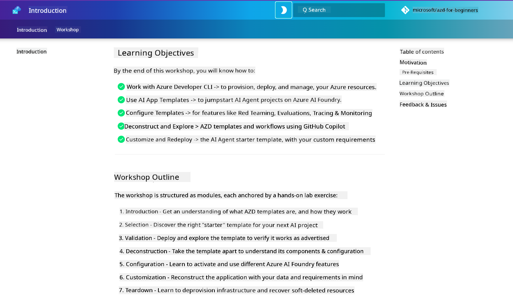

<!--
CO_OP_TRANSLATOR_METADATA:
{
  "original_hash": "9cc966416ab431c38b2ab863884b196c",
  "translation_date": "2025-09-25T00:36:30+00:00",
  "source_file": "workshop/README.md",
  "language_code": "en"
}
-->
# AZD for AI Developers Workshop

Welcome to the hands-on workshop designed to teach you Azure Developer CLI (AZD) with a focus on deploying AI applications. This workshop will guide you through three key steps:

1. **Discovery** - Find the template that suits your needs.
2. **Deployment** - Deploy the template and ensure it works.
3. **Customization** - Modify and iterate to make it your own!

Throughout this workshop, you'll also be introduced to essential developer tools and workflows to streamline your end-to-end development process.

<br/>

## Browser-Based Guide

The workshop lessons are written in Markdown. You can navigate them directly on GitHub or launch a browser-based preview, as shown in the screenshot below.



To use this option, fork the repository to your profile and launch GitHub Codespaces. Once the VS Code terminal is active, type the following command:

```bash title="" linenums="0"
mkdocs serve > /dev/null 2>&1 &
```

In a few seconds, a pop-up dialog will appear. Select the option to `Open in browser`. The web-based guide will open in a new browser tab. Benefits of this preview include:

1. **Built-in search** - Quickly find keywords or lessons.
2. **Copy icon** - Hover over code blocks to see this option.
3. **Theme toggle** - Switch between dark and light themes.
4. **Get help** - Click the Discord icon in the footer to join!

<br/>

## Workshop Overview

**Duration:** 3-4 hours  
**Level:** Beginner to Intermediate  
**Prerequisites:** Familiarity with Azure, AI concepts, VS Code, and command-line tools.

This is a hands-on workshop where you learn by doing. After completing the exercises, we recommend reviewing the AZD For Beginners curriculum to further explore Security and Productivity best practices.

| Time | Module  | Objective |
|:---|:---|:---|
| 15 mins | [Introduction](docs/instructions/0-Introduction.md) | Set the stage, understand the goals |
| 30 mins | [Select AI Template](docs/instructions/1-Select-AI-Template.md) | Explore options and pick a starter template | 
| 30 mins | [Validate AI Template](docs/instructions/2-Validate-AI-Template.md) | Deploy the default solution to Azure |
| 30 mins | [Deconstruct AI Template](docs/instructions/3-Deconstruct-AI-Template.md) | Explore structure and configuration |
| 30 mins | [Configure AI Template](docs/instructions/4-Configure-AI-Template.md) | Activate and test available features |
| 30 mins | [Customize AI Template](docs/instructions/5-Customize-AI-Template.md) | Adapt the template to your needs |
| 30 mins | [Teardown Infrastructure](docs/instructions/6-Teardown-Infrastructure.md) | Clean up and release resources |
| 15 mins | [Wrap-Up & Next Steps](docs/instructions/7-Wrap-up.md) | Learning resources, workshop challenge |

<br/>

## What You'll Learn

Think of the AZD Template as a sandbox for exploring various tools and capabilities for end-to-end development on Azure AI Foundry. By the end of this workshop, you should have a solid understanding of the tools and concepts in this context.

| Concept  | Objective |
|:---|:---|
| **Azure Developer CLI** | Learn tool commands and workflows |
| **AZD Templates** | Understand project structure and configuration |
| **Azure AI Agent** | Provision and deploy Azure AI Foundry projects |
| **Azure AI Search** | Enable context engineering with agents |
| **Observability** | Explore tracing, monitoring, and evaluations |
| **Red Teaming** | Learn adversarial testing and mitigation strategies |

<br/>

## Workshop Structure

The workshop is designed to take you through a journey from template discovery to deployment, deconstruction, and customization, using the official [Getting Started with AI Agents](https://github.com/Azure-Samples/get-started-with-ai-agents) starter template as the foundation.

### [Module 1: Select AI Template](docs/instructions/1-Select-AI-Template.md) (30 mins)

- What are AI Templates?
- Where can I find AI Templates?
- How can I start building AI Agents?
- **Lab**: Quickstart with GitHub Codespaces

### [Module 2: Validate AI Template](docs/instructions/2-Validate-AI-Template.md) (30 mins)

- What is the AI Template Architecture?
- What is the AZD Development Workflow?
- How can I get help with AZD Development?
- **Lab**: Deploy and validate the AI Agents template

### [Module 3: Deconstruct AI Template](docs/instructions/3-Deconstruct-AI-Template.md) (30 mins)

- Explore your environment in `.azure/`
- Explore your resource setup in `infra/`
- Explore your AZD configuration in `azure.yaml`
- **Lab**: Modify environment variables and redeploy

### [Module 4: Configure AI Template](docs/instructions/4-Configure-AI-Template.md) (30 mins)

- Explore: Retrieval Augmented Generation
- Explore: Agent Evaluation and Red Teaming
- Explore: Tracing and Monitoring
- **Lab**: Explore AI Agent + Observability

### [Module 5: Customize AI Template](docs/instructions/5-Customize-AI-Template.md) (30 mins)

- Define: PRD with scenario requirements
- Configure: Environment variables for AZD
- Implement: Lifecycle hooks for additional tasks
- **Lab**: Customize the template for your scenario

### [Module 6: Teardown Infrastructure](docs/instructions/6-Teardown-Infrastructure.md) (30 mins)

- Recap: What are AZD Templates?
- Recap: Why use Azure Developer CLI?
- Next Steps: Try a different template!
- **Lab**: Deprovision infrastructure and clean up

<br/>

## Workshop Challenge

Want to push yourself further? Here are some project ideas—or share your own with us!

| Project | Description |
|:---|:---|
|1. **Deconstruct A Complex AI Template** | Use the workflow and tools outlined to deploy, validate, and customize a different AI solution template. _What did you learn?_ |
|2. **Customize With Your Scenario** | Write a PRD (Product Requirements Document) for a different scenario. Then use GitHub Copilot in your template repo in Agent Model and ask it to generate a customization workflow for you. _What did you learn? How could you improve these suggestions?_ |
| | |

## Have feedback?

1. Post an issue on this repo—tag it `Workshop` for convenience.
2. Join the Azure AI Foundry Discord—connect with your peers!

| | | 
|:---|:---|
| **📚 Course Home** | [AZD For Beginners](../README.md) |
| **📖 Documentation** | [Get started with AI templates](https://learn.microsoft.com/en-us/azure/ai-foundry/how-to/develop/ai-template-get-started) |
| **🛠️ AI Templates** | [Azure AI Foundry Templates](https://ai.azure.com/templates) |
| **🚀 Next Steps** | [Take The Challenge](../../../workshop) |
| | |

<br/>

---

**Previous:** [AI Troubleshooting Guide](../docs/troubleshooting/ai-troubleshooting.md) | **Next:** Begin with [Lab 1: AZD Basics](../../../workshop/lab-1-azd-basics)

**Ready to start building AI applications with AZD?**

[Begin Lab 1: AZD Foundations →](./lab-1-azd-basics/README.md)

---

