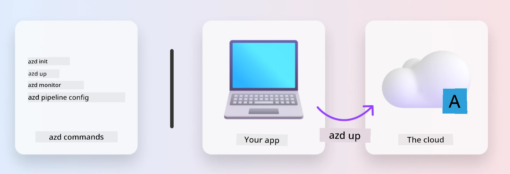
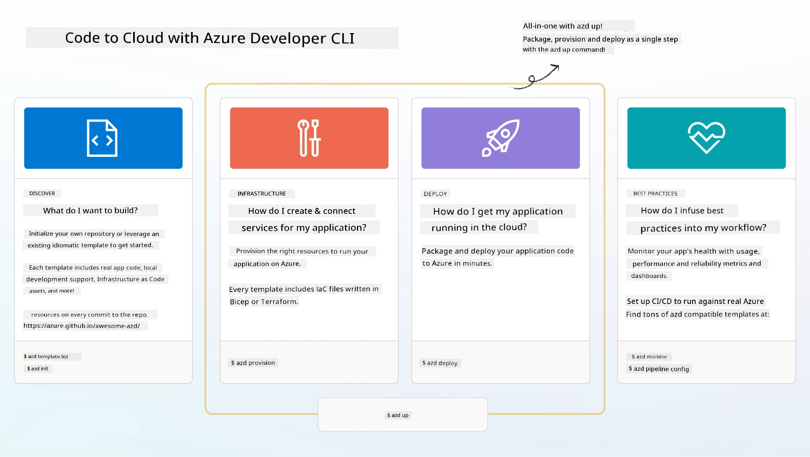

# 1. Select a Template

!!! tip "BY THE END OF THIS MODULE YOU WILL BE ABLE TO"

    - [ ] Explain what AZD templates are
    - [ ] Discover and utilize AZD templates for AI
    - [ ] Begin working with the AI Agents template
    - [ ] **Lab 1:** AZD Quickstart with GitHub Codespaces

---

## 1. A Builder Analogy

Creating a modern, enterprise-ready AI application _from scratch_ can feel overwhelming. It's a bit like building your own house, brick by brick. Sure, it’s possible! But it’s not the most efficient way to achieve the desired outcome.

Instead, we often start with an existing _design blueprint_ and collaborate with an architect to tailor it to our specific needs. This is the same approach to take when building intelligent applications. First, identify a solid design architecture that fits your problem space. Then, work with a solution architect to adapt and develop the solution for your unique scenario.

But where can we find these design blueprints? And how do we locate an architect willing to teach us how to customize and deploy these blueprints ourselves? In this workshop, we’ll answer these questions by introducing three technologies:

1. [Azure Developer CLI](https://aka.ms/azd) - an open-source tool that accelerates the developer journey from local development (build) to cloud deployment (ship).
1. [Azure AI Foundry Templates](https://ai.azure.com/templates) - standardized open-source repositories containing sample code, infrastructure, and configuration files for deploying an AI solution architecture.
1. [GitHub Copilot Agent Mode](https://code.visualstudio.com/docs/copilot/chat/chat-agent-mode) - a coding assistant powered by Azure knowledge that helps navigate the codebase and make changes using natural language.

With these tools, we can now _discover_ the right template, _deploy_ it to ensure it works, and _customize_ it to fit our specific needs. Let’s dive in and explore how these tools function.

---

## 2. Azure Developer CLI

The [Azure Developer CLI](https://learn.microsoft.com/en-us/azure/developer/azure-developer-cli/) (or `azd`) is an open-source command-line tool designed to streamline your code-to-cloud journey. It offers developer-friendly commands that work seamlessly across your IDE (development) and CI/CD (DevOps) environments.

Using `azd`, your deployment process can be as simple as:

- `azd init` - Initializes a new AI project using an existing AZD template.
- `azd up` - Provisions infrastructure and deploys your application in one step.
- `azd monitor` - Provides real-time monitoring and diagnostics for your deployed application.
- `azd pipeline config` - Sets up CI/CD pipelines to automate deployment to Azure.

**🎯 | EXERCISE**: <br/> Explore the `azd` command-line tool in your GitHub Codespaces environment. Start by typing this command to discover its capabilities:

```bash title="" linenums="0"
azd help
```



---

## 3. The AZD Template

For `azd` to function effectively, it needs information about the infrastructure to provision, the configuration settings to enforce, and the application to deploy. This is where [AZD templates](https://learn.microsoft.com/en-us/azure/developer/azure-developer-cli/azd-templates?tabs=csharp) come into play.

AZD templates are open-source repositories that combine sample code with infrastructure and configuration files necessary for deploying a solution architecture. By leveraging an _Infrastructure-as-Code_ (IaC) approach, these templates allow resource definitions and configuration settings to be version-controlled (just like application source code), enabling reusable and consistent workflows across users of the project.

When creating or reusing an AZD template for _your_ scenario, consider the following questions:

1. What are you building? → Is there a template with starter code for that scenario?
1. How is your solution architected? → Does the template include the required resources?
1. How is your solution deployed? → Think `azd deploy` with pre/post-processing hooks!
1. How can you optimize it further? → Consider built-in monitoring and automation pipelines!

**🎯 | EXERCISE**: <br/> 
Visit the [Awesome AZD](https://azure.github.io/awesome-azd/) gallery and use the filters to explore the 250+ templates currently available. See if you can find one that aligns with _your_ scenario requirements.



---

## 4. AI App Templates

---

