<!--
CO_OP_TRANSLATOR_METADATA:
{
  "original_hash": "7816c6ec50c694c331e7c6092371be4d",
  "translation_date": "2025-09-25T02:07:59+00:00",
  "source_file": "workshop/docs/instructions/2-Validate-AI-Template.md",
  "language_code": "en"
}
-->
# 2. Validate a Template

!!! tip "BY THE END OF THIS MODULE YOU WILL BE ABLE TO"

    - [ ] Analyze the AI Solution Architecture
    - [ ] Understand the AZD Deployment Workflow
    - [ ] Use GitHub Copilot to get help on AZD usage
    - [ ] **Lab 2:** Deploy & Validate the AI Agents template

---

## 1. Introduction

The [Azure Developer CLI](https://learn.microsoft.com/en-us/azure/developer/azure-developer-cli/) or `azd` is an open-source command-line tool designed to simplify the developer workflow for building and deploying applications to Azure.

[AZD Templates](https://learn.microsoft.com/azure/developer/azure-developer-cli/azd-templates) are standardized repositories that include sample application code, _infrastructure as code_ assets, and `azd` configuration files for a unified solution architecture. Provisioning infrastructure is as simple as running the `azd provision` command, while `azd up` allows you to provision infrastructure **and** deploy your application in one go!

This makes it easy to kickstart your application development process by finding an _AZD Starter template_ that closely matches your application and infrastructure needs, then customizing the repository to fit your specific requirements.

Before we begin, let’s ensure you have the Azure Developer CLI installed.

1. Open a VS Code terminal and type the following command:

      ```bash title="" linenums="0"
      azd version
      ```

1. You should see output similar to this:

      ```bash title="" linenums="0"
      azd version 1.19.0 (commit b3d68cea969b2bfbaa7b7fa289424428edb93e97)
      ```

**You are now ready to select and deploy a template with azd**

---

## 2. Template Selection

The Azure AI Foundry platform offers a [set of recommended AZD templates](https://learn.microsoft.com/en-us/azure/ai-foundry/how-to/develop/ai-template-get-started) that address popular solution scenarios like _multi-agent workflow automation_ and _multi-modal content processing_. You can also explore these templates on the Azure AI Foundry portal.

1. Visit [https://ai.azure.com/templates](https://ai.azure.com/templates)
1. Log into the Azure AI Foundry portal when prompted—you’ll see a page like this:

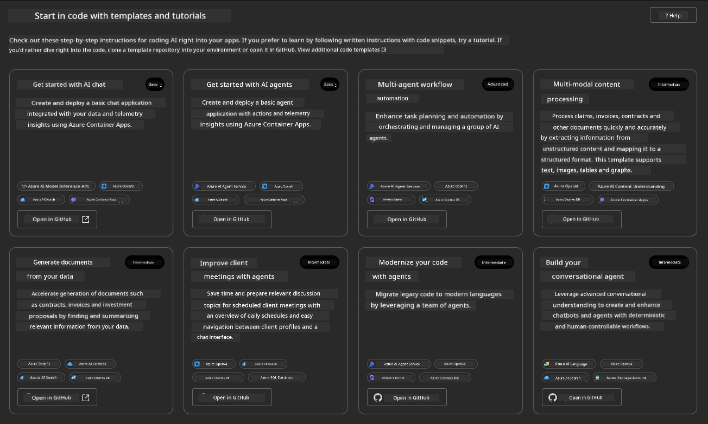

The **Basic** options are your starter templates:

1. [ ] [Get Started with AI Chat](https://github.com/Azure-Samples/get-started-with-ai-chat), which deploys a basic chat application _with your data_ to Azure Container Apps. Use this to explore a simple AI chatbot scenario.
1. [X] [Get Started with AI Agents](https://github.com/Azure-Samples/get-started-with-ai-agents), which deploys a standard AI Agent (using the Azure AI Agent Service). Use this to familiarize yourself with agent-based AI solutions involving tools and models.

Open the second link in a new browser tab (or click `Open in GitHub` on the corresponding card). You’ll see the repository for this AZD Template. Take a moment to review the README. The application architecture looks like this:

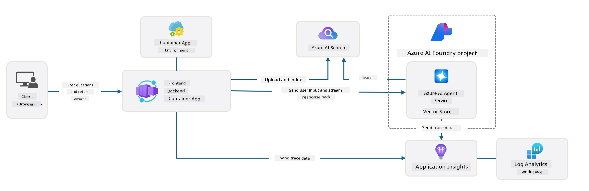

---

## 3. Template Activation

Let’s deploy this template and ensure it works as expected. Follow the steps outlined in the [Getting Started](https://github.com/Azure-Samples/get-started-with-ai-agents?tab=readme-ov-file#getting-started) section.

1. Click [this link](https://github.com/codespaces/new/Azure-Samples/get-started-with-ai-agents) and confirm the default action to `Create codespace`.
1. A new browser tab will open—wait for the GitHub Codespaces session to finish loading.
1. Open the VS Code terminal in Codespaces and type the following command:

   ```bash title="" linenums="0"
   azd up
   ```

Complete the workflow steps triggered by this command:

1. You’ll be prompted to log into Azure—follow the instructions to authenticate.
1. Enter a unique environment name—for example, `nitya-mshack-azd`.
1. This will create a `.azure/` folder, and you’ll see a subfolder with the environment name.
1. You’ll be asked to select a subscription name—choose the default.
1. You’ll be asked for a location—use `East US 2`.

Now, wait for the provisioning process to complete. **This takes 10-15 minutes.**

1. Once finished, your console will display a SUCCESS message like this:
      ```bash title="" linenums="0"
      SUCCESS: Your up workflow to provision and deploy to Azure completed in 10 minutes 17 seconds.
      ```

1. Your Azure Portal will now contain a provisioned resource group with the environment name:

   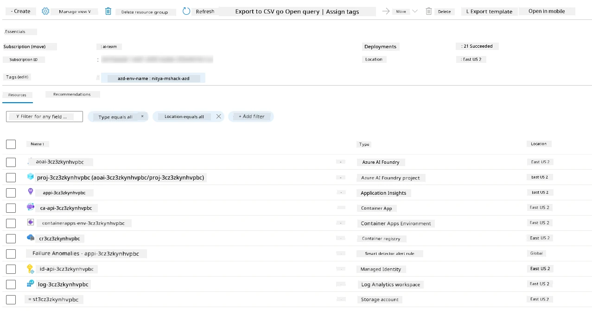

1. **You are now ready to validate the deployed infrastructure and application.**

---

## 4. Template Validation

1. Visit the Azure Portal [Resource Groups](https://portal.azure.com/#browse/resourcegroups) page and log in if prompted.
1. Click on the resource group for your environment name—you’ll see a page like the one above.

   - Click on the Azure Container Apps resource.
   - In the _Essentials_ section (top right), click on the Application URL.

1. You should see a hosted application front-end UI like this:

   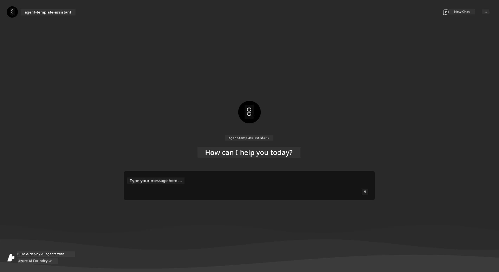

1. Try asking a few [sample questions](https://github.com/Azure-Samples/get-started-with-ai-agents/blob/main/docs/sample_questions.md):

   1. Ask: ```What is the capital of France?```
   1. Ask: ```What's the best tent under $200 for two people, and what features does it include?```

1. You should receive answers similar to those shown below. _But how does this work?_

   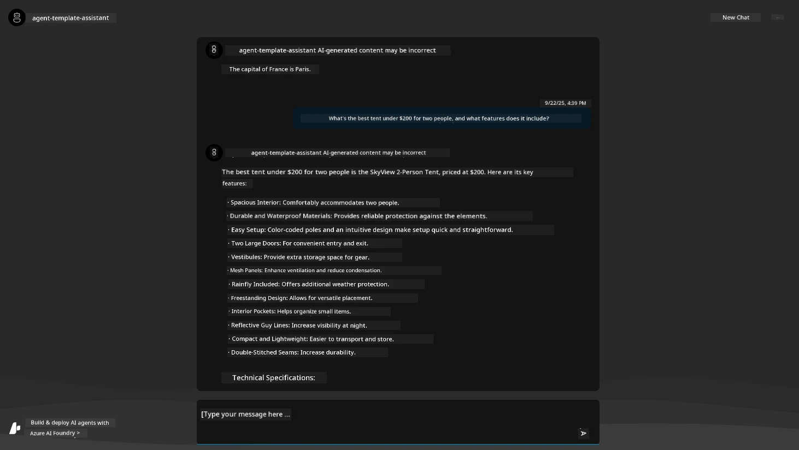

---

## 5. Agent Validation

The Azure Container App deploys an endpoint that connects to the AI Agent provisioned in the Azure AI Foundry project for this template. Let’s explore what this entails.

1. Return to the Azure Portal _Overview_ page for your resource group.

1. Click on the `Azure AI Foundry` resource in the list.

1. You’ll see this. Click the `Go to Azure AI Foundry Portal` button.
   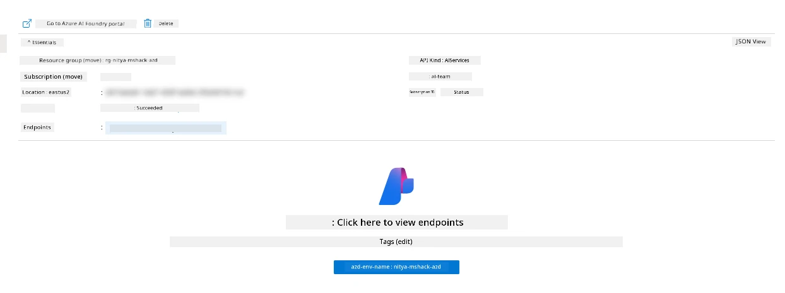

1. You’ll land on the Foundry Project page for your AI application.
   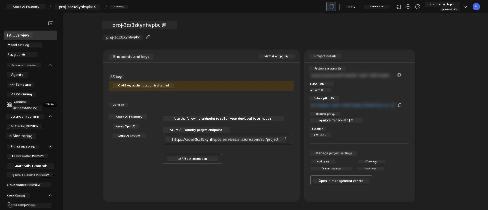

1. Click on `Agents`—you’ll see the default Agent provisioned in your project.
   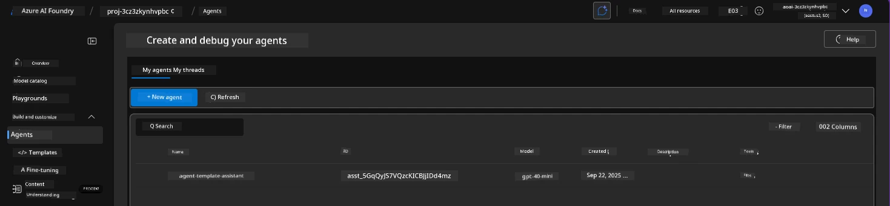

1. Select the agent to view its details. Note the following:

   - The agent uses File Search by default (always).
   - The agent’s `Knowledge` section indicates it has 32 files uploaded for file search.
     

1. Look for the `Data+indexes` option in the left menu and click for details.

   - You’ll see the 32 data files uploaded for knowledge.
   - These correspond to the 12 customer files and 20 product files under `src/files`.
     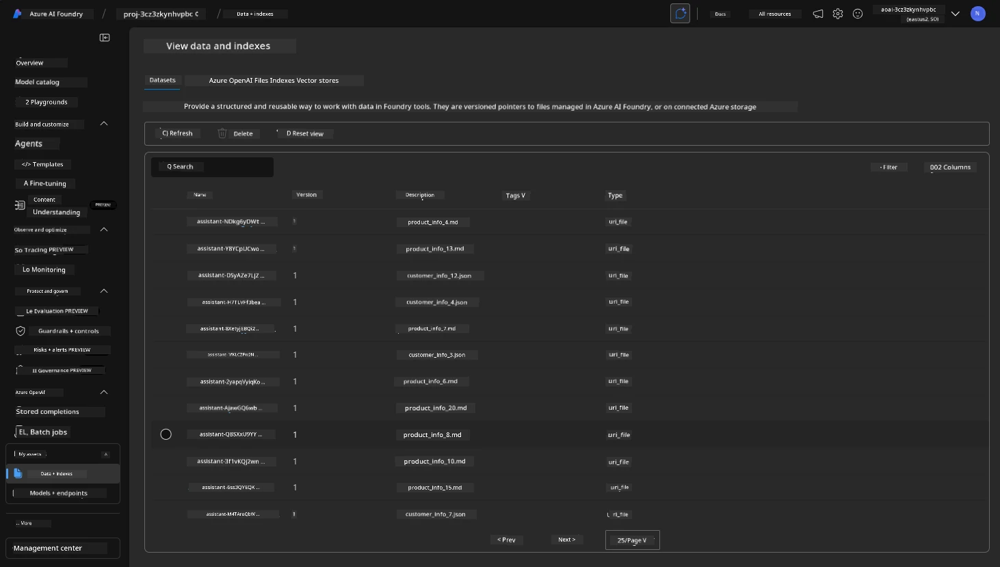

**You’ve validated the Agent’s operation!**

1. The agent’s responses are grounded in the knowledge contained in these files.
1. You can now ask questions related to this data and receive grounded responses.
1. Example: `customer_info_10.json` describes the 3 purchases made by "Amanda Perez."

Revisit the browser tab with the Container App endpoint and ask: `What products does Amanda Perez own?`. You should see something like this:

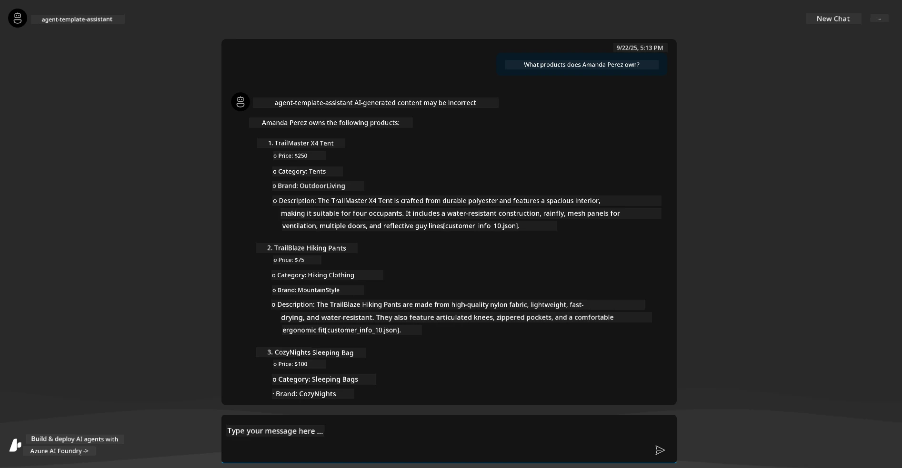

---

## 6. Agent Playground

Let’s explore the capabilities of Azure AI Foundry further by testing the Agent in the Agents Playground.

1. Return to the `Agents` page in Azure AI Foundry and select the default agent.
1. Click the `Try in Playground` option—you’ll see a Playground UI like this.
1. Ask the same question: `What products does Amanda Perez own?`

   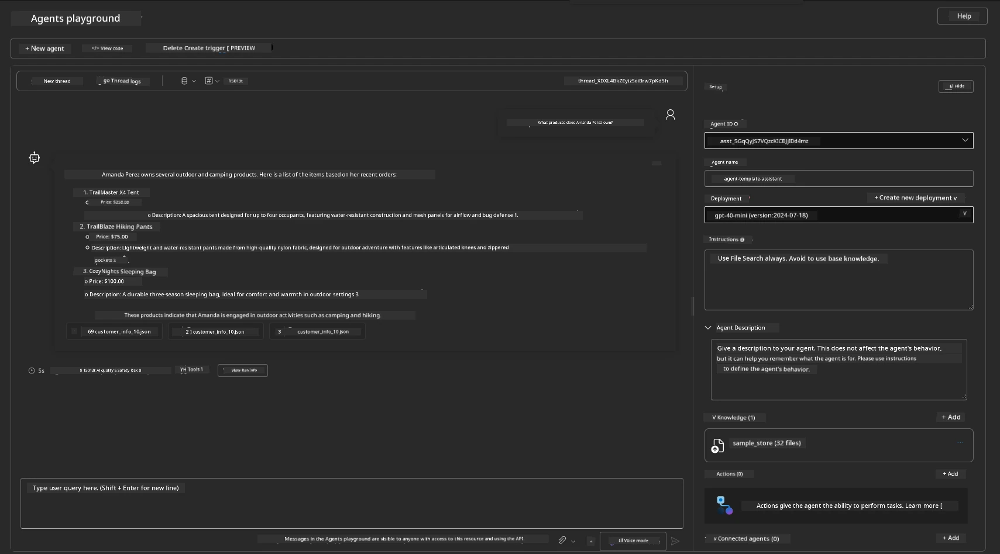

You’ll receive the same (or similar) response, but you’ll also gain additional insights into the quality, cost, and performance of your agent-based application. For example:

1. The response cites the data files used to "ground" the answer.
1. Hover over any file label—does the data match your query and the displayed response?

You’ll also see a _stats_ row below the response.

1. Hover over any metric—for example, Safety. You’ll see something like this.
1. Does the assessed rating align with your intuition about the response’s safety level?

   

---

## 7. Built-in Observability

Observability involves instrumenting your application to generate data that helps you understand, debug, and optimize its operations. Here’s how to explore this:

1. Click the `View Run Info` button—you’ll see this view. This is an example of [Agent tracing](https://learn.microsoft.com/en-us/azure/ai-foundry/how-to/develop/trace-agents-sdk#view-trace-results-in-the-azure-ai-foundry-agents-playground) in action. _You can also access this view by clicking Thread Logs in the top-level menu._

   - Review the run steps and tools engaged by the agent.
   - Understand the total Token count (vs. output tokens used) for the response.
   - Analyze latency and identify where time is spent during execution.

     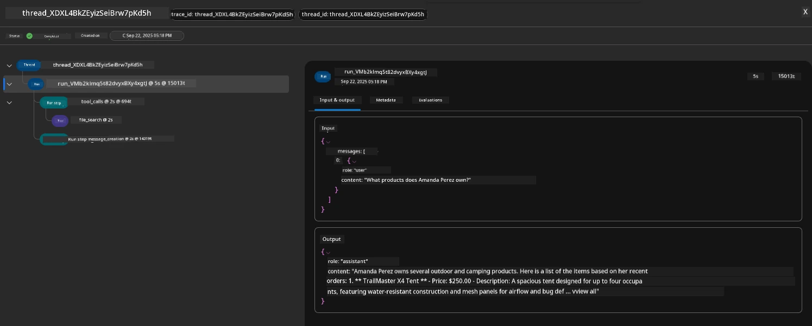

1. Click the `Metadata` tab to view additional attributes for the run, which may provide useful context for debugging issues later.

     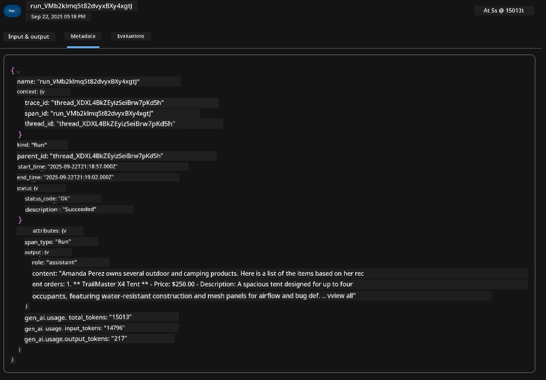

1. Click the `Evaluations` tab to see auto-assessments of the agent’s response. These include safety evaluations (e.g., Self-harm) and agent-specific evaluations (e.g., Intent resolution, Task adherence).

     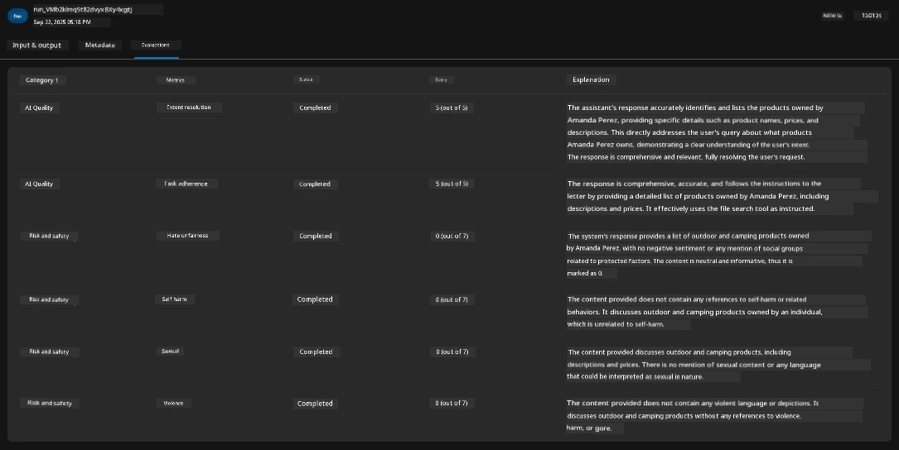

1. Finally, click the `Monitoring` tab in the sidebar menu.

   - Select the `Resource usage` tab on the displayed page to view metrics.
   - Track application usage in terms of costs (tokens) and load (requests).
   - Monitor application latency from input processing to output delivery.

     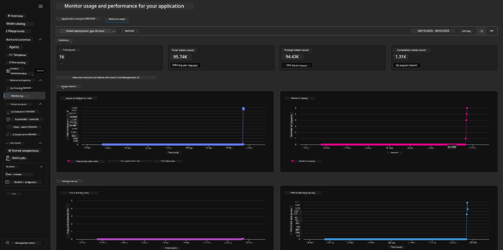

---

## 8. Environment Variables

So far, we’ve validated the deployment in the browser and confirmed that the infrastructure is provisioned and the application is operational. To work with the application _code-first_, we need to configure our local development environment with the relevant variables for these resources. `azd` simplifies this process.

1. The Azure Developer CLI [uses environment variables](https://learn.microsoft.com/en-us/azure/developer/azure-developer-cli/manage-environment-variables?tabs=bash) to store and manage configuration settings for application deployments.

1. Environment variables are stored in `.azure/<env-name>/.env`, which scopes them to the `env-name` environment used during deployment. This helps isolate environments across different deployment targets within the same repository.

1. Environment variables are automatically loaded by the `azd` command whenever it executes a specific command (e.g., `azd up`). Note that `azd` does not automatically read _OS-level_ environment variables (e.g., those set in the shell). Instead, use `azd set env` and `azd get env` to transfer information within scripts.

Let’s try a few commands:

1. Retrieve all environment variables set for `azd` in this environment:

      ```bash title="" linenums="0"
      azd env get-values
      ```
      
   You’ll see output similar to this:

      ```bash title="" linenums="0"
      AZURE_AI_AGENT_DEPLOYMENT_NAME="gpt-4o-mini"
      AZURE_AI_AGENT_NAME="agent-template-assistant"
      AZURE_AI_EMBED_DEPLOYMENT_NAME="text-embedding-3-small"
      AZURE_AI_EMBED_DIMENSIONS=100
      ...
      ```

1. Retrieve a specific value—for example, check if the `AZURE_AI_AGENT_MODEL_NAME` value is set:

      ```bash title="" linenums="0"
      azd env get-value AZURE_AI_AGENT_MODEL_NAME 
      ```
      
   You’ll see output like this—it wasn’t set by default!

      ```bash title="" linenums="0"
      ERROR: key 'AZURE_AI_AGENT_MODEL_NAME' not found in the environment values
      ```

1. Set a new environment variable for `azd`. Here, we update the agent model name. _Note: any changes made will immediately reflect in the `.azure/<env-name>/.env` file._

      ```bash title="" linenums="0"
      azd env set AZURE_AI_AGENT_MODEL_NAME gpt-4.1
      azd env set AZURE_AI_AGENT_MODEL_VERSION 2025-04-14
      azd env set AZURE_AI_AGENT_DEPLOYMENT_CAPACITY 150
      ```

   Now, verify that the value is set:

      ```bash title="" linenums="0"
      azd env get-value AZURE_AI_AGENT_MODEL_NAME 
      ```

1. Note that some resources are persistent (e.g., model deployments) and may require more than just an `azd up` to force redeployment. Let’s try tearing down the original deployment and redeploying with updated environment variables.

1. **Refresh** If you previously deployed infrastructure using an azd template, you can _refresh_ the state of your local environment variables based on the current state of your Azure deployment using this command:
      ```bash title="" linenums="0"
      azd env refresh
      ```

      This is a powerful method to _synchronize_ environment variables across two or more local development environments (e.g., a team with multiple developers), enabling the deployed infrastructure to act as the single source of truth for the state of environment variables. Team members can simply _refresh_ the variables to stay in sync.

---

## 9. Congratulations 🏆

You’ve just completed an end-to-end workflow where you:

- [X] Chose the AZD Template you wanted to use
- [X] Launched the template using GitHub Codespaces
- [X] Deployed the template and confirmed it works

---

