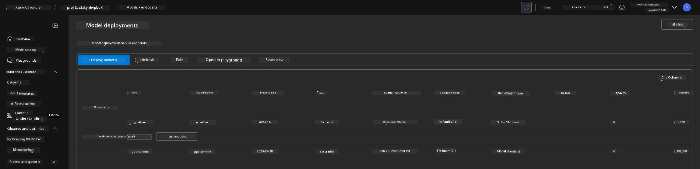
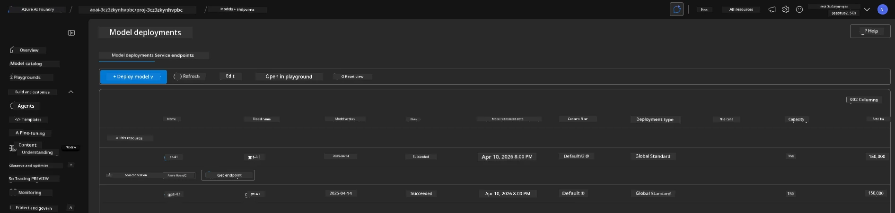

<!--
CO_OP_TRANSLATOR_METADATA:
{
  "original_hash": "6539a34c770f3ceff282370d72ee74dc",
  "translation_date": "2025-09-25T02:17:07+00:00",
  "source_file": "workshop/docs/instructions/6-Teardown-Infrastructure.md",
  "language_code": "en"
}
-->
# 6. Teardown Infrastructure

!!! tip "BY THE END OF THIS MODULE YOU WILL BE ABLE TO"

    - [ ] Item
    - [ ] Item
    - [ ] Item

---

## Bonus Exercises

Before dismantling the project, take a few minutes for some open-ended exploration.

!!! danger "NITYA-TODO: Outline some prompts to try"

---

## Deprovision Infra

1. Tearing down the infrastructure is as simple as:
      
      ```bash title="" linenums="0"
      azd down --purge
      ```
1. The `--purge` flag ensures that it also removes soft-deleted Cognitive Service resources, freeing up the quota held by these resources. Once the process is complete, you will see something like this:
      
      ```bash title="" linenums="0"
      ? Total resources to delete: 11, are you sure you want to continue? Yes
      Deleting your resources can take some time.
      (✓) Done: Deleted resource group rg-nitya-mshack-azd
      (✓) Done: Purging Cognitive Account: aoai-3cz3zkynhvpbc

      SUCCESS: Your application was removed from Azure in 11 minutes 4 seconds.
      ```

1. (Optional) If you now run `azd up` again, you'll notice the gpt-4.1 model gets deployed because the environment variable was modified (and saved) in the local `.azure` folder. 

      Here are the model deployments **before**:

      

      And here they are **after**:
      

---

