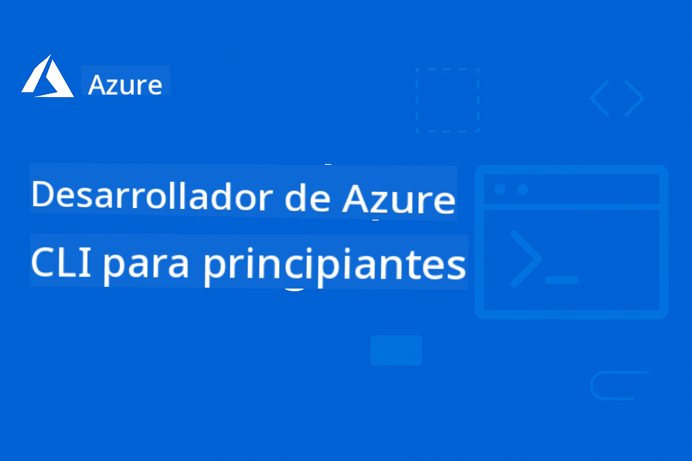

<!--
CO_OP_TRANSLATOR_METADATA:
{
  "original_hash": "56313679644ccd28e9d15bb7089ae5ca",
  "translation_date": "2025-10-11T14:22:21+00:00",
  "source_file": "README.md",
  "language_code": "es"
}
-->
# AZD Para Principiantes: Un Viaje de Aprendizaje Estructurado

 

[](https://GitHub.com/microsoft/azd-for-beginners/watchers/)
[](https://GitHub.com/microsoft/azd-for-beginners/network/)
[](https://GitHub.com/microsoft/azd-for-beginners/stargazers/)

[](https://discord.gg/microsoft-azure)
[](https://discord.gg/kzRShWzttr)

## Comenzando con Este Curso

Sigue estos pasos para iniciar tu viaje de aprendizaje con AZD:

1. **Haz un Fork del Repositorio**: Haz clic en [](https://GitHub.com/microsoft/azd-for-beginners/fork)
2. **Clona el Repositorio**: `git clone https://github.com/microsoft/azd-for-beginners.git`
3. **Únete a la Comunidad**: [Comunidades de Azure en Discord](https://discord.com/invite/ByRwuEEgH4) para soporte experto
4. **Elige Tu Ruta de Aprendizaje**: Selecciona un capítulo abajo que se ajuste a tu nivel de experiencia

### Soporte Multilingüe

#### Traducciones Automáticas (Siempre Actualizadas)

<!-- CO-OP TRANSLATOR LANGUAGES TABLE START -->
[Árabe](../ar/README.md) | [Bengalí](../bn/README.md) | [Búlgaro](../bg/README.md) | [Birmano (Myanmar)](../my/README.md) | [Chino (Simplificado)](../zh/README.md) | [Chino (Tradicional, Hong Kong)](../hk/README.md) | [Chino (Tradicional, Macao)](../mo/README.md) | [Chino (Tradicional, Taiwán)](../tw/README.md) | [Croata](../hr/README.md) | [Checo](../cs/README.md) | [Danés](../da/README.md) | [Holandés](../nl/README.md) | [Estonio](../et/README.md) | [Finlandés](../fi/README.md) | [Francés](../fr/README.md) | [Alemán](../de/README.md) | [Griego](../el/README.md) | [Hebreo](../he/README.md) | [Hindi](../hi/README.md) | [Húngaro](../hu/README.md) | [Indonesio](../id/README.md) | [Italiano](../it/README.md) | [Japonés](../ja/README.md) | [Coreano](../ko/README.md) | [Lituano](../lt/README.md) | [Malayo](../ms/README.md) | [Maratí](../mr/README.md) | [Nepalí](../ne/README.md) | [Noruego](../no/README.md) | [Persa (Farsi)](../fa/README.md) | [Polaco](../pl/README.md) | [Portugués (Brasil)](../br/README.md) | [Portugués (Portugal)](../pt/README.md) | [Panyabí (Gurmukhi)](../pa/README.md) | [Rumano](../ro/README.md) | [Ruso](../ru/README.md) | [Serbio (Cirílico)](../sr/README.md) | [Eslovaco](../sk/README.md) | [Esloveno](../sl/README.md) | [Español](./README.md) | [Suajili](../sw/README.md) | [Sueco](../sv/README.md) | [Tagalo (Filipino)](../tl/README.md) | [Tamil](../ta/README.md) | [Tailandés](../th/README.md) | [Turco](../tr/README.md) | [Ucraniano](../uk/README.md) | [Urdu](../ur/README.md) | [Vietnamita](../vi/README.md)
<!-- CO-OP TRANSLATOR LANGUAGES TABLE END -->

## Resumen del Curso

Domina Azure Developer CLI (azd) a través de capítulos estructurados diseñados para un aprendizaje progresivo. **Enfoque especial en el despliegue de aplicaciones de IA con integración de Azure AI Foundry.**

### Por Qué Este Curso es Esencial para Desarrolladores Modernos

Basado en los conocimientos de la comunidad de Discord de Azure AI Foundry, **el 45% de los desarrolladores quieren usar AZD para cargas de trabajo de IA**, pero enfrentan desafíos con:
- Arquitecturas complejas de IA con múltiples servicios
- Mejores prácticas para despliegues de IA en producción  
- Integración y configuración de servicios de Azure AI
- Optimización de costos para cargas de trabajo de IA
- Resolución de problemas específicos de despliegue de IA

### Objetivos de Aprendizaje

Al completar este curso estructurado, podrás:
- **Dominar los Fundamentos de AZD**: Conceptos básicos, instalación y configuración
- **Desplegar Aplicaciones de IA**: Usar AZD con servicios de Azure AI Foundry
- **Implementar Infraestructura como Código**: Gestionar recursos de Azure con plantillas Bicep
- **Resolver Problemas de Despliegue**: Solucionar problemas comunes y depurar errores
- **Optimizar para Producción**: Seguridad, escalabilidad, monitoreo y gestión de costos
- **Construir Soluciones Multi-Agente**: Desplegar arquitecturas complejas de IA

## 📚 Capítulos de Aprendizaje

*Selecciona tu ruta de aprendizaje según tu nivel de experiencia y objetivos*

### 🚀 Capítulo 1: Fundamentos y Inicio Rápido
**Requisitos Previos**: Suscripción a Azure, conocimientos básicos de línea de comandos  
**Duración**: 30-45 minutos  
**Complejidad**: ⭐

#### Lo Que Aprenderás
- Comprender los fundamentos de Azure Developer CLI
- Instalar AZD en tu plataforma
- Tu primer despliegue exitoso

#### Recursos de Aprendizaje
- **🎯 Comienza Aquí**: [¿Qué es Azure Developer CLI?](../..)
- **📖 Teoría**: [Fundamentos de AZD](docs/getting-started/azd-basics.md) - Conceptos y terminología clave
- **⚙️ Configuración**: [Instalación y Configuración](docs/getting-started/installation.md) - Guías específicas por plataforma
- **🛠️ Práctica**: [Tu Primer Proyecto](docs/getting-started/first-project.md) - Tutorial paso a paso
- **📋 Referencia Rápida**: [Hoja de Trucos de Comandos](resources/cheat-sheet.md)

#### Ejercicios Prácticos
```bash
# Quick installation check
azd version

# Deploy your first application
azd init --template todo-nodejs-mongo
azd up
```

**💡 Resultado del Capítulo**: Desplegar exitosamente una aplicación web simple en Azure usando AZD

---

### 🤖 Capítulo 2: Desarrollo con Enfoque en IA (Recomendado para Desarrolladores de IA)
**Requisitos Previos**: Capítulo 1 completado  
**Duración**: 1-2 horas  
**Complejidad**: ⭐⭐

#### Lo Que Aprenderás
- Integración de Azure AI Foundry con AZD
- Desplegar aplicaciones impulsadas por IA
- Comprender configuraciones de servicios de IA

#### Recursos de Aprendizaje
- **🎯 Comienza Aquí**: [Integración de Azure AI Foundry](docs/ai-foundry/azure-ai-foundry-integration.md)
- **📖 Patrones**: [Despliegue de Modelos de IA](docs/ai-foundry/ai-model-deployment.md) - Desplegar y gestionar modelos de IA
- **🛠️ Taller**: [Laboratorio de Taller de IA](docs/ai-foundry/ai-workshop-lab.md) - Preparar tus soluciones de IA para AZD
- **🎥 Guía Interactiva**: [Materiales del Taller](workshop/README.md) - Aprendizaje basado en navegador con MkDocs * Entorno DevContainer
- **📋 Plantillas**: [Plantillas de Azure AI Foundry](../..)

#### Ejercicios Prácticos
```bash
# Deploy your first AI application
azd init --template azure-search-openai-demo
azd up

# Try additional AI templates
azd init --template openai-chat-app-quickstart
azd init --template agent-openai-python-prompty
```

**💡 Resultado del Capítulo**: Desplegar y configurar una aplicación de chat impulsada por IA con capacidades RAG

---

### ⚙️ Capítulo 3: Configuración y Autenticación
**Requisitos Previos**: Capítulo 1 completado  
**Duración**: 45-60 minutos  
**Complejidad**: ⭐⭐

#### Lo Que Aprenderás
- Configuración y gestión de entornos
- Mejores prácticas de autenticación y seguridad
- Organización y nomenclatura de recursos

#### Recursos de Aprendizaje
- **📖 Configuración**: [Guía de Configuración](docs/getting-started/configuration.md) - Configuración de entornos
- **🔐 Seguridad**: Patrones de autenticación e identidad administrada
- **📝 Ejemplos**: [Ejemplo de Aplicación con Base de Datos](../../examples/database-app) - Patrones de configuración

#### Ejercicios Prácticos
- Configurar múltiples entornos (desarrollo, pruebas, producción)
- Configurar autenticación con identidad administrada
- Implementar configuraciones específicas por entorno

**💡 Resultado del Capítulo**: Gestionar múltiples entornos con autenticación y seguridad adecuadas

---

### 🏗️ Capítulo 4: Infraestructura como Código y Despliegue
**Requisitos Previos**: Capítulos 1-3 completados  
**Duración**: 1-1.5 horas  
**Complejidad**: ⭐⭐⭐

#### Lo Que Aprenderás
- Patrones avanzados de despliegue
- Infraestructura como Código con Bicep
- Estrategias de aprovisionamiento de recursos

#### Recursos de Aprendizaje
- **📖 Despliegue**: [Guía de Despliegue](docs/deployment/deployment-guide.md) - Flujos de trabajo completos
- **🏗️ Aprovisionamiento**: [Aprovisionamiento de Recursos](docs/deployment/provisioning.md) - Gestión de recursos de Azure
- **📝 Ejemplos**: [Ejemplo de Aplicación en Contenedor](../../examples/container-app) - Despliegues en contenedores

#### Ejercicios Prácticos
- Crear plantillas personalizadas de Bicep
- Desplegar aplicaciones con múltiples servicios
- Implementar estrategias de despliegue azul-verde

**💡 Resultado del Capítulo**: Desplegar aplicaciones complejas con múltiples servicios usando plantillas de infraestructura personalizadas

---

### 🎯 Capítulo 5: Soluciones de IA Multi-Agente (Avanzado)
**Requisitos Previos**: Capítulos 1-2 completados  
**Duración**: 2-3 horas  
**Complejidad**: ⭐⭐⭐⭐

#### Lo Que Aprenderás
- Patrones de arquitectura multi-agente
- Orquestación y coordinación de agentes
- Despliegues de IA listos para producción

#### Recursos de Aprendizaje
- **🤖 Proyecto Destacado**: [Solución Multi-Agente para Retail](examples/retail-scenario.md) - Implementación completa
- **🛠️ Plantillas ARM**: [Paquete de Plantillas ARM](../../examples/retail-multiagent-arm-template) - Despliegue con un clic
- **📖 Arquitectura**: Patrones de coordinación multi-agente

#### Ejercicios Prácticos
```bash
# Deploy the complete retail multi-agent solution
cd examples/retail-multiagent-arm-template
./deploy.sh

# Explore agent configurations
az deployment group show --resource-group <rg-name> --name <deployment-name>
```

**💡 Resultado del Capítulo**: Desplegar y gestionar una solución de IA multi-agente lista para producción con agentes de Cliente e Inventario

---

### 🔍 Capítulo 6: Validación y Planificación Pre-Despliegue
**Requisitos Previos**: Capítulo 4 completado  
**Duración**: 1 hora  
**Complejidad**: ⭐⭐

#### Lo Que Aprenderás
- Planificación de capacidad y validación de recursos
- Estrategias de selección de SKU
- Verificaciones previas al despliegue y automatización

#### Recursos de Aprendizaje
- **📊 Planificación**: [Planificación de Capacidad](docs/pre-deployment/capacity-planning.md) - Validación de recursos
- **💰 Selección**: [Selección de SKU](docs/pre-deployment/sku-selection.md) - Opciones rentables
- **✅ Validación**: [Verificaciones Previas](docs/pre-deployment/preflight-checks.md) - Scripts automatizados

#### Ejercicios Prácticos
- Ejecutar scripts de validación de capacidad
- Optimizar selecciones de SKU para reducir costos
- Implementar verificaciones previas al despliegue automatizadas

**💡 Resultado del Capítulo**: Validar y optimizar despliegues antes de la ejecución

---

### 🚨 Capítulo 7: Resolución de Problemas y Depuración
**Requisitos Previos**: Cualquier capítulo de despliegue completado  
**Duración**: 1-1.5 horas  
**Complejidad**: ⭐⭐

#### Lo Que Aprenderás
- Enfoques sistemáticos para depuración
- Problemas comunes y soluciones
- Resolución de problemas específicos de IA

#### Recursos de Aprendizaje
- **🔧 Problemas Comunes**: [Problemas Comunes](docs/troubleshooting/common-issues.md) - FAQ y soluciones
- **🕵️ Depuración**: [Guía de Depuración](docs/troubleshooting/debugging.md) - Estrategias paso a paso
- **🤖 Problemas de IA**: [Resolución de Problemas de IA](docs/troubleshooting/ai-troubleshooting.md) - Problemas con servicios de IA

#### Ejercicios Prácticos
- Diagnosticar fallos de despliegue
- Resolver problemas de autenticación
- Depurar conectividad de servicios de IA

**💡 Resultado del Capítulo**: Diagnosticar y resolver problemas comunes de despliegue de manera independiente

---

### 🏢 Capítulo 8: Patrones de Producción y Empresa
**Requisitos Previos**: Capítulos 1-4 completados  
**Duración**: 2-3 horas  
**Complejidad**: ⭐⭐⭐⭐

#### Lo que aprenderás
- Estrategias de despliegue en producción
- Patrones de seguridad empresarial
- Monitoreo y optimización de costos

#### Recursos de aprendizaje
- **🏭 Producción**: [Mejores prácticas de IA en producción](docs/ai-foundry/production-ai-practices.md) - Patrones empresariales
- **📝 Ejemplos**: [Ejemplo de microservicios](../../examples/microservices) - Arquitecturas complejas
- **📊 Monitoreo**: Integración con Application Insights

#### Ejercicios prácticos
- Implementar patrones de seguridad empresarial
- Configurar un monitoreo integral
- Desplegar en producción con la gobernanza adecuada

**💡 Resultado del capítulo**: Desplegar aplicaciones empresariales listas para producción con todas las capacidades necesarias

---

## 🎓 Resumen del taller: Experiencia práctica de aprendizaje

### Materiales interactivos del taller
**Aprendizaje práctico integral con herramientas basadas en navegador y ejercicios guiados**

Nuestros materiales del taller ofrecen una experiencia de aprendizaje estructurada e interactiva que complementa el plan de estudios basado en capítulos mencionado anteriormente. El taller está diseñado tanto para aprendizaje autodirigido como para sesiones dirigidas por instructores.

#### 🛠️ Características del taller
- **Interfaz basada en navegador**: Taller impulsado por MkDocs con funciones de búsqueda, copia y temas
- **Integración con GitHub Codespaces**: Configuración del entorno de desarrollo con un solo clic
- **Ruta de aprendizaje estructurada**: Ejercicios guiados en 7 pasos (3.5 horas en total)
- **Descubrimiento → Despliegue → Personalización**: Metodología progresiva
- **Entorno interactivo DevContainer**: Herramientas y dependencias preconfiguradas

#### 📚 Estructura del taller
El taller sigue una metodología de **Descubrimiento → Despliegue → Personalización**:

1. **Fase de descubrimiento** (45 minutos)
   - Explorar plantillas y servicios de Azure AI Foundry
   - Comprender patrones de arquitectura de múltiples agentes
   - Revisar requisitos y prerrequisitos de despliegue

2. **Fase de despliegue** (2 horas)
   - Despliegue práctico de aplicaciones de IA con AZD
   - Configurar servicios y puntos finales de Azure AI
   - Implementar patrones de seguridad y autenticación

3. **Fase de personalización** (45 minutos)
   - Modificar aplicaciones para casos de uso específicos
   - Optimizar para despliegues en producción
   - Implementar monitoreo y gestión de costos

#### 🚀 Comenzando con el taller
```bash
# Option 1: GitHub Codespaces (Recommended)
# Click "Code" → "Create codespace on main" in the repository

# Option 2: Local Development
git clone https://github.com/microsoft/azd-for-beginners.git
cd azd-for-beginners/workshop
# Follow the setup instructions in workshop/README.md
```

#### 🎯 Resultados de aprendizaje del taller
Al completar el taller, los participantes podrán:
- **Desplegar aplicaciones de IA en producción**: Usar AZD con servicios de Azure AI Foundry
- **Dominar arquitecturas de múltiples agentes**: Implementar soluciones coordinadas de agentes de IA
- **Implementar mejores prácticas de seguridad**: Configurar autenticación y control de acceso
- **Optimizar para escalar**: Diseñar despliegues rentables y de alto rendimiento
- **Solucionar problemas de despliegue**: Resolver problemas comunes de forma independiente

#### 📖 Recursos del taller
- **🎥 Guía interactiva**: [Materiales del taller](workshop/README.md) - Entorno de aprendizaje basado en navegador
- **📋 Instrucciones paso a paso**: [Ejercicios guiados](../../workshop/docs/instructions) - Guías detalladas
- **🛠️ Laboratorio de IA del taller**: [Laboratorio de IA del taller](docs/ai-foundry/ai-workshop-lab.md) - Ejercicios enfocados en IA
- **💡 Guía de inicio rápido**: [Guía de configuración del taller](workshop/README.md#quick-start) - Configuración del entorno

**Ideal para**: Capacitación corporativa, cursos universitarios, aprendizaje autodirigido y bootcamps para desarrolladores.

---

## 📖 ¿Qué es Azure Developer CLI?

Azure Developer CLI (azd) es una interfaz de línea de comandos centrada en desarrolladores que acelera el proceso de creación y despliegue de aplicaciones en Azure. Ofrece:

- **Despliegues basados en plantillas** - Usa plantillas predefinidas para patrones comunes de aplicaciones
- **Infraestructura como código** - Gestiona recursos de Azure usando Bicep o Terraform  
- **Flujos de trabajo integrados** - Provisión, despliegue y monitoreo de aplicaciones sin problemas
- **Amigable para desarrolladores** - Optimizado para la productividad y experiencia del desarrollador

### **AZD + Azure AI Foundry: Perfecto para despliegues de IA**

**¿Por qué usar AZD para soluciones de IA?** AZD aborda los principales desafíos que enfrentan los desarrolladores de IA:

- **Plantillas listas para IA** - Plantillas preconfiguradas para Azure OpenAI, Cognitive Services y cargas de trabajo de ML
- **Despliegues seguros de IA** - Patrones de seguridad integrados para servicios de IA, claves API y puntos finales de modelos  
- **Patrones de IA en producción** - Mejores prácticas para despliegues de aplicaciones de IA escalables y rentables
- **Flujos de trabajo de IA de extremo a extremo** - Desde el desarrollo del modelo hasta el despliegue en producción con monitoreo adecuado
- **Optimización de costos** - Estrategias inteligentes de asignación de recursos y escalado para cargas de trabajo de IA
- **Integración con Azure AI Foundry** - Conexión fluida al catálogo de modelos y puntos finales de AI Foundry

---

## 🎯 Biblioteca de plantillas y ejemplos

### Destacado: Plantillas de Azure AI Foundry
**¡Comienza aquí si estás desplegando aplicaciones de IA!**

| Plantilla | Capítulo | Complejidad | Servicios |
|-----------|----------|-------------|-----------|
| [**Comienza con AI chat**](https://github.com/Azure-Samples/get-started-with-ai-chat) | Capítulo 2 | ⭐⭐ | AzureOpenAI + API de inferencia de modelos de Azure AI + Azure AI Search + Azure Container Apps + Application Insights |
| [**Comienza con agentes de IA**](https://github.com/Azure-Samples/get-started-with-ai-agents) | Capítulo 2 | ⭐⭐ | Servicio de agentes de Azure AI + AzureOpenAI + Azure AI Search + Azure Container Apps + Application Insights|
| [**Automatización de flujo de trabajo de múltiples agentes**](https://github.com/Azure-Samples/get-started-with-ai-chat) | Capítulo 5 | ⭐⭐⭐ | AzureOpenAI + Servicio de agentes de Azure AI + Semantic Kernel + Azure CosmosDB + Azure Container Apps|
| [**Generar documentos a partir de tus datos**](https://github.com/Azure-Samples/get-started-with-ai-chat) | Capítulo 4 | ⭐⭐⭐  | AzureOpenAI + Azure AI Search + Servicios de Azure AI + Azure CosmosDB|
| [**Mejorar reuniones con clientes usando agentes**](https://github.com/Azure-Samples/get-started-with-ai-chat) | Capítulo 5 | ⭐⭐⭐| AzureOpenAI + Azure AI Search + Azure CosmosDB + Azure SQL Database |
| [**Moderniza tu código con agentes**](https://github.com/Azure-Samples/get-started-with-ai-chat) | Capítulo 5 | ⭐⭐⭐ | AzureOpenAI + Servicio de agentes de Azure + Semantic Kernel + Azure CosmosDB + Azure Container Apps|
| [**Construye tu agente conversacional**](https://github.com/Azure-Samples/get-started-with-ai-chat) | Capítulo 4 | ⭐⭐⭐ | AI Language + AzureOpenAI + AI Search + Azure Storage + Azure Container Registry|
| [**Descubre información de datos conversacionales**](https://github.com/Azure-Samples/get-started-with-ai-chat) | Capítulo 8 | ⭐⭐⭐ | AzureOpenAI + AI Search + Semantic Kernel + Servicio de agentes de Azure + Comprensión de contenido de AI|
| [**Procesamiento de contenido multimodal**](https://github.com/Azure-Samples/get-started-with-ai-chat) | Capítulo 8 | ⭐⭐⭐⭐ | AzureOpenAI + Comprensión de contenido de Azure + Azure CosmosDB + Azure Container Apps|

### Destacado: Escenarios completos de aprendizaje
**Plantillas de aplicaciones listas para producción mapeadas a capítulos de aprendizaje**

| Plantilla | Capítulo de aprendizaje | Complejidad | Aprendizaje clave |
|-----------|--------------------------|-------------|--------------------|
| [**openai-chat-app-quickstart**](https://github.com/Azure-Samples/openai-chat-app-quickstart) | Capítulo 2 | ⭐ | Patrones básicos de despliegue de IA |
| [**azure-search-openai-demo**](https://github.com/Azure-Samples/azure-search-openai-demo) | Capítulo 2 | ⭐⭐ | Implementación de RAG con Azure AI Search |
| [**ai-document-processing**](https://github.com/Azure-Samples/ai-document-processing) | Capítulo 4 | ⭐⭐ | Integración de inteligencia documental |
| [**agent-openai-python-prompty**](https://github.com/Azure-Samples/agent-openai-python-prompty) | Capítulo 5 | ⭐⭐⭐ | Marco de agentes y llamadas a funciones |
| [**contoso-chat**](https://github.com/Azure-Samples/contoso-chat) | Capítulo 8 | ⭐⭐⭐ | Orquestación de IA empresarial |
| [**retail-multi-agent-solution**](examples/retail-scenario.md) | Capítulo 5 | ⭐⭐⭐⭐ | Arquitectura de múltiples agentes con agentes de cliente e inventario |

### Aprender con ejemplos por tipo

#### Aplicaciones simples (Capítulos 1-2)
- [Aplicación web simple](../../examples/simple-web-app) - Patrones básicos de despliegue
- [Sitio web estático](../../examples/static-site) - Despliegue de contenido estático
- [API básica](../../examples/basic-api) - Despliegue de API REST

#### Integración con bases de datos (Capítulos 3-4)  
- [Aplicación con base de datos](../../examples/database-app) - Patrones de conectividad con bases de datos
- [Procesamiento de datos](../../examples/data-processing) - Despliegue de flujos de trabajo ETL

#### Patrones avanzados (Capítulos 4-8)
- [Aplicaciones en contenedores](../../examples/container-app) - Despliegues en contenedores
- [Microservicios](../../examples/microservices) - Arquitecturas de múltiples servicios  
- [Soluciones empresariales](../../examples/enterprise) - Patrones listos para producción

### Colecciones externas de plantillas
- [**Plantillas AZD de Azure-Samples**](https://github.com/Azure-Samples/azd-templates) - Ejemplos oficiales de Microsoft
- [**Galería Awesome AZD**](https://azure.github.io/awesome-azd/) - Plantillas contribuidas por la comunidad
- [**Directorio de ejemplos**](examples/README.md) - Ejemplos locales con explicaciones detalladas

---

## 📚 Recursos de aprendizaje y referencias

### Referencias rápidas
- [**Hoja de trucos de comandos**](resources/cheat-sheet.md) - Comandos esenciales de azd organizados por capítulo
- [**Glosario**](resources/glossary.md) - Terminología de Azure y azd  
- [**Preguntas frecuentes**](resources/faq.md) - Preguntas comunes organizadas por capítulo de aprendizaje
- [**Guía de estudio**](resources/study-guide.md) - Ejercicios prácticos completos

### Talleres prácticos
- [**Laboratorio de IA del taller**](docs/ai-foundry/ai-workshop-lab.md) - Haz que tus soluciones de IA sean desplegables con AZD (2-3 horas)
- [**Guía interactiva del taller**](workshop/README.md) - Taller basado en navegador con MkDocs y entorno DevContainer
- [**Ruta de aprendizaje estructurada**](../../workshop/docs/instructions) - Ejercicios guiados en 7 pasos (Descubrimiento → Despliegue → Personalización)
- [**Taller para principiantes en AZD**](workshop/README.md) - Materiales completos de taller práctico con integración de GitHub Codespaces

### Recursos de aprendizaje externos
- [Documentación de Azure Developer CLI](https://learn.microsoft.com/en-us/azure/developer/azure-developer-cli/)
- [Centro de arquitectura de Azure](https://learn.microsoft.com/en-us/azure/architecture/)
- [Calculadora de precios de Azure](https://azure.microsoft.com/pricing/calculator/)
- [Estado de Azure](https://status.azure.com/)

---

## 🎓 Finalización del curso y certificación

### Seguimiento del progreso
Sigue tu progreso de aprendizaje a través de cada capítulo:

- [ ] **Capítulo 1**: Fundamentos e inicio rápido ✅
- [ ] **Capítulo 2**: Desarrollo centrado en IA ✅  
- [ ] **Capítulo 3**: Configuración y autenticación ✅
- [ ] **Capítulo 4**: Infraestructura como código y despliegue ✅
- [ ] **Capítulo 5**: Soluciones de IA con múltiples agentes ✅
- [ ] **Capítulo 6**: Validación previa al despliegue y planificación ✅
- [ ] **Capítulo 7**: Solución de problemas y depuración ✅
- [ ] **Capítulo 8**: Patrones de producción y empresariales ✅

### Verificación del aprendizaje
Después de completar cada capítulo, verifica tus conocimientos:
1. **Ejercicio práctico**: Completa el despliegue práctico del capítulo
2. **Revisión de conocimientos**: Consulta la sección de preguntas frecuentes de tu capítulo
3. **Discusión comunitaria**: Comparte tu experiencia en el Discord de Azure
4. **Siguiente capítulo**: Avanza al siguiente nivel de complejidad

### Beneficios al completar el curso
Al completar todos los capítulos, obtendrás:
- **Experiencia en producción**: Desplegar aplicaciones reales de IA en Azure
- **Habilidades profesionales**: Capacidades de despliegue listas para empresas  
- **Reconocimiento comunitario**: Miembro activo de la comunidad de desarrolladores de Azure
- **Avance profesional**: Experiencia en AZD y despliegue de IA en alta demanda

---

## 🤝 Comunidad y soporte

### Obtén ayuda y soporte
- **Problemas técnicos**: [Reporta errores y solicita funciones](https://github.com/microsoft/azd-for-beginners/issues)
- **Preguntas de aprendizaje**: [Comunidad de Discord de Microsoft Azure](https://discord.gg/microsoft-azure)
- **Ayuda específica de IA**: Únete al [canal #Azure](https://discord.gg/microsoft-azure) para discusiones sobre AZD + AI Foundry
- **Documentación**: [Documentación oficial de Azure Developer CLI](https://learn.microsoft.com/en-us/azure/developer/azure-developer-cli/)

### Perspectivas de la comunidad en el Discord de Azure AI Foundry

**Resultados recientes de encuestas en el canal #Azure:**
- **45%** de los desarrolladores quieren usar AZD para cargas de trabajo de IA
- **Principales desafíos**: Despliegues de múltiples servicios, gestión de credenciales, preparación para producción  
- **Más solicitado**: Plantillas específicas para IA, guías de solución de problemas, mejores prácticas

**Únete a nuestra comunidad para:**
- Compartir tus experiencias con AZD + IA y obtener ayuda
- Acceder a vistas previas de nuevas plantillas de IA
- Contribuir a las mejores prácticas de despliegue de IA
- Influir en el desarrollo futuro de características de AZD + IA

### Contribuir al curso
¡Damos la bienvenida a las contribuciones! Por favor, lee nuestra [Guía de contribución](CONTRIBUTING.md) para más detalles sobre:
- **Mejoras de contenido**: Mejorar capítulos y ejemplos existentes
- **Nuevos ejemplos**: Agregar escenarios y plantillas del mundo real  
- **Traducción**: Ayuda a mantener el soporte multilingüe  
- **Informes de errores**: Mejora la precisión y claridad  
- **Normas comunitarias**: Sigue nuestras pautas inclusivas de la comunidad  

---

## 📄 Información del curso  

### Licencia  
Este proyecto está licenciado bajo la Licencia MIT. Consulta el archivo [LICENSE](../../LICENSE) para más detalles.  

### Recursos relacionados de Microsoft Learning  

Nuestro equipo produce otros cursos de aprendizaje completos:  

- [Protocolo de Contexto de Modelo (MCP) para principiantes](https://github.com/microsoft/mcp-for-beginners?WT.mc_id=academic-105485-koreyst)  
- [Agentes de IA para principiantes](https://github.com/microsoft/ai-agents-for-beginners?WT.mc_id=academic-105485-koreyst)  
- [IA generativa para principiantes usando .NET](https://github.com/microsoft/Generative-AI-for-beginners-dotnet?WT.mc_id=academic-105485-koreyst)  
- [IA generativa para principiantes](https://github.com/microsoft/generative-ai-for-beginners?WT.mc_id=academic-105485-koreyst)  
- [IA generativa para principiantes usando Java](https://github.com/microsoft/generative-ai-for-beginners-java?WT.mc_id=academic-105485-koreyst)  
- [ML para principiantes](https://aka.ms/ml-beginners?WT.mc_id=academic-105485-koreyst)  
- [Ciencia de datos para principiantes](https://aka.ms/datascience-beginners?WT.mc_id=academic-105485-koreyst)  
- [IA para principiantes](https://aka.ms/ai-beginners?WT.mc_id=academic-105485-koreyst)  
- [Ciberseguridad para principiantes](https://github.com/microsoft/Security-101??WT.mc_id=academic-96948-sayoung)  
- [Desarrollo web para principiantes](https://aka.ms/webdev-beginners?WT.mc_id=academic-105485-koreyst)  
- [IoT para principiantes](https://aka.ms/iot-beginners?WT.mc_id=academic-105485-koreyst)  
- [Desarrollo XR para principiantes](https://github.com/microsoft/xr-development-for-beginners?WT.mc_id=academic-105485-koreyst)  
- [Dominando GitHub Copilot para programación asistida por IA](https://aka.ms/GitHubCopilotAI?WT.mc_id=academic-105485-koreyst)  
- [Dominando GitHub Copilot para desarrolladores de C#/.NET](https://github.com/microsoft/mastering-github-copilot-for-dotnet-csharp-developers?WT.mc_id=academic-105485-koreyst)  
- [Elige tu propia aventura con Copilot](https://github.com/microsoft/CopilotAdventures?WT.mc_id=academic-105485-koreyst)  

---

## 🗺️ Navegación del curso  

**🚀 ¿Listo para empezar a aprender?**  

**Principiantes**: Comienza con [Capítulo 1: Fundamentos y guía rápida](../..)  
**Desarrolladores de IA**: Salta al [Capítulo 2: Desarrollo centrado en IA](../..)  
**Desarrolladores experimentados**: Inicia con [Capítulo 3: Configuración y autenticación](../..)  

**Próximos pasos**: [Comienza el Capítulo 1 - Conceptos básicos de AZD](docs/getting-started/azd-basics.md) →  

---

**Descargo de responsabilidad**:  
Este documento ha sido traducido utilizando el servicio de traducción automática [Co-op Translator](https://github.com/Azure/co-op-translator). Aunque nos esforzamos por garantizar la precisión, tenga en cuenta que las traducciones automáticas pueden contener errores o imprecisiones. El documento original en su idioma nativo debe considerarse como la fuente autorizada. Para información crítica, se recomienda una traducción profesional realizada por humanos. No nos hacemos responsables de malentendidos o interpretaciones erróneas que puedan surgir del uso de esta traducción.