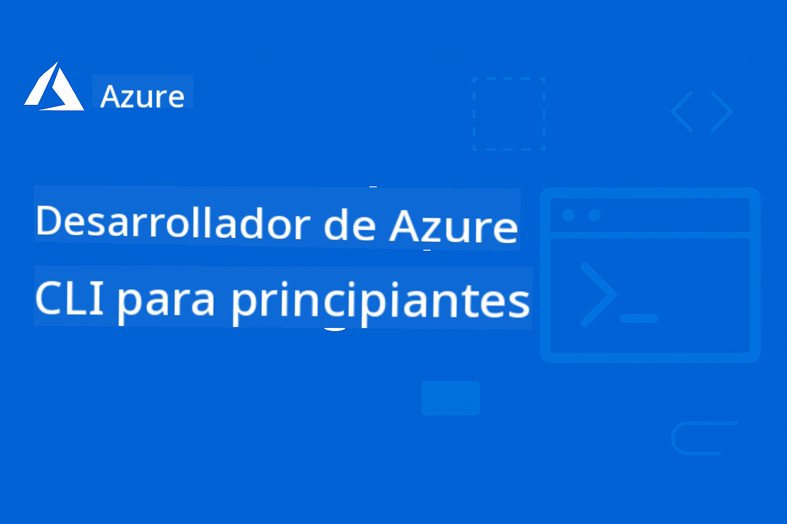

<!--
CO_OP_TRANSLATOR_METADATA:
{
  "original_hash": "068c87cc2641a81ca353ad7064ff326a",
  "translation_date": "2026-01-01T10:08:22+00:00",
  "source_file": "README.md",
  "language_code": "es"
}
-->
# AZD For Beginners: A Structured Learning Journey

 

[](https://GitHub.com/microsoft/azd-for-beginners/watchers/)
[](https://GitHub.com/microsoft/azd-for-beginners/network/)
[](https://GitHub.com/microsoft/azd-for-beginners/stargazers/)

[](https://discord.gg/microsoft-azure)
[](https://discord.gg/nTYy5BXMWG)

## Cómo empezar con este curso

Sigue estos pasos para iniciar tu viaje de aprendizaje con AZD:

1. **Haz fork del repositorio**: Haz clic en [](https://GitHub.com/microsoft/azd-for-beginners/fork)
2. **Clona el repositorio**: `git clone https://github.com/microsoft/azd-for-beginners.git`
3. **Únete a la comunidad**: [Comunidades de Discord de Azure](https://discord.com/invite/ByRwuEEgH4) para soporte experto
4. **Elige tu camino de aprendizaje**: Selecciona un capítulo abajo que coincida con tu nivel de experiencia

### Soporte multilingüe

#### Traducciones automatizadas (siempre actualizadas)

<!-- CO-OP TRANSLATOR LANGUAGES TABLE START -->
[Árabe](../ar/README.md) | [Bengalí](../bn/README.md) | [Búlgaro](../bg/README.md) | [Birmano (Myanmar)](../my/README.md) | [Chino (Simplificado)](../zh/README.md) | [Chino (Tradicional, Hong Kong)](../hk/README.md) | [Chino (Tradicional, Macao)](../mo/README.md) | [Chino (Tradicional, Taiwán)](../tw/README.md) | [Croata](../hr/README.md) | [Checo](../cs/README.md) | [Danés](../da/README.md) | [Neerlandés](../nl/README.md) | [Estonio](../et/README.md) | [Finés](../fi/README.md) | [Francés](../fr/README.md) | [Alemán](../de/README.md) | [Griego](../el/README.md) | [Hebreo](../he/README.md) | [Hindi](../hi/README.md) | [Húngaro](../hu/README.md) | [Indonesio](../id/README.md) | [Italiano](../it/README.md) | [Japonés](../ja/README.md) | [Kannada](../kn/README.md) | [Coreano](../ko/README.md) | [Lituano](../lt/README.md) | [Malayo](../ms/README.md) | [Malayalam](../ml/README.md) | [Marathi](../mr/README.md) | [Nepalí](../ne/README.md) | [Pidgin nigeriano](../pcm/README.md) | [Noruego](../no/README.md) | [Persa (Farsi)](../fa/README.md) | [Polaco](../pl/README.md) | [Portugués (Brasil)](../br/README.md) | [Portugués (Portugal)](../pt/README.md) | [Punjabi (Gurmukhi)](../pa/README.md) | [Rumano](../ro/README.md) | [Ruso](../ru/README.md) | [Serbio (Cirílico)](../sr/README.md) | [Eslovaco](../sk/README.md) | [Esloveno](../sl/README.md) | [Español](./README.md) | [Swahili](../sw/README.md) | [Sueco](../sv/README.md) | [Tagalo (Filipino)](../tl/README.md) | [Tamil](../ta/README.md) | [Telugu](../te/README.md) | [Tailandés](../th/README.md) | [Turco](../tr/README.md) | [Ucraniano](../uk/README.md) | [Urdu](../ur/README.md) | [Vietnamita](../vi/README.md)
<!-- CO-OP TRANSLATOR LANGUAGES TABLE END -->

## Descripción del curso

Domina Azure Developer CLI (azd) a través de capítulos estructurados diseñados para un aprendizaje progresivo. **Enfoque especial en el despliegue de aplicaciones de IA con integración de Microsoft Foundry.**

### Por qué este curso es esencial para desarrolladores modernos

Basado en las perspectivas de la comunidad de Discord de Microsoft Foundry, **el 45% de los desarrolladores quiere usar AZD para cargas de trabajo de IA** pero se enfrentan a desafíos con:
- Arquitecturas complejas de IA con múltiples servicios
- Mejores prácticas para despliegue de IA en producción  
- Integración y configuración de servicios de IA en Azure
- Optimización de costos para cargas de trabajo de IA
- Resolución de problemas específicos de despliegue de IA

### Objetivos de aprendizaje

Al completar este curso estructurado, usted:
- **Dominará los fundamentos de AZD**: Conceptos básicos, instalación y configuración
- **Desplegará aplicaciones de IA**: Usar AZD con los servicios de Microsoft Foundry
- **Implementará Infraestructura como Código**: Gestionar recursos de Azure con plantillas Bicep
- **Solucionará despliegues**: Resolver problemas comunes y depurar incidencias
- **Optimizará para producción**: Seguridad, escalado, monitorización y gestión de costos
- **Construirá soluciones multi-agente**: Desplegar arquitecturas complejas de IA

## 📚 Capítulos de aprendizaje

*Selecciona tu camino de aprendizaje según tu nivel de experiencia y objetivos*

### 🚀 Capítulo 1: Fundamentos y Inicio Rápido
**Requisitos previos**: Suscripción de Azure, conocimientos básicos de línea de comandos  
**Duración**: 30-45 minutos  
**Complejidad**: ⭐

#### Qué aprenderás
- Comprender los fundamentos de Azure Developer CLI
- Instalar AZD en tu plataforma
- Tu primer despliegue exitoso

#### Recursos de aprendizaje
- **🎯 Comienza aquí**: [¿Qué es Azure Developer CLI?](../..)
- **📖 Teoría**: [AZD Basics](docs/getting-started/azd-basics.md) - Conceptos y terminología centrales
- **⚙️ Configuración**: [Installation & Setup](docs/getting-started/installation.md) - Guías específicas por plataforma
- **🛠️ Práctica**: [Your First Project](docs/getting-started/first-project.md) - Tutorial paso a paso
- **📋 Referencia rápida**: [Command Cheat Sheet](resources/cheat-sheet.md)

#### Ejercicios prácticos
```bash
# Comprobación rápida de la instalación
azd version

# Despliega tu primera aplicación
azd init --template todo-nodejs-mongo
azd up
```

**💡 Resultado del capítulo**: Desplegar con éxito una aplicación web simple en Azure usando AZD

**✅ Validación del éxito:**
```bash
# Después de completar el Capítulo 1, deberías poder:
azd version              # Muestra la versión instalada
azd init --template todo-nodejs-mongo  # Inicializa el proyecto
azd up                  # Despliega en Azure
azd show                # Muestra la URL de la aplicación en ejecución
# La aplicación se abre en el navegador y funciona
azd down --force --purge  # Limpia los recursos
```

**📊 Inversión de tiempo:** 30-45 minutos  
**📈 Nivel de habilidad después:** Podrás desplegar aplicaciones básicas de forma independiente

**✅ Validación del éxito:**
```bash
# Después de completar el Capítulo 1, deberías poder:
azd version              # Muestra la versión instalada
azd init --template todo-nodejs-mongo  # Inicializa el proyecto
azd up                  # Despliega en Azure
azd show                # Muestra la URL de la aplicación en ejecución
# La aplicación se abre en el navegador y funciona
azd down --force --purge  # Limpia los recursos
```

**📊 Inversión de tiempo:** 30-45 minutos  
**📈 Nivel de habilidad después:** Podrás desplegar aplicaciones básicas de forma independiente

---

### 🤖 Capítulo 2: Desarrollo centrado en IA (Recomendado para desarrolladores de IA)
**Requisitos previos**: Capítulo 1 completado  
**Duración**: 1-2 horas  
**Complejidad**: ⭐⭐

#### Qué aprenderás
- Integración de Microsoft Foundry con AZD
- Desplegar aplicaciones impulsadas por IA
- Comprender las configuraciones de los servicios de IA

#### Recursos de aprendizaje
- **🎯 Comienza aquí**: [Microsoft Foundry Integration](docs/microsoft-foundry/microsoft-foundry-integration.md)
- **📖 Patrones**: [AI Model Deployment](docs/microsoft-foundry/ai-model-deployment.md) - Desplegar y gestionar modelos de IA
- **🛠️ Taller**: [AI Workshop Lab](docs/microsoft-foundry/ai-workshop-lab.md) - Preparar tus soluciones de IA para AZD
- **🎥 Guía interactiva**: [Workshop Materials](workshop/README.md) - Aprendizaje en el navegador con MkDocs * Entorno DevContainer
- **📋 Plantillas**: [Plantillas destacadas de Microsoft Foundry](../..)
- **📝 Ejemplos**: [AZD Deployment Examples](examples/README.md)

#### Ejercicios prácticos
```bash
# Despliega tu primera aplicación de IA
azd init --template azure-search-openai-demo
azd up

# Prueba plantillas de IA adicionales
azd init --template openai-chat-app-quickstart
azd init --template agent-openai-python-prompty
```

**💡 Resultado del capítulo**: Desplegar y configurar una aplicación de chat impulsada por IA con capacidades RAG

**✅ Validación del éxito:**
```bash
# Después del Capítulo 2, deberías poder:
azd init --template azure-search-openai-demo
azd up
# Probar la interfaz de chat de IA
# Hacer preguntas y obtener respuestas impulsadas por IA con fuentes
# Verificar que la integración de búsqueda funcione
azd monitor  # Comprobar que Application Insights muestre telemetría
azd down --force --purge
```

**📊 Inversión de tiempo:** 1-2 horas  
**📈 Nivel de habilidad después:** Podrás desplegar y configurar aplicaciones de IA listas para producción  
**💰 Conciencia de costos:** Entender costos de desarrollo de $80-150/mes, costos de producción de $300-3500/mes

#### 💰 Consideraciones de costos para despliegues de IA

**Entorno de desarrollo (Estimado $80-150/mes):**
- Azure OpenAI (pago por uso): $0-50/mes (basado en uso de tokens)
- AI Search (nivel básico): $75/mes
- Container Apps (Consumo): $0-20/mes
- Almacenamiento (Estándar): $1-5/mes

**Entorno de producción (Estimado $300-3,500+/mes):**
- Azure OpenAI (PTU para rendimiento consistente): $3,000+/mes O pago por uso con alto volumen
- AI Search (nivel Estándar): $250/mes
- Container Apps (Dedicado): $50-100/mes
- Application Insights: $5-50/mes
- Almacenamiento (Premium): $10-50/mes

**💡 Consejos para optimizar costos:**
- Usa el **nivel gratuito** de Azure OpenAI para aprendizaje (50,000 tokens/mes incluidos)
- Ejecuta `azd down` para desalocar recursos cuando no estés desarrollando activamente
- Comienza con facturación por consumo, actualiza a PTU solo para producción
- Usa `azd provision --preview` para estimar costos antes del despliegue
- Habilita el autoescalado: paga solo por el uso real

**Monitoreo de costos:**
```bash
# Comprobar los costes mensuales estimados
azd provision --preview

# Supervisar los costes reales en el Portal de Azure
az consumption budget list --resource-group <your-rg>
```

---

### ⚙️ Capítulo 3: Configuración y Autenticación
**Requisitos previos**: Capítulo 1 completado  
**Duración**: 45-60 minutos  
**Complejidad**: ⭐⭐

#### Qué aprenderás
- Configuración y gestión de entornos
- Mejoras prácticas de autenticación y seguridad
- Nombres y organización de recursos

#### Recursos de aprendizaje
- **📖 Configuración**: [Configuration Guide](docs/getting-started/configuration.md) - Configuración de entornos
- **🔐 Seguridad**: [Authentication patterns and managed identity](docs/getting-started/authsecurity.md) - Patrones de autenticación
- **📝 Ejemplos**: [Database App Example](examples/database-app/README.md) - Ejemplos de base de datos con AZD

#### Ejercicios prácticos
- Configurar múltiples entornos (dev, staging, prod)
- Configurar autenticación con identidad administrada
- Implementar configuraciones específicas por entorno

**💡 Resultado del capítulo**: Gestionar múltiples entornos con autenticación y seguridad adecuadas

---

### 🏗️ Capítulo 4: Infraestructura como Código y Despliegue
**Requisitos previos**: Capítulos 1-3 completados  
**Duración**: 1-1.5 horas  
**Complejidad**: ⭐⭐⭐

#### Qué aprenderás
- Patrones avanzados de despliegue
- Infraestructura como Código con Bicep
- Estrategias de aprovisionamiento de recursos

#### Recursos de aprendizaje
- **📖 Despliegue**: [Deployment Guide](docs/deployment/deployment-guide.md) - Flujos de trabajo completos
- **🏗️ Aprovisionamiento**: [Provisioning Resources](docs/deployment/provisioning.md) - Gestión de recursos de Azure
- **📝 Ejemplos**: [Container App Example](../../examples/container-app) - Despliegues con contenedores

#### Ejercicios prácticos
- Crear plantillas Bicep personalizadas
- Desplegar aplicaciones multi-servicio
- Implementar estrategias de despliegue blue-green

**💡 Resultado del capítulo**: Desplegar aplicaciones complejas multi-servicio usando plantillas de infraestructura personalizadas

---

### 🎯 Capítulo 5: Soluciones de IA Multi-Agente (Avanzado)
**Requisitos previos**: Capítulos 1-2 completados  
**Duración**: 2-3 horas  
**Complejidad**: ⭐⭐⭐⭐

#### Qué aprenderás
- Patrones de arquitectura multi-agente
- Orquestación y coordinación de agentes
- Despliegues de IA listos para producción

#### Recursos de aprendizaje
- **🤖 Proyecto destacado**: [Retail Multi-Agent Solution](examples/retail-scenario.md) - Implementación completa
- **🛠️ ARM Templates**: [Paquete de plantilla ARM](../../examples/retail-multiagent-arm-template) - Implementación con un clic
- **📖 Arquitectura**: [Patrones de coordinación multiagente](/docs/pre-deployment/coordination-patterns.md) - Patrones

#### Ejercicios prácticos
```bash
# Desplegar la solución minorista multiagente completa
cd examples/retail-multiagent-arm-template
./deploy.sh

# Explorar configuraciones de agentes
az deployment group show --resource-group <rg-name> --name <deployment-name>
```

**💡 Resultado del capítulo**: Implementar y gestionar una solución de IA multiagente lista para producción con agentes de Cliente e Inventario

---

### 🔍 Capítulo 6: Validación y planificación previas al despliegue
**Requisitos previos**: Capítulo 4 completado  
**Duración**: 1 hora  
**Complejidad**: ⭐⭐

#### Qué aprenderás
- Planificación de capacidad y validación de recursos
- Estrategias de selección de SKU
- Comprobaciones previas al despliegue y automatización

#### Recursos de aprendizaje
- **📊 Planificación**: [Capacity Planning](docs/pre-deployment/capacity-planning.md) - Validación de recursos
- **💰 Selección**: [SKU Selection](docs/pre-deployment/sku-selection.md) - Elecciones rentables
- **✅ Validación**: [Pre-flight Checks](docs/pre-deployment/preflight-checks.md) - Scripts automatizados

#### Ejercicios prácticos
- Ejecutar scripts de validación de capacidad
- Optimizar la selección de SKU para reducir costos
- Implementar comprobaciones automatizadas previas al despliegue

**💡 Resultado del capítulo**: Validar y optimizar los despliegues antes de su ejecución

---

### 🚨 Capítulo 7: Solución de problemas y depuración
**Requisitos previos**: Cualquier capítulo de despliegue completado  
**Duración**: 1-1.5 horas  
**Complejidad**: ⭐⭐

#### Qué aprenderás
- Enfoques sistemáticos para la depuración
- Problemas comunes y soluciones
- Solución de problemas específica para IA

#### Recursos de aprendizaje
- **🔧 Problemas comunes**: [Common Issues](docs/troubleshooting/common-issues.md) - Preguntas frecuentes y soluciones
- **🕵️ Depuración**: [Debugging Guide](docs/troubleshooting/debugging.md) - Estrategias paso a paso
- **🤖 Problemas de IA**: [AI-Specific Troubleshooting](docs/troubleshooting/ai-troubleshooting.md) - Problemas con servicios de IA

#### Ejercicios prácticos
- Diagnosticar fallos de despliegue
- Resolver problemas de autenticación
- Depurar la conectividad con servicios de IA

**💡 Resultado del capítulo**: Diagnosticar y resolver de forma independiente problemas comunes de despliegue

---

### 🏢 Capítulo 8: Patrones de producción y empresariales
**Requisitos previos**: Capítulos 1-4 completados  
**Duración**: 2-3 horas  
**Complejidad**: ⭐⭐⭐⭐

#### Qué aprenderás
- Estrategias de despliegue en producción
- Patrones de seguridad empresariales
- Monitorización y optimización de costos

#### Recursos de aprendizaje
- **🏭 Producción**: [Production AI Best Practices](docs/microsoft-foundry/production-ai-practices.md) - Patrones empresariales
- **📝 Ejemplos**: [Microservices Example](../../examples/microservices) - Arquitecturas complejas
- **📊 Monitorización**: [Application Insights integration](docs/pre-deployment/application-insights.md) - Monitorización

#### Ejercicios prácticos
- Implementar patrones de seguridad empresariales
- Configurar monitorización integral
- Desplegar en producción con la gobernanza adecuada

**💡 Resultado del capítulo**: Desplegar aplicaciones listas para la empresa con capacidades completas de producción

---

## 🎓 Resumen del taller: Experiencia de aprendizaje práctico

> **⚠️ ESTADO DEL TALLER: Desarrollo activo**  
> Los materiales del taller se están desarrollando y refinando actualmente. Los módulos centrales son funcionales, pero algunas secciones avanzadas están incompletas. Estamos trabajando activamente para completar todo el contenido. [Seguir el progreso →](workshop/README.md)

### Materiales interactivos del taller
**Aprendizaje práctico y completo con herramientas basadas en navegador y ejercicios guiados**

Nuestros materiales del taller ofrecen una experiencia de aprendizaje estructurada e interactiva que complementa el plan de estudios por capítulos arriba mencionado. El taller está diseñado tanto para aprendizaje autodidacta como para sesiones dirigidas por instructores.

#### 🛠️ Características del taller
- **Interfaz basada en navegador**: Taller completo potenciado por MkDocs con búsqueda, copiar y funciones de tema
- **Integración con GitHub Codespaces**: Configuración del entorno de desarrollo con un clic
- **Ruta de aprendizaje estructurada**: Ejercicios guiados en 7 pasos (3.5 horas en total)
- **Descubrimiento → Despliegue → Personalización**: Metodología progresiva
- **Entorno DevContainer interactivo**: Herramientas y dependencias preconfiguradas

#### 📚 Estructura del taller
El taller sigue una metodología de **Descubrimiento → Despliegue → Personalización**:

1. **Fase de descubrimiento** (45 mins)
   - Explorar plantillas y servicios de Microsoft Foundry
   - Entender patrones de arquitectura multiagente
   - Revisar requisitos de despliegue y prerrequisitos

2. **Fase de despliegue** (2 horas)
   - Despliegue práctico de aplicaciones de IA con AZD
   - Configurar servicios y endpoints de Azure AI
   - Implementar patrones de seguridad y autenticación

3. **Fase de personalización** (45 mins)
   - Modificar aplicaciones para casos de uso específicos
   - Optimizar para despliegue en producción
   - Implementar monitorización y gestión de costos

#### 🚀 Cómo empezar con el taller
```bash
# Opción 1: GitHub Codespaces (recomendado)
# Haz clic en "Code" → "Create codespace on main" en el repositorio

# Opción 2: Desarrollo local
git clone https://github.com/microsoft/azd-for-beginners.git
cd azd-for-beginners/workshop
# Sigue las instrucciones de configuración en workshop/README.md
```

#### 🎯 Resultados de aprendizaje del taller
Al completar el taller, los participantes:
- **Desplegarán aplicaciones de IA en producción**: Usar AZD con los servicios de Microsoft Foundry
- **Dominarán arquitecturas multiagente**: Implementar soluciones coordinadas de agentes de IA
- **Implementarán mejores prácticas de seguridad**: Configurar autenticación y control de acceso
- **Optimizarán para la escala**: Diseñar despliegues rentables y con buen rendimiento
- **Resolverán problemas de despliegue**: Solucionar problemas comunes de forma independiente

#### 📖 Recursos del taller
- **🎥 Guía interactiva**: [Workshop Materials](workshop/README.md) - Entorno de aprendizaje basado en navegador
- **📋 Instrucciones paso a paso**: [Guided Exercises](../../workshop/docs/instructions) - Recorridos detallados
- **🛠️ Laboratorio del taller de IA**: [AI Workshop Lab](docs/microsoft-foundry/ai-workshop-lab.md) - Ejercicios centrados en IA
- **💡 Inicio rápido**: [Workshop Setup Guide](workshop/README.md#quick-start) - Configuración del entorno

**Perfecto para**: Formación corporativa, cursos universitarios, aprendizaje autodidacta y bootcamps para desarrolladores.

---

## 📖 ¿Qué es Azure Developer CLI?

Azure Developer CLI (azd) es una interfaz de línea de comandos centrada en el desarrollador que acelera el proceso de creación y despliegue de aplicaciones en Azure. Proporciona:

- **Despliegues basados en plantillas** - Utiliza plantillas preconstruidas para patrones de aplicaciones comunes
- **Infraestructura como código** - Gestiona recursos de Azure usando Bicep o Terraform  
- **Flujos de trabajo integrados** - Provisiona, despliega y monitoriza aplicaciones de forma fluida
- **Fácil para desarrolladores** - Optimizado para la productividad y la experiencia del desarrollador

### **AZD + Microsoft Foundry: Perfecto para implementaciones de IA**

**¿Por qué AZD para soluciones de IA?** AZD aborda los principales desafíos que enfrentan los desarrolladores de IA:

- **Plantillas preparadas para IA** - Plantillas preconfiguradas para Azure OpenAI, Cognitive Services y cargas de trabajo de ML
- **Despliegues de IA seguros** - Patrones de seguridad integrados para servicios de IA, claves de API y endpoints de modelos  
- **Patrones de IA para producción** - Mejores prácticas para despliegues de aplicaciones de IA escalables y rentables
- **Flujos de trabajo de IA de extremo a extremo** - Desde el desarrollo del modelo hasta el despliegue en producción con la monitorización adecuada
- **Optimización de costes** - Asignación inteligente de recursos y estrategias de escalado para cargas de trabajo de IA
- **Integración con Microsoft Foundry** - Conexión fluida al catálogo de modelos y endpoints de Microsoft Foundry

---

## 🎯 Biblioteca de plantillas y ejemplos

### Destacados: Plantillas de Microsoft Foundry
**¡Empieza aquí si vas a desplegar aplicaciones de IA!**

> **Nota:** Estas plantillas muestran varios patrones de IA. Algunas son Azure Samples externas, otras son implementaciones locales.

| Template | Chapter | Complexity | Services | Type |
|----------|---------|------------|----------|------|
| [**Get started with AI chat**](https://github.com/Azure-Samples/get-started-with-ai-chat) | Capítulo 2 | ⭐⭐ | AzureOpenAI + Azure AI Model Inference API + Azure AI Search + Azure Container Apps + Application Insights | Externo |
| [**Get started with AI agents**](https://github.com/Azure-Samples/get-started-with-ai-agents) | Capítulo 2 | ⭐⭐ | Azure AI Agent Service + AzureOpenAI + Azure AI Search + Azure Container Apps + Application Insights| Externo |
| [**Azure Search + OpenAI Demo**](https://github.com/Azure-Samples/azure-search-openai-demo) | Capítulo 2 | ⭐⭐ | AzureOpenAI + Azure AI Search + App Service + Storage | Externo |
| [**OpenAI Chat App Quickstart**](https://github.com/Azure-Samples/openai-chat-app-quickstart) | Capítulo 2 | ⭐ | AzureOpenAI + Container Apps + Application Insights | Externo |
| [**Agent OpenAI Python Prompty**](https://github.com/Azure-Samples/agent-openai-python-prompty) | Capítulo 5 | ⭐⭐⭐ | AzureOpenAI + Azure Functions + Prompty | Externo |
| [**Contoso Chat RAG**](https://github.com/Azure-Samples/contoso-chat) | Capítulo 8 | ⭐⭐⭐⭐ | AzureOpenAI + AI Search + Cosmos DB + Container Apps | Externo |
| [**Retail Multi-Agent Solution**](examples/retail-scenario.md) | Capítulo 5 | ⭐⭐⭐⭐ | AzureOpenAI + AI Search + Storage + Container Apps + Cosmos DB | **Local** |

### Destacados: Escenarios de aprendizaje completos
**Plantillas de aplicaciones listas para producción mapeadas a capítulos de aprendizaje**

| Template | Learning Chapter | Complexity | Key Learning |
|----------|------------------|------------|--------------|
| [**openai-chat-app-quickstart**](https://github.com/Azure-Samples/openai-chat-app-quickstart) | Capítulo 2 | ⭐ | Patrones básicos de despliegue de IA |
| [**azure-search-openai-demo**](https://github.com/Azure-Samples/azure-search-openai-demo) | Capítulo 2 | ⭐⭐ | Implementación RAG con Azure AI Search |
| [**ai-document-processing**](https://github.com/Azure-Samples/ai-document-processing) | Capítulo 4 | ⭐⭐ | Integración de Document Intelligence |
| [**agent-openai-python-prompty**](https://github.com/Azure-Samples/agent-openai-python-prompty) | Capítulo 5 | ⭐⭐⭐ | Framework de agentes y llamadas a funciones |
| [**contoso-chat**](https://github.com/Azure-Samples/contoso-chat) | Capítulo 8 | ⭐⭐⭐ | Orquestación de IA empresarial |
| [**retail-multi-agent-solution**](examples/retail-scenario.md) | Capítulo 5 | ⭐⭐⭐⭐ | Arquitectura multiagente con agentes de Cliente e Inventario |

### Aprendizaje por tipo de ejemplo

> **📌 Ejemplos locales vs. externos:**  
> **Ejemplos locales** (en este repositorio) = Listos para usar inmediatamente  
> **Ejemplos externos** (Azure Samples) = Clonar desde los repositorios enlazados

#### Ejemplos locales (Listos para usar)
- [**Retail Multi-Agent Solution**](examples/retail-scenario.md) - Implementación completa lista para producción con plantillas ARM
  - Arquitectura multiagente (agentes de Cliente + Inventario)
  - Monitorización y evaluación completas
  - Implementación con un clic mediante plantilla ARM

#### Ejemplos locales - Aplicaciones en contenedor (Capítulos 2-5)
**Ejemplos completos de despliegue con contenedores en este repositorio:**
- [**Container App Examples**](examples/container-app/README.md) - Guía completa para despliegues con contenedores
  - [Simple Flask API](../../examples/container-app/simple-flask-api) - API REST básica con scale-to-zero
  - [Microservices Architecture](../../examples/container-app/microservices) - Despliegue multi-servicio listo para producción
  - Inicio rápido, patrones de despliegue para producción y avanzados
  - Orientación sobre monitorización, seguridad y optimización de costos

#### Ejemplos externos - Aplicaciones simples (Capítulos 1-2)
**Clona estos repositorios de Azure Samples para comenzar:**
- [Simple Web App - Node.js + MongoDB](https://github.com/Azure-Samples/todo-nodejs-mongo) - Patrones básicos de despliegue
- [Static Website - React SPA](https://github.com/Azure-Samples/todo-csharp-sql-swa-func) - Despliegue de contenido estático
- [Container App - Python Flask](https://github.com/Azure-Samples/container-apps-store-api-microservice) - Despliegue de API REST

#### Ejemplos externos - Integración de bases de datos (Capítulos 3-4)  
- [Database App - C# + SQL](https://github.com/Azure-Samples/todo-csharp-sql) - Patrones de conectividad a bases de datos
- [Functions + Cosmos DB](https://github.com/Azure-Samples/todo-python-mongo-swa-func) - Flujo de trabajo de datos serverless

#### Ejemplos externos - Patrones avanzados (Capítulos 4-8)
- [Java Microservices](https://github.com/Azure-Samples/java-microservices-aca-lab) - Arquitecturas multi-servicio
- [Container Apps Jobs](https://github.com/Azure-Samples/container-apps-jobs) - Procesamiento en segundo plano  
- [Enterprise ML Pipeline](https://github.com/Azure-Samples/mlops-v2) - Patrones ML listos para producción

### Colecciones de plantillas externas
- [**Official AZD Template Gallery**](https://azure.github.io/awesome-azd/) - Colección seleccionada de plantillas oficiales y comunitarias
- [**Azure Developer CLI Templates**](https://learn.microsoft.com/en-us/azure/developer/azure-developer-cli/azd-templates) - Documentación de plantillas de Microsoft Learn
- [**Examples Directory**](examples/README.md) - Ejemplos de aprendizaje locales con explicaciones detalladas

---

## 📚 Recursos y referencias de aprendizaje

### Referencias rápidas
- [**Hoja de Comandos**](resources/cheat-sheet.md) - Comandos esenciales de azd organizados por capítulo
- [**Glosario**](resources/glossary.md) - Terminología de Azure y azd  
- [**Preguntas frecuentes**](resources/faq.md) - Preguntas comunes organizadas por capítulo de aprendizaje
- [**Guía de estudio**](resources/study-guide.md) - Ejercicios prácticos completos

### Talleres prácticos
- [**AI Workshop Lab**](docs/microsoft-foundry/ai-workshop-lab.md) - Haz que tus soluciones de IA sean desplegables con AZD (2-3 hours)
- [**Interactive Workshop Guide**](workshop/README.md) - Taller basado en navegador con MkDocs y entorno DevContainer
- [**Structured Learning Path**](../../workshop/docs/instructions) -Ejercicios guiados de 7 pasos (Discovery → Deployment → Customization)
- [**AZD For Beginners Workshop**](workshop/README.md) - Materiales completos del taller práctico con integración de GitHub Codespaces

### Recursos de aprendizaje externos
- [Documentación de Azure Developer CLI](https://learn.microsoft.com/en-us/azure/developer/azure-developer-cli/)
- [Centro de Arquitectura de Azure](https://learn.microsoft.com/en-us/azure/architecture/)
- [Calculadora de precios de Azure](https://azure.microsoft.com/pricing/calculator/)
- [Estado de Azure](https://status.azure.com/)

---

## 🔧 Guía rápida de solución de problemas

**Problemas comunes que enfrentan los principiantes y soluciones inmediatas:**

### ❌ "azd: command not found"

```bash
# Instale AZD primero
# Windows (PowerShell):
winget install microsoft.azd

# macOS:
brew tap azure/azd && brew install azd

# Linux:
curl -fsSL https://aka.ms/install-azd.sh | bash

# Verifique la instalación
azd version
```

### ❌ "No subscription found" or "Subscription not set"

```bash
# Listar suscripciones disponibles
az account list --output table

# Establecer suscripción predeterminada
az account set --subscription "<subscription-id-or-name>"

# Configurar para el entorno AZD
azd env set AZURE_SUBSCRIPTION_ID "<subscription-id>"

# Verificar
az account show
```

### ❌ "InsufficientQuota" or "Quota exceeded"

```bash
# Prueba con otra región de Azure
azd env set AZURE_LOCATION "westus2"
azd up

# O utiliza SKUs más pequeños en desarrollo
# Edita infra/main.parameters.json:
{
  "sku": "B1"  // Instead of "P1V2"
}
```

### ❌ "azd up" fails halfway through

```bash
# Opción 1: Limpiar y reintentar
azd down --force --purge
azd up

# Opción 2: Solo arreglar la infraestructura
azd provision

# Opción 3: Revisar los registros detallados
azd show
azd logs
```

### ❌ "Authentication failed" or "Token expired"

```bash
# Reautenticar
az logout
az login

azd auth logout
azd auth login

# Verificar la autenticación
az account show
```

### ❌ "Resource already exists" or naming conflicts

```bash
# AZD genera nombres únicos, pero si hay un conflicto:
azd down --force --purge

# Entonces reintente con un entorno nuevo
azd env new dev-v2
azd up
```

### ❌ Template deployment taking too long

**Tiempos de espera normales:**
- Aplicación web simple: 5-10 minutos
- Aplicación con base de datos: 10-15 minutos
- Aplicaciones de IA: 15-25 minutos (el aprovisionamiento de OpenAI es lento)

```bash
# Comprobar el progreso
azd show

# Si queda atascado más de 30 minutos, consulte el Portal de Azure:
azd monitor
# Busque implementaciones fallidas
```

### ❌ "Permission denied" or "Forbidden"

```bash
# Compruebe su rol de Azure
az role assignment list --assignee $(az account show --query user.name -o tsv)

# Necesita al menos el rol "Contributor"
# Pida a su administrador de Azure que conceda:
# - Contributor (para recursos)
# - User Access Administrator (para asignaciones de roles)
```

### ❌ Can't find deployed application URL

```bash
# Mostrar todos los puntos de conexión del servicio
azd show

# O abrir el Portal de Azure
azd monitor

# Comprobar un servicio específico
azd env get-values
# Buscar variables *_URL
```

### 📚 Recursos completos de solución de problemas

- **Guía de problemas comunes:** [Soluciones detalladas](docs/troubleshooting/common-issues.md)
- **Problemas específicos de IA:** [Solución de problemas de IA](docs/troubleshooting/ai-troubleshooting.md)
- **Guía de depuración:** [Depuración paso a paso](docs/troubleshooting/debugging.md)
- **Obtén ayuda:** [Azure Discord](https://discord.gg/microsoft-azure) #azure-developer-cli

---

## 🔧 Guía rápida de solución de problemas

**Problemas comunes que enfrentan los principiantes y soluciones inmediatas:**

<details>
<summary><strong>❌ "azd: command not found"</strong></summary>

```bash
# Instale AZD primero
# Windows (PowerShell):
winget install microsoft.azd

# macOS:
brew tap azure/azd && brew install azd

# Linux:
curl -fsSL https://aka.ms/install-azd.sh | bash

# Verifique la instalación
azd version
```
</details>

<details>
<summary><strong>❌ "No subscription found" or "Subscription not set"</strong></summary>

```bash
# Listar suscripciones disponibles
az account list --output table

# Establecer suscripción predeterminada
az account set --subscription "<subscription-id-or-name>"

# Establecer para el entorno AZD
azd env set AZURE_SUBSCRIPTION_ID "<subscription-id>"

# Verificar
az account show
```
</details>

<details>
<summary><strong>❌ "InsufficientQuota" or "Quota exceeded"</strong></summary>

```bash
# Pruebe otra región de Azure
azd env set AZURE_LOCATION "westus2"
azd up

# O use SKUs más pequeñas en desarrollo
# Edite infra/main.parameters.json:
{
  "sku": "B1"  // Instead of "P1V2"
}
```
</details>

<details>
<summary><strong>❌ "azd up" fails halfway through</strong></summary>

```bash
# Opción 1: Limpiar y reintentar
azd down --force --purge
azd up

# Opción 2: Solo arreglar la infraestructura
azd provision

# Opción 3: Revisar registros detallados
azd show
azd logs
```
</details>

<details>
<summary><strong>❌ "Authentication failed" or "Token expired"</strong></summary>

```bash
# Reautenticar
az logout
az login

azd auth logout
azd auth login

# Verificar la autenticación
az account show
```
</details>

<details>
<summary><strong>❌ "Resource already exists" or naming conflicts</strong></summary>

```bash
# AZD genera nombres únicos, pero si hay conflicto:
azd down --force --purge

# Entonces vuelva a intentarlo con un entorno nuevo
azd env new dev-v2
azd up
```
</details>

<details>
<summary><strong>❌ La implementación de plantillas está tardando demasiado</strong></summary>

**Tiempos de espera normales:**
- Aplicación web simple: 5-10 minutos
- Aplicación con base de datos: 10-15 minutos
- Aplicaciones de IA: 15-25 minutos (el aprovisionamiento de OpenAI es lento)

```bash
# Comprobar el progreso
azd show

# Si se queda atascado más de 30 minutos, compruebe el Portal de Azure:
azd monitor
# Busque implementaciones fallidas
```
</details>

<details>
<summary><strong>❌ "Permission denied" or "Forbidden"</strong></summary>

```bash
# Comprueba tu rol de Azure
az role assignment list --assignee $(az account show --query user.name -o tsv)

# Necesitas al menos el rol "Contributor"
# Pide a tu administrador de Azure que otorgue:
# - Contributor (para recursos)
# - User Access Administrator (para asignaciones de roles)
```
</details>

<details>
<summary><strong>❌ Can't find deployed application URL</strong></summary>

```bash
# Mostrar todos los endpoints de servicio
azd show

# O abrir el Portal de Azure
azd monitor

# Comprobar servicio específico
azd env get-values
# Buscar variables *_URL
```
</details>

### 📚 Recursos completos de solución de problemas

- **Guía de problemas comunes:** [Soluciones detalladas](docs/troubleshooting/common-issues.md)
- **Problemas específicos de IA:** [Solución de problemas de IA](docs/troubleshooting/ai-troubleshooting.md)
- **Guía de depuración:** [Depuración paso a paso](docs/troubleshooting/debugging.md)
- **Obtén ayuda:** [Azure Discord](https://discord.gg/microsoft-azure) #azure-developer-cli

---

## 🎓 Finalización del curso y certificación

### Seguimiento del progreso
Realiza un seguimiento de tu progreso de aprendizaje en cada capítulo:

- [ ] **Capítulo 1**: Fundamentos y inicio rápido ✅
- [ ] **Capítulo 2**: Desarrollo centrado en IA ✅  
- [ ] **Capítulo 3**: Configuración y autenticación ✅
- [ ] **Capítulo 4**: Infraestructura como Código y despliegue ✅
- [ ] **Capítulo 5**: Soluciones de IA multiagente ✅
- [ ] **Capítulo 6**: Validación y planificación previas al despliegue ✅
- [ ] **Capítulo 7**: Solución de problemas y depuración ✅
- [ ] **Capítulo 8**: Patrones de producción y empresariales ✅

### Verificación del aprendizaje
Después de completar cada capítulo, verifica tus conocimientos mediante:
1. **Ejercicio práctico**: Completa el despliegue práctico del capítulo
2. **Verificación de conocimientos**: Revisa la sección de Preguntas frecuentes de tu capítulo
3. **Discusión comunitaria**: Comparte tu experiencia en Azure Discord
4. **Siguiente capítulo**: Pasa al siguiente nivel de complejidad

### Beneficios al completar el curso
Al completar todos los capítulos, habrás:
- **Experiencia en producción**: Desplegado aplicaciones de IA reales en Azure
- **Habilidades profesionales**: Capacidades de despliegue listas para empresas  
- **Reconocimiento comunitario**: Miembro activo de la comunidad de desarrolladores de Azure
- **Avance profesional**: Experiencia en demanda en AZD y despliegue de IA

---

## 🤝 Comunidad y soporte

### Obtener ayuda y soporte
- **Problemas técnicos**: [Reportar errores y solicitar funciones](https://github.com/microsoft/azd-for-beginners/issues)
- **Preguntas de aprendizaje**: [Comunidad de Microsoft Azure en Discord](https://discord.gg/microsoft-azure) y [](https://discord.gg/nTYy5BXMWG)
- **Ayuda específica de IA**: Únete a [](https://discord.gg/nTYy5BXMWG)
- **Documentación**: [Documentación oficial de Azure Developer CLI](https://learn.microsoft.com/en-us/azure/developer/azure-developer-cli/)

### Perspectivas de la comunidad en Microsoft Foundry Discord

**Resultados recientes de la encuesta del canal #Azure:**
- **45%** de desarrolladores quieren usar AZD para cargas de trabajo de IA
- **Principales desafíos**: Implementaciones multi-servicio, gestión de credenciales, preparación para producción  
- **Más solicitados**: Plantillas específicas para IA, guías de solución de problemas, mejores prácticas

**Únete a nuestra comunidad para:**
- Compartir tus experiencias con AZD + IA y obtener ayuda
- Acceder a vistas previas tempranas de nuevas plantillas de IA
- Contribuir a las mejores prácticas de despliegue de IA
- Influir en el desarrollo futuro de funciones de IA + AZD

### Contribuir al curso
¡Damos la bienvenida a las contribuciones! Por favor lee nuestra [Guía de contribución](CONTRIBUTING.md) para más detalles sobre:
- **Mejoras de contenido**: Mejorar capítulos y ejemplos existentes
- **Nuevos ejemplos**: Agregar escenarios y plantillas del mundo real  
- **Traducción**: Ayudar a mantener el soporte multilingüe
- **Reportes de errores**: Mejorar la precisión y claridad
- **Estándares de la comunidad**: Seguir nuestras directrices comunitarias inclusivas

---

## 📄 Información del curso

### Licencia
Este proyecto está licenciado bajo la Licencia MIT - consulta el archivo [LICENSE](../../LICENSE) para más detalles.

### Recursos de aprendizaje relacionados de Microsoft

Nuestro equipo produce otros cursos de aprendizaje completos:

<!-- CO-OP TRANSLATOR OTHER COURSES START -->
### LangChain
[](https://aka.ms/langchain4j-for-beginners)
[](https://aka.ms/langchainjs-for-beginners?WT.mc_id=m365-94501-dwahlin)

---

### Azure / Edge / MCP / Agents
[](https://github.com/microsoft/AZD-for-beginners?WT.mc_id=academic-105485-koreyst)
[](https://github.com/microsoft/edgeai-for-beginners?WT.mc_id=academic-105485-koreyst)
[](https://github.com/microsoft/mcp-for-beginners?WT.mc_id=academic-105485-koreyst)
[](https://github.com/microsoft/ai-agents-for-beginners?WT.mc_id=academic-105485-koreyst)

---
 
### Generative AI Series
[](https://github.com/microsoft/generative-ai-for-beginners?WT.mc_id=academic-105485-koreyst)
[-9333EA?style=for-the-badge&labelColor=E5E7EB&color=9333EA)](https://github.com/microsoft/Generative-AI-for-beginners-dotnet?WT.mc_id=academic-105485-koreyst)
[-C084FC?style=for-the-badge&labelColor=E5E7EB&color=C084FC)](https://github.com/microsoft/generative-ai-for-beginners-java?WT.mc_id=academic-105485-koreyst)
[-E879F9?style=for-the-badge&labelColor=E5E7EB&color=E879F9)](https://github.com/microsoft/generative-ai-with-javascript?WT.mc_id=academic-105485-koreyst)

---
 
### Aprendizaje esencial
[](https://aka.ms/ml-beginners?WT.mc_id=academic-105485-koreyst)
[](https://aka.ms/datascience-beginners?WT.mc_id=academic-105485-koreyst)
[](https://aka.ms/ai-beginners?WT.mc_id=academic-105485-koreyst)
[](https://github.com/microsoft/Security-101?WT.mc_id=academic-96948-sayoung)
[](https://aka.ms/webdev-beginners?WT.mc_id=academic-105485-koreyst)
[](https://aka.ms/iot-beginners?WT.mc_id=academic-105485-koreyst)
[](https://github.com/microsoft/xr-development-for-beginners?WT.mc_id=academic-105485-koreyst)

---
 
### Serie Copilot
[](https://aka.ms/GitHubCopilotAI?WT.mc_id=academic-105485-koreyst)
[](https://github.com/microsoft/mastering-github-copilot-for-dotnet-csharp-developers?WT.mc_id=academic-105485-koreyst)
[](https://github.com/microsoft/CopilotAdventures?WT.mc_id=academic-105485-koreyst)
<!-- CO-OP TRANSLATOR OTHER COURSES END -->

---

## 🗺️ Navegación del curso

**🚀 ¿Listo para comenzar a aprender?**

**Principiantes**: Comienza con [Capítulo 1: Fundamentos y Inicio Rápido](../..)  
**Desarrolladores de IA**: Ir a [Capítulo 2: Desarrollo enfocado en IA](../..)  
**Desarrolladores Experimentados**: Comience con [Capítulo 3: Configuración y Autenticación](../..)

**Siguientes pasos**: [Comenzar Capítulo 1 - Conceptos básicos de AZD](docs/getting-started/azd-basics.md) →

---

<!-- CO-OP TRANSLATOR DISCLAIMER START -->
Descargo de responsabilidad:
Este documento ha sido traducido mediante el servicio de traducción por IA [Co-op Translator](https://github.com/Azure/co-op-translator). Aunque nos esforzamos por la exactitud, tenga en cuenta que las traducciones automáticas pueden contener errores o imprecisiones. El documento original en su idioma nativo debe considerarse la fuente autorizada. Para información crítica, se recomienda una traducción profesional realizada por un traductor humano. No nos hacemos responsables de malentendidos o interpretaciones erróneas que puedan surgir del uso de esta traducción.
<!-- CO-OP TRANSLATOR DISCLAIMER END -->