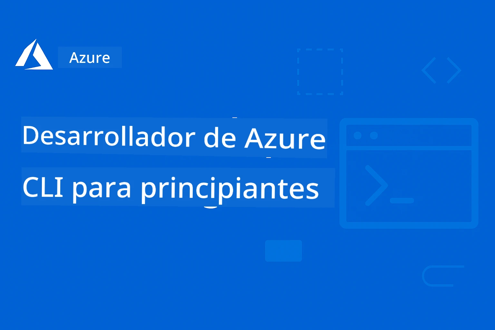

# AZD Para Principiantes: Un Viaje de Aprendizaje Estructurado

 

[](https://GitHub.com/microsoft/azd-for-beginners/watchers/)
[](https://GitHub.com/microsoft/azd-for-beginners/network/)
[](https://GitHub.com/microsoft/azd-for-beginners/stargazers/)

[](https://discord.gg/microsoft-azure)
[](https://discord.gg/nTYy5BXMWG)

---

### Traducciones Automáticas (Siempre Actualizadas)

<!-- CO-OP TRANSLATOR LANGUAGES TABLE START -->
[Árabe](../ar/README.md) | [Bengalí](../bn/README.md) | [Búlgaro](../bg/README.md) | [Birmano (Myanmar)](../my/README.md) | [Chino (Simplificado)](../zh-CN/README.md) | [Chino (Tradicional, Hong Kong)](../zh-HK/README.md) | [Chino (Tradicional, Macao)](../zh-MO/README.md) | [Chino (Tradicional, Taiwán)](../zh-TW/README.md) | [Croata](../hr/README.md) | [Checo](../cs/README.md) | [Danés](../da/README.md) | [Neerlandés](../nl/README.md) | [Estonio](../et/README.md) | [Finlandés](../fi/README.md) | [Francés](../fr/README.md) | [Alemán](../de/README.md) | [Griego](../el/README.md) | [Hebreo](../he/README.md) | [Hindi](../hi/README.md) | [Húngaro](../hu/README.md) | [Indonesio](../id/README.md) | [Italiano](../it/README.md) | [Japonés](../ja/README.md) | [Kannada](../kn/README.md) | [Coreano](../ko/README.md) | [Lituano](../lt/README.md) | [Malayo](../ms/README.md) | [Malayalam](../ml/README.md) | [Maratí](../mr/README.md) | [Nepalí](../ne/README.md) | [Pidgin Nigeriano](../pcm/README.md) | [Noruego](../no/README.md) | [Persa (Farsi)](../fa/README.md) | [Polaco](../pl/README.md) | [Portugués (Brasil)](../pt-BR/README.md) | [Portugués (Portugal)](../pt-PT/README.md) | [Punjabi (Gurmukhi)](../pa/README.md) | [Rumano](../ro/README.md) | [Ruso](../ru/README.md) | [Serbio (Cirílico)](../sr/README.md) | [Eslovaco](../sk/README.md) | [Esloveno](../sl/README.md) | [Español](./README.md) | [Swahili](../sw/README.md) | [Sueco](../sv/README.md) | [Tagalo (Filipino)](../tl/README.md) | [Tamil](../ta/README.md) | [Telugu](../te/README.md) | [Tailandés](../th/README.md) | [Turco](../tr/README.md) | [Ucraniano](../uk/README.md) | [Urdu](../ur/README.md) | [Vietnamita](../vi/README.md)

> **¿Prefieres clonar localmente?**

> Este repositorio incluye más de 50 traducciones que aumentan significativamente el tamaño de la descarga. Para clonar sin las traducciones, usa sparse checkout:
> ```bash
> git clone --filter=blob:none --sparse https://github.com/microsoft/AZD-for-beginners.git
> cd AZD-for-beginners
> git sparse-checkout set --no-cone '/*' '!translations' '!translated_images'
> ```
> Esto te da todo lo que necesitas para completar el curso con una descarga mucho más rápida.
<!-- CO-OP TRANSLATOR LANGUAGES TABLE END -->

## 🚀 ¿Qué es Azure Developer CLI (azd)?

**Azure Developer CLI (azd)** es una herramienta de línea de comandos amigable para desarrolladores que facilita desplegar aplicaciones en Azure. En lugar de crear y conectar manualmente docenas de recursos de Azure, puedes desplegar aplicaciones completas con un solo comando.

### La magia de `azd up`

```bash
# Este único comando hace todo:
# ✅ Crea todos los recursos de Azure
# ✅ Configura redes y seguridad
# ✅ Construye el código de tu aplicación
# ✅ Despliega en Azure
# ✅ Te proporciona una URL funcional
azd up
```

**¡Eso es todo!** Sin clics en el Portal de Azure, sin complejas plantillas ARM que aprender primero, sin configuración manual: solo aplicaciones funcionando en Azure.

---

## ❓ Azure Developer CLI vs Azure CLI: ¿Cuál es la diferencia?

Esta es la pregunta más común que hacen los principiantes. Aquí está la respuesta simple:

| Característica | **Azure CLI (`az`)** | **Azure Developer CLI (`azd`)** |
|---------|---------------------|--------------------------------|
| **Propósito** | Gestionar recursos individuales de Azure | Desplegar aplicaciones completas |
| **Enfoque** | Enfocado en infraestructura | Enfocado en aplicaciones |
| **Ejemplo** | `az webapp create --name myapp...` | `azd up` |
| **Curva de aprendizaje** | Debes conocer los servicios de Azure | Solo conoce tu aplicación |
| **Ideal para** | DevOps, Infraestructura | Desarrolladores, Prototipado |

### Analogía simple

- **Azure CLI** es como tener todas las herramientas para construir una casa: martillos, sierras, clavos. Puedes construir cualquier cosa, pero necesitas conocer la construcción.
- **Azure Developer CLI** es como contratar a un contratista: describes lo que quieres y ellos se encargan de la construcción.

### Cuándo usar cada uno

| Escenario | Usar esto |
|----------|----------|
| "Quiero desplegar mi aplicación web rápidamente" | `azd up` |
| "Necesito crear solo una cuenta de almacenamiento" | `az storage account create` |
| "Estoy construyendo una aplicación de IA completa" | `azd init --template azure-search-openai-demo` |
| "Necesito depurar un recurso específico de Azure" | `az resource show` |
| "Quiero un despliegue listo para producción en minutos" | `azd up --environment production` |

### ¡Funcionan juntos!

AZD usa Azure CLI bajo el capó. Puedes usar ambos:
```bash
# Despliega tu aplicación con AZD
azd up

# Luego ajusta recursos específicos con Azure CLI
az webapp config set --name myapp --always-on true
```

---

## 🌟 Encuentra plantillas en Awesome AZD

¡No empieces desde cero! **Awesome AZD** es la colección comunitaria de plantillas listas para desplegar:

| Recurso | Descripción |
|----------|-------------|
| 🔗 [**Galería Awesome AZD**](https://azure.github.io/awesome-azd/) | Explora más de 200 plantillas con desplegado de un clic |
| 🔗 [**Enviar una plantilla**](https://github.com/Azure/awesome-azd/issues) | Contribuye con tu propia plantilla a la comunidad |
| 🔗 [**Repositorio de GitHub**](https://github.com/Azure/awesome-azd) | Pon una estrella y explora el repositorio |

### Plantillas populares de IA de Awesome AZD

```bash
# Chat RAG con Azure OpenAI + Búsqueda de IA
azd init --template azure-search-openai-demo

# Aplicación rápida de chat de IA
azd init --template openai-chat-app-quickstart

# Agentes de IA con Foundry Agents
azd init --template get-started-with-ai-agents
```

---

## 🎯 Comenzar en 3 pasos

### Paso 1: Instalar AZD (2 minutos)

**Windows:**
```powershell
winget install microsoft.azd
```

**macOS:**
```bash
brew tap azure/azd && brew install azd
```

**Linux:**
```bash
curl -fsSL https://aka.ms/install-azd.sh | bash
```

### Paso 2: Iniciar sesión en Azure

```bash
azd auth login
```

### Paso 3: Desplegar tu primera aplicación

```bash
# Inicializar desde una plantilla
azd init --template todo-nodejs-mongo

# Desplegar en Azure (¡crea todo!)
azd up
```

**🎉 ¡Eso es todo!** Tu aplicación ahora está en Azure.

### Limpieza (¡No lo olvides!)

```bash
# Remove all resources when done experimenting
azd down --force --purge
```

---

## 📚 Cómo usar este curso

Este curso está diseñado para el **aprendizaje progresivo**: comienza donde te sientas cómodo y avanza paso a paso:

| Tu experiencia | Comienza aquí |
|-----------------|------------|
| **Nuevo en Azure** | [Capítulo 1: Fundamentos](../..) |
| **Conoces Azure, nuevo en AZD** | [Capítulo 1: Fundamentos](../..) |
| **Quieres desplegar aplicaciones de IA** | [Capítulo 2: Desarrollo de IA](../..) |
| **Quieres práctica práctica** | [🎓 Taller interactivo](workshop/README.md) - laboratorio guiado de 3-4 horas |
| **Necesitas patrones para producción** | [Capítulo 8: Producción y patrones empresariales](../..) |

### Configuración rápida

1. **Haz un fork de este repositorio**: [](https://GitHub.com/microsoft/azd-for-beginners/fork)
2. **Clónalo**: `git clone https://github.com/YOUR-USERNAME/azd-for-beginners.git`
3. **Obtén ayuda**: [Comunidad de Discord de Azure](https://discord.com/invite/ByRwuEEgH4)

> **¿Prefieres clonar localmente?**

> Este repositorio incluye más de 50 traducciones que aumentan significativamente el tamaño de la descarga. Para clonar sin las traducciones, usa sparse checkout:
> ```bash
> git clone --filter=blob:none --sparse https://github.com/microsoft/AZD-for-beginners.git
> cd AZD-for-beginners
> git sparse-checkout set --no-cone '/*' '!translations' '!translated_images'
> ```
> Esto te da todo lo que necesitas para completar el curso con una descarga mucho más rápida.


## Resumen del curso

Domina Azure Developer CLI (azd) a través de capítulos estructurados diseñados para un aprendizaje progresivo. **Enfoque especial en el despliegue de aplicaciones de IA con integración de Microsoft Foundry.**

### Por qué este curso es esencial para desarrolladores modernos

Basado en conocimientos de la comunidad de Discord de Microsoft Foundry, **el 45% de los desarrolladores quieren usar AZD para cargas de trabajo de IA** pero encuentran desafíos con:
- Arquitecturas complejas de IA que involucran múltiples servicios
- Buenas prácticas de despliegue de IA en producción  
- Integración y configuración de servicios de IA de Azure
- Optimización de costos para cargas de trabajo de IA
- Solución de problemas específicos de despliegues de IA

### Objetivos de aprendizaje

Al completar este curso estructurado, tú:
- **Dominarás los fundamentos de AZD**: Conceptos clave, instalación y configuración
- **Desplegarás aplicaciones de IA**: Uso de AZD con servicios de Microsoft Foundry
- **Implementarás Infraestructura como Código**: Gestiona recursos de Azure con plantillas Bicep
- **Solucionarás despliegues**: Resuelve problemas comunes y depura incidencias
- **Optimizarás para producción**: Seguridad, escalado, monitorización y gestión de costos
- **Construirás soluciones multiagente**: Despliega arquitecturas complejas de IA

## 🗺️ Mapa del curso: Navegación rápida por capítulo

Cada capítulo tiene un README dedicado con objetivos de aprendizaje, guías rápidas y ejercicios:

| Capítulo | Tema | Lecciones | Duración | Complejidad |
|---------|-------|---------|----------|------------|
| **[Cap 1: Fundamentos](docs/chapter-01-foundation/README.md)** | Primeros pasos | [Conceptos básicos de AZD](docs/chapter-01-foundation/azd-basics.md) &#124; [Instalación](docs/chapter-01-foundation/installation.md) &#124; [Primer proyecto](docs/chapter-01-foundation/first-project.md) | 30-45 min | ⭐ |
| **[Cap 2: Desarrollo de IA](docs/chapter-02-ai-development/README.md)** | Aplicaciones con IA | [Integración con Foundry](docs/chapter-02-ai-development/microsoft-foundry-integration.md) &#124; [Agentes de IA](docs/chapter-02-ai-development/agents.md) &#124; [Despliegue de modelos de IA](docs/chapter-02-ai-development/ai-model-deployment.md) &#124; [Taller](docs/chapter-02-ai-development/ai-workshop-lab.md) | 1-2 hrs | ⭐⭐ |
| **[Cap 3: Configuración](docs/chapter-03-configuration/README.md)** | Autenticación y seguridad | [Configuración](docs/chapter-03-configuration/configuration.md) &#124; [Auth & Security](docs/chapter-03-configuration/authsecurity.md) | 45-60 min | ⭐⭐ |
| **[Cap 4: Infraestructura](docs/chapter-04-infrastructure/README.md)** | IaC y despliegue | [Guía de despliegue](docs/chapter-04-infrastructure/deployment-guide.md) &#124; [Aprovisionamiento](docs/chapter-04-infrastructure/provisioning.md) | 1-1.5 hrs | ⭐⭐⭐ |
| **[Cap. 5: Multi-Agente](docs/chapter-05-multi-agent/README.md)** | Soluciones de agentes de IA | [Escenario minorista](examples/retail-scenario.md) &#124; [Patrones de coordinación](docs/chapter-06-pre-deployment/coordination-patterns.md) | 2-3 horas | ⭐⭐⭐⭐ |
| **[Cap. 6: Pre-Despliegue](docs/chapter-06-pre-deployment/README.md)** | Planificación y Validación | [Verificaciones previas](docs/chapter-06-pre-deployment/preflight-checks.md) &#124; [Planificación de capacidad](docs/chapter-06-pre-deployment/capacity-planning.md) &#124; [Selección de SKU](docs/chapter-06-pre-deployment/sku-selection.md) &#124; [App Insights](docs/chapter-06-pre-deployment/application-insights.md) | 1 hr | ⭐⭐ |
| **[Cap. 7: Solución de problemas](docs/chapter-07-troubleshooting/README.md)** | Depuración y Corrección | [Problemas comunes](docs/chapter-07-troubleshooting/common-issues.md) &#124; [Depuración](docs/chapter-07-troubleshooting/debugging.md) &#124; [Problemas de IA](docs/chapter-07-troubleshooting/ai-troubleshooting.md) | 1-1.5 hrs | ⭐⭐ |
| **[Cap. 8: Producción](docs/chapter-08-production/README.md)** | Patrones empresariales | [Prácticas de producción](docs/chapter-08-production/production-ai-practices.md) | 2-3 hrs | ⭐⭐⭐⭐ |
| **[🎓 Taller](workshop/README.md)** | Laboratorio práctico | [Introducción](workshop/docs/instructions/0-Introduction.md) &#124; [Selección](workshop/docs/instructions/1-Select-AI-Template.md) &#124; [Validación](workshop/docs/instructions/2-Validate-AI-Template.md) &#124; [Deconstrucción](workshop/docs/instructions/3-Deconstruct-AI-Template.md) &#124; [Configuración](workshop/docs/instructions/4-Configure-AI-Template.md) &#124; [Personalización](workshop/docs/instructions/5-Customize-AI-Template.md) &#124; [Desmantelamiento](workshop/docs/instructions/6-Teardown-Infrastructure.md) &#124; [Cierre](workshop/docs/instructions/7-Wrap-up.md) | 3-4 hrs | ⭐⭐ |

**Duración total del curso:** ~10-14 horas | **Progresión de habilidades:** Principiante → Listo para producción

---

## 📚 Capítulos de aprendizaje

*Selecciona tu ruta de aprendizaje según nivel de experiencia y objetivos*

### 🚀 Capítulo 1: Fundamentos y Comienzo Rápido
**Requisitos previos**: Suscripción a Azure, conocimientos básicos de línea de comandos  
**Duración**: 30-45 minutos  
**Complejidad**: ⭐

#### Qué aprenderás
- Comprender los fundamentos de Azure Developer CLI
- Instalar AZD en tu plataforma
- Tu primer despliegue exitoso

#### Recursos de aprendizaje
- **🎯 Comienza aquí**: [What is Azure Developer CLI?](../..)
- **📖 Teoría**: [AZD Basics](docs/chapter-01-foundation/azd-basics.md) - Conceptos y terminología clave
- **⚙️ Configuración**: [Installation & Setup](docs/chapter-01-foundation/installation.md) - Guías específicas por plataforma
- **🛠️ Práctica**: [Your First Project](docs/chapter-01-foundation/first-project.md) - Tutorial paso a paso
- **📋 Referencia rápida**: [Command Cheat Sheet](resources/cheat-sheet.md)

#### Ejercicios prácticos
```bash
# Comprobación rápida de la instalación
azd version

# Despliega tu primera aplicación
azd init --template todo-nodejs-mongo
azd up
```

**💡 Resultado del capítulo**: Desplegar con éxito una aplicación web simple en Azure usando AZD

**✅ Validación de éxito:**
```bash
# Al completar el Capítulo 1, deberías poder:
azd version              # Muestra la versión instalada
azd init --template todo-nodejs-mongo  # Inicializa el proyecto
azd up                  # Despliega en Azure
azd show                # Muestra la URL de la aplicación en ejecución
# La aplicación se abre en el navegador y funciona
azd down --force --purge  # Limpia los recursos
```

**📊 Tiempo estimado:** 30-45 minutos  
**📈 Nivel de habilidad después:** Capaz de desplegar aplicaciones básicas de forma independiente

**✅ Validación de éxito:**
```bash
# Después de completar el Capítulo 1, deberías poder:
azd version              # Muestra la versión instalada
azd init --template todo-nodejs-mongo  # Inicializa el proyecto
azd up                  # Despliega en Azure
azd show                # Muestra la URL de la aplicación en ejecución
# La aplicación se abre en el navegador y funciona
azd down --force --purge  # Limpia los recursos
```

**📊 Tiempo estimado:** 30-45 minutos  
**📈 Nivel de habilidad después:** Capaz de desplegar aplicaciones básicas de forma independiente

---

### 🤖 Capítulo 2: Desarrollo centrado en IA (Recomendado para desarrolladores de IA)
**Requisitos previos**: Capítulo 1 completado  
**Duración**: 1-2 horas  
**Complejidad**: ⭐⭐

#### Qué aprenderás
- Integración de Microsoft Foundry con AZD
- Desplegar aplicaciones potenciadas por IA
- Comprender las configuraciones de servicios de IA

#### Recursos de aprendizaje
- **🎯 Comienza aquí**: [Microsoft Foundry Integration](docs/chapter-02-ai-development/microsoft-foundry-integration.md)
- **🤖 Agentes de IA**: [AI Agents Guide](docs/chapter-02-ai-development/agents.md) - Despliega agentes inteligentes con AZD
- **📖 Patrones**: [AI Model Deployment](docs/chapter-02-ai-development/ai-model-deployment.md) - Desplegar y gestionar modelos de IA
- **🛠️ Taller**: [AI Workshop Lab](docs/chapter-02-ai-development/ai-workshop-lab.md) - Prepara tus soluciones de IA para AZD
- **🎥 Guía interactiva**: [Workshop Materials](workshop/README.md) - Aprendizaje en el navegador con MkDocs * Entorno DevContainer
- **📋 Plantillas**: [Microsoft Foundry Templates](../..)
- **📝 Ejemplos**: [AZD Deployment Examples](examples/README.md)

#### Ejercicios prácticos
```bash
# Despliega tu primera aplicación de IA
azd init --template azure-search-openai-demo
azd up

# Prueba plantillas adicionales de IA
azd init --template openai-chat-app-quickstart
azd init --template agent-openai-python-prompty
```

**💡 Resultado del capítulo**: Desplegar y configurar una aplicación de chat impulsada por IA con capacidades RAG

**✅ Validación de éxito:**
```bash
# Después del Capítulo 2, deberías poder:
azd init --template azure-search-openai-demo
azd up
# Probar la interfaz de chat de IA
# Hacer preguntas y obtener respuestas generadas por IA con fuentes
# Verificar que la integración de búsqueda funcione
azd monitor  # Comprobar que Application Insights muestre telemetría
azd down --force --purge
```

**📊 Tiempo estimado:** 1-2 horas  
**📈 Nivel de habilidad después:** Capaz de desplegar y configurar aplicaciones de IA listas para producción  
**💰 Conciencia de costos:** Entender costos de desarrollo $80-150/mes, costos de producción $300-3500/mes

#### 💰 Consideraciones de costos para despliegues de IA

**Entorno de desarrollo (Estimado $80-150/mes):**
- Azure OpenAI (Pago por uso): $0-50/mes (basado en uso de tokens)
- AI Search (nivel Básico): $75/mes
- Container Apps (Consumption): $0-20/mes
- Almacenamiento (Estándar): $1-5/mes

**Entorno de producción (Estimado $300-3,500+/mes):**
- Azure OpenAI (PTU para rendimiento consistente): $3,000+/mes O Pago por uso con alto volumen
- AI Search (nivel Estándar): $250/mes
- Container Apps (Dedicado): $50-100/mes
- Application Insights: $5-50/mes
- Almacenamiento (Premium): $10-50/mes

**💡 Consejos para optimizar costos:**
- Usa **Free Tier** de Azure OpenAI para aprendizaje (50,000 tokens/mes incluidos)
- Ejecuta `azd down` para desalocar recursos cuando no estés desarrollando activamente
- Comienza con facturación basada en consumo, escala a PTU solo para producción
- Usa `azd provision --preview` para estimar costos antes del despliegue
- Habilita autoescalado: paga solo por el uso real

**Monitoreo de costos:**
```bash
# Comprobar los costes mensuales estimados
azd provision --preview

# Supervisar los costes reales en el Portal de Azure
az consumption budget list --resource-group <your-rg>
```

---

### ⚙️ Capítulo 3: Configuración y Autenticación
**Requisitos previos**: Capítulo 1 completado  
**Duración**: 45-60 minutos  
**Complejidad**: ⭐⭐

#### Qué aprenderás
- Configuración y gestión de entornos
- Mejores prácticas de autenticación y seguridad
- Nomenclatura y organización de recursos

#### Recursos de aprendizaje
- **📖 Configuración**: [Configuration Guide](docs/chapter-03-configuration/configuration.md) - Configuración de entornos
- **🔐 Seguridad**: [Authentication patterns and managed identity](docs/chapter-03-configuration/authsecurity.md) - Patrones de autenticación
- **📝 Ejemplos**: [Database App Example](examples/database-app/README.md) - Ejemplos de bases de datos con AZD

#### Ejercicios prácticos
- Configurar múltiples entornos (dev, staging, prod)
- Configurar autenticación con managed identity
- Implementar configuraciones específicas por entorno

**💡 Resultado del capítulo**: Gestionar múltiples entornos con autenticación y seguridad adecuadas

---

### 🏗️ Capítulo 4: Infraestructura como Código y Despliegue
**Requisitos previos**: Capítulos 1-3 completados  
**Duración**: 1-1.5 horas  
**Complejidad**: ⭐⭐⭐

#### Qué aprenderás
- Patrones avanzados de despliegue
- Infraestructura como Código con Bicep
- Estrategias de aprovisionamiento de recursos

#### Recursos de aprendizaje
- **📖 Despliegue**: [Deployment Guide](docs/chapter-04-infrastructure/deployment-guide.md) - Flujos de trabajo completos
- **🏗️ Aprovisionamiento**: [Provisioning Resources](docs/chapter-04-infrastructure/provisioning.md) - Gestión de recursos de Azure
- **📝 Ejemplos**: [Container App Example](../../examples/container-app) - Despliegues contenerizados

#### Ejercicios prácticos
- Crear plantillas Bicep personalizadas
- Desplegar aplicaciones multi-servicio
- Implementar estrategias de despliegue blue-green

**💡 Resultado del capítulo**: Desplegar aplicaciones complejas multi-servicio usando plantillas de infraestructura personalizadas

---

### 🎯 Capítulo 5: Soluciones de IA Multi-Agente (Avanzado)
**Requisitos previos**: Capítulos 1-2 completados  
**Duración**: 2-3 horas  
**Complejidad**: ⭐⭐⭐⭐

#### Qué aprenderás
- Patrones de arquitectura multi-agente
- Orquestación y coordinación de agentes
- Despliegues de IA listos para producción

#### Recursos de aprendizaje
- **🤖 Proyecto destacado**: [Retail Multi-Agent Solution](examples/retail-scenario.md) - Implementación completa
- **🛠️ Plantillas ARM**: [ARM Template Package](../../examples/retail-multiagent-arm-template) - Despliegue con un clic
- **📖 Arquitectura**: [Multi-agent coordination patterns](docs/chapter-06-pre-deployment/coordination-patterns.md) - Patrones

#### Ejercicios prácticos
```bash
# Desplegar la solución minorista multiagente completa
cd examples/retail-multiagent-arm-template
./deploy.sh

# Explorar las configuraciones de los agentes
az deployment group show --resource-group <rg-name> --name <deployment-name>
```

**💡 Resultado del capítulo**: Desplegar y gestionar una solución de IA multi-agente lista para producción con agentes de Cliente e Inventario

---

### 🔍 Capítulo 6: Validación y Planificación Previa al Despliegue
**Requisitos previos**: Capítulo 4 completado  
**Duración**: 1 hora  
**Complejidad**: ⭐⭐

#### Qué aprenderás
- Planificación de capacidad y validación de recursos
- Estrategias de selección de SKU
- Verificaciones previas y automatización

#### Recursos de aprendizaje
- **📊 Planificación**: [Capacity Planning](docs/chapter-06-pre-deployment/capacity-planning.md) - Validación de recursos
- **💰 Selección**: [SKU Selection](docs/chapter-06-pre-deployment/sku-selection.md) - Opciones rentables
- **✅ Validación**: [Pre-flight Checks](docs/chapter-06-pre-deployment/preflight-checks.md) - Scripts automatizados

#### Ejercicios prácticos
- Ejecutar scripts de validación de capacidad
- Optimizar la selección de SKU para costos
- Implementar comprobaciones automatizadas previas al despliegue

**💡 Resultado del capítulo**: Validar y optimizar despliegues antes de la ejecución

---

### 🚨 Capítulo 7: Solución de problemas y Depuración
**Requisitos previos**: Cualquier capítulo de despliegue completado  
**Duración**: 1-1.5 horas  
**Complejidad**: ⭐⭐

#### Qué aprenderás
- Enfoques sistemáticos de depuración
- Problemas comunes y sus soluciones
- Solución de problemas específica para IA

#### Recursos de aprendizaje
- **🔧 Problemas comunes**: [Common Issues](docs/chapter-07-troubleshooting/common-issues.md) - FAQ y soluciones
- **🕵️ Depuración**: [Debugging Guide](docs/chapter-07-troubleshooting/debugging.md) - Estrategias paso a paso
- **🤖 Problemas de IA**: [AI-Specific Troubleshooting](docs/chapter-07-troubleshooting/ai-troubleshooting.md) - Problemas con servicios de IA

#### Ejercicios prácticos
- Diagnosticar fallos de despliegue
- Resolver problemas de autenticación
- Depurar conectividad de servicios de IA

**💡 Resultado del capítulo**: Diagnosticar y resolver de forma independiente problemas comunes de despliegue

---

### 🏢 Capítulo 8: Producción y Patrones Empresariales
**Requisitos previos**: Capítulos 1-4 completados  
**Duración**: 2-3 horas  
**Complejidad**: ⭐⭐⭐⭐

#### Qué aprenderás
- Estrategias de despliegue en producción
- Patrones de seguridad empresariales
- Monitoreo y optimización de costos

#### Recursos de aprendizaje
- **🏭 Producción**: [Production AI Best Practices](docs/chapter-08-production/production-ai-practices.md) - Patrones empresariales
- **📝 Ejemplos**: [Microservices Example](../../examples/microservices) - Arquitecturas complejas
- **📊 Monitoreo**: [Application Insights integration](docs/chapter-06-pre-deployment/application-insights.md) - Monitoreo

#### Ejercicios prácticos
- Implementar patrones de seguridad empresariales
- Configurar monitoreo integral
- Desplegar en producción con gobernanza adecuada

**💡 Resultado del capítulo**: Desplegar aplicaciones listas para empresa con capacidades completas de producción

---

## 🎓 Resumen del taller: Experiencia de aprendizaje práctico

> **⚠️ ESTADO DEL TALLER: Desarrollo activo**  
> Los materiales del taller están actualmente en desarrollo y refinamiento. Los módulos centrales son funcionales, pero algunas secciones avanzadas están incompletas. Estamos trabajando activamente para completar todo el contenido. [Seguir el progreso →](workshop/README.md)

### Materiales interactivos del taller
**Aprendizaje práctico integral con herramientas basadas en navegador y ejercicios guiados**
Nuestros materiales del taller ofrecen una experiencia de aprendizaje estructurada e interactiva que complementa el plan de estudios por capítulos anterior. El taller está diseñado tanto para aprendizaje autodidacta como para sesiones dirigidas por un instructor.

#### 🛠️ Características del Taller
- **Interfaz basada en navegador**: Taller completo con MkDocs con funciones de búsqueda, copiar y temas
- **Integración con GitHub Codespaces**: Configuración del entorno de desarrollo con un clic
- **Ruta de aprendizaje estructurada**: ejercicios guiados de 8 módulos (3-4 horas en total)
- **Metodología progresiva**: Introducción → Selección → Validación → Deconstrucción → Configuración → Personalización → Limpieza → Conclusión
- **Entorno DevContainer interactivo**: herramientas y dependencias preconfiguradas

#### 📚 Estructura de los Módulos del Taller
El taller sigue una **metodología progresiva de 8 módulos** que te lleva desde el descubrimiento hasta el dominio del despliegue:

| Módulo | Tema | Qué Harás | Duración |
|--------|-------|----------------|----------|
| **0. Introducción** | Descripción del taller | Comprender los objetivos de aprendizaje, los prerequisitos y la estructura del taller | 15 min |
| **1. Selección** | Descubrimiento de plantillas | Explora las plantillas de AZD y selecciona la plantilla de IA adecuada para tu escenario | 20 min |
| **2. Validación** | Desplegar & Verificar | Despliega la plantilla con `azd up` y valida que la infraestructura funcione | 30 min |
| **3. Deconstrucción** | Entender la estructura | Usa GitHub Copilot para explorar la arquitectura de la plantilla, archivos Bicep y la organización del código | 30 min |
| **4. Configuración** | Profundización en azure.yaml | Domina la configuración de `azure.yaml`, hooks del ciclo de vida y variables de entorno | 30 min |
| **5. Personalización** | Hazlo tuyo | Habilita AI Search, tracing, evaluación y personaliza para tu escenario | 45 min |
| **6. Limpieza** | Limpieza | Desaprovisiona recursos de forma segura con `azd down --purge` | 15 min |
| **7. Conclusión** | Siguientes pasos | Revisa los logros, conceptos clave y continúa tu trayectoria de aprendizaje | 15 min |

**Flujo del Taller:**
```
Introduction → Selection → Validation → Deconstruction → Configuration → Customization → Teardown → Wrap-up
     ↓            ↓           ↓              ↓               ↓              ↓            ↓           ↓
  Overview    Find the     Deploy &      Explore        Master         Customize     Clean up    Review &
             right        verify        code &        azure.yaml      for your      resources   next steps
             template                   structure                     scenario
```

#### 🚀 Comenzando con el Taller
```bash
# Opción 1: GitHub Codespaces (Recomendado)
# Haga clic en "Code" → "Create codespace on main" en el repositorio

# Opción 2: Desarrollo local
git clone https://github.com/microsoft/azd-for-beginners.git
cd azd-for-beginners/workshop
# Siga las instrucciones de configuración en workshop/README.md
```

#### 🎯 Resultados de Aprendizaje del Taller
Al completar el taller, los participantes:
- **Desplegar aplicaciones de IA en producción**: Usa AZD con los servicios de Microsoft Foundry
- **Dominar arquitecturas multi-agente**: Implementa soluciones de agentes de IA coordinados
- **Implementar prácticas recomendadas de seguridad**: Configura autenticación y control de acceso
- **Optimizar para la escalabilidad**: Diseña despliegues rentables y con buen rendimiento
- **Solucionar problemas de despliegue**: Resuelve problemas comunes de forma independiente

#### 📖 Recursos del Taller
- **🎥 Guía interactiva**: [Materiales del taller](workshop/README.md) - Entorno de aprendizaje basado en navegador
- **📋 Instrucciones módulo por módulo**:
  - [0. Introducción](workshop/docs/instructions/0-Introduction.md) - Descripción del taller y objetivos
  - [1. Selección](workshop/docs/instructions/1-Select-AI-Template.md) - Encuentra y selecciona plantillas de IA
  - [2. Validación](workshop/docs/instructions/2-Validate-AI-Template.md) - Despliega y verifica plantillas
  - [3. Deconstrucción](workshop/docs/instructions/3-Deconstruct-AI-Template.md) - Explora la arquitectura de la plantilla
  - [4. Configuración](workshop/docs/instructions/4-Configure-AI-Template.md) - Domina azure.yaml
  - [5. Personalización](workshop/docs/instructions/5-Customize-AI-Template.md) - Personaliza para tu escenario
  - [6. Limpieza](workshop/docs/instructions/6-Teardown-Infrastructure.md) - Limpia recursos
  - [7. Conclusión](workshop/docs/instructions/7-Wrap-up.md) - Revisión y siguientes pasos
- **🛠️ Laboratorio del Taller de IA**: [AI Workshop Lab](docs/chapter-02-ai-development/ai-workshop-lab.md) - Ejercicios enfocados en IA
- **💡 Inicio rápido**: [Guía de configuración del taller](workshop/README.md#quick-start) - Configuración del entorno

**Ideal para**: formación corporativa, cursos universitarios, aprendizaje autodidacta y bootcamps para desarrolladores.

---

## 📖 Profundización: Capacidades de AZD

Más allá de lo básico, AZD ofrece características potentes para despliegues en producción:

- **Despliegues basados en plantillas** - Usa plantillas preconstruidas para patrones de aplicación comunes
- **Infraestructura como Código** - Gestiona recursos de Azure usando Bicep o Terraform  
- **Flujos de trabajo integrados** - Provisiona, despliega y supervisa aplicaciones sin fricciones
- **Amigable para desarrolladores** - Optimizado para la productividad y experiencia del desarrollador

### **AZD + Microsoft Foundry: Perfecto para despliegues de IA**

**¿Por qué AZD para soluciones de IA?** AZD aborda los principales desafíos que enfrentan los desarrolladores de IA:

- **Plantillas listas para IA** - Plantillas preconfiguradas para Azure OpenAI, Cognitive Services y cargas de trabajo de ML
- **Despliegues de IA seguros** - Patrones de seguridad incorporados para servicios de IA, claves de API y endpoints de modelos  
- **Patrones de IA para producción** - Mejores prácticas para despliegues de aplicaciones de IA escalables y rentables
- **Flujos de trabajo de IA de extremo a extremo** - Desde el desarrollo del modelo hasta el despliegue en producción con monitoreo adecuado
- **Optimización de costos** - Estrategias inteligentes de asignación de recursos y escalado para cargas de trabajo de IA
- **Integración con Microsoft Foundry** - Conexión fluida al catálogo de modelos y endpoints de Microsoft Foundry

---

## 🎯 Biblioteca de Plantillas y Ejemplos

### Destacados: Plantillas de Microsoft Foundry
**¡Comienza aquí si vas a desplegar aplicaciones de IA!**

> **Nota:** Estas plantillas demuestran varios patrones de IA. Algunas son Azure Samples externas, otras son implementaciones locales.

| Plantilla | Capítulo | Complejidad | Servicios | Tipo |
|----------|---------|------------|----------|------|
| [**Get started with AI chat**](https://github.com/Azure-Samples/get-started-with-ai-chat) | Capítulo 2 | ⭐⭐ | AzureOpenAI + Azure AI Model Inference API + Azure AI Search + Azure Container Apps + Application Insights | Externo |
| [**Get started with AI agents**](https://github.com/Azure-Samples/get-started-with-ai-agents) | Capítulo 2 | ⭐⭐ | Foundry Agents + AzureOpenAI + Azure AI Search + Azure Container Apps + Application Insights| Externo |
| [**Azure Search + OpenAI Demo**](https://github.com/Azure-Samples/azure-search-openai-demo) | Capítulo 2 | ⭐⭐ | AzureOpenAI + Azure AI Search + App Service + Storage | Externo |
| [**OpenAI Chat App Quickstart**](https://github.com/Azure-Samples/openai-chat-app-quickstart) | Capítulo 2 | ⭐ | AzureOpenAI + Container Apps + Application Insights | Externo |
| [**Agent OpenAI Python Prompty**](https://github.com/Azure-Samples/agent-openai-python-prompty) | Capítulo 5 | ⭐⭐⭐ | AzureOpenAI + Azure Functions + Prompty | Externo |
| [**Contoso Chat RAG**](https://github.com/Azure-Samples/contoso-chat) | Capítulo 8 | ⭐⭐⭐⭐ | AzureOpenAI + AI Search + Cosmos DB + Container Apps | Externo |
| [**Retail Multi-Agent Solution**](examples/retail-scenario.md) | Capítulo 5 | ⭐⭐⭐⭐ | AzureOpenAI + AI Search + Storage + Container Apps + Cosmos DB | **Local** |

### Destacados: Escenarios de aprendizaje completos
**Plantillas de aplicaciones listas para producción mapeadas a los capítulos de aprendizaje**

| Plantilla | Capítulo de aprendizaje | Complejidad | Aprendizaje clave |
|----------|------------------|------------|--------------|
| [**openai-chat-app-quickstart**](https://github.com/Azure-Samples/openai-chat-app-quickstart) | Capítulo 2 | ⭐ | Patrones básicos de despliegue de IA |
| [**azure-search-openai-demo**](https://github.com/Azure-Samples/azure-search-openai-demo) | Capítulo 2 | ⭐⭐ | Implementación RAG con Azure AI Search |
| [**ai-document-processing**](https://github.com/Azure-Samples/ai-document-processing) | Capítulo 4 | ⭐⭐ | Integración con Document Intelligence |
| [**agent-openai-python-prompty**](https://github.com/Azure-Samples/agent-openai-python-prompty) | Capítulo 5 | ⭐⭐⭐ | Framework de agentes y llamadas a funciones |
| [**contoso-chat**](https://github.com/Azure-Samples/contoso-chat) | Capítulo 8 | ⭐⭐⭐ | Orquestación de IA empresarial |
| [**retail-multi-agent-solution**](examples/retail-scenario.md) | Capítulo 5 | ⭐⭐⭐⭐ | Arquitectura multi-agente con agentes de Cliente e Inventario |

### Aprendizaje por tipo de ejemplo

> **📌 Ejemplos locales vs. externos:**  
> **Ejemplos locales** (en este repo) = Listos para usar inmediatamente  
> **Ejemplos externos** (Azure Samples) = Clona los repositorios vinculados

#### Ejemplos locales (Listos para usar)
- [**Retail Multi-Agent Solution**](examples/retail-scenario.md) - Implementación completa lista para producción con plantillas ARM
  - Arquitectura multi-agente (agentes Cliente + Inventario)
  - Monitoreo y evaluación integral
  - Despliegue con un clic mediante plantilla ARM

#### Ejemplos locales - Aplicaciones en contenedores (Capítulos 2-5)
**Ejemplos completos de despliegue en contenedores en este repositorio:**
- [**Container App Examples**](examples/container-app/README.md) - Guía completa para despliegues en contenedores
  - [Simple Flask API](../../examples/container-app/simple-flask-api) - API REST básica con scale-to-zero
  - [Microservices Architecture](../../examples/container-app/microservices) - Despliegue multi-servicio listo para producción
  - Patrones de despliegue: Inicio rápido, Producción y Avanzado
  - Guía sobre monitoreo, seguridad y optimización de costos

#### Ejemplos externos - Aplicaciones simples (Capítulos 1-2)
**Clona estos repositorios de Azure Samples para empezar:**
- [Simple Web App - Node.js + MongoDB](https://github.com/Azure-Samples/todo-nodejs-mongo) - Patrones básicos de despliegue
- [Static Website - React SPA](https://github.com/Azure-Samples/todo-csharp-sql-swa-func) - Despliegue de contenido estático
- [Container App - Python Flask](https://github.com/Azure-Samples/container-apps-store-api-microservice) - Despliegue de API REST

#### Ejemplos externos - Integración de bases de datos (Capítulos 3-4)  
- [Database App - C# + SQL](https://github.com/Azure-Samples/todo-csharp-sql) - Patrones de conectividad a bases de datos
- [Functions + Cosmos DB](https://github.com/Azure-Samples/todo-python-mongo-swa-func) - Flujo de trabajo de datos serverless

#### Ejemplos externos - Patrones avanzados (Capítulos 4-8)
- [Java Microservices](https://github.com/Azure-Samples/java-microservices-aca-lab) - Arquitecturas multi-servicio
- [Container Apps Jobs](https://github.com/Azure-Samples/container-apps-jobs) - Procesamiento en segundo plano  
- [Enterprise ML Pipeline](https://github.com/Azure-Samples/mlops-v2) - Patrones ML listos para producción

### Colecciones de plantillas externas
- [**Official AZD Template Gallery**](https://azure.github.io/awesome-azd/) - Colección curada de plantillas oficiales y de la comunidad
- [**Azure Developer CLI Templates**](https://learn.microsoft.com/en-us/azure/developer/azure-developer-cli/azd-templates) - Documentación de plantillas en Microsoft Learn
- [**Examples Directory**](examples/README.md) - Ejemplos locales de aprendizaje con explicaciones detalladas

---

## 📚 Recursos de aprendizaje y referencias

### Referencias rápidas
- [**Command Cheat Sheet**](resources/cheat-sheet.md) - Comandos esenciales de azd organizados por capítulo
- [**Glossary**](resources/glossary.md) - Terminología de Azure y azd  
- [**FAQ**](resources/faq.md) - Preguntas comunes organizadas por capítulo de aprendizaje
- [**Study Guide**](resources/study-guide.md) - Ejercicios prácticos completos

### Talleres prácticos
- [**AI Workshop Lab**](docs/chapter-02-ai-development/ai-workshop-lab.md) - Haz tus soluciones de IA desplegables con AZD (2-3 horas)
- [**Interactive Workshop**](workshop/README.md) - Ejercicios guiados de 8 módulos con MkDocs y GitHub Codespaces
  - Sigue: Introducción → Selección → Validación → Deconstrucción → Configuración → Personalización → Limpieza → Conclusión

### Recursos de aprendizaje externos
- [Documentación de Azure Developer CLI](https://learn.microsoft.com/en-us/azure/developer/azure-developer-cli/)
- [Centro de arquitectura de Azure](https://learn.microsoft.com/en-us/azure/architecture/)
- [Calculadora de precios de Azure](https://azure.microsoft.com/pricing/calculator/)
- [Estado de Azure](https://status.azure.com/)

---

## 🔧 Guía rápida de solución de problemas

**Problemas comunes que enfrentan los principiantes y soluciones inmediatas:**

<details>
<summary><strong>❌ "azd: comando no encontrado"</strong></summary>

```bash
# Instale AZD primero
# Windows (PowerShell):
winget install microsoft.azd

# macOS:
brew tap azure/azd && brew install azd

# Linux:
curl -fsSL https://aka.ms/install-azd.sh | bash

# Verifique la instalación
azd version
```
</details>

<details>
<summary><strong>❌ "No se encontró suscripción" o "Suscripción no establecida"</strong></summary>

```bash
# Listar suscripciones disponibles
az account list --output table

# Establecer suscripción predeterminada
az account set --subscription "<subscription-id-or-name>"

# Establecer para el entorno AZD
azd env set AZURE_SUBSCRIPTION_ID "<subscription-id>"

# Verificar
az account show
```
</details>

<details>
<summary><strong>❌ "InsufficientQuota" o "Cuota excedida"</strong></summary>

```bash
# Prueba una región de Azure diferente
azd env set AZURE_LOCATION "westus2"
azd up

# O usa SKUs más pequeños durante el desarrollo
# Edita infra/main.parameters.json:
{
  "sku": "B1"  // Instead of "P1V2"
}
```
</details>

<details>
<summary><strong>❌ "azd up" falla a mitad de proceso</strong></summary>
```bash
# Opción 1: Limpiar y volver a intentar
azd down --force --purge
azd up

# Opción 2: Solo arreglar la infraestructura
azd provision

# Opción 3: Comprobar estado detallado
azd show

# Opción 4: Comprobar registros en Azure Monitor
azd monitor --logs
```
</details>

<details>
<summary><strong>❌ "Autenticación fallida" o "Token caducado"</strong></summary>

```bash
# Reautenticar
az logout
az login

azd auth logout
azd auth login

# Verificar la autenticación
az account show
```
</details>

<details>
<summary><strong>❌ "El recurso ya existe" o conflictos de nombres</strong></summary>

```bash
# AZD genera nombres únicos, pero si hay un conflicto:
azd down --force --purge

# Entonces vuelva a intentarlo con un entorno nuevo
azd env new dev-v2
azd up
```
</details>

<details>
<summary><strong>❌ El despliegue de la plantilla está tardando demasiado</strong></summary>

**Tiempos de espera normales:**
- Aplicación web simple: 5-10 minutos
- Aplicación con base de datos: 10-15 minutos
- Aplicaciones de IA: 15-25 minutos (La provisión de OpenAI es lenta)

```bash
# Compruebe el progreso
azd show

# Si está atascado más de 30 minutos, compruebe el Portal de Azure:
azd monitor
# Busque implementaciones fallidas
```
</details>

<details>
<summary><strong>❌ "Permiso denegado" o "Prohibido"</strong></summary>

```bash
# Comprueba tu rol de Azure
az role assignment list --assignee $(az account show --query user.name -o tsv)

# Necesitas al menos el rol de "Colaborador"
# Pide a tu administrador de Azure que conceda:
# - Colaborador (para recursos)
# - Administrador de acceso de usuario (para asignaciones de roles)
```
</details>

<details>
<summary><strong>❌ No se puede encontrar la URL de la aplicación desplegada</strong></summary>

```bash
# Mostrar todos los puntos de conexión del servicio
azd show

# O abrir el Portal de Azure
azd monitor

# Comprobar un servicio específico
azd env get-values
# Buscar variables *_URL
```
</details>

### 📚 Recursos completos de solución de problemas

- **Guía de problemas comunes:** [Soluciones detalladas](docs/chapter-07-troubleshooting/common-issues.md)
- **Problemas específicos de IA:** [Solución de problemas de IA](docs/chapter-07-troubleshooting/ai-troubleshooting.md)
- **Guía de depuración:** [Depuración paso a paso](docs/chapter-07-troubleshooting/debugging.md)
- **Obtener ayuda:** [Azure Discord](https://discord.gg/microsoft-azure) #azure-developer-cli

---

## 🎓 Finalización del curso y certificación

### Seguimiento del progreso
Haz un seguimiento de tu progreso de aprendizaje a través de cada capítulo:

- [ ] **Capítulo 1**: Fundamentos y Inicio Rápido ✅
- [ ] **Capítulo 2**: Desarrollo enfocado en IA ✅  
- [ ] **Capítulo 3**: Configuración y Autenticación ✅
- [ ] **Capítulo 4**: Infraestructura como Código y Despliegue ✅
- [ ] **Capítulo 5**: Soluciones de IA Multiagente ✅
- [ ] **Capítulo 6**: Validación y Planificación previas al Despliegue ✅
- [ ] **Capítulo 7**: Solución de Problemas y Depuración ✅
- [ ] **Capítulo 8**: Patrones de Producción y Empresariales ✅

### Verificación del aprendizaje
Después de completar cada capítulo, verifica tus conocimientos mediante:
1. **Ejercicio práctico**: Completa el despliegue práctico del capítulo
2. **Comprobación de conocimientos**: Revisa la sección de preguntas frecuentes (FAQ) de tu capítulo
3. **Discusión en la comunidad**: Comparte tu experiencia en Azure Discord
4. **Siguiente capítulo**: Avanza al siguiente nivel de complejidad

### Beneficios por completar el curso
Al completar todos los capítulos, habrás obtenido:
- **Experiencia en producción**: Despliegue de aplicaciones de IA reales en Azure
- **Habilidades profesionales**: Capacidades de despliegue listas para empresa  
- **Reconocimiento en la comunidad**: Miembro activo de la comunidad de desarrolladores de Azure
- **Avance profesional**: Pericia en AZD y despliegue de IA demandada

---

## 🤝 Comunidad y soporte

### Obtener ayuda y soporte
- **Problemas técnicos:** [Informar errores y solicitar funciones](https://github.com/microsoft/azd-for-beginners/issues)
- **Preguntas de aprendizaje:** [Comunidad Microsoft Azure en Discord](https://discord.gg/microsoft-azure) and [](https://discord.gg/nTYy5BXMWG)
- **Ayuda específica de IA:** Únete a [](https://discord.gg/nTYy5BXMWG)
- **Documentación:** [Documentación oficial de Azure Developer CLI](https://learn.microsoft.com/en-us/azure/developer/azure-developer-cli/)

### Perspectivas de la comunidad de Microsoft Foundry Discord

**Resultados recientes de la encuesta del canal #Azure:**
- **45%** de los desarrolladores quieren usar AZD para cargas de trabajo de IA
- **Principales desafíos**: Despliegues multi-servicio, gestión de credenciales, preparación para producción  
- **Más solicitados**: Plantillas específicas para IA, guías de solución de problemas, mejores prácticas

**Únete a nuestra comunidad para:**
- Compartir tus experiencias con AZD + IA y obtener ayuda
- Acceder a vistas previas tempranas de nuevas plantillas de IA
- Contribuir a las mejores prácticas de despliegue de IA
- Influir en el desarrollo futuro de funciones IA + AZD

### Contribuir al curso
¡Damos la bienvenida a las contribuciones! Por favor lee nuestra [Guía de contribución](CONTRIBUTING.md) para más detalles sobre:
- **Mejoras de contenido**: Mejora los capítulos y ejemplos existentes
- **Nuevos ejemplos**: Añade escenarios del mundo real y plantillas  
- **Traducción**: Ayuda a mantener el soporte multilingüe
- **Informes de errores**: Mejora la precisión y claridad
- **Normas de la comunidad**: Sigue nuestras directrices inclusivas

---

## 📄 Información del curso

### Licencia
Este proyecto está bajo la Licencia MIT - consulta el archivo [LICENSE](../../LICENSE) para más detalles.

### Recursos de aprendizaje relacionados de Microsoft

Nuestro equipo produce otros cursos completos de aprendizaje:

<!-- CO-OP TRANSLATOR OTHER COURSES START -->
### LangChain
[](https://aka.ms/langchain4j-for-beginners)
[](https://aka.ms/langchainjs-for-beginners?WT.mc_id=m365-94501-dwahlin)
[](https://github.com/microsoft/langchain-for-beginners?WT.mc_id=m365-94501-dwahlin)
---

### Azure / Edge / MCP / Agentes
[](https://github.com/microsoft/AZD-for-beginners?WT.mc_id=academic-105485-koreyst)
[](https://github.com/microsoft/edgeai-for-beginners?WT.mc_id=academic-105485-koreyst)
[](https://github.com/microsoft/mcp-for-beginners?WT.mc_id=academic-105485-koreyst)
[](https://github.com/microsoft/ai-agents-for-beginners?WT.mc_id=academic-105485-koreyst)

---
 
### Serie de IA Generativa
[](https://github.com/microsoft/generative-ai-for-beginners?WT.mc_id=academic-105485-koreyst)
[-9333EA?style=for-the-badge&labelColor=E5E7EB&color=9333EA)](https://github.com/microsoft/Generative-AI-for-beginners-dotnet?WT.mc_id=academic-105485-koreyst)
[-C084FC?style=for-the-badge&labelColor=E5E7EB&color=C084FC)](https://github.com/microsoft/generative-ai-for-beginners-java?WT.mc_id=academic-105485-koreyst)
[-E879F9?style=for-the-badge&labelColor=E5E7EB&color=E879F9)](https://github.com/microsoft/generative-ai-with-javascript?WT.mc_id=academic-105485-koreyst)

---
 
### Aprendizaje central
[](https://aka.ms/ml-beginners?WT.mc_id=academic-105485-koreyst)
[](https://aka.ms/datascience-beginners?WT.mc_id=academic-105485-koreyst)
[](https://aka.ms/ai-beginners?WT.mc_id=academic-105485-koreyst)
[](https://github.com/microsoft/Security-101?WT.mc_id=academic-96948-sayoung)
[](https://aka.ms/webdev-beginners?WT.mc_id=academic-105485-koreyst)
[](https://aka.ms/iot-beginners?WT.mc_id=academic-105485-koreyst)
[](https://github.com/microsoft/xr-development-for-beginners?WT.mc_id=academic-105485-koreyst)

---
 
### Serie Copilot
[](https://aka.ms/GitHubCopilotAI?WT.mc_id=academic-105485-koreyst)
[](https://github.com/microsoft/mastering-github-copilot-for-dotnet-csharp-developers?WT.mc_id=academic-105485-koreyst)
[](https://github.com/microsoft/CopilotAdventures?WT.mc_id=academic-105485-koreyst)
<!-- CO-OP TRANSLATOR OTHER COURSES END -->

---

## 🗺️ Navegación del curso

**🚀 ¿Listo para comenzar a aprender?**

**Principiantes**: Comienza con [Capítulo 1: Fundamentos y Inicio Rápido](../..)  
**Desarrolladores de IA**: Ir a [Capítulo 2: Desarrollo centrado en IA](../..)  
**Desarrolladores experimentados**: Comience con [Capítulo 3: Configuración y Autenticación](../..)

**Siguientes pasos**: [Comenzar Capítulo 1 - Conceptos básicos de AZD](docs/chapter-01-foundation/azd-basics.md) →

---

<!-- CO-OP TRANSLATOR DISCLAIMER START -->
Descargo de responsabilidad:
Este documento ha sido traducido utilizando el servicio de traducción por IA Co-op Translator (https://github.com/Azure/co-op-translator). Si bien nos esforzamos por la exactitud, tenga en cuenta que las traducciones automáticas pueden contener errores o inexactitudes. El documento original en su idioma nativo debe considerarse la fuente autorizada. Para información crítica, se recomienda una traducción humana profesional. No nos hacemos responsables de ningún malentendido o mala interpretación derivados del uso de esta traducción.
<!-- CO-OP TRANSLATOR DISCLAIMER END -->