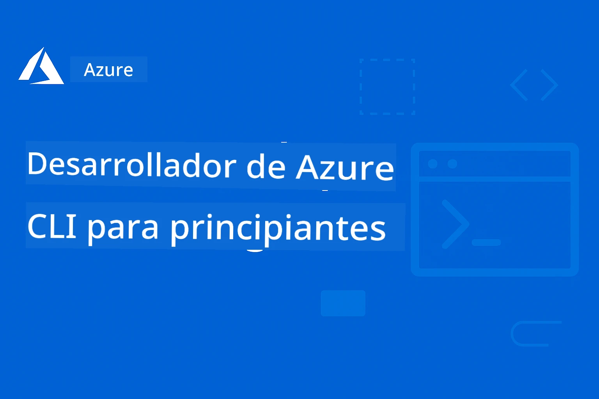

# AZD Para Principiantes: Un Viaje de Aprendizaje Estructurado

 

[](https://GitHub.com/microsoft/azd-for-beginners/watchers/)
[](https://GitHub.com/microsoft/azd-for-beginners/network/)
[](https://GitHub.com/microsoft/azd-for-beginners/stargazers/)

[](https://discord.gg/microsoft-azure)
[](https://discord.gg/nTYy5BXMWG)

---

### Traducciones Automáticas (Siempre Actualizadas)

<!-- CO-OP TRANSLATOR LANGUAGES TABLE START -->
[Árabe](../ar/README.md) | [Bengalí](../bn/README.md) | [Búlgaro](../bg/README.md) | [Birmano (Myanmar)](../my/README.md) | [Chino (Simplificado)](../zh-CN/README.md) | [Chino (Tradicional, Hong Kong)](../zh-HK/README.md) | [Chino (Tradicional, Macao)](../zh-MO/README.md) | [Chino (Tradicional, Taiwán)](../zh-TW/README.md) | [Croata](../hr/README.md) | [Checo](../cs/README.md) | [Danés](../da/README.md) | [Holandés](../nl/README.md) | [Estonio](../et/README.md) | [Finlandés](../fi/README.md) | [Francés](../fr/README.md) | [Alemán](../de/README.md) | [Griego](../el/README.md) | [Hebreo](../he/README.md) | [Hindi](../hi/README.md) | [Húngaro](../hu/README.md) | [Indonesio](../id/README.md) | [Italiano](../it/README.md) | [Japonés](../ja/README.md) | [Kannada](../kn/README.md) | [Coreano](../ko/README.md) | [Lituano](../lt/README.md) | [Malayo](../ms/README.md) | [Malabar (Malayalam)](../ml/README.md) | [Maratí](../mr/README.md) | [Nepalí](../ne/README.md) | [Pidgin Nigeriano](../pcm/README.md) | [Noruego](../no/README.md) | [Persa (Farsi)](../fa/README.md) | [Polaco](../pl/README.md) | [Portugués (Brasil)](../pt-BR/README.md) | [Portugués (Portugal)](../pt-PT/README.md) | [Punjabi (Gurmukhi)](../pa/README.md) | [Rumano](../ro/README.md) | [Ruso](../ru/README.md) | [Serbio (Cirílico)](../sr/README.md) | [Eslovaco](../sk/README.md) | [Esloveno](../sl/README.md) | [Español](./README.md) | [Swahili](../sw/README.md) | [Sueco](../sv/README.md) | [Tagalo (Filipino)](../tl/README.md) | [Tamil](../ta/README.md) | [Telugu](../te/README.md) | [Tailandés](../th/README.md) | [Turco](../tr/README.md) | [Ucraniano](../uk/README.md) | [Urdu](../ur/README.md) | [Vietnamita](../vi/README.md)

> **¿Prefieres clonar localmente?**
>
> Este repositorio incluye más de 50 traducciones en varios idiomas que aumentan significativamente el tamaño de la descarga. Para clonar sin traducciones, utiliza el sparse checkout:
>
> **Bash / macOS / Linux:**
> ```bash
> git clone --filter=blob:none --sparse https://github.com/microsoft/AZD-for-beginners.git
> cd AZD-for-beginners
> git sparse-checkout set --no-cone '/*' '!translations' '!translated_images'
> ```
>
> **CMD (Windows):**
> ```cmd
> git clone --filter=blob:none --sparse https://github.com/microsoft/AZD-for-beginners.git
> cd AZD-for-beginners
> git sparse-checkout set --no-cone "/*" "!translations" "!translated_images"
> ```
>
> Esto te ofrece todo lo que necesitas para completar el curso con una descarga mucho más rápida.
<!-- CO-OP TRANSLATOR LANGUAGES TABLE END -->

## 🆕 Novedades de azd Hoy

Azure Developer CLI ha crecido más allá de las aplicaciones web tradicionales y APIs. Hoy, azd es la herramienta única para desplegar **cualquier** aplicación en Azure—incluyendo aplicaciones con IA y agentes inteligentes.

Esto es lo que significa para ti:

- **Los agentes de IA ahora son cargas de trabajo azd de primera categoría.** Puedes inicializar, desplegar y gestionar proyectos de agentes de IA usando el mismo flujo `azd init` → `azd up` que ya conoces.
- **La integración con Microsoft Foundry** trae despliegue de modelos, alojamiento de agentes y configuración de servicios de IA directamente al ecosistema de plantillas de azd.
- **El flujo de trabajo central no ha cambiado.** Ya sea que despliegues una aplicación de tareas, un microservicio o una solución AI multi-agente, los comandos son los mismos.

Si has usado azd antes, el soporte para IA es una extensión natural—no una herramienta separada ni un camino avanzado. Si comienzas desde cero, aprenderás un único flujo que funciona para todo.

---

## 🚀 ¿Qué es Azure Developer CLI (azd)?

**Azure Developer CLI (azd)** es una herramienta de línea de comandos amigable para desarrolladores que simplifica el despliegue de aplicaciones en Azure. En lugar de crear y conectar manualmente decenas de recursos en Azure, puedes desplegar aplicaciones completas con un solo comando.

### La Magia de `azd up`

```bash
# Este único comando lo hace todo:
# ✅ Crea todos los recursos de Azure
# ✅ Configura redes y seguridad
# ✅ Compila el código de tu aplicación
# ✅ Despliega en Azure
# ✅ Te proporciona una URL funcional
azd up
```

**¡Eso es todo!** Sin clics en el Portal de Azure, sin aprender plantillas ARM complejas antes, ni configuraciones manuales—solo aplicaciones funcionando en Azure.

---

## ❓ Azure Developer CLI vs Azure CLI: ¿Cuál es la diferencia?

Esta es la pregunta más común que hacen los principiantes. Aquí la respuesta sencilla:

| Característica | **Azure CLI (`az`)** | **Azure Developer CLI (`azd`)** |
|----------------|----------------------|---------------------------------|
| **Propósito** | Gestionar recursos individuales de Azure | Desplegar aplicaciones completas |
| **Mentalidad** | Enfocado en infraestructura | Enfocado en aplicaciones |
| **Ejemplo** | `az webapp create --name myapp...` | `azd up` |
| **Curva de aprendizaje** | Debes conocer servicios de Azure | Solo necesitas conocer tu app |
| **Ideal para** | DevOps, Infraestructura | Desarrolladores, Prototipos |

### Analogía Simple

- **Azure CLI** es como tener todas las herramientas para construir una casa—martillos, sierras, clavos. Puedes construir cualquier cosa, pero necesitas saber construcción.
- **Azure Developer CLI** es como contratar un contratista—describes lo que quieres y ellos se encargan de construir.

### Cuándo Usar Cada Uno

| Escenario | Usa Esto |
|-----------|----------|
| "Quiero desplegar mi app web rápidamente" | `azd up` |
| "Necesito crear solo una cuenta de almacenamiento" | `az storage account create` |
| "Estoy construyendo una aplicación completa de IA" | `azd init --template azure-search-openai-demo` |
| "Necesito depurar un recurso específico de Azure" | `az resource show` |
| "Quiero un despliegue listo para producción en minutos" | `azd up --environment production` |

### ¡Funcionan Juntos!

AZD utiliza Azure CLI internamente. Puedes usar ambos:
```bash
# Despliega tu aplicación con AZD
azd up

# Luego ajusta recursos específicos con Azure CLI
az webapp config set --name myapp --always-on true
```

---

## 🌟 Encuentra Plantillas en Awesome AZD

¡No comiences desde cero! **Awesome AZD** es la colección comunitaria de plantillas listas para desplegar:

| Recurso | Descripción |
|---------|-------------|
| 🔗 [**Galería Awesome AZD**](https://azure.github.io/awesome-azd/) | Explora más de 200 plantillas con despliegue con un clic |
| 🔗 [**Enviar una Plantilla**](https://github.com/Azure/awesome-azd/issues) | Contribuye con tu propia plantilla a la comunidad |
| 🔗 [**Repositorio en GitHub**](https://github.com/Azure/awesome-azd) | Dale estrella y explora el código fuente |

### Plantillas Populares de IA de Awesome AZD

```bash
# Chat RAG con los modelos de Microsoft Foundry + Búsqueda de IA
azd init --template azure-search-openai-demo

# Aplicación de chat de IA rápida
azd init --template openai-chat-app-quickstart

# Agentes de IA con agentes de Foundry
azd init --template get-started-with-ai-agents
```

---

## 🎯 Comenzando en 3 Pasos

### Paso 1: Instala AZD (2 minutos)

**Windows:**
```powershell
winget install microsoft.azd
```

**macOS:**
```bash
brew tap azure/azd && brew install azd
```

**Linux:**
```bash
curl -fsSL https://aka.ms/install-azd.sh | bash
```

### Paso 2: Iniciar Sesión en Azure

```bash
azd auth login
```

### Paso 3: Despliega Tu Primera App

```bash
# Inicializar desde una plantilla
azd init --template todo-nodejs-mongo

# Desplegar en Azure (¡crea todo!)
azd up
```

**🎉 ¡Eso es todo!** Tu aplicación ya está en vivo en Azure.

### Limpieza (¡No Olvides!)

```bash
# Remove all resources when done experimenting
azd down --force --purge
```

---

## 📚 Cómo Usar Este Curso

Este curso está diseñado para un **aprendizaje progresivo**—comienza donde te sientas cómodo y avanza:

| Tu Experiencia | Comienza Aquí |
|----------------|---------------|
| **Nuevo en Azure** | [Capítulo 1: Fundamentos](../..) |
| **Conoces Azure, nuevo en AZD** | [Capítulo 1: Fundamentos](../..) |
| **Quieres desplegar apps de IA** | [Capítulo 2: Desarrollo AI-First](../..) |
| **Quieres práctica práctica** | [🎓 Taller Interactivo](workshop/README.md) - Laboratorio guiado de 3-4 horas |
| **Necesitas patrones para producción** | [Capítulo 8: Producción & Empresa](../..) |

### Configuración Rápida

1. **Haz un Fork de Este Repositorio**: [](https://GitHub.com/microsoft/azd-for-beginners/fork)
2. **Clónalo**: `git clone https://github.com/YOUR-USERNAME/azd-for-beginners.git`
3. **Pide Ayuda**: [Comunidad de Azure Discord](https://discord.com/invite/ByRwuEEgH4)

> **¿Prefieres clonar localmente?**

> Este repositorio incluye más de 50 traducciones que aumentan significativamente el tamaño de la descarga. Para clonar sin traducciones, usa sparse checkout:
> ```bash
> git clone --filter=blob:none --sparse https://github.com/microsoft/AZD-for-beginners.git
> cd AZD-for-beginners
> git sparse-checkout set --no-cone '/*' '!translations' '!translated_images'
> ```
> Esto te ofrece todo lo que necesitas para completar el curso con una descarga mucho más rápida.


## Descripción General del Curso

Domina Azure Developer CLI (azd) a través de capítulos estructurados diseñados para un aprendizaje progresivo. **Especial enfoque en el despliegue de aplicaciones de IA con la integración de Microsoft Foundry.**

### Por Qué Este Curso es Esencial para Desarrolladores Modernos

Basado en perspectivas de la comunidad de Microsoft Foundry Discord, **el 45% de los desarrolladores quiere usar AZD para cargas de trabajo de IA**, pero enfrentan desafíos con:
- Arquitecturas complejas de IA multi-servicio
- Mejores prácticas para despliegue de IA en producción  
- Integración y configuración de servicios de IA en Azure
- Optimización de costos para cargas de trabajo de IA
- Solución de problemas específicos de despliegue de IA

### Objetivos de Aprendizaje

Al completar este curso estructurado podrás:
- **Dominar Fundamentos de AZD**: Conceptos clave, instalación y configuración
- **Desplegar Aplicaciones de IA**: Usar AZD con servicios de Microsoft Foundry
- **Implementar Infraestructura como Código**: Gestionar recursos Azure con plantillas Bicep
- **Solucionar Problemas de Despliegue**: Resolver incidencias comunes y depurar problemas
- **Optimizar para Producción**: Seguridad, escalabilidad, monitoreo y gestión de costos
- **Construir Soluciones Multi-Agente**: Desplegar arquitecturas complejas de IA

## 🗺️ Mapa del Curso: Navegación Rápida por Capítulo

Cada capítulo tiene un README dedicado con objetivos de aprendizaje, guías rápidas y ejercicios:

| Capítulo | Tema | Lecciones | Duración | Complejidad |
|----------|------|-----------|----------|-------------|
| **[Cap 1: Fundamentos](docs/chapter-01-foundation/README.md)** | Comenzando | [Conceptos Básicos AZD](docs/chapter-01-foundation/azd-basics.md) &#124; [Instalación](docs/chapter-01-foundation/installation.md) &#124; [Primer Proyecto](docs/chapter-01-foundation/first-project.md) | 30-45 min | ⭐ |
| **[Cap 2: Desarrollo de IA](docs/chapter-02-ai-development/README.md)** | Aplicaciones AI-First | [Integración Foundry](docs/chapter-02-ai-development/microsoft-foundry-integration.md) &#124; [Agentes AI](docs/chapter-02-ai-development/agents.md) &#124; [Despliegue de Modelos](docs/chapter-02-ai-development/ai-model-deployment.md) &#124; [Taller](docs/chapter-02-ai-development/ai-workshop-lab.md) | 1-2 hrs | ⭐⭐ |
| **[Cap 3: Configuración](docs/chapter-03-configuration/README.md)** | Autenticación y Seguridad | [Configuración](docs/chapter-03-configuration/configuration.md) &#124; [Autenticación y Seguridad](docs/chapter-03-configuration/authsecurity.md) | 45-60 min | ⭐⭐ |
| **[Cap 4: Infraestructura](docs/chapter-04-infrastructure/README.md)** | IaC y Despliegue | [Guía de Despliegue](docs/chapter-04-infrastructure/deployment-guide.md) &#124; [Provisionamiento](docs/chapter-04-infrastructure/provisioning.md) | 1-1.5 hrs | ⭐⭐⭐ |
| **[Cap 5: Multi-Agente](docs/chapter-05-multi-agent/README.md)** | Soluciones con Agentes AI | [Escenario Retail](examples/retail-scenario.md) &#124; [Patrones de Coordinación](docs/chapter-06-pre-deployment/coordination-patterns.md) | 2-3 hrs | ⭐⭐⭐⭐ |
| **[Cap 6: Pre-Despliegue](docs/chapter-06-pre-deployment/README.md)** | Planificación y Validación | [Revisiones Previas](docs/chapter-06-pre-deployment/preflight-checks.md) &#124; [Planificación de Capacidad](docs/chapter-06-pre-deployment/capacity-planning.md) &#124; [Selección de SKU](docs/chapter-06-pre-deployment/sku-selection.md) &#124; [App Insights](docs/chapter-06-pre-deployment/application-insights.md) | 1 hr | ⭐⭐ |
| **[Cap 7: Solución de Problemas](docs/chapter-07-troubleshooting/README.md)** | Depuración y Solución | [Problemas Comunes](docs/chapter-07-troubleshooting/common-issues.md) &#124; [Depuración](docs/chapter-07-troubleshooting/debugging.md) &#124; [Problemas AI](docs/chapter-07-troubleshooting/ai-troubleshooting.md) | 1-1.5 hrs | ⭐⭐ |
| **[Cap 8: Producción](docs/chapter-08-production/README.md)** | Patrones Empresariales | [Prácticas de Producción](docs/chapter-08-production/production-ai-practices.md) | 2-3 hrs | ⭐⭐⭐⭐ |
| **[🎓 Taller](workshop/README.md)** | Laboratorio Práctico | [Introducción](workshop/docs/instructions/0-Introduction.md) &#124; [Selección](workshop/docs/instructions/1-Select-AI-Template.md) &#124; [Validación](workshop/docs/instructions/2-Validate-AI-Template.md) &#124; [Desconstrucción](workshop/docs/instructions/3-Deconstruct-AI-Template.md) &#124; [Configuración](workshop/docs/instructions/4-Configure-AI-Template.md) &#124; [Personalización](workshop/docs/instructions/5-Customize-AI-Template.md) &#124; [Desmantelamiento](workshop/docs/instructions/6-Teardown-Infrastructure.md) &#124; [Conclusión](workshop/docs/instructions/7-Wrap-up.md) | 3-4 hrs | ⭐⭐ |

**Duración Total del Curso:** ~10-14 horas | **Progresión de Habilidades:** Principiante → Listo para Producción

---

## 📚 Capítulos de Aprendizaje

*Selecciona tu ruta de aprendizaje según nivel de experiencia y objetivos*

### 🚀 Capítulo 1: Fundamentos y Inicio Rápido
**Requisitos previos**: Suscripción a Azure, conocimientos básicos de línea de comando  
**Duración**: 30-45 minutos  
**Complejidad**: ⭐

#### Qué Aprenderás
- Fundamentos de Azure Developer CLI
- Instalación de AZD en tu plataforma
- Tu primer despliegue exitoso

#### Recursos de Aprendizaje
- **🎯 Empieza Aquí**: [¿Qué es Azure Developer CLI?](../..)
- **📖 Teoría**: [Conceptos Básicos AZD](docs/chapter-01-foundation/azd-basics.md) - Conceptos y terminología esencial
- **⚙️ Configuración**: [Instalación y Configuración](docs/chapter-01-foundation/installation.md) - Guías específicas por plataforma
- **🛠️ Práctico**: [Tu Primer Proyecto](docs/chapter-01-foundation/first-project.md) - Tutorial paso a paso
- **📋 Referencia Rápida**: [Hoja de Comandos](resources/cheat-sheet.md)

#### Ejercicios Prácticos
```bash
# Comprobación rápida de instalación
azd version

# Despliega tu primera aplicación
azd init --template todo-nodejs-mongo
azd up
```

**💡 Resultado del Capítulo**: Desplegar con éxito una aplicación web simple en Azure usando AZD

**✅ Validación de Éxito:**
```bash
# Después de completar el Capítulo 1, deberías poder:
azd version              # Muestra la versión instalada
azd init --template todo-nodejs-mongo  # Inicializa el proyecto
azd up                  # Despliega en Azure
azd show                # Muestra la URL de la aplicación en ejecución
# La aplicación se abre en el navegador y funciona
azd down --force --purge  # Limpia los recursos
```

**📊 Tiempo Invertido:** 30-45 minutos  
**📈 Nivel de Habilidad Tras:** Puede desplegar aplicaciones básicas de forma independiente

---

### 🤖 Capítulo 2: Desarrollo AI-First (Recomendado para Desarrolladores IA)
**Requisitos previos**: Capítulo 1 completado  
**Duración**: 1-2 horas  
**Complejidad**: ⭐⭐

#### Qué Aprenderás
- Integración Microsoft Foundry con AZD
- Despliegue de aplicaciones potenciadas por IA
- Configuraciones de servicios AI

#### Recursos de Aprendizaje
- **🎯 Empieza Aquí**: [Integración Microsoft Foundry](docs/chapter-02-ai-development/microsoft-foundry-integration.md)
- **🤖 Agentes AI**: [Guía de Agentes AI](docs/chapter-02-ai-development/agents.md) - Despliega agentes inteligentes con AZD
- **📖 Patrones**: [Despliegue de Modelos AI](docs/chapter-02-ai-development/ai-model-deployment.md) - Despliega y gestiona modelos AI
- **🛠️ Taller**: [Laboratorio AI](docs/chapter-02-ai-development/ai-workshop-lab.md) - Prepara tus soluciones AI para AZD
- **🎥 Guía Interactiva**: [Materiales de Taller](workshop/README.md) - Aprendizaje basado en navegador con MkDocs * Entorno DevContainer
- **📋 Plantillas**: [Plantillas Microsoft Foundry Destacadas](../..)
- **📝 Ejemplos**: [Ejemplos de Despliegue AZD](examples/README.md)

#### Ejercicios Prácticos
```bash
# Despliega tu primera aplicación de IA
azd init --template azure-search-openai-demo
azd up

# Prueba plantillas adicionales de IA
azd init --template openai-chat-app-quickstart
azd init --template agent-openai-python-prompty
```

**💡 Resultado del Capítulo**: Desplegar y configurar una aplicación de chat con IA y capacidades RAG

**✅ Validación de Éxito:**
```bash
# Después del Capítulo 2, deberías ser capaz de:
azd init --template azure-search-openai-demo
azd up
# Probar la interfaz de chat de IA
# Hacer preguntas y obtener respuestas impulsadas por IA con fuentes
# Verificar que la integración de búsqueda funcione
azd monitor  # Comprobar que Application Insights muestra telemetría
azd down --force --purge
```

**📊 Tiempo Invertido:** 1-2 horas  
**📈 Nivel de Habilidad Tras:** Puede desplegar y configurar aplicaciones AI listas para producción  
**💰 Conciencia de Costos:** Comprende costos de desarrollo $80-150/mes, producción $300-3500/mes

#### 💰 Consideraciones de Costos para Despliegues AI

**Entorno de Desarrollo (Estimado $80-150/mes):**
- Modelos Microsoft Foundry (pago por uso): $0-50/mes (basado en uso de tokens)
- Búsqueda AI (nivel básico): $75/mes
- Container Apps (consumo): $0-20/mes
- Almacenamiento (estándar): $1-5/mes

**Entorno de Producción (Estimado $300-3,500+/mes):**
- Modelos Microsoft Foundry (PTU para rendimiento consistente): $3,000+/mes O pago por uso con alto volumen
- Búsqueda AI (nivel estándar): $250/mes
- Container Apps (dedicado): $50-100/mes
- Application Insights: $5-50/mes
- Almacenamiento (premium): $10-50/mes

**💡 Consejos para Optimizar Costos:**
- Usa modelos Microsoft Foundry en **nivel gratuito** para aprendizaje (Azure OpenAI incluye 50,000 tokens/mes)
- Ejecuta `azd down` para desasignar recursos cuando no estés desarrollando activamente
- Empieza con facturación por consumo, solo cambia a PTU en producción
- Usa `azd provision --preview` para estimar costos antes del despliegue
- Activa auto-escalado: paga solo por uso real

**Monitoreo de Costos:**
```bash
# Comprobar costos mensuales estimados
azd provision --preview

# Supervisar costos reales en el Portal de Azure
az consumption budget list --resource-group <your-rg>
```

---

### ⚙️ Capítulo 3: Configuración y Autenticación
**Requisitos previos**: Capítulo 1 completado  
**Duración**: 45-60 minutos  
**Complejidad**: ⭐⭐

#### Qué Aprenderás
- Configuración y gestión del entorno
- Mejores prácticas de autenticación y seguridad
- Nomenclatura y organización de recursos

#### Recursos de Aprendizaje
- **📖 Configuración**: [Guía de Configuración](docs/chapter-03-configuration/configuration.md) - Configuración de entornos
- **🔐 Seguridad**: [Patrones de Autenticación e identidad gestionada](docs/chapter-03-configuration/authsecurity.md) - Patrones de autenticación
- **📝 Ejemplos**: [Ejemplo de Aplicación de Base de Datos](examples/database-app/README.md) - Ejemplos AZD para bases de datos

#### Ejercicios Prácticos
- Configurar múltiples entornos (dev, staging, prod)
- Configurar autenticación con identidad gestionada
- Implementar configuraciones específicas por entorno

**💡 Resultado del Capítulo**: Gestionar múltiples entornos con autenticación y seguridad adecuadas

---

### 🏗️ Capítulo 4: Infraestructura como Código y Despliegue
**Requisitos previos**: Capítulos 1-3 completados  
**Duración**: 1-1.5 horas  
**Complejidad**: ⭐⭐⭐

#### Qué Aprenderás
- Patrones avanzados de despliegue
- Infraestructura como Código con Bicep
- Estrategias de provisión de recursos

#### Recursos de Aprendizaje
- **📖 Despliegue**: [Guía de Despliegue](docs/chapter-04-infrastructure/deployment-guide.md) - Flujos completos
- **🏗️ Provisionamiento**: [Provisionamiento de Recursos](docs/chapter-04-infrastructure/provisioning.md) - Gestión de recursos Azure
- **📝 Ejemplos**: [Ejemplo Container App](../../examples/container-app) - Despliegues en contenedores

#### Ejercicios Prácticos
- Crear plantillas Bicep personalizadas
- Desplegar aplicaciones multiservicio
- Implementar estrategias de despliegue blue-green

**💡 Resultado del Capítulo**: Desplegar aplicaciones multiservicio complejas mediante plantillas personalizadas de infraestructura

---

### 🎯 Capítulo 5: Soluciones Multi-Agente AI (Avanzado)
**Requisitos previos**: Capítulos 1-2 completados  
**Duración**: 2-3 horas  
**Complejidad**: ⭐⭐⭐⭐

#### Qué Aprenderás
- Patrones arquitectónicos multi-agente
- Orquestación y coordinación de agentes
- Despliegues AI listos para producción

#### Recursos de Aprendizaje
- **🤖 Proyecto Destacado**: [Solución Multi-Agente Retail](examples/retail-scenario.md) - Implementación completa
- **🛠️ Plantillas ARM**: [Paquete Plantillas ARM](../../examples/retail-multiagent-arm-template) - Despliegue con un clic
- **📖 Arquitectura**: [Patrones de coordinación multi-agente](docs/chapter-06-pre-deployment/coordination-patterns.md) - Patrones

#### Ejercicios Prácticos
```bash
# Desplegar la solución completa de múltiples agentes para retail
cd examples/retail-multiagent-arm-template
./deploy.sh

# Explorar configuraciones de agentes
az deployment group show --resource-group <rg-name> --name <deployment-name>
```

**💡 Resultado del Capítulo**: Desplegar y gestionar una solución AI multi-agente lista para producción con agentes de Cliente e Inventario

---

### 🔍 Capítulo 6: Validación y Planificación Pre-Despliegue
**Requisitos previos**: Capítulo 4 completado  
**Duración**: 1 hora  
**Complejidad**: ⭐⭐

#### Qué Aprenderás
- Planificación de capacidad y validación de recursos
- Estrategias de selección de SKU
- Revisiones previas automatizadas

#### Recursos de Aprendizaje
- **📊 Planificación**: [Planificación de Capacidad](docs/chapter-06-pre-deployment/capacity-planning.md) - Validación de recursos
- **💰 Selección**: [Selección de SKU](docs/chapter-06-pre-deployment/sku-selection.md) - Elecciones costo-efectivas
- **✅ Validación**: [Revisiones Previas](docs/chapter-06-pre-deployment/preflight-checks.md) - Scripts automatizados

#### Ejercicios Prácticos
- Ejecutar scripts de validación de capacidad
- Optimizar selección de SKU para costos
- Implementar revisiones automatizadas antes del despliegue

**💡 Resultado del Capítulo**: Validar y optimizar despliegues antes de la ejecución

---

### 🚨 Capítulo 7: Solución de Problemas y Depuración
**Requisitos previos**: Cualquier capítulo de despliegue completado  
**Duración**: 1-1.5 horas  
**Complejidad**: ⭐⭐

#### Qué Aprenderás
- Enfoques sistemáticos para depurar
- Problemas comunes y sus soluciones
- Solución de problemas específica para AI

#### Recursos de Aprendizaje
- **🔧 Problemas Comunes**: [Problemas Comunes](docs/chapter-07-troubleshooting/common-issues.md) - Preguntas frecuentes y soluciones
- **🕵️ Depuración**: [Guía de Depuración](docs/chapter-07-troubleshooting/debugging.md) - Estrategias paso a paso
- **🤖 Problemas AI**: [Solución de Problemas AI](docs/chapter-07-troubleshooting/ai-troubleshooting.md) - Problemas con servicios AI

#### Ejercicios Prácticos
- Diagnosticar fallos en despliegues
- Resolver problemas de autenticación
- Depurar conectividad de servicios AI

**💡 Resultado del Capítulo**: Diagnosticar y resolver de forma independiente problemas comunes de despliegue

---

### 🏢 Capítulo 8: Producción y Patrones Empresariales
**Requisitos previos**: Capítulos 1-4 completados  
**Duración**: 2-3 horas  
**Complejidad**: ⭐⭐⭐⭐

#### Qué Aprenderás
- Estrategias de despliegue en producción
- Patrones de seguridad empresarial
- Monitorización y optimización de costos

#### Recursos de Aprendizaje
- **🏭 Producción**: [Prácticas recomendadas de IA en producción](docs/chapter-08-production/production-ai-practices.md) - Patrones empresariales
- **📝 Ejemplos**: [Ejemplo de microservicios](../../examples/microservices) - Arquitecturas complejas
- **📊 Monitoreo**: [Integración con Application Insights](docs/chapter-06-pre-deployment/application-insights.md) - Monitoreo

#### Ejercicios Prácticos
- Implementar patrones de seguridad empresariales
- Configurar un monitoreo integral
- Desplegar a producción con gobernanza adecuada

**💡 Resultado del capítulo**: Desplegar aplicaciones listas para producción con todas las capacidades productivas

---

## 🎓 Resumen del Taller: Experiencia de aprendizaje práctica

> **⚠️ ESTADO DEL TALLER: Desarrollo activo**  
> Los materiales del taller están en desarrollo y refinamiento. Los módulos principales son funcionales, pero algunas secciones avanzadas están incompletas. Estamos trabajando activamente para completar todo el contenido. [Seguir progreso →](workshop/README.md)

### Materiales interacivos del taller
**Aprendizaje práctico integral con herramientas basadas en navegador y ejercicios guiados**

Nuestros materiales ofrecen una experiencia de aprendizaje estructurada e interactiva que complementa el currículo basado en capítulos que se muestra arriba. El taller está diseñado tanto para aprendizaje autónomo como para sesiones dirigidas por instructores.

#### 🛠️ Características del Taller
- **Interfaz basada en navegador**: Taller completo potenciado por MkDocs con búsqueda, copiado y características de tema
- **Integración con GitHub Codespaces**: Configuración del entorno de desarrollo con un clic
- **Ruta de aprendizaje estructurada**: 8 módulos con ejercicios guiados (3-4 horas en total)
- **Metodología progresiva**: Introducción → Selección → Validación → Deconstrucción → Configuración → Personalización → Desarme → Conclusión
- **Entorno DevContainer interactivo**: Herramientas y dependencias preconfiguradas

#### 📚 Estructura de módulos del taller
El taller sigue una **metodología progresiva de 8 módulos** que te lleva desde el descubrimiento hasta el dominio del despliegue:

| Módulo | Tema | Qué harás | Duración |
|--------|-------|-----------|----------|
| **0. Introducción** | Resumen del taller | Comprender objetivos de aprendizaje, prerequisitos y estructura del taller | 15 min |
| **1. Selección** | Descubrimiento de plantillas | Explorar plantillas AZD y seleccionar la plantilla de IA adecuada para tu escenario | 20 min |
| **2. Validación** | Desplegar y verificar | Desplegar la plantilla con `azd up` y validar que la infraestructura funciona | 30 min |
| **3. Deconstrucción** | Entender la estructura | Usar GitHub Copilot para explorar la arquitectura de la plantilla, archivos Bicep y organización del código | 30 min |
| **4. Configuración** | Profundización en azure.yaml | Dominar la configuración de `azure.yaml`, hooks del ciclo de vida y variables de entorno | 30 min |
| **5. Personalización** | Hazlo tuyo | Activar Búsqueda AI, trazas, evaluación y personalizar para tu escenario | 45 min |
| **6. Desarme** | Limpieza | Remover recursos de manera segura con `azd down --purge` | 15 min |
| **7. Conclusión** | Próximos pasos | Revisar logros, conceptos clave y continuar tu ruta de aprendizaje | 15 min |

**Flujo del taller:**  
```
Introduction → Selection → Validation → Deconstruction → Configuration → Customization → Teardown → Wrap-up
     ↓            ↓           ↓              ↓               ↓              ↓            ↓           ↓
  Overview    Find the     Deploy &      Explore        Master         Customize     Clean up    Review &
             right        verify        code &        azure.yaml      for your      resources   next steps
             template                   structure                     scenario
```
  
#### 🚀 Comenzando con el taller  
```bash
# Opción 1: GitHub Codespaces (Recomendado)
# Haga clic en "Code" → "Create codespace on main" en el repositorio

# Opción 2: Desarrollo Local
git clone https://github.com/microsoft/azd-for-beginners.git
cd azd-for-beginners/workshop
# Siga las instrucciones de configuración en workshop/README.md
```
  
#### 🎯 Resultados de aprendizaje del taller  
Al completar el taller, los participantes podrán:  
- **Desplegar aplicaciones IA en producción**: Usar AZD con servicios Microsoft Foundry  
- **Dominar arquitecturas multi-agente**: Implementar soluciones coordinadas de agentes IA  
- **Implementar mejores prácticas de seguridad**: Configurar autenticación y control de acceso  
- **Optimizar para la escala**: Diseñar despliegues rentables y con buen rendimiento  
- **Solucionar problemas de despliegue**: Resolver problemas comunes de forma independiente  

#### 📖 Recursos del Taller  
- **🎥 Guía interactiva**: [Materiales del taller](workshop/README.md) - Entorno de aprendizaje basado en navegador  
- **📋 Instrucciones módulo a módulo**:  
  - [0. Introducción](workshop/docs/instructions/0-Introduction.md) - Resumen y objetivos  
  - [1. Selección](workshop/docs/instructions/1-Select-AI-Template.md) - Buscar y elegir plantillas IA  
  - [2. Validación](workshop/docs/instructions/2-Validate-AI-Template.md) - Desplegar y verificar plantillas  
  - [3. Deconstrucción](workshop/docs/instructions/3-Deconstruct-AI-Template.md) - Explorar arquitectura  
  - [4. Configuración](workshop/docs/instructions/4-Configure-AI-Template.md) - Dominar azure.yaml  
  - [5. Personalización](workshop/docs/instructions/5-Customize-AI-Template.md) - Personalizar para escenario  
  - [6. Desarme](workshop/docs/instructions/6-Teardown-Infrastructure.md) - Limpiar recursos  
  - [7. Conclusión](workshop/docs/instructions/7-Wrap-up.md) - Revisión y siguientes pasos  
- **🛠️ Laboratorio Taller IA**: [Laboratorio taller IA](docs/chapter-02-ai-development/ai-workshop-lab.md) - Ejercicios centrados en IA  
- **💡 Inicio rápido**: [Guía de configuración del taller](workshop/README.md#quick-start) - Configuración del entorno  

**Ideal para**: capacitación corporativa, cursos universitarios, aprendizaje autosuficiente y bootcamps para desarrolladores.

---

## 📖 Profundización: Capacidades de AZD

Más allá de lo básico, AZD ofrece potentes funciones para despliegues en producción:

- **Despliegues basados en plantillas** - Usar plantillas preconstruidas para patrones comunes de aplicaciones  
- **Infraestructura como Código** - Gestionar recursos de Azure con Bicep o Terraform  
- **Flujos de trabajo integrados** - Provisionar, desplegar y monitorear aplicaciones sin fisuras  
- **Amigable para desarrolladores** - Optimizado para productividad y experiencia del desarrollador  

### **AZD + Microsoft Foundry: Perfecto para despliegues IA**

**¿Por qué AZD para soluciones IA?** AZD aborda los principales retos que enfrentan los desarrolladores IA:

- **Plantillas listas para IA** - Plantillas preconfiguradas para modelos Microsoft Foundry, Servicios Cognitivos y cargas ML  
- **Despliegues IA seguros** - Patrones de seguridad integrados para servicios IA, claves API y endpoints de modelos  
- **Patrones IA en producción** - Mejores prácticas para aplicaciones IA escalables y costo-efectivas  
- **Flujos de trabajo IA de extremo a extremo** - Desde desarrollo de modelos hasta despliegue de producción con monitoreo adecuado  
- **Optimización de costos** - Estrategias inteligentes para asignación de recursos y escalado de cargas IA  
- **Integración Microsoft Foundry** - Conexión fluida al catálogo de modelos y endpoints de Microsoft Foundry  

---

## 🎯 Biblioteca de Plantillas y Ejemplos

### Destacado: Plantillas Microsoft Foundry  
**Empieza aquí si estás desplegando aplicaciones IA!**

> **Nota:** Estas plantillas demuestran varios patrones IA. Algunas son Azure Samples externos, otras son implementaciones locales.

| Plantilla | Capítulo | Complejidad | Servicios | Tipo |
|----------|---------|------------|----------|------|
| [**Comienza con chat IA**](https://github.com/Azure-Samples/get-started-with-ai-chat) | Capítulo 2 | ⭐⭐ | AzureOpenAI + Azure AI Model Inference API + Azure AI Search + Azure Container Apps + Application Insights | Externo |
| [**Comienza con agentes IA**](https://github.com/Azure-Samples/get-started-with-ai-agents) | Capítulo 2 | ⭐⭐ | Foundry Agents + AzureOpenAI + Azure AI Search + Azure Container Apps + Application Insights | Externo |
| [**Demo Azure Search + OpenAI**](https://github.com/Azure-Samples/azure-search-openai-demo) | Capítulo 2 | ⭐⭐ | AzureOpenAI + Azure AI Search + App Service + Storage | Externo |
| [**App rápida de chat OpenAI**](https://github.com/Azure-Samples/openai-chat-app-quickstart) | Capítulo 2 | ⭐ | AzureOpenAI + Container Apps + Application Insights | Externo |
| [**Agent OpenAI Python Prompty**](https://github.com/Azure-Samples/agent-openai-python-prompty) | Capítulo 5 | ⭐⭐⭐ | AzureOpenAI + Azure Functions + Prompty | Externo |
| [**Contoso Chat RAG**](https://github.com/Azure-Samples/contoso-chat) | Capítulo 8 | ⭐⭐⭐⭐ | AzureOpenAI + AI Search + Cosmos DB + Container Apps | Externo |
| [**Solución multi-agente retail**](examples/retail-scenario.md) | Capítulo 5 | ⭐⭐⭐⭐ | AzureOpenAI + AI Search + Storage + Container Apps + Cosmos DB | **Local** |

### Destacado: Escenarios completos de aprendizaje  
**Plantillas de aplicaciones listas para producción mapeadas a capítulos de aprendizaje**

| Plantilla | Capítulo de aprendizaje | Complejidad | Aprendizaje clave |
|----------|-------------------------|-------------|-------------------|
| [**openai-chat-app-quickstart**](https://github.com/Azure-Samples/openai-chat-app-quickstart) | Capítulo 2 | ⭐ | Patrones básicos de despliegue IA |
| [**azure-search-openai-demo**](https://github.com/Azure-Samples/azure-search-openai-demo) | Capítulo 2 | ⭐⭐ | Implementación RAG con Azure AI Search |
| [**ai-document-processing**](https://github.com/Azure-Samples/ai-document-processing) | Capítulo 4 | ⭐⭐ | Integración de Inteligencia de Documentos |
| [**agent-openai-python-prompty**](https://github.com/Azure-Samples/agent-openai-python-prompty) | Capítulo 5 | ⭐⭐⭐ | Framework de agentes y llamadas a funciones |
| [**contoso-chat**](https://github.com/Azure-Samples/contoso-chat) | Capítulo 8 | ⭐⭐⭐ | Orquestación IA empresarial |
| [**retail-multi-agent-solution**](examples/retail-scenario.md) | Capítulo 5 | ⭐⭐⭐⭐ | Arquitectura multi-agente con agentes de Cliente e Inventario |

### Aprendizaje por tipo de ejemplo

> **📌 Ejemplos locales vs. externos:**  
> **Ejemplos locales** (en este repositorio) = Listos para usar inmediatamente  
> **Ejemplos externos** (Azure Samples) = Clonar desde repositorios vinculados

#### Ejemplos locales (listos para usar)
- [**Solución multi-agente retail**](examples/retail-scenario.md) - Implementación completa lista para producción con plantillas ARM  
  - Arquitectura multi-agente (agentes Cliente + Inventario)  
  - Monitoreo y evaluación completos  
  - Despliegue con un clic vía plantilla ARM  

#### Ejemplos locales - Aplicaciones contenedor (Capítulos 2-5)  
**Ejemplos completos de despliegues de contenedores en este repositorio:**  
- [**Ejemplos de aplicaciones contenedor**](examples/container-app/README.md) - Guía completa para despliegues contenedorizados  
  - [API Flask simple](../../examples/container-app/simple-flask-api) - API REST básica con escalado a cero  
  - [Arquitectura microservicios](../../examples/container-app/microservices) - Despliegue multipropósito listo para producción  
  - Patrones rápidos, de producción y avanzados  
  - Guía de monitoreo, seguridad y optimización de costos  

#### Ejemplos externos - Aplicaciones simples (Capítulos 1-2)  
**Clona estos repositorios Azure Samples para comenzar:**  
- [App web simple - Node.js + MongoDB](https://github.com/Azure-Samples/todo-nodejs-mongo) - Patrones básicos de despliegue  
- [Sitio web estático - React SPA](https://github.com/Azure-Samples/todo-csharp-sql-swa-func) - Despliegue de contenido estático  
- [App contenedor - Python Flask](https://github.com/Azure-Samples/container-apps-store-api-microservice) - Despliegue API REST  

#### Ejemplos externos - Integración de base de datos (Capítulos 3-4)  
- [App base de datos - C# + SQL](https://github.com/Azure-Samples/todo-csharp-sql) - Patrones de conectividad de base de datos  
- [Funciones + Cosmos DB](https://github.com/Azure-Samples/todo-python-mongo-swa-func) - Flujo de datos serverless  

#### Ejemplos externos - Patrones avanzados (Capítulos 4-8)  
- [Microservicios Java](https://github.com/Azure-Samples/java-microservices-aca-lab) - Arquitecturas multi-servicio  
- [Trabajos en Container Apps](https://github.com/Azure-Samples/container-apps-jobs) - Procesos en background  
- [Pipeline ML empresarial](https://github.com/Azure-Samples/mlops-v2) - Patrones ML listos para producción  

### Colecciones de plantillas externas  
- [**Galería oficial de plantillas AZD**](https://azure.github.io/awesome-azd/) - Colección curada de plantillas oficiales y comunitarias  
- [**Plantillas Azure Developer CLI**](https://learn.microsoft.com/en-us/azure/developer/azure-developer-cli/azd-templates) - Documentación de plantillas Microsoft Learn  
- [**Directorio de ejemplos**](examples/README.md) - Ejemplos locales con explicaciones detalladas  

---

## 📚 Recursos y referencias de aprendizaje

### Referencias rápidas  
- [**Hoja de comandos**](resources/cheat-sheet.md) - Comandos esenciales de azd organizados por capítulo  
- [**Glosario**](resources/glossary.md) - Terminología de Azure y azd  
- [**Preguntas frecuentes**](resources/faq.md) - Preguntas comunes organizadas por capítulo de aprendizaje  
- [**Guía de estudio**](resources/study-guide.md) - Ejercicios prácticos completos  

### Talleres prácticos  
- [**Laboratorio de taller IA**](docs/chapter-02-ai-development/ai-workshop-lab.md) - Haz tus soluciones IA desplegables con AZD (2-3 horas)  
- [**Taller interactivo**](workshop/README.md) - 8 módulos con ejercicios guiados con MkDocs y GitHub Codespaces  
  - Sigue: Introducción → Selección → Validación → Deconstrucción → Configuración → Personalización → Desarme → Conclusión  

### Recursos de aprendizaje externos
- [Documentación de Azure Developer CLI](https://learn.microsoft.com/en-us/azure/developer/azure-developer-cli/)
- [Centro de Arquitectura de Azure](https://learn.microsoft.com/en-us/azure/architecture/)
- [Calculadora de Precios de Azure](https://azure.microsoft.com/pricing/calculator/)
- [Estado de Azure](https://status.azure.com/)

### Habilidades de Agentes de IA para tu Editor
- [**Microsoft Azure Skills en skills.sh**](https://skills.sh/microsoft/github-copilot-for-azure) - 37 habilidades abiertas de agentes para Azure AI, Foundry, despliegue, diagnóstico, optimización de costos y más. Instálalas en GitHub Copilot, Cursor, Claude Code o cualquier agente compatible:
  ```bash
  npx skills add microsoft/github-copilot-for-azure
  ```

---

## 🔧 Guía Rápida de Solución de Problemas

**Problemas comunes que enfrentan los principiantes y soluciones inmediatas:**

<details>
<summary><strong>❌ "azd: comando no encontrado"</strong></summary>

```bash
# Instalar AZD primero
# Windows (PowerShell):
winget install microsoft.azd

# macOS:
brew tap azure/azd && brew install azd

# Linux:
curl -fsSL https://aka.ms/install-azd.sh | bash

# Verificar instalación
azd version
```
</details>

<details>
<summary><strong>❌ "No se encontró suscripción" o "Suscripción no establecida"</strong></summary>

```bash
# Listar suscripciones disponibles
az account list --output table

# Establecer suscripción predeterminada
az account set --subscription "<subscription-id-or-name>"

# Configurar para el entorno AZD
azd env set AZURE_SUBSCRIPTION_ID "<subscription-id>"

# Verificar
az account show
```
</details>

<details>
<summary><strong>❌ "InsufficientQuota" o "Cuota excedida"</strong></summary>

```bash
# Intenta con una región de Azure diferente
azd env set AZURE_LOCATION "westus2"
azd up

# O usa SKUs más pequeños en desarrollo
# Edita infra/main.parameters.json:
{
  "sku": "B1"  // Instead of "P1V2"
}
```
</details>

<details>
<summary><strong>❌ "azd up" falla a mitad de proceso</strong></summary>

```bash
# Opción 1: Limpiar y reintentar
azd down --force --purge
azd up

# Opción 2: Solo arreglar la infraestructura
azd provision

# Opción 3: Revisar el estado detallado
azd show

# Opción 4: Revisar los registros en Azure Monitor
azd monitor --logs
```
</details>

<details>
<summary><strong>❌ "Falló la autenticación" o "Token expirado"</strong></summary>

```bash
# Reautenticar
az logout
az login

azd auth logout
azd auth login

# Verificar autenticación
az account show
```
</details>

<details>
<summary><strong>❌ "El recurso ya existe" o conflictos de nombres</strong></summary>

```bash
# AZD genera nombres únicos, pero si hay conflicto:
azd down --force --purge

# Entonces reintenta con un entorno nuevo
azd env new dev-v2
azd up
```
</details>

<details>
<summary><strong>❌ El despliegue de la plantilla tarda demasiado</strong></summary>

**Tiempos de espera normales:**
- Aplicación web simple: 5-10 minutos
- Aplicación con base de datos: 10-15 minutos
- Aplicaciones de IA: 15-25 minutos (la provisión de OpenAI es lenta)

```bash
# Comprobar progreso
azd show

# Si está atascado >30 minutos, revise el Portal de Azure:
azd monitor
# Busque implementaciones fallidas
```
</details>

<details>
<summary><strong>❌ "Permiso denegado" o "Prohibido"</strong></summary>

```bash
# Verifica tu rol de Azure
az role assignment list --assignee $(az account show --query user.name -o tsv)

# Necesitas al menos el rol de "Colaborador"
# Pídele a tu administrador de Azure que otorgue:
# - Colaborador (para recursos)
# - Administrador de acceso de usuario (para asignaciones de roles)
```
</details>

<details>
<summary><strong>❌ No se encuentra la URL de la aplicación desplegada</strong></summary>

```bash
# Mostrar todos los puntos finales del servicio
azd show

# O abrir el portal de Azure
azd monitor

# Verificar servicio específico
azd env get-values
# Buscar variables *_URL
```
</details>

### 📚 Recursos Completos de Solución de Problemas

- **Guía de Problemas Comunes:** [Soluciones Detalladas](docs/chapter-07-troubleshooting/common-issues.md)
- **Problemas Específicos de IA:** [Solución de Problemas de IA](docs/chapter-07-troubleshooting/ai-troubleshooting.md)
- **Guía de Depuración:** [Depuración paso a paso](docs/chapter-07-troubleshooting/debugging.md)
- **Obtén Ayuda:** [Azure Discord](https://discord.gg/microsoft-azure) #azure-developer-cli

---

## 🎓 Finalización del Curso y Certificación

### Seguimiento del Progreso
Realiza un seguimiento de tu progreso de aprendizaje a través de cada capítulo:

- [ ] **Capítulo 1**: Fundamentos y Inicio Rápido ✅
- [ ] **Capítulo 2**: Desarrollo con IA Primero ✅  
- [ ] **Capítulo 3**: Configuración y Autenticación ✅
- [ ] **Capítulo 4**: Infraestructura como Código y Despliegue ✅
- [ ] **Capítulo 5**: Soluciones AI Multi-Agente ✅
- [ ] **Capítulo 6**: Validación y Planificación Pre-despliegue ✅
- [ ] **Capítulo 7**: Solución de Problemas y Depuración ✅
- [ ] **Capítulo 8**: Patrones de Producción y Empresariales ✅

### Verificación de Aprendizaje
Después de completar cada capítulo, verifica tus conocimientos mediante:
1. **Ejercicio Práctico**: Completar el despliegue práctico del capítulo
2. **Chequeo de Conocimiento**: Revisar la sección de preguntas frecuentes del capítulo
3. **Discusión Comunitaria**: Compartir tu experiencia en Azure Discord
4. **Siguiente Capítulo**: Avanzar al siguiente nivel de complejidad

### Beneficios por Completar el Curso
Al completar todos los capítulos, habrás obtenido:
- **Experiencia en Producción**: Despliegue de aplicaciones reales de IA en Azure
- **Habilidades Profesionales**: Capacidades de despliegue listas para empresas  
- **Reconocimiento Comunitario**: Miembro activo de la comunidad de desarrolladores Azure
- **Avance Profesional**: Experiencia demandada en AZD y despliegue de IA

---

## 🤝 Comunidad y Soporte

### Obtén Ayuda y Soporte
- **Problemas Técnicos**: [Reporta errores y solicita funciones](https://github.com/microsoft/azd-for-beginners/issues)
- **Preguntas de Aprendizaje**: [Comunidad Discord Microsoft Azure](https://discord.gg/microsoft-azure) y [](https://discord.gg/nTYy5BXMWG)
- **Ayuda específica de IA**: Únete al [](https://discord.gg/nTYy5BXMWG)
- **Documentación**: [Documentación oficial de Azure Developer CLI](https://learn.microsoft.com/en-us/azure/developer/azure-developer-cli/)

### Perspectivas de la Comunidad desde Microsoft Foundry Discord

**Resultados recientes de encuestas en el canal #Azure:**
- **45%** de desarrolladores quieren usar AZD para cargas de trabajo de IA
- **Principales desafíos**: Despliegues multi-servicio, gestión de credenciales, preparación para producción  
- **Más solicitados**: plantillas específicas para IA, guías de solución de problemas, mejores prácticas

**Únete a nuestra comunidad para:**
- Compartir tus experiencias con AZD + IA y obtener ayuda
- Acceder a vistas previas tempranas de nuevas plantillas de IA
- Contribuir a las mejores prácticas de despliegue de IA
- Influir en el desarrollo futuro de características IA + AZD

### Contribuir al Curso
¡Damos la bienvenida a las contribuciones! Por favor lee nuestra [Guía de Contribuciones](CONTRIBUTING.md) para detalles sobre:
- **Mejoras de contenido**: Mejorar capítulos y ejemplos existentes
- **Nuevos ejemplos**: Añadir escenarios y plantillas del mundo real  
- **Traducción**: Ayudar a mantener soporte multilingüe
- **Reportes de errores**: Mejorar precisión y claridad
- **Normas comunitarias**: Seguir nuestras directrices inclusivas

---

## 📄 Información del Curso

### Licencia
Este proyecto está licenciado bajo la Licencia MIT - consulta el archivo [LICENSE](../../LICENSE) para más detalles.

### Recursos Relacionados de Microsoft Learning

Nuestro equipo produce otros cursos completos de aprendizaje:

<!-- CO-OP TRANSLATOR OTHER COURSES START -->
### LangChain
[](https://aka.ms/langchain4j-for-beginners)
[](https://aka.ms/langchainjs-for-beginners?WT.mc_id=m365-94501-dwahlin)
[](https://github.com/microsoft/langchain-for-beginners?WT.mc_id=m365-94501-dwahlin)
---

### Azure / Edge / MCP / Agentes
[](https://github.com/microsoft/AZD-for-beginners?WT.mc_id=academic-105485-koreyst)
[](https://github.com/microsoft/edgeai-for-beginners?WT.mc_id=academic-105485-koreyst)
[](https://github.com/microsoft/mcp-for-beginners?WT.mc_id=academic-105485-koreyst)
[](https://github.com/microsoft/ai-agents-for-beginners?WT.mc_id=academic-105485-koreyst)

---
 
### Serie de IA Generativa
[](https://github.com/microsoft/generative-ai-for-beginners?WT.mc_id=academic-105485-koreyst)
[-9333EA?style=for-the-badge&labelColor=E5E7EB&color=9333EA)](https://github.com/microsoft/Generative-AI-for-beginners-dotnet?WT.mc_id=academic-105485-koreyst)
[-C084FC?style=for-the-badge&labelColor=E5E7EB&color=C084FC)](https://github.com/microsoft/generative-ai-for-beginners-java?WT.mc_id=academic-105485-koreyst)
[-E879F9?style=for-the-badge&labelColor=E5E7EB&color=E879F9)](https://github.com/microsoft/generative-ai-with-javascript?WT.mc_id=academic-105485-koreyst)

---
 
### Aprendizaje Esencial
[](https://aka.ms/ml-beginners?WT.mc_id=academic-105485-koreyst)
[](https://aka.ms/datascience-beginners?WT.mc_id=academic-105485-koreyst)
[](https://aka.ms/ai-beginners?WT.mc_id=academic-105485-koreyst)
[](https://github.com/microsoft/Security-101?WT.mc_id=academic-96948-sayoung)
[](https://aka.ms/webdev-beginners?WT.mc_id=academic-105485-koreyst)
[](https://aka.ms/iot-beginners?WT.mc_id=academic-105485-koreyst)
[](https://github.com/microsoft/xr-development-for-beginners?WT.mc_id=academic-105485-koreyst)

---
 
### Serie Copilot
[](https://aka.ms/GitHubCopilotAI?WT.mc_id=academic-105485-koreyst)
[](https://github.com/microsoft/mastering-github-copilot-for-dotnet-csharp-developers?WT.mc_id=academic-105485-koreyst)
[](https://github.com/microsoft/CopilotAdventures?WT.mc_id=academic-105485-koreyst)
<!-- CO-OP TRANSLATOR OTHER COURSES END -->

---

## 🗺️ Navegación del Curso

**🚀 ¿Listo para empezar a aprender?**

**Principiantes**: Comienza con [Capítulo 1: Fundamentos y Inicio Rápido](../..)  
**Desarrolladores de IA**: Salta a [Capítulo 2: Desarrollo AI-First](../..)  
**Desarrolladores Experimentados**: Empieza con [Capítulo 3: Configuración y Autenticación](../..)

**Próximos pasos**: [Comenzar Capítulo 1 - Conceptos básicos de AZD](docs/chapter-01-foundation/azd-basics.md) →

---

<!-- CO-OP TRANSLATOR DISCLAIMER START -->
**Descargo de responsabilidad**:
Este documento ha sido traducido utilizando el servicio de traducción automática [Co-op Translator](https://github.com/Azure/co-op-translator). Aunque nos esforzamos por la exactitud, tenga en cuenta que las traducciones automáticas pueden contener errores o imprecisiones. El documento original en su idioma nativo debe considerarse la fuente autorizada. Para información crítica, se recomienda una traducción profesional realizada por personas. No nos responsabilizamos por malentendidos o interpretaciones erróneas derivadas del uso de esta traducción.
<!-- CO-OP TRANSLATOR DISCLAIMER END -->