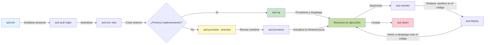
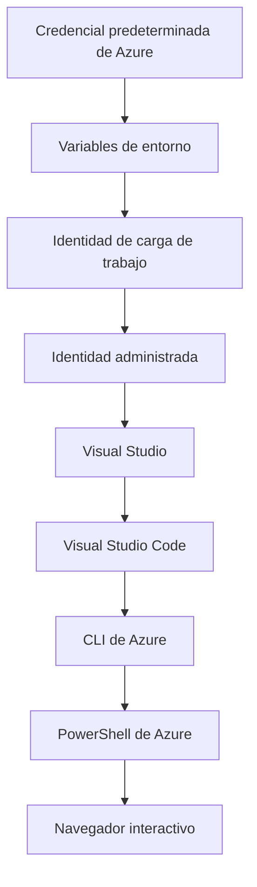

# AZD Basics - Comprendiendo Azure Developer CLI

# AZD Basics - Conceptos centrales y fundamentos

**Chapter Navigation:**
- **📚 Inicio del curso**: [AZD para principiantes](../../README.md)
- **📖 Capítulo actual**: Capítulo 1 - Fundamentos y Inicio rápido
- **⬅️ Anterior**: [Resumen del curso](../../README.md#-chapter-1-foundation--quick-start)
- **➡️ Siguiente**: [Instalación y configuración](installation.md)
- **🚀 Próximo capítulo**: [Capítulo 2: Desarrollo centrado en IA](../chapter-02-ai-development/microsoft-foundry-integration.md)

## Introducción

Esta lección te introduce en Azure Developer CLI (azd), una poderosa herramienta de línea de comandos que acelera tu camino desde el desarrollo local hasta el despliegue en Azure. Aprenderás los conceptos fundamentales, las características principales y comprenderás cómo azd simplifica el despliegue de aplicaciones nativas en la nube.

## Objetivos de aprendizaje

Al final de esta lección, podrás:
- Comprender qué es Azure Developer CLI y su propósito principal
- Aprender los conceptos centrales de plantillas, entornos y servicios
- Explorar funciones clave, incluyendo desarrollo dirigido por plantillas e Infraestructura como Código
- Comprender la estructura de proyecto y el flujo de trabajo de azd
- Estar preparado para instalar y configurar azd en tu entorno de desarrollo

## Resultados de aprendizaje

Después de completar esta lección, podrás:
- Explicar el papel de azd en los flujos de trabajo modernos de desarrollo en la nube
- Identificar los componentes de la estructura de un proyecto azd
- Describir cómo las plantillas, los entornos y los servicios trabajan juntos
- Comprender los beneficios de Infraestructura como Código con azd
- Reconocer los distintos comandos de azd y sus propósitos

## ¿Qué es Azure Developer CLI (azd)?

Azure Developer CLI (azd) es una herramienta de línea de comandos diseñada para acelerar tu camino desde el desarrollo local hasta el despliegue en Azure. Simplifica el proceso de construir, desplegar y gestionar aplicaciones nativas en la nube en Azure.

### 🎯 ¿Por qué usar AZD? Una comparación del mundo real

Comparemos el despliegue de una aplicación web simple con base de datos:

#### ❌ SIN AZD: Despliegue manual en Azure (30+ minutes)

```bash
# Paso 1: Crear grupo de recursos
az group create --name myapp-rg --location eastus

# Paso 2: Crear plan de App Service
az appservice plan create --name myapp-plan \
  --resource-group myapp-rg \
  --sku B1 --is-linux

# Paso 3: Crear aplicación web
az webapp create --name myapp-web-unique123 \
  --resource-group myapp-rg \
  --plan myapp-plan \
  --runtime "NODE:18-lts"

# Paso 4: Crear cuenta de Cosmos DB (10-15 minutos)
az cosmosdb create --name myapp-cosmos-unique123 \
  --resource-group myapp-rg \
  --kind MongoDB

# Paso 5: Crear base de datos
az cosmosdb mongodb database create \
  --account-name myapp-cosmos-unique123 \
  --resource-group myapp-rg \
  --name tododb

# Paso 6: Crear colección
az cosmosdb mongodb collection create \
  --account-name myapp-cosmos-unique123 \
  --resource-group myapp-rg \
  --database-name tododb \
  --name todos

# Paso 7: Obtener cadena de conexión
CONN_STR=$(az cosmosdb keys list \
  --name myapp-cosmos-unique123 \
  --resource-group myapp-rg \
  --type connection-strings \
  --query "connectionStrings[0].connectionString" -o tsv)

# Paso 8: Configurar ajustes de la aplicación
az webapp config appsettings set \
  --name myapp-web-unique123 \
  --resource-group myapp-rg \
  --settings MONGODB_URI="$CONN_STR"

# Paso 9: Habilitar registros
az webapp log config --name myapp-web-unique123 \
  --resource-group myapp-rg \
  --application-logging filesystem \
  --detailed-error-messages true

# Paso 10: Configurar Application Insights
az monitor app-insights component create \
  --app myapp-insights \
  --location eastus \
  --resource-group myapp-rg

# Paso 11: Vincular App Insights con la aplicación web
INSTRUMENTATION_KEY=$(az monitor app-insights component show \
  --app myapp-insights \
  --resource-group myapp-rg \
  --query "instrumentationKey" -o tsv)

az webapp config appsettings set \
  --name myapp-web-unique123 \
  --resource-group myapp-rg \
  --settings APPINSIGHTS_INSTRUMENTATIONKEY="$INSTRUMENTATION_KEY"

# Paso 12: Compilar la aplicación localmente
npm install
npm run build

# Paso 13: Crear paquete de implementación
zip -r app.zip . -x "*.git*" "node_modules/*"

# Paso 14: Desplegar la aplicación
az webapp deployment source config-zip \
  --resource-group myapp-rg \
  --name myapp-web-unique123 \
  --src app.zip

# Paso 15: Espera y reza para que funcione 🙏
# (No hay validación automatizada, se requiere prueba manual)
```

**Problemas:**
- ❌ 15+ comandos para recordar y ejecutar en orden
- ❌ 30-45 minutos de trabajo manual
- ❌ Fácil cometer errores (errores tipográficos, parámetros incorrectos)
- ❌ Cadenas de conexión expuestas en el historial del terminal
- ❌ No hay reversión automática si algo falla
- ❌ Difícil de replicar para los miembros del equipo
- ❌ Diferente cada vez (no reproducible)

#### ✅ CON AZD: Despliegue automatizado (5 commands, 10-15 minutes)

```bash
# Paso 1: Inicializar desde la plantilla
azd init --template todo-nodejs-mongo

# Paso 2: Autenticar
azd auth login

# Paso 3: Crear entorno
azd env new dev

# Paso 4: Previsualizar los cambios (opcional pero recomendado)
azd provision --preview

# Paso 5: Desplegar todo
azd up

# ✨ ¡Hecho! Todo está desplegado, configurado y monitorizado
```

**Beneficios:**
- ✅ **5 comandos** vs. 15+ pasos manuales
- ✅ **10-15 minutos** tiempo total (principalmente esperando a Azure)
- ✅ **Cero errores** - automatizado y probado
- ✅ **Secretos gestionados de forma segura** mediante Key Vault
- ✅ **Reversión automática** en caso de fallos
- ✅ **Totalmente reproducible** - mismo resultado cada vez
- ✅ **Listo para equipo** - cualquiera puede desplegar con los mismos comandos
- ✅ **Infraestructura como Código** - plantillas Bicep bajo control de versiones
- ✅ **Monitoreo integrado** - Application Insights configurado automáticamente

### 📊 Reducción de tiempo y errores

| Métrica | Despliegue manual | Despliegue con AZD | Mejora |
|:-------|:------------------|:---------------|:------------|
| **Comandos** | 15+ | 5 | 67% menos |
| **Tiempo** | 30-45 min | 10-15 min | 60% más rápido |
| **Tasa de errores** | ~40% | <5% | 88% de reducción |
| **Consistencia** | Low (manual) | 100% (automated) | Perfecta |
| **Incorporación del equipo** | 2-4 hours | 30 minutes | 75% más rápido |
| **Tiempo de reversión** | 30+ min (manual) | 2 min (automated) | 93% más rápido |

## Conceptos principales

### Plantillas
Las plantillas son la base de azd. Contienen:
- **Código de la aplicación** - Tu código fuente y dependencias
- **Definiciones de infraestructura** - Recursos de Azure definidos en Bicep o Terraform
- **Archivos de configuración** - Configuraciones y variables de entorno
- **Scripts de despliegue** - Flujos de trabajo de despliegue automatizados

### Entornos
Los entornos representan diferentes destinos de despliegue:
- **Development** - Para pruebas y desarrollo
- **Staging** - Entorno de preproducción
- **Production** - Entorno de producción

Each environment maintains its own:
- Azure resource group
- Configuration settings
- Deployment state

### Services
Los servicios son los componentes básicos de tu aplicación:
- **Frontend** - Aplicaciones web, SPAs
- **Backend** - APIs, microservicios
- **Database** - Soluciones de almacenamiento de datos
- **Storage** - Almacenamiento de archivos y blobs

## Características clave

### 1. Template-Driven Development
```bash
# Explorar plantillas disponibles
azd template list

# Inicializar desde una plantilla
azd init --template <template-name>
```

### 2. Infrastructure as Code
- **Bicep** - Lenguaje específico de dominio de Azure
- **Terraform** - Herramienta de infraestructura multicloud
- **ARM Templates** - Plantillas de Azure Resource Manager

### 3. Integrated Workflows
```bash
# Flujo de trabajo completo de despliegue
azd up            # Aprovisionamiento + Despliegue esto es sin intervención manual para la configuración inicial

# 🧪 NUEVO: Vista previa de los cambios en la infraestructura antes del despliegue (SEGURO)
azd provision --preview    # Simular el despliegue de la infraestructura sin realizar cambios

azd provision     # Crear recursos de Azure si actualizas la infraestructura usa esto
azd deploy        # Desplegar el código de la aplicación o volver a desplegarlo una vez actualizado
azd down          # Eliminar recursos
```

#### 🛡️ Planificación segura de infraestructura con Preview
The `azd provision --preview` command is a game-changer for safe deployments:
- **Análisis en seco** - Muestra lo que se creará, modificará o eliminará
- **Cero riesgo** - No se realizan cambios reales en tu entorno de Azure
- **Colaboración en equipo** - Comparte los resultados de la vista previa antes del despliegue
- **Estimación de costos** - Comprende los costos de los recursos antes de comprometerte

```bash
# Ejemplo de flujo de trabajo de vista previa
azd provision --preview           # Vea lo que cambiará
# Revise la salida, discuta con el equipo
azd provision                     # Aplique los cambios con confianza
```

### 📊 Visual: Flujo de desarrollo de AZD


**Explicación del flujo de trabajo:**
1. **Init** - Comienza con una plantilla o un proyecto nuevo
2. **Auth** - Autentícate con Azure
3. **Environment** - Crea un entorno de despliegue aislado
4. **Preview** - 🆕 Siempre previsualiza los cambios de infraestructura primero (práctica segura)
5. **Provision** - Crear/actualizar recursos de Azure
6. **Deploy** - Despliega tu código de aplicación
7. **Monitor** - Observa el rendimiento de la aplicación
8. **Iterate** - Realiza cambios y vuelve a desplegar el código
9. **Cleanup** - Elimina recursos cuando hayas terminado

### 4. Environment Management
```bash
# Crear y administrar entornos
azd env new <environment-name>
azd env select <environment-name>
azd env list
```

## 📁 Project Structure

A typical azd project structure:
```
my-app/
├── .azd/                    # azd configuration
│   └── config.json
├── .azure/                  # Azure deployment artifacts
├── .devcontainer/          # Development container config
├── .github/workflows/      # GitHub Actions
├── .vscode/               # VS Code settings
├── infra/                 # Infrastructure code
│   ├── main.bicep        # Main infrastructure template
│   ├── main.parameters.json
│   └── modules/          # Reusable modules
├── src/                  # Application source code
│   ├── api/             # Backend services
│   └── web/             # Frontend application
├── azure.yaml           # azd project configuration
└── README.md
```

## 🔧 Configuration Files

### azure.yaml
The main project configuration file:
```yaml
name: my-awesome-app
metadata:
  template: my-template@1.0.0

services:
  web:
    project: ./src/web
    language: js
    host: appservice
  api:
    project: ./src/api
    language: js
    host: appservice

hooks:
  preprovision:
    shell: pwsh
    run: echo "Preparing to provision..."
```

### .azure/config.json
Environment-specific configuration:
```json
{
  "version": 1,
  "defaultEnvironment": "dev",
  "environments": {
    "dev": {
      "subscriptionId": "your-subscription-id",
      "location": "eastus"
    }
  }
}
```

## 🎪 Common Workflows with Hands-On Exercises

> **💡 Consejo de aprendizaje:** Sigue estos ejercicios en orden para desarrollar tus habilidades con AZD de forma progresiva.

### 🎯 Exercise 1: Initialize Your First Project

**Goal:** Create an AZD project and explore its structure

**Steps:**
```bash
# Usa una plantilla probada
azd init --template todo-nodejs-mongo

# Explora los archivos generados
ls -la  # Ver todos los archivos, incluidos los ocultos

# Archivos clave creados:
# - azure.yaml (configuración principal)
# - infra/ (código de infraestructura)
# - src/ (código de la aplicación)
```

**✅ Éxito:** Tienes los directorios azure.yaml, infra/, y src/

---

### 🎯 Exercise 2: Deploy to Azure

**Goal:** Complete end-to-end deployment

**Steps:**
```bash
# 1. Autenticar
az login && azd auth login

# 2. Crear entorno
azd env new dev
azd env set AZURE_LOCATION eastus

# 3. Previsualizar cambios (RECOMENDADO)
azd provision --preview

# 4. Desplegar todo
azd up

# 5. Verificar despliegue
azd show    # Ver la URL de tu aplicación
```

**Tiempo estimado:** 10-15 minutos  
**✅ Éxito:** La URL de la aplicación se abre en el navegador

---

### 🎯 Exercise 3: Multiple Environments

**Goal:** Deploy to dev and staging

**Steps:**
```bash
# Ya existe dev, crea staging
azd env new staging
azd env set AZURE_LOCATION westus2
azd up

# Alterna entre ellos
azd env list
azd env select dev
```

**✅ Éxito:** Dos grupos de recursos separados en el Portal de Azure

---

### 🛡️ Clean Slate: `azd down --force --purge`

When you need to completely reset:

```bash
azd down --force --purge
```

**Qué hace:**
- `--force`: Sin solicitudes de confirmación
- `--purge`: Elimina todo el estado local y los recursos de Azure

**Usar cuando:**
- El despliegue falló a mitad de proceso
- Cambiando de proyecto
- Necesitas un inicio limpio

---

## 🎪 Original Workflow Reference

### Starting a New Project
```bash
# Método 1: Usar plantilla existente
azd init --template todo-nodejs-mongo

# Método 2: Empezar desde cero
azd init

# Método 3: Usar el directorio actual
azd init .
```

### Development Cycle
```bash
# Configurar el entorno de desarrollo
azd auth login
azd env new dev
azd env select dev

# Desplegar todo
azd up

# Realizar cambios y volver a desplegar
azd deploy

# Limpiar al terminar
azd down --force --purge # El comando en Azure Developer CLI es un **restablecimiento completo** para tu entorno—especialmente útil cuando estás solucionando despliegues fallidos, limpiando recursos huérfanos o preparándote para un nuevo despliegue.
```

## Entendiendo `azd down --force --purge`
The `azd down --force --purge` command is a powerful way to completely tear down your azd environment and all associated resources. Here's a breakdown of what each flag does:
```
--force
```
- Omite las indicaciones de confirmación.
- Útil para automatización o scripting donde la entrada manual no es factible.
- Asegura que la eliminación proceda sin interrupciones, incluso si la CLI detecta inconsistencias.

```
--purge
```
Elimina **todos los metadatos asociados**, incluyendo:
Estado del entorno
Carpeta local `.azure`
Información de despliegue en caché
Evita que azd "recuerde" despliegues anteriores, lo que puede causar problemas como grupos de recursos desajustados o referencias de registro obsoletas.


### Why use both?
When you've hit a wall with `azd up` due to lingering state or partial deployments, this combo ensures a **clean slate**.

It’s especially helpful after manual resource deletions in the Azure portal or when switching templates, environments, or resource group naming conventions.


### Managing Multiple Environments
```bash
# Crear entorno de preproducción
azd env new staging
azd env select staging
azd up

# Volver al entorno de desarrollo
azd env select dev

# Comparar entornos
azd env list
```

## 🔐 Authentication and Credentials

Entender la autenticación es crucial para despliegues exitosos con azd. Azure usa múltiples métodos de autenticación, y azd aprovecha la misma cadena de credenciales que usan otras herramientas de Azure.

### Azure CLI Authentication (`az login`)

Antes de usar azd, necesitas autenticarte en Azure. El método más común es usar Azure CLI:

```bash
# Inicio de sesión interactivo (abre el navegador)
az login

# Inicio de sesión con arrendatario específico
az login --tenant <tenant-id>

# Inicio de sesión con principal de servicio
az login --service-principal -u <app-id> -p <password> --tenant <tenant-id>

# Comprobar estado de inicio de sesión actual
az account show

# Listar suscripciones disponibles
az account list --output table

# Establecer suscripción predeterminada
az account set --subscription <subscription-id>
```

### Authentication Flow
1. **Interactive Login**: Abre tu navegador predeterminado para la autenticación
2. **Device Code Flow**: Para entornos sin acceso a navegador
3. **Service Principal**: Para automatización y escenarios de CI/CD
4. **Managed Identity**: Para aplicaciones alojadas en Azure

### DefaultAzureCredential Chain

`DefaultAzureCredential` es un tipo de credencial que ofrece una experiencia de autenticación simplificada al intentar automáticamente múltiples fuentes de credenciales en un orden específico:

#### Credential Chain Order

#### 1. Environment Variables
```bash
# Establecer variables de entorno para el principal de servicio
export AZURE_CLIENT_ID="<app-id>"
export AZURE_CLIENT_SECRET="<password>"
export AZURE_TENANT_ID="<tenant-id>"
```

#### 2. Workload Identity (Kubernetes/GitHub Actions)
Usado automáticamente en:
- Azure Kubernetes Service (AKS) con Workload Identity
- GitHub Actions con federación OIDC
- Otros escenarios de identidad federada

#### 3. Managed Identity
Para recursos de Azure como:
- Máquinas virtuales
- App Service
- Azure Functions
- Container Instances

```bash
# Comprobar si se está ejecutando en un recurso de Azure con identidad administrada
az account show --query "user.type" --output tsv
# Devuelve: "servicePrincipal" si se usa identidad administrada
```

#### 4. Developer Tools Integration
- **Visual Studio**: Usa automáticamente la cuenta con sesión iniciada
- **VS Code**: Usa las credenciales de la extensión Azure Account
- **Azure CLI**: Usa las credenciales de `az login` (el método más común para desarrollo local)

### AZD Authentication Setup

```bash
# Método 1: Usar Azure CLI (Recomendado para el desarrollo)
az login
azd auth login  # Utiliza las credenciales existentes de Azure CLI

# Método 2: Autenticación directa con azd
azd auth login --use-device-code  # Para entornos sin interfaz de usuario

# Método 3: Comprobar el estado de la autenticación
azd auth login --check-status

# Método 4: Cerrar sesión y volver a autenticarse
azd auth logout
azd auth login
```

### Authentication Best Practices

#### For Local Development
```bash
# 1. Iniciar sesión con Azure CLI
az login

# 2. Verificar la suscripción correcta
az account show
az account set --subscription "Your Subscription Name"

# 3. Usar azd con las credenciales existentes
azd auth login
```

#### For CI/CD Pipelines
```yaml
# GitHub Actions example
- name: Azure Login
  uses: azure/login@v1
  with:
    creds: ${{ secrets.AZURE_CREDENTIALS }}

- name: Deploy with azd
  run: |
    azd auth login --client-id ${{ secrets.AZURE_CLIENT_ID }} \
                    --client-secret ${{ secrets.AZURE_CLIENT_SECRET }} \
                    --tenant-id ${{ secrets.AZURE_TENANT_ID }}
    azd up --no-prompt
```

#### For Production Environments
- Usa **Managed Identity** cuando se ejecute en recursos de Azure
- Usa **Service Principal** para escenarios de automatización
- Evita almacenar credenciales en el código o en archivos de configuración
- Usa **Azure Key Vault** para configuraciones sensibles

### Common Authentication Issues and Solutions

#### Problema: "No subscription found"
```bash
# Solución: Establecer la suscripción predeterminada
az account list --output table
az account set --subscription "<subscription-id>"
azd env set AZURE_SUBSCRIPTION_ID "<subscription-id>"
```

#### Problema: "Insufficient permissions"
```bash
# Solución: Comprobar y asignar roles necesarios
az role assignment list --assignee $(az account show --query user.name --output tsv)

# Roles necesarios comunes:
# - Colaborador (para la gestión de recursos)
# - Administrador de acceso de usuario (para la asignación de roles)
```

#### Problema: "Token expired"
```bash
# Solución: volver a autenticarse
az logout
az login
azd auth logout
azd auth login
```

### Authentication in Different Scenarios

#### Local Development
```bash
# Cuenta de desarrollo personal
az login
azd auth login
```

#### Team Development
```bash
# Usar un tenant específico para la organización
az login --tenant contoso.onmicrosoft.com
azd auth login
```

#### Multi-tenant Scenarios
```bash
# Cambiar entre inquilinos
az login --tenant tenant1.onmicrosoft.com
# Desplegar en el inquilino 1
azd up

az login --tenant tenant2.onmicrosoft.com  
# Desplegar en el inquilino 2
azd up
```

### Security Considerations

1. **Credential Storage**: Nunca almacenes credenciales en el código fuente
2. **Scope Limitation**: Usa el principio de menor privilegio para los service principals
3. **Token Rotation**: Rota regularmente los secretos del service principal
4. **Audit Trail**: Supervisa las actividades de autenticación y despliegue
5. **Network Security**: Usa endpoints privados cuando sea posible

### Troubleshooting Authentication

```bash
# Depurar problemas de autenticación
azd auth login --check-status
az account show
az account get-access-token

# Comandos de diagnóstico comunes
whoami                          # Contexto del usuario actual
az ad signed-in-user show      # Detalles del usuario de Azure AD
az group list                  # Probar el acceso a recursos
```

## Entendiendo `azd down --force --purge`

### Discovery
```bash
azd template list              # Examinar plantillas
azd template show <template>   # Detalles de la plantilla
azd init --help               # Opciones de inicialización
```

### Project Management
```bash
azd show                     # Descripción general del proyecto
azd env show                 # Entorno actual
azd config list             # Ajustes de configuración
```

### Monitoring
```bash
azd monitor                  # Abrir la supervisión del portal de Azure
azd monitor --logs           # Ver registros de la aplicación
azd monitor --live           # Ver métricas en tiempo real
azd pipeline config          # Configurar CI/CD
```

## Mejores prácticas

### 1. Usa nombres significativos
```bash
# Bueno
azd env new production-east
azd init --template web-app-secure

# Evitar
azd env new env1
azd init --template template1
```

### 2. Aprovecha las plantillas
- Comienza con plantillas existentes
- Personaliza según tus necesidades
- Crea plantillas reutilizables para tu organización

### 3. Environment Isolation
- Usa entornos separados para dev/staging/prod
- Nunca despliegues directamente a producción desde una máquina local
- Usa pipelines de CI/CD para despliegues a producción

### 4. Configuration Management
- Usa variables de entorno para datos sensibles
- Mantén la configuración en control de versiones
- Documenta las configuraciones específicas del entorno

## Progresión de aprendizaje

### Principiante (Semana 1-2)
1. Instalar azd y autenticarte
2. Desplegar una plantilla simple
3. Comprender la estructura del proyecto
4. Aprender comandos básicos (up, down, deploy)

### Intermedio (Semana 3-4)
1. Personalizar plantillas
2. Gestionar múltiples entornos
3. Entender el código de infraestructura
4. Configurar pipelines de CI/CD

### Avanzado (Semana 5+)
1. Crear plantillas personalizadas
2. Patrones avanzados de infraestructura
3. Despliegues multi-región
4. Configuraciones de nivel empresarial

## Próximos pasos

**📖 Continúa con el aprendizaje del Capítulo 1:**
- [Installation & Setup](installation.md) - Obtenga azd instalado y configurado
- [Your First Project](first-project.md) - Tutorial práctico completo
- [Configuration Guide](configuration.md) - Opciones avanzadas de configuración

**🎯 ¿Listo para el siguiente capítulo?**
- [Chapter 2: AI-First Development](../chapter-02-ai-development/microsoft-foundry-integration.md) - Comience a construir aplicaciones de IA

## Recursos adicionales

- [Azure Developer CLI Overview](https://learn.microsoft.com/en-us/azure/developer/azure-developer-cli/)
- [Template Gallery](https://azure.github.io/awesome-azd/)
- [Community Samples](https://github.com/Azure-Samples)

---

## 🙋 Preguntas frecuentes

### Preguntas generales

**Q: ¿Cuál es la diferencia entre AZD y Azure CLI?**

A: Azure CLI (`az`) es para administrar recursos individuales de Azure. AZD (`azd`) es para administrar aplicaciones completas:

```bash
# Azure CLI - gestión de recursos de bajo nivel
az webapp create --name myapp --resource-group rg
az sql server create --name myserver --resource-group rg
# ...se necesitan muchos más comandos

# AZD - gestión a nivel de aplicación
azd up  # Despliega la aplicación completa con todos los recursos
```

**Piénselo de esta manera:**
- `az` = Operar sobre ladrillos Lego individuales
- `azd` = Trabajar con conjuntos completos de Lego

---

**Q: ¿Necesito conocer Bicep o Terraform para usar AZD?**

A: ¡No! Comience con plantillas:
```bash
# Usar la plantilla existente - no se necesita conocimiento de IaC
azd init --template todo-nodejs-mongo
azd up
```

Puede aprender Bicep más adelante para personalizar la infraestructura. Las plantillas proporcionan ejemplos funcionales para aprender.

---

**Q: ¿Cuánto cuesta ejecutar las plantillas de AZD?**

A: Los costos varían según la plantilla. La mayoría de las plantillas de desarrollo cuestan $50-150/mes:

```bash
# Previsualizar los costos antes de desplegar
azd provision --preview

# Siempre limpiar cuando no se esté usando
azd down --force --purge  # Elimina todos los recursos
```

**Consejo profesional:** Use niveles gratuitos cuando estén disponibles:
- App Service: F1 (nivel gratuito)
- Azure OpenAI: 50,000 tokens/mes gratis
- Cosmos DB: 1000 RU/s nivel gratuito

---

**Q: ¿Puedo usar AZD con recursos existentes de Azure?**

A: Sí, pero es más fácil comenzar desde cero. AZD funciona mejor cuando gestiona todo el ciclo de vida. Para recursos existentes:

```bash
# Opción 1: Importar recursos existentes (avanzado)
azd init
# Luego modifica infra/ para referenciar recursos existentes

# Opción 2: Empezar desde cero (recomendado)
azd init --template matching-your-stack
azd up  # Crea un nuevo entorno
```

---

**Q: ¿Cómo comparto mi proyecto con mis compañeros?**

A: Haga commit del proyecto AZD en Git (pero NO la carpeta .azure):

```bash
# Ya está en .gitignore por defecto
.azure/        # Contiene secretos y datos del entorno
*.env          # Variables de entorno

# Miembros del equipo entonces:
git clone <your-repo>
azd auth login
azd env new <their-name>-dev
azd up
```

Todos obtienen una infraestructura idéntica a partir de las mismas plantillas.

---

### Preguntas para solución de problemas

**Q: "azd up" falló a mitad de proceso. ¿Qué hago?**

A: Revise el error, arréglelo y vuelva a intentarlo:

```bash
# Ver registros detallados
azd show

# Correcciones comunes:

# 1. Si se excede la cuota:
azd env set AZURE_LOCATION "westus2"  # Probar otra región

# 2. Si hay conflicto de nombres de recursos:
azd down --force --purge  # Empezar desde cero
azd up  # Reintentar

# 3. Si la autenticación expiró:
az login
azd auth login
azd up
```

**Problema más común:** Suscripción de Azure incorrecta seleccionada
```bash
az account list --output table
az account set --subscription "<correct-subscription>"
```

---

**Q: ¿Cómo despliego solo cambios de código sin reprovisionar?**

A: Use `azd deploy` en lugar de `azd up`:

```bash
azd up          # Primera vez: aprovisionar + desplegar (lento)

# Realiza cambios en el código...

azd deploy      # Las siguientes veces: solo desplegar (rápido)
```

Comparación de tiempos:
- `azd up`: 10-15 minutos (provisiona infraestructura)
- `azd deploy`: 2-5 minutos (solo código)

---

**Q: ¿Puedo personalizar las plantillas de infraestructura?**

A: ¡Sí! Edite los archivos Bicep en `infra/`:

```bash
# Después de azd init
cd infra/
code main.bicep  # Editar en VS Code

# Previsualizar cambios
azd provision --preview

# Aplicar cambios
azd provision
```

**Consejo:** Empiece pequeño - cambie los SKUs primero:
```bicep
// infra/main.bicep
sku: {
  name: 'B1'  // Change to 'P1V2' for production
}
```

---

**Q: ¿Cómo elimino todo lo que AZD creó?**

A: Un comando elimina todos los recursos:

```bash
azd down --force --purge

# Esto elimina:
# - Todos los recursos de Azure
# - Grupo de recursos
# - Estado del entorno local
# - Datos de implementación en caché
```

**Ejecute esto siempre cuando:**
- Finalizó las pruebas de una plantilla
- Cambia a un proyecto diferente
- Quiere empezar de nuevo

**Ahorro de costos:** Eliminar recursos no utilizados = $0 en cargos

---

**Q: ¿Qué pasa si accidentalmente eliminé recursos en Azure Portal?**

A: El estado de AZD puede desincronizarse. Enfoque de borrón y cuenta nueva:

```bash
# 1. Eliminar el estado local
azd down --force --purge

# 2. Empezar de nuevo
azd up

# Alternativa: Permitir que AZD detecte y solucione
azd provision  # Creará los recursos faltantes
```

---

### Preguntas avanzadas

**Q: ¿Puedo usar AZD en pipelines de CI/CD?**

A: ¡Sí! Ejemplo de GitHub Actions:

```yaml
# .github/workflows/deploy.yml
name: Deploy with AZD

on:
  push:
    branches: [main]

jobs:
  deploy:
    runs-on: ubuntu-latest
    steps:
      - uses: actions/checkout@v2
      
      - name: Install azd
        run: curl -fsSL https://aka.ms/install-azd.sh | bash
      
      - name: Azure Login
        run: |
          azd auth login \
            --client-id ${{ secrets.AZURE_CLIENT_ID }} \
            --client-secret ${{ secrets.AZURE_CLIENT_SECRET }} \
            --tenant-id ${{ secrets.AZURE_TENANT_ID }}
      
      - name: Deploy
        run: azd up --no-prompt
```

---

**Q: ¿Cómo manejo secretos y datos sensibles?**

A: AZD se integra automáticamente con Azure Key Vault:

```bash
# Los secretos se almacenan en Key Vault, no en el código
azd env set DATABASE_PASSWORD "$(openssl rand -base64 32)"

# AZD automáticamente:
# 1. Crea Key Vault
# 2. Almacena el secreto
# 3. Otorga a la aplicación acceso mediante identidad administrada
# 4. Inyecta en tiempo de ejecución
```

**Nunca haga commit:**
- `.azure/` carpeta (contiene datos del entorno)
- `.env` files (secretos locales)
- Connection strings

---

**Q: ¿Puedo desplegar a múltiples regiones?**

A: Sí, cree un entorno por región:

```bash
# Entorno Este de EE. UU.
azd env new prod-eastus
azd env set AZURE_LOCATION eastus
azd up

# Entorno Europa Occidental
azd env new prod-westeurope
azd env set AZURE_LOCATION westeurope
azd up

# Cada entorno es independiente
azd env list
```

Para aplicaciones verdaderamente multi-región, personalice las plantillas Bicep para desplegar en varias regiones simultáneamente.

---

**Q: ¿Dónde puedo obtener ayuda si estoy atascado?**

1. **Documentación de AZD:** https://learn.microsoft.com/azure/developer/azure-developer-cli/
2. **Incidencias en GitHub:** https://github.com/Azure/azure-dev/issues
3. **Discord:** [Azure Discord](https://discord.gg/microsoft-azure) - canal #azure-developer-cli
4. **Stack Overflow:** Etiqueta `azure-developer-cli`
5. **Este curso:** [Guía de resolución de problemas](../chapter-07-troubleshooting/common-issues.md)

**Consejo profesional:** Antes de preguntar, ejecute:
```bash
azd show       # Muestra el estado actual
azd version    # Muestra tu versión
```
Incluya esta información en su pregunta para obtener ayuda más rápida.

---

## 🎓 ¿Qué sigue?

Ahora comprende los fundamentos de AZD. Elija su camino:

### 🎯 Para principiantes:
1. **Siguiente:** [Installation & Setup](installation.md) - Instale AZD en su máquina
2. **Luego:** [Your First Project](first-project.md) - Despliegue su primera aplicación
3. **Práctica:** Complete los 3 ejercicios de esta lección

### 🚀 Para desarrolladores de IA:
1. **Saltar a:** [Chapter 2: AI-First Development](../chapter-02-ai-development/microsoft-foundry-integration.md)
2. **Despliegue:** Comience con `azd init --template get-started-with-ai-chat`
3. **Aprenda:** Construya mientras despliega

### 🏗️ Para desarrolladores experimentados:
1. **Revisar:** [Configuration Guide](configuration.md) - Configuraciones avanzadas
2. **Explorar:** [Infrastructure as Code](../chapter-04-infrastructure/provisioning.md) - Profundización en Bicep
3. **Construir:** Cree plantillas personalizadas para su pila

---

**Navegación del capítulo:**
- **📚 Inicio del curso**: [AZD For Beginners](../../README.md)
- **📖 Capítulo actual**: Capítulo 1 - Fundamentos y inicio rápido  
- **⬅️ Anterior**: [Course Overview](../../README.md#-chapter-1-foundation--quick-start)
- **➡️ Siguiente**: [Installation & Setup](installation.md)
- **🚀 Capítulo siguiente**: [Chapter 2: AI-First Development](../chapter-02-ai-development/microsoft-foundry-integration.md)

---

<!-- CO-OP TRANSLATOR DISCLAIMER START -->
**Descargo de responsabilidad**:
Este documento ha sido traducido mediante el servicio de traducción por IA [Co-op Translator](https://github.com/Azure/co-op-translator). Aunque nos esforzamos por la precisión, tenga en cuenta que las traducciones automatizadas pueden contener errores o inexactitudes. El documento original en su idioma nativo debe considerarse la fuente autorizada. Para información crítica, se recomienda una traducción profesional realizada por un traductor humano. No nos hacemos responsables de malentendidos o interpretaciones erróneas que se deriven del uso de esta traducción.
<!-- CO-OP TRANSLATOR DISCLAIMER END -->