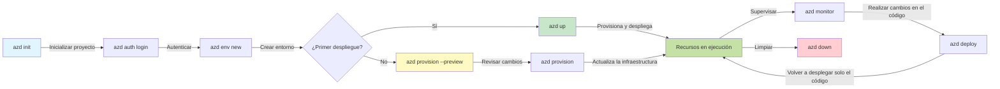
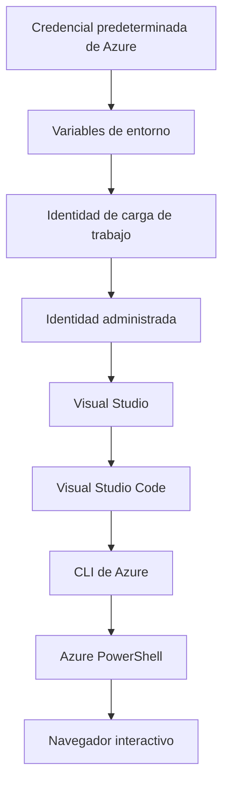

# AZD Basics - Understanding Azure Developer CLI

# AZD Basics - Core Concepts and Fundamentals

**Chapter Navigation:**
- **📚 Inicio del curso**: [AZD Para Principiantes](../../README.md)
- **📖 Capítulo actual**: Capítulo 1 - Fundación y Inicio Rápido
- **⬅️ Anterior**: [Descripción del curso](../../README.md#-chapter-1-foundation--quick-start)
- **➡️ Siguiente**: [Instalación y Configuración](installation.md)
- **🚀 Próximo capítulo**: [Capítulo 2: Desarrollo con enfoque en IA](../chapter-02-ai-development/microsoft-foundry-integration.md)

## Introducción

Esta lección te presenta Azure Developer CLI (azd), una poderosa herramienta de línea de comandos que acelera tu trayecto desde el desarrollo local hasta el despliegue en Azure. Aprenderás los conceptos fundamentales, las características principales y entenderás cómo azd simplifica el despliegue de aplicaciones nativas en la nube.

## Objetivos de aprendizaje

Al final de esta lección, podrás:
- Entender qué es Azure Developer CLI y su propósito principal
- Aprender los conceptos clave de plantillas, entornos y servicios
- Explorar características clave que incluyen desarrollo basado en plantillas e Infraestructura como Código
- Entender la estructura de un proyecto azd y el flujo de trabajo
- Estar preparado para instalar y configurar azd en tu entorno de desarrollo

## Resultados de aprendizaje

Después de completar esta lección, serás capaz de:
- Explicar el papel de azd en los flujos de trabajo modernos de desarrollo en la nube
- Identificar los componentes de la estructura de un proyecto azd
- Describir cómo las plantillas, los entornos y los servicios funcionan juntos
- Comprender los beneficios de Infraestructura como Código con azd
- Reconocer diferentes comandos de azd y sus propósitos

## ¿Qué es Azure Developer CLI (azd)?

Azure Developer CLI (azd) es una herramienta de línea de comandos diseñada para acelerar tu trayecto desde el desarrollo local hasta el despliegue en Azure. Simplifica el proceso de construir, desplegar y gestionar aplicaciones nativas en la nube en Azure.

### ¿Qué puedes desplegar con azd?

azd soporta una amplia gama de cargas de trabajo—y la lista sigue creciendo. Hoy puedes usar azd para desplegar:

| Tipo de carga de trabajo | Ejemplos | ¿Mismo flujo de trabajo? |
|---------------|----------|----------------|
| **Aplicaciones tradicionales** | Aplicaciones web, APIs REST, sitios estáticos | ✅ `azd up` |
| **Servicios y microservicios** | Container Apps, Function Apps, backends de múltiples servicios | ✅ `azd up` |
| **Aplicaciones con IA** | Aplicaciones de chat con Microsoft Foundry Models, soluciones RAG con AI Search | ✅ `azd up` |
| **Agentes inteligentes** | Agentes alojados en Foundry, orquestaciones multiagente | ✅ `azd up` |

La idea clave es que **el ciclo de vida de azd permanece igual sin importar qué estés desplegando**. Inicializas un proyecto, aprovisionas infraestructura, despliegas tu código, monitoreas tu aplicación y limpias—ya sea un sitio web simple o un agente de IA sofisticado.

Esta continuidad es intencional. azd trata las capacidades de IA como otro tipo de servicio que tu aplicación puede usar, no como algo fundamentalmente distinto. Un endpoint de chat respaldado por Microsoft Foundry Models es, desde la perspectiva de azd, simplemente otro servicio para configurar y desplegar.

### 🎯 ¿Por qué usar AZD? Una comparación del mundo real

Compararemos desplegar una aplicación web simple con base de datos:

#### ❌ SIN AZD: Despliegue manual en Azure (30+ minutos)

```bash
# Paso 1: Crear grupo de recursos
az group create --name myapp-rg --location eastus

# Paso 2: Crear Plan de App Service
az appservice plan create --name myapp-plan \
  --resource-group myapp-rg \
  --sku B1 --is-linux

# Paso 3: Crear aplicación web
az webapp create --name myapp-web-unique123 \
  --resource-group myapp-rg \
  --plan myapp-plan \
  --runtime "NODE:18-lts"

# Paso 4: Crear cuenta de Cosmos DB (10-15 minutos)
az cosmosdb create --name myapp-cosmos-unique123 \
  --resource-group myapp-rg \
  --kind MongoDB

# Paso 5: Crear base de datos
az cosmosdb mongodb database create \
  --account-name myapp-cosmos-unique123 \
  --resource-group myapp-rg \
  --name tododb

# Paso 6: Crear colección
az cosmosdb mongodb collection create \
  --account-name myapp-cosmos-unique123 \
  --resource-group myapp-rg \
  --database-name tododb \
  --name todos

# Paso 7: Obtener cadena de conexión
CONN_STR=$(az cosmosdb keys list \
  --name myapp-cosmos-unique123 \
  --resource-group myapp-rg \
  --type connection-strings \
  --query "connectionStrings[0].connectionString" -o tsv)

# Paso 8: Configurar ajustes de la aplicación
az webapp config appsettings set \
  --name myapp-web-unique123 \
  --resource-group myapp-rg \
  --settings MONGODB_URI="$CONN_STR"

# Paso 9: Habilitar el registro
az webapp log config --name myapp-web-unique123 \
  --resource-group myapp-rg \
  --application-logging filesystem \
  --detailed-error-messages true

# Paso 10: Configurar Application Insights
az monitor app-insights component create \
  --app myapp-insights \
  --location eastus \
  --resource-group myapp-rg

# Paso 11: Vincular Application Insights a la aplicación web
INSTRUMENTATION_KEY=$(az monitor app-insights component show \
  --app myapp-insights \
  --resource-group myapp-rg \
  --query "instrumentationKey" -o tsv)

az webapp config appsettings set \
  --name myapp-web-unique123 \
  --resource-group myapp-rg \
  --settings APPINSIGHTS_INSTRUMENTATIONKEY="$INSTRUMENTATION_KEY"

# Paso 12: Compilar la aplicación localmente
npm install
npm run build

# Paso 13: Crear paquete de implementación
zip -r app.zip . -x "*.git*" "node_modules/*"

# Paso 14: Desplegar la aplicación
az webapp deployment source config-zip \
  --resource-group myapp-rg \
  --name myapp-web-unique123 \
  --src app.zip

# Paso 15: Esperar y rezar para que funcione 🙏
# (No hay validación automatizada, se requieren pruebas manuales)
```

**Problemas:**
- ❌ 15+ comandos que recordar y ejecutar en orden
- ❌ 30-45 minutos de trabajo manual
- ❌ Fácil cometer errores (typos, parámetros incorrectos)
- ❌ Cadenas de conexión expuestas en el historial del terminal
- ❌ Sin retroceso automático si algo falla
- ❌ Difícil de replicar para los miembros del equipo
- ❌ Diferente cada vez (no reproducible)

#### ✅ CON AZD: Despliegue automatizado (5 comandos, 10-15 minutos)

```bash
# Paso 1: Inicializar desde la plantilla
azd init --template todo-nodejs-mongo

# Paso 2: Autenticar
azd auth login

# Paso 3: Crear el entorno
azd env new dev

# Paso 4: Previsualizar los cambios (opcional pero recomendado)
azd provision --preview

# Paso 5: Desplegar todo
azd up

# ✨ ¡Hecho! Todo está desplegado, configurado y monitorizado
```

**Beneficios:**
- ✅ **5 comandos** vs. 15+ pasos manuales
- ✅ **10-15 minutos** tiempo total (principalmente esperando a Azure)
- ✅ **Menos errores manuales** - flujo consistente basado en plantillas
- ✅ **Manejo seguro de secretos** - muchas plantillas usan almacenamiento de secretos gestionado por Azure
- ✅ **Despliegues repetibles** - mismo flujo cada vez
- ✅ **Totalmente reproducible** - mismo resultado cada vez
- ✅ **Listo para equipo** - cualquiera puede desplegar con los mismos comandos
- ✅ **Infraestructura como Código** - plantillas Bicep con control de versiones
- ✅ **Monitoreo integrado** - Application Insights configurado automáticamente

### 📊 Reducción de tiempo y errores

| Métrica | Despliegue manual | Despliegue con AZD | Mejora |
|:-------|:------------------|:---------------|:------------|
| **Comandos** | 15+ | 5 | 67% menos |
| **Tiempo** | 30-45 min | 10-15 min | 60% más rápido |
| **Tasa de error** | ~40% | <5% | 88% de reducción |
| **Consistencia** | Baja (manual) | 100% (automatizado) | Perfecta |
| **Incorporación de equipo** | 2-4 horas | 30 minutos | 75% más rápido |
| **Tiempo de rollback** | 30+ min (manual) | 2 min (automatizado) | 93% más rápido |

## Conceptos clave

### Plantillas
Las plantillas son la base de azd. Contienen:
- **Código de la aplicación** - Tu código fuente y dependencias
- **Definiciones de infraestructura** - Recursos de Azure definidos en Bicep o Terraform
- **Archivos de configuración** - Ajustes y variables de entorno
- **Scripts de despliegue** - Flujos de trabajo de despliegue automatizados

### Entornos
Los entornos representan diferentes destinos de despliegue:
- **Development** - Para pruebas y desarrollo
- **Staging** - Entorno de preproducción
- **Production** - Entorno de producción en vivo

Cada entorno mantiene su propio:
- Grupo de recursos de Azure
- Configuración
- Estado de despliegue

### Servicios
Los servicios son los bloques constructores de tu aplicación:
- **Frontend** - Aplicaciones web, SPAs
- **Backend** - APIs, microservicios
- **Base de datos** - Soluciones de almacenamiento de datos
- **Almacenamiento** - Almacenamiento de archivos y blobs

## Características clave

### 1. Desarrollo basado en plantillas
```bash
# Examinar las plantillas disponibles
azd template list

# Inicializar desde una plantilla
azd init --template <template-name>
```

### 2. Infraestructura como Código
- **Bicep** - Lenguaje específico de dominio de Azure
- **Terraform** - Herramienta de infraestructura multi-nube
- **ARM Templates** - Plantillas de Azure Resource Manager

### 3. Flujos de trabajo integrados
```bash
# Flujo de despliegue completo
azd up            # Aprovisionar + Desplegar sin intervención para la configuración inicial

# 🧪 NUEVO: Vista previa de los cambios en la infraestructura antes del despliegue (SEGURO)
azd provision --preview    # Simular el despliegue de infraestructura sin realizar cambios

azd provision     # Crear recursos de Azure: si actualizas la infraestructura, utiliza esto
azd deploy        # Desplegar el código de la aplicación o volver a desplegarlo después de una actualización
azd down          # Eliminar recursos
```

#### 🛡️ Planificación segura de infraestructura con Preview
El comando `azd provision --preview` es un cambio radical para despliegues seguros:
- **Análisis de simulación** - Muestra qué se creará, modificará o eliminará
- **Riesgo cero** - No se realizan cambios reales en tu entorno de Azure
- **Colaboración en equipo** - Comparte los resultados de la previsualización antes del despliegue
- **Estimación de costos** - Comprende los costos de los recursos antes de comprometerte

```bash
# Ejemplo de flujo de trabajo de vista previa
azd provision --preview           # Ver lo que cambiará
# Revisar el resultado, discutir con el equipo
azd provision                     # Aplicar los cambios con confianza
```

### 📊 Visual: Flujo de desarrollo de AZD


```mermaid
graph LR
    A[azd init] -->|Inicializar proyecto| B[azd auth login]
    B -->|Autenticar| C[azd env new]
    C -->|Crear entorno| D{¿Primer despliegue?}
    D -->|Sí| E[azd up]
    D -->|No| F[azd provision --preview]
    F -->|Revisar cambios| G[azd provision]
    E -->|Provisiona y despliega| H[Recursos en ejecución]
    G -->|Actualiza la infraestructura| H
    H -->|Supervisar| I[azd monitor]
    I -->|Realizar cambios en el código| J[azd deploy]
    J -->|Volver a desplegar solo el código| H
    H -->|Limpiar| K[azd down]
    
    style A fill:#e1f5fe
    style E fill:#c8e6c9
    style F fill:#fff9c4
    style H fill:#c5e1a5
    style K fill:#ffcdd2
```
**Explicación del flujo de trabajo:**
1. **Init** - Comienza con una plantilla o proyecto nuevo
2. **Auth** - Autenticar con Azure
3. **Environment** - Crea un entorno de despliegue aislado
4. **Preview** - 🆕 Siempre previsualiza los cambios de infraestructura primero (práctica segura)
5. **Provision** - Crear/actualizar recursos de Azure
6. **Deploy** - Subir tu código de aplicación
7. **Monitor** - Observar el rendimiento de la aplicación
8. **Iterate** - Realiza cambios y vuelve a desplegar el código
9. **Cleanup** - Elimina recursos cuando termines

### 4. Gestión de entornos
```bash
# Crear y administrar entornos
azd env new <environment-name>
azd env select <environment-name>
azd env list
```

### 5. Extensiones y comandos de IA

azd usa un sistema de extensiones para añadir capacidades más allá del CLI principal. Esto es especialmente útil para cargas de trabajo de IA:

```bash
# Listar extensiones disponibles
azd extension list

# Instalar la extensión Foundry agents
azd extension install azure.ai.agents

# Inicializar un proyecto de agente de IA a partir de un manifiesto
azd ai agent init -m agent-manifest.yaml

# Iniciar el servidor MCP para el desarrollo asistido por IA (Alfa)
azd mcp start
```

> Las extensiones se tratan en detalle en [Capítulo 2: Desarrollo con enfoque en IA](../chapter-02-ai-development/agents.md) y en la referencia de [Comandos AZD AI CLI](../chapter-08-production/production-ai-practices.md#azd-ai-cli-commands-and-extensions).

## 📁 Estructura del proyecto

Una estructura típica de proyecto azd:
```
my-app/
├── .azd/                    # azd configuration
│   └── config.json
├── .azure/                  # Azure deployment artifacts
├── .devcontainer/          # Development container config
├── .github/workflows/      # GitHub Actions
├── .vscode/               # VS Code settings
├── infra/                 # Infrastructure code
│   ├── main.bicep        # Main infrastructure template
│   ├── main.parameters.json
│   └── modules/          # Reusable modules
├── src/                  # Application source code
│   ├── api/             # Backend services
│   └── web/             # Frontend application
├── azure.yaml           # azd project configuration
└── README.md
```

## 🔧 Archivos de configuración

### azure.yaml
El archivo principal de configuración del proyecto:
```yaml
name: my-awesome-app
metadata:
  template: my-template@1.0.0

services:
  web:
    project: ./src/web
    language: js
    host: appservice
  api:
    project: ./src/api
    language: js
    host: appservice

hooks:
  preprovision:
    shell: pwsh
    run: echo "Preparing to provision..."
```

### .azure/config.json
Configuración específica del entorno:
```json
{
  "version": 1,
  "defaultEnvironment": "dev",
  "environments": {
    "dev": {
      "subscriptionId": "your-subscription-id",
      "location": "eastus"
    }
  }
}
```

## 🎪 Flujos de trabajo comunes con ejercicios prácticos

> **💡 Consejo de aprendizaje:** Sigue estos ejercicios en orden para desarrollar tus habilidades con AZD progresivamente.

### 🎯 Ejercicio 1: Inicializa tu primer proyecto

**Objetivo:** Crea un proyecto AZD y explora su estructura

**Pasos:**
```bash
# Usa una plantilla probada
azd init --template todo-nodejs-mongo

# Explora los archivos generados
ls -la  # Ver todos los archivos, incluidos los ocultos

# Archivos clave creados:
# - azure.yaml (configuración principal)
# - infra/ (código de infraestructura)
# - src/ (código de la aplicación)
```

**✅ Éxito:** Tienes azure.yaml y los directorios infra/ y src/

---

### 🎯 Ejercicio 2: Desplegar en Azure

**Objetivo:** Completar un despliegue de extremo a extremo

**Pasos:**
```bash
# 1. Autenticarse
az login && azd auth login

# 2. Crear entorno
azd env new dev
azd env set AZURE_LOCATION eastus

# 3. Previsualizar cambios (RECOMENDADO)
azd provision --preview

# 4. Desplegar todo
azd up

# 5. Verificar el despliegue
azd show    # Ver la URL de tu aplicación
```

**Tiempo estimado:** 10-15 minutos  
**✅ Éxito:** La URL de la aplicación se abre en el navegador

---

### 🎯 Ejercicio 3: Múltiples entornos

**Objetivo:** Desplegar en dev y staging

**Pasos:**
```bash
# Ya tenemos dev, crear staging
azd env new staging
azd env set AZURE_LOCATION westus2
azd up

# Alternar entre ellos
azd env list
azd env select dev
```

**✅ Éxito:** Dos grupos de recursos separados en el Portal de Azure

---

### 🛡️ Restablecer completamente: `azd down --force --purge`

Cuando necesitas reiniciar completamente:

```bash
azd down --force --purge
```

**Qué hace:**
- `--force`: Sin solicitudes de confirmación
- `--purge`: Elimina todo el estado local y los recursos de Azure

**Usar cuando:**
- El despliegue falló a mitad de camino
- Cambiar de proyecto
- Necesitas un nuevo comienzo

---

## 🎪 Referencia del flujo de trabajo original

### Iniciar un nuevo proyecto
```bash
# Método 1: Usar plantilla existente
azd init --template todo-nodejs-mongo

# Método 2: Empezar desde cero
azd init

# Método 3: Usar directorio actual
azd init .
```

### Ciclo de desarrollo
```bash
# Configurar el entorno de desarrollo
azd auth login
azd env new dev
azd env select dev

# Desplegar todo
azd up

# Hacer cambios y volver a desplegar
azd deploy

# Limpiar al terminar
azd down --force --purge # El comando en la Azure Developer CLI es un **restablecimiento completo** para tu entorno—especialmente útil cuando estás solucionando problemas de implementaciones fallidas, limpiando recursos huérfanos o preparándote para un redepliegue limpio.
```

## Entendiendo `azd down --force --purge`
El comando `azd down --force --purge` es una forma potente de eliminar por completo tu entorno azd y todos los recursos asociados. Aquí tienes un desglose de lo que hace cada bandera:
```
--force
```
- Omite las solicitudes de confirmación.
- Útil para automatización o scripting donde la entrada manual no es factible.
- Asegura que el desmontaje proceda sin interrupciones, incluso si el CLI detecta inconsistencias.

```
--purge
```
Elimina **todos los metadatos asociados**, incluyendo:
Estado del entorno
Carpeta local `.azure`
Información de despliegue en caché
Evita que azd "recuerde" despliegues previos, lo que puede causar problemas como grupos de recursos desajustados o referencias de registro obsoletas.


### ¿Por qué usar ambos?
Cuando te encuentras bloqueado con `azd up` debido a estado persistente o despliegues parciales, esta combinación asegura una **limpieza completa**.

Es especialmente útil después de eliminaciones manuales de recursos en el portal de Azure o al cambiar plantillas, entornos o convenciones de nombres de grupos de recursos.


### Gestión de múltiples entornos
```bash
# Crear entorno de staging
azd env new staging
azd env select staging
azd up

# Volver a desarrollo
azd env select dev

# Comparar entornos
azd env list
```

## 🔐 Autenticación y credenciales

Entender la autenticación es crucial para despliegues exitosos con azd. Azure usa múltiples métodos de autenticación, y azd aprovecha la misma cadena de credenciales utilizada por otras herramientas de Azure.

### Autenticación con Azure CLI (`az login`)

Antes de usar azd, necesitas autenticarte con Azure. El método más común es usar Azure CLI:

```bash
# Inicio de sesión interactivo (abre el navegador)
az login

# Iniciar sesión con un tenant específico
az login --tenant <tenant-id>

# Iniciar sesión con un principal de servicio
az login --service-principal -u <app-id> -p <password> --tenant <tenant-id>

# Comprobar el estado de inicio de sesión actual
az account show

# Listar suscripciones disponibles
az account list --output table

# Establecer suscripción predeterminada
az account set --subscription <subscription-id>
```

### Flujo de autenticación
1. **Inicio de sesión interactivo**: Abre tu navegador predeterminado para la autenticación
2. **Flujo de código de dispositivo**: Para entornos sin acceso a navegador
3. **Service Principal**: Para escenarios de automatización y CI/CD
4. **Managed Identity**: Para aplicaciones alojadas en Azure

### Cadena DefaultAzureCredential

`DefaultAzureCredential` es un tipo de credencial que proporciona una experiencia de autenticación simplificada al intentar automáticamente múltiples fuentes de credenciales en un orden específico:

#### Orden de la cadena de credenciales

```mermaid
graph TD
    A[Credencial predeterminada de Azure] --> B[Variables de entorno]
    B --> C[Identidad de carga de trabajo]
    C --> D[Identidad administrada]
    D --> E[Visual Studio]
    E --> F[Visual Studio Code]
    F --> G[CLI de Azure]
    G --> H[Azure PowerShell]
    H --> I[Navegador interactivo]
```
#### 1. Variables de entorno
```bash
# Establecer variables de entorno para el principal de servicio
export AZURE_CLIENT_ID="<app-id>"
export AZURE_CLIENT_SECRET="<password>"
export AZURE_TENANT_ID="<tenant-id>"
```

#### 2. Workload Identity (Kubernetes/GitHub Actions)
Usado automáticamente en:
- Azure Kubernetes Service (AKS) con Workload Identity
- GitHub Actions con federación OIDC
- Otros escenarios de identidad federada

#### 3. Managed Identity
Para recursos de Azure como:
- Máquinas virtuales
- App Service
- Azure Functions
- Container Instances

```bash
# Comprobar si se está ejecutando en un recurso de Azure con identidad administrada
az account show --query "user.type" --output tsv
# Devuelve: "servicePrincipal" si se está usando identidad administrada
```

#### 4. Integración con herramientas de desarrollo
- **Visual Studio**: Usa automáticamente la cuenta iniciada
- **VS Code**: Usa las credenciales de la extensión Azure Account
- **Azure CLI**: Usa las credenciales de `az login` (más común para desarrollo local)

### Configuración de autenticación de AZD

```bash
# Método 1: Usar Azure CLI (Recomendado para desarrollo)
az login
azd auth login  # Usa las credenciales existentes de Azure CLI

# Método 2: Autenticación directa con azd
azd auth login --use-device-code  # Para entornos sin interfaz gráfica

# Método 3: Comprobar el estado de autenticación
azd auth login --check-status

# Método 4: Cerrar sesión y volver a autenticarse
azd auth logout
azd auth login
```

### Mejores prácticas de autenticación

#### Para desarrollo local
```bash
# 1. Iniciar sesión con Azure CLI
az login

# 2. Verificar la suscripción correcta
az account show
az account set --subscription "Your Subscription Name"

# 3. Usar azd con credenciales existentes
azd auth login
```

#### Para pipelines CI/CD
```yaml
# GitHub Actions example
- name: Azure Login
  uses: azure/login@v1
  with:
    creds: ${{ secrets.AZURE_CREDENTIALS }}

- name: Deploy with azd
  run: |
    azd auth login --client-id ${{ secrets.AZURE_CLIENT_ID }} \
                    --client-secret ${{ secrets.AZURE_CLIENT_SECRET }} \
                    --tenant-id ${{ secrets.AZURE_TENANT_ID }}
    azd up --no-prompt
```

#### Para entornos de producción
- Usa **Managed Identity** cuando ejecutes en recursos de Azure
- Usa **Service Principal** para escenarios de automatización
- Evita almacenar credenciales en el código o en archivos de configuración
- Usa **Azure Key Vault** para configuraciones sensibles

### Problemas comunes de autenticación y soluciones

#### Problema: "No subscription found"
```bash
# Solución: Establecer la suscripción predeterminada
az account list --output table
az account set --subscription "<subscription-id>"
azd env set AZURE_SUBSCRIPTION_ID "<subscription-id>"
```

#### Problema: "Insufficient permissions"
```bash
# Solución: Verificar y asignar los roles requeridos
az role assignment list --assignee $(az account show --query user.name --output tsv)

# Roles requeridos comunes:
# - Colaborador (para la gestión de recursos)
# - Administrador de acceso de usuario (para asignaciones de roles)
```

#### Problema: "Token expired"
```bash
# Solución: volver a autenticarse
az logout
az login
azd auth logout
azd auth login
```

### Autenticación en diferentes escenarios

#### Desarrollo local
```bash
# Cuenta de desarrollo personal
az login
azd auth login
```

#### Desarrollo en equipo
```bash
# Usar un tenant específico para la organización
az login --tenant contoso.onmicrosoft.com
azd auth login
```

#### Escenarios multi-inquilino
```bash
# Cambiar entre inquilinos
az login --tenant tenant1.onmicrosoft.com
# Desplegar en el inquilino 1
azd up

az login --tenant tenant2.onmicrosoft.com  
# Desplegar en el inquilino 2
azd up
```

### Consideraciones de seguridad
1. **Almacenamiento de credenciales**: Nunca almacene credenciales en el código fuente
2. **Limitación del alcance**: Use el principio de menor privilegio para los principales de servicio
3. **Rotación de tokens**: Renueve regularmente los secretos de los principales de servicio
4. **Registro de auditoría**: Supervise las actividades de autenticación y despliegue
5. **Seguridad de red**: Use endpoints privados cuando sea posible

### Resolución de problemas de autenticación

```bash
# Depurar problemas de autenticación
azd auth login --check-status
az account show
az account get-access-token

# Comandos de diagnóstico comunes
whoami                          # Contexto del usuario actual
az ad signed-in-user show      # Detalles del usuario de Azure AD
az group list                  # Probar acceso al recurso
```

## Entendiendo `azd down --force --purge`

### Descubrimiento
```bash
azd template list              # Examinar plantillas
azd template show <template>   # Detalles de la plantilla
azd init --help               # Opciones de inicialización
```

### Gestión del proyecto
```bash
azd show                     # Resumen del proyecto
azd env list                # Entornos disponibles y predeterminado seleccionado
azd config show            # Ajustes de configuración
```

### Supervisión
```bash
azd monitor                  # Abrir la supervisión del portal de Azure
azd monitor --logs           # Ver registros de la aplicación
azd monitor --live           # Ver métricas en vivo
azd pipeline config          # Configurar CI/CD
```

## Mejores prácticas

### 1. Usar nombres significativos
```bash
# Bueno
azd env new production-east
azd init --template web-app-secure

# Evitar
azd env new env1
azd init --template template1
```

### 2. Aprovechar las plantillas
- Comience con plantillas existentes
- Personalice según sus necesidades
- Cree plantillas reutilizables para su organización

### 3. Aislamiento de entornos
- Use entornos separados para dev/staging/prod
- Nunca despliegue directamente a producción desde la máquina local
- Use pipelines de CI/CD para despliegues a producción

### 4. Gestión de configuración
- Use variables de entorno para datos sensibles
- Mantenga la configuración en control de versiones
- Documente la configuración específica de cada entorno

## Progresión de aprendizaje

### Principiante (Semana 1-2)
1. Instale azd y autentíquese
2. Despliegue una plantilla simple
3. Entienda la estructura del proyecto
4. Aprenda comandos básicos (up, down, deploy)

### Intermedio (Semana 3-4)
1. Personalice plantillas
2. Gestione múltiples entornos
3. Entienda el código de infraestructura
4. Configure pipelines de CI/CD

### Avanzado (Semana 5+)
1. Cree plantillas personalizadas
2. Patrones avanzados de infraestructura
3. Despliegues multirregión
4. Configuraciones de nivel empresarial

## Próximos pasos

**📖 Continúe el aprendizaje del Capítulo 1:**
- [Instalación y configuración](installation.md) - Instale y configure azd
- [Su primer proyecto](first-project.md) - Complete el tutorial práctico
- [Guía de configuración](configuration.md) - Opciones avanzadas de configuración

**🎯 ¿Listo para el siguiente capítulo?**
- [Capítulo 2: Desarrollo centrado en IA](../chapter-02-ai-development/microsoft-foundry-integration.md) - Comience a crear aplicaciones de IA

## Recursos adicionales

- [Descripción general de Azure Developer CLI](https://learn.microsoft.com/en-us/azure/developer/azure-developer-cli/)
- [Galería de plantillas](https://azure.github.io/awesome-azd/)
- [Ejemplos de la comunidad](https://github.com/Azure-Samples)

---

## 🙋 Preguntas frecuentes

### Preguntas generales

**Q: ¿Cuál es la diferencia entre AZD y Azure CLI?**

A: Azure CLI (`az`) sirve para gestionar recursos individuales de Azure. AZD (`azd`) sirve para gestionar aplicaciones completas:

```bash
# Azure CLI - gestión de recursos de bajo nivel
az webapp create --name myapp --resource-group rg
az sql server create --name myserver --resource-group rg
# ...se necesitan muchos más comandos

# AZD - gestión a nivel de aplicación
azd up  # Despliega la aplicación completa con todos los recursos
```

**Piense en esto así:**
- `az` = Operar sobre ladrillos de Lego individuales
- `azd` = Trabajar con conjuntos completos de Lego

---

**Q: ¿Necesito conocer Bicep o Terraform para usar AZD?**

A: ¡No! Comience con plantillas:
```bash
# Usa la plantilla existente: no se necesita conocimiento de IaC
azd init --template todo-nodejs-mongo
azd up
```

Puede aprender Bicep más adelante para personalizar la infraestructura. Las plantillas ofrecen ejemplos funcionales para aprender.

---

**Q: ¿Cuánto cuesta ejecutar plantillas de AZD?**

A: Los costos varían según la plantilla. La mayoría de las plantillas de desarrollo cuestan $50-150/mes:

```bash
# Previsualizar los costos antes de desplegar
azd provision --preview

# Siempre limpiar cuando no esté en uso
azd down --force --purge  # Elimina todos los recursos
```

**Consejo profesional:** Use los niveles gratuitos cuando estén disponibles:
- App Service: F1 (Free) tier
- Microsoft Foundry Models: Azure OpenAI 50,000 tokens/month free
- Cosmos DB: 1000 RU/s free tier

---

**Q: ¿Puedo usar AZD con recursos de Azure existentes?**

A: Sí, pero es más fácil empezar desde cero. AZD funciona mejor cuando gestiona todo el ciclo de vida. Para recursos existentes:

```bash
# Opción 1: Importar recursos existentes (avanzado)
azd init
# Luego modifica infra/ para referenciar recursos existentes

# Opción 2: Empezar desde cero (recomendado)
azd init --template matching-your-stack
azd up  # Crea un nuevo entorno
```

---

**Q: ¿Cómo comparto mi proyecto con compañeros?**

A: Haga commit del proyecto AZD en Git (pero NO la carpeta .azure):

```bash
# Ya está en .gitignore por defecto
.azure/        # Contiene secretos y datos del entorno
*.env          # Variables de entorno

# Miembros del equipo entonces:
git clone <your-repo>
azd auth login
azd env new <their-name>-dev
azd up
```

Todos obtienen una infraestructura idéntica a partir de las mismas plantillas.

---

### Preguntas de resolución de problemas

**Q: "azd up" falló a mitad de camino. What do I do?**

A: Revise el error, arréglelo y luego vuelva a intentarlo:

```bash
# Ver registros detallados
azd show

# Soluciones comunes:

# 1. Si se excede la cuota:
azd env set AZURE_LOCATION "westus2"  # Pruebe otra región

# 2. Si hay un conflicto de nombres de recursos:
azd down --force --purge  # Empezar desde cero
azd up  # Reintentar

# 3. Si la autenticación expiró:
az login
azd auth login
azd up
```

**Problema más común:** Suscripción de Azure seleccionada incorrecta
```bash
az account list --output table
az account set --subscription "<correct-subscription>"
```

---

**Q: ¿Cómo despliego solo cambios de código sin reprovisionar?**

A: Use `azd deploy` en lugar de `azd up`:

```bash
azd up          # Primera vez: aprovisionar + desplegar (lento)

# Haz cambios en el código...

azd deploy      # Las siguientes veces: solo desplegar (rápido)
```

Comparación de velocidad:
- `azd up`: 10-15 minutos (aprovisiona infraestructura)
- `azd deploy`: 2-5 minutos (solo código)

---

**Q: ¿Puedo personalizar las plantillas de infraestructura?**

A: ¡Sí! Edite los archivos Bicep en `infra/`:

```bash
# Después de azd init
cd infra/
code main.bicep  # Editar en VS Code

# Previsualizar cambios
azd provision --preview

# Aplicar cambios
azd provision
```

**Consejo:** Comience con cambios pequeños: cambie primero los SKUs:
```bicep
// infra/main.bicep
sku: {
  name: 'B1'  // Change to 'P1V2' for production
}
```

---

**Q: ¿Cómo elimino todo lo que AZD creó?**

A: Un comando elimina todos los recursos:

```bash
azd down --force --purge

# Esto elimina:
# - Todos los recursos de Azure
# - Grupo de recursos
# - Estado del entorno local
# - Datos de implementación en caché
```

**Ejecute esto siempre cuando:**
- Haya terminado de probar una plantilla
- Al cambiar a un proyecto diferente
- Quiera empezar desde cero

**Ahorro de costos:** Eliminar recursos no utilizados = $0 de cargos

---

**Q: ¿Qué pasa si accidentalmente eliminé recursos en el Portal de Azure?**

A: El estado de AZD puede desincronizarse. Enfoque de reinicio:

```bash
# 1. Eliminar el estado local
azd down --force --purge

# 2. Empezar desde cero
azd up

# Alternative: Dejar que AZD detecte y solucione
azd provision  # Creará los recursos faltantes
```

---

### Preguntas avanzadas

**Q: ¿Puedo usar AZD en pipelines de CI/CD?**

A: ¡Sí! Ejemplo de GitHub Actions:

```yaml
# .github/workflows/deploy.yml
name: Deploy with AZD

on:
  push:
    branches: [main]

jobs:
  deploy:
    runs-on: ubuntu-latest
    steps:
      - uses: actions/checkout@v2
      
      - name: Install azd
        run: curl -fsSL https://aka.ms/install-azd.sh | bash
      
      - name: Azure Login
        run: |
          azd auth login \
            --client-id ${{ secrets.AZURE_CLIENT_ID }} \
            --client-secret ${{ secrets.AZURE_CLIENT_SECRET }} \
            --tenant-id ${{ secrets.AZURE_TENANT_ID }}
      
      - name: Deploy
        run: azd up --no-prompt
```

---

**Q: ¿Cómo manejo secretos y datos sensibles?**

A: AZD se integra automáticamente con Azure Key Vault:

```bash
# Los secretos se almacenan en Key Vault, no en el código
azd env set DATABASE_PASSWORD "$(openssl rand -base64 32)"

# AZD automáticamente:
# 1. Crea Key Vault
# 2. Almacena el secreto
# 3. Otorga acceso a la aplicación mediante Identidad administrada
# 4. Inyecta en tiempo de ejecución
```

**Nunca haga commit de:**
- Carpeta `.azure/` (contiene datos del entorno)
- Archivos `.env` (secretos locales)
- Cadenas de conexión

---

**Q: ¿Puedo desplegar en múltiples regiones?**

A: Sí, cree un entorno por región:

```bash
# Entorno del este de EE. UU.
azd env new prod-eastus
azd env set AZURE_LOCATION eastus
azd up

# Entorno de Europa occidental
azd env new prod-westeurope
azd env set AZURE_LOCATION westeurope
azd up

# Cada entorno es independiente
azd env list
```

Para aplicaciones verdaderamente multirregión, personalice las plantillas Bicep para desplegar en múltiples regiones simultáneamente.

---

**Q: ¿Dónde puedo obtener ayuda si me quedo atascado?**

1. **Documentación de AZD:** https://learn.microsoft.com/azure/developer/azure-developer-cli/
2. **Issues de GitHub:** https://github.com/Azure/azure-dev/issues
3. **Discord:** [Azure Discord](https://discord.gg/microsoft-azure) - canal #azure-developer-cli
4. **Stack Overflow:** Etiqueta `azure-developer-cli`
5. **Este curso:** [Guía de resolución de problemas](../chapter-07-troubleshooting/common-issues.md)

**Consejo profesional:** Antes de preguntar, ejecute:
```bash
azd show       # Muestra el estado actual
azd version    # Muestra tu versión
```
Incluya esta información en su pregunta para obtener ayuda más rápida.

---

## 🎓 ¿Qué sigue?

Ahora comprende los fundamentos de AZD. Elija su camino:

### 🎯 Para principiantes:
1. **Siguiente:** [Instalación y configuración](installation.md) - Instale AZD en su máquina
2. **Luego:** [Su primer proyecto](first-project.md) - Despliegue su primera aplicación
3. **Práctica:** Complete los 3 ejercicios de esta lección

### 🚀 Para desarrolladores de IA:
1. **Saltar a:** [Capítulo 2: Desarrollo centrado en IA](../chapter-02-ai-development/microsoft-foundry-integration.md)
2. **Desplegar:** Comience con `azd init --template get-started-with-ai-chat`
3. **Aprenda:** Construya mientras despliega

### 🏗️ Para desarrolladores experimentados:
1. **Revisar:** [Guía de configuración](configuration.md) - Configuraciones avanzadas
2. **Explorar:** [Infraestructura como código](../chapter-04-infrastructure/provisioning.md) - Profundización en Bicep
3. **Construir:** Cree plantillas personalizadas para su pila

---

**Navegación del capítulo:**
- **📚 Inicio del curso**: [AZD para principiantes](../../README.md)
- **📖 Capítulo actual**: Capítulo 1 - Fundamentos y Inicio rápido  
- **⬅️ Anterior**: [Descripción del curso](../../README.md#-chapter-1-foundation--quick-start)
- **➡️ Siguiente**: [Instalación y configuración](installation.md)
- **🚀 Siguiente capítulo**: [Capítulo 2: Desarrollo centrado en IA](../chapter-02-ai-development/microsoft-foundry-integration.md)

---

<!-- CO-OP TRANSLATOR DISCLAIMER START -->
**Descargo de responsabilidad**:
Este documento ha sido traducido utilizando el servicio de traducción por IA [Co-op Translator](https://github.com/Azure/co-op-translator). Si bien nos esforzamos por la exactitud, tenga en cuenta que las traducciones automatizadas pueden contener errores o inexactitudes. El documento original en su idioma nativo debe considerarse la fuente autorizada. Para información crítica, se recomienda una traducción profesional realizada por humanos. No nos hacemos responsables de ningún malentendido o interpretación errónea que surja del uso de esta traducción.
<!-- CO-OP TRANSLATOR DISCLAIMER END -->