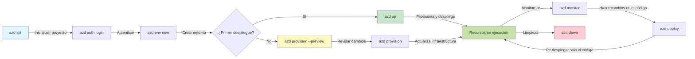
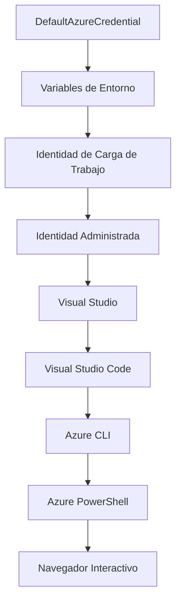

# AZD Básicos - Entendiendo Azure Developer CLI

# AZD Básicos - Conceptos y Fundamentos Clave

**Navegación del Capítulo:**
- **📚 Inicio del Curso**: [AZD Para Principiantes](../../README.md)
- **📖 Capítulo Actual**: Capítulo 1 - Fundación & Inicio Rápido
- **⬅️ Anterior**: [Resumen del Curso](../../README.md#-chapter-1-foundation--quick-start)
- **➡️ Siguiente**: [Instalación y Configuración](installation.md)
- **🚀 Próximo Capítulo**: [Capítulo 2: Desarrollo con IA como Prioridad](../chapter-02-ai-development/microsoft-foundry-integration.md)

## Introducción

Esta lección te introduce a Azure Developer CLI (azd), una potente herramienta de línea de comandos que acelera tu recorrido desde el desarrollo local hasta el despliegue en Azure. Aprenderás los conceptos fundamentales, las características principales y entenderás cómo azd simplifica el despliegue de aplicaciones nativas en la nube.

## Objetivos de Aprendizaje

Al final de esta lección, podrás:
- Entender qué es Azure Developer CLI y su propósito principal
- Aprender los conceptos básicos de plantillas, entornos y servicios
- Explorar características clave incluyendo desarrollo basado en plantillas e Infraestructura como Código
- Comprender la estructura y flujo de trabajo de un proyecto azd
- Estar preparado para instalar y configurar azd en tu entorno de desarrollo

## Resultados de Aprendizaje

Después de completar esta lección, podrás:
- Explicar el rol de azd en flujos de trabajo modernos de desarrollo en la nube
- Identificar los componentes de una estructura de proyecto azd
- Describir cómo trabajan conjuntamente las plantillas, entornos y servicios
- Entender los beneficios de Infraestructura como Código con azd
- Reconocer los diferentes comandos azd y sus propósitos

## ¿Qué es Azure Developer CLI (azd)?

Azure Developer CLI (azd) es una herramienta de línea de comandos diseñada para acelerar tu camino desde el desarrollo local hasta el despliegue en Azure. Simplifica el proceso de construcción, despliegue y gestión de aplicaciones nativas en la nube sobre Azure.

### ¿Qué puedes desplegar con azd?

azd soporta una amplia variedad de cargas de trabajo — y la lista continúa creciendo. Hoy puedes usar azd para desplegar:

| Tipo de Carga de Trabajo | Ejemplos | ¿Mismo flujo de trabajo? |
|--------------------------|----------|--------------------------|
| **Aplicaciones tradicionales** | Aplicaciones web, APIs REST, sitios estáticos | ✅ `azd up` |
| **Servicios y microservicios** | Container Apps, Function Apps, backends multi-servicio | ✅ `azd up` |
| **Aplicaciones potenciadas por IA** | Aplicaciones de chat con Modelos Microsoft Foundry, soluciones RAG con Búsqueda IA | ✅ `azd up` |
| **Agentes inteligentes** | Agentes hospedados en Foundry, orquestaciones multi-agente | ✅ `azd up` |

La clave es que **el ciclo de vida de azd permanece igual sin importar qué estés desplegando**. Inicializas un proyecto, provisiones infraestructura, despliegas tu código, monitoreas tu aplicación y limpias — ya sea un sitio web simple o un agente de IA sofisticado.

Esta continuidad es intencional. azd trata las capacidades de IA como otro tipo de servicio que tu aplicación puede usar, no como algo fundamentalmente diferente. Un endpoint de chat respaldado por Modelos Microsoft Foundry es, desde la perspectiva de azd, solo otro servicio para configurar y desplegar.

### 🎯 ¿Por qué usar AZD? Comparación del mundo real

Comparemos desplegar una aplicación web simple con base de datos:

#### ❌ SIN AZD: Despliegue manual en Azure (más de 30 minutos)

```bash
# Paso 1: Crear grupo de recursos
az group create --name myapp-rg --location eastus

# Paso 2: Crear Plan de Servicio de Aplicaciones
az appservice plan create --name myapp-plan \
  --resource-group myapp-rg \
  --sku B1 --is-linux

# Paso 3: Crear Aplicación Web
az webapp create --name myapp-web-unique123 \
  --resource-group myapp-rg \
  --plan myapp-plan \
  --runtime "NODE:18-lts"

# Paso 4: Crear cuenta de Cosmos DB (10-15 minutos)
az cosmosdb create --name myapp-cosmos-unique123 \
  --resource-group myapp-rg \
  --kind MongoDB

# Paso 5: Crear base de datos
az cosmosdb mongodb database create \
  --account-name myapp-cosmos-unique123 \
  --resource-group myapp-rg \
  --name tododb

# Paso 6: Crear colección
az cosmosdb mongodb collection create \
  --account-name myapp-cosmos-unique123 \
  --resource-group myapp-rg \
  --database-name tododb \
  --name todos

# Paso 7: Obtener cadena de conexión
CONN_STR=$(az cosmosdb keys list \
  --name myapp-cosmos-unique123 \
  --resource-group myapp-rg \
  --type connection-strings \
  --query "connectionStrings[0].connectionString" -o tsv)

# Paso 8: Configurar ajustes de la aplicación
az webapp config appsettings set \
  --name myapp-web-unique123 \
  --resource-group myapp-rg \
  --settings MONGODB_URI="$CONN_STR"

# Paso 9: Habilitar registro
az webapp log config --name myapp-web-unique123 \
  --resource-group myapp-rg \
  --application-logging filesystem \
  --detailed-error-messages true

# Paso 10: Configurar Application Insights
az monitor app-insights component create \
  --app myapp-insights \
  --location eastus \
  --resource-group myapp-rg

# Paso 11: Vincular App Insights con la Aplicación Web
INSTRUMENTATION_KEY=$(az monitor app-insights component show \
  --app myapp-insights \
  --resource-group myapp-rg \
  --query "instrumentationKey" -o tsv)

az webapp config appsettings set \
  --name myapp-web-unique123 \
  --resource-group myapp-rg \
  --settings APPINSIGHTS_INSTRUMENTATIONKEY="$INSTRUMENTATION_KEY"

# Paso 12: Construir la aplicación localmente
npm install
npm run build

# Paso 13: Crear paquete de despliegue
zip -r app.zip . -x "*.git*" "node_modules/*"

# Paso 14: Desplegar aplicación
az webapp deployment source config-zip \
  --resource-group myapp-rg \
  --name myapp-web-unique123 \
  --src app.zip

# Paso 15: Esperar y rezar que funcione 🙏
# (No hay validación automática, se requiere prueba manual)
```

**Problemas:**
- ❌ Más de 15 comandos para recordar y ejecutar en orden
- ❌ 30-45 minutos de trabajo manual
- ❌ Fácil cometer errores (errores tipográficos, parámetros incorrectos)
- ❌ Cadenas de conexión expuestas en el historial del terminal
- ❌ Sin reversión automática si algo falla
- ❌ Difícil replicar para miembros del equipo
- ❌ Diferente cada vez (no reproducible)

#### ✅ CON AZD: Despliegue automatizado (5 comandos, 10-15 minutos)

```bash
# Paso 1: Inicializar desde plantilla
azd init --template todo-nodejs-mongo

# Paso 2: Autenticar
azd auth login

# Paso 3: Crear entorno
azd env new dev

# Paso 4: Previsualizar cambios (opcional pero recomendado)
azd provision --preview

# Paso 5: Desplegar todo
azd up

# ✨ ¡Hecho! Todo está desplegado, configurado y monitorizado
```

**Beneficios:**
- ✅ **5 comandos** vs. más de 15 pasos manuales
- ✅ **10-15 minutos** de tiempo total (mayormente esperando Azure)
- ✅ **Cero errores** - automatizado y probado
- ✅ **Secretos gestionados de forma segura** vía Key Vault
- ✅ **Reversión automática** ante fallos
- ✅ **Completamente reproducible** - mismo resultado cada vez
- ✅ **Listo para equipos** - cualquier persona puede desplegar con los mismos comandos
- ✅ **Infraestructura como Código** - plantillas Bicep versionadas
- ✅ **Monitoreo incorporado** - Application Insights configurado automáticamente

### 📊 Reducción de tiempo y errores

| Métrica | Despliegue Manual | Despliegue AZD | Mejora |
|:--------|:------------------|:---------------|:--------|
| **Comandos** | 15+ | 5 | 67% menos |
| **Tiempo** | 30-45 min | 10-15 min | 60% más rápido |
| **Tasa de error** | ~40% | <5% | 88% menos |
| **Consistencia** | Baja (manual) | 100% (automatizado) | Perfecta |
| **Incorporación de equipo** | 2-4 horas | 30 minutos | 75% más rápido |
| **Tiempo de reversión** | 30+ min (manual) | 2 min (automatizado) | 93% más rápido |

## Conceptos Clave

### Plantillas
Las plantillas son la base de azd. Contienen:
- **Código de aplicación** - Tu código fuente y dependencias
- **Definiciones de infraestructura** - Recursos de Azure definidos en Bicep o Terraform
- **Archivos de configuración** - Configuraciones y variables de entorno
- **Scripts de despliegue** - Flujos de trabajo automatizados de despliegue

### Entornos
Los entornos representan diferentes objetivos de despliegue:
- **Desarrollo** - Para pruebas y desarrollo
- **Staging** - Entorno pre-producción
- **Producción** - Entorno de producción en vivo

Cada entorno mantiene su propio:
- Grupo de recursos de Azure
- Configuración
- Estado de despliegue

### Servicios
Los servicios son los bloques constructores de tu aplicación:
- **Frontend** - Aplicaciones web, SPA
- **Backend** - APIs, microservicios
- **Base de datos** - Soluciones de almacenamiento de datos
- **Almacenamiento** - Almacenamiento de archivos y blobs

## Características Clave

### 1. Desarrollo basado en plantillas
```bash
# Navegar por las plantillas disponibles
azd template list

# Inicializar desde una plantilla
azd init --template <template-name>
```

### 2. Infraestructura como Código
- **Bicep** - Lenguaje específico de dominio de Azure
- **Terraform** - Herramienta de infraestructura multi-nube
- **Plantillas ARM** - Plantillas de Azure Resource Manager

### 3. Flujos de trabajo integrados
```bash
# Flujo de trabajo de despliegue completo
azd up            # Provisionar + Desplegar esto es automático para la configuración inicial

# 🧪 NUEVO: Vista previa de cambios en la infraestructura antes del despliegue (SEGURO)
azd provision --preview    # Simular el despliegue de infraestructura sin hacer cambios

azd provision     # Crear recursos de Azure si actualizas la infraestructura usa esto
azd deploy        # Desplegar código de la aplicación o volver a desplegar el código una vez actualizado
azd down          # Limpiar recursos
```

#### 🛡️ Planificación segura de infraestructura con vista previa
El comando `azd provision --preview` es un cambio radical para despliegues seguros:
- **Análisis Dry-run** - Muestra qué se creará, modificará o eliminará
- **Cero riesgo** - No se hacen cambios reales en tu entorno Azure
- **Colaboración en equipo** - Comparte resultados de vista previa antes del despliegue
- **Estimación de costos** - Entiende los costos de recursos antes de confirmar

```bash
# Ejemplo de flujo de trabajo de vista previa
azd provision --preview           # Ver qué cambiará
# Revisar el resultado, discutir con el equipo
azd provision                     # Aplicar cambios con confianza
```

### 📊 Visual: Flujo de trabajo de desarrollo AZD


```mermaid
graph LR
    A[azd init] -->|Inicializar proyecto| B[azd auth login]
    B -->|Autenticar| C[azd env new]
    C -->|Crear entorno| D{¿Primer despliegue?}
    D -->|Sí| E[azd up]
    D -->|No| F[azd provision --preview]
    F -->|Revisar cambios| G[azd provision]
    E -->|Provisiona y despliega| H[Recursos en ejecución]
    G -->|Actualiza infraestructura| H
    H -->|Monitorear| I[azd monitor]
    I -->|Hacer cambios en el código| J[azd deploy]
    J -->|Re desplegar solo el código| H
    H -->|Limpieza| K[azd down]
    
    style A fill:#e1f5fe
    style E fill:#c8e6c9
    style F fill:#fff9c4
    style H fill:#c5e1a5
    style K fill:#ffcdd2
```
**Explicación del flujo de trabajo:**
1. **Init** - Comienza con plantilla o proyecto nuevo
2. **Auth** - Autenticación con Azure
3. **Environment** - Crear entorno de despliegue aislado
4. **Preview** - 🆕 Siempre vista previa de cambios de infraestructura primero (práctica segura)
5. **Provision** - Crear/actualizar recursos de Azure
6. **Deploy** - Subir el código de tu aplicación
7. **Monitor** - Observar el rendimiento de la aplicación
8. **Iterate** - Realiza cambios y vuelve a desplegar código
9. **Cleanup** - Eliminar recursos cuando termines

### 4. Gestión de entornos
```bash
# Crear y gestionar entornos
azd env new <environment-name>
azd env select <environment-name>
azd env list
```

### 5. Extensiones y comandos AI

azd usa un sistema de extensiones para añadir capacidades más allá del CLI base. Esto es especialmente útil para cargas de trabajo con IA:

```bash
# Listar extensiones disponibles
azd extension list

# Instalar la extensión de agentes Foundry
azd extension install azure.ai.agents

# Inicializar un proyecto de agente de IA desde un manifiesto
azd ai agent init -m agent-manifest.yaml

# Iniciar el servidor MCP para desarrollo asistido por IA (Alfa)
azd mcp start
```

> Las extensiones se cubren en detalle en [Capítulo 2: Desarrollo con IA como Prioridad](../chapter-02-ai-development/agents.md) y en la referencia de [Comandos AZD AI CLI](../chapter-08-production/production-ai-practices.md#azd-ai-cli-commands-and-extensions).

## 📁 Estructura del Proyecto

Una estructura típica de proyecto azd:
```
my-app/
├── .azd/                    # azd configuration
│   └── config.json
├── .azure/                  # Azure deployment artifacts
├── .devcontainer/          # Development container config
├── .github/workflows/      # GitHub Actions
├── .vscode/               # VS Code settings
├── infra/                 # Infrastructure code
│   ├── main.bicep        # Main infrastructure template
│   ├── main.parameters.json
│   └── modules/          # Reusable modules
├── src/                  # Application source code
│   ├── api/             # Backend services
│   └── web/             # Frontend application
├── azure.yaml           # azd project configuration
└── README.md
```

## 🔧 Archivos de configuración

### azure.yaml
El archivo principal de configuración del proyecto:
```yaml
name: my-awesome-app
metadata:
  template: my-template@1.0.0

services:
  web:
    project: ./src/web
    language: js
    host: appservice
  api:
    project: ./src/api
    language: js
    host: appservice

hooks:
  preprovision:
    shell: pwsh
    run: echo "Preparing to provision..."
```

### .azure/config.json
Configuración específica del entorno:
```json
{
  "version": 1,
  "defaultEnvironment": "dev",
  "environments": {
    "dev": {
      "subscriptionId": "your-subscription-id",
      "location": "eastus"
    }
  }
}
```

## 🎪 Flujos de trabajo comunes con ejercicios prácticos

> **💡 Consejo de aprendizaje:** Sigue estos ejercicios en orden para desarrollar tus habilidades con AZD de forma progresiva.

### 🎯 Ejercicio 1: Inicializa tu primer proyecto

**Objetivo:** Crear un proyecto AZD y explorar su estructura

**Pasos:**
```bash
# Usa una plantilla probada
azd init --template todo-nodejs-mongo

# Explora los archivos generados
ls -la  # Ver todos los archivos incluyendo los ocultos

# Archivos clave creados:
# - azure.yaml (configuración principal)
# - infra/ (código de infraestructura)
# - src/ (código de la aplicación)
```

**✅ Éxito:** Tienes directorios azure.yaml, infra/ y src/

---

### 🎯 Ejercicio 2: Desplegar en Azure

**Objetivo:** Completar un despliegue de extremo a extremo

**Pasos:**
```bash
# 1. Autenticar
az login && azd auth login

# 2. Crear entorno
azd env new dev
azd env set AZURE_LOCATION eastus

# 3. Previsualizar cambios (RECOMENDADO)
azd provision --preview

# 4. Desplegar todo
azd up

# 5. Verificar despliegue
azd show    # Ver la URL de tu aplicación
```

**Tiempo esperado:** 10-15 minutos  
**✅ Éxito:** La URL de la aplicación se abre en el navegador

---

### 🎯 Ejercicio 3: Múltiples entornos

**Objetivo:** Desplegar en dev y staging

**Pasos:**
```bash
# Ya tiene dev, crear staging
azd env new staging
azd env set AZURE_LOCATION westus2
azd up

# Cambiar entre ellos
azd env list
azd env select dev
```

**✅ Éxito:** Dos grupos de recursos separados en el Portal Azure

---

### 🛡️ Reset completo: `azd down --force --purge`

Cuando necesites reiniciar completamente:

```bash
azd down --force --purge
```

**Qué hace:**
- `--force`: Sin pedir confirmaciones
- `--purge`: Borra todo el estado local y recursos en Azure

**Usar cuando:**
- Despliegue falló a mitad de camino
- Cambiando de proyecto
- Necesitas empezar de nuevo

---

## 🎪 Referencia de flujo de trabajo original

### Iniciando un nuevo proyecto
```bash
# Método 1: Usar plantilla existente
azd init --template todo-nodejs-mongo

# Método 2: Empezar desde cero
azd init

# Método 3: Usar el directorio actual
azd init .
```

### Ciclo de desarrollo
```bash
# Configurar el entorno de desarrollo
azd auth login
azd env new dev
azd env select dev

# Desplegar todo
azd up

# Hacer cambios y volver a desplegar
azd deploy

# Limpiar cuando hayas terminado
azd down --force --purge # el comando en Azure Developer CLI es un **reinicio completo** para tu entorno—especialmente útil cuando estás solucionando despliegues fallidos, limpiando recursos huérfanos o preparando una nueva implementación.
```

## Entendiendo `azd down --force --purge`
El comando `azd down --force --purge` es una forma poderosa de desmantelar completamente tu entorno azd y todos los recursos asociados. Aquí un desglose de lo que hace cada bandera:
```
--force
```
- Omite las solicitudes de confirmación.
- Útil para automatización o scripting donde la entrada manual no es factible.
- Asegura que el desmantelamiento proceda sin interrupciones, incluso si el CLI detecta inconsistencias.

```
--purge
```
Borra **todos los metadatos asociados**, incluyendo:
Estado del entorno
Carpeta local `.azure`
Información en caché de despliegue
Previene que azd “recuerde” despliegues previos, los cuales pueden causar problemas como grupos de recursos desfasados o referencias a registros obsoletos.

### ¿Por qué usar ambos?
Cuando te quedas atascado con `azd up` debido a estado persistente o despliegues parciales, esta combinación asegura un **estado limpio**.

Es especialmente útil después de eliminar recursos manualmente en el portal de Azure o cuando cambias plantillas, entornos o convenciones de nombres de grupos de recursos.

### Gestión de múltiples entornos
```bash
# Crear entorno de staging
azd env new staging
azd env select staging
azd up

# Volver a dev
azd env select dev

# Comparar entornos
azd env list
```

## 🔐 Autenticación y Credenciales

Entender la autenticación es crucial para desplegar con éxito con azd. Azure usa múltiples métodos de autenticación, y azd utiliza la misma cadena de credenciales usada por otras herramientas de Azure.

### Autenticación con Azure CLI (`az login`)

Antes de usar azd, necesitas autenticarte con Azure. El método más común es usar Azure CLI:

```bash
# Inicio de sesión interactivo (abre el navegador)
az login

# Iniciar sesión con un inquilino específico
az login --tenant <tenant-id>

# Iniciar sesión con principal de servicio
az login --service-principal -u <app-id> -p <password> --tenant <tenant-id>

# Verificar estado de sesión actual
az account show

# Listar suscripciones disponibles
az account list --output table

# Establecer suscripción predeterminada
az account set --subscription <subscription-id>
```

### Flujo de autenticación
1. **Ingreso interactivo**: Abre tu navegador predeterminado para autenticación
2. **Flujo de código de dispositivo**: Para entornos sin acceso a navegador
3. **Service Principal**: Para automatización y escenarios CI/CD
4. **Identidad gestionada**: Para aplicaciones hospedadas en Azure

### Cadena DefaultAzureCredential

`DefaultAzureCredential` es un tipo de credencial que provee una experiencia simplificada intentando automáticamente múltiples fuentes de credenciales en un orden específico:

#### Orden de la cadena de credenciales

```mermaid
graph TD
    A[DefaultAzureCredential] --> B[Variables de Entorno]
    B --> C[Identidad de Carga de Trabajo]
    C --> D[Identidad Administrada]
    D --> E[Visual Studio]
    E --> F[Visual Studio Code]
    F --> G[Azure CLI]
    G --> H[Azure PowerShell]
    H --> I[Navegador Interactivo]
```
#### 1. Variables de Entorno
```bash
# Establecer variables de entorno para el principal del servicio
export AZURE_CLIENT_ID="<app-id>"
export AZURE_CLIENT_SECRET="<password>"
export AZURE_TENANT_ID="<tenant-id>"
```

#### 2. Identidad de carga de trabajo (Kubernetes/GitHub Actions)
Usado automáticamente en:
- Azure Kubernetes Service (AKS) con Identidad de carga de trabajo
- GitHub Actions con federación OIDC
- Otros escenarios de identidad federada

#### 3. Identidad Gestionada
Para recursos de Azure como:
- Máquinas Virtuales
- App Service
- Azure Functions
- Container Instances

```bash
# Verifica si se está ejecutando en un recurso de Azure con identidad administrada
az account show --query "user.type" --output tsv
# Devuelve: "servicePrincipal" si se está utilizando identidad administrada
```

#### 4. Integración con herramientas de desarrollo
- **Visual Studio**: Usa automáticamente la cuenta autenticada
- **VS Code**: Usa credenciales de la extensión Azure Account
- **Azure CLI**: Usa credenciales de `az login` (más común para desarrollo local)

### Configuración de autenticación AZD

```bash
# Método 1: Usar Azure CLI (Recomendado para desarrollo)
az login
azd auth login  # Usa las credenciales existentes de Azure CLI

# Método 2: Autenticación directa con azd
azd auth login --use-device-code  # Para entornos sin interfaz gráfica

# Método 3: Verificar estado de autenticación
azd auth login --check-status

# Método 4: Cerrar sesión y volver a autenticarse
azd auth logout
azd auth login
```

### Mejores prácticas de autenticación

#### Para desarrollo local
```bash
# 1. Iniciar sesión con Azure CLI
az login

# 2. Verificar la suscripción correcta
az account show
az account set --subscription "Your Subscription Name"

# 3. Usar azd con credenciales existentes
azd auth login
```

#### Para pipelines CI/CD
```yaml
# GitHub Actions example
- name: Azure Login
  uses: azure/login@v1
  with:
    creds: ${{ secrets.AZURE_CREDENTIALS }}

- name: Deploy with azd
  run: |
    azd auth login --client-id ${{ secrets.AZURE_CLIENT_ID }} \
                    --client-secret ${{ secrets.AZURE_CLIENT_SECRET }} \
                    --tenant-id ${{ secrets.AZURE_TENANT_ID }}
    azd up --no-prompt
```

#### Para entornos de producción
- Usa **Identidad gestionada** cuando corras en recursos Azure
- Usa **Service Principal** para escenarios de automatización
- Evita almacenar credenciales en código o archivos de configuración
- Usa **Azure Key Vault** para configuración sensible

### Problemas comunes de autenticación y soluciones

#### Problema: "No se encontró suscripción"
```bash
# Solución: Establecer suscripción predeterminada
az account list --output table
az account set --subscription "<subscription-id>"
azd env set AZURE_SUBSCRIPTION_ID "<subscription-id>"
```

#### Problema: "Permisos insuficientes"
```bash
# Solución: Verificar y asignar los roles requeridos
az role assignment list --assignee $(az account show --query user.name --output tsv)

# Roles requeridos comunes:
# - Contribuyente (para la gestión de recursos)
# - Administrador de acceso de usuarios (para asignaciones de roles)
```

#### Problema: "Token expirado"
```bash
# Solución: Re-autenticar
az logout
az login
azd auth logout
azd auth login
```

### Autenticación en diferentes escenarios

#### Desarrollo local
```bash
# Cuenta de desarrollo personal
az login
azd auth login
```

#### Desarrollo en equipo
```bash
# Use un inquilino específico para la organización
az login --tenant contoso.onmicrosoft.com
azd auth login
```

#### Escenarios multi-tenant
```bash
# Cambiar entre inquilinos
az login --tenant tenant1.onmicrosoft.com
# Desplegar al inquilino 1
azd up

az login --tenant tenant2.onmicrosoft.com  
# Desplegar al inquilino 2
azd up
```

### Consideraciones de seguridad
1. **Almacenamiento de Credenciales**: Nunca almacene credenciales en el código fuente  
2. **Limitación de Alcance**: Use el principio de menor privilegio para los principales de servicio  
3. **Rotación de Tokens**: Rote regularmente los secretos del principal de servicio  
4. **Registro de Auditoría**: Monitoree actividades de autenticación y despliegue  
5. **Seguridad de Red**: Use puntos finales privados cuando sea posible  

### Solución de Problemas de Autenticación

```bash
# Depurar problemas de autenticación
azd auth login --check-status
az account show
az account get-access-token

# Comandos comunes de diagnóstico
whoami                          # Contexto del usuario actual
az ad signed-in-user show      # Detalles del usuario de Azure AD
az group list                  # Probar acceso al recurso
```
  
## Entendiendo `azd down --force --purge`  

### Descubrimiento  
```bash
azd template list              # Navegar por plantillas
azd template show <template>   # Detalles de la plantilla
azd init --help               # Opciones de inicialización
```
  
### Gestión de Proyectos  
```bash
azd show                     # Resumen del proyecto
azd env show                 # Entorno actual
azd config list             # Configuración de ajustes
```
  
### Monitoreo  
```bash
azd monitor                  # Abrir la monitorización del portal de Azure
azd monitor --logs           # Ver registros de la aplicación
azd monitor --live           # Ver métricas en vivo
azd pipeline config          # Configurar CI/CD
```
  
## Mejores Prácticas  

### 1. Use Nombres Significativos  
```bash
# Bueno
azd env new production-east
azd init --template web-app-secure

# Evitar
azd env new env1
azd init --template template1
```
  
### 2. Aproveche las Plantillas  
- Comience con plantillas existentes  
- Personalice según sus necesidades  
- Cree plantillas reutilizables para su organización  

### 3. Aislamiento del Entorno  
- Use entornos separados para desarrollo/pruebas/producción  
- Nunca despliegue directamente a producción desde la máquina local  
- Use pipelines CI/CD para despliegues en producción  

### 4. Gestión de Configuración  
- Use variables de entorno para datos sensibles  
- Mantenga la configuración en control de versiones  
- Documente configuraciones específicas de cada entorno  

## Progresión de Aprendizaje  

### Principiante (Semana 1-2)  
1. Instale azd y autentíquese  
2. Despliegue una plantilla simple  
3. Entienda la estructura del proyecto  
4. Aprenda comandos básicos (up, down, deploy)  

### Intermedio (Semana 3-4)  
1. Personalice plantillas  
2. Administre múltiples entornos  
3. Comprenda el código de infraestructura  
4. Configure pipelines CI/CD  

### Avanzado (Semana 5+)  
1. Cree plantillas personalizadas  
2. Patrones avanzados de infraestructura  
3. Despliegues multi-región  
4. Configuraciones de nivel empresarial  

## Próximos Pasos  

**📖 Continúe el aprendizaje del Capítulo 1:**  
- [Instalación y Configuración](installation.md) - Instale y configure azd  
- [Su Primer Proyecto](first-project.md) - Complete el tutorial práctico  
- [Guía de Configuración](configuration.md) - Opciones avanzadas de configuración  

**🎯 ¿Listo para el siguiente capítulo?**  
- [Capítulo 2: Desarrollo con enfoque en IA](../chapter-02-ai-development/microsoft-foundry-integration.md) - Comience a crear aplicaciones de IA  

## Recursos Adicionales  

- [Resumen de Azure Developer CLI](https://learn.microsoft.com/en-us/azure/developer/azure-developer-cli/)  
- [Galería de Plantillas](https://azure.github.io/awesome-azd/)  
- [Ejemplos de la Comunidad](https://github.com/Azure-Samples)  

---

## 🙋 Preguntas Frecuentes  

### Preguntas Generales  

**P: ¿Cuál es la diferencia entre AZD y Azure CLI?**  

R: Azure CLI (`az`) es para administrar recursos individuales de Azure. AZD (`azd`) es para administrar aplicaciones completas:  

```bash
# Azure CLI - Gestión de recursos a bajo nivel
az webapp create --name myapp --resource-group rg
az sql server create --name myserver --resource-group rg
# ...se necesitan muchos más comandos

# AZD - Gestión a nivel de aplicación
azd up  # Despliega la aplicación completa con todos los recursos
```
  
**Piénselo así:**  
- `az` = Operar con piezas individuales de Lego  
- `azd` = Trabajar con conjuntos completos de Lego  

---

**P: ¿Necesito conocer Bicep o Terraform para usar AZD?**  

R: ¡No! Comience con plantillas:  
```bash
# Utilice la plantilla existente - no se necesita conocimiento de IaC
azd init --template todo-nodejs-mongo
azd up
```
  
Puede aprender Bicep más adelante para personalizar infraestructura. Las plantillas ofrecen ejemplos funcionales para aprender.  

---

**P: ¿Cuánto cuesta ejecutar las plantillas AZD?**  

R: Los costos varían según la plantilla. La mayoría de plantillas de desarrollo cuestan entre $50-150/mes:  

```bash
# Vista previa de los costos antes de desplegar
azd provision --preview

# Siempre limpiar cuando no se use
azd down --force --purge  # Elimina todos los recursos
```
  
**Consejo profesional:** Use niveles gratuitos donde estén disponibles:  
- App Service: nivel F1 (Gratuito)  
- Modelos Microsoft Foundry: Azure OpenAI 50,000 tokens/mes gratis  
- Cosmos DB: nivel gratuito de 1000 RU/s  

---

**P: ¿Puedo usar AZD con recursos Azure existentes?**  

R: Sí, pero es más fácil comenzar desde cero. AZD funciona mejor cuando administra todo el ciclo de vida. Para recursos existentes:  

```bash
# Opción 1: Importar recursos existentes (avanzado)
azd init
# Luego modificar infra/ para hacer referencia a recursos existentes

# Opción 2: Empezar desde cero (recomendado)
azd init --template matching-your-stack
azd up  # Crea un nuevo entorno
```
  
---

**P: ¿Cómo comparto mi proyecto con mis compañeros?**  

R: Envíe el proyecto AZD a Git (pero NO la carpeta .azure):  

```bash
# Ya está en .gitignore por defecto
.azure/        # Contiene secretos y datos de entorno
*.env          # Variables de entorno

# Miembros del equipo entonces:
git clone <your-repo>
azd auth login
azd env new <their-name>-dev
azd up
```
  
Todos obtienen infraestructura idéntica desde las mismas plantillas.  

---

### Preguntas de Solución de Problemas  

**P: "azd up" falló a mitad de camino. ¿Qué hago?**  

R: Revise el error, arréglelo y vuelva a intentar:  

```bash
# Ver registros detallados
azd show

# Reparaciones comunes:

# 1. Si se excede la cuota:
azd env set AZURE_LOCATION "westus2"  # Prueba una región diferente

# 2. Si hay conflicto de nombre de recurso:
azd down --force --purge  # Empezar de nuevo
azd up  # Reintentar

# 3. Si la autenticación expiró:
az login
azd auth login
azd up
```
  
**Problema más común:** Suscripción de Azure incorrecta seleccionada  
```bash
az account list --output table
az account set --subscription "<correct-subscription>"
```
  
---

**P: ¿Cómo despliego solo cambios de código sin reprovisionar?**  

R: Use `azd deploy` en lugar de `azd up`:  

```bash
azd up          # Primera vez: aprovisionar + desplegar (lento)

# Realizar cambios en el código...

azd deploy      # Veces siguientes: solo desplegar (rápido)
```
  
Comparación de velocidad:  
- `azd up`: 10-15 minutos (provisiona infraestructura)  
- `azd deploy`: 2-5 minutos (solo código)  

---

**P: ¿Puedo personalizar las plantillas de infraestructura?**  

R: Sí. Edite los archivos Bicep en `infra/`:  

```bash
# Después de azd init
cd infra/
code main.bicep  # Editar en VS Code

# Vista previa de los cambios
azd provision --preview

# Aplicar cambios
azd provision
```
  
**Consejo:** Empiece pequeño: cambie primero los SKU:  
```bicep
// infra/main.bicep
sku: {
  name: 'B1'  // Change to 'P1V2' for production
}
```
  
---

**P: ¿Cómo elimino todo lo que AZD creó?**  

R: Un comando elimina todos los recursos:  

```bash
azd down --force --purge

# Esto elimina:
# - Todos los recursos de Azure
# - Grupo de recursos
# - Estado del entorno local
# - Datos de implementación en caché
```
  
**Ejecute siempre cuando:**  
- Termine de probar una plantilla  
- Cambie a otro proyecto  
- Quiera empezar de nuevo  

**Ahorro de costos:** Eliminar recursos no usados = $0 en cargos  

---

**P: ¿Qué pasa si accidentalmente eliminé recursos en el portal de Azure?**  

R: El estado de AZD puede desincronizarse. Enfoque de hoja limpia:  

```bash
# 1. Eliminar el estado local
azd down --force --purge

# 2. Comenzar de nuevo
azd up

# Alternativa: Dejar que AZD detecte y repare
azd provision  # Creará los recursos que faltan
```
  
---

### Preguntas Avanzadas  

**P: ¿Puedo usar AZD en pipelines CI/CD?**  

R: ¡Sí! Ejemplo con GitHub Actions:  

```yaml
# .github/workflows/deploy.yml
name: Deploy with AZD

on:
  push:
    branches: [main]

jobs:
  deploy:
    runs-on: ubuntu-latest
    steps:
      - uses: actions/checkout@v2
      
      - name: Install azd
        run: curl -fsSL https://aka.ms/install-azd.sh | bash
      
      - name: Azure Login
        run: |
          azd auth login \
            --client-id ${{ secrets.AZURE_CLIENT_ID }} \
            --client-secret ${{ secrets.AZURE_CLIENT_SECRET }} \
            --tenant-id ${{ secrets.AZURE_TENANT_ID }}
      
      - name: Deploy
        run: azd up --no-prompt
```
  
---

**P: ¿Cómo manejo secretos y datos sensibles?**  

R: AZD se integra automáticamente con Azure Key Vault:  

```bash
# Los secretos se almacenan en Key Vault, no en el código
azd env set DATABASE_PASSWORD "$(openssl rand -base64 32)"

# AZD automáticamente:
# 1. Crea Key Vault
# 2. Almacena el secreto
# 3. Concede acceso a la aplicación mediante Identidad Administrada
# 4. Inyecta en tiempo de ejecución
```
  
**Nunca incluya en commits:**  
- Carpeta `.azure/` (contiene datos del entorno)  
- Archivos `.env` (secretos locales)  
- Cadenas de conexión  

---

**P: ¿Puedo desplegar en múltiples regiones?**  

R: Sí, cree un entorno por región:  

```bash
# Entorno Este de EE. UU.
azd env new prod-eastus
azd env set AZURE_LOCATION eastus
azd up

# Entorno Oeste de Europa
azd env new prod-westeurope
azd env set AZURE_LOCATION westeurope
azd up

# Cada entorno es independiente
azd env list
```
  
Para aplicaciones realmente multi-región, personalice las plantillas Bicep para desplegar simultáneamente en varias regiones.  

---

**P: ¿Dónde puedo encontrar ayuda si estoy atascado?**  

1. **Documentación AZD:** https://learn.microsoft.com/azure/developer/azure-developer-cli/  
2. **Issues en GitHub:** https://github.com/Azure/azure-dev/issues  
3. **Discord:** [Azure Discord](https://discord.gg/microsoft-azure) - canal #azure-developer-cli  
4. **Stack Overflow:** Etiqueta `azure-developer-cli`  
5. **Este Curso:** [Guía de Solución de Problemas](../chapter-07-troubleshooting/common-issues.md)  

**Consejo profesional:** Antes de preguntar, ejecute:  
```bash
azd show       # Muestra el estado actual
azd version    # Muestra tu versión
```
Incluya esta información en su pregunta para obtener ayuda más rápida.  

---

## 🎓 ¿Qué sigue?  

Ahora entiende los fundamentos de AZD. Elija su camino:  

### 🎯 Para Principiantes:  
1. **Siguiente:** [Instalación y Configuración](installation.md) - Instale AZD en su máquina  
2. **Luego:** [Su Primer Proyecto](first-project.md) - Despliegue su primera app  
3. **Practique:** Complete los 3 ejercicios en esta lección  

### 🚀 Para Desarrolladores de IA:  
1. **Saltar a:** [Capítulo 2: Desarrollo con enfoque en IA](../chapter-02-ai-development/microsoft-foundry-integration.md)  
2. **Despliegue:** Comience con `azd init --template get-started-with-ai-chat`  
3. **Aprenda:** Construya mientras despliega  

### 🏗️ Para Desarrolladores Experimentados:  
1. **Revise:** [Guía de Configuración](configuration.md) - Ajustes avanzados  
2. **Explore:** [Infraestructura como Código](../chapter-04-infrastructure/provisioning.md) - Profundización en Bicep  
3. **Construya:** Cree plantillas personalizadas para su stack  

---

**Navegación del Capítulo:**  
- **📚 Inicio del Curso**: [AZD Para Principiantes](../../README.md)  
- **📖 Capítulo Actual**: Capítulo 1 - Fundamentos y Inicio Rápido  
- **⬅️ Anterior**: [Resumen del Curso](../../README.md#-chapter-1-foundation--quick-start)  
- **➡️ Siguiente**: [Instalación y Configuración](installation.md)  
- **🚀 Próximo Capítulo**: [Capítulo 2: Desarrollo con enfoque en IA](../chapter-02-ai-development/microsoft-foundry-integration.md)

---

<!-- CO-OP TRANSLATOR DISCLAIMER START -->
**Descargo de responsabilidad**:  
Este documento ha sido traducido utilizando el servicio de traducción automática [Co-op Translator](https://github.com/Azure/co-op-translator). Aunque nos esforzamos por la precisión, tenga en cuenta que las traducciones automatizadas pueden contener errores o inexactitudes. El documento original en su idioma nativo debe considerarse la fuente autorizada. Para información crítica, se recomienda la traducción profesional humana. No nos hacemos responsables de malentendidos o interpretaciones erróneas derivadas del uso de esta traducción.
<!-- CO-OP TRANSLATOR DISCLAIMER END -->