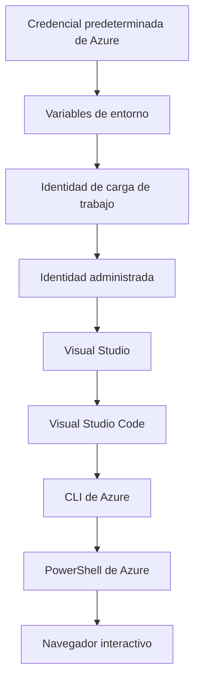

# AZD Básicos - Entendiendo Azure Developer CLI

# AZD Básicos - Conceptos centrales y fundamentos

**Navegación del capítulo:**
- **📚 Inicio del curso**: [AZD For Beginners](../../README.md)
- **📖 Capítulo actual**: Capítulo 1 - Fundamentos y inicio rápido
- **⬅️ Anterior**: [Course Overview](../../README.md#-chapter-1-foundation--quick-start)
- **➡️ Siguiente**: [Installation & Setup](installation.md)
- **🚀 Siguiente capítulo**: [Chapter 2: AI-First Development](../chapter-02-ai-development/microsoft-foundry-integration.md)

## Introducción

Esta lección te introduce al Azure Developer CLI (azd), una potente herramienta de línea de comandos que acelera tu camino desde el desarrollo local hasta el despliegue en Azure. Aprenderás los conceptos fundamentales, las características principales y entenderás cómo azd simplifica el despliegue de aplicaciones nativas en la nube.

## Objetivos de aprendizaje

Al final de esta lección, podrás:
- Entender qué es Azure Developer CLI y su propósito principal
- Aprender los conceptos clave de plantillas, entornos y servicios
- Explorar características clave incluyendo el desarrollo basado en plantillas e Infraestructura como Código
- Entender la estructura de un proyecto azd y su flujo de trabajo
- Estar preparado para instalar y configurar azd en tu entorno de desarrollo

## Resultados de aprendizaje

Después de completar esta lección, serás capaz de:
- Explicar el papel de azd en los flujos de trabajo modernos de desarrollo en la nube
- Identificar los componentes de la estructura de un proyecto azd
- Describir cómo trabajan juntos plantillas, entornos y servicios
- Entender los beneficios de Infraestructura como Código con azd
- Reconocer los distintos comandos de azd y sus propósitos

## ¿Qué es Azure Developer CLI (azd)?

Azure Developer CLI (azd) es una herramienta de línea de comandos diseñada para acelerar tu transición desde el desarrollo local al despliegue en Azure. Simplifica el proceso de construir, desplegar y gestionar aplicaciones nativas en la nube en Azure.

### ¿Qué puedes desplegar con azd?

azd admite una amplia gama de cargas de trabajo —y la lista sigue creciendo. Hoy puedes usar azd para desplegar:

| Workload Type | Examples | Same Workflow? |
|---------------|----------|----------------|
| **Traditional applications** | Web apps, REST APIs, static sites | ✅ `azd up` |
| **Services and microservices** | Container Apps, Function Apps, multi-service backends | ✅ `azd up` |
| **AI-powered applications** | Chat apps with Microsoft Foundry Models, RAG solutions with AI Search | ✅ `azd up` |
| **Intelligent agents** | Foundry-hosted agents, multi-agent orchestrations | ✅ `azd up` |

La idea clave es que **el ciclo de vida de azd permanece igual sin importar lo que despliegues**. Inicializas un proyecto, aprovisionas infraestructura, despliegas tu código, supervisas la aplicación y limpias—ya sea un sitio web sencillo o un agente de IA sofisticado.

Esta continuidad es por diseño. azd trata las capacidades de IA como otro tipo de servicio que tu aplicación puede usar, no como algo fundamentalmente distinto. Un endpoint de chat respaldado por Microsoft Foundry Models es, desde la perspectiva de azd, simplemente otro servicio que configurar y desplegar.

### 🎯 ¿Por qué usar AZD? Una comparación del mundo real

Comparemos desplegar una aplicación web simple con base de datos:

#### ❌ SIN AZD: Despliegue manual en Azure (30+ minutos)

```bash
# Paso 1: Crear grupo de recursos
az group create --name myapp-rg --location eastus

# Paso 2: Crear Plan de App Service
az appservice plan create --name myapp-plan \
  --resource-group myapp-rg \
  --sku B1 --is-linux

# Paso 3: Crear aplicación web
az webapp create --name myapp-web-unique123 \
  --resource-group myapp-rg \
  --plan myapp-plan \
  --runtime "NODE:18-lts"

# Paso 4: Crear cuenta de Cosmos DB (10-15 minutos)
az cosmosdb create --name myapp-cosmos-unique123 \
  --resource-group myapp-rg \
  --kind MongoDB

# Paso 5: Crear base de datos
az cosmosdb mongodb database create \
  --account-name myapp-cosmos-unique123 \
  --resource-group myapp-rg \
  --name tododb

# Paso 6: Crear colección
az cosmosdb mongodb collection create \
  --account-name myapp-cosmos-unique123 \
  --resource-group myapp-rg \
  --database-name tododb \
  --name todos

# Paso 7: Obtener cadena de conexión
CONN_STR=$(az cosmosdb keys list \
  --name myapp-cosmos-unique123 \
  --resource-group myapp-rg \
  --type connection-strings \
  --query "connectionStrings[0].connectionString" -o tsv)

# Paso 8: Configurar ajustes de la aplicación
az webapp config appsettings set \
  --name myapp-web-unique123 \
  --resource-group myapp-rg \
  --settings MONGODB_URI="$CONN_STR"

# Paso 9: Habilitar el registro
az webapp log config --name myapp-web-unique123 \
  --resource-group myapp-rg \
  --application-logging filesystem \
  --detailed-error-messages true

# Paso 10: Configurar Application Insights
az monitor app-insights component create \
  --app myapp-insights \
  --location eastus \
  --resource-group myapp-rg

# Paso 11: Vincular Application Insights con la aplicación web
INSTRUMENTATION_KEY=$(az monitor app-insights component show \
  --app myapp-insights \
  --resource-group myapp-rg \
  --query "instrumentationKey" -o tsv)

az webapp config appsettings set \
  --name myapp-web-unique123 \
  --resource-group myapp-rg \
  --settings APPINSIGHTS_INSTRUMENTATIONKEY="$INSTRUMENTATION_KEY"

# Paso 12: Compilar la aplicación localmente
npm install
npm run build

# Paso 13: Crear paquete de implementación
zip -r app.zip . -x "*.git*" "node_modules/*"

# Paso 14: Desplegar la aplicación
az webapp deployment source config-zip \
  --resource-group myapp-rg \
  --name myapp-web-unique123 \
  --src app.zip

# Paso 15: Espera y reza para que funcione 🙏
# (No hay validación automatizada, se requieren pruebas manuales)
```

**Problemas:**
- ❌ 15+ comandos para recordar y ejecutar en orden
- ❌ 30-45 minutos de trabajo manual
- ❌ Fácil cometer errores (errores tipográficos, parámetros incorrectos)
- ❌ Cadenas de conexión expuestas en el historial del terminal
- ❌ Sin rollback automático si algo falla
- ❌ Difícil de replicar para miembros del equipo
- ❌ Diferente cada vez (no reproducible)

#### ✅ CON AZD: Despliegue automatizado (5 comandos, 10-15 minutos)

```bash
# Paso 1: Inicializar desde plantilla
azd init --template todo-nodejs-mongo

# Paso 2: Autenticar
azd auth login

# Paso 3: Crear entorno
azd env new dev

# Paso 4: Vista previa de los cambios (opcional pero recomendado)
azd provision --preview

# Paso 5: Desplegar todo
azd up

# ✨ ¡Hecho! Todo está desplegado, configurado y monitoreado
```

**Beneficios:**
- ✅ **5 comandos** vs. 15+ pasos manuales
- ✅ **10-15 minutos** tiempo total (principalmente esperando a Azure)
- ✅ **Menos errores manuales** - flujo de trabajo consistente basado en plantillas
- ✅ **Manejo seguro de secretos** - muchas plantillas usan almacenamiento de secretos gestionado por Azure
- ✅ **Despliegues repetibles** - mismo flujo de trabajo cada vez
- ✅ **Totalmente reproducible** - mismo resultado cada vez
- ✅ **Listo para equipos** - cualquiera puede desplegar con los mismos comandos
- ✅ **Infraestructura como Código** - plantillas Bicep versionadas
- ✅ **Supervisión integrada** - Application Insights configurado automáticamente

### 📊 Reducción de tiempo y errores

| Metric | Manual Deployment | AZD Deployment | Improvement |
|:-------|:------------------|:---------------|:------------|
| **Commands** | 15+ | 5 | 67% fewer |
| **Time** | 30-45 min | 10-15 min | 60% faster |
| **Error Rate** | ~40% | <5% | 88% reduction |
| **Consistency** | Low (manual) | 100% (automated) | Perfect |
| **Team Onboarding** | 2-4 hours | 30 minutes | 75% faster |
| **Rollback Time** | 30+ min (manual) | 2 min (automated) | 93% faster |

## Conceptos clave

### Plantillas
Las plantillas son la base de azd. Contienen:
- **Código de la aplicación** - Tu código fuente y dependencias
- **Definiciones de infraestructura** - Recursos de Azure definidos en Bicep o Terraform
- **Archivos de configuración** - Ajustes y variables de entorno
- **Scripts de despliegue** - Flujos de trabajo de despliegue automatizados

### Entornos
Los entornos representan diferentes destinos de despliegue:
- **Desarrollo** - Para pruebas y desarrollo
- **Staging** - Entorno previo a producción
- **Producción** - Entorno en vivo de producción

Cada entorno mantiene su propio:
- Grupo de recursos de Azure
- Configuración de ajustes
- Estado de despliegue

### Servicios
Los servicios son los bloques constructores de tu aplicación:
- **Frontend** - Aplicaciones web, SPA
- **Backend** - APIs, microservicios
- **Base de datos** - Soluciones de almacenamiento de datos
- **Almacenamiento** - Almacenamiento de archivos y blobs

## Características clave

### 1. Desarrollo impulsado por plantillas
```bash
# Examinar plantillas disponibles
azd template list

# Inicializar desde una plantilla
azd init --template <template-name>
```

### 2. Infraestructura como Código
- **Bicep** - Lenguaje específico de dominio de Azure
- **Terraform** - Herramienta de infraestructura multi-nube
- **ARM Templates** - Plantillas de Azure Resource Manager

### 3. Flujos de trabajo integrados
```bash
# Flujo de trabajo completo de despliegue
azd up            # Aprovisionar + Desplegar: esto es sin intervención para la configuración inicial

# 🧪 NUEVO: Previsualizar los cambios en la infraestructura antes del despliegue (SEGURO)
azd provision --preview    # Simular el despliegue de la infraestructura sin realizar cambios

azd provision     # Crear recursos de Azure; si actualizas la infraestructura, usa esto
azd deploy        # Desplegar el código de la aplicación o redeplegarlo una vez actualizado
azd down          # Limpiar recursos
```

#### 🛡️ Planificación segura de infraestructura con vista previa
El comando `azd provision --preview` es un cambio de juego para despliegues seguros:
- **Análisis en seco** - Muestra lo que se creará, modificará o eliminará
- **Riesgo cero** - No se realizan cambios reales en tu entorno de Azure
- **Colaboración en equipo** - Comparte los resultados de la vista previa antes del despliegue
- **Estimación de costos** - Entiende los costos de los recursos antes de comprometerte

```bash
# Ejemplo de flujo de trabajo de vista previa
azd provision --preview           # Ver lo que cambiará
# Revisar la salida, discutir con el equipo
azd provision                     # Aplicar los cambios con confianza
```

### 📊 Visual: Flujo de desarrollo con AZD


```mermaid
graph LR
    A[azd init] -->|Inicializar proyecto| B[azd auth login]
    B -->|Autenticar| C[azd env new]
    C -->|Crear entorno| D{¿Primer despliegue?}
    D -->|Sí| E[azd up]
    D -->|No| F[azd provision --preview]
    F -->|Revisar cambios| G[azd provision]
    E -->|Prepara e implementa| H[Recursos en ejecución]
    G -->|Actualiza infraestructura| H
    H -->|Supervisar| I[azd monitor]
    I -->|Realizar cambios en el código| J[azd deploy]
    J -->|Reimplementar solo código| H
    H -->|Limpiar| K[azd down]
    
    style A fill:#e1f5fe
    style E fill:#c8e6c9
    style F fill:#fff9c4
    style H fill:#c5e1a5
    style K fill:#ffcdd2
```

**Explicación del flujo de trabajo:**
1. **Init** - Comienza con una plantilla o proyecto nuevo
2. **Auth** - Autentícate con Azure
3. **Environment** - Crea un entorno de despliegue aislado
4. **Preview** - 🆕 Siempre previsualiza los cambios de infraestructura primero (práctica segura)
5. **Provision** - Crea/actualiza recursos de Azure
6. **Deploy** - Envía el código de tu aplicación
7. **Monitor** - Observa el rendimiento de la aplicación
8. **Iterate** - Realiza cambios y redepliega el código
9. **Cleanup** - Elimina recursos cuando termines

### 4. Gestión de entornos
```bash
# Crear y gestionar entornos
azd env new <environment-name>
azd env select <environment-name>
azd env list
```

### 5. Extensiones y comandos de IA

azd utiliza un sistema de extensiones para añadir capacidades más allá del CLI principal. Esto es especialmente útil para cargas de trabajo de IA:

```bash
# Listar extensiones disponibles
azd extension list

# Instalar la extensión Foundry agents
azd extension install azure.ai.agents

# Inicializar un proyecto de agente de IA a partir de un manifiesto
azd ai agent init -m agent-manifest.yaml

# Probar un agente desplegado (muestra la latencia y el tiempo hasta el primer byte)
azd ai agent invoke

# Iniciar el servidor MCP para desarrollo asistido por IA (Alfa)
azd mcp start
```

**El ciclo de vida del agente, de principio a fin.** Una vez que has instalado `azure.ai.agents`, un único flujo de trabajo te lleva desde la idea a un agente en ejecución y monitorizado. No necesitas todo esto el primer día—solo debes saber que existe:

| Stage | Command | What it does |
|-------|---------|--------------|
| **Scaffold** | `azd ai agent init -m <manifest>` | Generate an agent project from a manifest |
| **Test** | `azd ai agent invoke` | Call the agent and view response timing |
| **Measure** | `azd ai agent eval generate` | Create an evaluation dataset for the agent |
| **Improve** | `azd ai agent optimize` | Optimize agent instructions against your data |
| **Inspect** | `azd ai agent endpoint show` | View the live endpoint configuration |
| **Clean up** | `azd ai agent delete` | Delete a hosted agent and all its versions |

> Las extensiones se tratan en detalle en [Chapter 2: AI-First Development](../chapter-02-ai-development/agents.md) y en la referencia [AZD AI CLI Commands](../chapter-08-production/production-ai-practices.md#azd-ai-cli-commands-and-extensions).

## 📁 Estructura del proyecto

Una estructura típica de un proyecto azd:
```
my-app/
├── .azd/                    # azd configuration
│   └── config.json
├── .azure/                  # Azure deployment artifacts
├── .devcontainer/          # Development container config
├── .github/workflows/      # GitHub Actions
├── .vscode/               # VS Code settings
├── infra/                 # Infrastructure code
│   ├── main.bicep        # Main infrastructure template
│   ├── main.parameters.json
│   └── modules/          # Reusable modules
├── src/                  # Application source code
│   ├── api/             # Backend services
│   └── web/             # Frontend application
├── azure.yaml           # azd project configuration
└── README.md
```

## 🔧 Archivos de configuración

### azure.yaml
El archivo principal de configuración del proyecto:
```yaml
name: my-awesome-app
metadata:
  template: my-template@1.0.0

services:
  web:
    project: ./src/web
    language: js
    host: appservice
  api:
    project: ./src/api
    language: js
    host: appservice

hooks:
  preprovision:
    shell: pwsh
    run: echo "Preparing to provision..."
```

### .azure/config.json
Configuración específica del entorno:
```json
{
  "version": 1,
  "defaultEnvironment": "dev",
  "environments": {
    "dev": {
      "subscriptionId": "your-subscription-id",
      "location": "eastus"
    }
  }
}
```

## 🎪 Flujos de trabajo comunes con ejercicios prácticos

> **💡 Consejo de aprendizaje:** Sigue estos ejercicios en orden para desarrollar tus habilidades con AZD de forma progresiva.

### 🎯 Ejercicio 1: Inicializa tu primer proyecto

**Objetivo:** Crear un proyecto AZD y explorar su estructura

**Pasos:**
```bash
# Usa una plantilla probada
azd init --template todo-nodejs-mongo

# Explora los archivos generados
ls -la  # Ver todos los archivos, incluidos los ocultos

# Archivos clave creados:
# - azure.yaml (configuración principal)
# - infra/ (código de infraestructura)
# - src/ (código de la aplicación)
```

**✅ Éxito:** Tienes azure.yaml, infra/ y src/ directorios

---

### 🎯 Ejercicio 2: Desplegar en Azure

**Objetivo:** Completar un despliegue de extremo a extremo

**Pasos:**
```bash
# 1. Autenticarse
az login && azd auth login

# 2. Crear entorno
azd env new dev
azd env set AZURE_LOCATION eastus

# 3. Previsualizar cambios (RECOMENDADO)
azd provision --preview

# 4. Desplegar todo
azd up

# 5. Verificar el despliegue
azd show    # 6. Ver la URL de tu aplicación
```

**Tiempo estimado:** 10-15 minutos  
**✅ Éxito:** La URL de la aplicación se abre en el navegador

---

### 🎯 Ejercicio 3: Múltiples entornos

**Objetivo:** Desplegar a dev y staging

**Pasos:**
```bash
# Ya existe dev, crea staging
azd env new staging
azd env set AZURE_LOCATION westus2
azd up

# Alternar entre ellos
azd env list
azd env select dev
```

**✅ Éxito:** Dos grupos de recursos separados en Azure Portal

---

### 🛡️ Restablecimiento completo: `azd down --force --purge`

Cuando necesitas reiniciar completamente:

```bash
azd down --force --purge
```

**Qué hace:**
- `--force`: Sin solicitudes de confirmación
- `--purge`: Elimina todo el estado local y los recursos de Azure

**Usar cuando:**
- El despliegue falló a mitad de camino
- Cambiando de proyecto
- Necesitas un comienzo limpio

---

## 🎪 Referencia del flujo de trabajo original

### Iniciando un nuevo proyecto
```bash
# Método 1: Usar plantilla existente
azd init --template todo-nodejs-mongo

# Método 2: Empezar desde cero
azd init

# Método 3: Usar el directorio actual
azd init .
```

### Ciclo de desarrollo
```bash
# Configurar el entorno de desarrollo
azd auth login
azd env new dev
azd env select dev

# Desplegar todo
azd up

# Hacer cambios y volver a desplegar
azd deploy

# Limpiar al terminar
azd down --force --purge # El comando en la CLI de Azure Developer es un **restablecimiento completo** para tu entorno, especialmente útil cuando estás solucionando implementaciones fallidas, limpiando recursos huérfanos o preparando un nuevo despliegue.
```

## Comprendiendo `azd down --force --purge`
El comando `azd down --force --purge` es una forma potente de desmantelar por completo tu entorno azd y todos los recursos asociados. Aquí hay un desglose de lo que hace cada bandera:
```
--force
```
- Omite las solicitudes de confirmación.
- Útil para automatización o scripting donde la entrada manual no es factible.
- Garantiza que el desmontaje proceda sin interrupciones, incluso si el CLI detecta inconsistencias.

```
--purge
```
Elimina **todos los metadatos asociados**, incluyendo:
Estado del entorno
Carpeta local `.azure`
Información de despliegue en caché
Evita que azd "recuerde" implementaciones anteriores, lo que puede causar problemas como grupos de recursos desajustados o referencias de registro obsoletas.


### ¿Por qué usar ambos?
Cuando te encuentras bloqueado con `azd up` debido a estado persistente o despliegues parciales, esta combinación asegura un **comienzo limpio**.

Es especialmente útil después de eliminaciones manuales de recursos en el portal de Azure o al cambiar plantillas, entornos o convenciones de nombres de grupos de recursos.


### Gestión de múltiples entornos
```bash
# Crear entorno de preproducción
azd env new staging
azd env select staging
azd up

# Volver a dev
azd env select dev

# Comparar entornos
azd env list
```

## 🔐 Autenticación y credenciales

Entender la autenticación es crucial para despliegues exitosos con azd. Azure utiliza múltiples métodos de autenticación, y azd aprovecha la misma cadena de credenciales usada por otras herramientas de Azure.

### Autenticación con Azure CLI (`az login`)

Antes de usar azd, necesitas autenticarte con Azure. El método más común es usar Azure CLI:

```bash
# Inicio de sesión interactivo (abre el navegador)
az login

# Iniciar sesión con un tenant específico
az login --tenant <tenant-id>

# Iniciar sesión con un principal de servicio
az login --service-principal -u <app-id> -p <password> --tenant <tenant-id>

# Comprobar el estado de inicio de sesión actual
az account show

# Listar suscripciones disponibles
az account list --output table

# Establecer suscripción predeterminada
az account set --subscription <subscription-id>
```

### Flujo de autenticación
1. **Inicio de sesión interactivo**: Abre tu navegador predeterminado para la autenticación
2. **Flujo de código de dispositivo**: Para entornos sin acceso a navegador
3. **Service Principal**: Para automatización y escenarios de CI/CD
4. **Managed Identity**: Para aplicaciones alojadas en Azure

### Cadena DefaultAzureCredential

`DefaultAzureCredential` es un tipo de credencial que ofrece una experiencia de autenticación simplificada al intentar automáticamente múltiples fuentes de credenciales en un orden específico:

#### Orden de la cadena de credenciales

```mermaid
graph TD
    A[Credencial predeterminada de Azure] --> B[Variables de entorno]
    B --> C[Identidad de carga de trabajo]
    C --> D[Identidad administrada]
    D --> E[Visual Studio]
    E --> F[Visual Studio Code]
    F --> G[CLI de Azure]
    G --> H[PowerShell de Azure]
    H --> I[Navegador interactivo]
```

#### 1. Variables de entorno
```bash
# Establecer variables de entorno para el principal de servicio
export AZURE_CLIENT_ID="<app-id>"
export AZURE_CLIENT_SECRET="<password>"
export AZURE_TENANT_ID="<tenant-id>"
```

#### 2. Workload Identity (Kubernetes/GitHub Actions)
Usado automáticamente en:
- Azure Kubernetes Service (AKS) con Workload Identity
- GitHub Actions con federación OIDC
- Otros escenarios de identidad federada

#### 3. Identidad administrada
Para recursos de Azure como:
- Máquinas virtuales
- App Service
- Azure Functions
- Container Instances

```bash
# Comprobar si se está ejecutando en un recurso de Azure con identidad administrada
az account show --query "user.type" --output tsv
# Devuelve: "servicePrincipal" si se usa identidad administrada
```

#### 4. Integración con herramientas de desarrollo
- **Visual Studio**: Usa automáticamente la cuenta con sesión iniciada
- **VS Code**: Usa las credenciales de la extensión Azure Account
- **Azure CLI**: Usa las credenciales de `az login` (lo más común para desarrollo local)

### Configuración de autenticación de AZD

```bash
# Método 1: Usar Azure CLI (Recomendado para desarrollo)
az login
azd auth login  # Usa las credenciales existentes de Azure CLI

# Método 2: Autenticación directa con azd
azd auth login --use-device-code  # Para entornos sin interfaz gráfica

# Método 3: Comprobar el estado de autenticación
azd auth login --check-status

# Método 4: Cerrar sesión y volver a autenticarse
azd auth logout
azd auth login
```

### Mejores prácticas de autenticación

#### Para desarrollo local
```bash
# 1. Iniciar sesión con la CLI de Azure
az login

# 2. Verificar la suscripción correcta
az account show
az account set --subscription "Your Subscription Name"

# 3. Usar azd con credenciales existentes
azd auth login
```

#### Para pipelines de CI/CD
```yaml
# GitHub Actions example
- name: Azure Login
  uses: azure/login@v1
  with:
    creds: ${{ secrets.AZURE_CREDENTIALS }}

- name: Deploy with azd
  run: |
    azd auth login --client-id ${{ secrets.AZURE_CLIENT_ID }} \
                    --client-secret ${{ secrets.AZURE_CLIENT_SECRET }} \
                    --tenant-id ${{ secrets.AZURE_TENANT_ID }}
    azd up --no-prompt
```

#### Para entornos de producción
- Usar **Managed Identity** cuando se ejecute en recursos de Azure
- Usar **Service Principal** para escenarios de automatización
- Evitar almacenar credenciales en el código o en archivos de configuración
- Usar **Azure Key Vault** para la configuración sensible

### Problemas comunes de autenticación y soluciones

#### Problema: "No subscription found"
```bash
# Solución: Establecer suscripción predeterminada
az account list --output table
az account set --subscription "<subscription-id>"
azd env set AZURE_SUBSCRIPTION_ID "<subscription-id>"
```

#### Problema: "Insufficient permissions"
```bash
# Solución: Verificar y asignar los roles requeridos
az role assignment list --assignee $(az account show --query user.name --output tsv)

# Roles requeridos comunes:
# - Colaborador (para la gestión de recursos)
# - Administrador de acceso de usuario (para la asignación de roles)
```

#### Problema: "Token expired"
```bash
# Solución: volver a autenticarse
az logout
az login
azd auth logout
azd auth login
```

### Autenticación en diferentes escenarios

#### Desarrollo local
```bash
# Cuenta de desarrollo personal
az login
azd auth login
```

#### Desarrollo en equipo
```bash
# Usar un tenant específico para la organización
az login --tenant contoso.onmicrosoft.com
azd auth login
```

#### Escenarios multiinquilino
```bash
# Cambiar entre inquilinos
az login --tenant tenant1.onmicrosoft.com
# Desplegar en el inquilino 1
azd up

az login --tenant tenant2.onmicrosoft.com  
# Desplegar en el inquilino 2
azd up
```

### Consideraciones de seguridad

1. **Almacenamiento de credenciales**: Nunca almacene credenciales en el código fuente
2. **Limitación de alcance**: Utilice el principio de menor privilegio para los Service Principals
3. **Rotación de tokens**: Cambie regularmente los secretos de los Service Principals
4. **Registro de auditoría**: Supervise las actividades de autenticación y despliegue
5. **Seguridad de red**: Utilice endpoints privados cuando sea posible

### Solución de problemas de autenticación

```bash
# Depurar problemas de autenticación
azd auth login --check-status
az account show
az account get-access-token

# Comandos de diagnóstico comunes
whoami                          # Contexto del usuario actual
az ad signed-in-user show      # Detalles del usuario de Microsoft Entra ID
az group list                  # Probar el acceso a recursos
```

## Entendiendo `azd down --force --purge`

### Descubrimiento
```bash
azd template list              # Explorar plantillas
azd template show <template>   # Detalles de la plantilla
azd init --help               # Opciones de inicialización
```

### Gestión de proyectos
```bash
azd show                     # Descripción general del proyecto
azd env list                # Entornos disponibles y predeterminado seleccionado
azd config show            # Ajustes de configuración
```

### Monitorización
```bash
azd monitor                  # Abrir la monitorización del portal de Azure
azd monitor --logs           # Ver los registros de la aplicación
azd monitor --live           # Ver métricas en tiempo real
azd pipeline config          # Configurar CI/CD
```

## Mejores prácticas

### 1. Usar nombres significativos
```bash
# Bueno
azd env new production-east
azd init --template web-app-secure

# Evitar
azd env new env1
azd init --template template1
```

### 2. Aprovechar plantillas
- Comenzar con plantillas existentes
- Personalizar según sus necesidades
- Crear plantillas reutilizables para su organización

### 3. Aislamiento de entornos
- Usar entornos separados para dev/staging/prod
- Nunca desplegar directamente a producción desde la máquina local
- Usar pipelines de CI/CD para despliegues a producción

### 4. Gestión de configuración
- Usar variables de entorno para datos sensibles
- Mantener la configuración en control de versiones
- Documentar la configuración específica de cada entorno

## Progresión de aprendizaje

### Principiante (Semana 1-2)
1. Instalar azd y autenticarse
2. Desplegar una plantilla simple
3. Entender la estructura del proyecto
4. Aprender comandos básicos (up, down, deploy)

### Intermedio (Semana 3-4)
1. Personalizar plantillas
2. Gestionar múltiples entornos
3. Entender el código de infraestructura
4. Configurar pipelines de CI/CD

### Avanzado (Semana 5+)
1. Crear plantillas personalizadas
2. Patrones avanzados de infraestructura
3. Despliegues multi-región
4. Configuraciones de nivel empresarial

## Próximos pasos

**📖 Continuar con el aprendizaje del Capítulo 1:**
- [Instalación y configuración](installation.md) - Instalar y configurar azd
- [Tu primer proyecto](first-project.md) - Completar el tutorial práctico
- [Guía de configuración](configuration.md) - Opciones avanzadas de configuración

**🎯 ¿Listo para el siguiente capítulo?**
- [Capítulo 2: Desarrollo centrado en IA](../chapter-02-ai-development/microsoft-foundry-integration.md) - Empieza a crear aplicaciones de IA

## Recursos adicionales

- [Descripción general de Azure Developer CLI](https://learn.microsoft.com/en-us/azure/developer/azure-developer-cli/)
- [Galería de plantillas](https://azure.github.io/awesome-azd/)
- [Ejemplos de la comunidad](https://github.com/Azure-Samples)

---

## 🙋 Preguntas frecuentes

### Preguntas generales

**Q: ¿Cuál es la diferencia entre AZD y Azure CLI?**

A: Azure CLI (`az`) sirve para gestionar recursos individuales de Azure. AZD (`azd`) sirve para gestionar aplicaciones completas:

```bash
# Azure CLI - gestión de recursos de bajo nivel
az webapp create --name myapp --resource-group rg
az sql server create --name myserver --resource-group rg
# ...se necesitan muchos más comandos

# AZD - gestión a nivel de la aplicación
azd up  # Despliega la aplicación completa con todos los recursos
```

**Piénsalo de esta manera:**
- `az` = Operar sobre ladrillos individuales de Lego
- `azd` = Trabajar con conjuntos completos de Lego

---

**Q: ¿Necesito conocer Bicep o Terraform para usar AZD?**

A: ¡No! Empiece con plantillas:
```bash
# Usar plantilla existente - no se necesita conocimiento de IaC
azd init --template todo-nodejs-mongo
azd up
```

Puede aprender Bicep más adelante para personalizar la infraestructura. Las plantillas proporcionan ejemplos funcionales de los que aprender.

---

**Q: ¿Cuánto cuesta ejecutar plantillas de AZD?**

A: Los costes varían según la plantilla. La mayoría de las plantillas de desarrollo cuestan $50-150/mes:

```bash
# Previsualiza los costos antes de desplegar
azd provision --preview

# Siempre limpia cuando no lo estés usando
azd down --force --purge  # Elimina todos los recursos
```

**Consejo profesional:** Utilice los niveles gratuitos cuando estén disponibles:
- App Service: nivel F1 (Gratis)
- Microsoft Foundry Models: Azure OpenAI 50,000 tokens/mes gratis
- Cosmos DB: nivel gratuito de 1000 RU/s

---

**Q: ¿Puedo usar AZD con recursos de Azure existentes?**

A: Sí, pero es más fácil empezar desde cero. AZD funciona mejor cuando gestiona todo el ciclo de vida. Para recursos existentes:

```bash
# Opción 1: Importar recursos existentes (avanzado)
azd init
# Luego modifique infra/ para referenciar los recursos existentes

# Opción 2: Empezar desde cero (recomendado)
azd init --template matching-your-stack
azd up  # Crea un nuevo entorno
```

---

**Q: ¿Cómo comparto mi proyecto con compañeros de equipo?**

A: Haga commit del proyecto AZD a Git (pero NO la carpeta .azure):

```bash
# Ya está en .gitignore por defecto
.azure/        # Contiene secretos y datos de entorno
*.env          # Variables de entorno

# Miembros del equipo en ese entonces:
git clone <your-repo>
azd auth login
azd env new <their-name>-dev
azd up
```

Todos obtienen una infraestructura idéntica a partir de las mismas plantillas.

---

### Preguntas de solución de problemas

**Q: "azd up" falló a mitad de camino. ¿Qué hago?**

A: Revise el error, arréglelo y vuelva a intentarlo:

```bash
# Ver registros detallados
azd show

# Soluciones comunes:

# 1. Si se supera la cuota:
azd env set AZURE_LOCATION "westus2"  # Pruebe otra región

# 2. Si hay conflicto en el nombre del recurso:
azd down --force --purge  # Empezar de cero
azd up  # Reintentar

# 3. Si la autenticación expiró:
az login
azd auth login
azd up
```

**Problema más común:** Suscripción de Azure incorrecta seleccionada
```bash
az account list --output table
az account set --subscription "<correct-subscription>"
```

---

**Q: ¿Cómo despliego solo cambios de código sin reprovisionar?**

A: Use `azd deploy` en lugar de `azd up`:

```bash
azd up          # Primera vez: aprovisionar + desplegar (lento)

# Realiza cambios en el código...

azd deploy      # Las siguientes veces: solo desplegar (rápido)
```

Comparación de velocidad:
- `azd up`: 10-15 minutos (aprovisiona la infraestructura)
- `azd deploy`: 2-5 minutos (solo código)

---

**Q: ¿Puedo personalizar las plantillas de infraestructura?**

A: ¡Sí! Edite los archivos Bicep en `infra/`:

```bash
# Después de azd init
cd infra/
code main.bicep  # Editar en VS Code

# Vista previa de los cambios
azd provision --preview

# Aplicar cambios
azd provision
```

**Consejo:** Empiece por poco - cambie los SKUs primero:
```bicep
// infra/main.bicep
sku: {
  name: 'B1'  // Change to 'P1V2' for production
}
```

---

**Q: ¿Cómo borro todo lo que AZD creó?**

A: Un comando elimina todos los recursos:

```bash
azd down --force --purge

# Esto elimina:
# - Todos los recursos de Azure
# - Grupo de recursos
# - Estado del entorno local
# - Datos de implementación en caché
```

**Ejecutar siempre esto cuando:**
- Haya terminado de probar una plantilla
- Cambiando a un proyecto diferente
- Desea empezar desde cero

**Ahorro de costos:** Eliminar recursos no utilizados = $0 en cargos

---

**Q: ¿Qué pasa si borré recursos accidentalmente en Azure Portal?**

A: El estado de AZD puede desincronizarse. Enfoque para empezar desde cero:

```bash
# 1. Eliminar el estado local
azd down --force --purge

# 2. Comenzar de nuevo
azd up

# Alternativa: Permitir que AZD detecte y solucione
azd provision  # Creará los recursos que faltan
```

---

### Preguntas avanzadas

**Q: ¿Puedo usar AZD en pipelines de CI/CD?**

A: ¡Sí! Ejemplo de GitHub Actions:

```yaml
# .github/workflows/deploy.yml
name: Deploy with AZD

on:
  push:
    branches: [main]

jobs:
  deploy:
    runs-on: ubuntu-latest
    steps:
      - uses: actions/checkout@v2
      
      - name: Install azd
        run: curl -fsSL https://aka.ms/install-azd.sh | bash
      
      - name: Azure Login
        run: |
          azd auth login \
            --client-id ${{ secrets.AZURE_CLIENT_ID }} \
            --client-secret ${{ secrets.AZURE_CLIENT_SECRET }} \
            --tenant-id ${{ secrets.AZURE_TENANT_ID }}
      
      - name: Deploy
        run: azd up --no-prompt
```

---

**Q: ¿Cómo manejo secretos y datos sensibles?**

A: AZD se integra con Azure Key Vault automáticamente:

```bash
# Los secretos se almacenan en Key Vault, no en el código
azd env set DATABASE_PASSWORD "$(openssl rand -base64 32)"

# AZD automáticamente:
# 1. Crea Key Vault
# 2. Almacena el secreto
# 3. Concede acceso a la aplicación mediante Identidad administrada
# 4. Inyecta en tiempo de ejecución
```

**Nunca haga commit:**
- `.azure/` folder (contiene datos del entorno)
- `.env` files (secretos locales)
- Connection strings

---

**Q: ¿Puedo desplegar a varias regiones?**

A: Sí, cree un entorno por región:

```bash
# Entorno Este de Estados Unidos
azd env new prod-eastus
azd env set AZURE_LOCATION eastus
azd up

# Entorno Europa Occidental
azd env new prod-westeurope
azd env set AZURE_LOCATION westeurope
azd up

# Cada entorno es independiente
azd env list
```

Para aplicaciones verdaderamente multi-región, personalice las plantillas Bicep para desplegar en varias regiones simultáneamente.

---

**Q: ¿Dónde puedo obtener ayuda si estoy atascado?**

1. **Documentación de AZD:** https://learn.microsoft.com/azure/developer/azure-developer-cli/
2. **Issues de GitHub:** https://github.com/Azure/azure-dev/issues
3. **Discord:** [Discord de Azure](https://discord.gg/microsoft-azure) - canal #azure-developer-cli
4. **Stack Overflow:** Etiqueta `azure-developer-cli`
5. **Este curso:** [Guía de solución de problemas](../chapter-07-troubleshooting/common-issues.md)

**Consejo profesional:** Antes de preguntar, ejecute:
```bash
azd show       # Muestra el estado actual
azd version    # Muestra tu versión
```
Incluya esta información en su pregunta para obtener ayuda más rápida.

---

## 🎓 ¿Qué sigue?

Ahora comprende los fundamentos de AZD. Elija su camino:

### 🎯 Para principiantes:
1. **Siguiente:** [Instalación y configuración](installation.md) - Instalar AZD en su máquina
2. **Luego:** [Tu primer proyecto](first-project.md) - Despliegue su primera aplicación
3. **Práctica:** Complete los 3 ejercicios de esta lección

### 🚀 Para desarrolladores de IA:
1. **Ir a:** [Capítulo 2: Desarrollo centrado en IA](../chapter-02-ai-development/microsoft-foundry-integration.md)
2. **Desplegar:** Comience con `azd init --template get-started-with-ai-chat`
3. **Aprender:** Construya mientras despliega

### 🏗️ Para desarrolladores experimentados:
1. **Revisar:** [Guía de configuración](configuration.md) - Configuraciones avanzadas
2. **Explorar:** [Infraestructura como código](../chapter-04-infrastructure/provisioning.md) - Profundización en Bicep
3. **Construir:** Crear plantillas personalizadas para su pila

---

**Navegación del capítulo:**
- **📚 Inicio del curso**: [AZD para principiantes](../../README.md)
- **📖 Capítulo actual**: Capítulo 1 - Fundamentos y inicio rápido  
- **⬅️ Anterior**: [Descripción del curso](../../README.md#-chapter-1-foundation--quick-start)
- **➡️ Siguiente**: [Instalación y configuración](installation.md)
- **🚀 Siguiente capítulo**: [Capítulo 2: Desarrollo centrado en IA](../chapter-02-ai-development/microsoft-foundry-integration.md)

---

<!-- CO-OP TRANSLATOR DISCLAIMER START -->
**Descargo de responsabilidad**:
Este documento ha sido traducido utilizando el servicio de traducción automática [Co-op Translator](https://github.com/Azure/co-op-translator). Aunque nos esforzamos por la precisión, tenga en cuenta que las traducciones automatizadas pueden contener errores o inexactitudes. El documento original en su idioma nativo debe considerarse la fuente autorizada. Para información crítica, se recomienda una traducción profesional humana. No somos responsables de cualquier malentendido o interpretación errónea que surja del uso de esta traducción.
<!-- CO-OP TRANSLATOR DISCLAIMER END -->