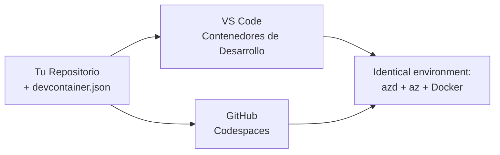

# Contenedores de desarrollo y GitHub Codespaces para azd

**Navegación por el capítulo:**
- **📚 Inicio del curso**: [AZD Para Principiantes](../../README.md)
- **📖 Capítulo actual**: Capítulo 1 - Fundamentos y Inicio rápido
- **⬅️ Anterior**: [Trae tu propia aplicación](bring-your-own-app.md)
- **🚀 Próximo capítulo**: [Capítulo 2: Desarrollo con IA primero](../chapter-02-ai-development/README.md)

> Validado con `azd 1.27.1` en julio de 2026.

## Introducción

Instalar azd, el runtime adecuado, Docker y la Azure CLI en cada máquina es una tarea tediosa—y es la razón número uno por la que un tutorial que "funciona en mi máquina" falla en otra. Un **contenedor de desarrollo** soluciona esto describiendo toda tu cadena de herramientas en un archivo. Cualquiera que abra el proyecto en VS Code o GitHub Codespaces obtiene exactamente el mismo entorno, con azd ya instalado. Esta lección te muestra cómo agregar uno.

## Objetivos de aprendizaje

Al final de esta lección, tú:
- Entenderás qué es un contenedor de desarrollo y por qué ayuda con azd
- Agregarás un `.devcontainer/devcontainer.json` mínimo a un proyecto
- Incluirás azd, la Azure CLI y Docker a través de *features* de Dev Container
- Abrirás el proyecto en GitHub Codespaces o VS Code

## Resultados de aprendizaje

Después de completar esta lección, podrás:
- Crear un `devcontainer.json` para un proyecto azd
- Añadir azd y herramientas de Azure sin instalaciones manuales
- Ejecutar `azd up` desde dentro de un contenedor o Codespace

---

## ¿Qué es un contenedor de desarrollo?

Un contenedor de desarrollo es un entorno de desarrollo basado en Docker definido por un archivo `.devcontainer/devcontainer.json` en tu repositorio. Cuando abres el proyecto:

- **VS Code** (con la extensión Dev Containers) construye el contenedor y se conecta a él.
- **GitHub Codespaces** construye el mismo contenedor en la nube y te da un editor basado en navegador.

De cualquiera de las formas, cada colaborador tiene herramientas idénticas—sin problemas del tipo "¿instalaste azd?".



---

## Paso 1: Crear el archivo devcontainer

Crea `.devcontainer/devcontainer.json` en la raíz de tu proyecto:

```json
{
  "name": "azd-project",
  "image": "mcr.microsoft.com/devcontainers/base:bookworm",
  "features": {
    "ghcr.io/devcontainers/features/azure-cli:1": {},
    "ghcr.io/azure/azure-dev/azd:latest": {},
    "ghcr.io/devcontainers/features/docker-in-docker:2": {},
    "ghcr.io/devcontainers/features/node:1": {}
  },
  "customizations": {
    "vscode": {
      "extensions": [
        "ms-azuretools.azure-dev",
        "ms-azuretools.vscode-bicep"
      ]
    }
  },
  "forwardPorts": [3000],
  "postCreateCommand": "azd version"
}
```

Qué hace cada parte:

| Clave | Propósito |
|-----|---------|
| `image` | El SO base para el contenedor |
| `features` | Instaladores preconstruidos—aquí: Azure CLI, **azd**, Docker y Node.js |
| `customizations.vscode.extensions` | Instala automáticamente las extensiones de azd y Bicep para VS Code |
| `forwardPorts` | Expone el puerto de tu aplicación al navegador |
| `postCreateCommand` | Se ejecuta una vez después de construir el contenedor (aquí, una comprobación básica) |

> La característica `ghcr.io/azure/azure-dev/azd:latest` es la forma oficial de obtener azd en un contenedor. Fija una versión específica (por ejemplo `azd:1.27.1`) si necesitas reproducibilidad.

---

## Paso 2: Ajusta la característica al lenguaje de tu app

Cambia la característica `node` por la que use tu app:

```jsonc
// Python project
"ghcr.io/devcontainers/features/python:1": {},

// .NET project
"ghcr.io/devcontainers/features/dotnet:2": {},

// Java project
"ghcr.io/devcontainers/features/java:1": {},

// Go project
"ghcr.io/devcontainers/features/go:1": {}
```

Mantén `docker-in-docker` si tu `host` es `containerapp`, `aks` o cualquier otro que construya una imagen de contenedor—azd necesita Docker para construir y enviar imágenes.

---

## Paso 3: Ábrelo

**En VS Code:**
1. Instala la extensión **Dev Containers**.
2. Abre la carpeta del proyecto.
3. Haz clic en **Reabrir en contenedor** cuando se te pregunte (o ejecuta *Dev Containers: Reopen in Container*).

**En GitHub Codespaces:**
1. Sube el repositorio a GitHub.
2. Haz clic en **Code → Codespaces → Create codespace on main**.
3. Espera a que el contenedor se construya—azd estará listo en el terminal.

---

## Paso 4: Despliega desde dentro del contenedor

El contenedor tiene azd preinstalado, así que el flujo normal funciona directamente:

```bash
azd auth login --use-device-code   # el código del dispositivo es útil dentro de Codespaces
azd up
```

> **¿Por qué `--use-device-code`?** En un contenedor remoto o Codespace no hay un navegador local para redirigir, así que el inicio de sesión con código de dispositivo es el camino confiable. Pegarás un código en una pestaña del navegador para completar el inicio de sesión.

---

## Problemas comunes

| Problema | Solución |
|---------|-----|
| `azd up` no puede construir una imagen | Añade la característica `docker-in-docker` |
| El inicio de sesión en navegador se cuelga en Codespaces | Usa `azd auth login --use-device-code` |
| Las herramientas difieren entre compañeros | Fija versiones de características (p.ej. `azd:1.27.1`) |
| La app no es accesible en el navegador | Añade el puerto a `forwardPorts` |

---

## Resumen

- Un contenedor de desarrollo hace que tu cadena de herramientas azd sea reproducible para todos.
- Añade azd, la Azure CLI y Docker mediante *features* del Dev Container.
- Ajusta la característica del lenguaje a tu app y mantén `docker-in-docker` para hosts que usan contenedores.
- Usa el inicio de sesión con código de dispositivo cuando ejecutes dentro de Codespaces.

---

## 🔗 Navegación

| Dirección | Recurso |
|-----------|----------|
| **Anterior** | [Trae tu propia aplicación](bring-your-own-app.md) |
| **Inicio del capítulo** | [Capítulo 1: Fundamentos y Inicio rápido](README.md) |
| **Próximo capítulo** | [Capítulo 2: Desarrollo con IA primero](../chapter-02-ai-development/README.md) |

## 📖 Recursos relacionados

- [Instalación y configuración](installation.md)
- [Hoja de referencia de comandos](../../resources/cheat-sheet.md)
- [Especificación oficial de Dev Containers](https://containers.dev/)
- [Característica azd Dev Container](https://github.com/Azure/azure-dev/tree/main/ext/devcontainer)

---

<!-- CO-OP TRANSLATOR DISCLAIMER START -->
**Descargo de responsabilidad**:
Este documento ha sido traducido utilizando el servicio de traducción automática [Co-op Translator](https://github.com/Azure/co-op-translator). Aunque nos esforzamos por la precisión, tenga en cuenta que las traducciones automatizadas pueden contener errores o inexactitudes. El documento original en su idioma nativo debe considerarse la fuente autorizada. Para información crítica, se recomienda una traducción profesional humana. No somos responsables de cualquier malentendido o interpretación errónea que surja del uso de esta traducción.
<!-- CO-OP TRANSLATOR DISCLAIMER END -->