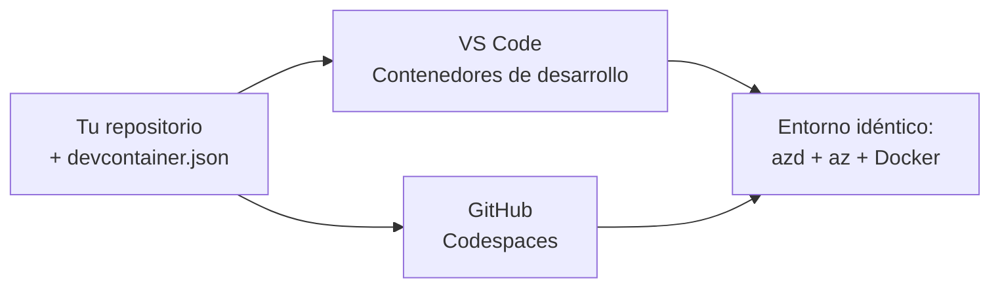

# Dev Containers & GitHub Codespaces for azd

**Navegación del capítulo:**
- **📚 Inicio del curso**: [AZD For Beginners](../../README.md)
- **📖 Capítulo actual**: Chapter 1 - Foundation & Quick Start
- **⬅️ Anterior**: [Bring Your Own App](bring-your-own-app.md)
- **🚀 Capítulo siguiente**: [Chapter 2: AI-First Development](../chapter-02-ai-development/README.md)

> Validado contra `azd 1.25.6` en junio de 2026.

## Introducción

Instalar azd, el runtime de lenguaje adecuado, Docker y la CLI de Azure en cada máquina es una molestia—y es la razón principal por la que un tutorial que "funciona en mi máquina" falla para otra persona. Un **contenedor de desarrollo** (dev container) resuelve esto describiendo toda tu cadena de herramientas en un archivo. Cualquiera que abra el proyecto en VS Code o GitHub Codespaces obtiene exactamente el mismo entorno, con azd ya instalado. Esta lección te muestra cómo agregar uno.

## Objetivos de aprendizaje

Al final de esta lección, podrás:
- Entender qué es un dev container y por qué ayuda con azd
- Agregar un `.devcontainer/devcontainer.json` mínimo a un proyecto
- Incluir azd, la CLI de Azure y Docker mediante *features* de Dev Container
- Abrir el proyecto en GitHub Codespaces o VS Code

## Resultados del aprendizaje

Después de completar esta lección, podrás:
- Crear un `devcontainer.json` para un proyecto azd
- Añadir azd y herramientas de Azure sin instalaciones manuales
- Ejecutar `azd up` desde dentro de un contenedor o Codespace

---

## ¿Qué es un Dev Container?

Un dev container es un entorno de desarrollo basado en Docker definido por un archivo `.devcontainer/devcontainer.json` en tu repositorio. Cuando abres el proyecto:

- **VS Code** (con la extensión Dev Containers) construye el contenedor y se adjunta a él.
- **GitHub Codespaces** construye el mismo contenedor en la nube y te ofrece un editor en el navegador.

De cualquier forma, cada colaborador obtiene herramientas idénticas—sin resolver el problema de "¿instalaste azd?".



---

## Paso 1: Crear el archivo devcontainer

Crea `.devcontainer/devcontainer.json` en la raíz de tu proyecto:

```json
{
  "name": "azd-project",
  "image": "mcr.microsoft.com/devcontainers/base:bookworm",
  "features": {
    "ghcr.io/devcontainers/features/azure-cli:1": {},
    "ghcr.io/azure/azure-dev/azd:latest": {},
    "ghcr.io/devcontainers/features/docker-in-docker:2": {},
    "ghcr.io/devcontainers/features/node:1": {}
  },
  "customizations": {
    "vscode": {
      "extensions": [
        "ms-azuretools.azure-dev",
        "ms-azuretools.vscode-bicep"
      ]
    }
  },
  "forwardPorts": [3000],
  "postCreateCommand": "azd version"
}
```

Qué hace cada parte:

| Clave | Propósito |
|-----|---------|
| `image` | El sistema operativo base para el contenedor |
| `features` | Instaladores preconstruidos—aquí: Azure CLI, **azd**, Docker y Node.js |
| `customizations.vscode.extensions` | Instala automáticamente las extensiones de VS Code para azd y Bicep |
| `forwardPorts` | Expone el puerto de tu aplicación a tu navegador |
| `postCreateCommand` | Se ejecuta una vez después de construir el contenedor (aquí, una comprobación de sentido común) |

> La feature `ghcr.io/azure/azure-dev/azd:latest` es la forma oficial de obtener azd en un contenedor. Fija una versión específica (por ejemplo `azd:1.25.6`) si necesitas reproducibilidad.

---

## Paso 2: Haz coincidir la feature con el lenguaje de tu aplicación

Sustituye la feature `node` por la que use tu aplicación:

```jsonc
// Python project
"ghcr.io/devcontainers/features/python:1": {},

// .NET project
"ghcr.io/devcontainers/features/dotnet:2": {},

// Java project
"ghcr.io/devcontainers/features/java:1": {},

// Go project
"ghcr.io/devcontainers/features/go:1": {}
```

Mantén `docker-in-docker` si tu `host` es `containerapp`, `aks` o cualquier cosa que construya una imagen de contenedor—azd necesita Docker para compilar y subir imágenes.

---

## Paso 3: Ábrelo

**En VS Code:**
1. Instala la extensión **Dev Containers**.
2. Abre la carpeta del proyecto.
3. Haz clic en **Reopen in Container** cuando se te solicite (o ejecuta *Dev Containers: Reopen in Container*).

**En GitHub Codespaces:**
1. Empuja el repositorio a GitHub.
2. Haz clic en **Code → Codespaces → Create codespace on main**.
3. Espera a que se construya el contenedor—azd estará listo en la terminal.

---

## Paso 4: Desplegar desde dentro del contenedor

El contenedor tiene azd preinstalado, por lo que el flujo de trabajo normal simplemente funciona:

```bash
azd auth login --use-device-code   # el código del dispositivo es útil en Codespaces
azd up
```

> **¿Por qué `--use-device-code`?** En un contenedor remoto o Codespace no hay un navegador local para redirigir, así que el inicio de sesión por device-code es la vía fiable. Pegas un código en una pestaña del navegador para completar el inicio de sesión.

---

## Problemas comunes

| Problema | Solución |
|---------|-----|
| `azd up` no puede construir una imagen | Agrega la feature `docker-in-docker` |
| El inicio de sesión en el navegador se queda colgado en Codespaces | Usa `azd auth login --use-device-code` |
| Las herramientas difieren entre compañeros | Fija las versiones de las features (p. ej. `azd:1.25.6`) |
| La aplicación no es accesible en el navegador | Agrega el puerto a `forwardPorts` |

---

## Resumen

- Un dev container hace que tu cadena de herramientas de azd sea reproducible para todos.
- Agrega azd, la CLI de Azure y Docker mediante *features* de Dev Container.
- Haz coincidir la feature del lenguaje con tu aplicación y conserva `docker-in-docker` para hosts de contenedores.
- Usa el inicio de sesión por device-code cuando ejecutes dentro de Codespaces.

---

## 🔗 Navegación

| Dirección | Recurso |
|-----------|----------|
| **Anterior** | [Bring Your Own App](bring-your-own-app.md) |
| **Inicio del capítulo** | [Chapter 1: Foundation & Quick Start](README.md) |
| **Capítulo siguiente** | [Chapter 2: AI-First Development](../chapter-02-ai-development/README.md) |

## 📖 Recursos relacionados

- [Installation & Setup](installation.md)
- [Command Cheat Sheet](../../resources/cheat-sheet.md)
- [Especificación oficial de Dev Containers](https://containers.dev/)
- [Característica Dev Container de azd](https://github.com/Azure/azure-dev/tree/main/ext/devcontainer)

---

<!-- CO-OP TRANSLATOR DISCLAIMER START -->
**Descargo de responsabilidad**:
Este documento ha sido traducido utilizando el servicio de traducción automática [Co-op Translator](https://github.com/Azure/co-op-translator). Aunque nos esforzamos por la precisión, tenga en cuenta que las traducciones automatizadas pueden contener errores o inexactitudes. El documento original en su idioma nativo debe considerarse la fuente autorizada. Para información crítica, se recomienda una traducción profesional humana. No somos responsables de cualquier malentendido o interpretación errónea que surja del uso de esta traducción.
<!-- CO-OP TRANSLATOR DISCLAIMER END -->