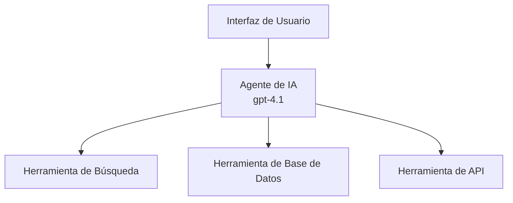
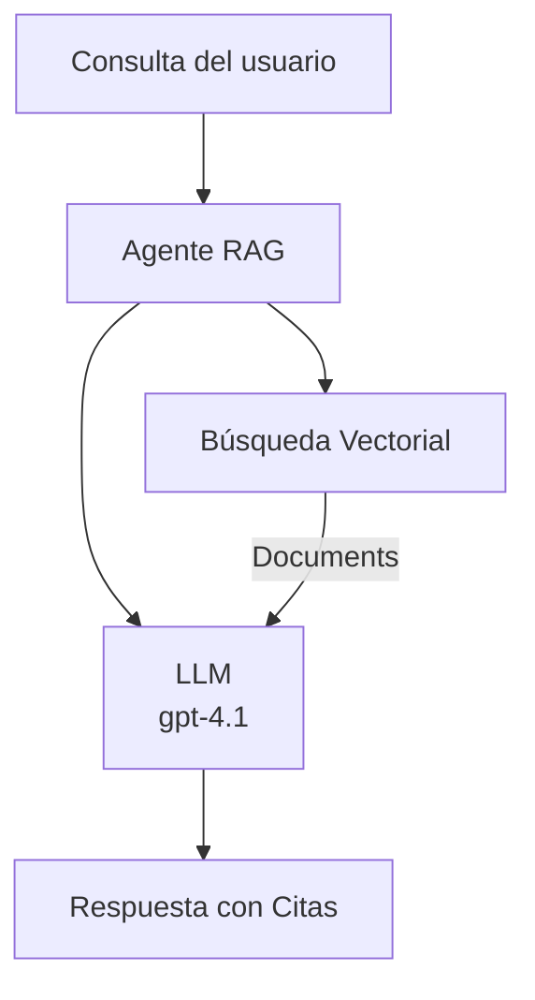
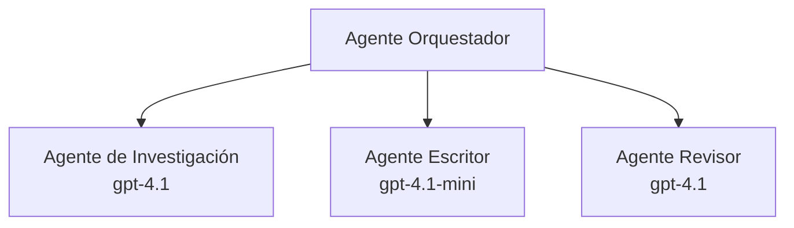

# Agentes de IA con Azure Developer CLI

**Navegación del Capítulo:**
- **📚 Inicio del curso**: [AZD para principiantes](../../README.md)
- **📖 Capítulo Actual**: Capítulo 2 - Desarrollo con IA como prioridad
- **⬅️ Anterior**: [Integración con Microsoft Foundry](microsoft-foundry-integration.md)
- **➡️ Siguiente**: [Despliegue de modelo de IA](ai-model-deployment.md)
- **🚀 Avanzado**: [Soluciones Multi-Agente](../../examples/retail-scenario.md)

---

## Introducción

Los agentes de IA son programas autónomos que pueden percibir su entorno, tomar decisiones y realizar acciones para alcanzar objetivos específicos. A diferencia de los chatbots simples que responden a indicaciones, los agentes pueden:

- **Usar herramientas** - Llamar APIs, buscar bases de datos, ejecutar código
- **Planificar y razonar** - Dividir tareas complejas en pasos
- **Aprender del contexto** - Mantener memoria y adaptar comportamiento
- **Colaborar** - Trabajar con otros agentes (sistemas multi-agente)

Esta guía te muestra cómo desplegar agentes de IA en Azure usando Azure Developer CLI (azd).

> **Nota de validación (2026-07-13):** Esta guía fue revisada con `azd` `1.27.1` y `azure.ai.agents` `1.0.0-beta.5`. La experiencia `azd ai` aún está en vista previa, así que revisa la ayuda de la extensión si tus flags instalados difieren.

## Objetivos de aprendizaje

Al completar esta guía, podrás:
- Entender qué son los agentes de IA y cómo difieren de los chatbots
- Desplegar plantillas de agentes de IA preconstruidas usando AZD
- Configurar Foundry Agents para agentes personalizados
- Implementar patrones básicos para agentes (uso de herramientas, RAG, multi-agente)
- Supervisar y depurar agentes desplegados

## Resultados de aprendizaje

Al finalizar, serás capaz de:
- Desplegar aplicaciones de agentes de IA en Azure con un solo comando
- Configurar herramientas y capacidades del agente
- Implementar generación aumentada por recuperación (RAG) con agentes
- Diseñar arquitecturas multi-agente para flujos de trabajo complejos
- Solucionar problemas comunes en despliegues de agentes

---

## 🤖 ¿Qué hace diferente a un agente de un chatbot?

| Característica | Chatbot | Agente de IA |
|--------------|---------|--------------|
| **Comportamiento** | Responde a indicaciones | Toma acciones autónomas |
| **Herramientas** | Ninguna | Puede llamar APIs, buscar, ejecutar código |
| **Memoria** | Solo en sesión | Memoria persistente entre sesiones |
| **Planificación** | Respuesta única | Razonamiento en múltiples pasos |
| **Colaboración** | Entidad única | Puede trabajar con otros agentes |

### Analogía simple

- **Chatbot** = Una persona amable respondiendo preguntas en un mostrador de información
- **Agente de IA** = Un asistente personal que puede hacer llamadas, reservar citas y completar tareas por ti

---

## 🚀 Inicio rápido: Despliega tu primer agente

### Opción 1: Plantilla Foundry Agents (Recomendada)

```bash
# Inicializar la plantilla de agentes de IA
azd init --template get-started-with-ai-agents

# Desplegar en Azure
azd up
```

**Qué se despliega:**
- ✅ Foundry Agents
- ✅ Modelos Microsoft Foundry (gpt-4.1)
- ✅ Azure AI Search (para RAG)
- ✅ Azure Container Apps (interfaz web)
- ✅ Application Insights (monitoreo)

**Tiempo:** ~15-20 minutos
**Costo:** ~$100-150/mes (desarrollo)

### Opción 2: Agente OpenAI con Prompty

```bash
# Inicializar la plantilla del agente basado en Prompty
azd init --template agent-openai-python-prompty

# Desplegar en Azure
azd up
```

**Qué se despliega:**
- ✅ Azure Functions (ejecución serverless del agente)
- ✅ Modelos Microsoft Foundry
- ✅ Archivos de configuración Prompty
- ✅ Implementación de ejemplo de agente

**Tiempo:** ~10-15 minutos
**Costo:** ~$50-100/mes (desarrollo)

### Opción 3: Agente de Chat RAG

```bash
# Inicializar plantilla de chat RAG
azd init --template azure-search-openai-demo

# Desplegar en Azure
azd up
```

**Qué se despliega:**
- ✅ Modelos Microsoft Foundry
- ✅ Azure AI Search con datos de ejemplo
- ✅ Canalización de procesamiento de documentos
- ✅ Interfaz de chat con citas

**Tiempo:** ~15-25 minutos
**Costo:** ~$80-150/mes (desarrollo)

### Opción 4: Inicialización AZD AI Agent (Vista previa basada en manifiesto o plantilla)

Si tienes un archivo manifiesto de agente, puedes usar el comando `azd ai` para generar directamente un proyecto Foundry Agent Service. Las versiones recientes en vista previa también añadieron soporte para inicialización basada en plantillas, así que el flujo exacto puede variar ligeramente según la versión de la extensión instalada.

```bash
# Instalar la extensión de agentes de IA
azd extension install azure.ai.agents

# Opcional: verificar la versión preliminar instalada
azd extension show azure.ai.agents

# Inicializar desde un manifiesto de agente
azd ai agent init -m agent-manifest.yaml

# Desplegar en Azure
azd up

# Probar el agente desplegado (muestra latencia + tiempo hasta el primer byte)
azd ai agent invoke
```

**Cuándo usar `azd ai agent init` vs `azd init --template`:**

| Enfoque | Mejor para | Cómo funciona |
|---------|-----------|--------------|
| `azd init --template` | Comenzar desde una app de ejemplo funcional | Clona un repositorio de plantilla con código + infraestructura |
| `azd ai agent init -m` | Construir desde tu propio manifiesto de agente | Crea estructura de proyecto desde tu definición de agente |

> **Consejo:** Usa `azd init --template` al aprender (Opciones 1-3 arriba). Usa `azd ai agent init` al construir agentes de producción con tus propios manifiestos.

Después de `azd up`, la misma extensión te guía por el resto del ciclo de vida del agente: `azd ai agent invoke` para probar, `azd ai agent eval generate` y `azd ai agent optimize` para medir y mejorar la calidad, y `azd ai agent delete` para limpiar. Consulta [Comandos AZD AI CLI](../chapter-08-production/production-ai-practices.md#azd-ai-cli-commands-and-extensions) para referencia completa.

---

## 🏗️ Patrones de arquitectura de agentes

### Patrón 1: Agente único con herramientas

El patrón de agente más simple: un agente que puede usar múltiples herramientas.



**Ideal para:**
- Bots de atención al cliente
- Asistentes de investigación
- Agentes de análisis de datos

**Plantilla AZD:** `azure-search-openai-demo`

### Patrón 2: Agente RAG (Generación Aumentada por Recuperación)

Un agente que recupera documentos relevantes antes de generar respuestas.



**Ideal para:**
- Bases de conocimiento empresariales
- Sistemas de preguntas y respuestas con documentos
- Investigación legal y cumplimiento

**Plantilla AZD:** `azure-search-openai-demo`

### Patrón 3: Sistema Multi-Agente

Múltiples agentes especializados trabajando juntos en tareas complejas.



**Ideal para:**
- Generación de contenido compleja
- Flujos de trabajo en múltiples pasos
- Tareas que requieren diferentes especialidades

**Más información:** [Patrones de coordinación multi-agente](../chapter-06-pre-deployment/coordination-patterns.md)

---

## ⚙️ Configuración de herramientas del agente

Los agentes se vuelven poderosos cuando pueden usar herramientas. Aquí te mostramos cómo configurar herramientas comunes:

### Configuración de herramientas en Foundry Agents

```python
# agent_config.py
from azure.ai.projects import AIProjectClient
from azure.ai.projects.models import FunctionTool, CodeInterpreterTool

# Definir herramientas personalizadas
search_tool = FunctionTool(
    name="search_knowledge_base",
    description="Search the company knowledge base for relevant documents",
    parameters={
        "type": "object",
        "properties": {
            "query": {
                "type": "string",
                "description": "The search query"
            }
        },
        "required": ["query"]
    }
)

# Crear agente con herramientas
agent = project_client.agents.create_agent(
    model="gpt-4.1",
    name="Support Agent",
    instructions="You are a helpful support agent. Use the search tool to find relevant information.",
    tools=[search_tool, CodeInterpreterTool()]
)
```

### Configuración del entorno

```bash
# Configurar variables de entorno específicas del agente
azd env set AZURE_OPENAI_MODEL "gpt-4.1"
azd env set AGENT_INSTRUCTIONS "You are a helpful assistant..."
azd env set ENABLE_CODE_INTERPRETER "true"
azd env set ENABLE_FILE_SEARCH "true"

# Desplegar con configuración actualizada
azd deploy
```

---

## 📊 Monitoreo de agentes

### Integración con Application Insights

Todas las plantillas de agentes AZD incluyen Application Insights para monitoreo:

```bash
# Abrir panel de monitoreo
azd monitor --overview

# Ver registros en vivo
azd monitor --logs

# Ver métricas en vivo
azd monitor --live
```

### Métricas clave para monitorear

| Métrica | Descripción | Objetivo |
|---------|-------------|---------|
| Latencia de respuesta | Tiempo para generar una respuesta | < 5 segundos |
| Uso de tokens | Tokens por solicitud | Monitorizar para costo |
| Tasa de éxito de llamadas a herramientas | % de ejecuciones exitosas de herramientas | > 95% |
| Tasa de error | Solicitudes fallidas del agente | < 1% |
| Satisfacción del usuario | Puntuaciones de retroalimentación | > 4.0/5.0 |

### Registro personalizado para agentes

```python
import os
from azure.monitor.opentelemetry import configure_azure_monitor
from opentelemetry import trace

# Configurar Azure Monitor con OpenTelemetry
configure_azure_monitor(
    connection_string=os.environ["APPLICATIONINSIGHTS_CONNECTION_STRING"]
)

tracer = trace.get_tracer(__name__)

def log_agent_interaction(user_query, agent_response, tools_used, latency_ms):
    with tracer.start_as_current_span("agent_interaction") as span:
        span.set_attributes({
            "user_query": user_query,
            "response_length": len(agent_response),
            "tools_used": tools_used,
            "latency_ms": latency_ms
        })
```

> **Nota:** Instala los paquetes requeridos: `pip install azure-monitor-opentelemetry opentelemetry`

---

## 💰 Consideraciones de costos

### Costos mensuales estimados por patrón

| Patrón | Entorno de desarrollo | Producción |
|--------|----------------------|------------|
| Agente único | $50-100 | $200-500 |
| Agente RAG | $80-150 | $300-800 |
| Multi-agente (2-3 agentes) | $150-300 | $500-1,500 |
| Multi-agente empresarial | $300-500 | $1,500-5,000+ |

### Consejos para optimización de costos

1. **Usa gpt-4.1-mini para tareas simples**
   ```bash
   azd env set AZURE_OPENAI_MODEL "gpt-4.1-mini"
   ```

2. **Implementa caché para consultas repetidas**
   ```python
   from functools import lru_cache
   
   @lru_cache(maxsize=1000)
   def get_cached_response(query_hash):
       return agent.run(query_hash)
   ```

3. **Establece límites de tokens por ejecución**
   ```python
   # Establecer max_completion_tokens al ejecutar el agente, no durante la creación
   run = project_client.agents.create_run(
       thread_id=thread.id,
       agent_id=agent.id,
       max_completion_tokens=1000  # Limitar la longitud de la respuesta
   )
   ```

4. **Escala a cero cuando no esté en uso**
   ```bash
   # Las aplicaciones de contenedor se escalan automáticamente a cero
   azd env set MIN_REPLICAS "0"
   ```

---

## 🔧 Solución de problemas con agentes

### Problemas comunes y soluciones

<details>
<summary><strong>❌ El agente no responde a llamadas de herramientas</strong></summary>

```bash
# Verificar si las herramientas están registradas correctamente
azd show

# Verificar implementación de OpenAI
az cognitiveservices account deployment list \
  --name $AZURE_OPENAI_NAME \
  --resource-group $RG_NAME

# Revisar los registros del agente
azd monitor --logs
```

**Causas comunes:**
- Desajuste en la firma de la función de la herramienta
- Permisos requeridos ausentes
- Punto de acceso API inaccesible
</details>

<details>
<summary><strong>❌ Latencia alta en respuestas del agente</strong></summary>

```bash
# Revisar Application Insights para detectar cuellos de botella
azd monitor --live

# Considerar usar un modelo más rápido
azd env set AZURE_OPENAI_MODEL "gpt-4.1-mini"
azd deploy
```

**Consejos de optimización:**
- Usar respuestas en streaming
- Implementar caché de respuestas
- Reducir tamaño de ventana de contexto
</details>

<details>
<summary><strong>❌ El agente devuelve información incorrecta o alucinada</strong></summary>

```python
# Mejorar con mejores indicaciones del sistema
instructions = """
You are a helpful assistant. IMPORTANT:
- Only answer based on provided context
- If you don't know, say "I don't know"
- Always cite your sources
- Never make up information
"""

# Agregar recuperación para fundamentación
agent = project_client.agents.create_agent(
    model="gpt-4.1",
    instructions=instructions,
    tools=[FileSearchTool()]  # Fundamentar respuestas en documentos
)
```
</details>

<details>
<summary><strong>❌ Errores por límite de tokens excedido</strong></summary>

```python
# Implementar la gestión de la ventana de contexto
def truncate_context(messages, max_tokens=8000, model="gpt-4.1"):
    """Keep only recent messages within token limit."""
    import tiktoken
    encoding = tiktoken.encoding_for_model(model)
    total_tokens = 0
    truncated = []
    
    for msg in reversed(messages):
        msg_tokens = len(encoding.encode(msg.content))
        if total_tokens + msg_tokens > max_tokens:
            break
        truncated.insert(0, msg)
        total_tokens += msg_tokens
    
    return truncated
```
</details>

---

## 🎓 Ejercicios prácticos

### Ejercicio 1: Desplegar un agente básico (20 minutos)

**Objetivo:** Desplegar tu primer agente de IA usando AZD

```bash
# Paso 1: Inicializar la plantilla
azd init --template get-started-with-ai-agents

# Paso 2: Iniciar sesión en Azure
azd auth login
# Si trabaja en varios inquilinos, agregue --tenant-id <tenant-id>

# Paso 3: Desplegar
azd up

# Paso 4: Probar el agente
# Salida esperada después del despliegue:
#   ¡Despliegue completo!
#   Punto final: https://<app-name>.<region>.azurecontainerapps.io
# Abra la URL que se muestra en la salida y pruebe hacer una pregunta

# Paso 5: Ver monitoreo
azd monitor --overview

# Paso 6: Limpiar
azd down --force --purge
```

**Criterios de éxito:**
- [ ] El agente responde preguntas
- [ ] Puede acceder al panel de monitoreo vía `azd monitor`
- [ ] Recursos limpiados exitosamente

### Ejercicio 2: Agregar una herramienta personalizada (30 minutos)

**Objetivo:** Extender un agente con una herramienta personalizada

1. Despliega la plantilla del agente:
   ```bash
   azd init --template get-started-with-ai-agents
   azd up
   ```
2. Crea una nueva función de herramienta en el código del agente:
   ```python
   def get_weather(location: str) -> str:
       """Get current weather for a location."""
       # Llamada API al servicio meteorológico
       return f"Weather in {location}: Sunny, 72°F"
   ```
3. Registra la herramienta con el agente:
   ```python
   from azure.ai.projects.models import FunctionTool

   weather_tool = FunctionTool(
       name="get_weather",
       description="Get current weather for a location",
       parameters={
           "type": "object",
           "properties": {
               "location": {"type": "string", "description": "City name"}
           },
           "required": ["location"]
       }
   )

   agent = project_client.agents.create_agent(
       model="gpt-4.1",
       name="Weather Agent",
       tools=[weather_tool]
   )
   ```
4. Vuelve a desplegar y prueba:
   ```bash
   azd deploy
   # Preguntar: "¿Cuál es el clima en Seattle?"
   # Esperado: El agente llama a get_weather("Seattle") y devuelve la información del clima
   ```

**Criterios de éxito:**
- [ ] El agente reconoce consultas relacionadas con el clima
- [ ] La herramienta se llama correctamente
- [ ] La respuesta incluye información sobre el clima

### Ejercicio 3: Construir un agente RAG (45 minutos)

**Objetivo:** Crear un agente que responda preguntas desde tus documentos

```bash
# Paso 1: Desplegar la plantilla RAG
azd init --template azure-search-openai-demo
azd up

# Paso 2: Subir tus documentos
# Coloca archivos PDF/TXT en el directorio data/, luego ejecuta:
python scripts/prepdocs.py

# Paso 3: Probar con preguntas específicas del dominio
# Abre la URL de la aplicación web desde la salida de azd up
# Haz preguntas sobre tus documentos subidos
# Las respuestas deben incluir referencias de citas como [doc.pdf]
```

**Criterios de éxito:**
- [ ] El agente responde desde documentos subidos
- [ ] Las respuestas incluyen citas
- [ ] No hay alucinaciones en preguntas fuera de alcance

---

## 📚 Siguientes pasos

Ahora que entiendes los agentes de IA, explora estos temas avanzados:

| Tema | Descripción | Enlace |
|------|-------------|--------|
| **Sistemas Multi-Agente** | Construir sistemas con múltiples agentes colaborativos | [Ejemplo Multi-Agente en Retail](../../examples/retail-scenario.md) |
| **Patrones de Coordinación** | Aprender patrones de orquestación y comunicación | [Patrones de Coordinación](../chapter-06-pre-deployment/coordination-patterns.md) |
| **Despliegue en Producción** | Despliegue empresarial de agentes | [Prácticas de IA para producción](../chapter-08-production/production-ai-practices.md) |
| **Evaluación de Agentes** | Probar y evaluar rendimiento de agentes | [Solución de problemas AI](../chapter-07-troubleshooting/ai-troubleshooting.md) |
| **Laboratorio de Taller AI** | Prácticas: Prepara tu solución IA para AZD | [Laboratorio de Taller AI](ai-workshop-lab.md) |

---

## 📖 Recursos adicionales

### Documentación oficial
- [Microsoft Foundry Agent Service](https://learn.microsoft.com/azure/ai-services/agents/)
- [Inicio rápido Microsoft Foundry Agent Service](https://learn.microsoft.com/azure/ai-services/agents/quickstart)
- [Framework Semantic Kernel Agent](https://learn.microsoft.com/semantic-kernel/)

### Plantillas AZD para agentes
- [Comienza con agentes de IA](https://github.com/Azure-Samples/get-started-with-ai-agents)
- [Agent OpenAI Python Prompty](https://github.com/Azure-Samples/agent-openai-python-prompty)
- [Azure Search OpenAI Demo](https://github.com/Azure-Samples/azure-search-openai-demo)

### Recursos comunitarios
- [Awesome AZD - Plantillas de agentes](https://azure.github.io/awesome-azd/?tags=ai-agents)
- [Azure AI Discord](https://discord.gg/microsoft-azure)
- [Microsoft Foundry Discord](https://discord.gg/nTYy5BXMWG)

### Habilidades de agentes para tu editor
- [**Habilidades de agente Microsoft Azure**](https://skills.sh/microsoft/github-copilot-for-azure) - Instala habilidades reutilizables de agentes IA para desarrollo en Azure con GitHub Copilot, Cursor o cualquier agente compatible. Incluye habilidades para [Azure AI](https://skills.sh/microsoft/github-copilot-for-azure/azure-ai), [Microsoft Foundry](https://skills.sh/microsoft/github-copilot-for-azure/microsoft-foundry), [despliegue](https://skills.sh/microsoft/github-copilot-for-azure/azure-deploy), y [diagnósticos](https://skills.sh/microsoft/github-copilot-for-azure/azure-diagnostics):
  ```bash
  npx skills add microsoft/github-copilot-for-azure
  ```

---

**Navegación**
- **Lección Anterior**: [Integración Microsoft Foundry](microsoft-foundry-integration.md)
- **Lección Siguiente**: [Despliegue de modelo de IA](ai-model-deployment.md)

---

<!-- CO-OP TRANSLATOR DISCLAIMER START -->
**Descargo de responsabilidad**:
Este documento ha sido traducido utilizando el servicio de traducción automática [Co-op Translator](https://github.com/Azure/co-op-translator). Aunque nos esforzamos por la precisión, tenga en cuenta que las traducciones automatizadas pueden contener errores o inexactitudes. El documento original en su idioma nativo debe considerarse la fuente autorizada. Para información crítica, se recomienda una traducción profesional humana. No somos responsables de cualquier malentendido o interpretación errónea que surja del uso de esta traducción.
<!-- CO-OP TRANSLATOR DISCLAIMER END -->