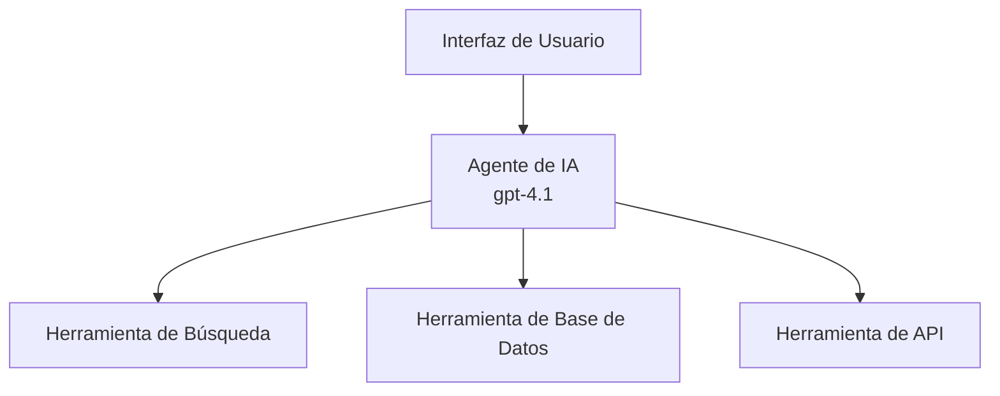
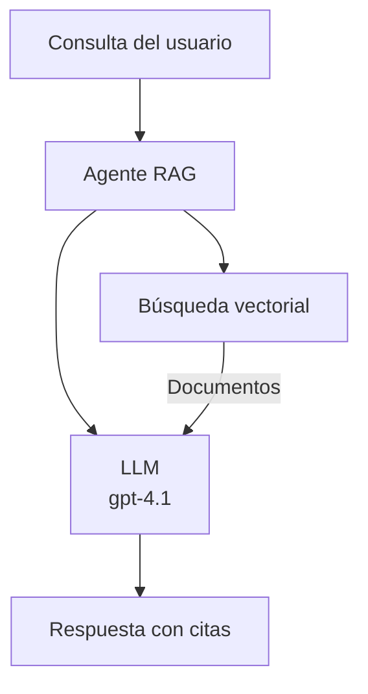
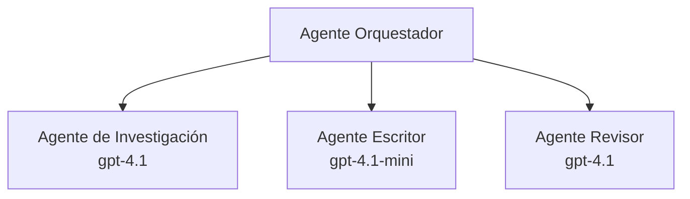

# AI Agents with Azure Developer CLI

**Navegación del capítulo:**
- **📚 Inicio del curso**: [AZD para principiantes](../../README.md)
- **📖 Capítulo actual**: Capítulo 2 - Desarrollo centrado en IA
- **⬅️ Anterior**: [Microsoft Foundry Integration](microsoft-foundry-integration.md)
- **➡️ Siguiente**: [AI Model Deployment](ai-model-deployment.md)
- **🚀 Avanzado**: [Soluciones Multi-Agente](../../examples/retail-scenario.md)

---

## Introducción

Los agentes de IA son programas autónomos que pueden percibir su entorno, tomar decisiones y realizar acciones para lograr objetivos específicos. A diferencia de los chatbots simples que responden a indicaciones, los agentes pueden:

- **Usar herramientas** - Llamar API, buscar en bases de datos, ejecutar código
- **Planificar y razonar** - Dividir tareas complejas en pasos
- **Aprender del contexto** - Mantener memoria y adaptar su comportamiento
- **Colaborar** - Trabajar con otros agentes (sistemas multi-agente)

Esta guía muestra cómo desplegar agentes de IA en Azure usando Azure Developer CLI (azd).

> **Nota de validación (2026-03-25):** Esta guía fue revisada contra `azd` `1.23.12` y `azure.ai.agents` `0.1.18-preview`. La experiencia `azd ai` aún está impulsada por previews, así que verifica la ayuda de la extensión si tus flags instalados difieren.

## Objetivos de aprendizaje

Al completar esta guía, usted:
- Entenderá qué son los agentes de IA y cómo se diferencian de los chatbots
- Desplegará plantillas de agentes preconstruidas usando AZD
- Configurará Foundry Agents para agentes personalizados
- Implementará patrones básicos de agente (uso de herramientas, RAG, multi-agente)
- Monitorizará y depurará agentes desplegados

## Resultados de aprendizaje

Al finalizar, podrá:
- Desplegar aplicaciones de agentes de IA en Azure con un solo comando
- Configurar herramientas y capacidades de los agentes
- Implementar generación aumentada por recuperación (RAG) con agentes
- Diseñar arquitecturas multi-agente para flujos de trabajo complejos
- Resolver problemas comunes de despliegue de agentes

---

## 🤖 ¿Qué hace a un agente diferente de un chatbot?

| Feature | Chatbot | AI Agent |
|---------|---------|----------|
| **Comportamiento** | Responde a indicaciones | Realiza acciones autónomas |
| **Herramientas** | Ninguna | Puede llamar APIs, buscar, ejecutar código |
| **Memoria** | Solo por sesión | Memoria persistente entre sesiones |
| **Planificación** | Respuesta única | Razonamiento en múltiples pasos |
| **Colaboración** | Entidad única | Puede trabajar con otros agentes |

### Analogía simple

- **Chatbot** = Una persona servicial respondiendo preguntas en un mostrador de información
- **Agente de IA** = Un asistente personal que puede hacer llamadas, reservar citas y completar tareas por ti

---

## 🚀 Inicio rápido: Despliega tu primer agente

### Opción 1: Plantilla Foundry Agents (Recomendada)

```bash
# Inicializar la plantilla de agentes de IA
azd init --template get-started-with-ai-agents

# Implementar en Azure
azd up
```

**Qué se despliega:**
- ✅ Foundry Agents
- ✅ Microsoft Foundry Models (gpt-4.1)
- ✅ Azure AI Search (para RAG)
- ✅ Azure Container Apps (interfaz web)
- ✅ Application Insights (monitorización)

**Tiempo:** ~15-20 minutos
**Coste:** ~$100-150/mes (desarrollo)

### Opción 2: Agente OpenAI con Prompty

```bash
# Inicializar la plantilla de agente basada en Prompty
azd init --template agent-openai-python-prompty

# Desplegar en Azure
azd up
```

**Qué se despliega:**
- ✅ Azure Functions (ejecución serverless del agente)
- ✅ Microsoft Foundry Models
- ✅ Archivos de configuración de Prompty
- ✅ Implementación de agente de ejemplo

**Tiempo:** ~10-15 minutos
**Coste:** ~$50-100/mes (desarrollo)

### Opción 3: Agente de Chat RAG

```bash
# Inicializar plantilla de chat RAG
azd init --template azure-search-openai-demo

# Desplegar en Azure
azd up
```

**Qué se despliega:**
- ✅ Microsoft Foundry Models
- ✅ Azure AI Search con datos de ejemplo
- ✅ Canalización de procesamiento de documentos
- ✅ Interfaz de chat con citas

**Tiempo:** ~15-25 minutos
**Coste:** ~$80-150/mes (desarrollo)

### Opción 4: AZD AI Agent Init (Vista previa basada en manifiesto o plantilla)

Si tienes un archivo de manifiesto de agente, puedes usar el comando `azd ai` para generar un proyecto Foundry Agent Service directamente. Las versiones recientes en preview también añadieron soporte de inicialización basada en plantillas, por lo que el flujo exacto de indicaciones puede diferir ligeramente según la versión de la extensión que tengas instalada.

```bash
# Instalar la extensión de agentes de IA
azd extension install azure.ai.agents

# Opcional: verificar la versión preliminar instalada
azd extension show azure.ai.agents

# Inicializar desde un manifiesto de agente
azd ai agent init -m agent-manifest.yaml

# Implementar en Azure
azd up

# Probar el agente desplegado (muestra latencia + tiempo hasta el primer byte)
azd ai agent invoke
```

**Cuándo usar `azd ai agent init` vs `azd init --template`:**

| Approach | Best For | How It Works |
|----------|----------|------|
| `azd init --template` | Empezar desde una aplicación de ejemplo funcional | Clona un repositorio de plantilla completo con código + infraestructura |
| `azd ai agent init -m` | Construir desde tu propio manifiesto de agente | Genera la estructura del proyecto a partir de tu definición de agente |

> **Consejo:** Usa `azd init --template` cuando estás aprendiendo (Opciones 1-3 arriba). Usa `azd ai agent init` cuando construyas agentes de producción con tus propios manifiestos.

Después de `azd up`, la misma extensión te guía a través del resto del ciclo de vida del agente: `azd ai agent invoke` para probar, `azd ai agent eval generate` y `azd ai agent optimize` para medir y mejorar la calidad, y `azd ai agent delete` para limpiar. Consulta [AZD AI CLI Commands](../chapter-08-production/production-ai-practices.md#azd-ai-cli-commands-and-extensions) para la referencia completa.

---

## 🏗️ Patrones de arquitectura de agentes

### Patrón 1: Agente único con herramientas

El patrón de agente más simple: un agente que puede usar múltiples herramientas.



**Ideal para:**
- Bots de soporte al cliente
- Asistentes de investigación
- Agentes de análisis de datos

**Plantilla AZD:** `azure-search-openai-demo`

### Patrón 2: Agente RAG (Generación aumentada por recuperación)

Un agente que recupera documentos relevantes antes de generar respuestas.



**Ideal para:**
- Bases de conocimiento empresariales
- Sistemas de preguntas y respuestas sobre documentos
- Investigación legal y de cumplimiento

**Plantilla AZD:** `azure-search-openai-demo`

### Patrón 3: Sistema Multi-Agente

Múltiples agentes especializados que trabajan juntos en tareas complejas.



**Ideal para:**
- Generación de contenido complejo
- Flujos de trabajo en varios pasos
- Tareas que requieren diferentes áreas de expertise

**Más información:** [Multi-Agent Coordination Patterns](../chapter-06-pre-deployment/coordination-patterns.md)

---

## ⚙️ Configuración de herramientas del agente

Los agentes se vuelven poderosos cuando pueden usar herramientas. Aquí se explica cómo configurar herramientas comunes:

### Configuración de herramientas en Foundry Agents

```python
# agent_config.py
from azure.ai.projects import AIProjectClient
from azure.ai.projects.models import FunctionTool, CodeInterpreterTool

# Definir herramientas personalizadas
search_tool = FunctionTool(
    name="search_knowledge_base",
    description="Search the company knowledge base for relevant documents",
    parameters={
        "type": "object",
        "properties": {
            "query": {
                "type": "string",
                "description": "The search query"
            }
        },
        "required": ["query"]
    }
)

# Crear agente con herramientas
agent = project_client.agents.create_agent(
    model="gpt-4.1",
    name="Support Agent",
    instructions="You are a helpful support agent. Use the search tool to find relevant information.",
    tools=[search_tool, CodeInterpreterTool()]
)
```

### Configuración del entorno

```bash
# Configurar variables de entorno específicas del agente
azd env set AZURE_OPENAI_MODEL "gpt-4.1"
azd env set AGENT_INSTRUCTIONS "You are a helpful assistant..."
azd env set ENABLE_CODE_INTERPRETER "true"
azd env set ENABLE_FILE_SEARCH "true"

# Desplegar con la configuración actualizada
azd deploy
```

---

## 📊 Monitorización de agentes

### Integración con Application Insights

Todas las plantillas de agentes AZD incluyen Application Insights para monitorización:

```bash
# Abrir panel de supervisión
azd monitor --overview

# Ver registros en tiempo real
azd monitor --logs

# Ver métricas en tiempo real
azd monitor --live
```

### Métricas clave a rastrear

| Metric | Description | Target |
|--------|-------------|--------|
| Latencia de respuesta | Tiempo para generar la respuesta | < 5 segundos |
| Uso de tokens | Tokens por solicitud | Monitorear por coste |
| Tasa de éxito de llamadas a herramientas | % de ejecuciones de herramientas exitosas | > 95% |
| Tasa de error | Solicitudes de agente fallidas | < 1% |
| Satisfacción del usuario | Puntuaciones de retroalimentación | > 4.0/5.0 |

### Registro personalizado para agentes

```python
import os
from azure.monitor.opentelemetry import configure_azure_monitor
from opentelemetry import trace

# Configurar Azure Monitor con OpenTelemetry
configure_azure_monitor(
    connection_string=os.environ["APPLICATIONINSIGHTS_CONNECTION_STRING"]
)

tracer = trace.get_tracer(__name__)

def log_agent_interaction(user_query, agent_response, tools_used, latency_ms):
    with tracer.start_as_current_span("agent_interaction") as span:
        span.set_attributes({
            "user_query": user_query,
            "response_length": len(agent_response),
            "tools_used": tools_used,
            "latency_ms": latency_ms
        })
```

> **Nota:** Instala los paquetes requeridos: `pip install azure-monitor-opentelemetry opentelemetry`

---

## 💰 Consideraciones de coste

### Costes mensuales estimados por patrón

| Pattern | Dev Environment | Production |
|---------|-----------------|------------|
| Agente único | $50-100 | $200-500 |
| Agente RAG | $80-150 | $300-800 |
| Multi-Agente (2-3 agentes) | $150-300 | $500-1,500 |
| Multi-Agente empresarial | $300-500 | $1,500-5,000+ |

### Consejos para optimizar costes

1. **Usa gpt-4.1-mini para tareas simples**
   ```bash
   azd env set AZURE_OPENAI_MODEL "gpt-4.1-mini"
   ```

2. **Implementa caché para consultas repetidas**
   ```python
   from functools import lru_cache
   
   @lru_cache(maxsize=1000)
   def get_cached_response(query_hash):
       return agent.run(query_hash)
   ```

3. **Establece límites de tokens por ejecución**
   ```python
   # Establezca max_completion_tokens al ejecutar el agente, no durante la creación
   run = project_client.agents.create_run(
       thread_id=thread.id,
       agent_id=agent.id,
       max_completion_tokens=1000  # Limite la longitud de la respuesta
   )
   ```

4. **Escala a cero cuando no esté en uso**
   ```bash
   # Container Apps se escalan automáticamente a cero
   azd env set MIN_REPLICAS "0"
   ```

---

## 🔧 Solución de problemas para agentes

### Problemas comunes y soluciones

<details>
<summary><strong>❌ El agente no responde a llamadas de herramientas</strong></summary>

```bash
# Comprueba si las herramientas están registradas correctamente
azd show

# Verifica la implementación de OpenAI
az cognitiveservices account deployment list \
  --name $AZURE_OPENAI_NAME \
  --resource-group $RG_NAME

# Comprueba los registros del agente
azd monitor --logs
```

**Causas comunes:**
- Firma de la función de la herramienta incompatible
- Permisos requeridos faltantes
- Punto de enlace de la API no accesible
</details>

<details>
<summary><strong>❌ Latencia alta en las respuestas del agente</strong></summary>

```bash
# Revisar Application Insights para detectar cuellos de botella
azd monitor --live

# Considerar usar un modelo más rápido
azd env set AZURE_OPENAI_MODEL "gpt-4.1-mini"
azd deploy
```

**Consejos de optimización:**
- Usar respuestas por streaming
- Implementar caché de respuestas
- Reducir el tamaño de la ventana de contexto
</details>

<details>
<summary><strong>❌ El agente devuelve información incorrecta o alucinaciones</strong></summary>

```python
# Mejorar con mejores mensajes del sistema
instructions = """
You are a helpful assistant. IMPORTANT:
- Only answer based on provided context
- If you don't know, say "I don't know"
- Always cite your sources
- Never make up information
"""

# Agregar recuperación para el anclaje
agent = project_client.agents.create_agent(
    model="gpt-4.1",
    instructions=instructions,
    tools=[FileSearchTool()]  # Fundamentar las respuestas en documentos
)
```
</details>

<details>
<summary><strong>❌ Errores por exceder el límite de tokens</strong></summary>

```python
# Implementar la gestión de la ventana de contexto
def truncate_context(messages, max_tokens=8000, model="gpt-4.1"):
    """Keep only recent messages within token limit."""
    import tiktoken
    encoding = tiktoken.encoding_for_model(model)
    total_tokens = 0
    truncated = []
    
    for msg in reversed(messages):
        msg_tokens = len(encoding.encode(msg.content))
        if total_tokens + msg_tokens > max_tokens:
            break
        truncated.insert(0, msg)
        total_tokens += msg_tokens
    
    return truncated
```
</details>

---

## 🎓 Ejercicios prácticos

### Ejercicio 1: Desplegar un agente básico (20 minutos)

**Objetivo:** Desplegar tu primer agente de IA usando AZD

```bash
# Paso 1: Inicializar la plantilla
azd init --template get-started-with-ai-agents

# Paso 2: Iniciar sesión en Azure
azd auth login
# Si trabaja con varios inquilinos, agregue --tenant-id <tenant-id>

# Paso 3: Desplegar
azd up

# Paso 4: Probar el agente
# Salida esperada después del despliegue:
#   ¡Despliegue completado!
#   Punto de enlace: https://<app-name>.<region>.azurecontainerapps.io
# Abra la URL que aparece en la salida y pruebe a hacer una pregunta

# Paso 5: Ver el monitoreo
azd monitor --overview

# Paso 6: Eliminar recursos
azd down --force --purge
```

**Criterios de éxito:**
- [ ] El agente responde a preguntas
- [ ] Puede acceder al panel de monitorización mediante `azd monitor`
- [ ] Los recursos se limpian correctamente

### Ejercicio 2: Añadir una herramienta personalizada (30 minutos)

**Objetivo:** Extender un agente con una herramienta personalizada

1. Despliega la plantilla del agente:
   ```bash
   azd init --template get-started-with-ai-agents
   azd up
   ```
2. Crea una nueva función de herramienta en el código de tu agente:
   ```python
   def get_weather(location: str) -> str:
       """Get current weather for a location."""
       # Llamada a la API del servicio meteorológico
       return f"Weather in {location}: Sunny, 72°F"
   ```
3. Registra la herramienta con el agente:
   ```python
   from azure.ai.projects.models import FunctionTool

   weather_tool = FunctionTool(
       name="get_weather",
       description="Get current weather for a location",
       parameters={
           "type": "object",
           "properties": {
               "location": {"type": "string", "description": "City name"}
           },
           "required": ["location"]
       }
   )

   agent = project_client.agents.create_agent(
       model="gpt-4.1",
       name="Weather Agent",
       tools=[weather_tool]
   )
   ```
4. Vuelve a desplegar y prueba:
   ```bash
   azd deploy
   # Pregunta: "¿Qué tiempo hace en Seattle?"
   # Esperado: El agente llama a get_weather("Seattle") y devuelve la información meteorológica.
   ```

**Criterios de éxito:**
- [ ] El agente reconoce consultas relacionadas con el tiempo
- [ ] La herramienta se llama correctamente
- [ ] La respuesta incluye información meteorológica

### Ejercicio 3: Construir un agente RAG (45 minutos)

**Objetivo:** Crear un agente que responda preguntas desde tus documentos

```bash
# Paso 1: Desplegar la plantilla RAG
azd init --template azure-search-openai-demo
azd up

# Paso 2: Sube tus documentos
# Coloca archivos PDF/TXT en el directorio data/, luego ejecuta:
python scripts/prepdocs.py

# Paso 3: Prueba con preguntas específicas del dominio
# Abre la URL de la aplicación web desde la salida de azd up
# Haz preguntas sobre tus documentos subidos
# Las respuestas deben incluir referencias de citación como [doc.pdf]
```

**Criterios de éxito:**
- [ ] El agente responde a partir de los documentos subidos
- [ ] Las respuestas incluyen citas
- [ ] No hay alucinaciones en preguntas fuera del alcance

---

## 📚 Próximos pasos

Ahora que entiendes los agentes de IA, explora estos temas avanzados:

| Topic | Description | Link |
|-------|-------------|------|
| **Sistemas multi-agente** | Construye sistemas con múltiples agentes que colaboran | [Retail Multi-Agent Example](../../examples/retail-scenario.md) |
| **Patrones de coordinación** | Aprende patrones de orquestación y comunicación | [Coordination Patterns](../chapter-06-pre-deployment/coordination-patterns.md) |
| **Despliegue en producción** | Despliegue de agentes listo para empresa | [Production AI Practices](../chapter-08-production/production-ai-practices.md) |
| **Evaluación de agentes** | Probar y evaluar el rendimiento del agente | [AI Troubleshooting](../chapter-07-troubleshooting/ai-troubleshooting.md) |
| **Laboratorio del taller de IA** | Práctica: Prepara tu solución de IA para AZD | [AI Workshop Lab](ai-workshop-lab.md) |

---

## 📖 Recursos adicionales

### Documentación oficial
- [Microsoft Foundry Agent Service](https://learn.microsoft.com/azure/ai-services/agents/)
- [Microsoft Foundry Agent Service Quickstart](https://learn.microsoft.com/azure/ai-services/agents/quickstart)
- [Semantic Kernel Agent Framework](https://learn.microsoft.com/semantic-kernel/)

### Plantillas AZD para agentes
- [Get Started with AI Agents](https://github.com/Azure-Samples/get-started-with-ai-agents)
- [Agent OpenAI Python Prompty](https://github.com/Azure-Samples/agent-openai-python-prompty)
- [Azure Search OpenAI Demo](https://github.com/Azure-Samples/azure-search-openai-demo)

### Recursos de la comunidad
- [Awesome AZD - Agent Templates](https://azure.github.io/awesome-azd/?tags=ai-agents)
- [Azure AI Discord](https://discord.gg/microsoft-azure)
- [Microsoft Foundry Discord](https://discord.gg/nTYy5BXMWG)

### Habilidades de agente para tu editor
- [**Microsoft Azure Agent Skills**](https://skills.sh/microsoft/github-copilot-for-azure) - Instala habilidades reutilizables de agentes de IA para el desarrollo en Azure en GitHub Copilot, Cursor o cualquier agente compatible. Incluye habilidades para [Azure AI](https://skills.sh/microsoft/github-copilot-for-azure/azure-ai), [Microsoft Foundry](https://skills.sh/microsoft/github-copilot-for-azure/microsoft-foundry), [despliegue](https://skills.sh/microsoft/github-copilot-for-azure/azure-deploy) y [diagnósticos](https://skills.sh/microsoft/github-copilot-for-azure/azure-diagnostics):
  ```bash
  npx skills add microsoft/github-copilot-for-azure
  ```

---

**Navegación**
- **Lección anterior**: [Microsoft Foundry Integration](microsoft-foundry-integration.md)
- **Siguiente lección**: [AI Model Deployment](ai-model-deployment.md)

---

<!-- CO-OP TRANSLATOR DISCLAIMER START -->
**Descargo de responsabilidad**:
Este documento ha sido traducido utilizando el servicio de traducción automática [Co-op Translator](https://github.com/Azure/co-op-translator). Aunque nos esforzamos por la precisión, tenga en cuenta que las traducciones automatizadas pueden contener errores o inexactitudes. El documento original en su idioma nativo debe considerarse la fuente autorizada. Para información crítica, se recomienda una traducción profesional humana. No somos responsables de cualquier malentendido o interpretación errónea que surja del uso de esta traducción.
<!-- CO-OP TRANSLATOR DISCLAIMER END -->