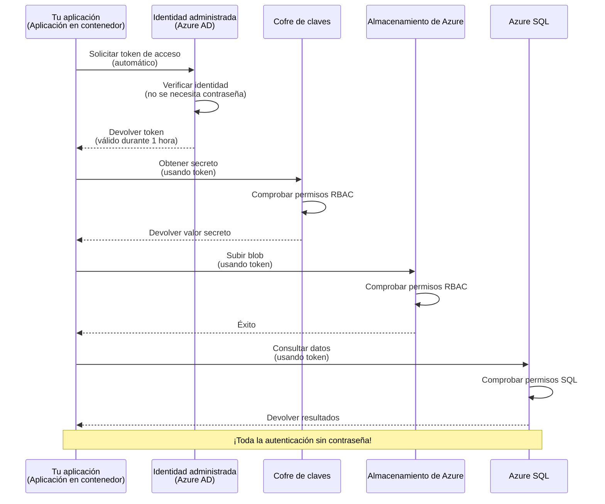
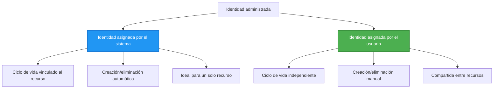

# Patrones de Autenticación e Identidad Administrada

⏱️ **Tiempo estimado**: 45-60 minutos | 💰 **Impacto de costo**: Gratis (sin cargos adicionales) | ⭐ **Complejidad**: Intermedio

**📚 Ruta de aprendizaje:**
- ← Anterior: [Gestión de configuración](configuration.md) - Administración de variables de entorno y secretos
- 🎯 **Estás aquí**: Autenticación y Seguridad (Identidad administrada, Key Vault, patrones seguros)
- → Siguiente: [Primer proyecto](first-project.md) - Construye tu primera aplicación AZD
- 🏠 [Inicio del curso](../../README.md)

---

## Lo que aprenderás

Al completar esta lección, tú:
- Comprenderás los patrones de autenticación en Azure (claves, cadenas de conexión, identidad administrada)
- Implementarás **Identidad administrada** para autenticación sin contraseñas
- Asegurarás secretos con integración de **Azure Key Vault**
- Configurarás **control de acceso basado en roles (RBAC)** para despliegues AZD
- Aplicarás mejores prácticas de seguridad en Container Apps y servicios de Azure
- Migrarás de autenticación basada en claves a basada en identidad

## Por qué importa la Identidad Administrada

### El problema: Autenticación tradicional

**Antes de la Identidad Administrada:**
```javascript
// ❌ RIESGO DE SEGURIDAD: Secretos codificados en el código
const connectionString = "Server=mydb.database.windows.net;User=admin;Password=P@ssw0rd123";
const storageKey = "xK7mN9pQ2wR5tY8uI0oP3aS6dF1gH4jK...";
const cosmosKey = "C2x7B9n4M1p8Q5w3E6r0T2y5U8i1O4p7...";
```

**Problemas:**
- 🔴 **Secretos expuestos** en el código, archivos de configuración, variables de entorno
- 🔴 **Rotación de credenciales** requiere cambios en el código y redeploy
- 🔴 **Pesadillas de auditoría** - ¿quién accedió a qué y cuándo?
- 🔴 **Proliferación** - secretos dispersos en múltiples sistemas
- 🔴 **Riesgos de cumplimiento** - falla en auditorías de seguridad

### La solución: Identidad administrada

**Después de la Identidad Administrada:**
```javascript
// ✅ SEGURO: No hay secretos en el código
const credential = new DefaultAzureCredential();
const client = new BlobServiceClient(
  "https://mystorageaccount.blob.core.windows.net",
  credential  // Azure gestiona automáticamente la autenticación
);
```

**Beneficios:**
- ✅ **Cero secretos** en el código o la configuración
- ✅ **Rotación automática** - Azure lo gestiona
- ✅ **Registro de auditoría completo** en los logs de Azure AD
- ✅ **Seguridad centralizada** - administrar desde el Portal de Azure
- ✅ **Preparado para cumplimiento** - cumple estándares de seguridad

**Analogía**: La autenticación tradicional es como llevar múltiples llaves físicas para diferentes puertas. La Identidad Administrada es como tener una tarjeta de seguridad que concede acceso automáticamente según quién eres—no hay llaves que perder, copiar o rotar.

---

## Visión general de la arquitectura

### Flujo de autenticación con Identidad Administrada


### Tipos de identidades administradas


| Feature | System-Assigned | User-Assigned |
|---------|----------------|---------------|
| **Lifecycle** | Tied to resource | Independent |
| **Creation** | Automatic with resource | Manual creation |
| **Deletion** | Deleted with resource | Persists after resource deletion |
| **Sharing** | One resource only | Multiple resources |
| **Use Case** | Simple scenarios | Complex multi-resource scenarios |
| **AZD Default** | ✅ Recommended | Optional |

---

## Prerrequisitos

### Herramientas requeridas

Deberías tener instaladas estas herramientas desde lecciones previas:

```bash
# Verificar Azure Developer CLI
azd version
# ✅ Esperado: azd versión 1.0.0 o superior

# Verificar Azure CLI
az --version
# ✅ Esperado: azure-cli 2.50.0 o superior
```

### Requisitos de Azure

- Suscripción activa de Azure
- Permisos para:
  - Crear identidades administradas
  - Asignar roles RBAC
  - Crear recursos de Key Vault
  - Desplegar Container Apps

### Conocimientos previos

Deberías haber completado:
- [Guía de instalación](installation.md) - Configuración de AZD
- [Conceptos básicos de AZD](azd-basics.md) - Conceptos centrales
- [Gestión de configuración](configuration.md) - Variables de entorno

---

## Lección 1: Comprendiendo los patrones de autenticación

### Patrón 1: Cadenas de conexión (Legado - Evitar)

**Cómo funciona:**
```bash
# La cadena de conexión contiene credenciales
STORAGE_CONNECTION_STRING="DefaultEndpointsProtocol=https;AccountName=myaccount;AccountKey=xK7mN9pQ2wR5..."
COSMOS_CONNECTION_STRING="AccountEndpoint=https://myaccount.documents.azure.com:443/;AccountKey=C2x7..."
SQL_CONNECTION_STRING="Server=myserver.database.windows.net;User=admin;Password=P@ssw0rd..."
```

**Problemas:**
- ❌ Secretos visibles en variables de entorno
- ❌ Registrados en sistemas de despliegue
- ❌ Difíciles de rotar
- ❌ Sin rastro de auditoría de acceso

**Cuándo usarlo:** Solo para desarrollo local, nunca en producción.

---

### Patrón 2: Referencias a Key Vault (Mejor)

**Cómo funciona:**
```bicep
// Store secret in Key Vault
resource keyVault 'Microsoft.KeyVault/vaults@2023-02-01' = {
  name: 'mykv'
  properties: {
    enableRbacAuthorization: true
  }
}

// Reference in Container App
env: [
  {
    name: 'STORAGE_KEY'
    secretRef: 'storage-key'  // References Key Vault
  }
]
```

**Beneficios:**
- ✅ Secretos almacenados de forma segura en Key Vault
- ✅ Gestión centralizada de secretos
- ✅ Rotación sin cambios en el código

**Limitaciones:**
- ⚠️ Todavía usa claves/contraseñas
- ⚠️ Necesidad de gestionar el acceso a Key Vault

**Cuándo usarlo:** Paso de transición de cadenas de conexión a identidad administrada.

---

### Patrón 3: Identidad administrada (Mejor práctica)

**Cómo funciona:**
```bicep
// Enable managed identity
resource containerApp 'Microsoft.App/containerApps@2023-05-01' = {
  name: 'myapp'
  identity: {
    type: 'SystemAssigned'  // Automatically creates identity
  }
}

// Grant permissions
resource roleAssignment 'Microsoft.Authorization/roleAssignments@2022-04-01' = {
  scope: storageAccount
  properties: {
    roleDefinitionId: storageBlobDataContributorRole
    principalId: containerApp.identity.principalId
  }
}
```

**Código de la aplicación:**
```javascript
// ¡No se necesitan secretos!
const { DefaultAzureCredential } = require('@azure/identity');
const { BlobServiceClient } = require('@azure/storage-blob');

const credential = new DefaultAzureCredential();
const blobServiceClient = new BlobServiceClient(
  'https://mystorageaccount.blob.core.windows.net',
  credential
);
```

**Beneficios:**
- ✅ Cero secretos en código/configuración
- ✅ Rotación automática de credenciales
- ✅ Registro de auditoría completo
- ✅ Permisos basados en RBAC
- ✅ Preparado para cumplimiento

**Cuándo usarlo:** Siempre, para aplicaciones en producción.

---

## Lección 2: Implementando Identidad Administrada con AZD

### Implementación paso a paso

Construyamos una Container App segura que use identidad administrada para acceder a Azure Storage y Key Vault.

### Estructura del proyecto

```
secure-app/
├── azure.yaml                 # AZD configuration
├── infra/
│   ├── main.bicep            # Main infrastructure
│   ├── core/
│   │   ├── identity.bicep    # Managed identity setup
│   │   ├── keyvault.bicep    # Key Vault configuration
│   │   └── storage.bicep     # Storage with RBAC
│   └── app/
│       └── container-app.bicep
└── src/
    ├── app.js                # Application code
    ├── package.json
    └── Dockerfile
```

### 1. Configurar AZD (azure.yaml)

```yaml
name: secure-app
metadata:
  template: secure-app@1.0.0

services:
  api:
    project: ./src
    language: js
    host: containerapp

# Enable managed identity (AZD handles this automatically)
```

### 2. Infraestructura: Habilitar Identidad Administrada

**File: `infra/main.bicep`**

```bicep
targetScope = 'subscription'

param environmentName string
param location string = 'eastus'

var tags = { 'azd-env-name': environmentName }

// Resource group
resource rg 'Microsoft.Resources/resourceGroups@2021-04-01' = {
  name: 'rg-${environmentName}'
  location: location
  tags: tags
}

// Storage Account
module storage './core/storage.bicep' = {
  name: 'storage'
  scope: rg
  params: {
    name: 'st${uniqueString(rg.id)}'
    location: location
    tags: tags
  }
}

// Key Vault
module keyVault './core/keyvault.bicep' = {
  name: 'keyvault'
  scope: rg
  params: {
    name: 'kv-${uniqueString(rg.id)}'
    location: location
    tags: tags
  }
}

// Container App with Managed Identity
module containerApp './app/container-app.bicep' = {
  name: 'container-app'
  scope: rg
  params: {
    name: 'ca-${environmentName}'
    location: location
    tags: tags
    storageAccountName: storage.outputs.name
    keyVaultName: keyVault.outputs.name
  }
}

// Grant Container App access to Storage
module storageRoleAssignment './core/role-assignment.bicep' = {
  name: 'storage-role'
  scope: rg
  params: {
    principalId: containerApp.outputs.identityPrincipalId
    roleDefinitionId: 'ba92f5b4-2d11-453d-a403-e96b0029c9fe'  // Storage Blob Data Contributor
    targetResourceId: storage.outputs.id
  }
}

// Grant Container App access to Key Vault
module kvRoleAssignment './core/role-assignment.bicep' = {
  name: 'kv-role'
  scope: rg
  params: {
    principalId: containerApp.outputs.identityPrincipalId
    roleDefinitionId: '4633458b-17de-408a-b874-0445c86b69e6'  // Key Vault Secrets User
    targetResourceId: keyVault.outputs.id
  }
}

// Outputs
output AZURE_STORAGE_ACCOUNT_NAME string = storage.outputs.name
output AZURE_KEY_VAULT_NAME string = keyVault.outputs.name
output APP_URL string = containerApp.outputs.url
```

### 3. Container App con identidad asignada al sistema

**File: `infra/app/container-app.bicep`**

```bicep
param name string
param location string
param tags object = {}
param storageAccountName string
param keyVaultName string

resource containerApp 'Microsoft.App/containerApps@2023-05-01' = {
  name: name
  location: location
  tags: tags
  identity: {
    type: 'SystemAssigned'  // 🔑 Enable managed identity
  }
  properties: {
    configuration: {
      ingress: {
        external: true
        targetPort: 3000
      }
    }
    template: {
      containers: [
        {
          name: 'api'
          image: 'myregistry.azurecr.io/api:latest'
          resources: {
            cpu: json('0.5')
            memory: '1Gi'
          }
          env: [
            {
              name: 'AZURE_STORAGE_ACCOUNT_NAME'
              value: storageAccountName
            }
            {
              name: 'AZURE_KEY_VAULT_NAME'
              value: keyVaultName
            }
            // 🔑 No secrets - managed identity handles authentication!
          ]
        }
      ]
    }
  }
}

// Output the identity for RBAC assignments
output identityPrincipalId string = containerApp.identity.principalId
output id string = containerApp.id
output url string = 'https://${containerApp.properties.configuration.ingress.fqdn}'
```

### 4. Módulo de asignación de roles RBAC

**File: `infra/core/role-assignment.bicep`**

```bicep
param principalId string
param roleDefinitionId string  // Azure built-in role ID
param targetResourceId string

resource roleAssignment 'Microsoft.Authorization/roleAssignments@2022-04-01' = {
  name: guid(principalId, roleDefinitionId, targetResourceId)
  scope: resourceId('Microsoft.Resources/resourceGroups', resourceGroup().name)
  properties: {
    roleDefinitionId: subscriptionResourceId('Microsoft.Authorization/roleDefinitions', roleDefinitionId)
    principalId: principalId
    principalType: 'ServicePrincipal'
  }
}

output id string = roleAssignment.id
```

### 5. Código de la aplicación con Identidad Administrada

**File: `src/app.js`**

```javascript
const express = require('express');
const { DefaultAzureCredential } = require('@azure/identity');
const { BlobServiceClient } = require('@azure/storage-blob');
const { SecretClient } = require('@azure/keyvault-secrets');

const app = express();
const PORT = process.env.PORT || 3000;

// 🔑 Inicializar credencial (funciona automáticamente con identidad administrada)
const credential = new DefaultAzureCredential();

// Configuración de Azure Storage
const storageAccountName = process.env.AZURE_STORAGE_ACCOUNT_NAME;
const blobServiceClient = new BlobServiceClient(
  `https://${storageAccountName}.blob.core.windows.net`,
  credential  // ¡No se necesitan claves!
);

// Configuración de Key Vault
const keyVaultName = process.env.AZURE_KEY_VAULT_NAME;
const secretClient = new SecretClient(
  `https://${keyVaultName}.vault.azure.net`,
  credential  // ¡No se necesitan claves!
);

// Comprobación de estado
app.get('/health', (req, res) => {
  res.json({ status: 'healthy', authentication: 'managed-identity' });
});

// Subir archivo al almacenamiento de blobs
app.post('/upload', async (req, res) => {
  try {
    const containerClient = blobServiceClient.getContainerClient('uploads');
    await containerClient.createIfNotExists();
    
    const blobName = `file-${Date.now()}.txt`;
    const blockBlobClient = containerClient.getBlockBlobClient(blobName);
    
    await blockBlobClient.upload('Hello from managed identity!', 30);
    
    res.json({
      success: true,
      blobName: blobName,
      message: 'File uploaded using managed identity!'
    });
  } catch (error) {
    console.error('Upload error:', error);
    res.status(500).json({ error: error.message });
  }
});

// Obtener secreto de Key Vault
app.get('/secret/:name', async (req, res) => {
  try {
    const secretName = req.params.name;
    const secret = await secretClient.getSecret(secretName);
    
    res.json({
      name: secretName,
      value: secret.value,
      message: 'Secret retrieved using managed identity!'
    });
  } catch (error) {
    console.error('Secret error:', error);
    res.status(500).json({ error: error.message });
  }
});

// Listar contenedores de blobs (demuestra acceso de lectura)
app.get('/containers', async (req, res) => {
  try {
    const containers = [];
    for await (const container of blobServiceClient.listContainers()) {
      containers.push(container.name);
    }
    
    res.json({
      containers: containers,
      count: containers.length,
      message: 'Containers listed using managed identity!'
    });
  } catch (error) {
    console.error('List error:', error);
    res.status(500).json({ error: error.message });
  }
});

app.listen(PORT, () => {
  console.log(`Secure API listening on port ${PORT}`);
  console.log('Authentication: Managed Identity (passwordless)');
});
```

**File: `src/package.json`**

```json
{
  "name": "secure-app",
  "version": "1.0.0",
  "dependencies": {
    "express": "^4.18.2",
    "@azure/identity": "^4.0.0",
    "@azure/storage-blob": "^12.17.0",
    "@azure/keyvault-secrets": "^4.7.0"
  },
  "scripts": {
    "start": "node app.js"
  }
}
```

### 6. Desplegar y probar

```bash
# Inicializar el entorno AZD
azd init

# Desplegar la infraestructura y la aplicación
azd up

# Obtener la URL de la aplicación
APP_URL=$(azd env get-values | grep APP_URL | cut -d '=' -f2 | tr -d '"')

# Probar la comprobación de estado
curl $APP_URL/health
```

**✅ Salida esperada:**
```json
{
  "status": "healthy",
  "authentication": "managed-identity"
}
```

**Prueba de carga de blob:**
```bash
curl -X POST $APP_URL/upload
```

**✅ Salida esperada:**
```json
{
  "success": true,
  "blobName": "file-1700404800000.txt",
  "message": "File uploaded using managed identity!"
}
```

**Prueba de listado de contenedores:**
```bash
curl $APP_URL/containers
```

**✅ Salida esperada:**
```json
{
  "containers": ["uploads"],
  "count": 1,
  "message": "Containers listed using managed identity!"
}
```

---

## Roles comunes de Azure RBAC

### IDs de roles integrados para Identidad Administrada

| Service | Role Name | Role ID | Permissions |
|---------|-----------|---------|-------------|
| **Storage** | Storage Blob Data Reader | `2a2b9908-6b94-4a3d-8e5a-a7d8f8cc8a12` | Leer blobs y contenedores |
| **Storage** | Storage Blob Data Contributor | `ba92f5b4-2d11-453d-a403-e96b0029c9fe` | Leer, escribir, eliminar blobs |
| **Storage** | Storage Queue Data Contributor | `974c5e8b-45b9-4653-ba55-5f855dd0fb88` | Leer, escribir, eliminar mensajes de cola |
| **Key Vault** | Key Vault Secrets User | `4633458b-17de-408a-b874-0445c86b69e6` | Lectura de secretos |
| **Key Vault** | Key Vault Secrets Officer | `b86a8fe4-44ce-4948-aee5-eccb2c155cd7` | Leer, escribir, eliminar secretos |
| **Cosmos DB** | Cosmos DB Built-in Data Reader | `00000000-0000-0000-0000-000000000001` | Leer datos de Cosmos DB |
| **Cosmos DB** | Cosmos DB Built-in Data Contributor | `00000000-0000-0000-0000-000000000002` | Leer y escribir datos de Cosmos DB |
| **SQL Database** | SQL DB Contributor | `9b7fa17d-e63e-47b0-bb0a-15c516ac86ec` | Administrar bases de datos SQL |
| **Service Bus** | Azure Service Bus Data Owner | `090c5cfd-751d-490a-894a-3ce6f1109419` | Enviar, recibir, administrar mensajes |

### Cómo encontrar los IDs de rol

```bash
# Listar todos los roles integrados
az role definition list --query "[].{Name:roleName, ID:name}" --output table

# Buscar un rol específico
az role definition list --query "[?contains(roleName, 'Storage Blob')].{Name:roleName, ID:name}" --output table

# Obtener detalles del rol
az role definition list --name "Storage Blob Data Contributor"
```

---

## Ejercicios prácticos

### Ejercicio 1: Habilitar Identidad Administrada para una App existente ⭐⭐ (Medio)

**Objetivo**: Añadir identidad administrada a un despliegue existente de Container App

**Escenario**: Tienes una Container App que usa cadenas de conexión. Conviértela a identidad administrada.

**Punto de partida**: Container App con esta configuración:

```bicep
// ❌ Current: Using connection string
env: [
  {
    name: 'STORAGE_CONNECTION_STRING'
    secretRef: 'storage-connection'
  }
]
```

**Pasos**:

1. **Habilitar identidad administrada en Bicep:**

```bicep
resource containerApp 'Microsoft.App/containerApps@2023-05-01' = {
  name: 'myapp'
  identity: {
    type: 'SystemAssigned'  // Add this
  }
  // ... rest of configuration
}
```

2. **Conceder acceso a Storage:**

```bicep
// Get storage account reference
resource storageAccount 'Microsoft.Storage/storageAccounts@2023-01-01' existing = {
  name: storageAccountName
}

// Assign role
resource roleAssignment 'Microsoft.Authorization/roleAssignments@2022-04-01' = {
  name: guid(containerApp.id, 'ba92f5b4-2d11-453d-a403-e96b0029c9fe', storageAccount.id)
  scope: storageAccount
  properties: {
    roleDefinitionId: subscriptionResourceId('Microsoft.Authorization/roleDefinitions', 'ba92f5b4-2d11-453d-a403-e96b0029c9fe')
    principalId: containerApp.identity.principalId
    principalType: 'ServicePrincipal'
  }
}
```

3. **Actualizar el código de la aplicación:**

**Antes (cadena de conexión):**
```javascript
const { BlobServiceClient } = require('@azure/storage-blob');

const blobServiceClient = BlobServiceClient.fromConnectionString(
  process.env.STORAGE_CONNECTION_STRING
);
```

**Después (identidad administrada):**
```javascript
const { DefaultAzureCredential } = require('@azure/identity');
const { BlobServiceClient } = require('@azure/storage-blob');

const credential = new DefaultAzureCredential();
const blobServiceClient = new BlobServiceClient(
  `https://${process.env.STORAGE_ACCOUNT_NAME}.blob.core.windows.net`,
  credential
);
```

4. **Actualizar variables de entorno:**

```bicep
env: [
  {
    name: 'STORAGE_ACCOUNT_NAME'
    value: storageAccountName  // Just the name, no secrets!
  }
  // Remove STORAGE_CONNECTION_STRING
]
```

5. **Desplegar y probar:**

```bash
# Volver a desplegar
azd up

# Comprobar que sigue funcionando
curl https://myapp.azurecontainerapps.io/upload
```

**✅ Criterios de éxito:**
- ✅ La aplicación se despliega sin errores
- ✅ Operaciones de Storage funcionan (subir, listar, descargar)
- ✅ No hay cadenas de conexión en variables de entorno
- ✅ Identidad visible en el Portal de Azure en la pestaña "Identity"

**Verificación:**

```bash
# Compruebe que la identidad administrada esté habilitada
az containerapp show \
  --name myapp \
  --resource-group rg-myapp \
  --query "identity.type"
# ✅ Esperado: "SystemAssigned"

# Compruebe la asignación de roles
az role assignment list \
  --assignee $(az containerapp show --name myapp --resource-group rg-myapp --query "identity.principalId" -o tsv) \
  --scope /subscriptions/{sub-id}/resourceGroups/rg-myapp/providers/Microsoft.Storage/storageAccounts/mystorageaccount
# ✅ Esperado: Muestra el rol "Storage Blob Data Contributor"
```

**Tiempo**: 20-30 minutos

---

### Ejercicio 2: Acceso multi-servicio con Identidad asignada por el usuario ⭐⭐⭐ (Avanzado)

**Objetivo**: Crear una identidad asignada por el usuario compartida entre múltiples Container Apps

**Escenario**: Tienes 3 microservicios que necesitan acceso a la misma cuenta de Storage y Key Vault.

**Pasos**:

1. **Crear identidad asignada por el usuario:**

**File: `infra/core/identity.bicep`**

```bicep
param name string
param location string
param tags object = {}

resource userAssignedIdentity 'Microsoft.ManagedIdentity/userAssignedIdentities@2023-01-31' = {
  name: name
  location: location
  tags: tags
}

output id string = userAssignedIdentity.id
output principalId string = userAssignedIdentity.properties.principalId
output clientId string = userAssignedIdentity.properties.clientId
```

2. **Asignar roles a la identidad asignada por el usuario:**

```bicep
// In main.bicep
module userIdentity './core/identity.bicep' = {
  name: 'user-identity'
  scope: rg
  params: {
    name: 'id-${environmentName}'
    location: location
    tags: tags
  }
}

// Grant Storage access
resource storageRoleAssignment 'Microsoft.Authorization/roleAssignments@2022-04-01' = {
  name: guid(userIdentity.outputs.principalId, 'storage-contributor')
  scope: storageAccount
  properties: {
    roleDefinitionId: subscriptionResourceId('Microsoft.Authorization/roleDefinitions', 'ba92f5b4-2d11-453d-a403-e96b0029c9fe')
    principalId: userIdentity.outputs.principalId
    principalType: 'ServicePrincipal'
  }
}

// Grant Key Vault access
resource kvRoleAssignment 'Microsoft.Authorization/roleAssignments@2022-04-01' = {
  name: guid(userIdentity.outputs.principalId, 'kv-secrets-user')
  scope: keyVault
  properties: {
    roleDefinitionId: subscriptionResourceId('Microsoft.Authorization/roleDefinitions', '4633458b-17de-408a-b874-0445c86b69e6')
    principalId: userIdentity.outputs.principalId
    principalType: 'ServicePrincipal'
  }
}
```

3. **Asignar la identidad a múltiples Container Apps:**

```bicep
resource apiGateway 'Microsoft.App/containerApps@2023-05-01' = {
  name: 'api-gateway'
  identity: {
    type: 'UserAssigned'
    userAssignedIdentities: {
      '${userIdentity.outputs.id}': {}
    }
  }
  // ... rest of config
}

resource productService 'Microsoft.App/containerApps@2023-05-01' = {
  name: 'product-service'
  identity: {
    type: 'UserAssigned'
    userAssignedIdentities: {
      '${userIdentity.outputs.id}': {}
    }
  }
  // ... rest of config
}

resource orderService 'Microsoft.App/containerApps@2023-05-01' = {
  name: 'order-service'
  identity: {
    type: 'UserAssigned'
    userAssignedIdentities: {
      '${userIdentity.outputs.id}': {}
    }
  }
  // ... rest of config
}
```

4. **Código de la aplicación (todos los servicios usan el mismo patrón):**

```javascript
const { DefaultAzureCredential, ManagedIdentityCredential } = require('@azure/identity');

// Para identidad asignada por el usuario, especifique el ID de cliente
const credential = new ManagedIdentityCredential(
  process.env.AZURE_CLIENT_ID  // ID de cliente de la identidad asignada por el usuario
);

// O use DefaultAzureCredential (detecta automáticamente)
const credential = new DefaultAzureCredential();

const blobServiceClient = new BlobServiceClient(
  `https://${process.env.STORAGE_ACCOUNT_NAME}.blob.core.windows.net`,
  credential
);
```

5. **Desplegar y verificar:**

```bash
azd up

# Comprobar que todos los servicios puedan acceder al almacenamiento
curl https://api-gateway.azurecontainerapps.io/upload
curl https://product-service.azurecontainerapps.io/upload
curl https://order-service.azurecontainerapps.io/upload
```

**✅ Criterios de éxito:**
- ✅ Una identidad compartida entre 3 servicios
- ✅ Todos los servicios pueden acceder a Storage y Key Vault
- ✅ La identidad persiste si eliminas un servicio
- ✅ Gestión de permisos centralizada

**Beneficios de la identidad asignada por el usuario:**
- Una identidad única para gestionar
- Permisos consistentes entre servicios
- Perdura tras la eliminación de servicios
- Mejor para arquitecturas complejas

**Tiempo**: 30-40 minutos

---

### Ejercicio 3: Implementar rotación de secretos en Key Vault ⭐⭐⭐ (Avanzado)

**Objetivo**: Almacenar claves de API de terceros en Key Vault y acceder a ellas usando identidad administrada

**Escenario**: Tu aplicación necesita llamar a una API externa (OpenAI, Stripe, SendGrid) que requiere claves API.

**Pasos**:

1. **Crear Key Vault con RBAC:**

**File: `infra/core/keyvault.bicep`**

```bicep
param name string
param location string
param tags object = {}

resource keyVault 'Microsoft.KeyVault/vaults@2023-02-01' = {
  name: name
  location: location
  tags: tags
  properties: {
    enableRbacAuthorization: true  // Use RBAC instead of access policies
    sku: {
      family: 'A'
      name: 'standard'
    }
    tenantId: subscription().tenantId
    enableSoftDelete: true
    softDeleteRetentionInDays: 90
  }
}

// Allow Container App to read secrets
output id string = keyVault.id
output name string = keyVault.name
output uri string = keyVault.properties.vaultUri
```

2. **Almacenar secretos en Key Vault:**

```bash
# Obtener el nombre del Key Vault
KV_NAME=$(azd env get-values | grep AZURE_KEY_VAULT_NAME | cut -d '=' -f2 | tr -d '"')

# Almacenar claves de API de terceros
az keyvault secret set \
  --vault-name $KV_NAME \
  --name "OpenAI-ApiKey" \
  --value "sk-proj-xxxxxxxxxxxxx"

az keyvault secret set \
  --vault-name $KV_NAME \
  --name "Stripe-ApiKey" \
  --value "sk_live_xxxxxxxxxxxxx"

az keyvault secret set \
  --vault-name $KV_NAME \
  --name "SendGrid-ApiKey" \
  --value "SG.xxxxxxxxxxxxx"
```

3. **Código de la aplicación para recuperar secretos:**

**File: `src/config.js`**

```javascript
const { DefaultAzureCredential } = require('@azure/identity');
const { SecretClient } = require('@azure/keyvault-secrets');

class Config {
  constructor() {
    this.credential = new DefaultAzureCredential();
    this.secretClient = new SecretClient(
      `https://${process.env.AZURE_KEY_VAULT_NAME}.vault.azure.net`,
      this.credential
    );
    this.cache = {};
  }

  async getSecret(secretName) {
    // Comprobar la caché primero
    if (this.cache[secretName]) {
      return this.cache[secretName];
    }

    try {
      const secret = await this.secretClient.getSecret(secretName);
      this.cache[secretName] = secret.value;
      console.log(`✅ Retrieved secret: ${secretName}`);
      return secret.value;
    } catch (error) {
      console.error(`❌ Failed to get secret ${secretName}:`, error.message);
      throw error;
    }
  }

  async getOpenAIKey() {
    return this.getSecret('OpenAI-ApiKey');
  }

  async getStripeKey() {
    return this.getSecret('Stripe-ApiKey');
  }

  async getSendGridKey() {
    return this.getSecret('SendGrid-ApiKey');
  }
}

module.exports = new Config();
```

4. **Usar secretos en la aplicación:**

**File: `src/app.js`**

```javascript
const express = require('express');
const config = require('./config');
const { OpenAI } = require('openai');

const app = express();

// Inicializar OpenAI con la clave del Key Vault
let openaiClient;

async function initializeServices() {
  const openaiKey = await config.getOpenAIKey();
  openaiClient = new OpenAI({ apiKey: openaiKey });
  console.log('✅ Services initialized with secrets from Key Vault');
}

// Llamar al arrancar
initializeServices().catch(console.error);

app.post('/chat', async (req, res) => {
  try {
    const completion = await openaiClient.chat.completions.create({
      model: 'gpt-4',
      messages: [{ role: 'user', content: 'Hello!' }]
    });
    
    res.json({
      response: completion.choices[0].message.content,
      authentication: 'Key from Key Vault via Managed Identity'
    });
  } catch (error) {
    res.status(500).json({ error: error.message });
  }
});

app.listen(3000, () => {
  console.log('Secure API with Key Vault integration running');
});
```

5. **Desplegar y probar:**

```bash
azd up

# Comprobar que las claves de la API funcionan
curl -X POST https://myapp.azurecontainerapps.io/chat \
  -H "Content-Type: application/json" \
  -d '{"message":"Hello AI"}'
```

**✅ Criterios de éxito:**
- ✅ No hay claves API en el código o en variables de entorno
- ✅ La aplicación recupera las claves desde Key Vault
- ✅ Las APIs de terceros funcionan correctamente
- ✅ Se pueden rotar claves sin cambios en el código

**Rotar un secreto:**

```bash
# Actualizar secreto en Key Vault
az keyvault secret set \
  --vault-name $KV_NAME \
  --name "OpenAI-ApiKey" \
  --value "sk-proj-NEW_KEY_HERE"

# Reiniciar la aplicación para que use la nueva clave
az containerapp revision restart \
  --name myapp \
  --resource-group rg-myapp
```

**Tiempo**: 25-35 minutos

---

## Punto de verificación de conocimientos

### 1. Patrones de autenticación ✓

Evalúa tu comprensión:

- [ ] **P1**: ¿Cuáles son los tres principales patrones de autenticación? 
  - **R**: Cadenas de conexión (legado), Referencias a Key Vault (transición), Identidad administrada (mejor)

- [ ] **P2**: ¿Por qué es mejor la identidad administrada que las cadenas de conexión?
  - **R**: No hay secretos en el código, rotación automática, rastro de auditoría completo, permisos RBAC

- [ ] **P3**: ¿Cuándo usarías identidad asignada por el usuario en lugar de asignada al sistema?
  - **R**: Cuando compartes identidad entre múltiples recursos o cuando el ciclo de vida de la identidad es independiente del recurso

**Verificación práctica:**
```bash
# Comprueba qué tipo de identidad utiliza tu aplicación
az containerapp show \
  --name myapp \
  --resource-group rg-myapp \
  --query "identity.type"

# Enumera todas las asignaciones de roles para la identidad
az role assignment list \
  --assignee $(az containerapp show --name myapp --resource-group rg-myapp --query "identity.principalId" -o tsv)
```

---

### 2. RBAC y permisos ✓

Evalúa tu comprensión:

- [ ] **P1**: ¿Cuál es el ID de rol para "Storage Blob Data Contributor"?
  - **R**: `ba92f5b4-2d11-453d-a403-e96b0029c9fe`

- [ ] **P2**: ¿Qué permisos proporciona "Key Vault Secrets User"?
  - **R**: Acceso de solo lectura a secretos (no puede crear, actualizar ni eliminar)

- [ ] **P3**: ¿Cómo otorgas a una Container App acceso a Azure SQL?
  - **R**: Asignando el rol "SQL DB Contributor" o configurando autenticación de Azure AD para SQL

**Verificación práctica:**
```bash
# Encontrar un rol específico
az role definition list --name "Storage Blob Data Contributor"

# Comprobar qué roles están asignados a tu identidad
PRINCIPAL_ID=$(az containerapp show --name myapp --resource-group rg-myapp --query "identity.principalId" -o tsv)
az role assignment list --assignee $PRINCIPAL_ID --output table
```

---

### 3. Integración con Key Vault ✓

Test your understanding:
- [ ] **Q1**: ¿Cómo habilitas RBAC para Key Vault en lugar de políticas de acceso?
  - **A**: Set `enableRbacAuthorization: true` in Bicep

- [ ] **Q2**: ¿Qué biblioteca del SDK de Azure maneja la autenticación con identidad administrada?
  - **A**: `@azure/identity` with `DefaultAzureCredential` class

- [ ] **Q3**: ¿Cuánto tiempo permanecen los secretos de Key Vault en caché?
  - **A**: Depende de la aplicación; implemente su propia estrategia de caché

**Verificación práctica:**
```bash
# Probar el acceso a Key Vault
az keyvault secret show \
  --vault-name $KV_NAME \
  --name "OpenAI-ApiKey" \
  --query "value"

# Comprobar que RBAC esté habilitado
az keyvault show \
  --name $KV_NAME \
  --query "properties.enableRbacAuthorization"
# ✅ Esperado: verdadero
```

---

## Mejores prácticas de seguridad

### ✅ HACER:

1. **Siempre use identidad administrada en producción**
   ```bicep
   identity: {
     type: 'SystemAssigned'
   }
   ```

2. **Utilice roles RBAC de mínimo privilegio**
   - Use "Reader" roles cuando sea posible
   - Evite "Owner" o "Contributor" a menos que sea necesario

3. **Almacene claves de terceros en Key Vault**
   ```javascript
   const apiKey = await secretClient.getSecret('ThirdPartyApiKey');
   ```

4. **Habilite el registro de auditoría**
   ```bicep
   diagnosticSettings: {
     logs: [{ category: 'AuditEvent', enabled: true }]
   }
   ```

5. **Use identidades diferentes para dev/staging/prod**
   ```bash
   azd env new dev
   azd env new staging
   azd env new prod
   ```

6. **Rotee los secretos regularmente**
   - Establezca fechas de vencimiento en los secretos de Key Vault
   - Automatice la rotación con Azure Functions

### ❌ NO:

1. **Nunca incruste secretos en el código**
   ```javascript
   // ❌ MALO
   const apiKey = "sk-proj-xxxxxxxxxxxxx";
   ```

2. **No use cadenas de conexión en producción**
   ```javascript
   // ❌ MALO
   BlobServiceClient.fromConnectionString(process.env.STORAGE_CONNECTION_STRING)
   ```

3. **No otorgue permisos excesivos**
   ```bicep
   // ❌ BAD - too much access
   roleDefinitionId: 'Owner'
   
   // ✅ GOOD - least privilege
   roleDefinitionId: 'Storage Blob Data Reader'
   ```

4. **No registre secretos**
   ```javascript
   // ❌ MALO
   console.log('API Key:', apiKey);
   
   // ✅ BUENO
   console.log('API Key retrieved successfully');
   ```

5. **No comparta identidades de producción entre entornos**
   ```bicep
   // ❌ BAD - same identity for dev and prod
   // ✅ GOOD - separate identities per environment
   ```

---

## Guía de resolución de problemas

### Problema: "Unauthorized" al acceder a Azure Storage

**Síntomas:**
```
Error: Unauthorized (403)
AuthorizationPermissionMismatch: This request is not authorized to perform this operation
```

**Diagnóstico:**

```bash
# Compruebe si la identidad administrada está habilitada
az containerapp show \
  --name myapp \
  --resource-group rg-myapp \
  --query "identity.type"
# ✅ Esperado: "SystemAssigned" o "UserAssigned"

# Compruebe las asignaciones de roles
PRINCIPAL_ID=$(az containerapp show --name myapp --resource-group rg-myapp --query "identity.principalId" -o tsv)
az role assignment list --assignee $PRINCIPAL_ID

# Esperado: Debería ver "Storage Blob Data Contributor" u otro rol similar
```

**Soluciones:**

1. **Otorgue el rol RBAC correcto:**
```bash
STORAGE_ID=$(az storage account show --name mystorageaccount --resource-group rg-myapp --query "id" -o tsv)
az role assignment create \
  --assignee $PRINCIPAL_ID \
  --role "Storage Blob Data Contributor" \
  --scope $STORAGE_ID
```

2. **Espere la propagación (puede tomar 5-10 minutos):**
```bash
# Comprobar el estado de la asignación de roles
az role assignment list --assignee $PRINCIPAL_ID --scope $STORAGE_ID
```

3. **Verifique que el código de la aplicación use las credenciales correctas:**
```javascript
// Asegúrate de usar DefaultAzureCredential
const credential = new DefaultAzureCredential();
```

---

### Problema: Acceso a Key Vault denegado

**Síntomas:**
```
Error: Forbidden (403)
The user, group or application does not have secrets get permission
```

**Diagnóstico:**

```bash
# Comprobar que el RBAC del Key Vault esté habilitado
az keyvault show \
  --name $KV_NAME \
  --query "properties.enableRbacAuthorization"
# ✅ Esperado: true

# Comprobar las asignaciones de roles
az role assignment list \
  --assignee $PRINCIPAL_ID \
  --scope /subscriptions/{sub-id}/resourceGroups/rg-myapp/providers/Microsoft.KeyVault/vaults/$KV_NAME
```

**Soluciones:**

1. **Habilite RBAC en Key Vault:**
```bash
az keyvault update \
  --name $KV_NAME \
  --enable-rbac-authorization true
```

2. **Otorgue el rol Key Vault Secrets User:**
```bash
KV_ID=$(az keyvault show --name $KV_NAME --query "id" -o tsv)
az role assignment create \
  --assignee $PRINCIPAL_ID \
  --role "Key Vault Secrets User" \
  --scope $KV_ID
```

---

### Problema: DefaultAzureCredential falla localmente

**Síntomas:**
```
Error: DefaultAzureCredential failed to retrieve a token
CredentialUnavailableError: No credential available
```

**Diagnóstico:**

```bash
# Comprueba si has iniciado sesión
az account show

# Comprueba la autenticación de Azure CLI
az ad signed-in-user show
```

**Soluciones:**

1. **Inicie sesión en Azure CLI:**
```bash
az login
```

2. **Establezca la suscripción de Azure:**
```bash
az account set --subscription "Your Subscription Name"
```

3. **Para desarrollo local, use variables de entorno:**
```bash
export AZURE_TENANT_ID="your-tenant-id"
export AZURE_CLIENT_ID="your-client-id"
export AZURE_CLIENT_SECRET="your-client-secret"
```

4. **O use una credencial diferente localmente:**
```javascript
const { DefaultAzureCredential, AzureCliCredential } = require('@azure/identity');

// Usa AzureCliCredential para desarrollo local
const credential = process.env.NODE_ENV === 'production' 
  ? new DefaultAzureCredential()
  : new AzureCliCredential();
```

---

### Problema: La asignación de roles tarda demasiado en propagarse

**Síntomas:**
- Rol asignado con éxito
- Aún recibiendo errores 403
- Acceso intermitente (a veces funciona, a veces no)

**Explicación:**
Los cambios en Azure RBAC pueden tardar 5-10 minutos en propagarse globalmente.

**Solución:**

```bash
# Esperar y reintentar
echo "Waiting for RBAC propagation..."
sleep 300  # Esperar 5 minutos

# Probar el acceso
curl https://myapp.azurecontainerapps.io/upload

# Si sigue fallando, reiniciar la aplicación
az containerapp revision restart \
  --name myapp \
  --resource-group rg-myapp
```

---

## Consideraciones de costos

### Costos de identidad administrada

| Recurso | Costo |
|----------|------|
| **Identidad administrada** | 🆓 **GRATIS** - Sin cargo |
| **Asignaciones de roles RBAC** | 🆓 **GRATIS** - Sin cargo |
| **Solicitudes de tokens de Azure AD** | 🆓 **GRATIS** - Incluido |
| **Operaciones de Key Vault** | $0.03 por 10,000 operaciones |
| **Almacenamiento de Key Vault** | $0.024 por secreto por mes |

**La identidad administrada ahorra dinero al:**
- ✅ Eliminar la necesidad de operaciones de Key Vault para la autenticación servicio a servicio
- ✅ Reducir incidentes de seguridad (sin credenciales filtradas)
- ✅ Disminuir la carga operativa (sin rotación manual)

**Ejemplo de comparación de costos (mensual):**

| Escenario | Cadenas de conexión | Identidad administrada | Ahorros |
|----------|-------------------|-----------------|---------|
| Aplicación pequeña (1M solicitudes) | ~$50 (Key Vault + operaciones) | ~$0 | $50/mes |
| Aplicación mediana (10M solicitudes) | ~$200 | ~$0 | $200/mes |
| Aplicación grande (100M solicitudes) | ~$1,500 | ~$0 | $1,500/mes |

---

## Aprende más

### Documentación oficial
- [Identidad administrada de Azure](https://learn.microsoft.com/entra/identity/managed-identities-azure-resources/overview)
- [RBAC de Azure](https://learn.microsoft.com/azure/role-based-access-control/overview)
- [Azure Key Vault](https://learn.microsoft.com/azure/key-vault/general/overview)
- [DefaultAzureCredential](https://learn.microsoft.com/dotnet/api/azure.identity.defaultazurecredential)

### Documentación del SDK
- [@azure/identity (Node.js)](https://www.npmjs.com/package/@azure/identity)
- [Azure.Identity (C#)](https://www.nuget.org/packages/Azure.Identity/)
- [azure-identity (Python)](https://pypi.org/project/azure-identity/)

### Próximos pasos en este curso
- ← Anterior: [Gestión de configuración](configuration.md)
- → Siguiente: [Primer proyecto](first-project.md)
- 🏠 [Inicio del curso](../../README.md)

### Ejemplos relacionados
- [Ejemplo de chat de Azure OpenAI](../../../../examples/azure-openai-chat) - Usa identidad administrada para Azure OpenAI
- [Ejemplo de microservicios](../../../../examples/microservices) - Patrones de autenticación entre múltiples servicios

---

## Resumen

**Has aprendido:**
- ✅ Tres patrones de autenticación (cadenas de conexión, Key Vault, identidad administrada)
- ✅ Cómo habilitar y configurar identidad administrada en AZD
- ✅ Asignaciones de roles RBAC para servicios de Azure
- ✅ Integración de Key Vault para secretos de terceros
- ✅ Identidades asignadas por el usuario vs las asignadas por el sistema
- ✅ Mejores prácticas de seguridad y resolución de problemas

**Puntos clave:**
1. **Siempre use identidad administrada en producción** - Cero secretos, rotación automática
2. **Utilice roles RBAC de mínimo privilegio** - Otorgue solo los permisos necesarios
3. **Almacene claves de terceros en Key Vault** - Gestión centralizada de secretos
4. **Separe identidades por entorno** - Aislamiento entre dev, staging, prod
5. **Active el registro de auditoría** - Registre quién accedió a qué

**Próximos pasos:**
1. Complete los ejercicios prácticos anteriores
2. Migre una aplicación existente de cadenas de conexión a identidad administrada
3. Construya su primer proyecto AZD con seguridad desde el primer día: [Primer proyecto](first-project.md)

---

<!-- CO-OP TRANSLATOR DISCLAIMER START -->
Aviso legal:
Este documento ha sido traducido utilizando el servicio de traducción automática Co-op Translator (https://github.com/Azure/co-op-translator). Si bien nos esforzamos por alcanzar la mayor exactitud posible, tenga en cuenta que las traducciones automáticas pueden contener errores o inexactitudes. El documento original en su idioma nativo debe considerarse la fuente autorizada. Para información crítica, se recomienda una traducción profesional realizada por un traductor humano. No nos hacemos responsables de ningún malentendido o interpretación errónea que pueda derivarse del uso de esta traducción.
<!-- CO-OP TRANSLATOR DISCLAIMER END -->