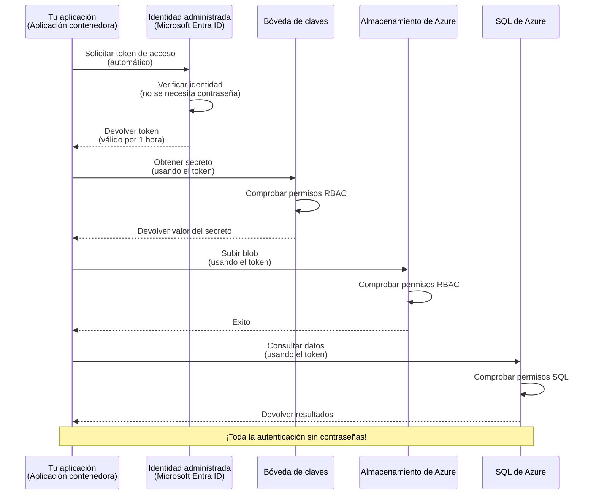
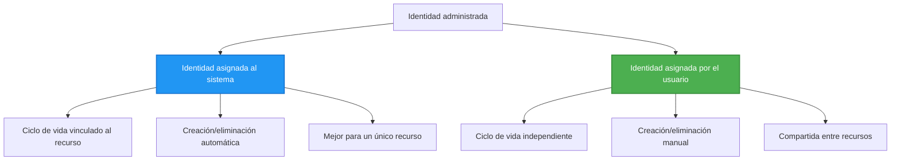

# Authentication Patterns and Managed Identity

⏱️ **Estimated Time**: 45-60 minutes | 💰 **Cost Impact**: Free (no additional charges) | ⭐ **Complexity**: Intermediate

**📚 Learning Path:**
- ← Previous: [Configuration Management](configuration.md) - Managing environment variables and secrets
- 🎯 **You Are Here**: Authentication & Security (Managed Identity, Key Vault, secure patterns)
- → Next: [First Project](first-project.md) - Build your first AZD application
- 🏠 [Course Home](../../README.md)

---

## What You'll Learn

By completing this lesson, you will:
- Understand Azure authentication patterns (keys, connection strings, managed identity)
- Implement **Managed Identity** for passwordless authentication
- Secure secrets with **Azure Key Vault** integration
- Configure **role-based access control (RBAC)** for AZD deployments
- Apply security best practices in Container Apps and Azure services
- Migrate from key-based to identity-based authentication

## Why Managed Identity Matters

### The Problem: Traditional Authentication

**Before Managed Identity:**
```javascript
// ❌ RIESGO DE SEGURIDAD: secretos codificados directamente en el código
const connectionString = "Server=mydb.database.windows.net;User=admin;Password=P@ssw0rd123";
const storageKey = "xK7mN9pQ2wR5tY8uI0oP3aS6dF1gH4jK...";
const cosmosKey = "C2x7B9n4M1p8Q5w3E6r0T2y5U8i1O4p7...";
```

**Problems:**
- 🔴 **Exposed secrets** in code, config files, environment variables
- 🔴 **Credential rotation** requires code changes and redeployment
- 🔴 **Audit nightmares** - who accessed what, when?
- 🔴 **Sprawl** - secrets scattered across multiple systems
- 🔴 **Compliance risks** - fails security audits

### The Solution: Managed Identity

**After Managed Identity:**
```javascript
// ✅ SEGURO: No hay secretos en el código
const credential = new DefaultAzureCredential();
const client = new BlobServiceClient(
  "https://mystorageaccount.blob.core.windows.net",
  credential  // Azure gestiona automáticamente la autenticación
);
```

**Benefits:**
- ✅ **Zero secrets** in code or configuration
- ✅ **Automatic rotation** - Azure handles it
- ✅ **Full audit trail** in Microsoft Entra ID logs
- ✅ **Centralized security** - manage in Azure Portal
- ✅ **Compliance ready** - meets security standards

**Analogy**: Traditional authentication is like carrying multiple physical keys for different doors. Managed Identity is like having a security badge that automatically grants access based on who you are—no keys to lose, copy, or rotate.

---

## Architecture Overview

### Authentication Flow with Managed Identity


```mermaid
sequenceDiagram
    participant App as Tu aplicación<br/>(Aplicación contenedora)
    participant MI as Identidad administrada<br/>(Microsoft Entra ID)
    participant KV as Bóveda de claves
    participant Storage as Almacenamiento de Azure
    participant DB as SQL de Azure
    
    App->>MI: Solicitar token de acceso<br/>(automático)
    MI->>MI: Verificar identidad<br/>(no se necesita contraseña)
    MI-->>App: Devolver token<br/>(válido por 1 hora)
    
    App->>KV: Obtener secreto<br/>(usando el token)
    KV->>KV: Comprobar permisos RBAC
    KV-->>App: Devolver valor del secreto
    
    App->>Storage: Subir blob<br/>(usando el token)
    Storage->>Storage: Comprobar permisos RBAC
    Storage-->>App: Éxito
    
    App->>DB: Consultar datos<br/>(usando el token)
    DB->>DB: Comprobar permisos SQL
    DB-->>App: Devolver resultados
    
    Note over App,DB: ¡Toda la autenticación sin contraseñas!
```

### Types of Managed Identities


```mermaid
graph TB
    MI[Identidad administrada]
    SystemAssigned[Identidad asignada al sistema]
    UserAssigned[Identidad asignada por el usuario]
    
    MI --> SystemAssigned
    MI --> UserAssigned
    
    SystemAssigned --> SA1[Ciclo de vida vinculado al recurso]
    SystemAssigned --> SA2[Creación/eliminación automática]
    SystemAssigned --> SA3[Mejor para un único recurso]
    
    UserAssigned --> UA1[Ciclo de vida independiente]
    UserAssigned --> UA2[Creación/eliminación manual]
    UserAssigned --> UA3[Compartida entre recursos]
    
    style SystemAssigned fill:#2196F3,stroke:#1976D2,stroke-width:2px,color:#fff
    style UserAssigned fill:#4CAF50,stroke:#388E3C,stroke-width:2px,color:#fff
```

| Feature | System-Assigned | User-Assigned |
|---------|----------------|---------------|
| **Lifecycle** | Tied to resource | Independent |
| **Creation** | Automatic with resource | Manual creation |
| **Deletion** | Deleted with resource | Persists after resource deletion |
| **Sharing** | One resource only | Multiple resources |
| **Use Case** | Simple scenarios | Complex multi-resource scenarios |
| **AZD Default** | ✅ Recommended | Optional |

---

## Prerequisites

### Required Tools

You should already have these installed from previous lessons:

```bash
# Verificar Azure Developer CLI
azd version
# ✅ Esperado: azd versión 1.0.0 o superior

# Verificar Azure CLI
az --version
# ✅ Esperado: azure-cli 2.50.0 o superior
```

### Azure Requirements

- Active Azure subscription
- Permissions to:
  - Create managed identities
  - Assign RBAC roles
  - Create Key Vault resources
  - Deploy Container Apps

### Knowledge Prerequisites

You should have completed:
- [Installation Guide](installation.md) - AZD setup
- [AZD Basics](azd-basics.md) - Core concepts
- [Configuration Management](configuration.md) - Environment variables

---

## Lesson 1: Understanding Authentication Patterns

### Pattern 1: Connection Strings (Legacy - Avoid)

**How it works:**
```bash
# La cadena de conexión contiene credenciales
STORAGE_CONNECTION_STRING="DefaultEndpointsProtocol=https;AccountName=myaccount;AccountKey=xK7mN9pQ2wR5..."
COSMOS_CONNECTION_STRING="AccountEndpoint=https://myaccount.documents.azure.com:443/;AccountKey=C2x7..."
SQL_CONNECTION_STRING="Server=myserver.database.windows.net;User=admin;Password=P@ssw0rd..."
```

**Problems:**
- ❌ Secrets visible in environment variables
- ❌ Logged in deployment systems
- ❌ Difficult to rotate
- ❌ No audit trail of access

**When to use:** Only for local development, never production.

---

### Pattern 2: Key Vault References (Better)

**How it works:**
```bicep
// Store secret in Key Vault
resource keyVault 'Microsoft.KeyVault/vaults@2023-02-01' = {
  name: 'mykv'
  properties: {
    enableRbacAuthorization: true
  }
}

// Reference in Container App
env: [
  {
    name: 'STORAGE_KEY'
    secretRef: 'storage-key'  // References Key Vault
  }
]
```

**Benefits:**
- ✅ Secrets stored securely in Key Vault
- ✅ Centralized secret management
- ✅ Rotation without code changes

**Limitations:**
- ⚠️ Still using keys/passwords
- ⚠️ Need to manage Key Vault access

**When to use:** Transition step from connection strings to managed identity.

---

### Pattern 3: Managed Identity (Best Practice)

**How it works:**
```bicep
// Enable managed identity
resource containerApp 'Microsoft.App/containerApps@2023-05-01' = {
  name: 'myapp'
  identity: {
    type: 'SystemAssigned'  // Automatically creates identity
  }
}

// Grant permissions
resource roleAssignment 'Microsoft.Authorization/roleAssignments@2022-04-01' = {
  scope: storageAccount
  properties: {
    roleDefinitionId: storageBlobDataContributorRole
    principalId: containerApp.identity.principalId
  }
}
```

**Application code:**
```javascript
// ¡No se necesitan secretos!
const { DefaultAzureCredential } = require('@azure/identity');
const { BlobServiceClient } = require('@azure/storage-blob');

const credential = new DefaultAzureCredential();
const blobServiceClient = new BlobServiceClient(
  'https://mystorageaccount.blob.core.windows.net',
  credential
);
```

**Benefits:**
- ✅ Zero secrets in code/config
- ✅ Automatic credential rotation
- ✅ Full audit trail
- ✅ RBAC-based permissions
- ✅ Compliance ready

**When to use:** Always, for production applications.

---

### Pattern 4: Service Principals (CI/CD & Automation)

Managed identity is the gold standard *for resources running inside Azure*. But what about things running **outside** Azure—like a CI/CD pipeline on a build agent, or a script on your laptop that can't use your interactive login? That's where a **service principal** comes in: a non-human identity with its own credentials that an automated process can sign in as.

**How it works:**

Create a service principal scoped to a resource group (least privilege):

```bash
az ad sp create-for-rbac \
  --name "myapp-cicd" \
  --role contributor \
  --scopes /subscriptions/<sub-id>/resourceGroups/<rg-name>
```

This prints a client ID, client secret, and tenant ID. azd can sign in with them non-interactively:

```bash
azd auth login \
  --client-id "<appId>" \
  --client-secret "<password>" \
  --tenant-id "<tenant>"
```

**Prefer federated credentials (OIDC) over secrets.** Instead of a long-lived client secret, configure a federated credential so the pipeline exchanges a short-lived token—no secret to leak or rotate:

```bash
azd auth login \
  --client-id "<appId>" \
  --federated-credential-provider "github" \
  --tenant-id "<tenant>"
```

> `azd pipeline config` sets this up for you automatically. See the CI/CD walkthroughs in [Chapter 8](../chapter-08-production/production-ai-practices.md).

**Benefits:**
- ✅ Works outside Azure (build agents, on-prem, other clouds)
- ✅ Can be scoped to a single resource group with one role
- ✅ Federated (OIDC) variant uses no stored secret

**Trade-offs:**
- ⚠️ Secret-based variant requires careful storage and rotation
- ⚠️ A leaked secret grants whatever the SP can do—keep scopes tight

**When to use:** CI/CD pipelines and automation that can't use managed identity. Always prefer the **federated/OIDC** variant over a client secret, and prefer managed identity whenever the workload runs inside Azure.

**Storing credentials safely:**
- Never commit secrets—use your pipeline's secret store (GitHub Actions secrets, Azure DevOps variable groups / Key Vault).
- Scope the SP to the smallest role and resource group it needs.
- Set an expiry and rotate, or eliminate the secret entirely with OIDC.

---

## Lesson 2: Implementing Managed Identity with AZD

### Step-by-Step Implementation

Let's build a secure Container App that uses managed identity to access Azure Storage and Key Vault.

### Project Structure

```
secure-app/
├── azure.yaml                 # AZD configuration
├── infra/
│   ├── main.bicep            # Main infrastructure
│   ├── core/
│   │   ├── identity.bicep    # Managed identity setup
│   │   ├── keyvault.bicep    # Key Vault configuration
│   │   └── storage.bicep     # Storage with RBAC
│   └── app/
│       └── container-app.bicep
└── src/
    ├── app.js                # Application code
    ├── package.json
    └── Dockerfile
```

### 1. Configure AZD (azure.yaml)

```yaml
name: secure-app
metadata:
  template: secure-app@1.0.0

services:
  api:
    project: ./src
    language: js
    host: containerapp

# Enable managed identity (AZD handles this automatically)
```

### 2. Infrastructure: Enable Managed Identity

**File: `infra/main.bicep`**

```bicep
targetScope = 'subscription'

param environmentName string
param location string = 'eastus'

var tags = { 'azd-env-name': environmentName }

// Resource group
resource rg 'Microsoft.Resources/resourceGroups@2021-04-01' = {
  name: 'rg-${environmentName}'
  location: location
  tags: tags
}

// Storage Account
module storage './core/storage.bicep' = {
  name: 'storage'
  scope: rg
  params: {
    name: 'st${uniqueString(rg.id)}'
    location: location
    tags: tags
  }
}

// Key Vault
module keyVault './core/keyvault.bicep' = {
  name: 'keyvault'
  scope: rg
  params: {
    name: 'kv-${uniqueString(rg.id)}'
    location: location
    tags: tags
  }
}

// Container App with Managed Identity
module containerApp './app/container-app.bicep' = {
  name: 'container-app'
  scope: rg
  params: {
    name: 'ca-${environmentName}'
    location: location
    tags: tags
    storageAccountName: storage.outputs.name
    keyVaultName: keyVault.outputs.name
  }
}

// Grant Container App access to Storage
module storageRoleAssignment './core/role-assignment.bicep' = {
  name: 'storage-role'
  scope: rg
  params: {
    principalId: containerApp.outputs.identityPrincipalId
    roleDefinitionId: 'ba92f5b4-2d11-453d-a403-e96b0029c9fe'  // Storage Blob Data Contributor
    targetResourceId: storage.outputs.id
  }
}

// Grant Container App access to Key Vault
module kvRoleAssignment './core/role-assignment.bicep' = {
  name: 'kv-role'
  scope: rg
  params: {
    principalId: containerApp.outputs.identityPrincipalId
    roleDefinitionId: '4633458b-17de-408a-b874-0445c86b69e6'  // Key Vault Secrets User
    targetResourceId: keyVault.outputs.id
  }
}

// Outputs
output AZURE_STORAGE_ACCOUNT_NAME string = storage.outputs.name
output AZURE_KEY_VAULT_NAME string = keyVault.outputs.name
output APP_URL string = containerApp.outputs.url
```

### 3. Container App with System-Assigned Identity

**File: `infra/app/container-app.bicep`**

```bicep
param name string
param location string
param tags object = {}
param storageAccountName string
param keyVaultName string

resource containerApp 'Microsoft.App/containerApps@2023-05-01' = {
  name: name
  location: location
  tags: tags
  identity: {
    type: 'SystemAssigned'  // 🔑 Enable managed identity
  }
  properties: {
    configuration: {
      ingress: {
        external: true
        targetPort: 3000
      }
    }
    template: {
      containers: [
        {
          name: 'api'
          image: 'myregistry.azurecr.io/api:latest'
          resources: {
            cpu: json('0.5')
            memory: '1Gi'
          }
          env: [
            {
              name: 'AZURE_STORAGE_ACCOUNT_NAME'
              value: storageAccountName
            }
            {
              name: 'AZURE_KEY_VAULT_NAME'
              value: keyVaultName
            }
            // 🔑 No secrets - managed identity handles authentication!
          ]
        }
      ]
    }
  }
}

// Output the identity for RBAC assignments
output identityPrincipalId string = containerApp.identity.principalId
output id string = containerApp.id
output url string = 'https://${containerApp.properties.configuration.ingress.fqdn}'
```

### 4. RBAC Role Assignment Module

**File: `infra/core/role-assignment.bicep`**

```bicep
param principalId string
param roleDefinitionId string  // Azure built-in role ID
param targetResourceId string

resource roleAssignment 'Microsoft.Authorization/roleAssignments@2022-04-01' = {
  name: guid(principalId, roleDefinitionId, targetResourceId)
  scope: resourceId('Microsoft.Resources/resourceGroups', resourceGroup().name)
  properties: {
    roleDefinitionId: subscriptionResourceId('Microsoft.Authorization/roleDefinitions', roleDefinitionId)
    principalId: principalId
    principalType: 'ServicePrincipal'
  }
}

output id string = roleAssignment.id
```

### 5. Application Code with Managed Identity

**File: `src/app.js`**

```javascript
const express = require('express');
const { DefaultAzureCredential } = require('@azure/identity');
const { BlobServiceClient } = require('@azure/storage-blob');
const { SecretClient } = require('@azure/keyvault-secrets');

const app = express();
const PORT = process.env.PORT || 3000;

// 🔑 Inicializar credencial (funciona automáticamente con identidad administrada)
const credential = new DefaultAzureCredential();

// Configuración del almacenamiento de Azure
const storageAccountName = process.env.AZURE_STORAGE_ACCOUNT_NAME;
const blobServiceClient = new BlobServiceClient(
  `https://${storageAccountName}.blob.core.windows.net`,
  credential  // ¡No se necesitan claves!
);

// Configuración de Key Vault
const keyVaultName = process.env.AZURE_KEY_VAULT_NAME;
const secretClient = new SecretClient(
  `https://${keyVaultName}.vault.azure.net`,
  credential  // ¡No se necesitan claves!
);

// Comprobación de estado
app.get('/health', (req, res) => {
  res.json({ status: 'healthy', authentication: 'managed-identity' });
});

// Subir archivo al almacenamiento de blobs
app.post('/upload', async (req, res) => {
  try {
    const containerClient = blobServiceClient.getContainerClient('uploads');
    await containerClient.createIfNotExists();
    
    const blobName = `file-${Date.now()}.txt`;
    const blockBlobClient = containerClient.getBlockBlobClient(blobName);
    
    await blockBlobClient.upload('Hello from managed identity!', 30);
    
    res.json({
      success: true,
      blobName: blobName,
      message: 'File uploaded using managed identity!'
    });
  } catch (error) {
    console.error('Upload error:', error);
    res.status(500).json({ error: error.message });
  }
});

// Obtener secreto de Key Vault
app.get('/secret/:name', async (req, res) => {
  try {
    const secretName = req.params.name;
    const secret = await secretClient.getSecret(secretName);
    
    res.json({
      name: secretName,
      value: secret.value,
      message: 'Secret retrieved using managed identity!'
    });
  } catch (error) {
    console.error('Secret error:', error);
    res.status(500).json({ error: error.message });
  }
});

// Listar contenedores de blobs (demuestra acceso de lectura)
app.get('/containers', async (req, res) => {
  try {
    const containers = [];
    for await (const container of blobServiceClient.listContainers()) {
      containers.push(container.name);
    }
    
    res.json({
      containers: containers,
      count: containers.length,
      message: 'Containers listed using managed identity!'
    });
  } catch (error) {
    console.error('List error:', error);
    res.status(500).json({ error: error.message });
  }
});

app.listen(PORT, () => {
  console.log(`Secure API listening on port ${PORT}`);
  console.log('Authentication: Managed Identity (passwordless)');
});
```

**File: `src/package.json`**

```json
{
  "name": "secure-app",
  "version": "1.0.0",
  "dependencies": {
    "express": "^4.18.2",
    "@azure/identity": "^4.0.0",
    "@azure/storage-blob": "^12.17.0",
    "@azure/keyvault-secrets": "^4.7.0"
  },
  "scripts": {
    "start": "node app.js"
  }
}
```

### 6. Deploy and Test

```bash
# Inicializar el entorno AZD
azd init

# Desplegar la infraestructura y la aplicación
azd up

# Obtener la URL de la aplicación
APP_URL=$(azd env get-values | grep APP_URL | cut -d '=' -f2 | tr -d '"')

# Probar la verificación de estado
curl $APP_URL/health
```

**✅ Expected output:**
```json
{
  "status": "healthy",
  "authentication": "managed-identity"
}
```

**Test blob upload:**
```bash
curl -X POST $APP_URL/upload
```

**✅ Expected output:**
```json
{
  "success": true,
  "blobName": "file-1700404800000.txt",
  "message": "File uploaded using managed identity!"
}
```

**Test container listing:**
```bash
curl $APP_URL/containers
```

**✅ Expected output:**
```json
{
  "containers": ["uploads"],
  "count": 1,
  "message": "Containers listed using managed identity!"
}
```

---

## Common Azure RBAC Roles

### Built-in Role IDs for Managed Identity

| Service | Role Name | Role ID | Permissions |
|---------|-----------|---------|-------------|
| **Storage** | Storage Blob Data Reader | `2a2b9908-6b94-4a3d-8e5a-a7d8f8cc8a12` | Leer blobs y contenedores |
| **Storage** | Storage Blob Data Contributor | `ba92f5b4-2d11-453d-a403-e96b0029c9fe` | Leer, escribir, eliminar blobs |
| **Storage** | Storage Queue Data Contributor | `974c5e8b-45b9-4653-ba55-5f855dd0fb88` | Leer, escribir, eliminar mensajes de cola |
| **Key Vault** | Key Vault Secrets User | `4633458b-17de-408a-b874-0445c86b69e6` | Leer secretos |
| **Key Vault** | Key Vault Secrets Officer | `b86a8fe4-44ce-4948-aee5-eccb2c155cd7` | Leer, escribir, eliminar secretos |
| **Cosmos DB** | Cosmos DB Built-in Data Reader | `00000000-0000-0000-0000-000000000001` | Leer datos de Cosmos DB |
| **Cosmos DB** | Cosmos DB Built-in Data Contributor | `00000000-0000-0000-0000-000000000002` | Leer, escribir datos de Cosmos DB |
| **SQL Database** | SQL DB Contributor | `9b7fa17d-e63e-47b0-bb0a-15c516ac86ec` | Administrar bases de datos SQL |
| **Service Bus** | Azure Service Bus Data Owner | `090c5cfd-751d-490a-894a-3ce6f1109419` | Enviar, recibir, administrar mensajes |

### How to Find Role IDs

```bash
# Listar todos los roles integrados
az role definition list --query "[].{Name:roleName, ID:name}" --output table

# Buscar un rol específico
az role definition list --query "[?contains(roleName, 'Storage Blob')].{Name:roleName, ID:name}" --output table

# Obtener detalles del rol
az role definition list --name "Storage Blob Data Contributor"
```

---

## Practical Exercises

### Exercise 1: Enable Managed Identity for Existing App ⭐⭐ (Medium)

**Goal**: Add managed identity to an existing Container App deployment

**Scenario**: You have a Container App using connection strings. Convert it to managed identity.

**Starting Point**: Container App with this configuration:

```bicep
// ❌ Current: Using connection string
env: [
  {
    name: 'STORAGE_CONNECTION_STRING'
    secretRef: 'storage-connection'
  }
]
```

**Steps**:

1. **Enable managed identity in Bicep:**

```bicep
resource containerApp 'Microsoft.App/containerApps@2023-05-01' = {
  name: 'myapp'
  identity: {
    type: 'SystemAssigned'  // Add this
  }
  // ... rest of configuration
}
```

2. **Grant Storage access:**

```bicep
// Get storage account reference
resource storageAccount 'Microsoft.Storage/storageAccounts@2023-01-01' existing = {
  name: storageAccountName
}

// Assign role
resource roleAssignment 'Microsoft.Authorization/roleAssignments@2022-04-01' = {
  name: guid(containerApp.id, 'ba92f5b4-2d11-453d-a403-e96b0029c9fe', storageAccount.id)
  scope: storageAccount
  properties: {
    roleDefinitionId: subscriptionResourceId('Microsoft.Authorization/roleDefinitions', 'ba92f5b4-2d11-453d-a403-e96b0029c9fe')
    principalId: containerApp.identity.principalId
    principalType: 'ServicePrincipal'
  }
}
```

3. **Update application code:**

**Before (connection string):**
```javascript
const { BlobServiceClient } = require('@azure/storage-blob');

const blobServiceClient = BlobServiceClient.fromConnectionString(
  process.env.STORAGE_CONNECTION_STRING
);
```

**After (managed identity):**
```javascript
const { DefaultAzureCredential } = require('@azure/identity');
const { BlobServiceClient } = require('@azure/storage-blob');

const credential = new DefaultAzureCredential();
const blobServiceClient = new BlobServiceClient(
  `https://${process.env.STORAGE_ACCOUNT_NAME}.blob.core.windows.net`,
  credential
);
```

4. **Update environment variables:**

```bicep
env: [
  {
    name: 'STORAGE_ACCOUNT_NAME'
    value: storageAccountName  // Just the name, no secrets!
  }
  // Remove STORAGE_CONNECTION_STRING
]
```

5. **Deploy and test:**

```bash
# Volver a desplegar
azd up

# Probar que todavía funciona
curl https://myapp.azurecontainerapps.io/upload
```

**✅ Success Criteria:**
- ✅ Application deploys without errors
- ✅ Storage operations work (upload, list, download)
- ✅ No connection strings in environment variables
- ✅ Identity visible in Azure Portal under "Identity" blade

**Verification:**

```bash
# Comprobar que la identidad administrada esté habilitada
az containerapp show \
  --name myapp \
  --resource-group rg-myapp \
  --query "identity.type"
# ✅ Esperado: "SystemAssigned"

# Comprobar la asignación de roles
az role assignment list \
  --assignee $(az containerapp show --name myapp --resource-group rg-myapp --query "identity.principalId" -o tsv) \
  --scope /subscriptions/{sub-id}/resourceGroups/rg-myapp/providers/Microsoft.Storage/storageAccounts/mystorageaccount
# ✅ Esperado: Muestra el rol "Storage Blob Data Contributor"
```

**Time**: 20-30 minutes

---

### Exercise 2: Multi-Service Access with User-Assigned Identity ⭐⭐⭐ (Advanced)

**Goal**: Create a user-assigned identity shared across multiple Container Apps

**Scenario**: You have 3 microservices that all need access to the same Storage account and Key Vault.

**Steps**:

1. **Create user-assigned identity:**

**File: `infra/core/identity.bicep`**

```bicep
param name string
param location string
param tags object = {}

resource userAssignedIdentity 'Microsoft.ManagedIdentity/userAssignedIdentities@2023-01-31' = {
  name: name
  location: location
  tags: tags
}

output id string = userAssignedIdentity.id
output principalId string = userAssignedIdentity.properties.principalId
output clientId string = userAssignedIdentity.properties.clientId
```

2. **Assign roles to user-assigned identity:**

```bicep
// In main.bicep
module userIdentity './core/identity.bicep' = {
  name: 'user-identity'
  scope: rg
  params: {
    name: 'id-${environmentName}'
    location: location
    tags: tags
  }
}

// Grant Storage access
resource storageRoleAssignment 'Microsoft.Authorization/roleAssignments@2022-04-01' = {
  name: guid(userIdentity.outputs.principalId, 'storage-contributor')
  scope: storageAccount
  properties: {
    roleDefinitionId: subscriptionResourceId('Microsoft.Authorization/roleDefinitions', 'ba92f5b4-2d11-453d-a403-e96b0029c9fe')
    principalId: userIdentity.outputs.principalId
    principalType: 'ServicePrincipal'
  }
}

// Grant Key Vault access
resource kvRoleAssignment 'Microsoft.Authorization/roleAssignments@2022-04-01' = {
  name: guid(userIdentity.outputs.principalId, 'kv-secrets-user')
  scope: keyVault
  properties: {
    roleDefinitionId: subscriptionResourceId('Microsoft.Authorization/roleDefinitions', '4633458b-17de-408a-b874-0445c86b69e6')
    principalId: userIdentity.outputs.principalId
    principalType: 'ServicePrincipal'
  }
}
```

3. **Assign identity to multiple Container Apps:**

```bicep
resource apiGateway 'Microsoft.App/containerApps@2023-05-01' = {
  name: 'api-gateway'
  identity: {
    type: 'UserAssigned'
    userAssignedIdentities: {
      '${userIdentity.outputs.id}': {}
    }
  }
  // ... rest of config
}

resource productService 'Microsoft.App/containerApps@2023-05-01' = {
  name: 'product-service'
  identity: {
    type: 'UserAssigned'
    userAssignedIdentities: {
      '${userIdentity.outputs.id}': {}
    }
  }
  // ... rest of config
}

resource orderService 'Microsoft.App/containerApps@2023-05-01' = {
  name: 'order-service'
  identity: {
    type: 'UserAssigned'
    userAssignedIdentities: {
      '${userIdentity.outputs.id}': {}
    }
  }
  // ... rest of config
}
```

4. **Application code (all services use same pattern):**

```javascript
const { DefaultAzureCredential, ManagedIdentityCredential } = require('@azure/identity');

// Para una identidad asignada por el usuario, especifique el ID de cliente
const credential = new ManagedIdentityCredential(
  process.env.AZURE_CLIENT_ID  // ID de cliente de la identidad asignada por el usuario
);

// O use DefaultAzureCredential (detecta automáticamente)
const credential = new DefaultAzureCredential();

const blobServiceClient = new BlobServiceClient(
  `https://${process.env.STORAGE_ACCOUNT_NAME}.blob.core.windows.net`,
  credential
);
```

5. **Deploy and verify:**

```bash
azd up

# Probar que todos los servicios puedan acceder al almacenamiento
curl https://api-gateway.azurecontainerapps.io/upload
curl https://product-service.azurecontainerapps.io/upload
curl https://order-service.azurecontainerapps.io/upload
```

**✅ Success Criteria:**
- ✅ One identity shared across 3 services
- ✅ All services can access Storage and Key Vault
- ✅ Identity persists if you delete one service
- ✅ Centralized permission management

**Benefits of User-Assigned Identity:**
- Single identity to manage
- Consistent permissions across services
- Survives service deletion
- Better for complex architectures

**Time**: 30-40 minutes

---

### Exercise 3: Implement Key Vault Secret Rotation ⭐⭐⭐ (Advanced)

**Goal**: Store third-party API keys in Key Vault and access them using managed identity

**Scenario**: Your app needs to call an external API (OpenAI, Stripe, SendGrid) that requires API keys.

**Steps**:

1. **Create Key Vault with RBAC:**

**File: `infra/core/keyvault.bicep`**

```bicep
param name string
param location string
param tags object = {}

resource keyVault 'Microsoft.KeyVault/vaults@2023-02-01' = {
  name: name
  location: location
  tags: tags
  properties: {
    enableRbacAuthorization: true  // Use RBAC instead of access policies
    sku: {
      family: 'A'
      name: 'standard'
    }
    tenantId: subscription().tenantId
    enableSoftDelete: true
    softDeleteRetentionInDays: 90
  }
}

// Allow Container App to read secrets
output id string = keyVault.id
output name string = keyVault.name
output uri string = keyVault.properties.vaultUri
```

2. **Store secrets in Key Vault:**

```bash
# Obtener el nombre del Key Vault
KV_NAME=$(azd env get-values | grep AZURE_KEY_VAULT_NAME | cut -d '=' -f2 | tr -d '"')

# Almacenar claves API de terceros
az keyvault secret set \
  --vault-name $KV_NAME \
  --name "OpenAI-ApiKey" \
  --value "sk-proj-xxxxxxxxxxxxx"

az keyvault secret set \
  --vault-name $KV_NAME \
  --name "Stripe-ApiKey" \
  --value "sk_live_xxxxxxxxxxxxx"

az keyvault secret set \
  --vault-name $KV_NAME \
  --name "SendGrid-ApiKey" \
  --value "SG.xxxxxxxxxxxxx"
```

3. **Application code to retrieve secrets:**

**File: `src/config.js`**

```javascript
const { DefaultAzureCredential } = require('@azure/identity');
const { SecretClient } = require('@azure/keyvault-secrets');

class Config {
  constructor() {
    this.credential = new DefaultAzureCredential();
    this.secretClient = new SecretClient(
      `https://${process.env.AZURE_KEY_VAULT_NAME}.vault.azure.net`,
      this.credential
    );
    this.cache = {};
  }

  async getSecret(secretName) {
    // Comprobar la caché primero
    if (this.cache[secretName]) {
      return this.cache[secretName];
    }

    try {
      const secret = await this.secretClient.getSecret(secretName);
      this.cache[secretName] = secret.value;
      console.log(`✅ Retrieved secret: ${secretName}`);
      return secret.value;
    } catch (error) {
      console.error(`❌ Failed to get secret ${secretName}:`, error.message);
      throw error;
    }
  }

  async getOpenAIKey() {
    return this.getSecret('OpenAI-ApiKey');
  }

  async getStripeKey() {
    return this.getSecret('Stripe-ApiKey');
  }

  async getSendGridKey() {
    return this.getSecret('SendGrid-ApiKey');
  }
}

module.exports = new Config();
```

4. **Use secrets in application:**

**File: `src/app.js`**

```javascript
const express = require('express');
const config = require('./config');
const { OpenAI } = require('openai');

const app = express();

// Inicializar OpenAI con la clave del Key Vault
let openaiClient;

async function initializeServices() {
  const openaiKey = await config.getOpenAIKey();
  openaiClient = new OpenAI({ apiKey: openaiKey });
  console.log('✅ Services initialized with secrets from Key Vault');
}

// Llamar al iniciar
initializeServices().catch(console.error);

app.post('/chat', async (req, res) => {
  try {
    const completion = await openaiClient.chat.completions.create({
      model: 'gpt-4.1',
      messages: [{ role: 'user', content: 'Hello!' }]
    });
    
    res.json({
      response: completion.choices[0].message.content,
      authentication: 'Key from Key Vault via Managed Identity'
    });
  } catch (error) {
    res.status(500).json({ error: error.message });
  }
});

app.listen(3000, () => {
  console.log('Secure API with Key Vault integration running');
});
```

5. **Deploy and test:**

```bash
azd up

# Probar que las claves de la API funcionen
curl -X POST https://myapp.azurecontainerapps.io/chat \
  -H "Content-Type: application/json" \
  -d '{"message":"Hello AI"}'
```

**✅ Success Criteria:**
- ✅ No API keys in code or environment variables
- ✅ Application retrieves keys from Key Vault
- ✅ Third-party APIs work correctly
- ✅ Can rotate keys without code changes

**Rotate a secret:**

```bash
# Actualizar el secreto en Key Vault
az keyvault secret set \
  --vault-name $KV_NAME \
  --name "OpenAI-ApiKey" \
  --value "sk-proj-NEW_KEY_HERE"

# Reiniciar la aplicación para que reconozca la nueva clave
az containerapp revision restart \
  --name myapp \
  --resource-group rg-myapp
```

**Time**: 25-35 minutes

---

## Knowledge Checkpoint

### 1. Authentication Patterns ✓

Test your understanding:

- [ ] **Q1**: What are the three main authentication patterns? 
  - **A**: Cadenas de conexión (legado), referencias de Key Vault (transición), Identidad administrada (mejor)

- [ ] **Q2**: Why is managed identity better than connection strings?
  - **A**: No hay secretos en el código, rotación automática, registro completo de auditoría, permisos RBAC

- [ ] **Q3**: When would you use user-assigned identity instead of system-assigned?
  - **A**: Cuando se comparte la identidad entre múltiples recursos o cuando el ciclo de vida de la identidad es independiente del ciclo de vida del recurso

**Hands-On Verification:**
```bash
# Comprueba qué tipo de identidad utiliza tu aplicación
az containerapp show \
  --name myapp \
  --resource-group rg-myapp \
  --query "identity.type"

# Enumera todas las asignaciones de roles para la identidad
az role assignment list \
  --assignee $(az containerapp show --name myapp --resource-group rg-myapp --query "identity.principalId" -o tsv)
```

---

### 2. RBAC and Permissions ✓

Test your understanding:

- [ ] **Q1**: What's the role ID for "Storage Blob Data Contributor"?
  - **A**: `ba92f5b4-2d11-453d-a403-e96b0029c9fe`

- [ ] **Q2**: What permissions does "Key Vault Secrets User" provide?
  - **A**: Acceso de solo lectura a secretos (no puede crear, actualizar o eliminar)

- [ ] **Q3**: How do you grant a Container App access to Azure SQL?
  - **A**: Asigna el rol "SQL DB Contributor" o configura la autenticación de Microsoft Entra ID para SQL

**Hands-On Verification:**
```bash
# Buscar rol específico
az role definition list --name "Storage Blob Data Contributor"

# Comprobar qué roles están asignados a su identidad
PRINCIPAL_ID=$(az containerapp show --name myapp --resource-group rg-myapp --query "identity.principalId" -o tsv)
az role assignment list --assignee $PRINCIPAL_ID --output table
```

---

### 3. Key Vault Integration ✓

Test your understanding:

- [ ] **Q1**: How do you enable RBAC for Key Vault instead of access policies?
  - **A**: Establece `enableRbacAuthorization: true` en Bicep

- [ ] **Q2**: What Azure SDK library handles managed identity authentication?
  - **A**: `@azure/identity` con la clase `DefaultAzureCredential`

- [ ] **Q3**: How long do Key Vault secrets stay in cache?
  - **A**: Depende de la aplicación; implementa tu propia estrategia de caché

**Hands-On Verification:**
```bash
# Probar el acceso a Key Vault
az keyvault secret show \
  --vault-name $KV_NAME \
  --name "OpenAI-ApiKey" \
  --query "value"

# Comprobar que RBAC esté habilitado
az keyvault show \
  --name $KV_NAME \
  --query "properties.enableRbacAuthorization"
# ✅ Esperado: true
```

---

## Security Best Practices

### ✅ DO:

1. **Always use managed identity in production**
   ```bicep
   identity: {
     type: 'SystemAssigned'
   }
   ```

2. **Use least-privilege RBAC roles**
   - Usa roles "Reader" cuando sea posible
   - Evita "Owner" o "Contributor" a menos que sea necesario

3. **Store third-party keys in Key Vault**
   ```javascript
   const apiKey = await secretClient.getSecret('ThirdPartyApiKey');
   ```

4. **Enable audit logging**
   ```bicep
   diagnosticSettings: {
     logs: [{ category: 'AuditEvent', enabled: true }]
   }
   ```

5. **Use different identities for dev/staging/prod**
   ```bash
   azd env new dev
   azd env new staging
   azd env new prod
   ```

6. **Rotate secrets regularly**
   - Establece fechas de expiración en los secretos de Key Vault
   - Automatiza la rotación con Azure Functions

### ❌ DON'T:

1. **Never hardcode secrets**
   ```javascript
   // ❌ MALO
   const apiKey = "sk-proj-xxxxxxxxxxxxx";
   ```

2. **Don't use connection strings in production**
   ```javascript
   // ❌ MALO
   BlobServiceClient.fromConnectionString(process.env.STORAGE_CONNECTION_STRING)
   ```

3. **Don't grant excessive permissions**
   ```bicep
   // ❌ BAD - too much access
   roleDefinitionId: 'Owner'
   
   // ✅ GOOD - least privilege
   roleDefinitionId: 'Storage Blob Data Reader'
   ```

4. **Don't log secrets**
   ```javascript
   // ❌ MALO
   console.log('API Key:', apiKey);
   
   // ✅ BUENO
   console.log('API Key retrieved successfully');
   ```

5. **Don't share production identities across environments**
   ```bicep
   // ❌ BAD - same identity for dev and prod
   // ✅ GOOD - separate identities per environment
   ```

---

## Troubleshooting Guide

### Problem: "Unauthorized" when accessing Azure Storage

**Symptoms:**
```
Error: Unauthorized (403)
AuthorizationPermissionMismatch: This request is not authorized to perform this operation
```

**Diagnosis:**

```bash
# Comprobar si la identidad administrada está habilitada
az containerapp show \
  --name myapp \
  --resource-group rg-myapp \
  --query "identity.type"
# ✅ Esperado: "SystemAssigned" o "UserAssigned"

# Comprobar asignaciones de roles
PRINCIPAL_ID=$(az containerapp show --name myapp --resource-group rg-myapp --query "identity.principalId" -o tsv)
az role assignment list --assignee $PRINCIPAL_ID

# Esperado: Debería ver "Storage Blob Data Contributor" u otro rol similar
```

**Solutions:**

1. **Grant correct RBAC role:**
```bash
STORAGE_ID=$(az storage account show --name mystorageaccount --resource-group rg-myapp --query "id" -o tsv)
az role assignment create \
  --assignee $PRINCIPAL_ID \
  --role "Storage Blob Data Contributor" \
  --scope $STORAGE_ID
```

2. **Wait for propagation (can take 5-10 minutes):**
```bash
# Comprobar el estado de la asignación de roles
az role assignment list --assignee $PRINCIPAL_ID --scope $STORAGE_ID
```

3. **Verify application code uses correct credential:**
```javascript
// Asegúrate de que estás usando DefaultAzureCredential
const credential = new DefaultAzureCredential();
```

---

### Problem: Key Vault access denied

**Symptoms:**
```
Error: Forbidden (403)
The user, group or application does not have secrets get permission
```

**Diagnosis:**

```bash
# Comprobar que el RBAC del Key Vault está habilitado
az keyvault show \
  --name $KV_NAME \
  --query "properties.enableRbacAuthorization"
# ✅ Esperado: true

# Comprobar asignaciones de roles
az role assignment list \
  --assignee $PRINCIPAL_ID \
  --scope /subscriptions/{sub-id}/resourceGroups/rg-myapp/providers/Microsoft.KeyVault/vaults/$KV_NAME
```

**Solutions:**

1. **Enable RBAC on Key Vault:**
```bash
az keyvault update \
  --name $KV_NAME \
  --enable-rbac-authorization true
```

2. **Grant Key Vault Secrets User role:**
```bash
KV_ID=$(az keyvault show --name $KV_NAME --query "id" -o tsv)
az role assignment create \
  --assignee $PRINCIPAL_ID \
  --role "Key Vault Secrets User" \
  --scope $KV_ID
```

---

### Problem: DefaultAzureCredential fails locally

**Symptoms:**
```
Error: DefaultAzureCredential failed to retrieve a token
CredentialUnavailableError: No credential available
```

**Diagnosis:**

```bash
# Comprueba si has iniciado sesión
az account show

# Comprueba la autenticación de Azure CLI
az ad signed-in-user show
```

**Solutions:**

1. **Login to Azure CLI:**
```bash
az login
```

2. **Set Azure subscription:**
```bash
az account set --subscription "Your Subscription Name"
```

3. **For local development, use environment variables:**
```bash
export AZURE_TENANT_ID="your-tenant-id"
export AZURE_CLIENT_ID="your-client-id"
export AZURE_CLIENT_SECRET="your-client-secret"
```

4. **Or use different credential locally:**
```javascript
const { DefaultAzureCredential, AzureCliCredential } = require('@azure/identity');

// Usa AzureCliCredential para desarrollo local
const credential = process.env.NODE_ENV === 'production' 
  ? new DefaultAzureCredential()
  : new AzureCliCredential();
```

---

### Problem: Role assignment takes too long to propagate

**Symptoms:**
- Role assigned successfully
- Still getting 403 errors
- Intermittent access (sometimes works, sometimes doesn't)

**Explanation:**
Azure RBAC changes can take 5-10 minutes to propagate globally.

**Solution:**

```bash
# Espere y reintente
echo "Waiting for RBAC propagation..."
sleep 300  # Espere 5 minutos

# Probar acceso
curl https://myapp.azurecontainerapps.io/upload

# Si sigue fallando, reinicie la aplicación
az containerapp revision restart \
  --name myapp \
  --resource-group rg-myapp
```

---

## Cost Considerations

### Managed Identity Costs

| Resource | Cost |
|----------|------|
| **Identidad administrada** | 🆓 **GRATIS** - Sin cargo |
| **Asignaciones de roles RBAC** | 🆓 **GRATIS** - Sin cargo |
| **Solicitudes de tokens de Microsoft Entra ID** | 🆓 **GRATIS** - Incluido |
| **Operaciones de Key Vault** | $0.03 por 10,000 operaciones |
| **Almacenamiento de Key Vault** | $0.024 por secreto por mes |

**La identidad administrada ahorra dinero al:**
- ✅ Eliminar operaciones de Key Vault para la autenticación entre servicios
- ✅ Reducir incidentes de seguridad (no hay credenciales filtradas)
- ✅ Disminuir la sobrecarga operativa (sin rotación manual)

**Ejemplo de comparación de costos (mensual):**

| Escenario | Cadenas de conexión | Identidad administrada | Ahorros |
|----------|-------------------|-----------------|---------|
| Pequeña app (1M requests) | ~$50 (Key Vault + ops) | ~$0 | $50/mes |
| App mediana (10M requests) | ~$200 | ~$0 | $200/mes |
| App grande (100M requests) | ~$1,500 | ~$0 | $1,500/mes |

---

## Learn More

### Official Documentation
- [Identidad administrada de Azure](https://learn.microsoft.com/entra/identity/managed-identities-azure-resources/overview)
- [RBAC de Azure](https://learn.microsoft.com/azure/role-based-access-control/overview)
- [Azure Key Vault](https://learn.microsoft.com/azure/key-vault/general/overview)
- [DefaultAzureCredential](https://learn.microsoft.com/dotnet/api/azure.identity.defaultazurecredential)

### SDK Documentation
- [@azure/identity (Node.js)](https://www.npmjs.com/package/@azure/identity)
- [Azure.Identity (C#)](https://www.nuget.org/packages/Azure.Identity/)
- [azure-identity (Python)](https://pypi.org/project/azure-identity/)

### Next Steps in This Course
- ← Anterior: [Gestión de configuración](configuration.md)
- → Siguiente: [Primer proyecto](first-project.md)
- 🏠 [Inicio del curso](../../README.md)

### Related Examples
- [Ejemplo de chat con Microsoft Foundry Models](../../../../examples/azure-openai-chat) - Usa identidad administrada para Microsoft Foundry Models
- [Ejemplo de microservicios](../../../../examples/microservices) - Patrones de autenticación multi-servicio

---

## Summary

**You've learned:**
- ✅ Tres patrones de autenticación (cadenas de conexión, Key Vault, identidad administrada)
- ✅ Cómo habilitar y configurar identidad administrada en AZD
- ✅ Asignaciones de roles RBAC para servicios de Azure
- ✅ Integración de Key Vault para secretos de terceros
- ✅ Identidades asignadas por el usuario vs asignadas al sistema
- ✅ Mejores prácticas de seguridad y resolución de problemas

**Key Takeaways:**
1. **Always use managed identity in production** - Cero secretos, rotación automática
2. **Use least-privilege RBAC roles** - Otorga solo los permisos necesarios
3. **Store third-party keys in Key Vault** - Gestión centralizada de secretos
4. **Separate identities per environment** - Aislamiento dev, staging, prod
5. **Enable audit logging** - Rastrea quién accedió a qué

**Next Steps:**
1. Completa los ejercicios prácticos anteriores
2. Migra una aplicación existente de cadenas de conexión a identidad administrada
3. Crea tu primer proyecto AZD con seguridad desde el primer día: [Primer proyecto](first-project.md)

---

<!-- CO-OP TRANSLATOR DISCLAIMER START -->
**Descargo de responsabilidad**:
Este documento ha sido traducido utilizando el servicio de traducción automática [Co-op Translator](https://github.com/Azure/co-op-translator). Aunque nos esforzamos por la precisión, tenga en cuenta que las traducciones automatizadas pueden contener errores o inexactitudes. El documento original en su idioma nativo debe considerarse la fuente autorizada. Para información crítica, se recomienda una traducción profesional humana. No somos responsables de cualquier malentendido o interpretación errónea que surja del uso de esta traducción.
<!-- CO-OP TRANSLATOR DISCLAIMER END -->