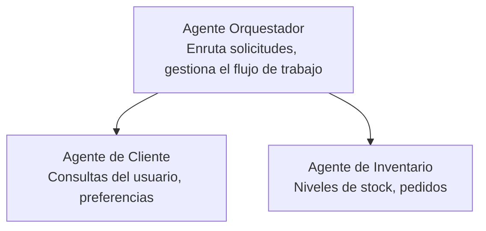

# Capítulo 5: Soluciones de IA Multiagente

**📚 Curso**: [AZD For Beginners](../../README.md) | **⏱️ Duración**: 2-3 horas | **⭐ Complejidad**: Avanzado

---

## Descripción general

Este capítulo cubre patrones avanzados de arquitectura multiagente, orquestación de agentes y despliegues de IA listos para producción para escenarios complejos.

> Validado con `azd 1.25.6` en junio de 2026.

## Objetivos de aprendizaje

Al completar este capítulo, podrás:
- Comprender los patrones de arquitectura multiagente
- Desplegar sistemas de agentes de IA coordinados
- Implementar la comunicación entre agentes
- Construir soluciones multiagente listas para producción

---

## 📚 Lecciones

| # | Lección | Descripción | Tiempo |
|---|--------|-------------|------|
| 1 | [Conceptos básicos de multiagentes](multi-agent-basics.md) | Práctica: desplegar una aplicación multiagente funcional con `azd up` | 45 min |
| 2 | [Patrones de coordinación](../chapter-06-pre-deployment/coordination-patterns.md) | Estrategias de orquestación de agentes (continúa en el Capítulo 6) | 30 min |
| 3 | [Despliegue con plantilla ARM](../../examples/retail-multiagent-arm-template/README.md) | Ejemplo de despliegue con un solo clic | 30 min |

> **Comienza con la Lección 1.** Es la única lección totalmente práctica y desplegable en este capítulo. La Lección 2 está en el Capítulo 6 (se comparte con la planificación previa al despliegue), y la [Solución multiagente para retail](../../examples/retail-scenario.md) es un plano de arquitectura—una referencia de diseño, no una plantilla de un solo comando.

---

## 🚀 Inicio rápido

```bash
# Opción 1: Implementar desde una plantilla
azd init --template agent-openai-python-prompty
azd up

# Opción 2: Implementar desde un manifiesto de agente (requiere la extensión azure.ai.agents)
azd extension install azure.ai.agents
azd ai agent init -m agent-manifest.yaml
azd up
```

> **¿Qué enfoque?** Usa `azd init --template` para comenzar desde una muestra funcional. Usa `azd ai agent init` cuando tengas tu propio manifiesto de agente. Consulta la [referencia de AZD AI CLI](../chapter-08-production/production-ai-practices.md#azd-ai-cli-commands-and-extensions) para más detalles.

---

## 🤖 Arquitectura multiagente



---

## 🎯 Solución destacada: Multiagente para Retail

La [Solución multiagente para retail](../../examples/retail-scenario.md) demuestra:

- **Agente de cliente**: Gestiona las interacciones con los usuarios y sus preferencias
- **Agente de inventario**: Gestiona el stock y el procesamiento de pedidos
- **Orquestador**: Coordina entre agentes
- **Memoria compartida**: Gestión del contexto entre agentes

### Servicios utilizados

| Servicio | Propósito |
|---------|---------|
| Microsoft Foundry Models | Comprensión del lenguaje |
| Azure AI Search | Catálogo de productos |
| Cosmos DB | Estado y memoria del agente |
| Container Apps | Alojamiento de agentes |
| Application Insights | Supervisión |

---

## 🔗 Navegación

| Dirección | Capítulo |
|-----------|---------|
| **Anterior** | [Chapter 4: Infrastructure](../chapter-04-infrastructure/README.md) |
| **Siguiente** | [Chapter 6: Pre-Deployment](../chapter-06-pre-deployment/README.md) |

---

## 📖 Recursos relacionados

- [Guía de agentes de IA](../chapter-02-ai-development/agents.md)
- [Prácticas de IA en producción](../chapter-08-production/production-ai-practices.md)
- [Solución de problemas de IA](../chapter-07-troubleshooting/ai-troubleshooting.md)

---

<!-- CO-OP TRANSLATOR DISCLAIMER START -->
**Descargo de responsabilidad**:
Este documento ha sido traducido utilizando el servicio de traducción automática [Co-op Translator](https://github.com/Azure/co-op-translator). Aunque nos esforzamos por la precisión, tenga en cuenta que las traducciones automatizadas pueden contener errores o inexactitudes. El documento original en su idioma nativo debe considerarse la fuente autorizada. Para información crítica, se recomienda una traducción profesional humana. No somos responsables de cualquier malentendido o interpretación errónea que surja del uso de esta traducción.
<!-- CO-OP TRANSLATOR DISCLAIMER END -->