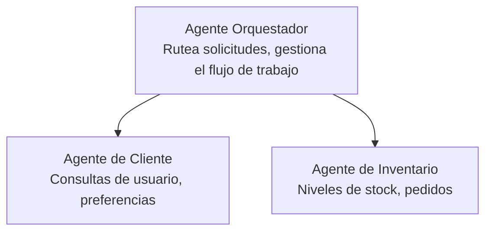

# Capítulo 5: Soluciones de IA Multi-Agente

**📚 Curso**: [AZD Para Principiantes](../../README.md) | **⏱️ Duración**: 2-3 horas | **⭐ Complejidad**: Avanzado

---

## Resumen

Este capítulo cubre patrones avanzados de arquitectura multi-agente, orquestación de agentes y despliegues de IA listos para producción en escenarios complejos.

> Validado con `azd 1.27.1` en julio de 2026.

## Objetivos de Aprendizaje

Al completar este capítulo, usted:
- Entenderá patrones de arquitectura multi-agente
- Desplegará sistemas coordinados de agentes de IA
- Implementará comunicación entre agentes
- Construirá soluciones multi-agente listas para producción

---

## 📚 Lecciones

| # | Lección | Descripción | Tiempo |
|---|--------|-------------|------|
| 1 | [Conceptos Básicos Multi-Agente](multi-agent-basics.md) | Práctica: despliegue de una aplicación multi-agente funcional con `azd up` | 45 min |
| 2 | [Patrones de Coordinación](../chapter-06-pre-deployment/coordination-patterns.md) | Estrategias de orquestación de agentes (continúa en el Capítulo 6) | 30 min |
| 3 | [Despliegue con ARM Template](../../examples/retail-multiagent-arm-template/README.md) | Ejemplo de despliegue con un clic | 30 min |

> **Comience con la Lección 1.** Es la única lección totalmente práctica y desplegable en este capítulo. La Lección 2 se encuentra en el Capítulo 6 (se comparte con la planificación pre-despliegue), y la [Solución Multi-Agente de Retail](../../examples/retail-scenario.md) es un plano de arquitectura—una referencia de diseño, no una plantilla de un solo comando.

---

## 🚀 Inicio Rápido

```bash
# Opción 1: Desplegar desde una plantilla
azd init --template agent-openai-python-prompty
azd up

# Opción 2: Desplegar desde un manifiesto de agente (requiere la extensión azure.ai.agents)
azd extension install azure.ai.agents
azd ai agent init -m agent-manifest.yaml
azd up
```

> **¿Qué enfoque usar?** Use `azd init --template` para comenzar desde un ejemplo funcional. Use `azd ai agent init` cuando tenga su propio manifiesto de agente. Consulte la [referencia CLI de AZD AI](../chapter-08-production/production-ai-practices.md#azd-ai-cli-commands-and-extensions) para más detalles.

---

## 🤖 Arquitectura Multi-Agente



---

## 🎯 Solución Destacada: Multi-Agente Retail

La [Solución Multi-Agente Retail](../../examples/retail-scenario.md) demuestra:

- **Agente de Cliente**: Maneja interacciones y preferencias del usuario
- **Agente de Inventario**: Administra el stock y el procesamiento de pedidos
- **Orquestador**: Coordina entre agentes
- **Memoria Compartida**: Gestión de contexto entre agentes

### Servicios Usados

| Servicio | Propósito |
|---------|---------|
| Modelos Microsoft Foundry | Comprensión del lenguaje |
| Azure AI Search | Catálogo de productos |
| Cosmos DB | Estado y memoria de agentes |
| Container Apps | Hospedaje de agentes |
| Application Insights | Monitoreo |

---

## 🔗 Navegación

| Dirección | Capítulo |
|-----------|---------|
| **Anterior** | [Capítulo 4: Infraestructura](../chapter-04-infrastructure/README.md) |
| **Siguiente** | [Capítulo 6: Pre-Despliegue](../chapter-06-pre-deployment/README.md) |

---

## 📖 Recursos Relacionados

- [Guía de Agentes de IA](../chapter-02-ai-development/agents.md)
- [Prácticas de IA en Producción](../chapter-08-production/production-ai-practices.md)
- [Solución de Problemas de IA](../chapter-07-troubleshooting/ai-troubleshooting.md)

---

<!-- CO-OP TRANSLATOR DISCLAIMER START -->
**Descargo de responsabilidad**:
Este documento ha sido traducido utilizando el servicio de traducción automática [Co-op Translator](https://github.com/Azure/co-op-translator). Aunque nos esforzamos por la precisión, tenga en cuenta que las traducciones automatizadas pueden contener errores o inexactitudes. El documento original en su idioma nativo debe considerarse la fuente autorizada. Para información crítica, se recomienda una traducción profesional humana. No somos responsables de cualquier malentendido o interpretación errónea que surja del uso de esta traducción.
<!-- CO-OP TRANSLATOR DISCLAIMER END -->