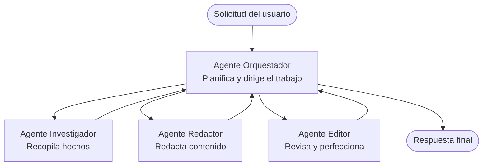

# Fundamentos de Sistemas Multi-Agente - Despliega Tu Primer Sistema de IA Coordinado

**Navegación del Capítulo:**
- **📚 Inicio del Curso**: [AZD Para Principiantes](../../README.md)
- **📖 Capítulo Actual**: Capítulo 5 - Soluciones de IA Multi-Agente
- **⬅️ Anterior**: [Capítulo 4: Infraestructura](../chapter-04-infrastructure/README.md)
- **➡️ Siguiente**: [Patrones de Coordinación](../chapter-06-pre-deployment/coordination-patterns.md)

> Validado con `azd 1.25.6` en junio de 2026.

## Introducción

En los capítulos anteriores desplegaste una sola aplicación—y en el Capítulo 2 desplegaste un solo agente de IA. Esta lección da el siguiente paso: desplegar un **sistema multi-agente**, donde varios agentes especializados trabajan juntos para resolver un problema que ningún agente individual podría manejar bien por sí solo.

La buena noticia para principiantes: **no necesitas nuevos comandos.** Una solución multi-agente sigue siendo un proyecto azd. Harás `azd init`, `azd up`, pruebas y `azd down`—exactamente el flujo de trabajo que ya conoces. Lo que cambia es la *forma* de la aplicación por dentro.

## Objetivos de Aprendizaje

Al final de esta lección, podrás:
- Entender qué significa "multi-agente" y cuándo vale la pena la complejidad adicional
- Reconocer los roles comunes en un sistema multi-agente (orquestador + especialistas)
- Desplegar una plantilla multi-agente real y funcional con `azd up`
- Comprender los recursos de Azure que respaldan una app multi-agente
- Saber cómo verificar, personalizar y desmantelar la solución de forma segura

## Resultados del Aprendizaje

Después de completar esta lección, serás capaz de:
- Explicar la diferencia entre un agente único y un sistema multi-agente
- Elegir entre un único agente con herramientas y un diseño multi-agente verdadero
- Desplegar y probar una plantilla multi-agente de extremo a extremo con azd
- Identificar dónde se ejecuta cada agente y cómo se comunican
- Eliminar todos los recursos para evitar cargos continuos

---

## ¿Qué es un sistema multi-agente?

Un agente de IA único es un modelo con un conjunto de instrucciones y (opcionalmente) algunas herramientas. Eso funciona bien para tareas enfocadas. Pero a medida que una tarea crece—investigar, luego escribir, luego editar, luego verificar hechos—meter todo en un solo prompt hace que el agente sea más lento, menos fiable y más difícil de depurar.

Un **sistema multi-agente** divide el trabajo en especialistas que cada uno hace bien una tarea, coordinados por un orquestador:



### Los dos roles que siempre verás

| Rol | Tarea | Ejemplo |
|------|-----|---------|
| **Orquestador** | Decide *qué sucede después* y enruta el trabajo entre agentes | "Primero investiga, luego escribe, luego edita" |
| **Especialista** | Hace un trabajo enfocado y devuelve un resultado | Un "investigador" que solo recopila hechos |

### ¿Realmente necesitas múltiples agentes?

Empieza simple. Recurre a multi-agente **solo** cuando una de estas sea cierta:

- ✅ La tarea tiene **etapas distintas** que se benefician de instrucciones diferentes (investigar vs. escribir vs. revisar)
- ✅ Quieres que los especialistas se ejecuten **en paralelo** para ahorrar tiempo
- ✅ Diferentes pasos necesitan **herramientas o fuentes de datos distintas**
- ✅ Necesitas que cada paso sea **probable de testear y depurar de forma independiente**

Si tu tarea es una sola pregunta y respuesta o una llamada simple a una herramienta, un **único agente con herramientas** (Capítulo 2) es más simple, más barato y más fácil de operar.

> **Consejo para principiantes:** "Más agentes" no es "mejor." Cada agente añade latencia, costo y un nuevo elemento a monitorear. Añade agentes solo cuando el problema claramente se divida en partes.

---

## Dos formas de construir soluciones multi-agente en Azure

| Enfoque | Qué es | Ideal para |
|----------|-----------|----------|
| **Un único agente + herramientas** | Un agente Foundry que llama funciones/herramientas | Flujos simples, comenzar rápidamente |
| **Múltiples agentes coordinados** | Varios agentes con un orquestador | Etapas distintas, trabajo en paralelo, especialización |

Esta lección se centra en el segundo enfoque usando una **plantilla lista para usar**, para que puedas ver un sistema multi-agente real funcionando antes de construir el tuyo.

---

## Práctica: Despliega una aplicación multi-agente funcional

Desplegaremos **Contoso Creative Writer**, una muestra oficial de Azure que utiliza múltiples agentes (investigador, escritor, editor) coordinados para producir un artículo. Es una excelente primera app multi-agente porque los roles son fáciles de entender.

### Paso 1: Inicializar la plantilla

```bash
# Crear una carpeta de trabajo
mkdir creative-writer && cd creative-writer

# Inicializar desde la plantilla oficial para múltiples agentes
azd init --template contoso-creative-writer
```

> Examina más plantillas multi-agente en cualquier momento en la [Galería Awesome AZD AI](https://azure.github.io/awesome-azd/?tags=ai). Otras opciones aptas para principiantes incluyen `get-started-with-ai-agents` y `azure-ai-travel-agents`.

### Paso 2: Autenticación

```bash
# Requerido para los flujos de trabajo de azd
azd auth login
```

### Paso 3: Crear un entorno

```bash
azd env new dev
```

### Paso 4: Previsualizar, luego desplegar

```bash
# Ver qué se creará antes de gastar nada (recomendado)
azd provision --preview

# Provisionar la infraestructura y desplegar todos los agentes en un solo paso
azd up
```

`azd up` solicitará una suscripción y una región, luego aprovisionará los recursos de Azure y desplegará la aplicación. Los despliegues de IA pueden tardar más que una aplicación web simple—si estás desplegando modelos más grandes, puedes ampliar el tiempo de espera de despliegue:

```bash
azd deploy --timeout 1800
```

> **Atención sobre costos y capacidad:** Las aplicaciones multi-agente despliegan modelos de IA que consumen cuota y generan costos. Si `azd up` falla por cuota de modelos, consulta [Solución de problemas de IA](../chapter-07-troubleshooting/ai-troubleshooting.md) para arreglos de región y cuota, y el Capítulo 6 [Planificación de Capacidad](../chapter-06-pre-deployment/capacity-planning.md).

---

## Entendiendo lo que desplegaste

Una app multi-agente típica como esta aprovisiona un conjunto de recursos de Azure que se mapean directamente a las responsabilidades del diagrama anterior:

| Recurso | Por qué está ahí |
|----------|----------------|
| **Microsoft Foundry / Models** | Aloja los modelos de lenguaje que usa cada agente |
| **Azure AI Search** | Proporciona al agente investigador datos fundamentados para buscar |
| **Container Apps** (or App Service) | Aloja el orquestador y el código de los agentes |
| **Cosmos DB** (en algunas muestras) | Almacena estado/memoria compartida que se pasa entre agentes |
| **Application Insights** | Traza solicitudes *a través* de agentes para que puedas depurar el flujo |

### Cómo se comunican los agentes entre sí

En la mayoría de las muestras multi-agente de azd, el orquestador se ejecuta en el código de tu aplicación (por ejemplo, usando un framework como Semantic Kernel o el Microsoft Agent Framework). El orquestador llama a cada agente especialista a su turno, pasa los resultados y ensambla la respuesta final. Los agentes comparten contexto mediante:

- **Llamadas a funciones/herramientas** — el orquestador invoca a un especialista y obtiene un resultado de vuelta
- **Memoria compartida** — una base de datos (a menudo Cosmos DB) guarda estado que ambos agentes pueden leer
- **Mensajes/eventos** — para un acoplamiento más laxo, los agentes se comunican vía una cola o Service Bus

> **Por qué esto importa para la depuración:** al estar cada paso separado, Application Insights te muestra *qué* agente fue lento o falló. Esa es una razón importante para dividir el trabajo entre agentes.

---

## Verificar el despliegue

Confirma que el sistema realmente funciona antes de continuar:

```bash
# Mostrar los endpoints desplegados
azd show

# Abrir el panel de supervisión de la aplicación
azd monitor

# Seguir los registros si algo parece estar mal
azd monitor --logs
```

Luego abre la URL de la app desde `azd show` y prueba una petición que ejercite a todos los agentes (para Creative Writer, pídele que escriba un artículo corto sobre un tema). En la **búsqueda de transacciones** de Application Insights, deberías ver la solicitud desglosarse a través de los pasos de investigador, escritor y editor.

**Criterios de éxito:**
- ✅ `azd show` lista un endpoint accesible
- ✅ Una petición produce un resultado que claramente pasó por múltiples etapas
- ✅ Application Insights muestra trazas para más de un paso de agente

---

## Personalizar: Agregar o ajustar un agente

Porque cada agente es solo instrucciones más herramientas, personalizar es accesible:

1. **Encuentra las definiciones de los agentes** en la plantilla (a menudo un conjunto de archivos `prompts/`, `agents/`, o `*.prompty`).
2. **Ajusta las instrucciones de un agente** — por ejemplo, indica al agente editor que aplique un tono específico o un recuento de palabras.
3. **Vuelve a desplegar solo el código** (la infraestructura no cambia):

   ```bash
   azd deploy
   ```

Para avanzar y construir agentes desde tu *propio* manifiesto, usa la extensión de agentes y su ciclo de vida completo:

```bash
azd extension install azure.ai.agents
azd ai agent init -m agent-manifest.yaml
azd up
azd ai agent invoke      # prueba, con medición del tiempo de respuesta
```

Consulta [Capítulo 2: Agentes](../chapter-02-ai-development/agents.md) y la [referencia AZD AI CLI](../chapter-08-production/production-ai-practices.md#azd-ai-cli-commands-and-extensions) para el ciclo de vida completo de los agentes (`invoke`, `eval generate`, `optimize`, `delete`).

---

## Limpiar

Las aplicaciones multi-agente ejecutan múltiples servicios facturables. Desmantela todo cuando termines:

```bash
azd down --force --purge
```

El flag `--purge` también elimina recursos de IA eliminados de forma suave (como cuentas de Foundry/Azure AI Services) para que no bloqueen un despliegue futuro o sigan generando costos.

---

## Una nota sobre sistemas multi-agente en producción

La [Solución Multi-Agente para Retail](../../examples/retail-scenario.md) en este repositorio es un **plano de arquitectura**, no una plantilla de un solo comando—documenta cómo se *construiría* un sistema retail de producción (y es explícito en que una implementación completa es un esfuerzo sustancial). Úsalo como referencia de diseño *después* de haber desplegado una muestra funcional aquí. Para preocupaciones de producción (resiliencia, costo, monitoreo, gobernanza), continúa con [Capítulo 8: Prácticas de IA en Producción](../chapter-08-production/production-ai-practices.md).

---

## Resumen

- Un sistema multi-agente divide el trabajo entre especialistas coordinados por un orquestador.
- Úsalo solo cuando la tarea tenga etapas distintas, paralelismo o diferentes herramientas por paso—de lo contrario, prefiere un agente único.
- El flujo de trabajo azd no cambia: `azd init` → `azd up` → test → `azd down`.
- Una plantilla real como `contoso-creative-writer` te permite ver y personalizar una app multi-agente funcional hoy.
- El trazado entre agentes en Application Insights es uno de los mayores beneficios prácticos del diseño multi-agente.

---

## 🔗 Navegación

| Dirección | Lección |
|-----------|--------|
| **Anterior** | [Capítulo 4: Infraestructura](../chapter-04-infrastructure/README.md) |
| **Siguiente** | [Patrones de Coordinación](../chapter-06-pre-deployment/coordination-patterns.md) |

## 📖 Recursos Relacionados

- [Guía de Agentes de IA](../chapter-02-ai-development/agents.md)
- [Patrones de Coordinación](../chapter-06-pre-deployment/coordination-patterns.md)
- [Prácticas de IA en Producción](../chapter-08-production/production-ai-practices.md)
- [Solución de problemas de IA](../chapter-07-troubleshooting/ai-troubleshooting.md)

---

<!-- CO-OP TRANSLATOR DISCLAIMER START -->
**Descargo de responsabilidad**:
Este documento ha sido traducido utilizando el servicio de traducción automática [Co-op Translator](https://github.com/Azure/co-op-translator). Aunque nos esforzamos por la precisión, tenga en cuenta que las traducciones automatizadas pueden contener errores o inexactitudes. El documento original en su idioma nativo debe considerarse la fuente autorizada. Para información crítica, se recomienda una traducción profesional humana. No somos responsables de cualquier malentendido o interpretación errónea que surja del uso de esta traducción.
<!-- CO-OP TRANSLATOR DISCLAIMER END -->