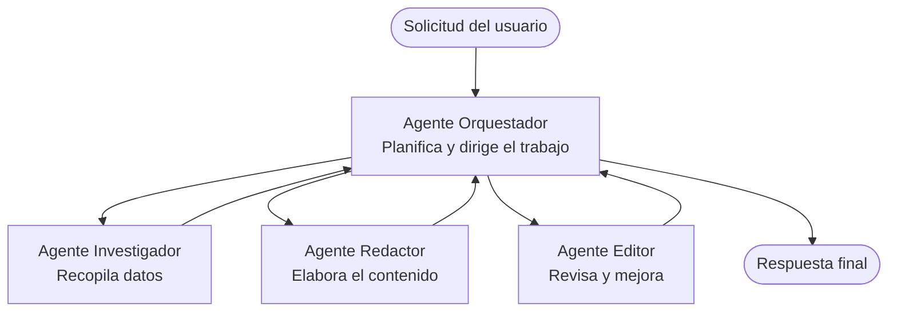

# Conceptos básicos de sistemas multiagente - Despliega tu primer sistema de IA coordinado

**Navegación del capítulo:**
- **📚 Inicio del curso**: [AZD para principiantes](../../README.md)
- **📖 Capítulo actual**: Capítulo 5 - Soluciones de IA multiagente
- **⬅️ Anterior**: [Capítulo 4: Infraestructura](../chapter-04-infrastructure/README.md)
- **➡️ Siguiente**: [Patrones de coordinación](../chapter-06-pre-deployment/coordination-patterns.md)

> Validado con `azd 1.27.1` en julio de 2026.

## Introducción

En los capítulos anteriores desplegaste una única aplicación—y en el Capítulo 2 desplegaste un agente de IA único. Esta lección da el siguiente paso: desplegar un **sistema multiagente**, donde varios agentes especializados trabajan juntos para resolver un problema que ningún agente solo podría manejar bien.

La buena noticia para principiantes: **no necesitas comandos nuevos.** Una solución multiagente sigue siendo un proyecto azd. Harás `azd init`, `azd up`, pruebas y `azd down`—exactamente el flujo de trabajo que ya conoces. Lo que cambia es la *estructura* de la aplicación por dentro.

## Objetivos de aprendizaje

Al final de esta lección, podrás:
- Entender qué significa "multiagente" y cuándo vale la pena la complejidad extra
- Reconocer los roles comunes en un sistema multiagente (orquestador + especialistas)
- Desplegar una plantilla multiagente real y funcional con `azd up`
- Comprender los recursos de Azure que respaldan una aplicación multiagente
- Saber cómo verificar, personalizar y desmontar la solución de forma segura

## Resultados de aprendizaje

Después de completar esta lección, podrás:
- Explicar la diferencia entre un agente único y un sistema multiagente
- Elegir entre un solo agente con herramientas y un diseño multiagente verdadero
- Desplegar y probar una plantilla multiagente de principio a fin con azd
- Identificar dónde se ejecuta cada agente y cómo se comunican
- Limpiar todos los recursos para evitar cargos continuos

---

## ¿Qué es un sistema multiagente?

Un agente de IA único es un modelo con un conjunto de instrucciones y (opcionalmente) algunas herramientas. Eso funciona bien para tareas enfocadas. Pero a medida que una tarea crece—investigación, luego escritura, luego edición, luego verificación de hechos—incluir todo en un único prompt hace el agente más lento, menos fiable y más difícil de depurar.

Un **sistema multiagente** divide el trabajo en especialistas que cada uno hace bien un trabajo, coordinados por un orquestador:



### Los dos roles que siempre verás

| Rol | Trabajo | Ejemplo |
|------|-----|---------|
| **Orquestador** | Decide *qué ocurre después* y enruta el trabajo entre agentes | "Primero investigación, luego escribir, luego editar" |
| **Especialista** | Hace un trabajo específico y devuelve un resultado | Un "investigador" que solo recoge hechos |

### ¿Realmente necesitas varios agentes?

Empieza simple. Usa multiagente **solo** cuando alguna de estas sea verdadera:

- ✅ La tarea tiene **etapas distintas** que se benefician de instrucciones diferentes (investigar vs. escribir vs. revisar)
- ✅ Quieres que especialistas trabajen **en paralelo** para ahorrar tiempo
- ✅ Diferentes pasos necesitan **herramientas o fuentes de datos diferentes**
- ✅ Necesitas que cada paso sea **probablemente testable y depurable de forma independiente**

Si tu tarea es una pregunta-respuesta simple o una llamada a herramienta sencilla, un **agente único con herramientas** (Capítulo 2) es más simple, barato y fácil de operar.

> **Consejo para principiantes:** "Más agentes" no es "mejor." Cada agente añade latencia, costo y algo nuevo que monitorear. Añade agentes solo cuando el problema claramente se divide en partes.

---

## Dos formas de construir sistemas multiagente en Azure

| Enfoque | Qué es | Mejor para |
|----------|-----------|----------|
| **Agente único + herramientas** | Un agente Foundry que llama a funciones/herramientas | Flujos simples, empezar rápido |
| **Varios agentes coordinados** | Varios agentes con un orquestador | Etapas distintas, trabajo paralelo, especialización |

Esta lección se enfoca en el segundo enfoque usando una **plantilla lista para usar**, así puedes ver un sistema multiagente real funcionando antes de construir el tuyo.

---

## Práctica: Desplegar una aplicación multiagente funcional

Vamos a desplegar **Contoso Creative Writer**, un ejemplo oficial de Azure que usa múltiples agentes (investigador, escritor, editor) coordinados para producir un artículo. Es una gran primera app multiagente porque los roles son fáciles de entender.

### Paso 1: Inicializa la plantilla

```bash
# Crear una carpeta de trabajo
mkdir creative-writer && cd creative-writer

# Inicializar desde la plantilla oficial multiagente
azd init --template contoso-creative-writer
```

> Explora más plantillas multiagente en cualquier momento en la [galería Awesome AZD AI](https://azure.github.io/awesome-azd/?tags=ai). Otras opciones amigables para principiantes incluyen `get-started-with-ai-agents` y `azure-ai-travel-agents`.

### Paso 2: Autenticarse

```bash
# Requerido para los flujos de trabajo azd
azd auth login
```

### Paso 3: Crear un entorno

```bash
azd env new dev
```

### Paso 4: Previsualizar y luego desplegar

```bash
# Vea qué se creará antes de gastar nada (recomendado)
azd provision --preview

# Proveer infraestructura e implementar todos los agentes en un solo paso
azd up
```

`azd up` solicitará una suscripción y región, luego aprovisionará los recursos de Azure y desplegará la aplicación. Los despliegues de IA pueden tardar más que una app web simple—si despliegas modelos más grandes, puedes extender el tiempo límite de despliegue:

```bash
azd deploy --timeout 1800
```

> **Aviso sobre costo y capacidad:** Las apps multiagente despliegan modelos de IA que consumen cuota y generan costo. Si `azd up` falla por cuota de modelo, consulta [Resolución de problemas de IA](../chapter-07-troubleshooting/ai-troubleshooting.md) para corregir región y cuota, y el Capítulo 6 [Planificación de capacidad](../chapter-06-pre-deployment/capacity-planning.md).

---

## Entendiendo lo que desplegaste

Una app multiagente típica como esta provisona un conjunto de recursos de Azure que se corresponden directamente con las responsabilidades del diagrama anterior:

| Recurso | Por qué está ahí |
|----------|----------------|
| **Microsoft Foundry / Modelos** | Aloja los modelos de lenguaje que usa cada agente |
| **Azure AI Search** | Le da al agente investigador datos fundamentados para buscar |
| **Container Apps** (o App Service) | Aloja el orquestador y el código de los agentes |
| **Cosmos DB** (en algunos ejemplos) | Almacena estado/memoria compartida que pasa entre agentes |
| **Application Insights** | Rastrea solicitudes *entre* agentes para que puedas depurar el flujo |

### Cómo hablan los agentes entre sí

En la mayoría de ejemplos multiagente con azd, el **orquestador se ejecuta en tu código de aplicación** (por ejemplo, usando un framework como Semantic Kernel o Microsoft Agent Framework). El orquestador llama a cada agente especialista por turno, pasa los resultados y arma la respuesta final. Los agentes comparten contexto mediante:

- **Llamadas a funciones/herramientas** — el orquestador invoca al especialista y recibe un resultado
- **Memoria compartida** — una base de datos (a menudo Cosmos DB) guarda estado que ambos agentes pueden leer
- **Mensajes/eventos** — para un acoplamiento más flexible, los agentes se comunican vía una cola o Service Bus

> **Por qué esto importa para la depuración:** porque cada paso es separado, Application Insights te muestra *qué* agente fue el lento o falló. Esa es una razón clave para dividir el trabajo entre agentes.

---

## Verifica el despliegue

Confirma que el sistema realmente funciona antes de continuar:

```bash
# Mostrar los endpoints desplegados
azd show

# Abrir el panel de monitoreo de la aplicación
azd monitor

# Seguir los registros si algo parece estar mal
azd monitor --logs
```

Luego abre la URL de la app desde `azd show` y prueba una solicitud que ejercite todos los agentes (para Creative Writer, pídele escribir un artículo corto sobre un tema). En la **búsqueda de transacciones** de Application Insights, deberías ver la solicitud distribuida a las etapas investigador, escritor y editor.

**Criterios de éxito:**
- ✅ `azd show` lista un endpoint accesible
- ✅ Una solicitud produce un resultado que claramente pasó por múltiples etapas
- ✅ Application Insights muestra trazas de más de un paso de agente

---

## Personalizar: agregar o ajustar un agente

Dado que cada agente es solo instrucciones más herramientas, personalizar es accesible:

1. **Encuentra las definiciones de agente** en la plantilla (a menudo un conjunto de archivos `prompts/`, `agents/` o `*.prompty`).
2. **Ajusta las instrucciones del agente** — por ejemplo, dile al agente editor que aplique un tono específico o un conteo de palabras.
3. **Re-despliega solo el código** (la infraestructura no cambia):

   ```bash
   azd deploy
   ```

Para ir más allá y construir agentes desde *tu propio* manifiesto, usa la extensión de agentes y su ciclo de vida completo:

```bash
azd extension install azure.ai.agents
azd ai agent init -m agent-manifest.yaml
azd up
azd ai agent invoke      # prueba, con temporización de respuesta
```

Consulta [Capítulo 2: Agentes](../chapter-02-ai-development/agents.md) y la [referencia de CLI AZD AI](../chapter-08-production/production-ai-practices.md#azd-ai-cli-commands-and-extensions) para el ciclo completo de vida del agente (`invoke`, `eval generate`, `optimize`, `delete`).

---

## Limpieza

Las apps multiagente ejecutan múltiples servicios facturables. Desmonta todo cuando termines:

```bash
azd down --force --purge
```

La bandera `--purge` también elimina recursos de IA eliminados suavemente (como Foundry/cuentas de Azure AI Services) para que no bloqueen un re-despliegue futuro ni sigan generando costo.

---

## Una nota sobre sistemas multiagente en producción

La [Solución Multi-Agente para Retail](../../examples/retail-scenario.md) en este repositorio es un **plan arquitectónico**, no una plantilla de un solo comando—documenta cómo *se construiría* un sistema retail en producción (y es explícito que una construcción completa es un esfuerzo sustancial). Úsalo como referencia de diseño *después* de haber desplegado un ejemplo funcional aquí. Para preocupaciones de producción (resiliencia, costo, monitoreo, gobernanza), continúa con el [Capítulo 8: Prácticas de IA en Producción](../chapter-08-production/production-ai-practices.md).

---

## Resumen

- Un sistema multiagente divide el trabajo entre especialistas coordinados por un orquestador.
- Úsalo solo cuando la tarea tiene etapas distintas, paralelismo o herramientas diferentes por paso—de lo contrario prefiere un agente único.
- El flujo de trabajo de azd no cambia: `azd init` → `azd up` → prueba → `azd down`.
- Una plantilla real como `contoso-creative-writer` te permite ver y personalizar hoy una app multiagente funcional.
- El rastreo de Application Insights entre agentes es uno de los mayores beneficios prácticos del diseño multiagente.

---

## 🔗 Navegación

| Dirección | Lección |
|-----------|--------|
| **Anterior** | [Capítulo 4: Infraestructura](../chapter-04-infrastructure/README.md) |
| **Siguiente** | [Patrones de coordinación](../chapter-06-pre-deployment/coordination-patterns.md) |

## 📖 Recursos relacionados

- [Guía de Agentes de IA](../chapter-02-ai-development/agents.md)
- [Patrones de coordinación](../chapter-06-pre-deployment/coordination-patterns.md)
- [Prácticas de IA en Producción](../chapter-08-production/production-ai-practices.md)
- [Resolución de problemas de IA](../chapter-07-troubleshooting/ai-troubleshooting.md)

---

<!-- CO-OP TRANSLATOR DISCLAIMER START -->
**Descargo de responsabilidad**:
Este documento ha sido traducido utilizando el servicio de traducción automática [Co-op Translator](https://github.com/Azure/co-op-translator). Aunque nos esforzamos por la precisión, tenga en cuenta que las traducciones automatizadas pueden contener errores o inexactitudes. El documento original en su idioma nativo debe considerarse la fuente autorizada. Para información crítica, se recomienda una traducción profesional humana. No somos responsables de cualquier malentendido o interpretación errónea que surja del uso de esta traducción.
<!-- CO-OP TRANSLATOR DISCLAIMER END -->