# Application Insights Integration with AZD

⏱️ **Tiempo estimado**: 40-50 minutos | 💰 **Impacto en costo**: ~$5-15/mes | ⭐ **Complejidad**: Intermedio

**📚 Ruta de aprendizaje:**
- ← Anterior: [Comprobaciones previas](preflight-checks.md) - Validación previa al despliegue
- 🎯 **Estás aquí**: Application Insights Integration (Monitoreo, telemetría, depuración)
- → Siguiente: [Guía de despliegue](../chapter-04-infrastructure/deployment-guide.md) - Desplegar en Azure
- 🏠 [Inicio del curso](../../README.md)

---

## Qué aprenderás

Al completar esta lección, podrás:
- Integrar **Application Insights** en proyectos AZD automáticamente
- Configurar **trazado distribuido** para microservicios
- Implementar **telemetría personalizada** (métricas, eventos, dependencias)
- Configurar **métricas en vivo** para monitoreo en tiempo real
- Crear **alertas y paneles** desde despliegues AZD
- Depurar problemas en producción con **consultas de telemetría**
- Optimizar **costos y estrategias de muestreo**
- Monitorear **aplicaciones AI/LLM** (tokens, latencia, costos)

## Por qué Application Insights con AZD importa

### El desafío: Observabilidad en producción

**Sin Application Insights:**
```
❌ No visibility into production behavior
❌ Manual log aggregation across services
❌ Reactive debugging (wait for customer complaints)
❌ No performance metrics
❌ Cannot trace requests across services
❌ Unknown failure rates and bottlenecks
```

**Con Application Insights + AZD:**
```
✅ Automatic telemetry collection
✅ Centralized logs from all services
✅ Proactive issue detection
✅ End-to-end request tracing
✅ Performance metrics and insights
✅ Real-time dashboards
✅ AZD provisions everything automatically
```

**Analogía**: Application Insights es como tener una caja negra + tablero de cabina para tu aplicación. Ves todo lo que está ocurriendo en tiempo real y puedes reproducir cualquier incidente.

---

## Visión general de la arquitectura

### Application Insights en la arquitectura AZD

```mermaid
graph TB
    User[Usuario/Cliente]
    App1[Aplicación de contenedor 1<br/>Pasarela de API]
    App2[Aplicación de contenedor 2<br/>Servicio de Productos]
    App3[Aplicación de contenedor 3<br/>Servicio de Pedidos]
    
    AppInsights[Application Insights<br/>Concentrador de telemetría]
    LogAnalytics[(Log Analytics<br/>Área de trabajo)]
    
    Portal[Portal de Azure<br/>Paneles y Alertas]
    Query[Consultas Kusto<br/>Análisis personalizado]
    
    User --> App1
    App1 --> App2
    App2 --> App3
    
    App1 -.->|Auto-instrumentación| AppInsights
    App2 -.->|Auto-instrumentación| AppInsights
    App3 -.->|Auto-instrumentación| AppInsights
    
    AppInsights --> LogAnalytics
    LogAnalytics --> Portal
    LogAnalytics --> Query
    
    style AppInsights fill:#9C27B0,stroke:#7B1FA2,stroke-width:3px,color:#fff
    style LogAnalytics fill:#4CAF50,stroke:#388E3C,stroke-width:3px,color:#fff
```


### Qué se monitorea automáticamente

| Tipo de telemetría | Qué captura | Caso de uso |
|--------------------|-------------|-------------|
| **Requests** | Solicitudes HTTP, códigos de estado, duración | Monitoreo de rendimiento de API |
| **Dependencies** | Llamadas externas (DB, APIs, storage) | Identificar cuellos de botella |
| **Exceptions** | Errores no controlados con trazas de pila | Depuración de fallos |
| **Custom Events** | Eventos de negocio (registro, compra) | Analítica y embudos |
| **Metrics** | Contadores de rendimiento, métricas personalizadas | Planificación de capacidad |
| **Traces** | Mensajes de registro con severidad | Depuración y auditoría |
| **Availability** | Pruebas de disponibilidad y tiempo de respuesta | Monitoreo de SLA |

---

## Requisitos previos

### Herramientas requeridas

```bash
# Verificar Azure Developer CLI
azd version
# ✅ Esperado: azd versión 1.0.0 o superior

# Verificar Azure CLI
az --version
# ✅ Esperado: azure-cli 2.50.0 o superior
```

### Requisitos en Azure

- Suscripción activa de Azure
- Permisos para crear:
  - Recursos de Application Insights
  - Workspaces de Log Analytics
  - Container Apps
  - Grupos de recursos

### Conocimientos previos

Debes haber completado:
- [Conceptos básicos de AZD](../chapter-01-foundation/azd-basics.md) - Conceptos centrales de AZD
- [Configuración](../chapter-03-configuration/configuration.md) - Configuración de entornos
- [Primer proyecto](../chapter-01-foundation/first-project.md) - Despliegue básico

---

## Lección 1: Application Insights automático con AZD

### Cómo AZD aprovisiona Application Insights

AZD crea y configura Application Insights automáticamente cuando despliegas. Veamos cómo funciona.

### Estructura del proyecto

```
monitored-app/
├── azure.yaml                     # AZD configuration
├── infra/
│   ├── main.bicep                # Main infrastructure
│   ├── core/
│   │   └── monitoring.bicep      # Application Insights + Log Analytics
│   └── app/
│       └── api.bicep             # Container App with monitoring
└── src/
    ├── app.py                    # Application with telemetry
    ├── requirements.txt
    └── Dockerfile
```

---

### Paso 1: Configurar AZD (azure.yaml)

**Archivo: `azure.yaml`**

```yaml
name: monitored-app
metadata:
  template: monitored-app@1.0.0

services:
  api:
    project: ./src
    language: python
    host: containerapp

# AZD automatically provisions monitoring!
```

**¡Eso es todo!** AZD creará Application Insights por defecto. No se necesita configuración adicional para monitoreo básico.

---

### Paso 2: Infraestructura de monitoreo (Bicep)

**Archivo: `infra/core/monitoring.bicep`**

```bicep
param logAnalyticsName string
param applicationInsightsName string
param location string = resourceGroup().location
param tags object = {}

// Log Analytics Workspace (required for Application Insights)
resource logAnalytics 'Microsoft.OperationalInsights/workspaces@2022-10-01' = {
  name: logAnalyticsName
  location: location
  tags: tags
  properties: {
    sku: {
      name: 'PerGB2018'  // Pay-as-you-go pricing
    }
    retentionInDays: 30  // Keep logs for 30 days
    features: {
      enableLogAccessUsingOnlyResourcePermissions: true
    }
  }
}

// Application Insights
resource applicationInsights 'Microsoft.Insights/components@2020-02-02' = {
  name: applicationInsightsName
  location: location
  tags: tags
  kind: 'web'
  properties: {
    Application_Type: 'web'
    WorkspaceResourceId: logAnalytics.id
    IngestionMode: 'LogAnalytics'
    publicNetworkAccessForIngestion: 'Enabled'
    publicNetworkAccessForQuery: 'Enabled'
  }
}

// Outputs for Container Apps
output logAnalyticsWorkspaceId string = logAnalytics.id
output logAnalyticsWorkspaceName string = logAnalytics.name
output applicationInsightsConnectionString string = applicationInsights.properties.ConnectionString
output applicationInsightsInstrumentationKey string = applicationInsights.properties.InstrumentationKey
output applicationInsightsName string = applicationInsights.name
```

---

### Paso 3: Conectar Container App a Application Insights

**Archivo: `infra/app/api.bicep`**

```bicep
param name string
param location string
param tags object = {}
param containerAppsEnvironmentName string
param applicationInsightsConnectionString string

resource containerApp 'Microsoft.App/containerApps@2023-05-01' = {
  name: name
  location: location
  tags: tags
  properties: {
    configuration: {
      ingress: {
        external: true
        targetPort: 8000
      }
      secrets: [
        {
          name: 'appinsights-connection-string'
          value: applicationInsightsConnectionString
        }
      ]
    }
    template: {
      containers: [
        {
          name: 'api'
          image: 'myregistry.azurecr.io/api:latest'
          resources: {
            cpu: json('0.5')
            memory: '1Gi'
          }
          env: [
            {
              name: 'APPLICATIONINSIGHTS_CONNECTION_STRING'
              secretRef: 'appinsights-connection-string'
            }
            {
              name: 'APPLICATIONINSIGHTS_ENABLED'
              value: 'true'
            }
          ]
        }
      ]
    }
  }
}

output uri string = 'https://${containerApp.properties.configuration.ingress.fqdn}'
```

---

### Paso 4: Código de la aplicación con telemetría

**Archivo: `src/app.py`**

```python
from flask import Flask, request, jsonify
from opencensus.ext.azure.log_exporter import AzureLogHandler
from opencensus.ext.azure.trace_exporter import AzureExporter
from opencensus.ext.flask.flask_middleware import FlaskMiddleware
from opencensus.trace.samplers import ProbabilitySampler
import logging
import os

app = Flask(__name__)

# Obtener la cadena de conexión de Application Insights
connection_string = os.environ.get('APPLICATIONINSIGHTS_CONNECTION_STRING')

if connection_string:
    # Configurar el rastreo distribuido
    middleware = FlaskMiddleware(
        app,
        exporter=AzureExporter(connection_string=connection_string),
        sampler=ProbabilitySampler(rate=1.0)  # Muestreo del 100% para desarrollo
    )
    
    # Configurar el registro
    logger = logging.getLogger(__name__)
    logger.addHandler(AzureLogHandler(connection_string=connection_string))
    logger.setLevel(logging.INFO)
    
    print("✅ Application Insights enabled")
else:
    logger = logging.getLogger(__name__)
    logger.setLevel(logging.INFO)
    print("⚠️ Application Insights not configured")

@app.route('/health')
def health():
    logger.info('Health check endpoint called')
    return jsonify({'status': 'healthy', 'monitoring': 'enabled'})

@app.route('/api/products')
def get_products():
    logger.info('Fetching products')
    
    # Simular llamada a la base de datos (rastreada automáticamente como dependencia)
    products = [
        {'id': 1, 'name': 'Laptop', 'price': 999.99},
        {'id': 2, 'name': 'Mouse', 'price': 29.99},
        {'id': 3, 'name': 'Keyboard', 'price': 79.99}
    ]
    
    logger.info(f'Returned {len(products)} products')
    return jsonify(products)

@app.route('/api/error-test')
def error_test():
    """Test error tracking"""
    logger.error('Testing error tracking')
    try:
        raise ValueError('This is a test exception')
    except Exception as e:
        logger.exception('Exception occurred in error-test endpoint')
        return jsonify({'error': str(e)}), 500

@app.route('/api/slow')
def slow_endpoint():
    """Test performance tracking"""
    import time
    logger.info('Slow endpoint called')
    time.sleep(3)  # Simular operación lenta
    logger.warning('Endpoint took 3 seconds to respond')
    return jsonify({'message': 'Slow operation completed'})

if __name__ == '__main__':
    app.run(host='0.0.0.0', port=8000)
```

**Archivo: `src/requirements.txt`**

```txt
Flask==3.0.0
opencensus-ext-azure==1.1.13
opencensus-ext-flask==0.8.1
gunicorn==21.2.0
```

---

### Paso 5: Desplegar y verificar

```bash
# Inicializar AZD
azd init

# Desplegar (provisiona Application Insights automáticamente)
azd up

# Obtener URL de la aplicación
APP_URL=$(azd env get-values | grep API_URL | cut -d '=' -f2 | tr -d '"')

# Generar telemetría
curl $APP_URL/health
curl $APP_URL/api/products
curl $APP_URL/api/error-test
curl $APP_URL/api/slow
```

**✅ Salida esperada:**
```json
{
  "status": "healthy",
  "monitoring": "enabled"
}
```

---

### Paso 6: Ver telemetría en el Portal de Azure

```bash
# Obtener detalles de Application Insights
azd env get-values | grep APPLICATIONINSIGHTS

# Abrir en el portal de Azure
az monitor app-insights component show \
  --app $(azd env get-values | grep APPLICATIONINSIGHTS_NAME | cut -d '=' -f2 | tr -d '"') \
  --resource-group $(azd env get-values | grep AZURE_RESOURCE_GROUP | cut -d '=' -f2 | tr -d '"') \
  --query "appId" -o tsv
```

**Navega a Azure Portal → Application Insights → Transaction Search**

Deberías ver:
- ✅ Solicitudes HTTP con códigos de estado
- ✅ Duración de solicitudes (3+ segundos para `/api/slow`)
- ✅ Detalles de excepciones desde `/api/error-test`
- ✅ Mensajes de registro personalizados

---

## Lección 2: Telemetría personalizada y eventos

### Rastrear eventos de negocio

Añadamos telemetría personalizada para eventos críticos de negocio.

**Archivo: `src/telemetry.py`**

```python
from opencensus.ext.azure import metrics_exporter
from opencensus.stats import aggregation as aggregation_module
from opencensus.stats import measure as measure_module
from opencensus.stats import stats as stats_module
from opencensus.stats import view as view_module
from opencensus.tags import tag_map as tag_map_module
from opencensus.ext.azure.log_exporter import AzureLogHandler
from opencensus.ext.azure.trace_exporter import AzureExporter
from opencensus.trace import tracer as tracer_module
import logging
import os

class TelemetryClient:
    """Custom telemetry client for Application Insights"""
    
    def __init__(self, connection_string=None):
        self.connection_string = connection_string or os.environ.get('APPLICATIONINSIGHTS_CONNECTION_STRING')
        
        if not self.connection_string:
            print("⚠️ Application Insights connection string not found")
            return
        
        # Configurar el registrador
        self.logger = logging.getLogger(__name__)
        self.logger.addHandler(AzureLogHandler(connection_string=self.connection_string))
        self.logger.setLevel(logging.INFO)
        
        # Configurar el exportador de métricas
        self.stats = stats_module.stats
        self.view_manager = self.stats.view_manager
        self.stats_recorder = self.stats.stats_recorder
        
        exporter = metrics_exporter.new_metrics_exporter(
            connection_string=self.connection_string
        )
        self.view_manager.register_exporter(exporter)
        
        # Configurar el trazador
        self.tracer = tracer_module.Tracer(
            exporter=AzureExporter(connection_string=self.connection_string)
        )
        
        print("✅ Custom telemetry client initialized")
    
    def track_event(self, event_name: str, properties: dict = None):
        """Track custom business event"""
        properties = properties or {}
        self.logger.info(
            f"CustomEvent: {event_name}",
            extra={
                'custom_dimensions': {
                    'event_name': event_name,
                    **properties
                }
            }
        )
    
    def track_metric(self, metric_name: str, value: float, properties: dict = None):
        """Track custom metric"""
        properties = properties or {}
        self.logger.info(
            f"CustomMetric: {metric_name} = {value}",
            extra={
                'custom_dimensions': {
                    'metric_name': metric_name,
                    'value': value,
                    **properties
                }
            }
        )
    
    def track_dependency(self, name: str, dependency_type: str, duration: float, success: bool):
        """Track external dependency call"""
        with self.tracer.span(name=name) as span:
            span.add_attribute('dependency.type', dependency_type)
            span.add_attribute('duration', duration)
            span.add_attribute('success', success)

# Cliente de telemetría global
telemetry = TelemetryClient()
```

### Actualizar la aplicación con eventos personalizados

**Archivo: `src/app.py` (mejorado)**

```python
from flask import Flask, request, jsonify
from telemetry import telemetry
import time
import random

app = Flask(__name__)

@app.route('/api/purchase', methods=['POST'])
def purchase():
    """Track purchase event with custom telemetry"""
    data = request.json
    product_id = data.get('product_id')
    quantity = data.get('quantity', 1)
    price = data.get('price', 0)
    
    # Rastrear evento de negocio
    telemetry.track_event('Purchase', {
        'product_id': product_id,
        'quantity': quantity,
        'total_amount': price * quantity,
        'user_id': request.headers.get('X-User-Id', 'anonymous')
    })
    
    # Rastrear métrica de ingresos
    telemetry.track_metric('Revenue', price * quantity, {
        'product_id': product_id,
        'currency': 'USD'
    })
    
    return jsonify({
        'order_id': f'ORD-{random.randint(1000, 9999)}',
        'status': 'confirmed',
        'total': price * quantity
    })

@app.route('/api/search')
def search():
    """Track search queries"""
    query = request.args.get('q', '')
    
    start_time = time.time()
    
    # Simular búsqueda (sería una consulta real a la base de datos)
    results = [{'id': 1, 'name': f'Result for {query}'}]
    
    duration = (time.time() - start_time) * 1000  # Convertir a ms
    
    # Rastrear evento de búsqueda
    telemetry.track_event('Search', {
        'query': query,
        'results_count': len(results),
        'duration_ms': duration
    })
    
    # Rastrear métrica de rendimiento de búsqueda
    telemetry.track_metric('SearchDuration', duration, {
        'query_length': len(query)
    })
    
    return jsonify({'results': results, 'count': len(results)})

@app.route('/api/external-call')
def external_call():
    """Track external API dependency"""
    import requests
    
    start_time = time.time()
    success = True
    
    try:
        # Simular llamada a API externa
        response = requests.get('https://api.example.com/data', timeout=5)
        result = response.json()
    except Exception as e:
        success = False
        result = {'error': str(e)}
    
    duration = (time.time() - start_time) * 1000
    
    # Rastrear dependencia
    telemetry.track_dependency(
        name='ExternalAPI',
        dependency_type='HTTP',
        duration=duration,
        success=success
    )
    
    return jsonify(result)

if __name__ == '__main__':
    app.run(host='0.0.0.0', port=8000)
```

### Probar telemetría personalizada

```bash
# Registrar evento de compra
curl -X POST $APP_URL/api/purchase \
  -H "Content-Type: application/json" \
  -H "X-User-Id: user123" \
  -d '{"product_id": 1, "quantity": 2, "price": 29.99}'

# Registrar evento de búsqueda
curl "$APP_URL/api/search?q=laptop"

# Registrar dependencia externa
curl $APP_URL/api/external-call
```

**Ver en el Portal de Azure:**

Navega a Application Insights → Logs, luego ejecuta:

```kusto
// View purchase events
traces
| where customDimensions.event_name == "Purchase"
| project 
    timestamp,
    product_id = tostring(customDimensions.product_id),
    total_amount = todouble(customDimensions.total_amount),
    user_id = tostring(customDimensions.user_id)
| order by timestamp desc

// View revenue metrics
traces
| where customDimensions.metric_name == "Revenue"
| summarize TotalRevenue = sum(todouble(customDimensions.value)) by bin(timestamp, 1h)
| render timechart

// View search performance
traces
| where customDimensions.event_name == "Search"
| summarize 
    AvgDuration = avg(todouble(customDimensions.duration_ms)),
    SearchCount = count()
  by bin(timestamp, 5m)
| render timechart
```

---

## Lección 3: Trazado distribuido para microservicios

### Habilitar trazado entre servicios

Para microservicios, Application Insights correlaciona automáticamente las solicitudes entre servicios.

**Archivo: `infra/main.bicep`**

```bicep
targetScope = 'subscription'

param environmentName string
param location string = 'eastus'

var tags = { 'azd-env-name': environmentName }

resource rg 'Microsoft.Resources/resourceGroups@2021-04-01' = {
  name: 'rg-${environmentName}'
  location: location
  tags: tags
}

// Monitoring (shared by all services)
module monitoring './core/monitoring.bicep' = {
  name: 'monitoring'
  scope: rg
  params: {
    logAnalyticsName: 'log-${environmentName}'
    applicationInsightsName: 'appi-${environmentName}'
    location: location
    tags: tags
  }
}

// API Gateway
module apiGateway './app/api-gateway.bicep' = {
  name: 'api-gateway'
  scope: rg
  params: {
    name: 'ca-gateway-${environmentName}'
    location: location
    tags: union(tags, { 'azd-service-name': 'gateway' })
    applicationInsightsConnectionString: monitoring.outputs.applicationInsightsConnectionString
  }
}

// Product Service
module productService './app/product-service.bicep' = {
  name: 'product-service'
  scope: rg
  params: {
    name: 'ca-products-${environmentName}'
    location: location
    tags: union(tags, { 'azd-service-name': 'products' })
    applicationInsightsConnectionString: monitoring.outputs.applicationInsightsConnectionString
  }
}

// Order Service
module orderService './app/order-service.bicep' = {
  name: 'order-service'
  scope: rg
  params: {
    name: 'ca-orders-${environmentName}'
    location: location
    tags: union(tags, { 'azd-service-name': 'orders' })
    applicationInsightsConnectionString: monitoring.outputs.applicationInsightsConnectionString
  }
}

output APPLICATIONINSIGHTS_CONNECTION_STRING string = monitoring.outputs.applicationInsightsConnectionString
output GATEWAY_URL string = apiGateway.outputs.uri
```

### Ver la transacción de extremo a extremo


**Consultar la traza de extremo a extremo:**

```kusto
// Find complete request flow
let traceId = "abc123...";  // Get from response header
dependencies
| union requests
| where operation_Id == traceId
| project 
    timestamp,
    type = itemType,
    name,
    duration,
    success,
    cloud_RoleName
| order by timestamp asc
```

---

## Lección 4: Métricas en vivo y monitoreo en tiempo real

### Habilitar Live Metrics Stream

Live Metrics proporciona telemetría en tiempo real con latencia <1 segundo.

**Acceder a Live Metrics:**

```bash
# Obtener el recurso de Application Insights
APPI_NAME=$(azd env get-values | grep APPLICATIONINSIGHTS_NAME | cut -d '=' -f2 | tr -d '"')

# Obtener el grupo de recursos
RG_NAME=$(azd env get-values | grep AZURE_RESOURCE_GROUP | cut -d '=' -f2 | tr -d '"')

echo "Navigate to: Azure Portal → Resource Groups → $RG_NAME → $APPI_NAME → Live Metrics"
```

**Qué verás en tiempo real:**
- ✅ Tasa de solicitudes entrantes (requests/sec)
- ✅ Llamadas a dependencias salientes
- ✅ Conteo de excepciones
- ✅ Uso de CPU y memoria
- ✅ Conteo de servidores activos
- ✅ Telemetría muestreada

### Generar carga para pruebas

```bash
# Generar carga para ver métricas en vivo
for i in {1..100}; do
  curl $APP_URL/api/products &
  curl $APP_URL/api/search?q=test$i &
done

# Ver métricas en vivo en el Portal de Azure
# Deberías ver un pico en la tasa de solicitudes
```

---

## Ejercicios prácticos

### Ejercicio 1: Configurar alertas ⭐⭐ (Medio)

**Objetivo**: Crear alertas para altas tasas de error y respuestas lentas.

**Pasos:**

1. **Crear alerta para la tasa de errores:**

```bash
# Obtener el ID del recurso de Application Insights
APPI_ID=$(az monitor app-insights component show \
  --app $APPI_NAME \
  --resource-group $RG_NAME \
  --query "id" -o tsv)

# Crear una alerta de métricas para solicitudes fallidas
az monitor metrics alert create \
  --name "High-Error-Rate" \
  --resource-group $RG_NAME \
  --scopes $APPI_ID \
  --condition "count requests/failed > 10" \
  --window-size 5m \
  --evaluation-frequency 1m \
  --description "Alert when error rate exceeds 10 per 5 minutes"
```

2. **Crear alerta para respuestas lentas:**

```bash
az monitor metrics alert create \
  --name "Slow-Responses" \
  --resource-group $RG_NAME \
  --scopes $APPI_ID \
  --condition "avg requests/duration > 3000" \
  --window-size 5m \
  --evaluation-frequency 1m \
  --description "Alert when average response time exceeds 3 seconds"
```

3. **Crear alerta mediante Bicep (preferido para AZD):**

**Archivo: `infra/core/alerts.bicep`**

```bicep
param applicationInsightsId string
param actionGroupId string = ''
param location string = resourceGroup().location

// High error rate alert
resource errorRateAlert 'Microsoft.Insights/metricAlerts@2018-03-01' = {
  name: 'high-error-rate'
  location: 'global'
  properties: {
    description: 'Alert when error rate exceeds threshold'
    severity: 2
    enabled: true
    scopes: [
      applicationInsightsId
    ]
    evaluationFrequency: 'PT1M'
    windowSize: 'PT5M'
    criteria: {
      'odata.type': 'Microsoft.Azure.Monitor.SingleResourceMultipleMetricCriteria'
      allOf: [
        {
          name: 'Error rate'
          metricName: 'requests/failed'
          operator: 'GreaterThan'
          threshold: 10
          timeAggregation: 'Count'
        }
      ]
    }
    actions: actionGroupId != '' ? [
      {
        actionGroupId: actionGroupId
      }
    ] : []
  }
}

// Slow response alert
resource slowResponseAlert 'Microsoft.Insights/metricAlerts@2018-03-01' = {
  name: 'slow-responses'
  location: 'global'
  properties: {
    description: 'Alert when response time is too high'
    severity: 3
    enabled: true
    scopes: [
      applicationInsightsId
    ]
    evaluationFrequency: 'PT1M'
    windowSize: 'PT5M'
    criteria: {
      'odata.type': 'Microsoft.Azure.Monitor.SingleResourceMultipleMetricCriteria'
      allOf: [
        {
          name: 'Response duration'
          metricName: 'requests/duration'
          operator: 'GreaterThan'
          threshold: 3000
          timeAggregation: 'Average'
        }
      ]
    }
  }
}

output errorAlertId string = errorRateAlert.id
output slowResponseAlertId string = slowResponseAlert.id
```

4. **Probar alertas:**

```bash
# Generar errores
for i in {1..20}; do
  curl $APP_URL/api/error-test
done

# Generar respuestas lentas
for i in {1..10}; do
  curl $APP_URL/api/slow
done

# Comprobar el estado de la alerta (esperar 5-10 minutos)
az monitor metrics alert list \
  --resource-group $RG_NAME \
  --query "[].{Name:name, Enabled:enabled, State:properties.enabled}" \
  --output table
```

**✅ Criterios de éxito:**
- ✅ Alertas creadas correctamente
- ✅ Las alertas se disparan cuando se exceden los umbrales
- ✅ Se puede ver el historial de alertas en Azure Portal
- ✅ Integrado con el despliegue AZD

**Tiempo**: 20-25 minutos

---

### Ejercicio 2: Crear un panel personalizado ⭐⭐ (Medio)

**Objetivo**: Construir un panel que muestre métricas clave de la aplicación.

**Pasos:**

1. **Crear panel vía Azure Portal:**

Navega a: Azure Portal → Dashboards → New Dashboard

2. **Agregar mosaicos para métricas clave:**

- Conteo de solicitudes (últimas 24 horas)
- Tiempo de respuesta promedio
- Tasa de errores
- Top 5 de operaciones más lentas
- Distribución geográfica de usuarios

3. **Crear panel vía Bicep:**

**Archivo: `infra/core/dashboard.bicep`**

```bicep
param dashboardName string
param applicationInsightsId string
param location string = resourceGroup().location

resource dashboard 'Microsoft.Portal/dashboards@2020-09-01-preview' = {
  name: dashboardName
  location: location
  properties: {
    lenses: [
      {
        order: 0
        parts: [
          // Request count
          {
            position: { x: 0, y: 0, rowSpan: 4, colSpan: 6 }
            metadata: {
              type: 'Extension/Microsoft_OperationsManagementSuite_Workspace/PartType/LogsDashboardPart'
              inputs: [
                {
                  name: 'resourceId'
                  value: applicationInsightsId
                }
                {
                  name: 'query'
                  value: '''
                    requests
                    | summarize RequestCount = count() by bin(timestamp, 1h)
                    | render timechart
                  '''
                }
              ]
            }
          }
          // Error rate
          {
            position: { x: 6, y: 0, rowSpan: 4, colSpan: 6 }
            metadata: {
              type: 'Extension/Microsoft_OperationsManagementSuite_Workspace/PartType/LogsDashboardPart'
              inputs: [
                {
                  name: 'resourceId'
                  value: applicationInsightsId
                }
                {
                  name: 'query'
                  value: '''
                    requests
                    | summarize 
                        Total = count(),
                        Failed = countif(success == false)
                    | extend ErrorRate = (Failed * 100.0) / Total
                    | project ErrorRate
                  '''
                }
              ]
            }
          }
        ]
      }
    ]
  }
}

output dashboardId string = dashboard.id
```

4. **Desplegar panel:**

```bash
# Agregar a main.bicep
module dashboard './core/dashboard.bicep' = {
  name: 'dashboard'
  scope: rg
  params: {
    dashboardName: 'dashboard-${environmentName}'
    applicationInsightsId: monitoring.outputs.applicationInsightsId
    location: location
  }
}

# Desplegar
azd up
```

**✅ Criterios de éxito:**
- ✅ El panel muestra métricas clave
- ✅ Se puede anclar al inicio del Portal de Azure
- ✅ Se actualiza en tiempo real
- ✅ Desplegable vía AZD

**Tiempo**: 25-30 minutos

---

### Ejercicio 3: Monitorear aplicación AI/LLM ⭐⭐⭐ (Avanzado)

**Objetivo**: Rastrear uso de Azure OpenAI (tokens, costos, latencia).

**Pasos:**

1. **Crear envoltorio de monitoreo AI:**

**Archivo: `src/ai_telemetry.py`**

```python
from telemetry import telemetry
from openai import AzureOpenAI
import time

class MonitoredAzureOpenAI:
    """Azure OpenAI client with automatic telemetry"""
    
    def __init__(self, api_key, endpoint, api_version="2024-02-01"):
        self.client = AzureOpenAI(
            api_key=api_key,
            api_version=api_version,
            azure_endpoint=endpoint
        )
    
    def chat_completion(self, model: str, messages: list, **kwargs):
        """Track chat completion with telemetry"""
        start_time = time.time()
        
        try:
            # Llamar a Azure OpenAI
            response = self.client.chat.completions.create(
                model=model,
                messages=messages,
                **kwargs
            )
            
            duration = (time.time() - start_time) * 1000  # ms
            
            # Extraer uso
            usage = response.usage
            prompt_tokens = usage.prompt_tokens
            completion_tokens = usage.completion_tokens
            total_tokens = usage.total_tokens
            
            # Calcular costo (precios de GPT-4)
            prompt_cost = (prompt_tokens / 1000) * 0.03  # $0.03 por 1K tokens
            completion_cost = (completion_tokens / 1000) * 0.06  # $0.06 por 1K tokens
            total_cost = prompt_cost + completion_cost
            
            # Rastrear evento personalizado
            telemetry.track_event('OpenAI_Request', {
                'model': model,
                'prompt_tokens': prompt_tokens,
                'completion_tokens': completion_tokens,
                'total_tokens': total_tokens,
                'duration_ms': duration,
                'cost_usd': total_cost,
                'success': True
            })
            
            # Rastrear métricas
            telemetry.track_metric('OpenAI_Tokens', total_tokens, {
                'model': model,
                'type': 'total'
            })
            
            telemetry.track_metric('OpenAI_Cost', total_cost, {
                'model': model,
                'currency': 'USD'
            })
            
            telemetry.track_metric('OpenAI_Duration', duration, {
                'model': model
            })
            
            return response
            
        except Exception as e:
            duration = (time.time() - start_time) * 1000
            
            telemetry.track_event('OpenAI_Request', {
                'model': model,
                'duration_ms': duration,
                'success': False,
                'error': str(e)
            })
            
            raise
```

2. **Usar cliente monitorizado:**

```python
from flask import Flask, request, jsonify
from ai_telemetry import MonitoredAzureOpenAI
import os

app = Flask(__name__)

# Inicializar cliente de OpenAI monitoreado
openai_client = MonitoredAzureOpenAI(
    api_key=os.environ['AZURE_OPENAI_API_KEY'],
    endpoint=os.environ['AZURE_OPENAI_ENDPOINT']
)

@app.route('/api/chat', methods=['POST'])
def chat():
    data = request.json
    user_message = data.get('message')
    
    # Llamar con monitoreo automático
    response = openai_client.chat_completion(
        model='gpt-4',
        messages=[
            {'role': 'user', 'content': user_message}
        ]
    )
    
    return jsonify({
        'response': response.choices[0].message.content,
        'tokens': response.usage.total_tokens
    })
```

3. **Consultar métricas AI:**

```kusto
// Total AI spend over time
traces
| where customDimensions.event_name == "OpenAI_Request"
| where customDimensions.success == "True"
| summarize TotalCost = sum(todouble(customDimensions.cost_usd)) by bin(timestamp, 1h)
| render timechart

// Token usage by model
traces
| where customDimensions.event_name == "OpenAI_Request"
| summarize 
    TotalTokens = sum(toint(customDimensions.total_tokens)),
    RequestCount = count()
  by Model = tostring(customDimensions.model)

// Average latency
traces
| where customDimensions.event_name == "OpenAI_Request"
| summarize AvgDuration = avg(todouble(customDimensions.duration_ms))
| project AvgDurationSeconds = AvgDuration / 1000

// Cost per request
traces
| where customDimensions.event_name == "OpenAI_Request"
| extend Cost = todouble(customDimensions.cost_usd)
| summarize 
    TotalCost = sum(Cost),
    RequestCount = count(),
    AvgCostPerRequest = avg(Cost)
```

**✅ Criterios de éxito:**
- ✅ Cada llamada a OpenAI rastreada automáticamente
- ✅ Uso de tokens y costos visibles
- ✅ Latencia monitoreada
- ✅ Se pueden establecer alertas de presupuesto

**Tiempo**: 35-45 minutos

---

## Optimización de costos

### Estrategias de muestreo

Controla costos mediante el muestreo de telemetría:

```python
from opencensus.trace.samplers import ProbabilitySampler

# Desarrollo: muestreo al 100%
sampler = ProbabilitySampler(rate=1.0)

# Producción: muestreo al 10% (reduce los costes en un 90%)
sampler = ProbabilitySampler(rate=0.1)

# Muestreo adaptativo (se ajusta automáticamente)
from opencensus.trace.samplers import AdaptiveSampler
sampler = AdaptiveSampler()
```

**En Bicep:**

```bicep
resource applicationInsights 'Microsoft.Insights/components@2020-02-02' = {
  name: applicationInsightsName
  properties: {
    SamplingPercentage: 10  // 10% sampling
  }
}
```

### Retención de datos

```bicep
resource logAnalytics 'Microsoft.OperationalInsights/workspaces@2022-10-01' = {
  name: logAnalyticsName
  properties: {
    retentionInDays: 30  // Minimum (cheapest)
    // Options: 30, 31, 60, 90, 120, 180, 270, 365, 550, 730
  }
}
```

### Estimaciones de costo mensual

| Volumen de datos | Retención | Costo mensual |
|------------------|-----------|---------------|
| 1 GB/mes | 30 días | ~$2-5 |
| 5 GB/mes | 30 días | ~$10-15 |
| 10 GB/mes | 90 días | ~$25-40 |
| 50 GB/mes | 90 días | ~$100-150 |

**Nivel gratuito**: 5 GB/mes incluido

---

## Punto de verificación de conocimiento

### 1. Integración básica ✓

Pon a prueba tu comprensión:

- [ ] **P1**: ¿Cómo aprovisiona AZD Application Insights?
  - **R**: Automáticamente mediante plantillas Bicep en `infra/core/monitoring.bicep`

- [ ] **P2**: ¿Qué variable de entorno habilita Application Insights?
  - **R**: `APPLICATIONINSIGHTS_CONNECTION_STRING`

- [ ] **P3**: ¿Cuáles son los tres tipos principales de telemetría?
  - **R**: Requests (llamadas HTTP), Dependencies (llamadas externas), Exceptions (errores)

**Verificación práctica:**
```bash
# Comprobar si Application Insights está configurado
azd env get-values | grep APPLICATIONINSIGHTS

# Verificar que la telemetría esté fluyendo
az monitor app-insights metrics show \
  --app $APPI_NAME \
  --resource-group $RG_NAME \
  --metric "requests/count"
```

---

### 2. Telemetría personalizada ✓

Pon a prueba tu comprensión:

- [ ] **P1**: ¿Cómo rastreas eventos personalizados de negocio?
  - **R**: Usa el logger con `custom_dimensions` o `TelemetryClient.track_event()`

- [ ] **P2**: ¿Cuál es la diferencia entre eventos y métricas?
  - **R**: Los eventos son ocurrencias discretas, las métricas son medidas numéricas

- [ ] **P3**: ¿Cómo correlacionas telemetría entre servicios?
  - **R**: Application Insights usa automáticamente `operation_Id` para la correlación

**Verificación práctica:**
```kusto
// Verify custom events
traces
| where customDimensions.event_name != ""
| summarize count() by tostring(customDimensions.event_name)
```

---

### 3. Monitoreo en producción ✓

Pon a prueba tu comprensión:

- [ ] **P1**: ¿Qué es el muestreo y por qué usarlo?
  - **R**: El muestreo reduce el volumen de datos (y el costo) capturando solo un porcentaje de la telemetría

- [ ] **P2**: ¿Cómo configuras alertas?
  - **R**: Usa alertas de métricas en Bicep o Azure Portal basadas en métricas de Application Insights

- [ ] **P3**: ¿Cuál es la diferencia entre Log Analytics y Application Insights?
  - **R**: Application Insights almacena datos en un workspace de Log Analytics; App Insights ofrece vistas específicas de la aplicación

**Verificación práctica:**
```bash
# Comprobar la configuración de muestreo
az monitor app-insights component show \
  --app $APPI_NAME \
  --resource-group $RG_NAME \
  --query "properties.SamplingPercentage"
```

---

## Buenas prácticas

### ✅ HAZ:

1. **Usar IDs de correlación**
   ```python
   logger.info('Processing order', extra={
       'custom_dimensions': {
           'order_id': order_id,
           'user_id': user_id
       }
   })
   ```

2. **Configurar alertas para métricas críticas**
   ```bicep
   // Error rate, slow responses, availability
   ```

3. **Usar logging estructurado**
   ```python
   # ✅ BUENO: Estructurado
   logger.info('User signup', extra={'custom_dimensions': {'user_id': 123}})
   
   # ❌ MALO: No estructurado
   logger.info(f'User 123 signed up')
   ```

4. **Monitorear dependencias**
   ```python
   # Rastrear automáticamente las llamadas a la base de datos, las solicitudes HTTP, etc.
   ```

5. **Usar Live Metrics durante despliegues**

### ❌ NO HAGAS:

1. **No registres datos sensibles**
   ```python
   # ❌ MALO
   logger.info(f'Login: {username}:{password}')
   
   # ✅ BUENO
   logger.info('Login attempt', extra={'custom_dimensions': {'username': username}})
   ```

2. **No uses muestreo al 100% en producción**
   ```python
   # ❌ Caro
   sampler = ProbabilitySampler(rate=1.0)
   
   # ✅ Rentable
   sampler = ProbabilitySampler(rate=0.1)
   ```

3. **No ignores colas de mensajes en dead letter**

4. **No olvides establecer límites de retención de datos**

---

## Solución de problemas

### Problema: No aparece telemetría

**Diagnóstico:**
```bash
# Comprueba que la cadena de conexión esté configurada
azd env get-values | grep APPLICATIONINSIGHTS

# Consulta los registros de la aplicación mediante Azure Monitor
azd monitor --logs

# O utiliza Azure CLI para Container Apps:
az containerapp logs show --name $APP_NAME --resource-group $RG_NAME --tail 50
```

**Solución:**
```bash
# Verificar la cadena de conexión en la aplicación de contenedor
az containerapp show \
  --name $APP_NAME \
  --resource-group $RG_NAME \
  --query "properties.template.containers[0].env" \
  | grep -i applicationinsights
```

---

### Problema: Costos altos

**Diagnóstico:**
```bash
# Comprobar la ingestión de datos
az monitor app-insights metrics show \
  --app $APPI_NAME \
  --resource-group $RG_NAME \
  --metric "availabilityResults/count"
```

**Solución:**
- Reducir la tasa de muestreo
- Disminuir el periodo de retención
- Eliminar logging verboso

---

## Aprende más

### Documentación oficial
- [Application Insights Overview](https://learn.microsoft.com/azure/azure-monitor/app/app-insights-overview)
- [Application Insights for Python](https://learn.microsoft.com/azure/azure-monitor/app/opencensus-python)
- [Kusto Query Language](https://learn.microsoft.com/azure/data-explorer/kusto/query/)
- [AZD Monitoring](https://learn.microsoft.com/azure/developer/azure-developer-cli/monitor-your-app)

### Siguientes pasos en este curso
- ← Anterior: [Comprobaciones previas](preflight-checks.md)
- → Siguiente: [Guía de despliegue](../chapter-04-infrastructure/deployment-guide.md)
- 🏠 [Inicio del curso](../../README.md)

### Ejemplos relacionados
- [Azure OpenAI Example](../../../../examples/azure-openai-chat) - Telemetría AI
- [Microservices Example](../../../../examples/microservices) - Trazado distribuido

---

## Resumen

**Has aprendido:**
- ✅ Aprovisionamiento automático de Application Insights con AZD
- ✅ Telemetría personalizada (eventos, métricas, dependencias)
- ✅ Trazado distribuido entre microservicios
- ✅ Métricas en vivo y monitoreo en tiempo real
- ✅ Alertas y paneles
- ✅ Monitoreo de aplicaciones de IA/LLM
- ✅ Estrategias de optimización de costos

**Puntos clave:**
1. **AZD proporciona monitoreo automáticamente** - Sin configuración manual
2. **Usa registros estructurados** - Facilita las consultas
3. **Realiza un seguimiento de eventos de negocio** - No solo métricas técnicas
4. **Monitorea los costos de IA** - Realiza seguimiento de tokens y gastos
5. **Configura alertas** - Sé proactivo, no reactivo
6. **Optimiza costos** - Usa muestreo y límites de retención

**Próximos pasos:**
1. Completa los ejercicios prácticos
2. Agrega Application Insights a tus proyectos AZD
3. Crea paneles personalizados para tu equipo
4. Consulta la [Guía de despliegue](../chapter-04-infrastructure/deployment-guide.md)

---

<!-- CO-OP TRANSLATOR DISCLAIMER START -->
**Descargo de responsabilidad**:
Este documento ha sido traducido utilizando el servicio de traducción automática [Co-op Translator](https://github.com/Azure/co-op-translator). Aunque nos esforzamos por la exactitud, tenga en cuenta que las traducciones automáticas pueden contener errores o inexactitudes. El documento original en su idioma nativo debe considerarse la fuente autorizada. Para información crítica, se recomienda una traducción profesional realizada por un humano. No nos hacemos responsables de ningún malentendido o interpretación errónea que surja del uso de esta traducción.
<!-- CO-OP TRANSLATOR DISCLAIMER END -->