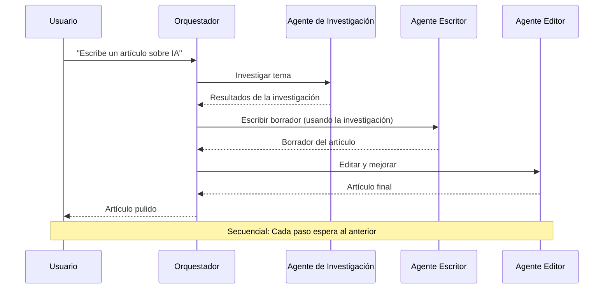
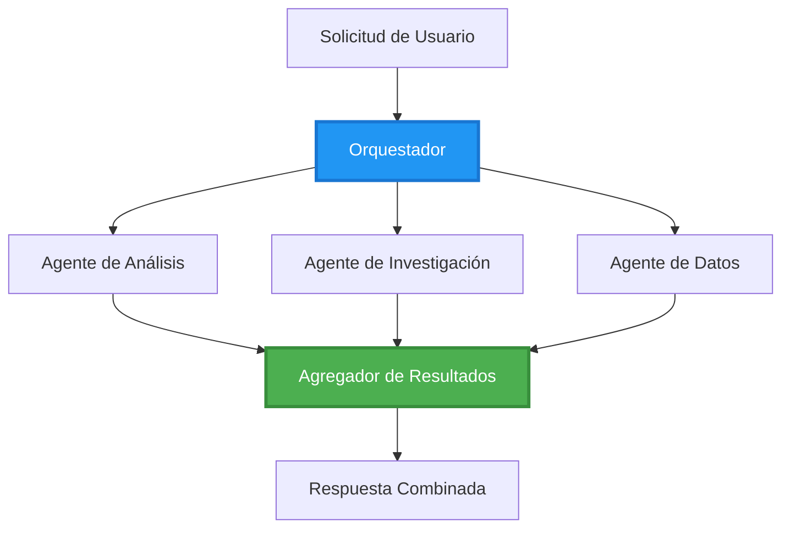
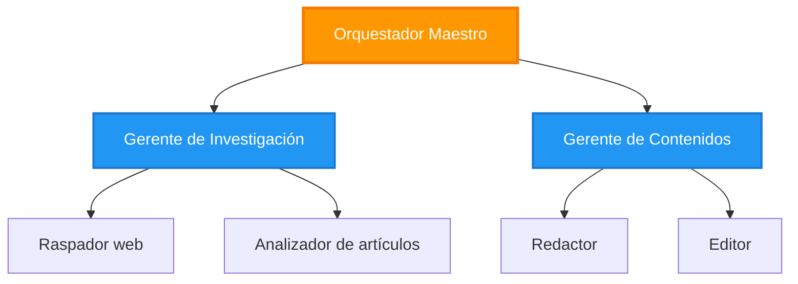
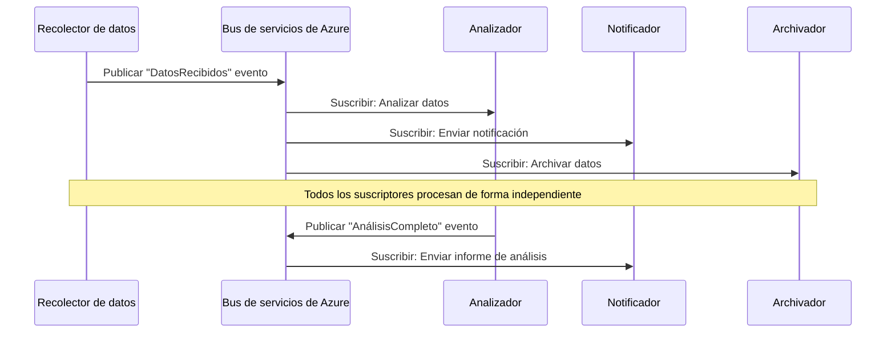
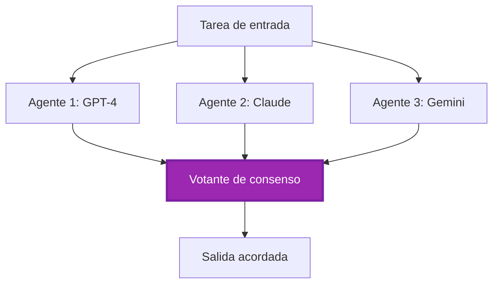
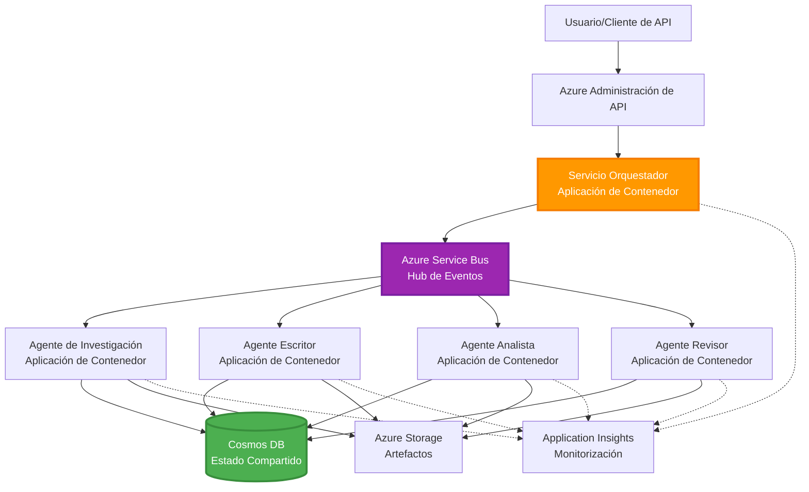

# Patrones de Coordinación Multi-Agente

⏱️ **Tiempo estimado**: 60-75 minutos | 💰 **Costo estimado**: ~$100-300/mes | ⭐ **Complejidad**: Avanzado

**📚 Ruta de aprendizaje:**
- ← Anterior: [Planificación de Capacidad](capacity-planning.md) - Dimensionamiento de recursos y estrategias de escalado
- 🎯 **Estás aquí**: Patrones de Coordinación Multi-Agente (Orquestación, comunicación, gestión de estado)
- → Siguiente: [Selección de SKU](sku-selection.md) - Elegir los servicios de Azure adecuados
- 🏠 [Inicio del curso](../../README.md)

---

## Qué aprenderás

Al completar esta lección, tú:
- Entenderás los **patrones de arquitectura multi-agente** y cuándo usarlos
- Implementarás **patrones de orquestación** (centralizada, descentralizada, jerárquica)
- Diseñarás **estrategias de comunicación entre agentes** (síncrona, asíncrona, orientada a eventos)
- Gestionarás el **estado compartido** entre agentes distribuidos
- Desplegarás **sistemas multi-agente** en Azure con AZD
- Aplicarás **patrones de coordinación** para escenarios reales de IA
- Monitorearás y depurarás sistemas de agentes distribuidos

## Por qué importa la coordinación multi-agente

### La evolución: de un solo agente a multi-agente

**Agente único (Simple):**
```
User → Agent → Response
```
- ✅ Fácil de entender e implementar
- ✅ Rápido para tareas simples
- ❌ Limitado por las capacidades de un solo modelo
- ❌ No puede paralelizar tareas complejas
- ❌ Sin especialización

**Sistema multi-agente (Avanzado):**
```
           ┌─────────────┐
           │ Orchestrator│
           └──────┬──────┘
        ┌─────────┼─────────┐
        │         │         │
    ┌───▼──┐  ┌──▼───┐  ┌──▼────┐
    │Agent1│  │Agent2│  │Agent3 │
    │(Plan)│  │(Code)│  │(Review)│
    └──────┘  └──────┘  └───────┘
```
- ✅ Agentes especializados para tareas específicas
- ✅ Ejecución en paralelo para mayor velocidad
- ✅ Modular y mantenible
- ✅ Mejor para flujos de trabajo complejos
- ⚠️ Requiere lógica de coordinación

**Analogía**: Un agente único es como una persona que hace todas las tareas. Multi-agente es como un equipo donde cada miembro tiene habilidades especializadas (investigador, programador, revisor, redactor) trabajando juntos.

---

## Patrones centrales de coordinación

### Patrón 1: Coordinación secuencial (Cadena de responsabilidad)

**Cuándo usar**: Las tareas deben completarse en un orden específico, cada agente se basa en la salida anterior.


**Beneficios:**
- ✅ Flujo de datos claro
- ✅ Fácil de depurar
- ✅ Orden de ejecución predecible

**Limitaciones:**
- ❌ Más lento (sin paralelismo)
- ❌ Una falla bloquea toda la cadena
- ❌ No puede manejar tareas interdependientes

**Casos de uso de ejemplo:**
- Canal de creación de contenido (investigación → escribir → editar → publicar)
- Generación de código (plan → implementar → probar → desplegar)
- Generación de informes (recolección de datos → análisis → visualización → resumen)

---

### Patrón 2: Coordinación en paralelo (Fan-Out/Fan-In)

**Cuándo usar**: Tareas independientes pueden ejecutarse simultáneamente, los resultados se combinan al final.


**Beneficios:**
- ✅ Rápido (ejecución en paralelo)
- ✅ Tolerante a fallos (resultados parciales aceptables)
- ✅ Escala horizontalmente

**Limitaciones:**
- ⚠️ Los resultados pueden llegar fuera de orden
- ⚠️ Se necesita lógica de agregación
- ⚠️ Gestión de estado compleja

**Casos de uso de ejemplo:**
- Recolección de datos desde múltiples fuentes (APIs + bases de datos + scraping web)
- Análisis competitivo (múltiples modelos generan soluciones, se selecciona la mejor)
- Servicios de traducción (traducir a múltiples idiomas simultáneamente)

---

### Patrón 3: Coordinación jerárquica (Manager-Worker)

**Cuándo usar**: Flujos de trabajo complejos con sub-tareas, se necesita delegación.


**Beneficios:**
- ✅ Maneja flujos de trabajo complejos
- ✅ Modular y mantenible
- ✅ Límites de responsabilidad claros

**Limitaciones:**
- ⚠️ Arquitectura más compleja
- ⚠️ Mayor latencia (múltiples capas de coordinación)
- ⚠️ Requiere orquestación sofisticada

**Casos de uso de ejemplo:**
- Procesamiento de documentos empresariales (clasificar → enrutar → procesar → archivar)
- Pipelines de datos multietapa (ingest → limpiar → transformar → analizar → reportar)
- Flujos de trabajo de automatización complejos (planificación → asignación de recursos → ejecución → monitoreo)

---

### Patrón 4: Coordinación basada en eventos (Publicar-Suscribir)

**Cuándo usar**: Los agentes necesitan reaccionar a eventos, se desea acoplamiento débil.


**Beneficios:**
- ✅ Acoplamiento débil entre agentes
- ✅ Fácil añadir nuevos agentes (solo suscribirse)
- ✅ Procesamiento asíncrono
- ✅ Resiliente (persistencia de mensajes)

**Limitaciones:**
- ⚠️ Consistencia eventual
- ⚠️ Depuración compleja
- ⚠️ Desafíos de ordenamiento de mensajes

**Casos de uso de ejemplo:**
- Sistemas de monitoreo en tiempo real (alertas, dashboards, logs)
- Notificaciones multicanal (email, SMS, push, Slack)
- Pipelines de procesamiento de datos (múltiples consumidores de los mismos datos)

---

### Patrón 5: Coordinación basada en consenso (Votación/Quorum)

**Cuándo usar**: Se necesita acuerdo de múltiples agentes antes de proceder.


**Beneficios:**
- ✅ Mayor precisión (múltiples opiniones)
- ✅ Tolerante a fallos (fallas en la minoría aceptables)
- ✅ Aseguramiento de calidad incorporado

**Limitaciones:**
- ❌ Costoso (múltiples llamadas a modelos)
- ❌ Más lento (esperar a todos los agentes)
- ⚠️ Se necesita resolución de conflictos

**Casos de uso de ejemplo:**
- Moderación de contenido (múltiples modelos revisan el contenido)
- Revisión de código (múltiples linters/analizadores)
- Diagnóstico médico (múltiples modelos de IA, validación de expertos)

---

## Resumen arquitectónico

### Sistema multi-agente completo en Azure


**Componentes clave:**

| Component | Purpose | Azure Service |
|-----------|---------|---------------|
| **API Gateway** | Punto de entrada, limitación de tasa, autenticación | API Management |
| **Orchestrator** | Coordina los flujos de trabajo de los agentes | Container Apps |
| **Message Queue** | Comunicación asíncrona | Service Bus / Event Hubs |
| **Agents** | Trabajadores de IA especializados | Container Apps / Functions |
| **State Store** | Estado compartido, seguimiento de tareas | Cosmos DB |
| **Artifact Storage** | Documentos, resultados, logs | Blob Storage |
| **Monitoring** | Trazado distribuido, logs | Application Insights |

---

## Requisitos previos

### Herramientas requeridas

```bash
# Verificar Azure Developer CLI
azd version
# ✅ Esperado: azd versión 1.0.0 o superior

# Verificar Azure CLI
az --version
# ✅ Esperado: azure-cli 2.50.0 o superior

# Verificar Docker (para pruebas locales)
docker --version
# ✅ Esperado: Docker versión 20.10 o superior
```

### Requisitos de Azure

- Suscripción activa de Azure
- Permisos para crear:
  - Container Apps
  - Service Bus namespaces
  - Cosmos DB accounts
  - Storage accounts
  - Application Insights

### Conocimientos previos

Deberías haber completado:
- [Configuration Management](../chapter-03-configuration/configuration.md)
- [Authentication & Security](../chapter-03-configuration/authsecurity.md)
- [Microservices Example](../../../../examples/microservices)

---

## Guía de implementación

### Estructura del proyecto

```
multi-agent-system/
├── azure.yaml                    # AZD configuration
├── infra/
│   ├── main.bicep               # Main infrastructure
│   ├── core/
│   │   ├── servicebus.bicep     # Message queue
│   │   ├── cosmos.bicep         # State store
│   │   ├── storage.bicep        # Artifact storage
│   │   └── monitoring.bicep     # Application Insights
│   └── app/
│       ├── orchestrator.bicep   # Orchestrator service
│       └── agent.bicep          # Agent template
└── src/
    ├── orchestrator/            # Orchestration logic
    │   ├── app.py
    │   ├── workflows.py
    │   └── Dockerfile
    ├── agents/
    │   ├── research/            # Research agent
    │   ├── writer/              # Writer agent
    │   ├── analyst/             # Analyst agent
    │   └── reviewer/            # Reviewer agent
    └── shared/
        ├── state_manager.py     # Shared state logic
        └── message_handler.py   # Message handling
```

---

## Lección 1: Patrón de Coordinación Secuencial

### Implementación: Canal de creación de contenido

Construyamos un pipeline secuencial: Investigación → Escribir → Editar → Publicar

### 1. Configuración de AZD

**Archivo: `azure.yaml`**

```yaml
name: content-pipeline
metadata:
  template: multi-agent-sequential@1.0.0

services:
  orchestrator:
    project: ./src/orchestrator
    language: python
    host: containerapp
  
  research-agent:
    project: ./src/agents/research
    language: python
    host: containerapp
  
  writer-agent:
    project: ./src/agents/writer
    language: python
    host: containerapp
  
  editor-agent:
    project: ./src/agents/editor
    language: python
    host: containerapp
```

### 2. Infraestructura: Service Bus para coordinación

**Archivo: `infra/core/servicebus.bicep`**

```bicep
param name string
param location string
param tags object = {}

resource serviceBusNamespace 'Microsoft.ServiceBus/namespaces@2022-10-01-preview' = {
  name: name
  location: location
  tags: tags
  sku: {
    name: 'Standard'
    tier: 'Standard'
  }
  properties: {
    minimumTlsVersion: '1.2'
  }
}

// Queue for orchestrator → research agent
resource researchQueue 'Microsoft.ServiceBus/namespaces/queues@2022-10-01-preview' = {
  parent: serviceBusNamespace
  name: 'research-tasks'
  properties: {
    maxDeliveryCount: 3
    lockDuration: 'PT5M'
    deadLetteringOnMessageExpiration: true
  }
}

// Queue for research agent → writer agent
resource writerQueue 'Microsoft.ServiceBus/namespaces/queues@2022-10-01-preview' = {
  parent: serviceBusNamespace
  name: 'writer-tasks'
  properties: {
    maxDeliveryCount: 3
    lockDuration: 'PT5M'
  }
}

// Queue for writer agent → editor agent
resource editorQueue 'Microsoft.ServiceBus/namespaces/queues@2022-10-01-preview' = {
  parent: serviceBusNamespace
  name: 'editor-tasks'
  properties: {
    maxDeliveryCount: 3
    lockDuration: 'PT5M'
  }
}

output namespace string = serviceBusNamespace.name
output connectionString string = listKeys('${serviceBusNamespace.id}/AuthorizationRules/RootManageSharedAccessKey', serviceBusNamespace.apiVersion).primaryConnectionString
```

### 3. Gestor de estado compartido

**Archivo: `src/shared/state_manager.py`**

```python
from azure.cosmos import CosmosClient, PartitionKey
from datetime import datetime
import os

class StateManager:
    """Manages shared state across agents using Cosmos DB"""
    
    def __init__(self):
        endpoint = os.environ['COSMOS_ENDPOINT']
        key = os.environ['COSMOS_KEY']
        
        self.client = CosmosClient(endpoint, key)
        self.database = self.client.get_database_client('agent-state')
        self.container = self.database.get_container_client('tasks')
    
    def create_task(self, task_id: str, task_type: str, input_data: dict):
        """Create a new task"""
        task = {
            'id': task_id,
            'type': task_type,
            'status': 'pending',
            'input': input_data,
            'created_at': datetime.utcnow().isoformat(),
            'steps': []
        }
        self.container.create_item(task)
        return task
    
    def update_task_step(self, task_id: str, step_name: str, result: dict):
        """Update task with completed step"""
        task = self.container.read_item(task_id, partition_key=task_id)
        
        task['steps'].append({
            'name': step_name,
            'completed_at': datetime.utcnow().isoformat(),
            'result': result
        })
        
        self.container.replace_item(task_id, task)
        return task
    
    def complete_task(self, task_id: str, final_result: dict):
        """Mark task as complete"""
        task = self.container.read_item(task_id, partition_key=task_id)
        task['status'] = 'completed'
        task['result'] = final_result
        task['completed_at'] = datetime.utcnow().isoformat()
        self.container.replace_item(task_id, task)
        return task
    
    def get_task(self, task_id: str):
        """Retrieve task state"""
        return self.container.read_item(task_id, partition_key=task_id)
```

### 4. Servicio orquestador

**Archivo: `src/orchestrator/app.py`**

```python
from flask import Flask, request, jsonify
from azure.servicebus import ServiceBusClient, ServiceBusMessage
import json
import uuid
import os
from shared.state_manager import StateManager

app = Flask(__name__)
state_manager = StateManager()

# Conexión al Service Bus
servicebus_connection_str = os.environ['SERVICEBUS_CONNECTION_STRING']
servicebus_client = ServiceBusClient.from_connection_string(servicebus_connection_str)

@app.route('/health', methods=['GET'])
def health():
    return jsonify({'status': 'healthy', 'service': 'orchestrator'})

@app.route('/create-content', methods=['POST'])
def create_content():
    """
    Sequential workflow: Research → Write → Edit → Publish
    """
    data = request.json
    topic = data.get('topic')
    
    if not topic:
        return jsonify({'error': 'Topic required'}), 400
    
    # Crear tarea en el almacén de estado
    task_id = str(uuid.uuid4())
    task = state_manager.create_task(
        task_id=task_id,
        task_type='content_creation',
        input_data={'topic': topic}
    )
    
    # Enviar mensaje al agente de investigación (primer paso)
    sender = servicebus_client.get_queue_sender('research-tasks')
    message = ServiceBusMessage(
        body=json.dumps({
            'task_id': task_id,
            'topic': topic,
            'next_queue': 'writer-tasks'  # Dónde enviar los resultados
        }),
        content_type='application/json'
    )
    
    with sender:
        sender.send_messages(message)
    
    return jsonify({
        'task_id': task_id,
        'status': 'started',
        'workflow': 'sequential',
        'steps': ['research', 'write', 'edit', 'publish'],
        'message': 'Content creation pipeline initiated'
    }), 202

@app.route('/task/<task_id>', methods=['GET'])
def get_task_status(task_id):
    """Check task status"""
    try:
        task = state_manager.get_task(task_id)
        return jsonify(task)
    except Exception as e:
        return jsonify({'error': str(e)}), 404

if __name__ == '__main__':
    app.run(host='0.0.0.0', port=8080)
```

### 5. Agente de investigación

**Archivo: `src/agents/research/app.py`**

```python
from azure.servicebus import ServiceBusClient, ServiceBusMessage
from openai import AzureOpenAI
import json
import os
import time
from shared.state_manager import StateManager

# Inicializar clientes
state_manager = StateManager()
servicebus_client = ServiceBusClient.from_connection_string(
    os.environ['SERVICEBUS_CONNECTION_STRING']
)

openai_client = AzureOpenAI(
    api_key=os.environ['AZURE_OPENAI_API_KEY'],
    api_version="2024-02-01",
    azure_endpoint=os.environ['AZURE_OPENAI_ENDPOINT']
)

def process_research_task(message_data):
    """Process research request and pass to writer"""
    task_id = message_data['task_id']
    topic = message_data['topic']
    next_queue = message_data['next_queue']
    
    print(f"🔬 Researching: {topic}")
    
    # Llamar a Azure OpenAI para investigación
    response = openai_client.chat.completions.create(
        model="gpt-4",
        messages=[
            {"role": "system", "content": "You are a research assistant. Provide comprehensive research on the given topic."},
            {"role": "user", "content": f"Research this topic thoroughly: {topic}"}
        ],
        max_tokens=1500
    )
    
    research_results = response.choices[0].message.content
    
    # Actualizar estado
    state_manager.update_task_step(
        task_id=task_id,
        step_name='research',
        result={'research': research_results}
    )
    
    # Enviar al siguiente agente (escritor)
    sender = servicebus_client.get_queue_sender(next_queue)
    message = ServiceBusMessage(
        body=json.dumps({
            'task_id': task_id,
            'topic': topic,
            'research': research_results,
            'next_queue': 'editor-tasks'
        }),
        content_type='application/json'
    )
    
    with sender:
        sender.send_messages(message)
    
    print(f"✅ Research complete for task {task_id}")

def main():
    """Listen to research queue"""
    receiver = servicebus_client.get_queue_receiver('research-tasks')
    
    print("🔬 Research Agent started, listening for tasks...")
    
    with receiver:
        while True:
            messages = receiver.receive_messages(max_wait_time=5)
            for message in messages:
                try:
                    message_data = json.loads(str(message))
                    process_research_task(message_data)
                    receiver.complete_message(message)
                except Exception as e:
                    print(f"❌ Error processing message: {e}")
                    receiver.abandon_message(message)

if __name__ == '__main__':
    main()
```

### 6. Agente escritor

**Archivo: `src/agents/writer/app.py`**

```python
from azure.servicebus import ServiceBusClient, ServiceBusMessage
from openai import AzureOpenAI
import json
import os
from shared.state_manager import StateManager

state_manager = StateManager()
servicebus_client = ServiceBusClient.from_connection_string(
    os.environ['SERVICEBUS_CONNECTION_STRING']
)

openai_client = AzureOpenAI(
    api_key=os.environ['AZURE_OPENAI_API_KEY'],
    api_version="2024-02-01",
    azure_endpoint=os.environ['AZURE_OPENAI_ENDPOINT']
)

def process_writing_task(message_data):
    """Write article based on research"""
    task_id = message_data['task_id']
    topic = message_data['topic']
    research = message_data['research']
    next_queue = message_data['next_queue']
    
    print(f"✍️ Writing article: {topic}")
    
    # Llamar a Azure OpenAI para escribir el artículo
    response = openai_client.chat.completions.create(
        model="gpt-4",
        messages=[
            {"role": "system", "content": "You are a professional writer. Write engaging, well-structured articles."},
            {"role": "user", "content": f"Based on this research:\n\n{research}\n\nWrite a comprehensive article about: {topic}"}
        ],
        max_tokens=2000
    )
    
    article_draft = response.choices[0].message.content
    
    # Actualizar el estado
    state_manager.update_task_step(
        task_id=task_id,
        step_name='writing',
        result={'draft': article_draft}
    )
    
    # Enviar al editor
    sender = servicebus_client.get_queue_sender(next_queue)
    message = ServiceBusMessage(
        body=json.dumps({
            'task_id': task_id,
            'topic': topic,
            'draft': article_draft
        }),
        content_type='application/json'
    )
    
    with sender:
        sender.send_messages(message)
    
    print(f"✅ Article draft complete for task {task_id}")

def main():
    """Listen to writer queue"""
    receiver = servicebus_client.get_queue_receiver('writer-tasks')
    
    print("✍️ Writer Agent started, listening for tasks...")
    
    with receiver:
        while True:
            messages = receiver.receive_messages(max_wait_time=5)
            for message in messages:
                try:
                    message_data = json.loads(str(message))
                    process_writing_task(message_data)
                    receiver.complete_message(message)
                except Exception as e:
                    print(f"❌ Error: {e}")
                    receiver.abandon_message(message)

if __name__ == '__main__':
    main()
```

### 7. Agente editor

**Archivo: `src/agents/editor/app.py`**

```python
from azure.servicebus import ServiceBusClient
from openai import AzureOpenAI
import json
import os
from shared.state_manager import StateManager

state_manager = StateManager()
servicebus_client = ServiceBusClient.from_connection_string(
    os.environ['SERVICEBUS_CONNECTION_STRING']
)

openai_client = AzureOpenAI(
    api_key=os.environ['AZURE_OPENAI_API_KEY'],
    api_version="2024-02-01",
    azure_endpoint=os.environ['AZURE_OPENAI_ENDPOINT']
)

def process_editing_task(message_data):
    """Edit and finalize article"""
    task_id = message_data['task_id']
    topic = message_data['topic']
    draft = message_data['draft']
    
    print(f"📝 Editing article: {topic}")
    
    # Llamar a Azure OpenAI para editar
    response = openai_client.chat.completions.create(
        model="gpt-4",
        messages=[
            {"role": "system", "content": "You are an expert editor. Improve grammar, clarity, and structure."},
            {"role": "user", "content": f"Edit and improve this article:\n\n{draft}"}
        ],
        max_tokens=2000
    )
    
    final_article = response.choices[0].message.content
    
    # Marcar la tarea como completada
    state_manager.complete_task(
        task_id=task_id,
        final_result={
            'topic': topic,
            'final_article': final_article,
            'word_count': len(final_article.split())
        }
    )
    
    print(f"✅ Article finalized for task {task_id}")

def main():
    """Listen to editor queue"""
    receiver = servicebus_client.get_queue_receiver('editor-tasks')
    
    print("📝 Editor Agent started, listening for tasks...")
    
    with receiver:
        while True:
            messages = receiver.receive_messages(max_wait_time=5)
            for message in messages:
                try:
                    message_data = json.loads(str(message))
                    process_editing_task(message_data)
                    receiver.complete_message(message)
                except Exception as e:
                    print(f"❌ Error: {e}")
                    receiver.abandon_message(message)

if __name__ == '__main__':
    main()
```

### 8. Desplegar y probar

```bash
# Inicializar y desplegar
azd init
azd up

# Obtener la URL del orquestador
ORCHESTRATOR_URL=$(azd env get-values | grep ORCHESTRATOR_URL | cut -d '=' -f2 | tr -d '"')

# Crear contenido
curl -X POST $ORCHESTRATOR_URL/create-content \
  -H "Content-Type: application/json" \
  -d '{"topic": "The Future of AI in Healthcare"}'
```

**✅ Salida esperada:**
```json
{
  "task_id": "a1b2c3d4-e5f6-7890-abcd-ef1234567890",
  "status": "started",
  "workflow": "sequential",
  "steps": ["research", "write", "edit", "publish"],
  "message": "Content creation pipeline initiated"
}
```

**Comprobar progreso de la tarea:**
```bash
TASK_ID="a1b2c3d4-e5f6-7890-abcd-ef1234567890"
curl $ORCHESTRATOR_URL/task/$TASK_ID
```

**✅ Salida esperada (completado):**
```json
{
  "id": "a1b2c3d4-e5f6-7890-abcd-ef1234567890",
  "type": "content_creation",
  "status": "completed",
  "steps": [
    {
      "name": "research",
      "completed_at": "2025-11-19T10:30:00Z",
      "result": {"research": "..."}
    },
    {
      "name": "writing",
      "completed_at": "2025-11-19T10:32:00Z",
      "result": {"draft": "..."}
    }
  ],
  "result": {
    "topic": "The Future of AI in Healthcare",
    "final_article": "...",
    "word_count": 1500
  }
}
```

---

## Lección 2: Patrón de Coordinación en Paralelo

### Implementación: Agregador de investigación multi-fuente

Construyamos un sistema paralelo que reúna información de múltiples fuentes simultáneamente.

### Orquestador paralelo

**Archivo: `src/orchestrator/parallel_workflow.py`**

```python
from flask import Flask, request, jsonify
from azure.servicebus import ServiceBusClient, ServiceBusMessage
import json
import uuid
import os
from shared.state_manager import StateManager

app = Flask(__name__)
state_manager = StateManager()

servicebus_client = ServiceBusClient.from_connection_string(
    os.environ['SERVICEBUS_CONNECTION_STRING']
)

@app.route('/research-parallel', methods=['POST'])
def research_parallel():
    """
    Parallel workflow: Multiple agents work simultaneously
    """
    data = request.json
    query = data.get('query')
    
    task_id = str(uuid.uuid4())
    task = state_manager.create_task(
        task_id=task_id,
        task_type='parallel_research',
        input_data={
            'query': query,
            'agents': ['web', 'academic', 'news', 'social']
        }
    )
    
    # Difusión: Enviar a todos los agentes simultáneamente
    agents = [
        ('web-research-queue', 'web'),
        ('academic-research-queue', 'academic'),
        ('news-research-queue', 'news'),
        ('social-research-queue', 'social')
    ]
    
    for queue_name, agent_type in agents:
        sender = servicebus_client.get_queue_sender(queue_name)
        message = ServiceBusMessage(
            body=json.dumps({
                'task_id': task_id,
                'query': query,
                'agent_type': agent_type,
                'result_queue': 'aggregation-queue'
            }),
            content_type='application/json'
        )
        
        with sender:
            sender.send_messages(message)
    
    return jsonify({
        'task_id': task_id,
        'status': 'started',
        'workflow': 'parallel',
        'agents_dispatched': 4,
        'message': 'Parallel research initiated'
    }), 202

if __name__ == '__main__':
    app.run(host='0.0.0.0', port=8080)
```

### Lógica de agregación

**Archivo: `src/agents/aggregator/app.py`**

```python
from azure.servicebus import ServiceBusClient
import json
import os
from collections import defaultdict
from shared.state_manager import StateManager

state_manager = StateManager()
servicebus_client = ServiceBusClient.from_connection_string(
    os.environ['SERVICEBUS_CONNECTION_STRING']
)

# Rastrear resultados por tarea
task_results = defaultdict(list)
expected_agents = 4  # web, académico, noticias, social

def process_result(message_data):
    """Aggregate results from parallel agents"""
    task_id = message_data['task_id']
    agent_type = message_data['agent_type']
    result = message_data['result']
    
    # Almacenar resultado
    task_results[task_id].append({
        'agent': agent_type,
        'data': result
    })
    
    print(f"📊 Received result from {agent_type} agent ({len(task_results[task_id])}/{expected_agents})")
    
    # Comprobar si todos los agentes han completado (fan-in)
    if len(task_results[task_id]) == expected_agents:
        print(f"✅ All agents completed for task {task_id}. Aggregating...")
        
        # Combinar resultados
        aggregated = {
            'query': message_data['query'],
            'sources': task_results[task_id],
            'summary': generate_summary(task_results[task_id])
        }
        
        # Marcar como completado
        state_manager.complete_task(task_id, aggregated)
        
        # Limpiar
        del task_results[task_id]
        
        print(f"✅ Aggregation complete for task {task_id}")

def generate_summary(results):
    """Generate summary from all sources"""
    summaries = [r['data'].get('summary', '') for r in results]
    return '\n\n'.join(summaries)

def main():
    """Listen to aggregation queue"""
    receiver = servicebus_client.get_queue_receiver('aggregation-queue')
    
    print("📊 Aggregator started, listening for results...")
    
    with receiver:
        while True:
            messages = receiver.receive_messages(max_wait_time=5)
            for message in messages:
                try:
                    message_data = json.loads(str(message))
                    process_result(message_data)
                    receiver.complete_message(message)
                except Exception as e:
                    print(f"❌ Error: {e}")
                    receiver.abandon_message(message)

if __name__ == '__main__':
    main()
```

**Beneficios del patrón paralelo:**
- ⚡ **4x más rápido** (los agentes se ejecutan simultáneamente)
- 🔄 **Tolerante a fallos** (resultados parciales aceptables)
- 📈 **Escalable** (añadir más agentes fácilmente)

---

## Ejercicios prácticos

### Ejercicio 1: Añadir manejo de timeouts ⭐⭐ (Medio)

**Objetivo**: Implementar lógica de timeout para que el agregador no espere indefinidamente a agentes lentos.

**Pasos**:

1. **Añadir seguimiento de timeout al agregador:**

```python
from datetime import datetime, timedelta

task_timeouts = {}  # task_id -> expiration_time

def process_result(message_data):
    task_id = message_data['task_id']
    
    # Establecer tiempo de espera para el primer resultado
    if task_id not in task_timeouts:
        task_timeouts[task_id] = datetime.utcnow() + timedelta(seconds=30)
    
    task_results[task_id].append({
        'agent': message_data['agent_type'],
        'data': message_data['result']
    })
    
    # Comprobar si está completo O si se agotó el tiempo
    if len(task_results[task_id]) == expected_agents or \
       datetime.utcnow() > task_timeouts[task_id]:
        
        print(f"📊 Aggregating with {len(task_results[task_id])}/{expected_agents} results")
        
        aggregated = {
            'query': message_data['query'],
            'sources': task_results[task_id],
            'completed_agents': len(task_results[task_id]),
            'timed_out': len(task_results[task_id]) < expected_agents
        }
        
        state_manager.complete_task(task_id, aggregated)
        
        # Limpieza
        del task_results[task_id]
        del task_timeouts[task_id]
```

2. **Probar con retrasos artificiales:**

```python
# En un agente, agregar retraso para simular procesamiento lento
import time
time.sleep(35)  # Supera el tiempo de espera de 30 segundos
```

3. **Desplegar y verificar:**

```bash
azd deploy aggregator

# Enviar tarea
curl -X POST $ORCHESTRATOR_URL/research-parallel \
  -H "Content-Type: application/json" \
  -d '{"query": "AI safety research"}'

# Comprobar resultados después de 30 segundos
curl $ORCHESTRATOR_URL/task/$TASK_ID
```

**✅ Criterios de éxito:**
- ✅ La tarea se completa después de 30 segundos incluso si los agentes están incompletos
- ✅ La respuesta indica resultados parciales (`"timed_out": true`)
- ✅ Se devuelven los resultados disponibles (3 de 4 agentes)

**Tiempo**: 20-25 minutos

---

### Ejercicio 2: Implementar lógica de reintentos ⭐⭐⭐ (Avanzado)

**Objetivo**: Reintentar automáticamente tareas de agentes fallidos antes de rendirse.

**Pasos**:

1. **Añadir seguimiento de reintentos al orquestador:**

```python
from dataclasses import dataclass
from typing import Dict

@dataclass
class RetryConfig:
    max_retries: int = 3
    backoff_seconds: int = 5

retry_counts: Dict[str, int] = {}  # message_id -> retry_count

def send_with_retry(queue_name: str, message_data: dict, retry_config: RetryConfig):
    """Send message with retry metadata"""
    message_id = message_data.get('message_id', str(uuid.uuid4()))
    message_data['message_id'] = message_id
    message_data['retry_count'] = retry_counts.get(message_id, 0)
    message_data['max_retries'] = retry_config.max_retries
    
    sender = servicebus_client.get_queue_sender(queue_name)
    message = ServiceBusMessage(
        body=json.dumps(message_data),
        content_type='application/json',
        message_id=message_id
    )
    
    with sender:
        sender.send_messages(message)
```

2. **Añadir manejador de reintentos a los agentes:**

```python
def process_with_retry(message, receiver, process_func):
    """Process message with automatic retry on failure"""
    try:
        message_data = json.loads(str(message))
        
        # Procesar el mensaje
        process_func(message_data)
        
        # Éxito - completado
        receiver.complete_message(message)
        
    except Exception as e:
        message_id = message.message_id
        retry_count = message_data.get('retry_count', 0)
        max_retries = message_data.get('max_retries', 3)
        
        if retry_count < max_retries:
            # Reintentar: abandonar y volver a encolar con el contador incrementado
            print(f"⚠️ Retry {retry_count + 1}/{max_retries} for message {message_id}")
            
            message_data['retry_count'] = retry_count + 1
            
            # Enviar de nuevo a la misma cola con retraso
            time.sleep(5 * (retry_count + 1))  # Espera exponencial
            send_with_retry(queue_name, message_data, RetryConfig())
            
            receiver.complete_message(message)  # Eliminar el original
        else:
            # Número máximo de reintentos excedido - mover a la cola de mensajes no entregados
            print(f"❌ Max retries exceeded for message {message_id}")
            receiver.dead_letter_message(
                message,
                reason="MaxRetriesExceeded",
                error_description=str(e)
            )
```

3. **Monitorear la dead letter queue:**

```python
def monitor_dead_letters():
    """Check dead letter queue for failed messages"""
    receiver = servicebus_client.get_queue_receiver(
        'research-queue',
        sub_queue='deadletter'
    )
    
    with receiver:
        messages = receiver.receive_messages(max_wait_time=5)
        for message in messages:
            print(f"☠️ Dead letter: {message.message_id}")
            print(f"Reason: {message.dead_letter_reason}")
            print(f"Description: {message.dead_letter_error_description}")
```

**✅ Criterios de éxito:**
- ✅ Las tareas fallidas se reintentan automáticamente (hasta 3 veces)
- ✅ Backoff exponencial entre reintentos (5s, 10s, 15s)
- ✅ Después de los reintentos máximos, los mensajes van a la dead letter queue
- ✅ La dead letter queue puede ser monitorizada y reenviada

**Tiempo**: 30-40 minutos

---

### Ejercicio 3: Implementar Circuit Breaker ⭐⭐⭐ (Avanzado)

**Objetivo**: Prevenir fallos en cascada deteniendo las solicitudes a agentes que fallan.

**Pasos**:

1. **Crear clase de circuit breaker:**

```python
from enum import Enum
from datetime import datetime, timedelta

class CircuitState(Enum):
    CLOSED = "closed"      # Operación normal
    OPEN = "open"          # Fallo, rechazar solicitudes
    HALF_OPEN = "half_open"  # Comprobando si se ha recuperado

class CircuitBreaker:
    def __init__(self, failure_threshold=5, timeout_seconds=60):
        self.failure_threshold = failure_threshold
        self.timeout_seconds = timeout_seconds
        self.failure_count = 0
        self.last_failure_time = None
        self.state = CircuitState.CLOSED
    
    def call(self, func):
        """Execute function with circuit breaker protection"""
        if self.state == CircuitState.OPEN:
            # Comprobar si el tiempo de espera ha expirado
            if datetime.utcnow() - self.last_failure_time > timedelta(seconds=self.timeout_seconds):
                self.state = CircuitState.HALF_OPEN
                print("🔄 Circuit breaker: HALF_OPEN (testing)")
            else:
                raise Exception(f"Circuit breaker OPEN for agent. Try again in {self.timeout_seconds}s")
        
        try:
            result = func()
            
            # Éxito
            if self.state == CircuitState.HALF_OPEN:
                self.state = CircuitState.CLOSED
                self.failure_count = 0
                print("✅ Circuit breaker: CLOSED (recovered)")
            
            return result
            
        except Exception as e:
            self.failure_count += 1
            self.last_failure_time = datetime.utcnow()
            
            if self.failure_count >= self.failure_threshold:
                self.state = CircuitState.OPEN
                print(f"🔴 Circuit breaker: OPEN (too many failures)")
            
            raise e
```

2. **Aplicar a llamadas a agentes:**

```python
# En el orquestador
agent_circuits = {
    'web': CircuitBreaker(failure_threshold=5, timeout_seconds=60),
    'academic': CircuitBreaker(failure_threshold=5, timeout_seconds=60),
    'news': CircuitBreaker(failure_threshold=5, timeout_seconds=60),
    'social': CircuitBreaker(failure_threshold=5, timeout_seconds=60)
}

def send_to_agent(agent_type, message_data):
    """Send with circuit breaker protection"""
    circuit = agent_circuits[agent_type]
    
    try:
        circuit.call(lambda: send_message(agent_type, message_data))
    except Exception as e:
        print(f"⚠️ Skipping {agent_type} agent: {e}")
        # Continuar con otros agentes
```

3. **Probar el circuit breaker:**

```bash
# Simular fallos repetidos (detener un agente)
az containerapp stop --name web-research-agent --resource-group rg-agents

# Enviar múltiples solicitudes
for i in {1..10}; do
  curl -X POST $ORCHESTRATOR_URL/research-parallel \
    -H "Content-Type: application/json" \
    -d '{"query": "test query '$i'"}'
  sleep 2
done

# Comprobar los registros - debería ver el circuito abierto después de 5 fallos
# Usar Azure CLI para los registros de Container App:
az containerapp logs show --name orchestrator --resource-group $RG_NAME --tail 50
```

**✅ Criterios de éxito:**
- ✅ Tras 5 fallos, el circuito se abre (rechaza solicitudes)
- ✅ Tras 60 segundos, el circuito pasa a semi-abierto (prueba recuperación)
- ✅ Otros agentes continúan funcionando normalmente
- ✅ El circuito se cierra automáticamente cuando el agente se recupera

**Tiempo**: 40-50 minutos

---

## Monitoreo y depuración

### Trazado distribuido con Application Insights

**Archivo: `src/shared/tracing.py`**

```python
from opencensus.ext.azure.log_exporter import AzureLogHandler
from opencensus.ext.azure.trace_exporter import AzureExporter
from opencensus.trace import config_integration
from opencensus.trace.tracer import Tracer
from opencensus.trace.samplers import AlwaysOnSampler
import logging
import os

# Configurar el trazado
config_integration.trace_integrations(['requests', 'logging'])

connection_string = os.environ.get('APPLICATIONINSIGHTS_CONNECTION_STRING')

# Crear trazador
tracer = Tracer(
    exporter=AzureExporter(connection_string=connection_string),
    sampler=AlwaysOnSampler()
)

# Configurar el registro
logger = logging.getLogger(__name__)
logger.addHandler(AzureLogHandler(connection_string=connection_string))
logger.setLevel(logging.INFO)

def trace_agent_call(agent_name, task_id, operation):
    """Trace agent operations"""
    with tracer.span(name=f'{agent_name}.{operation}') as span:
        span.add_attribute('agent', agent_name)
        span.add_attribute('task_id', task_id)
        span.add_attribute('operation', operation)
        
        try:
            result = operation()
            span.add_attribute('status', 'success')
            return result
        except Exception as e:
            span.add_attribute('status', 'error')
            span.add_attribute('error', str(e))
            raise
```

### Consultas de Application Insights

**Rastrear flujos de trabajo multi-agente:**

```kusto
// Trace complete workflow for a task
traces
| where customDimensions.task_id == "a1b2c3d4-..."
| project timestamp, message, customDimensions.agent, customDimensions.operation
| order by timestamp asc
```

**Comparación de rendimiento de agentes:**

```kusto
// Compare agent execution times
dependencies
| where name contains "agent"
| summarize 
    avg_duration = avg(duration),
    p95_duration = percentile(duration, 95),
    count = count()
  by agent = tostring(customDimensions.agent)
| order by avg_duration desc
```

**Análisis de fallos:**

```kusto
// Find which agents fail most
exceptions
| where customDimensions.agent != ""
| summarize 
    failure_count = count(),
    unique_errors = dcount(outerMessage)
  by agent = tostring(customDimensions.agent)
| order by failure_count desc
```

---

## Análisis de costos

### Costos del sistema multi-agente (Estimaciones mensuales)

| Component | Configuration | Cost |
|-----------|--------------|------|
| **Orchestrator** | 1 Container App (1 vCPU, 2GB) | $30-50 |
| **4 Agents** | 4 Container Apps (0.5 vCPU, 1GB each) | $60-120 |
| **Service Bus** | Standard tier, 10M messages | $10-20 |
| **Cosmos DB** | Serverless, 5GB storage, 1M RUs | $25-50 |
| **Blob Storage** | 10GB storage, 100K operations | $5-10 |
| **Application Insights** | 5GB ingestion | $10-15 |
| **Azure OpenAI** | GPT-4, 10M tokens | $100-300 |
| **Total** | | **$240-565/month** |

### Estrategias de optimización de costos

1. **Usar serverless cuando sea posible:**
   ```bicep
   // Cosmos DB serverless (no minimum cost)
   properties: {
     databaseAccountOfferType: 'Standard'
     capabilities: [{ name: 'EnableServerless' }]
   }
   ```

2. **Escalar agentes a cero cuando estén inactivos:**
   ```bicep
   scale: {
     minReplicas: 0  // Scale to zero when no messages
     maxReplicas: 10
   }
   ```

3. **Usar batching para Service Bus:**
   ```python
   # Enviar mensajes en lotes (más barato)
   sender.send_messages([message1, message2, message3])
   ```

4. **Cachear resultados usados con frecuencia:**
   ```python
   # Usar Azure Cache para Redis
   if cache.exists(query_hash):
       return cache.get(query_hash)
   ```

---

## Buenas prácticas

### ✅ HACER:

1. **Usar operaciones idempotentes**
   ```python
   # El agente puede procesar de forma segura el mismo mensaje varias veces
   def process_task(task_id):
       if state_manager.task_exists(task_id):
           print(f"Task {task_id} already processed, skipping")
           return
       # Procesar tarea...
   ```

2. **Implementar registro (logging) exhaustivo**
   ```python
   logger.info(f"Agent: {agent_name}, Task: {task_id}, Action: {action}")
   ```

3. **Usar IDs de correlación**
   ```python
   # Pasar task_id a través de todo el flujo de trabajo
   message_data = {
       'task_id': task_id,  # ID de correlación
       'timestamp': datetime.utcnow().isoformat()
   }
   ```

4. **Establecer TTL en mensajes (time-to-live)**
   ```bicep
   properties: {
     defaultMessageTimeToLive: 'PT1H'  // 1 hour max
   }
   ```

5. **Monitorear las dead letter queues**
   ```python
   # Monitoreo regular de mensajes fallidos
   monitor_dead_letters()
   ```

### ❌ NO HACER:

1. **No crear dependencias circulares**
   ```python
   # ❌ MALO: Agente A → Agente B → Agente A (bucle infinito)
   # ✅ BUENO: Define un grafo acíclico dirigido claro (DAG)
   ```

2. **No bloquear hilos de agentes**
   ```python
   # ❌ MALO: Espera sincrónica
   while not task_complete:
       time.sleep(1)
   
   # ✅ BUENO: Usar callbacks de la cola de mensajes
   ```

3. **No ignorar fallos parciales**
   ```python
   # ❌ MALO: Hacer que todo el flujo de trabajo falle si un agente falla
   # ✅ BUENO: Devolver resultados parciales con indicadores de error
   ```

4. **No usar reintentos infinitos**
   ```python
   # ❌ MALO: reintentar indefinidamente
   # ✅ BUENO: max_retries = 3, luego a la cola de mensajes muertos
   ```

---
## Guía de solución de problemas

### Problema: Mensajes atascados en la cola

**Síntomas:**
- Los mensajes se acumulan en la cola
- Los agentes no procesan
- El estado de la tarea queda atascado en "pending"

**Diagnóstico:**
```bash
# Comprobar la profundidad de la cola
az servicebus queue show \
  --namespace-name mybus \
  --name research-tasks \
  --query "countDetails"

# Verificar los registros del agente usando Azure CLI
az containerapp logs show --name research-agent --resource-group $RG_NAME --tail 50
```

**Soluciones:**

1. **Aumentar réplicas de agente:**
   ```bash
   az containerapp update \
     --name research-agent \
     --min-replicas 3 \
     --max-replicas 10
   ```

2. **Comprobar la cola de mensajes muertos:**
   ```bash
   az servicebus queue show \
     --namespace-name mybus \
     --name research-tasks \
     --query "countDetails.deadLetterMessageCount"
   ```

---

### Problema: Tiempo de espera de la tarea / nunca se completa

**Síntomas:**
- El estado de la tarea permanece en "in_progress"
- Algunos agentes terminan, otros no
- No hay mensajes de error

**Diagnóstico:**
```bash
# Comprobar el estado de la tarea
curl $ORCHESTRATOR_URL/task/$TASK_ID

# Comprobar Application Insights
# Ejecutar la consulta: traces | where customDimensions.task_id == "..."
```

**Soluciones:**

1. **Implementar un tiempo de espera en el agregador (Ejercicio 1)**

2. **Verificar fallos de agentes usando Azure Monitor:**
   ```bash
   # Ver registros mediante azd monitor
   azd monitor --logs
   
   # O usa Azure CLI para consultar los registros de una aplicación de contenedor específica
   az containerapp logs show --name <agent-name> --resource-group $RG_NAME --follow | grep "ERROR\|FAIL"
   ```

3. **Verificar que todos los agentes estén en ejecución:**
   ```bash
   az containerapp list \
     --resource-group rg-agents \
     --query "[].{name:name, status:properties.runningStatus}"
   ```

---

## Más información

### Documentación oficial
- [Azure Service Bus](https://learn.microsoft.com/azure/service-bus-messaging/service-bus-messaging-overview)
- [Cosmos DB](https://learn.microsoft.com/azure/cosmos-db/introduction)
- [Container Apps DAPR](https://learn.microsoft.com/azure/container-apps/dapr-overview)
- [Multi-Agent Design Patterns](https://learn.microsoft.com/azure/architecture/guide/ai/multi-agent-systems)

### Siguientes pasos en este curso
- ← Anterior: [Planificación de capacidad](capacity-planning.md)
- → Siguiente: [Selección de SKU](sku-selection.md)
- 🏠 [Inicio del curso](../../README.md)

### Ejemplos relacionados
- [Ejemplo de microservicios](../../../../examples/microservices) - Patrones de comunicación entre servicios
- [Ejemplo de Azure OpenAI](../../../../examples/azure-openai-chat) - Integración de IA

---

## Resumen

**Has aprendido:**
- ✅ Cinco patrones de coordinación (secuencial, paralelo, jerárquico, orientado a eventos, consenso)
- ✅ Arquitectura multiagente en Azure (Service Bus, Cosmos DB, Container Apps)
- ✅ Gestión de estado a través de agentes distribuidos
- ✅ Manejo de tiempos de espera, reintentos y circuit breakers
- ✅ Monitorización y depuración de sistemas distribuidos
- ✅ Estrategias de optimización de costos

**Puntos clave:**
1. **Elige el patrón adecuado** - Secuencial para flujos de trabajo ordenados, paralelo para velocidad, orientado a eventos para flexibilidad
2. **Gestiona el estado con cuidado** - Usa Cosmos DB o similar para estado compartido
3. **Maneja los fallos con gracia** - Tiempos de espera, reintentos, circuit breakers, colas de mensajes muertos
4. **Monitoriza todo** - El trazado distribuido es esencial para depurar
5. **Optimiza costos** - Escala a cero, usa serverless, implementa caché

**Próximos pasos:**
1. Completa los ejercicios prácticos
2. Construye un sistema multiagente para tu caso de uso
3. Estudia [Selección de SKU](sku-selection.md) para optimizar rendimiento y costos

---

<!-- CO-OP TRANSLATOR DISCLAIMER START -->
**Descargo de responsabilidad**:
Este documento ha sido traducido mediante el servicio de traducción automática [Co-op Translator](https://github.com/Azure/co-op-translator). Si bien nos esforzamos por la exactitud, tenga en cuenta que las traducciones automatizadas pueden contener errores o imprecisiones. El documento original en su idioma nativo debe considerarse la fuente autorizada. Para información crítica, se recomienda una traducción profesional realizada por un traductor humano. No nos hacemos responsables de ningún malentendido o interpretación errónea que surja del uso de esta traducción.
<!-- CO-OP TRANSLATOR DISCLAIMER END -->