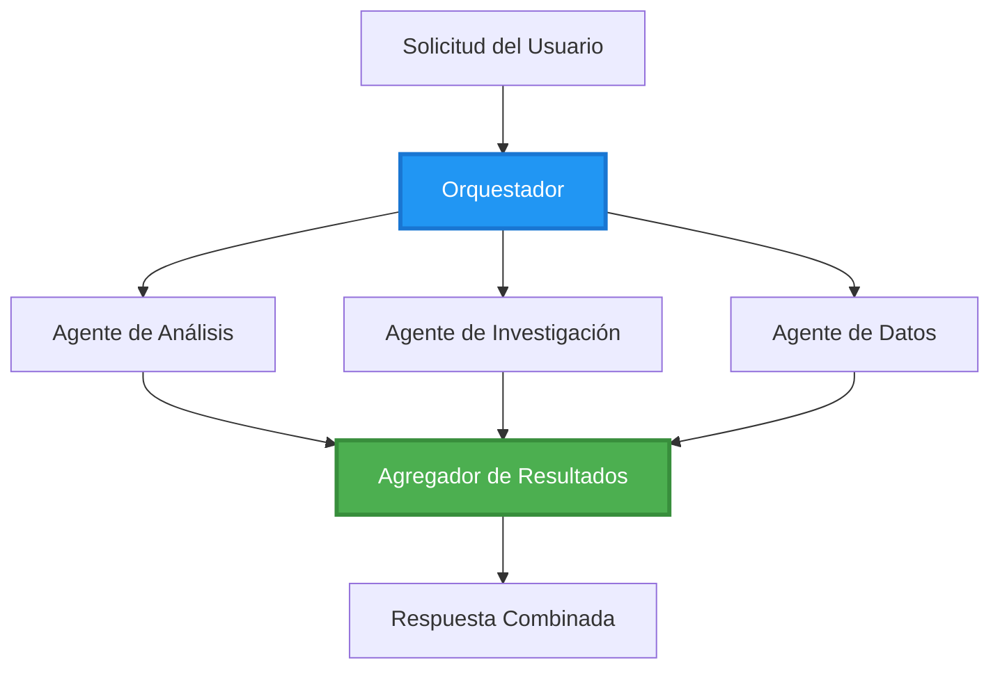
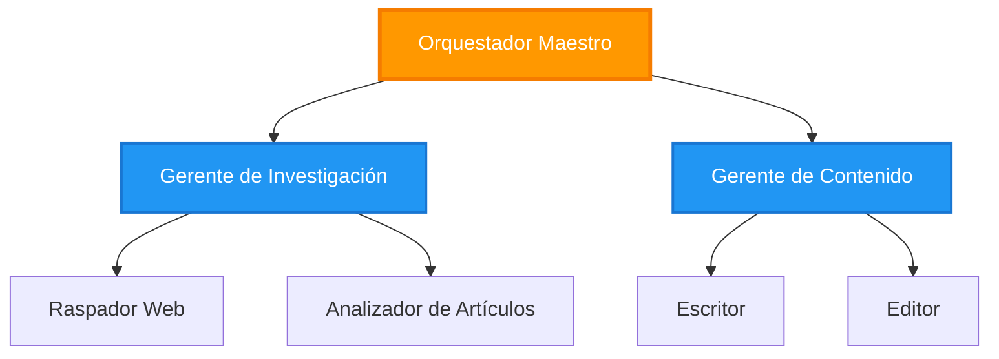
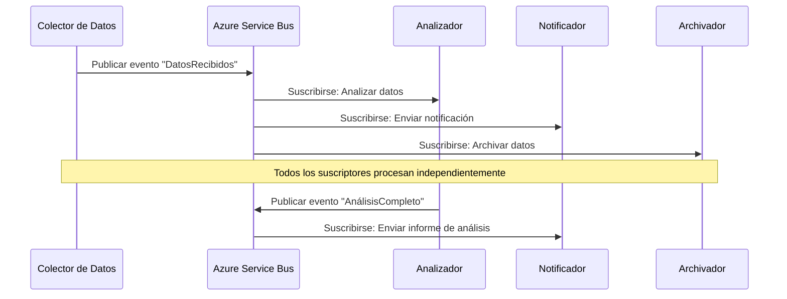
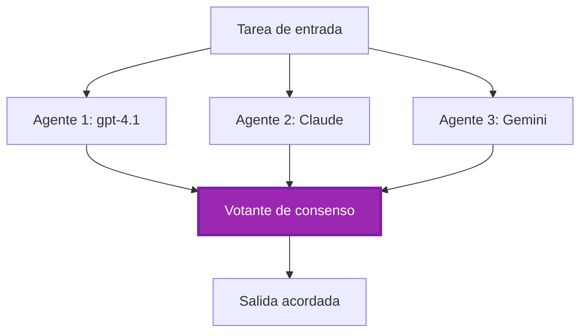
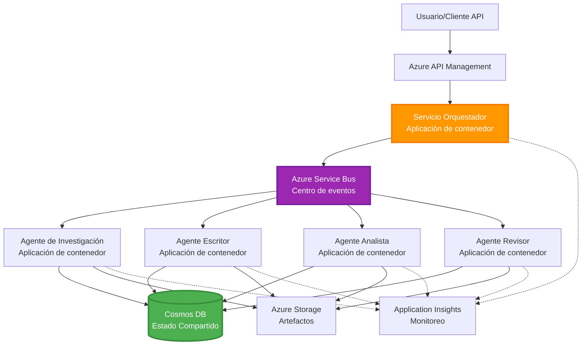

# Patrones de Coordinación Multi-Agente

⏱️ **Tiempo Estimado**: 60-75 minutos | 💰 **Costo Estimado**: ~$100-300/mes | ⭐ **Complejidad**: Avanzado

**📚 Ruta de Aprendizaje:**
- ← Anterior: [Planificación de Capacidad](capacity-planning.md) - Estrategias de dimensionamiento y escalado de recursos
- 🎯 **Aquí Estás**: Patrones de Coordinación Multi-Agente (Orquestación, comunicación, gestión de estado)
- → Siguiente: [Selección de SKU](sku-selection.md) - Cómo elegir los servicios adecuados de Azure
- 🏠 [Inicio del Curso](../../README.md)

---

## Lo que Aprenderás

Al completar esta lección, podrás:
- Entender patrones de **arquitectura multi-agente** y cuándo usarlos
- Implementar **patrones de orquestación** (centralizados, descentralizados, jerárquicos)
- Diseñar estrategias de **comunicación entre agentes** (síncrona, asíncrona, orientada a eventos)
- Gestionar **estado compartido** entre agentes distribuidos
- Desplegar **sistemas multi-agente** en Azure con AZD
- Aplicar **patrones de coordinación** en escenarios reales de IA
- Monitorear y depurar sistemas de agentes distribuidos

## Por qué Importa la Coordinación Multi-Agente

### La Evolución: De Agente Único a Multi-Agente

**Agente Único (Simple):**
```
User → Agent → Response
```
- ✅ Fácil de entender e implementar
- ✅ Rápido para tareas simples
- ❌ Limitado por las capacidades de un solo modelo
- ❌ No permite paralelizar tareas complejas
- ❌ Sin especialización

**Sistema Multi-Agente (Avanzado):**
```mermaid
graph TD
    Orchestrator[Orquestador] --> Agent1[Agente1<br/>Planificar]
    Orchestrator --> Agent2[Agente2<br/>Código]
    Orchestrator --> Agent3[Agente3<br/>Revisar]
```- ✅ Agentes especializados para tareas específicas
- ✅ Ejecución paralela para mayor velocidad
- ✅ Modular y mantenible
- ✅ Mejor manejo de flujos de trabajo complejos
- ⚠️ Requiere lógica de coordinación

**Analogía**: Un agente único es como una persona que hace todas las tareas. Multi-agente es como un equipo donde cada miembro tiene habilidades especializadas (investigador, programador, revisor, escritor) trabajando en conjunto.

---

## Patrones Clave de Coordinación

### Patrón 1: Coordinación Secuencial (Cadena de Responsabilidad)

**Cuándo usarlo**: Las tareas deben completarse en un orden específico, cada agente usa la salida del anterior.

```mermaid
sequenceDiagram
    participant User
    participant Orchestrator
    participant Agent1 as Agente de Investigación
    participant Agent2 as Agente de Redacción
    participant Agent3 as Agente de Edición
    
    User->>Orchestrator: "Escribir artículo sobre IA"
    Orchestrator->>Agent1: Investigar tema
    Agent1-->>Orchestrator: Resultados de la investigación
    Orchestrator->>Agent2: Escribir borrador (usando la investigación)
    Agent2-->>Orchestrator: Borrador del artículo
    Orchestrator->>Agent3: Editar y mejorar
    Agent3-->>Orchestrator: Artículo final
    Orchestrator-->>User: Artículo pulido
    
    Note over User,Agent3: Secuencial: Cada paso espera al anterior
```
**Beneficios:**
- ✅ Flujo de datos claro
- ✅ Fácil de depurar
- ✅ Orden de ejecución predecible

**Limitaciones:**
- ❌ Más lento (sin paralelismo)
- ❌ Una falla bloquea toda la cadena
- ❌ No maneja tareas interdependientes

**Casos de Uso Ejemplares:**
- Pipeline de creación de contenido (investigar → escribir → editar → publicar)
- Generación de código (planificar → implementar → probar → desplegar)
- Generación de informes (recolección de datos → análisis → visualización → resumen)

---

### Patrón 2: Coordinación Paralela (Fan-Out/Fan-In)

**Cuándo usarlo**: Tareas independientes pueden ejecutarse simultáneamente, resultados combinados al final.


```mermaid
graph TB
    User[Solicitud del Usuario]
    Orchestrator[Orquestador]
    Agent1[Agente de Análisis]
    Agent2[Agente de Investigación]
    Agent3[Agente de Datos]
    Aggregator[Agregador de Resultados]
    Response[Respuesta Combinada]
    
    User --> Orchestrator
    Orchestrator --> Agent1
    Orchestrator --> Agent2
    Orchestrator --> Agent3
    Agent1 --> Aggregator
    Agent2 --> Aggregator
    Agent3 --> Aggregator
    Aggregator --> Response
    
    style Orchestrator fill:#2196F3,stroke:#1976D2,stroke-width:3px,color:#fff
    style Aggregator fill:#4CAF50,stroke:#388E3C,stroke-width:3px,color:#fff
```
**Beneficios:**
- ✅ Rápido (ejecución paralela)
- ✅ Tolerante a fallos (resultados parciales aceptables)
- ✅ Escala horizontalmente

**Limitaciones:**
- ⚠️ Los resultados pueden llegar fuera de orden
- ⚠️ Se necesita lógica de agregación
- ⚠️ Gestión compleja del estado

**Casos de Uso Ejemplares:**
- Recolección de datos de múltiples fuentes (APIs + bases de datos + scraping web)
- Análisis competitivo (múltiples modelos generan soluciones, se selecciona la mejor)
- Servicios de traducción (traducción a varios idiomas simultáneamente)

---

### Patrón 3: Coordinación Jerárquica (Gerente-Trabajador)

**Cuándo usarlo**: Flujos de trabajo complejos con sub-tareas, se requiere delegación.


```mermaid
graph TB
    Master[Orquestador Maestro]
    Manager1[Gerente de Investigación]
    Manager2[Gerente de Contenido]
    W1[Raspador Web]
    W2[Analizador de Artículos]
    W3[Escritor]
    W4[Editor]
    
    Master --> Manager1
    Master --> Manager2
    Manager1 --> W1
    Manager1 --> W2
    Manager2 --> W3
    Manager2 --> W4
    
    style Master fill:#FF9800,stroke:#F57C00,stroke-width:3px,color:#fff
    style Manager1 fill:#2196F3,stroke:#1976D2,stroke-width:2px,color:#fff
    style Manager2 fill:#2196F3,stroke:#1976D2,stroke-width:2px,color:#fff
```
**Beneficios:**
- ✅ Maneja flujos de trabajo complejos
- ✅ Modular y mantenible
- ✅ Límites claros de responsabilidad

**Limitaciones:**
- ⚠️ Arquitectura más compleja
- ⚠️ Mayor latencia (múltiples capas de coordinación)
- ⚠️ Requiere orquestación sofisticada

**Casos de Uso Ejemplares:**
- Procesamiento documental empresarial (clasificar → enrutar → procesar → archivar)
- Pipelines de datos de múltiples etapas (ingestión → limpieza → transformación → análisis → reporte)
- Flujos de trabajo de automatización compleja (planificación → asignación de recursos → ejecución → monitoreo)

---

### Patrón 4: Coordinación Orientada a Eventos (Publicar-Suscribirse)

**Cuándo usarlo**: Los agentes deben reaccionar a eventos, se desea bajo acoplamiento.


```mermaid
sequenceDiagram
    participant Agent1 as Colector de Datos
    participant EventBus as Azure Service Bus
    participant Agent2 as Analizador
    participant Agent3 as Notificador
    participant Agent4 as Archivador
    
    Agent1->>EventBus: Publicar evento "DatosRecibidos"
    EventBus->>Agent2: Suscribirse: Analizar datos
    EventBus->>Agent3: Suscribirse: Enviar notificación
    EventBus->>Agent4: Suscribirse: Archivar datos
    
    Note over Agent1,Agent4: Todos los suscriptores procesan independientemente
    
    Agent2->>EventBus: Publicar evento "AnálisisCompleto"
    EventBus->>Agent3: Suscribirse: Enviar informe de análisis
```
**Beneficios:**
- ✅ Bajo acoplamiento entre agentes
- ✅ Fácil añadir nuevos agentes (solo suscribirse)
- ✅ Procesamiento asíncrono
- ✅ Resiliente (persistencia de mensajes)

**Limitaciones:**
- ⚠️ Consistencia eventual
- ⚠️ Depuración compleja
- ⚠️ Desafíos en el orden de mensajes

**Casos de Uso Ejemplares:**
- Sistemas de monitoreo en tiempo real (alertas, paneles, logs)
- Notificaciones multicanal (email, SMS, push, Slack)
- Pipelines de procesamiento de datos (múltiples consumidores de los mismos datos)

---

### Patrón 5: Coordinación Basada en Consenso (Votación/Quórum)

**Cuándo usarlo**: Se necesita acuerdo de múltiples agentes antes de avanzar.


```mermaid
graph TB
    Input[Tarea de entrada]
    Agent1[Agente 1: gpt-4.1]
    Agent2[Agente 2: Claude]
    Agent3[Agente 3: Gemini]
    Voter[Votante de consenso]
    Output[Salida acordada]
    
    Input --> Agent1
    Input --> Agent2
    Input --> Agent3
    Agent1 --> Voter
    Agent2 --> Voter
    Agent3 --> Voter
    Voter --> Output
    
    style Voter fill:#9C27B0,stroke:#7B1FA2,stroke-width:3px,color:#fff
```
**Beneficios:**
- ✅ Mayor precisión (varias opiniones)
- ✅ Tolerante a fallos (fallos minoritarios aceptables)
- ✅ Control de calidad incorporado

**Limitaciones:**
- ❌ Costoso (múltiples llamadas a modelos)
- ❌ Más lento (espera a todos los agentes)
- ⚠️ Se requiere resolución de conflictos

**Casos de Uso Ejemplares:**
- Moderación de contenido (varios modelos revisan contenido)
- Revisión de código (múltiples linters/analizadores)
- Diagnóstico médico (múltiples modelos de IA y validación experta)

---

## Visión General de la Arquitectura

### Sistema Multi-Agente Completo en Azure


```mermaid
graph TB
    User[Usuario/Cliente API]
    APIM[Azure API Management]
    Orchestrator[Servicio Orquestador<br/>Aplicación de contenedor]
    ServiceBus[Azure Service Bus<br/>Centro de eventos]
    
    Agent1[Agente de Investigación<br/>Aplicación de contenedor]
    Agent2[Agente Escritor<br/>Aplicación de contenedor]
    Agent3[Agente Analista<br/>Aplicación de contenedor]
    Agent4[Agente Revisor<br/>Aplicación de contenedor]
    
    CosmosDB[(Cosmos DB<br/>Estado Compartido)]
    Storage[Azure Storage<br/>Artefactos]
    AppInsights[Application Insights<br/>Monitoreo]
    
    User --> APIM
    APIM --> Orchestrator
    
    Orchestrator --> ServiceBus
    ServiceBus --> Agent1
    ServiceBus --> Agent2
    ServiceBus --> Agent3
    ServiceBus --> Agent4
    
    Agent1 --> CosmosDB
    Agent2 --> CosmosDB
    Agent3 --> CosmosDB
    Agent4 --> CosmosDB
    
    Agent1 --> Storage
    Agent2 --> Storage
    Agent3 --> Storage
    Agent4 --> Storage
    
    Orchestrator -.-> AppInsights
    Agent1 -.-> AppInsights
    Agent2 -.-> AppInsights
    Agent3 -.-> AppInsights
    Agent4 -.-> AppInsights
    
    style Orchestrator fill:#FF9800,stroke:#F57C00,stroke-width:3px,color:#fff
    style ServiceBus fill:#9C27B0,stroke:#7B1FA2,stroke-width:3px,color:#fff
    style CosmosDB fill:#4CAF50,stroke:#388E3C,stroke-width:3px,color:#fff
```
**Componentes Clave:**

| Componente | Propósito | Servicio Azure |
|------------|-----------|----------------|
| **API Gateway** | Punto de entrada, limitación de tasa, autenticación | API Management |
| **Orquestador** | Coordina flujos de trabajo de agentes | Container Apps |
| **Cola de Mensajes** | Comunicación asíncrona | Service Bus / Event Hubs |
| **Agentes** | Trabajadores especializados de IA | Container Apps / Functions |
| **Almacenamiento de Estado** | Estado compartido, seguimiento de tareas | Cosmos DB |
| **Almacenamiento de Artefactos** | Documentos, resultados, logs | Blob Storage |
| **Monitoreo** | Trazabilidad distribuida, logs | Application Insights |

---

## Prerrequisitos

### Herramientas Requeridas

```bash
# Verificar Azure Developer CLI
azd version
# ✅ Esperado: azd versión 1.0.0 o superior

# Verificar Azure CLI
az --version
# ✅ Esperado: azure-cli 2.50.0 o superior

# Verificar Docker (para pruebas locales)
docker --version
# ✅ Esperado: version de Docker 20.10 o superior
```

### Requisitos de Azure

- Suscripción activa de Azure
- Permisos para crear:
  - Container Apps
  - Espacios de nombres de Service Bus
  - Cuentas de Cosmos DB
  - Cuentas de almacenamiento
  - Application Insights

### Conocimientos Previos

Debes haber completado:
- [Gestión de Configuración](../chapter-03-configuration/configuration.md)
- [Autenticación y Seguridad](../chapter-03-configuration/authsecurity.md)
- [Ejemplo de Microservicios](../../../../examples/microservices)

---

## Guía de Implementación

### Estructura del Proyecto

```
multi-agent-system/
├── azure.yaml                    # AZD configuration
├── infra/
│   ├── main.bicep               # Main infrastructure
│   ├── core/
│   │   ├── servicebus.bicep     # Message queue
│   │   ├── cosmos.bicep         # State store
│   │   ├── storage.bicep        # Artifact storage
│   │   └── monitoring.bicep     # Application Insights
│   └── app/
│       ├── orchestrator.bicep   # Orchestrator service
│       └── agent.bicep          # Agent template
└── src/
    ├── orchestrator/            # Orchestration logic
    │   ├── app.py
    │   ├── workflows.py
    │   └── Dockerfile
    ├── agents/
    │   ├── research/            # Research agent
    │   ├── writer/              # Writer agent
    │   ├── analyst/             # Analyst agent
    │   └── reviewer/            # Reviewer agent
    └── shared/
        ├── state_manager.py     # Shared state logic
        └── message_handler.py   # Message handling
```

---

## Lección 1: Patrón de Coordinación Secuencial

### Implementación: Pipeline de Creación de Contenido

Construyamos un pipeline secuencial: Investigar → Escribir → Editar → Publicar

### 1. Configuración AZD

**Archivo: `azure.yaml`**

```yaml
name: content-pipeline
metadata:
  template: multi-agent-sequential@1.0.0

services:
  orchestrator:
    project: ./src/orchestrator
    language: python
    host: containerapp
  
  research-agent:
    project: ./src/agents/research
    language: python
    host: containerapp
  
  writer-agent:
    project: ./src/agents/writer
    language: python
    host: containerapp
  
  editor-agent:
    project: ./src/agents/editor
    language: python
    host: containerapp
```

### 2. Infraestructura: Service Bus para Coordinación

**Archivo: `infra/core/servicebus.bicep`**

```bicep
param name string
param location string
param tags object = {}

resource serviceBusNamespace 'Microsoft.ServiceBus/namespaces@2022-10-01-preview' = {
  name: name
  location: location
  tags: tags
  sku: {
    name: 'Standard'
    tier: 'Standard'
  }
  properties: {
    minimumTlsVersion: '1.2'
  }
}

// Queue for orchestrator → research agent
resource researchQueue 'Microsoft.ServiceBus/namespaces/queues@2022-10-01-preview' = {
  parent: serviceBusNamespace
  name: 'research-tasks'
  properties: {
    maxDeliveryCount: 3
    lockDuration: 'PT5M'
    deadLetteringOnMessageExpiration: true
  }
}

// Queue for research agent → writer agent
resource writerQueue 'Microsoft.ServiceBus/namespaces/queues@2022-10-01-preview' = {
  parent: serviceBusNamespace
  name: 'writer-tasks'
  properties: {
    maxDeliveryCount: 3
    lockDuration: 'PT5M'
  }
}

// Queue for writer agent → editor agent
resource editorQueue 'Microsoft.ServiceBus/namespaces/queues@2022-10-01-preview' = {
  parent: serviceBusNamespace
  name: 'editor-tasks'
  properties: {
    maxDeliveryCount: 3
    lockDuration: 'PT5M'
  }
}

output namespace string = serviceBusNamespace.name
output connectionString string = listKeys('${serviceBusNamespace.id}/AuthorizationRules/RootManageSharedAccessKey', serviceBusNamespace.apiVersion).primaryConnectionString
```

### 3. Gestor de Estado Compartido

**Archivo: `src/shared/state_manager.py`**

```python
from azure.cosmos import CosmosClient, PartitionKey
from datetime import datetime
import os

class StateManager:
    """Manages shared state across agents using Cosmos DB"""
    
    def __init__(self):
        endpoint = os.environ['COSMOS_ENDPOINT']
        key = os.environ['COSMOS_KEY']
        
        self.client = CosmosClient(endpoint, key)
        self.database = self.client.get_database_client('agent-state')
        self.container = self.database.get_container_client('tasks')
    
    def create_task(self, task_id: str, task_type: str, input_data: dict):
        """Create a new task"""
        task = {
            'id': task_id,
            'type': task_type,
            'status': 'pending',
            'input': input_data,
            'created_at': datetime.utcnow().isoformat(),
            'steps': []
        }
        self.container.create_item(task)
        return task
    
    def update_task_step(self, task_id: str, step_name: str, result: dict):
        """Update task with completed step"""
        task = self.container.read_item(task_id, partition_key=task_id)
        
        task['steps'].append({
            'name': step_name,
            'completed_at': datetime.utcnow().isoformat(),
            'result': result
        })
        
        self.container.replace_item(task_id, task)
        return task
    
    def complete_task(self, task_id: str, final_result: dict):
        """Mark task as complete"""
        task = self.container.read_item(task_id, partition_key=task_id)
        task['status'] = 'completed'
        task['result'] = final_result
        task['completed_at'] = datetime.utcnow().isoformat()
        self.container.replace_item(task_id, task)
        return task
    
    def get_task(self, task_id: str):
        """Retrieve task state"""
        return self.container.read_item(task_id, partition_key=task_id)
```

### 4. Servicio Orquestador

**Archivo: `src/orchestrator/app.py`**

```python
from flask import Flask, request, jsonify
from azure.servicebus import ServiceBusClient, ServiceBusMessage
import json
import uuid
import os
from shared.state_manager import StateManager

app = Flask(__name__)
state_manager = StateManager()

# Conexión de Service Bus
servicebus_connection_str = os.environ['SERVICEBUS_CONNECTION_STRING']
servicebus_client = ServiceBusClient.from_connection_string(servicebus_connection_str)

@app.route('/health', methods=['GET'])
def health():
    return jsonify({'status': 'healthy', 'service': 'orchestrator'})

@app.route('/create-content', methods=['POST'])
def create_content():
    """
    Sequential workflow: Research → Write → Edit → Publish
    """
    data = request.json
    topic = data.get('topic')
    
    if not topic:
        return jsonify({'error': 'Topic required'}), 400
    
    # Crear tarea en el almacén de estado
    task_id = str(uuid.uuid4())
    task = state_manager.create_task(
        task_id=task_id,
        task_type='content_creation',
        input_data={'topic': topic}
    )
    
    # Enviar mensaje al agente de investigación (primer paso)
    sender = servicebus_client.get_queue_sender('research-tasks')
    message = ServiceBusMessage(
        body=json.dumps({
            'task_id': task_id,
            'topic': topic,
            'next_queue': 'writer-tasks'  # Dónde enviar los resultados
        }),
        content_type='application/json'
    )
    
    with sender:
        sender.send_messages(message)
    
    return jsonify({
        'task_id': task_id,
        'status': 'started',
        'workflow': 'sequential',
        'steps': ['research', 'write', 'edit', 'publish'],
        'message': 'Content creation pipeline initiated'
    }), 202

@app.route('/task/<task_id>', methods=['GET'])
def get_task_status(task_id):
    """Check task status"""
    try:
        task = state_manager.get_task(task_id)
        return jsonify(task)
    except Exception as e:
        return jsonify({'error': str(e)}), 404

if __name__ == '__main__':
    app.run(host='0.0.0.0', port=8080)
```

### 5. Agente Investigador

**Archivo: `src/agents/research/app.py`**

```python
from azure.servicebus import ServiceBusClient, ServiceBusMessage
from openai import AzureOpenAI
import json
import os
import time
from shared.state_manager import StateManager

# Inicializar clientes
state_manager = StateManager()
servicebus_client = ServiceBusClient.from_connection_string(
    os.environ['SERVICEBUS_CONNECTION_STRING']
)

openai_client = AzureOpenAI(
    api_key=os.environ['AZURE_OPENAI_API_KEY'],
    api_version="2024-02-01",
    azure_endpoint=os.environ['AZURE_OPENAI_ENDPOINT']
)

def process_research_task(message_data):
    """Process research request and pass to writer"""
    task_id = message_data['task_id']
    topic = message_data['topic']
    next_queue = message_data['next_queue']
    
    print(f"🔬 Researching: {topic}")
    
    # Llamar a Microsoft Foundry Models para investigación
    response = openai_client.chat.completions.create(
        model="gpt-4.1",
        messages=[
            {"role": "system", "content": "You are a research assistant. Provide comprehensive research on the given topic."},
            {"role": "user", "content": f"Research this topic thoroughly: {topic}"}
        ],
        max_tokens=1500
    )
    
    research_results = response.choices[0].message.content
    
    # Actualizar estado
    state_manager.update_task_step(
        task_id=task_id,
        step_name='research',
        result={'research': research_results}
    )
    
    # Enviar al siguiente agente (escritor)
    sender = servicebus_client.get_queue_sender(next_queue)
    message = ServiceBusMessage(
        body=json.dumps({
            'task_id': task_id,
            'topic': topic,
            'research': research_results,
            'next_queue': 'editor-tasks'
        }),
        content_type='application/json'
    )
    
    with sender:
        sender.send_messages(message)
    
    print(f"✅ Research complete for task {task_id}")

def main():
    """Listen to research queue"""
    receiver = servicebus_client.get_queue_receiver('research-tasks')
    
    print("🔬 Research Agent started, listening for tasks...")
    
    with receiver:
        while True:
            messages = receiver.receive_messages(max_wait_time=5)
            for message in messages:
                try:
                    message_data = json.loads(str(message))
                    process_research_task(message_data)
                    receiver.complete_message(message)
                except Exception as e:
                    print(f"❌ Error processing message: {e}")
                    receiver.abandon_message(message)

if __name__ == '__main__':
    main()
```

### 6. Agente Escritor

**Archivo: `src/agents/writer/app.py`**

```python
from azure.servicebus import ServiceBusClient, ServiceBusMessage
from openai import AzureOpenAI
import json
import os
from shared.state_manager import StateManager

state_manager = StateManager()
servicebus_client = ServiceBusClient.from_connection_string(
    os.environ['SERVICEBUS_CONNECTION_STRING']
)

openai_client = AzureOpenAI(
    api_key=os.environ['AZURE_OPENAI_API_KEY'],
    api_version="2024-02-01",
    azure_endpoint=os.environ['AZURE_OPENAI_ENDPOINT']
)

def process_writing_task(message_data):
    """Write article based on research"""
    task_id = message_data['task_id']
    topic = message_data['topic']
    research = message_data['research']
    next_queue = message_data['next_queue']
    
    print(f"✍️ Writing article: {topic}")
    
    # Llamar a los Modelos Microsoft Foundry para escribir el artículo
    response = openai_client.chat.completions.create(
        model="gpt-4.1",
        messages=[
            {"role": "system", "content": "You are a professional writer. Write engaging, well-structured articles."},
            {"role": "user", "content": f"Based on this research:\n\n{research}\n\nWrite a comprehensive article about: {topic}"}
        ],
        max_tokens=2000
    )
    
    article_draft = response.choices[0].message.content
    
    # Actualizar estado
    state_manager.update_task_step(
        task_id=task_id,
        step_name='writing',
        result={'draft': article_draft}
    )
    
    # Enviar al editor
    sender = servicebus_client.get_queue_sender(next_queue)
    message = ServiceBusMessage(
        body=json.dumps({
            'task_id': task_id,
            'topic': topic,
            'draft': article_draft
        }),
        content_type='application/json'
    )
    
    with sender:
        sender.send_messages(message)
    
    print(f"✅ Article draft complete for task {task_id}")

def main():
    """Listen to writer queue"""
    receiver = servicebus_client.get_queue_receiver('writer-tasks')
    
    print("✍️ Writer Agent started, listening for tasks...")
    
    with receiver:
        while True:
            messages = receiver.receive_messages(max_wait_time=5)
            for message in messages:
                try:
                    message_data = json.loads(str(message))
                    process_writing_task(message_data)
                    receiver.complete_message(message)
                except Exception as e:
                    print(f"❌ Error: {e}")
                    receiver.abandon_message(message)

if __name__ == '__main__':
    main()
```

### 7. Agente Editor

**Archivo: `src/agents/editor/app.py`**

```python
from azure.servicebus import ServiceBusClient
from openai import AzureOpenAI
import json
import os
from shared.state_manager import StateManager

state_manager = StateManager()
servicebus_client = ServiceBusClient.from_connection_string(
    os.environ['SERVICEBUS_CONNECTION_STRING']
)

openai_client = AzureOpenAI(
    api_key=os.environ['AZURE_OPENAI_API_KEY'],
    api_version="2024-02-01",
    azure_endpoint=os.environ['AZURE_OPENAI_ENDPOINT']
)

def process_editing_task(message_data):
    """Edit and finalize article"""
    task_id = message_data['task_id']
    topic = message_data['topic']
    draft = message_data['draft']
    
    print(f"📝 Editing article: {topic}")
    
    # Llamar a Microsoft Foundry Models para editar
    response = openai_client.chat.completions.create(
        model="gpt-4.1",
        messages=[
            {"role": "system", "content": "You are an expert editor. Improve grammar, clarity, and structure."},
            {"role": "user", "content": f"Edit and improve this article:\n\n{draft}"}
        ],
        max_tokens=2000
    )
    
    final_article = response.choices[0].message.content
    
    # Marcar la tarea como completa
    state_manager.complete_task(
        task_id=task_id,
        final_result={
            'topic': topic,
            'final_article': final_article,
            'word_count': len(final_article.split())
        }
    )
    
    print(f"✅ Article finalized for task {task_id}")

def main():
    """Listen to editor queue"""
    receiver = servicebus_client.get_queue_receiver('editor-tasks')
    
    print("📝 Editor Agent started, listening for tasks...")
    
    with receiver:
        while True:
            messages = receiver.receive_messages(max_wait_time=5)
            for message in messages:
                try:
                    message_data = json.loads(str(message))
                    process_editing_task(message_data)
                    receiver.complete_message(message)
                except Exception as e:
                    print(f"❌ Error: {e}")
                    receiver.abandon_message(message)

if __name__ == '__main__':
    main()
```

### 8. Desplegar y Probar

```bash
# Opción A: Implementación basada en plantillas
azd init
azd up

# Opción B: Implementación del manifiesto del agente (requiere extensión)
azd extension install azure.ai.agents
azd ai agent init -m agent-manifest.yaml
azd up
```

> Ver [Comandos del CLI de AZD AI](../chapter-08-production/production-ai-practices.md#azd-ai-cli-commands-and-extensions) para todas las banderas y opciones de `azd ai`.

```bash
# Obtener URL del orquestador
ORCHESTRATOR_URL=$(azd env get-values | grep ORCHESTRATOR_URL | cut -d '=' -f2 | tr -d '"')

# Crear contenido
curl -X POST $ORCHESTRATOR_URL/create-content \
  -H "Content-Type: application/json" \
  -d '{"topic": "The Future of AI in Healthcare"}'
```

**✅ Resultado esperado:**
```json
{
  "task_id": "a1b2c3d4-e5f6-7890-abcd-ef1234567890",
  "status": "started",
  "workflow": "sequential",
  "steps": ["research", "write", "edit", "publish"],
  "message": "Content creation pipeline initiated"
}
```

**Verificar progreso de la tarea:**
```bash
TASK_ID="a1b2c3d4-e5f6-7890-abcd-ef1234567890"
curl $ORCHESTRATOR_URL/task/$TASK_ID
```

**✅ Resultado esperado (completado):**
```json
{
  "id": "a1b2c3d4-e5f6-7890-abcd-ef1234567890",
  "type": "content_creation",
  "status": "completed",
  "steps": [
    {
      "name": "research",
      "completed_at": "2025-11-19T10:30:00Z",
      "result": {"research": "..."}
    },
    {
      "name": "writing",
      "completed_at": "2025-11-19T10:32:00Z",
      "result": {"draft": "..."}
    }
  ],
  "result": {
    "topic": "The Future of AI in Healthcare",
    "final_article": "...",
    "word_count": 1500
  }
}
```

---

## Lección 2: Patrón de Coordinación Paralela

### Implementación: Agregador de Investigación Multi-Fuente

Construyamos un sistema paralelo que recolecta información de múltiples fuentes simultáneamente.

### Orquestador Paralelo

**Archivo: `src/orchestrator/parallel_workflow.py`**

```python
from flask import Flask, request, jsonify
from azure.servicebus import ServiceBusClient, ServiceBusMessage
import json
import uuid
import os
from shared.state_manager import StateManager

app = Flask(__name__)
state_manager = StateManager()

servicebus_client = ServiceBusClient.from_connection_string(
    os.environ['SERVICEBUS_CONNECTION_STRING']
)

@app.route('/research-parallel', methods=['POST'])
def research_parallel():
    """
    Parallel workflow: Multiple agents work simultaneously
    """
    data = request.json
    query = data.get('query')
    
    task_id = str(uuid.uuid4())
    task = state_manager.create_task(
        task_id=task_id,
        task_type='parallel_research',
        input_data={
            'query': query,
            'agents': ['web', 'academic', 'news', 'social']
        }
    )
    
    # Difusión: Enviar a todos los agentes simultáneamente
    agents = [
        ('web-research-queue', 'web'),
        ('academic-research-queue', 'academic'),
        ('news-research-queue', 'news'),
        ('social-research-queue', 'social')
    ]
    
    for queue_name, agent_type in agents:
        sender = servicebus_client.get_queue_sender(queue_name)
        message = ServiceBusMessage(
            body=json.dumps({
                'task_id': task_id,
                'query': query,
                'agent_type': agent_type,
                'result_queue': 'aggregation-queue'
            }),
            content_type='application/json'
        )
        
        with sender:
            sender.send_messages(message)
    
    return jsonify({
        'task_id': task_id,
        'status': 'started',
        'workflow': 'parallel',
        'agents_dispatched': 4,
        'message': 'Parallel research initiated'
    }), 202

if __name__ == '__main__':
    app.run(host='0.0.0.0', port=8080)
```

### Lógica de Agregación

**Archivo: `src/agents/aggregator/app.py`**

```python
from azure.servicebus import ServiceBusClient
import json
import os
from collections import defaultdict
from shared.state_manager import StateManager

state_manager = StateManager()
servicebus_client = ServiceBusClient.from_connection_string(
    os.environ['SERVICEBUS_CONNECTION_STRING']
)

# Rastrear resultados por tarea
task_results = defaultdict(list)
expected_agents = 4  # web, académico, noticias, social

def process_result(message_data):
    """Aggregate results from parallel agents"""
    task_id = message_data['task_id']
    agent_type = message_data['agent_type']
    result = message_data['result']
    
    # Almacenar resultado
    task_results[task_id].append({
        'agent': agent_type,
        'data': result
    })
    
    print(f"📊 Received result from {agent_type} agent ({len(task_results[task_id])}/{expected_agents})")
    
    # Verificar si todos los agentes terminaron (fan-in)
    if len(task_results[task_id]) == expected_agents:
        print(f"✅ All agents completed for task {task_id}. Aggregating...")
        
        # Combinar resultados
        aggregated = {
            'query': message_data['query'],
            'sources': task_results[task_id],
            'summary': generate_summary(task_results[task_id])
        }
        
        # Marcar como completado
        state_manager.complete_task(task_id, aggregated)
        
        # Limpiar
        del task_results[task_id]
        
        print(f"✅ Aggregation complete for task {task_id}")

def generate_summary(results):
    """Generate summary from all sources"""
    summaries = [r['data'].get('summary', '') for r in results]
    return '\n\n'.join(summaries)

def main():
    """Listen to aggregation queue"""
    receiver = servicebus_client.get_queue_receiver('aggregation-queue')
    
    print("📊 Aggregator started, listening for results...")
    
    with receiver:
        while True:
            messages = receiver.receive_messages(max_wait_time=5)
            for message in messages:
                try:
                    message_data = json.loads(str(message))
                    process_result(message_data)
                    receiver.complete_message(message)
                except Exception as e:
                    print(f"❌ Error: {e}")
                    receiver.abandon_message(message)

if __name__ == '__main__':
    main()
```

**Beneficios del Patrón Paralelo:**
- ⚡ **4x más rápido** (los agentes corren simultáneamente)
- 🔄 **Tolerante a fallos** (resultados parciales aceptables)
- 📈 **Escalable** (agrega agentes fácilmente)

---

## Ejercicios Prácticos

### Ejercicio 1: Añadir Manejo de Tiempo de Espera ⭐⭐ (Medio)

**Objetivo**: Implementar lógica de timeout para que el agregador no espere indefinidamente por agentes lentos.

**Pasos**:

1. **Añadir seguimiento de timeout al agregador:**

```python
from datetime import datetime, timedelta

task_timeouts = {}  # task_id -> tiempo_de_expiración

def process_result(message_data):
    task_id = message_data['task_id']
    
    # Establecer tiempo de espera en el primer resultado
    if task_id not in task_timeouts:
        task_timeouts[task_id] = datetime.utcnow() + timedelta(seconds=30)
    
    task_results[task_id].append({
        'agent': message_data['agent_type'],
        'data': message_data['result']
    })
    
    # Verificar si está completo O si ha expirado
    if len(task_results[task_id]) == expected_agents or \
       datetime.utcnow() > task_timeouts[task_id]:
        
        print(f"📊 Aggregating with {len(task_results[task_id])}/{expected_agents} results")
        
        aggregated = {
            'query': message_data['query'],
            'sources': task_results[task_id],
            'completed_agents': len(task_results[task_id]),
            'timed_out': len(task_results[task_id]) < expected_agents
        }
        
        state_manager.complete_task(task_id, aggregated)
        
        # Limpieza
        del task_results[task_id]
        del task_timeouts[task_id]
```

2. **Probar con retrasos artificiales:**

```python
# En un agente, añade un retraso para simular un procesamiento lento
import time
time.sleep(35)  # Excede el tiempo límite de 30 segundos
```

3. **Desplegar y verificar:**

```bash
azd deploy aggregator

# Enviar tarea
curl -X POST $ORCHESTRATOR_URL/research-parallel \
  -H "Content-Type: application/json" \
  -d '{"query": "AI safety research"}'

# Revisar resultados después de 30 segundos
curl $ORCHESTRATOR_URL/task/$TASK_ID
```

**✅ Criterios de Éxito:**
- ✅ La tarea finaliza tras 30 segundos aunque agentes estén incompletos
- ✅ La respuesta indica resultados parciales (`"timed_out": true`)
- ✅ Se devuelven los resultados disponibles (3 de 4 agentes)

**Tiempo**: 20-25 minutos

---

### Ejercicio 2: Implementar Lógica de Reintento ⭐⭐⭐ (Avanzado)

**Objetivo**: Reintentar tareas fallidas de agentes automáticamente antes de abandonar.

**Pasos**:

1. **Añadir seguimiento de reintentos al orquestador:**

```python
from dataclasses import dataclass
from typing import Dict

@dataclass
class RetryConfig:
    max_retries: int = 3
    backoff_seconds: int = 5

retry_counts: Dict[str, int] = {}  # message_id -> conteo_de_reintentos

def send_with_retry(queue_name: str, message_data: dict, retry_config: RetryConfig):
    """Send message with retry metadata"""
    message_id = message_data.get('message_id', str(uuid.uuid4()))
    message_data['message_id'] = message_id
    message_data['retry_count'] = retry_counts.get(message_id, 0)
    message_data['max_retries'] = retry_config.max_retries
    
    sender = servicebus_client.get_queue_sender(queue_name)
    message = ServiceBusMessage(
        body=json.dumps(message_data),
        content_type='application/json',
        message_id=message_id
    )
    
    with sender:
        sender.send_messages(message)
```

2. **Añadir manejador de reintentos a los agentes:**

```python
def process_with_retry(message, receiver, process_func):
    """Process message with automatic retry on failure"""
    try:
        message_data = json.loads(str(message))
        
        # Procesar el mensaje
        process_func(message_data)
        
        # Éxito - completado
        receiver.complete_message(message)
        
    except Exception as e:
        message_id = message.message_id
        retry_count = message_data.get('retry_count', 0)
        max_retries = message_data.get('max_retries', 3)
        
        if retry_count < max_retries:
            # Reintentar: abandonar y volver a poner en cola con el conteo incrementado
            print(f"⚠️ Retry {retry_count + 1}/{max_retries} for message {message_id}")
            
            message_data['retry_count'] = retry_count + 1
            
            # Enviar de vuelta a la misma cola con retraso
            time.sleep(5 * (retry_count + 1))  # Retraso exponencial
            send_with_retry(queue_name, message_data, RetryConfig())
            
            receiver.complete_message(message)  # Eliminar el original
        else:
            # Máximo de reintentos excedido - mover a la cola de mensajes muertos
            print(f"❌ Max retries exceeded for message {message_id}")
            receiver.dead_letter_message(
                message,
                reason="MaxRetriesExceeded",
                error_description=str(e)
            )
```

3. **Monitorear la cola de mensajes no procesados:**

```python
def monitor_dead_letters():
    """Check dead letter queue for failed messages"""
    receiver = servicebus_client.get_queue_receiver(
        'research-queue',
        sub_queue='deadletter'
    )
    
    with receiver:
        messages = receiver.receive_messages(max_wait_time=5)
        for message in messages:
            print(f"☠️ Dead letter: {message.message_id}")
            print(f"Reason: {message.dead_letter_reason}")
            print(f"Description: {message.dead_letter_error_description}")
```

**✅ Criterios de Éxito:**
- ✅ Tareas fallidas se reintentan automáticamente (hasta 3 veces)
- ✅ Reintentos con retroceso exponencial (5s, 10s, 15s)
- ✅ Tras máximo de reintentos, mensajes van a cola de mensajes no procesados
- ✅ La cola puede ser monitoreada y reproducida

**Tiempo**: 30-40 minutos

---

### Ejercicio 3: Implementar Circuit Breaker ⭐⭐⭐ (Avanzado)

**Objetivo**: Prevenir fallos en cascada deteniendo solicitudes a agentes en fallo.

**Pasos**:

1. **Crear clase circuit breaker:**

```python
from enum import Enum
from datetime import datetime, timedelta

class CircuitState(Enum):
    CLOSED = "closed"      # Operación normal
    OPEN = "open"          # Fallando, rechazar solicitudes
    HALF_OPEN = "half_open"  # Probando si se recuperó

class CircuitBreaker:
    def __init__(self, failure_threshold=5, timeout_seconds=60):
        self.failure_threshold = failure_threshold
        self.timeout_seconds = timeout_seconds
        self.failure_count = 0
        self.last_failure_time = None
        self.state = CircuitState.CLOSED
    
    def call(self, func):
        """Execute function with circuit breaker protection"""
        if self.state == CircuitState.OPEN:
            # Verificar si expiró el tiempo de espera
            if datetime.utcnow() - self.last_failure_time > timedelta(seconds=self.timeout_seconds):
                self.state = CircuitState.HALF_OPEN
                print("🔄 Circuit breaker: HALF_OPEN (testing)")
            else:
                raise Exception(f"Circuit breaker OPEN for agent. Try again in {self.timeout_seconds}s")
        
        try:
            result = func()
            
            # Éxito
            if self.state == CircuitState.HALF_OPEN:
                self.state = CircuitState.CLOSED
                self.failure_count = 0
                print("✅ Circuit breaker: CLOSED (recovered)")
            
            return result
            
        except Exception as e:
            self.failure_count += 1
            self.last_failure_time = datetime.utcnow()
            
            if self.failure_count >= self.failure_threshold:
                self.state = CircuitState.OPEN
                print(f"🔴 Circuit breaker: OPEN (too many failures)")
            
            raise e
```

2. **Aplicar a llamadas de agente:**

```python
# En el orquestador
agent_circuits = {
    'web': CircuitBreaker(failure_threshold=5, timeout_seconds=60),
    'academic': CircuitBreaker(failure_threshold=5, timeout_seconds=60),
    'news': CircuitBreaker(failure_threshold=5, timeout_seconds=60),
    'social': CircuitBreaker(failure_threshold=5, timeout_seconds=60)
}

def send_to_agent(agent_type, message_data):
    """Send with circuit breaker protection"""
    circuit = agent_circuits[agent_type]
    
    try:
        circuit.call(lambda: send_message(agent_type, message_data))
    except Exception as e:
        print(f"⚠️ Skipping {agent_type} agent: {e}")
        # Continuar con otros agentes
```

3. **Probar circuit breaker:**

```bash
# Simular fallos repetidos (detener un agente)
az containerapp stop --name web-research-agent --resource-group rg-agents

# Enviar múltiples solicitudes
for i in {1..10}; do
  curl -X POST $ORCHESTRATOR_URL/research-parallel \
    -H "Content-Type: application/json" \
    -d '{"query": "test query '$i'"}'
  sleep 2
done

# Revisar los registros - debería ver el circuito abierto después de 5 fallos
# Usar Azure CLI para registros de Container App:
az containerapp logs show --name orchestrator --resource-group $RG_NAME --tail 50
```

**✅ Criterios de Éxito:**
- ✅ Tras 5 fallos, el circuito se abre (rechaza solicitudes)
- ✅ Tras 60 segundos, el circuito pasa a medio abierto (prueba recuperación)
- ✅ Otros agentes continúan funcionando normalmente
- ✅ El circuito se cierra automáticamente al recuperarse el agente

**Tiempo**: 40-50 minutos

---

## Monitoreo y Depuración

### Trazabilidad Distribuida con Application Insights

**Archivo: `src/shared/tracing.py`**

```python
from opencensus.ext.azure.log_exporter import AzureLogHandler
from opencensus.ext.azure.trace_exporter import AzureExporter
from opencensus.trace import config_integration
from opencensus.trace.tracer import Tracer
from opencensus.trace.samplers import AlwaysOnSampler
import logging
import os

# Configurar rastreo
config_integration.trace_integrations(['requests', 'logging'])

connection_string = os.environ.get('APPLICATIONINSIGHTS_CONNECTION_STRING')

# Crear rastreador
tracer = Tracer(
    exporter=AzureExporter(connection_string=connection_string),
    sampler=AlwaysOnSampler()
)

# Configurar registro
logger = logging.getLogger(__name__)
logger.addHandler(AzureLogHandler(connection_string=connection_string))
logger.setLevel(logging.INFO)

def trace_agent_call(agent_name, task_id, operation):
    """Trace agent operations"""
    with tracer.span(name=f'{agent_name}.{operation}') as span:
        span.add_attribute('agent', agent_name)
        span.add_attribute('task_id', task_id)
        span.add_attribute('operation', operation)
        
        try:
            result = operation()
            span.add_attribute('status', 'success')
            return result
        except Exception as e:
            span.add_attribute('status', 'error')
            span.add_attribute('error', str(e))
            raise
```

### Consultas de Application Insights

**Seguimiento de flujos multi-agente:**

```kusto
// Trace complete workflow for a task
traces
| where customDimensions.task_id == "a1b2c3d4-..."
| project timestamp, message, customDimensions.agent, customDimensions.operation
| order by timestamp asc
```

**Comparación de desempeño de agentes:**

```kusto
// Compare agent execution times
dependencies
| where name contains "agent"
| summarize 
    avg_duration = avg(duration),
    p95_duration = percentile(duration, 95),
    count = count()
  by agent = tostring(customDimensions.agent)
| order by avg_duration desc
```

**Análisis de fallos:**

```kusto
// Find which agents fail most
exceptions
| where customDimensions.agent != ""
| summarize 
    failure_count = count(),
    unique_errors = dcount(outerMessage)
  by agent = tostring(customDimensions.agent)
| order by failure_count desc
```

---

## Análisis de Costos

### Costos del Sistema Multi-Agente (Estimaciones Mensuales)

| Componente | Configuración | Costo |
|------------|--------------|-------|
| **Orquestador** | 1 Container App (1 vCPU, 2GB) | $30-50 |
| **4 Agentes** | 4 Container Apps (0.5 vCPU, 1GB cada uno) | $60-120 |
| **Service Bus** | Nivel estándar, 10M mensajes | $10-20 |
| **Cosmos DB** | Serverless, 5GB almacenamiento, 1M RUs | $25-50 |
| **Blob Storage** | 10GB almacenamiento, 100K operaciones | $5-10 |
| **Application Insights** | 5GB ingestión | $10-15 |
| **Modelos Microsoft Foundry** | gpt-4.1, 10M tokens | $100-300 |
| **Total** | | **$240-565/mes** |

### Estrategias de Optimización de Costos

1. **Usar serverless donde sea posible:**
   ```bicep
   // Cosmos DB serverless (no minimum cost)
   properties: {
     databaseAccountOfferType: 'Standard'
     capabilities: [{ name: 'EnableServerless' }]
   }
   ```

2. **Escalar agentes a cero cuando estén inactivos:**
   ```bicep
   scale: {
     minReplicas: 0  // Scale to zero when no messages
     maxReplicas: 10
   }
   ```

3. **Usar batching en Service Bus:**
   ```python
   # Enviar mensajes en lotes (más barato)
   sender.send_messages([message1, message2, message3])
   ```

4. **Cachear resultados frecuentemente usados:**
   ```python
   # Usar Azure Cache para Redis
   if cache.exists(query_hash):
       return cache.get(query_hash)
   ```

---

## Mejores Prácticas

### ✅ HACER:

1. **Usar operaciones idempotentes**
   ```python
   # El agente puede procesar el mismo mensaje de forma segura varias veces
   def process_task(task_id):
       if state_manager.task_exists(task_id):
           print(f"Task {task_id} already processed, skipping")
           return
       # Procesar tarea...
   ```

2. **Implementar logging exhaustivo**
   ```python
   logger.info(f"Agent: {agent_name}, Task: {task_id}, Action: {action}")
   ```

3. **Usar IDs de correlación**
   ```python
   # Pasar task_id a través de todo el flujo de trabajo
   message_data = {
       'task_id': task_id,  # ID de correlación
       'timestamp': datetime.utcnow().isoformat()
   }
   ```

4. **Establecer TTL (tiempo de vida) para mensajes**
   ```bicep
   properties: {
     defaultMessageTimeToLive: 'PT1H'  // 1 hour max
   }
   ```

5. **Monitorear colas de mensajes no procesados**
   ```python
   # Monitoreo regular de mensajes fallidos
   monitor_dead_letters()
   ```

### ❌ NO HACER:

1. **No crear dependencias circulares**
   ```python
   # ❌ MALO: Agente A → Agente B → Agente A (bucle infinito)
   # ✅ BUENO: Definir un grafo acíclico dirigido claro (DAG)
   ```

2. **No bloquear hilos de agente**
   ```python
   # ❌ MAL: Espera sincrónica
   while not task_complete:
       time.sleep(1)
   
   # ✅ BIEN: Usar callbacks de cola de mensajes
   ```

3. **No ignorar fallos parciales**
   ```python
   # ❌ MAL: Fallar todo el flujo de trabajo si un agente falla
   # ✅ BIEN: Devolver resultados parciales con indicadores de error
   ```

4. **No uses reintentos infinitos**
   ```python
   # ❌ MAL: reintentar para siempre
   # ✅ BIEN: max_retries = 3, luego carta muerta
   ```

---

## Guía de Solución de Problemas

### Problema: Mensajes atascados en la cola

**Síntomas:**
- Los mensajes se acumulan en la cola
- Los agentes no procesan
- El estado de la tarea se queda en "pendiente"

**Diagnóstico:**
```bash
# Comprobar la profundidad de la cola
az servicebus queue show \
  --namespace-name mybus \
  --name research-tasks \
  --query "countDetails"

# Revisar los registros del agente usando Azure CLI
az containerapp logs show --name research-agent --resource-group $RG_NAME --tail 50
```

**Soluciones:**

1. **Incrementar réplicas de agentes:**
   ```bash
   az containerapp update \
     --name research-agent \
     --min-replicas 3 \
     --max-replicas 10
   ```

2. **Revisar la cola de mensajes muertos (dead letter queue):**
   ```bash
   az servicebus queue show \
     --namespace-name mybus \
     --name research-tasks \
     --query "countDetails.deadLetterMessageCount"
   ```

---

### Problema: Tiempo de espera de tarea/no se completa

**Síntomas:**
- El estado de la tarea permanece como "en_progreso"
- Algunos agentes completan, otros no
- Sin mensajes de error

**Diagnóstico:**
```bash
# Verificar estado de la tarea
curl $ORCHESTRATOR_URL/task/$TASK_ID

# Verificar Application Insights
# Ejecutar consulta: traces | where customDimensions.task_id == "..."
```

**Soluciones:**

1. **Implementar tiempo de espera en el agregador (Ejercicio 1)**

2. **Revisar fallos de agentes usando Azure Monitor:**
   ```bash
   # Ver registros mediante azd monitor
   azd monitor --logs
   
   # O use Azure CLI para verificar registros específicos de la aplicación de contenedor
   az containerapp logs show --name <agent-name> --resource-group $RG_NAME --follow | grep "ERROR\|FAIL"
   ```

3. **Verificar que todos los agentes estén en ejecución:**
   ```bash
   az containerapp list \
     --resource-group rg-agents \
     --query "[].{name:name, status:properties.runningStatus}"
   ```

---

## Aprende Más

### Documentación Oficial
- [Azure Service Bus](https://learn.microsoft.com/azure/service-bus-messaging/service-bus-messaging-overview)
- [Cosmos DB](https://learn.microsoft.com/azure/cosmos-db/introduction)
- [Container Apps DAPR](https://learn.microsoft.com/azure/container-apps/dapr-overview)
- [Patrones de Diseño Multi-Agente](https://learn.microsoft.com/azure/architecture/guide/ai/multi-agent-systems)

### Próximos Pasos en Este Curso
- ← Anterior: [Planificación de Capacidad](capacity-planning.md)
- → Siguiente: [Selección de SKU](sku-selection.md)
- 🏠 [Inicio del Curso](../../README.md)

### Ejemplos Relacionados
- [Ejemplo de Microservicios](../../../../examples/microservices) - Patrones de comunicación entre servicios
- [Ejemplo de Modelos Microsoft Foundry](../../../../examples/azure-openai-chat) - Integración de IA

---

## Resumen

**Has aprendido:**
- ✅ Cinco patrones de coordinación (secuencial, paralelo, jerárquico, orientado a eventos, consenso)
- ✅ Arquitectura multi-agente en Azure (Service Bus, Cosmos DB, Container Apps)
- ✅ Gestión de estado entre agentes distribuidos
- ✅ Manejo de tiempo de espera, reintentos y circuit breakers
- ✅ Monitoreo y depuración de sistemas distribuidos
- ✅ Estrategias de optimización de costos

**Puntos Clave:**
1. **Elige el patrón correcto** - Secuencial para flujos ordenados, paralelo para velocidad, orientado a eventos para flexibilidad
2. **Gestiona el estado cuidadosamente** - Usa Cosmos DB o similar para estado compartido
3. **Maneja fallos con gracia** - Tiempos de espera, reintentos, circuit breakers, colas de mensajes muertos
4. **Monitorea todo** - El rastreo distribuido es esencial para depurar
5. **Optimiza costos** - Escala a cero, usa serverless, implementa caché

**Siguientes Pasos:**
1. Completa los ejercicios prácticos
2. Construye un sistema multi-agente para tu caso de uso
3. Estudia [Selección de SKU](sku-selection.md) para optimizar rendimiento y costos

---

<!-- CO-OP TRANSLATOR DISCLAIMER START -->
**Aviso Legal**:
Este documento ha sido traducido utilizando el servicio de traducción automática [Co-op Translator](https://github.com/Azure/co-op-translator). Aunque nos esforzamos por la precisión, tenga en cuenta que las traducciones automáticas pueden contener errores o imprecisiones. El documento original en su idioma nativo debe considerarse la fuente autorizada. Para información crítica, se recomienda la traducción profesional realizada por humanos. No nos hacemos responsables de malentendidos o interpretaciones erróneas que surjan del uso de esta traducción.
<!-- CO-OP TRANSLATOR DISCLAIMER END -->