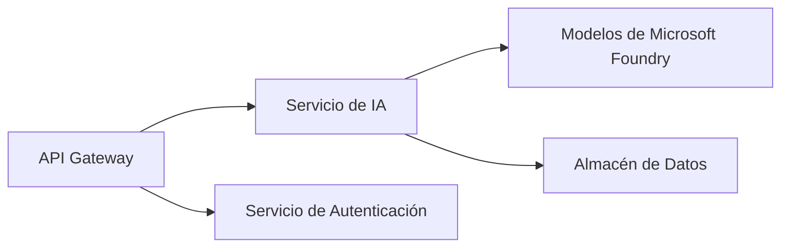
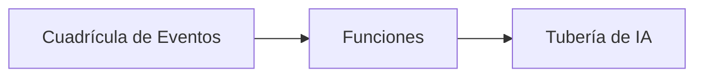

# Capítulo 8: Patrones de Producción y Empresariales

**📚 Curso**: [AZD Para Principiantes](../../README.md) | **⏱️ Duración**: 2-3 horas | **⭐ Complejidad**: Avanzado

---

## Resumen

Este capítulo cubre patrones de despliegue listos para empresas, endurecimiento de seguridad, monitoreo y optimización de costos para cargas de trabajo de IA en producción.

## Objetivos de Aprendizaje

Al completar este capítulo, usted:
- Desplegará aplicaciones resilientes multi-región
- Implementará patrones de seguridad empresariales
- Configurará monitoreo integral
- Optimizará costos a gran escala
- Configurará pipelines CI/CD con AZD

---

## 📚 Lecciones

| # | Lección | Descripción | Tiempo |
|---|--------|-------------|------|
| 1 | [Prácticas de IA en Producción](production-ai-practices.md) | Patrones de despliegue empresarial | 90 min |

---

## 🚀 Lista de Verificación para Producción

- [ ] Despliegue multi-región para resiliencia
- [ ] Identidad administrada para autenticación (sin claves)
- [ ] Application Insights para monitoreo
- [ ] Presupuestos y alertas de costos configurados
- [ ] Escaneo de seguridad habilitado
- [ ] Integración de pipeline CI/CD
- [ ] Plan de recuperación ante desastres

---

## 🏗️ Patrones de Arquitectura

### Patrón 1: Microservicios de IA


### Patrón 2: IA basada en eventos


---

## 🔐 Mejores Prácticas de Seguridad

```bicep
// Use managed identity
identity: {
  type: 'SystemAssigned'
}

// Private endpoints for AI services
properties: {
  publicNetworkAccess: 'Disabled'
  networkAcls: {
    defaultAction: 'Deny'
  }
}
```

---

## 💰 Optimización de Costos

| Estrategia | Ahorro |
|----------|---------|
| Escalado a cero (Container Apps) | 60-80% |
| Usar niveles de consumo para desarrollo | 50-70% |
| Escalado programado | 30-50% |
| Capacidad reservada | 20-40% |

```bash
# Configurar alertas de presupuesto
az consumption budget create \
  --budget-name "AI-Budget" \
  --amount 500 \
  --category Cost \
  --time-grain Monthly
```

---

## 📊 Configuración de Monitoreo

```bash
# Transmitir registros
azd monitor --logs

# Consultar Application Insights
azd monitor

# Ver métricas
az monitor metrics list --resource <resource-id>
```

---

## 🔗 Navegación

| Dirección | Capítulo |
|-----------|---------|
| **Anterior** | [Capítulo 7: Solución de Problemas](../chapter-07-troubleshooting/README.md) |
| **Curso Completo** | [Inicio del Curso](../../README.md) |

---

## 📖 Recursos Relacionados

- [Guía de Agentes de IA](../chapter-02-ai-development/agents.md)
- [Application Insights](../chapter-06-pre-deployment/application-insights.md)
- [Soluciones Multi-Agente](../chapter-05-multi-agent/README.md)
- [Ejemplo de Microservicios](../../examples/microservices/README.md)

---

<!-- CO-OP TRANSLATOR DISCLAIMER START -->
**Descargo de responsabilidad**:
Este documento ha sido traducido utilizando el servicio de traducción automática [Co-op Translator](https://github.com/Azure/co-op-translator). Aunque nos esforzamos por la exactitud, tenga en cuenta que las traducciones automatizadas pueden contener errores o inexactitudes. El documento original en su idioma nativo debe considerarse la fuente autorizada. Para información crítica, se recomienda una traducción profesional realizada por humanos. No nos hacemos responsables de ningún malentendido o interpretación errónea que surja del uso de esta traducción.
<!-- CO-OP TRANSLATOR DISCLAIMER END -->