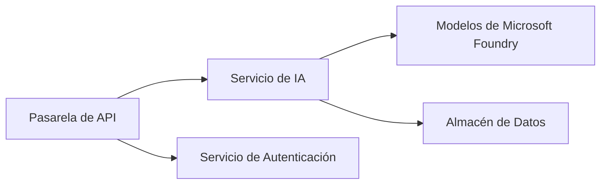
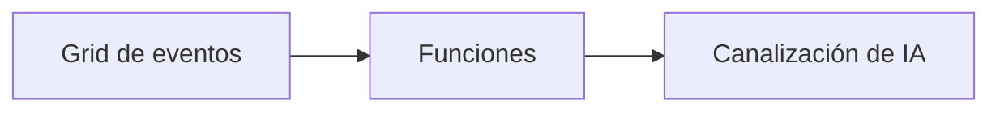

# Capítulo 8: Patrones de Producción y Empresariales

**📚 Curso**: [AZD For Beginners](../../README.md) | **⏱️ Duración**: 2-3 hours | **⭐ Complejidad**: Avanzado

---

## Resumen

Este capítulo cubre patrones de despliegue listos para empresa, endurecimiento de seguridad, monitoreo y optimización de costos para cargas de trabajo de IA en producción.

> Validado contra `azd 1.25.6` en junio de 2026.

## Objetivos de aprendizaje

Al completar este capítulo, podrás:
- Implementar aplicaciones resistentes en múltiples regiones
- Implementar patrones de seguridad empresariales
- Configurar monitoreo integral
- Optimizar costos a escala
- Configurar pipelines de CI/CD con AZD

---

## 📚 Lecciones

| # | Lección | Descripción | Tiempo |
|---|--------|-------------|------|
| 1 | [Prácticas de IA en Producción](production-ai-practices.md) | Patrones de despliegue empresariales | 90 min |

---

## 🚀 Lista de verificación de producción

- [ ] Despliegue multirregional para resiliencia
- [ ] Identidad administrada para autenticación (sin claves)
- [ ] Application Insights para monitoreo
- [ ] Presupuestos y alertas de costos configurados
- [ ] Escaneo de seguridad habilitado
- [ ] Integración de pipelines CI/CD
- [ ] Plan de recuperación ante desastres

---

## 🏗️ Patrones de arquitectura

### Patrón 1: IA de microservicios



### Patrón 2: IA orientada a eventos



---

## 🔐 Mejores prácticas de seguridad

```bicep
// Use managed identity
identity: {
  type: 'SystemAssigned'
}

// Private endpoints for AI services
properties: {
  publicNetworkAccess: 'Disabled'
  networkAcls: {
    defaultAction: 'Deny'
  }
}
```

---

## 💰 Optimización de costos

| Estrategia | Ahorros |
|----------|---------|
| Escalar a cero (Container Apps) | 60-80% |
| Usar niveles de consumo para desarrollo | 50-70% |
| Escalado programado | 30-50% |
| Capacidad reservada | 20-40% |

```bash
# Configurar alertas de presupuesto
az consumption budget create \
  --budget-name "AI-Budget" \
  --amount 500 \
  --category Cost \
  --time-grain Monthly
```

---

## 📊 Configuración de monitoreo

```bash
# Transmitir registros
azd monitor --logs

# Comprobar Application Insights
azd monitor --overview

# Ver métricas
az monitor metrics list --resource <resource-id>
```

---

## 🔗 Navegación

| Dirección | Capítulo |
|-----------|---------|
| **Anterior** | [Capítulo 7: Solución de problemas](../chapter-07-troubleshooting/README.md) |
| **Curso completo** | [Inicio del curso](../../README.md) |

---

## 📖 Recursos relacionados

- [Guía de agentes de IA](../chapter-02-ai-development/agents.md)
- [Application Insights](../chapter-06-pre-deployment/application-insights.md)
- [Soluciones multiagente](../chapter-05-multi-agent/README.md)
- [Ejemplo de microservicios](../../examples/microservices/README.md)

---

<!-- CO-OP TRANSLATOR DISCLAIMER START -->
**Descargo de responsabilidad**:
Este documento ha sido traducido utilizando el servicio de traducción automática [Co-op Translator](https://github.com/Azure/co-op-translator). Aunque nos esforzamos por la precisión, tenga en cuenta que las traducciones automatizadas pueden contener errores o inexactitudes. El documento original en su idioma nativo debe considerarse la fuente autorizada. Para información crítica, se recomienda una traducción profesional humana. No somos responsables de cualquier malentendido o interpretación errónea que surja del uso de esta traducción.
<!-- CO-OP TRANSLATOR DISCLAIMER END -->