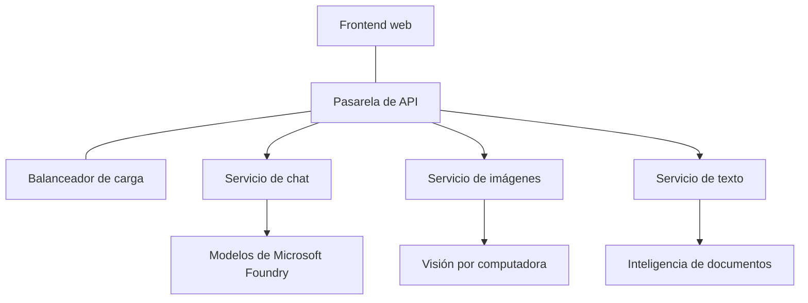

# Mejores prácticas para cargas de trabajo de IA en producción con AZD

**Navegación del capítulo:**
- **📚 Inicio del curso**: [AZD Para Principiantes](../../README.md)
- **📖 Capítulo actual**: Capítulo 8 - Patrones de producción y empresariales
- **⬅️ Capítulo anterior**: [Capítulo 7: Resolución de problemas](../chapter-07-troubleshooting/debugging.md)
- **⬅️ También relacionado**: [Laboratorio de IA](ai-workshop-lab.md)
- **🎯 Curso completo**: [AZD Para Principiantes](../../README.md)

## Descripción general

Esta guía proporciona mejores prácticas integrales para desplegar cargas de trabajo de IA listas para producción usando Azure Developer CLI (AZD). Basadas en la retroalimentación de la comunidad de Discord de Microsoft Foundry y despliegues de clientes en el mundo real, estas prácticas abordan los desafíos más comunes en sistemas de IA en producción.

## Principales desafíos abordados

Según los resultados de nuestra encuesta comunitaria, estos son los principales desafíos que enfrentan los desarrolladores:

- **45%** tienen problemas con implementaciones de IA con múltiples servicios
- **38%** tienen problemas con la gestión de credenciales y secretos  
- **35%** encuentran difícil la preparación para producción y el escalado
- **32%** necesitan mejores estrategias de optimización de costos
- **29%** requieren mejor monitoreo y resolución de problemas

## Patrones de arquitectura para IA en producción

### Patrón 1: Arquitectura de IA basada en microservicios

**Cuándo usarlo**: Aplicaciones de IA complejas con múltiples capacidades


**Implementación en AZD**:

```yaml
# azure.yaml
name: enterprise-ai-platform
services:
  web:
    project: ./web
    host: staticwebapp
  api-gateway:
    project: ./api-gateway
    host: containerapp
  chat-service:
    project: ./services/chat
    host: containerapp
  vision-service:
    project: ./services/vision
    host: containerapp
  text-service:
    project: ./services/text
    host: containerapp
```

### Patrón 2: Procesamiento de IA orientado a eventos

**Cuándo usarlo**: Procesamiento por lotes, análisis de documentos, flujos de trabajo asíncronos

```bicep
// Event Hub for AI processing pipeline
resource eventHub 'Microsoft.EventHub/namespaces@2023-01-01-preview' = {
  name: eventHubNamespaceName
  location: location
  sku: {
    name: 'Standard'
    tier: 'Standard'
    capacity: 1
  }
}

// Service Bus for reliable message processing
resource serviceBus 'Microsoft.ServiceBus/namespaces@2022-10-01-preview' = {
  name: serviceBusNamespaceName
  location: location
  sku: {
    name: 'Premium'
    tier: 'Premium'
    capacity: 1
  }
}

// Function App for processing
resource functionApp 'Microsoft.Web/sites@2023-01-01' = {
  name: functionAppName
  location: location
  kind: 'functionapp,linux'
  properties: {
    siteConfig: {
      appSettings: [
        {
          name: 'FUNCTIONS_EXTENSION_VERSION'
          value: '~4'
        }
        {
          name: 'AZURE_OPENAI_ENDPOINT'
          value: '@Microsoft.KeyVault(VaultName=${keyVault.name};SecretName=openai-endpoint)'
        }
      ]
    }
  }
}
```

## Pensando en la salud de los agentes de IA

Cuando una aplicación web tradicional se rompe, los síntomas son familiares: una página no carga, una API devuelve un error o un despliegue falla. Las aplicaciones impulsadas por IA pueden romperse de todas esas mismas maneras, pero también pueden comportarse mal de formas más sutiles que no producen mensajes de error obvios.

Esta sección te ayuda a construir un modelo mental para monitorear cargas de trabajo de IA para que sepas dónde buscar cuando las cosas no parecen estar bien.

### Cómo la salud del agente difiere de la salud de una aplicación tradicional

Una aplicación tradicional funciona o no funciona. Un agente de IA puede aparentar funcionar pero producir resultados pobres. Piensa en la salud del agente en dos capas:

| Capa | Qué vigilar | Dónde buscar |
|-------|--------------|---------------|
| **Salud de la infraestructura** | ¿Está corriendo el servicio? ¿Se han aprovisionado los recursos? ¿Son alcanzables los endpoints? | `azd monitor`, estado de recursos del Azure Portal, registros de contenedores/aplicaciones |
| **Salud del comportamiento** | ¿Responde el agente con precisión? ¿Son las respuestas oportunas? ¿Se está llamando correctamente al modelo? | trazas de Application Insights, métricas de latencia de llamadas al modelo, registros de calidad de respuesta |

La salud de la infraestructura es familiar: es la misma para cualquier app azd. La salud del comportamiento es la nueva capa que introducen las cargas de trabajo de IA.

### Dónde buscar cuando las aplicaciones de IA no se comportan como se espera

Si tu aplicación de IA no está produciendo los resultados que esperas, aquí tienes una lista de verificación conceptual:

1. **Empieza por lo básico.** ¿La aplicación está ejecutándose? ¿Puede alcanzar sus dependencias? Revisa `azd monitor` y el estado de los recursos tal como lo harías con cualquier aplicación.
2. **Revisa la conexión con el modelo.** ¿Tu aplicación está llamando correctamente al modelo de IA? Las llamadas al modelo que fallan o agotan el tiempo son la causa más común de problemas en aplicaciones de IA y aparecerán en los registros de tu aplicación.
3. **Observa qué recibió el modelo.** Las respuestas de IA dependen de la entrada (el prompt y cualquier contexto recuperado). Si la salida está mal, la entrada suele estar mal. Verifica si tu aplicación está enviando los datos correctos al modelo.
4. **Revisa la latencia de las respuestas.** Las llamadas a modelos de IA son más lentas que las llamadas API típicas. Si tu app se siente lenta, verifica si los tiempos de respuesta del modelo han aumentado: esto puede indicar limitación de tasa, límites de capacidad o congestión a nivel de región.
5. **Vigila las señales de costo.** Picos inesperados en el uso de tokens o en las llamadas API pueden indicar un bucle, un prompt mal configurado o reintentos excesivos.

No necesitas dominar las herramientas de observabilidad de inmediato. La idea clave es que las aplicaciones de IA tienen una capa adicional de comportamiento que monitorear, y el monitoreo integrado de azd (`azd monitor`) te brinda un punto de partida para investigar ambas capas.

---

## Mejores prácticas de seguridad

### 1. Modelo de seguridad Zero-Trust

**Estrategia de implementación**:
- No hay comunicación servicio-a-servicio sin autenticación
- Todas las llamadas API usan identidades administradas
- Aislamiento de red con endpoints privados
- Controles de acceso con privilegios mínimos

```bicep
// Managed Identity for each service
resource chatServiceIdentity 'Microsoft.ManagedIdentity/userAssignedIdentities@2023-01-31' = {
  name: 'chat-service-identity'
  location: location
}

// Role assignments with minimal permissions
resource openAIUserRole 'Microsoft.Authorization/roleAssignments@2022-04-01' = {
  scope: openAIAccount
  name: guid(openAIAccount.id, chatServiceIdentity.id, openAIUserRoleDefinitionId)
  properties: {
    roleDefinitionId: subscriptionResourceId('Microsoft.Authorization/roleDefinitions', '5e0bd9bd-7b93-4f28-af87-19fc36ad61bd')
    principalId: chatServiceIdentity.properties.principalId
    principalType: 'ServicePrincipal'
  }
}
```

### 2. Gestión segura de secretos

**Patrón de integración con Key Vault**:

```bicep
// Key Vault with proper access policies
resource keyVault 'Microsoft.KeyVault/vaults@2023-02-01' = {
  name: keyVaultName
  location: location
  properties: {
    tenantId: tenant().tenantId
    sku: {
      family: 'A'
      name: 'premium'  // Use premium for production
    }
    enableRbacAuthorization: true  // Use RBAC instead of access policies
    enablePurgeProtection: true    // Prevent accidental deletion
    enableSoftDelete: true
    softDeleteRetentionInDays: 90
  }
}

// Store all AI service credentials
resource openAIKeySecret 'Microsoft.KeyVault/vaults/secrets@2023-02-01' = {
  parent: keyVault
  name: 'openai-api-key'
  properties: {
    value: openAIAccount.listKeys().key1
    attributes: {
      enabled: true
    }
  }
}
```

### 3. Seguridad de red

**Configuración de endpoints privados**:

```bicep
// Virtual Network for AI services
resource virtualNetwork 'Microsoft.Network/virtualNetworks@2023-04-01' = {
  name: vnetName
  location: location
  properties: {
    addressSpace: {
      addressPrefixes: ['10.0.0.0/16']
    }
    subnets: [
      {
        name: 'ai-services-subnet'
        properties: {
          addressPrefix: '10.0.1.0/24'
          privateEndpointNetworkPolicies: 'Disabled'
        }
      }
      {
        name: 'app-services-subnet'
        properties: {
          addressPrefix: '10.0.2.0/24'
          delegations: [
            {
              name: 'Microsoft.Web/serverFarms'
              properties: {
                serviceName: 'Microsoft.Web/serverFarms'
              }
            }
          ]
        }
      }
    ]
  }
}

// Private endpoints for all AI services
resource openAIPrivateEndpoint 'Microsoft.Network/privateEndpoints@2023-04-01' = {
  name: '${openAIAccountName}-pe'
  location: location
  properties: {
    subnet: {
      id: virtualNetwork.properties.subnets[0].id
    }
    privateLinkServiceConnections: [
      {
        name: 'openai-connection'
        properties: {
          privateLinkServiceId: openAIAccount.id
          groupIds: ['account']
        }
      }
    ]
  }
}
```

## Rendimiento y escalado

### 1. Estrategias de autoescalado

**Autoescalado de Container Apps**:

```bicep
resource containerApp 'Microsoft.App/containerApps@2023-05-01' = {
  name: containerAppName
  location: location
  properties: {
    configuration: {
      ingress: {
        external: true
        targetPort: 8000
        transport: 'http'
      }
    }
    template: {
      scale: {
        minReplicas: 2  // Always have 2 instances minimum
        maxReplicas: 50 // Scale up to 50 for high load
        rules: [
          {
            name: 'http-scaling'
            http: {
              metadata: {
                concurrentRequests: '20'  // Scale when >20 concurrent requests
              }
            }
          }
          {
            name: 'cpu-scaling'
            custom: {
              type: 'cpu'
              metadata: {
                type: 'Utilization'
                value: '70'  // Scale when CPU >70%
              }
            }
          }
        ]
      }
    }
  }
}
```

### 2. Estrategias de caché

**Redis Cache para respuestas de IA**:

```bicep
// Redis Premium for production workloads
resource redisCache 'Microsoft.Cache/redis@2023-04-01' = {
  name: redisCacheName
  location: location
  properties: {
    sku: {
      name: 'Premium'
      family: 'P'
      capacity: 1
    }
    enableNonSslPort: false
    minimumTlsVersion: '1.2'
    redisConfiguration: {
      'maxmemory-policy': 'allkeys-lru'
    }
    // Enable clustering for high availability
    redisVersion: '6.0'
    shardCount: 2
  }
}

// Cache configuration in application
var cacheConnectionString = '${redisCache.properties.hostName}:6380,password=${redisCache.listKeys().primaryKey},ssl=True,abortConnect=False'
```

### 3. Balanceo de carga y gestión del tráfico

**Application Gateway con WAF**:

```bicep
// Application Gateway with Web Application Firewall
resource applicationGateway 'Microsoft.Network/applicationGateways@2023-04-01' = {
  name: appGatewayName
  location: location
  properties: {
    sku: {
      name: 'WAF_v2'
      tier: 'WAF_v2'
      capacity: 2
    }
    webApplicationFirewallConfiguration: {
      enabled: true
      firewallMode: 'Prevention'
      ruleSetType: 'OWASP'
      ruleSetVersion: '3.2'
    }
    // Backend pools for AI services
    backendAddressPools: [
      {
        name: 'ai-services-pool'
        properties: {
          backendAddresses: [
            {
              fqdn: '${containerApp.properties.configuration.ingress.fqdn}'
            }
          ]
        }
      }
    ]
  }
}
```

## 💰 Optimización de costos

### 1. Dimensionamiento adecuado de recursos

**Configuraciones específicas por entorno**:

```bash
# Entorno de desarrollo
azd env new development
azd env set AZURE_OPENAI_SKU "S0"
azd env set AZURE_OPENAI_CAPACITY 10
azd env set AZURE_SEARCH_SKU "basic"
azd env set CONTAINER_CPU 0.5
azd env set CONTAINER_MEMORY 1.0

# Entorno de producción
azd env new production
azd env set AZURE_OPENAI_SKU "S0"
azd env set AZURE_OPENAI_CAPACITY 100
azd env set AZURE_SEARCH_SKU "standard"
azd env set CONTAINER_CPU 2.0
azd env set CONTAINER_MEMORY 4.0
```

### 2. Monitoreo de costos y presupuestos

```bicep
// Cost management and budgets
resource budget 'Microsoft.Consumption/budgets@2023-05-01' = {
  name: 'ai-workload-budget'
  properties: {
    timePeriod: {
      startDate: '2024-01-01'
      endDate: '2024-12-31'
    }
    timeGrain: 'Monthly'
    amount: 2000  // $2000 monthly budget
    category: 'Cost'
    notifications: {
      warning: {
        enabled: true
        operator: 'GreaterThan'
        threshold: 80
        contactEmails: [
          'finance@company.com'
          'engineering@company.com'
        ]
        contactRoles: [
          'Owner'
          'Contributor'
        ]
      }
      critical: {
        enabled: true
        operator: 'GreaterThan'
        threshold: 95
        contactEmails: [
          'cto@company.com'
        ]
      }
    }
  }
}
```

### 3. Optimización del uso de tokens

**Gestión de costes de OpenAI**:

```typescript
// Optimización de tokens a nivel de la aplicación
class TokenOptimizer {
  private readonly maxTokens = 4000;
  private readonly reserveTokens = 500;
  
  optimizePrompt(userInput: string, context: string): string {
    const availableTokens = this.maxTokens - this.reserveTokens;
    const estimatedTokens = this.estimateTokens(userInput + context);
    
    if (estimatedTokens > availableTokens) {
      // Trunca el contexto, no la entrada del usuario
      context = this.truncateContext(context, availableTokens - this.estimateTokens(userInput));
    }
    
    return `${context}\n\nUser: ${userInput}`;
  }
  
  private estimateTokens(text: string): number {
    // Estimación aproximada: 1 token ≈ 4 caracteres
    return Math.ceil(text.length / 4);
  }
}
```

## Monitoreo y observabilidad

### 1. Application Insights integral

```bicep
// Application Insights with advanced features
resource applicationInsights 'Microsoft.Insights/components@2020-02-02' = {
  name: applicationInsightsName
  location: location
  kind: 'web'
  properties: {
    Application_Type: 'web'
    WorkspaceResourceId: logAnalyticsWorkspace.id
    SamplingPercentage: 100  // Full sampling for AI apps
    DisableIpMasking: false  // Enable for security
  }
}

// Custom metrics for AI operations
resource aiMetricAlerts 'Microsoft.Insights/metricAlerts@2018-03-01' = {
  name: 'ai-high-error-rate'
  location: 'global'
  properties: {
    description: 'Alert when AI service error rate is high'
    severity: 2
    enabled: true
    scopes: [
      applicationInsights.id
    ]
    evaluationFrequency: 'PT1M'
    windowSize: 'PT5M'
    criteria: {
      'odata.type': 'Microsoft.Azure.Monitor.SingleResourceMultipleMetricCriteria'
      allOf: [
        {
          name: 'high-error-rate'
          metricName: 'requests/failed'
          operator: 'GreaterThan'
          threshold: 10
          timeAggregation: 'Count'
        }
      ]
    }
  }
}
```

### 2. Monitoreo específico para IA

**Paneles personalizados para métricas de IA**:

```json
// Dashboard configuration for AI workloads
{
  "dashboard": {
    "name": "AI Application Monitoring",
    "tiles": [
      {
        "name": "OpenAI Request Volume",
        "query": "requests | where name contains 'openai' | summarize count() by bin(timestamp, 5m)"
      },
      {
        "name": "AI Response Latency",
        "query": "requests | where name contains 'openai' | summarize avg(duration) by bin(timestamp, 5m)"
      },
      {
        "name": "Token Usage",
        "query": "customMetrics | where name == 'openai_tokens_used' | summarize sum(value) by bin(timestamp, 1h)"
      },
      {
        "name": "Cost per Hour",
        "query": "customMetrics | where name == 'openai_cost' | summarize sum(value) by bin(timestamp, 1h)"
      }
    ]
  }
}
```

### 3. Comprobaciones de salud y monitoreo de disponibilidad

```bicep
// Application Insights availability tests
resource availabilityTest 'Microsoft.Insights/webtests@2022-06-15' = {
  name: 'ai-app-availability-test'
  location: location
  tags: {
    'hidden-link:${applicationInsights.id}': 'Resource'
  }
  properties: {
    SyntheticMonitorId: 'ai-app-availability-test'
    Name: 'AI Application Availability Test'
    Description: 'Tests AI application endpoints'
    Enabled: true
    Frequency: 300  // 5 minutes
    Timeout: 120    // 2 minutes
    Kind: 'ping'
    Locations: [
      {
        Id: 'us-east-2-azr'
      }
      {
        Id: 'us-west-2-azr'
      }
    ]
    Configuration: {
      WebTest: '''
        <WebTest Name="AI Health Check" 
                 Id="8d2de8d2-a2b0-4c2e-9a0d-8f9c9a0b8c8d" 
                 Enabled="True" 
                 CssProjectStructure="" 
                 CssIteration="" 
                 Timeout="120" 
                 WorkItemIds="" 
                 xmlns="http://microsoft.com/schemas/VisualStudio/TeamTest/2010" 
                 Description="" 
                 CredentialUserName="" 
                 CredentialPassword="" 
                 PreAuthenticate="True" 
                 Proxy="default" 
                 StopOnError="False" 
                 RecordedResultFile="" 
                 ResultsLocale="">
          <Items>
            <Request Method="GET" 
                     Guid="a5f10126-e4cd-570d-961c-cea43999a200" 
                     Version="1.1" 
                     Url="${webApp.properties.defaultHostName}/health" 
                     ThinkTime="0" 
                     Timeout="120" 
                     ParseDependentRequests="True" 
                     FollowRedirects="True" 
                     RecordResult="True" 
                     Cache="False" 
                     ResponseTimeGoal="0" 
                     Encoding="utf-8" 
                     ExpectedHttpStatusCode="200" 
                     ExpectedResponseUrl="" 
                     ReportingName="" 
                     IgnoreHttpStatusCode="False" />
          </Items>
        </WebTest>
      '''
    }
  }
}
```

## Recuperación ante desastres y alta disponibilidad

### 1. Despliegue multirregional

```yaml
# azure.yaml - Multi-region configuration
name: ai-app-multiregion
services:
  api-primary:
    project: ./api
    host: containerapp
    env:
      - AZURE_REGION=eastus
  api-secondary:
    project: ./api
    host: containerapp
    env:
      - AZURE_REGION=westus2
```

```bicep
// Traffic Manager for global load balancing
resource trafficManager 'Microsoft.Network/trafficManagerProfiles@2022-04-01' = {
  name: trafficManagerProfileName
  location: 'global'
  properties: {
    profileStatus: 'Enabled'
    trafficRoutingMethod: 'Priority'
    dnsConfig: {
      relativeName: trafficManagerProfileName
      ttl: 30
    }
    monitorConfig: {
      protocol: 'HTTPS'
      port: 443
      path: '/health'
      intervalInSeconds: 30
      toleratedNumberOfFailures: 3
      timeoutInSeconds: 10
    }
    endpoints: [
      {
        name: 'primary-endpoint'
        type: 'Microsoft.Network/trafficManagerProfiles/azureEndpoints'
        properties: {
          targetResourceId: primaryAppService.id
          endpointStatus: 'Enabled'
          priority: 1
        }
      }
      {
        name: 'secondary-endpoint'
        type: 'Microsoft.Network/trafficManagerProfiles/azureEndpoints'
        properties: {
          targetResourceId: secondaryAppService.id
          endpointStatus: 'Enabled'
          priority: 2
        }
      }
    ]
  }
}
```

### 2. Copia de seguridad y recuperación de datos

```bicep
// Backup configuration for critical data
resource backupVault 'Microsoft.DataProtection/backupVaults@2023-05-01' = {
  name: backupVaultName
  location: location
  identity: {
    type: 'SystemAssigned'
  }
  properties: {
    storageSettings: [
      {
        datastoreType: 'VaultStore'
        type: 'LocallyRedundant'
      }
    ]
  }
}

// Backup policy for AI models and data
resource backupPolicy 'Microsoft.DataProtection/backupVaults/backupPolicies@2023-05-01' = {
  parent: backupVault
  name: 'ai-data-backup-policy'
  properties: {
    policyRules: [
      {
        backupParameters: {
          backupType: 'Full'
          objectType: 'AzureBackupParams'
        }
        trigger: {
          schedule: {
            repeatingTimeIntervals: [
              'R/2024-01-01T02:00:00+00:00/P1D'  // Daily at 2 AM
            ]
          }
          objectType: 'ScheduleBasedTriggerContext'
        }
        dataStore: {
          datastoreType: 'VaultStore'
          objectType: 'DataStoreInfoBase'
        }
        name: 'BackupDaily'
        objectType: 'AzureBackupRule'
      }
    ]
  }
}
```

## DevOps e integración CI/CD

### 1. Flujo de trabajo de GitHub Actions

```yaml
# .github/workflows/deploy-ai-app.yml
name: Deploy AI Application

on:
  push:
    branches: [main]
  pull_request:
    branches: [main]

jobs:
  test:
    runs-on: ubuntu-latest
    steps:
      - uses: actions/checkout@v4
      
      - name: Setup Python
        uses: actions/setup-python@v4
        with:
          python-version: '3.11'
          
      - name: Install dependencies
        run: |
          pip install -r requirements.txt
          pip install pytest
          
      - name: Run tests
        run: pytest tests/
        
      - name: AI Safety Tests
        run: |
          python scripts/test_ai_safety.py
          python scripts/validate_prompts.py

  deploy-staging:
    needs: test
    if: github.event_name == 'pull_request'
    runs-on: ubuntu-latest
    steps:
      - uses: actions/checkout@v4
      
      - name: Setup AZD
        uses: Azure/setup-azd@v2
        
      - name: Login to Azure
        uses: azure/login@v1
        with:
          creds: ${{ secrets.AZURE_CREDENTIALS }}
          
      - name: Deploy to Staging
        run: |
          azd env select staging
          azd deploy

  deploy-production:
    needs: test
    if: github.ref == 'refs/heads/main'
    runs-on: ubuntu-latest
    steps:
      - uses: actions/checkout@v4
      
      - name: Setup AZD
        uses: Azure/setup-azd@v2
        
      - name: Login to Azure
        uses: azure/login@v1
        with:
          creds: ${{ secrets.AZURE_CREDENTIALS }}
          
      - name: Deploy to Production
        run: |
          azd env select production
          azd deploy
          
      - name: Run Production Health Checks
        run: |
          python scripts/health_check.py --env production
```

### 2. Validación de infraestructura

```bash
# scripts/validate_infrastructure.sh
#!/bin/bash

echo "Validating AI infrastructure deployment..."

# Comprobar si todos los servicios requeridos se están ejecutando
services=("openai" "search" "storage" "keyvault")
for service in "${services[@]}"; do
    echo "Checking $service..."
    if ! az resource list --resource-type "Microsoft.CognitiveServices/accounts" --query "[?contains(name, '$service')]" -o tsv; then
        echo "ERROR: $service not found"
        exit 1
    fi
done

# Validar los despliegues de modelos de OpenAI
echo "Validating OpenAI model deployments..."
models=$(az cognitiveservices account deployment list --name $AZURE_OPENAI_NAME --resource-group $AZURE_RESOURCE_GROUP --query "[].name" -o tsv)
if [[ ! $models == *"gpt-4.1-mini"* ]]; then
  echo "ERROR: Required model gpt-4.1-mini not deployed"
    exit 1
fi

# Probar la conectividad del servicio de IA
echo "Testing AI service connectivity..."
python scripts/test_connectivity.py

echo "Infrastructure validation completed successfully!"
```

## Lista de verificación de preparación para producción

### Seguridad ✅
- [ ] Todos los servicios usan identidades administradas
- [ ] Secretos almacenados en Key Vault
- [ ] Endpoints privados configurados
- [ ] Grupos de seguridad de red implementados
- [ ] RBAC con privilegios mínimos
- [ ] WAF habilitado en endpoints públicos

### Rendimiento ✅
- [ ] Autoescalado configurado
- [ ] Caché implementada
- [ ] Balanceo de carga configurado
- [ ] CDN para contenido estático
- [ ] Pooling de conexiones de base de datos
- [ ] Optimización del uso de tokens

### Monitoreo ✅
- [ ] Application Insights configurado
- [ ] Métricas personalizadas definidas
- [ ] Reglas de alertas configuradas
- [ ] Dashboard creado
- [ ] Comprobaciones de salud implementadas
- [ ] Políticas de retención de registros

### Fiabilidad ✅
- [ ] Despliegue multirregional
- [ ] Plan de copia de seguridad y recuperación
- [ ] Interruptores de circuito implementados
- [ ] Políticas de reintentos configuradas
- [ ] Degradación elegante
- [ ] Endpoints de comprobación de estado

### Gestión de costos ✅
- [ ] Alertas de presupuesto configuradas
- [ ] Dimensionamiento adecuado de recursos
- [ ] Descuentos para desarrollo/prueba aplicados
- [ ] Instancias reservadas adquiridas
- [ ] Dashboard de monitoreo de costos
- [ ] Revisiones regulares de costos

### Cumplimiento ✅
- [ ] Requisitos de residencia de datos cumplidos
- [ ] Registro de auditoría habilitado
- [ ] Políticas de cumplimiento aplicadas
- [ ] Líneas base de seguridad implementadas
- [ ] Evaluaciones de seguridad regulares
- [ ] Plan de respuesta a incidentes

## Referencias de rendimiento

### Métricas típicas de producción

| Métrica | Objetivo | Monitoreo |
|--------|--------|------------|
| **Tiempo de respuesta** | < 2 segundos | Application Insights |
| **Disponibilidad** | 99.9% | Monitoreo de disponibilidad |
| **Tasa de error** | < 0.1% | Registros de la aplicación |
| **Uso de tokens** | < $500/mes | Gestión de costos |
| **Usuarios concurrentes** | 1000+ | Pruebas de carga |
| **Tiempo de recuperación** | < 1 hora | Pruebas de recuperación ante desastres |

### Pruebas de carga

```bash
# Script de pruebas de carga para aplicaciones de IA
python scripts/load_test.py \
  --endpoint https://your-ai-app.azurewebsites.net \
  --concurrent-users 100 \
  --duration 300 \
  --ramp-up 60
```

## 🤝 Mejores prácticas de la comunidad

Basado en los comentarios de la comunidad de Microsoft Foundry en Discord:

### Principales recomendaciones de la comunidad:

1. **Comienza pequeño, escala gradualmente**: Empieza con SKUs básicos y escala según el uso real
2. **Monitorea todo**: Configura monitoreo completo desde el primer día
3. **Automatiza la seguridad**: Usa infraestructura como código para una seguridad consistente
4. **Prueba a fondo**: Incluye pruebas específicas de IA en tu pipeline
5. **Planifica los costos**: Monitorea el uso de tokens y configura alertas de presupuesto temprano

### Errores comunes a evitar:

- ❌ Incrustar claves API en el código
- ❌ No configurar un monitoreo apropiado
- ❌ Ignorar la optimización de costos
- ❌ No probar escenarios de fallo
- ❌ Desplegar sin comprobaciones de salud

## Comandos y extensiones CLI de AZD para IA

AZD incluye un conjunto creciente de comandos y extensiones específicos para IA que agilizan los flujos de trabajo de IA en producción. Estas herramientas cierran la brecha entre el desarrollo local y el despliegue en producción para cargas de trabajo de IA.

### Extensiones de AZD para IA

AZD utiliza un sistema de extensiones para agregar capacidades específicas de IA. Instala y administra extensiones con:

```bash
# Enumera todas las extensiones disponibles (incluyendo IA)
azd extension list

# Inspeccionar los detalles de la extensión instalada
azd extension show azure.ai.agents

# Instalar la extensión Foundry Agents
azd extension install azure.ai.agents

# Instalar la extensión de ajuste fino
azd extension install azure.ai.finetune

# Instalar la extensión de modelos personalizados
azd extension install azure.ai.models

# Actualizar todas las extensiones instaladas
azd extension upgrade --all
```

**Extensiones de IA disponibles:**

| Extensión | Propósito | Estado |
|-----------|---------|--------|
| `azure.ai.agents` | Gestión del servicio Foundry Agent | Preview |
| `azure.ai.finetune` | Ajuste fino de modelos de Foundry | Preview |
| `azure.ai.models` | Modelos personalizados de Foundry | Preview |
| `azure.coding-agent` | Configuración del agente de codificación | Available |

### Inicialización de proyectos de agente con `azd ai agent init`

El comando `azd ai agent init` genera la estructura de un proyecto de agente de IA listo para producción integrado con Microsoft Foundry Agent Service:

```bash
# Inicializar un nuevo proyecto de agente a partir de un manifiesto de agente
azd ai agent init -m <manifest-path-or-uri>

# Inicializar y apuntar a un proyecto Foundry específico
azd ai agent init -m agent-manifest.yaml --project-id <foundry-project-id>

# Inicializar con un directorio de origen personalizado
azd ai agent init -m agent-manifest.yaml --src ./agents/my-agent

# Apuntar a Container Apps como anfitrión
azd ai agent init -m agent-manifest.yaml --host containerapp
```

**Flags clave:**

| Bandera | Descripción |
|------|-------------|
| `-m, --manifest` | Ruta o URI a un manifiesto de agente para añadir a tu proyecto |
| `-p, --project-id` | ID de proyecto existente de Microsoft Foundry para tu entorno azd |
| `-s, --src` | Directorio para descargar la definición del agente (por defecto `src/<agent-id>`) |
| `--host` | Anular el host predeterminado (p. ej., `containerapp`) |
| `-e, --environment` | El entorno azd a utilizar |

**Consejo para producción**: Usa `--project-id` para conectarte directamente a un proyecto Foundry existente, manteniendo tu código de agente y los recursos en la nube vinculados desde el inicio.

### Protocolo de Contexto de Modelo (MCP) con `azd mcp`

AZD incluye soporte integrado de servidor MCP (Alpha), lo que permite que agentes y herramientas de IA interactúen con tus recursos de Azure a través de un protocolo estandarizado:

```bash
# Iniciar el servidor MCP para su proyecto
azd mcp start

# Revisar las reglas actuales de consentimiento de Copilot para la ejecución de herramientas
azd copilot consent list
```

El servidor MCP expone el contexto de tu proyecto azd—entornos, servicios y recursos de Azure—a las herramientas de desarrollo impulsadas por IA. Esto permite:

- **Despliegue asistido por IA**: Permite que agentes de codificación consulten el estado de tu proyecto y desencadenen despliegues
- **Descubrimiento de recursos**: Las herramientas de IA pueden descubrir qué recursos de Azure usa tu proyecto
- **Gestión de entornos**: Los agentes pueden cambiar entre entornos de desarrollo/preproducción/producción

### Generación de infraestructura con `azd infra generate`

Para cargas de trabajo de IA en producción, puedes generar y personalizar Infrastructure as Code en lugar de confiar en el aprovisionamiento automático:

```bash
# Generar archivos Bicep/Terraform a partir de la definición de tu proyecto
azd infra generate
```

Esto escribe IaC en disco para que puedas:
- Revisar y auditar la infraestructura antes de desplegar
- Agregar políticas de seguridad personalizadas (reglas de red, endpoints privados)
- Integrar con procesos de revisión de IaC existentes
- Controlar por versiones los cambios de infraestructura por separado del código de la aplicación

### Hooks del ciclo de vida de producción

Los hooks de AZD te permiten inyectar lógica personalizada en cada etapa del ciclo de vida del despliegue—crítico para flujos de trabajo de IA en producción:

```yaml
# azure.yaml - Production hooks example
name: ai-production-app
hooks:
  preprovision:
    shell: sh
    run: scripts/validate-quotas.sh    # Check AI model quota before provisioning
  postprovision:
    shell: sh
    run: scripts/configure-networking.sh  # Set up private endpoints
  predeploy:
    shell: sh
    run: scripts/run-ai-safety-tests.sh  # Run prompt safety checks
  postdeploy:
    shell: sh
    run: scripts/smoke-test.sh           # Verify agent responses post-deploy
services:
  agent-api:
    project: ./src/agent
    host: containerapp
    hooks:
      predeploy:
        shell: sh
        run: scripts/validate-model-access.sh  # Per-service hook
```

```bash
# Ejecutar un gancho específico manualmente durante el desarrollo
azd hooks run predeploy
```

**Hooks recomendados para producción en cargas de trabajo de IA:**

| Hook | Caso de uso |
|------|----------|
| `preprovision` | Validar cuotas de suscripción para la capacidad de modelos de IA |
| `postprovision` | Configurar endpoints privados, desplegar pesos de modelos |
| `predeploy` | Ejecutar pruebas de seguridad de IA, validar plantillas de prompt |
| `postdeploy` | Pruebas de humo de las respuestas del agente, verificar conectividad con el modelo |

### Configuración de pipeline CI/CD

Usa `azd pipeline config` para conectar tu proyecto a GitHub Actions o Azure Pipelines con autenticación segura de Azure:

```bash
# Configurar la canalización CI/CD (interactiva)
azd pipeline config

# Configurar con un proveedor específico
azd pipeline config --provider github
```

Este comando:
- Crea un principal de servicio con acceso de mínimo privilegio
- Configura credenciales federadas (sin secretos almacenados)
- Genera o actualiza tu archivo de definición de pipeline
- Establece las variables de entorno requeridas en tu sistema CI/CD

**Flujo de trabajo de producción con la configuración del pipeline:**

```bash
# 1. Configurar el entorno de producción
azd env new production
azd env set AZURE_OPENAI_CAPACITY 100

# 2. Configurar la canalización
azd pipeline config --provider github

# 3. La canalización ejecuta azd deploy en cada push a la rama main
```

### Añadir componentes con `azd add`

Agrega servicios de Azure de forma incremental a un proyecto existente:

```bash
# Agregar un nuevo componente de servicio de forma interactiva
azd add
```

Esto es particularmente útil para ampliar aplicaciones de IA en producción—por ejemplo, añadir un servicio de búsqueda vectorial, un nuevo endpoint de agente o un componente de monitoreo a un despliegue existente.

## Recursos adicionales
- **Azure Well-Architected Framework**: [Guía para cargas de trabajo de IA](https://learn.microsoft.com/azure/well-architected/ai/)
- **Microsoft Foundry Documentation**: [Documentación oficial](https://learn.microsoft.com/azure/ai-studio/)
- **Community Templates**: [Ejemplos de Azure](https://github.com/Azure-Samples)
- **Discord Community**: [Canal #Azure](https://discord.gg/microsoft-azure)
- **Agent Skills for Azure**: [microsoft/github-copilot-for-azure on skills.sh](https://skills.sh/microsoft/github-copilot-for-azure) - 37 habilidades de agente abiertas para Azure AI, Foundry, despliegue, optimización de costos y diagnóstico. Instálalas en tu editor:
  ```bash
  npx skills add microsoft/github-copilot-for-azure
  ```

---

**Chapter Navigation:**
- **📚 Inicio del curso**: [AZD para Principiantes](../../README.md)
- **📖 Capítulo actual**: Capítulo 8 - Patrones de producción y empresariales
- **⬅️ Capítulo anterior**: [Capítulo 7: Resolución de problemas](../chapter-07-troubleshooting/debugging.md)
- **⬅️ También relacionado**: [Taller de IA](ai-workshop-lab.md)
- **� Curso completado**: [AZD para Principiantes](../../README.md)

**Recuerda**: Las cargas de trabajo de IA en producción requieren una planificación cuidadosa, supervisión y optimización continua. Comienza con estos patrones y adáptalos a tus requisitos específicos.

---

<!-- CO-OP TRANSLATOR DISCLAIMER START -->
**Descargo de responsabilidad**:
Este documento ha sido traducido utilizando el servicio de traducción de IA [Co-op Translator](https://github.com/Azure/co-op-translator). Aunque nos esforzamos por la exactitud, tenga en cuenta que las traducciones automatizadas pueden contener errores o inexactitudes. El documento original en su idioma nativo debe considerarse la fuente autorizada. Para información crítica, se recomienda una traducción humana profesional. No somos responsables de ningún malentendido o interpretación errónea que resulte del uso de esta traducción.
<!-- CO-OP TRANSLATOR DISCLAIMER END -->