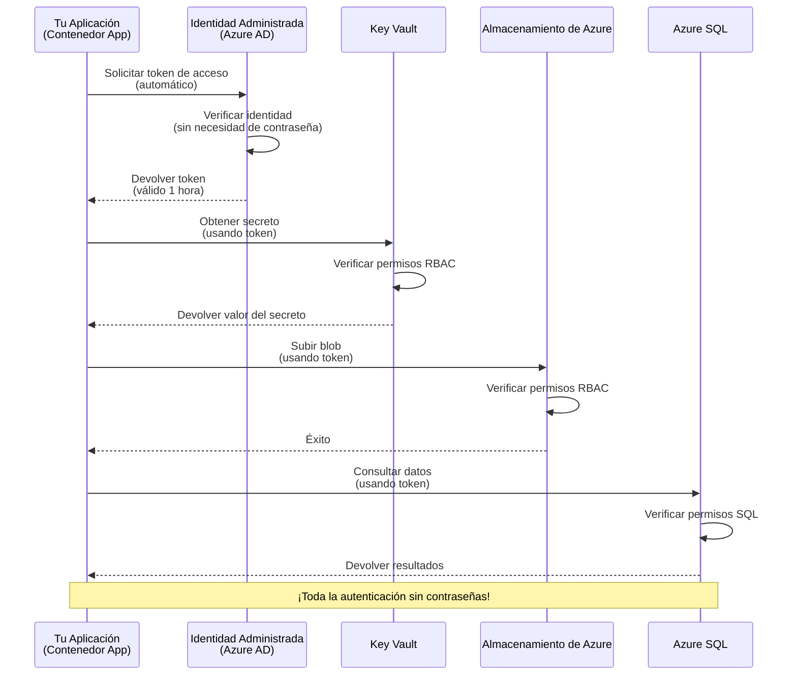
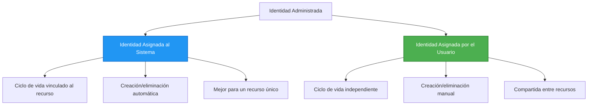

<!--
CO_OP_TRANSLATOR_METADATA:
{
  "original_hash": "e13ff6e1197e0a7462ed0aede7df9f23",
  "translation_date": "2025-11-19T22:14:18+00:00",
  "source_file": "docs/getting-started/authsecurity.md",
  "language_code": "es"
}
-->
# Patrones de Autenticación e Identidad Administrada

⏱️ **Tiempo Estimado**: 45-60 minutos | 💰 **Impacto en Costos**: Gratis (sin cargos adicionales) | ⭐ **Complejidad**: Intermedia

**📚 Ruta de Aprendizaje:**
- ← Anterior: [Gestión de Configuración](configuration.md) - Gestión de variables de entorno y secretos
- 🎯 **Estás Aquí**: Autenticación y Seguridad (Identidad Administrada, Key Vault, patrones seguros)
- → Siguiente: [Primer Proyecto](first-project.md) - Construye tu primera aplicación AZD
- 🏠 [Inicio del Curso](../../README.md)

---

## Lo que Aprenderás

Al completar esta lección, podrás:
- Comprender los patrones de autenticación de Azure (claves, cadenas de conexión, identidad administrada)
- Implementar **Identidad Administrada** para autenticación sin contraseñas
- Proteger secretos con la integración de **Azure Key Vault**
- Configurar **control de acceso basado en roles (RBAC)** para implementaciones de AZD
- Aplicar mejores prácticas de seguridad en Container Apps y servicios de Azure
- Migrar de autenticación basada en claves a basada en identidad

## Por qué es Importante la Identidad Administrada

### El Problema: Autenticación Tradicional

**Antes de la Identidad Administrada:**
```javascript
// ❌ RIESGO DE SEGURIDAD: Secretos codificados en el código
const connectionString = "Server=mydb.database.windows.net;User=admin;Password=P@ssw0rd123";
const storageKey = "xK7mN9pQ2wR5tY8uI0oP3aS6dF1gH4jK...";
const cosmosKey = "C2x7B9n4M1p8Q5w3E6r0T2y5U8i1O4p7...";
```

**Problemas:**
- 🔴 **Secretos expuestos** en el código, archivos de configuración, variables de entorno
- 🔴 **Rotación de credenciales** requiere cambios en el código y reimplementación
- 🔴 **Pesadillas de auditoría** - ¿quién accedió a qué y cuándo?
- 🔴 **Dispersión** - secretos distribuidos en múltiples sistemas
- 🔴 **Riesgos de cumplimiento** - no pasa auditorías de seguridad

### La Solución: Identidad Administrada

**Después de la Identidad Administrada:**
```javascript
// ✅ SEGURO: No hay secretos en el código
const credential = new DefaultAzureCredential();
const client = new BlobServiceClient(
  "https://mystorageaccount.blob.core.windows.net",
  credential  // Azure maneja automáticamente la autenticación
);
```

**Beneficios:**
- ✅ **Cero secretos** en el código o configuración
- ✅ **Rotación automática** - Azure lo gestiona
- ✅ **Rastro de auditoría completo** en los registros de Azure AD
- ✅ **Seguridad centralizada** - gestionada en el Portal de Azure
- ✅ **Listo para cumplimiento** - cumple con estándares de seguridad

**Analogía**: La autenticación tradicional es como llevar múltiples llaves físicas para diferentes puertas. La Identidad Administrada es como tener una credencial de seguridad que otorga acceso automáticamente según quién eres, sin llaves que perder, copiar o rotar.

---

## Descripción General de la Arquitectura

### Flujo de Autenticación con Identidad Administrada


### Tipos de Identidades Administradas


| Característica | Asignada al Sistema | Asignada al Usuario |
|----------------|---------------------|---------------------|
| **Ciclo de Vida** | Vinculada al recurso | Independiente |
| **Creación** | Automática con el recurso | Creación manual |
| **Eliminación** | Se elimina con el recurso | Persiste tras la eliminación del recurso |
| **Compartición** | Solo un recurso | Múltiples recursos |
| **Caso de Uso** | Escenarios simples | Escenarios complejos de múltiples recursos |
| **Predeterminado en AZD** | ✅ Recomendado | Opcional |

---

## Requisitos Previos

### Herramientas Requeridas

Deberías tener estas herramientas instaladas de lecciones anteriores:

```bash
# Verificar Azure Developer CLI
azd version
# ✅ Esperado: azd versión 1.0.0 o superior

# Verificar Azure CLI
az --version
# ✅ Esperado: azure-cli 2.50.0 o superior
```

### Requisitos de Azure

- Suscripción activa de Azure
- Permisos para:
  - Crear identidades administradas
  - Asignar roles RBAC
  - Crear recursos de Key Vault
  - Implementar Container Apps

### Conocimientos Previos

Deberías haber completado:
- [Guía de Instalación](installation.md) - Configuración de AZD
- [Conceptos Básicos de AZD](azd-basics.md) - Conceptos principales
- [Gestión de Configuración](configuration.md) - Variables de entorno

---

## Lección 1: Comprendiendo los Patrones de Autenticación

### Patrón 1: Cadenas de Conexión (Legado - Evitar)

**Cómo funciona:**
```bash
# La cadena de conexión contiene credenciales
STORAGE_CONNECTION_STRING="DefaultEndpointsProtocol=https;AccountName=myaccount;AccountKey=xK7mN9pQ2wR5..."
COSMOS_CONNECTION_STRING="AccountEndpoint=https://myaccount.documents.azure.com:443/;AccountKey=C2x7..."
SQL_CONNECTION_STRING="Server=myserver.database.windows.net;User=admin;Password=P@ssw0rd..."
```

**Problemas:**
- ❌ Secretos visibles en variables de entorno
- ❌ Registrados en sistemas de implementación
- ❌ Difícil de rotar
- ❌ Sin rastro de auditoría de acceso

**Cuándo usarlo:** Solo para desarrollo local, nunca en producción.

---

### Patrón 2: Referencias de Key Vault (Mejor)

**Cómo funciona:**
```bicep
// Store secret in Key Vault
resource keyVault 'Microsoft.KeyVault/vaults@2023-02-01' = {
  name: 'mykv'
  properties: {
    enableRbacAuthorization: true
  }
}

// Reference in Container App
env: [
  {
    name: 'STORAGE_KEY'
    secretRef: 'storage-key'  // References Key Vault
  }
]
```

**Beneficios:**
- ✅ Secretos almacenados de forma segura en Key Vault
- ✅ Gestión centralizada de secretos
- ✅ Rotación sin cambios en el código

**Limitaciones:**
- ⚠️ Aún se usan claves/contraseñas
- ⚠️ Necesidad de gestionar el acceso a Key Vault

**Cuándo usarlo:** Paso de transición de cadenas de conexión a identidad administrada.

---

### Patrón 3: Identidad Administrada (Mejor Práctica)

**Cómo funciona:**
```bicep
// Enable managed identity
resource containerApp 'Microsoft.App/containerApps@2023-05-01' = {
  name: 'myapp'
  identity: {
    type: 'SystemAssigned'  // Automatically creates identity
  }
}

// Grant permissions
resource roleAssignment 'Microsoft.Authorization/roleAssignments@2022-04-01' = {
  scope: storageAccount
  properties: {
    roleDefinitionId: storageBlobDataContributorRole
    principalId: containerApp.identity.principalId
  }
}
```

**Código de la aplicación:**
```javascript
// ¡No se necesitan secretos!
const { DefaultAzureCredential } = require('@azure/identity');
const { BlobServiceClient } = require('@azure/storage-blob');

const credential = new DefaultAzureCredential();
const blobServiceClient = new BlobServiceClient(
  'https://mystorageaccount.blob.core.windows.net',
  credential
);
```

**Beneficios:**
- ✅ Cero secretos en el código/configuración
- ✅ Rotación automática de credenciales
- ✅ Rastro de auditoría completo
- ✅ Permisos basados en RBAC
- ✅ Listo para cumplimiento

**Cuándo usarlo:** Siempre, para aplicaciones en producción.

---

## Lección 2: Implementando Identidad Administrada con AZD

### Implementación Paso a Paso

Construyamos una Container App segura que use identidad administrada para acceder a Azure Storage y Key Vault.

### Estructura del Proyecto

```
secure-app/
├── azure.yaml                 # AZD configuration
├── infra/
│   ├── main.bicep            # Main infrastructure
│   ├── core/
│   │   ├── identity.bicep    # Managed identity setup
│   │   ├── keyvault.bicep    # Key Vault configuration
│   │   └── storage.bicep     # Storage with RBAC
│   └── app/
│       └── container-app.bicep
└── src/
    ├── app.js                # Application code
    ├── package.json
    └── Dockerfile
```

### 1. Configurar AZD (azure.yaml)

```yaml
name: secure-app
metadata:
  template: secure-app@1.0.0

services:
  api:
    project: ./src
    language: js
    host: containerapp

# Enable managed identity (AZD handles this automatically)
```

### 2. Infraestructura: Habilitar Identidad Administrada

**Archivo: `infra/main.bicep`**

```bicep
targetScope = 'subscription'

param environmentName string
param location string = 'eastus'

var tags = { 'azd-env-name': environmentName }

// Resource group
resource rg 'Microsoft.Resources/resourceGroups@2021-04-01' = {
  name: 'rg-${environmentName}'
  location: location
  tags: tags
}

// Storage Account
module storage './core/storage.bicep' = {
  name: 'storage'
  scope: rg
  params: {
    name: 'st${uniqueString(rg.id)}'
    location: location
    tags: tags
  }
}

// Key Vault
module keyVault './core/keyvault.bicep' = {
  name: 'keyvault'
  scope: rg
  params: {
    name: 'kv-${uniqueString(rg.id)}'
    location: location
    tags: tags
  }
}

// Container App with Managed Identity
module containerApp './app/container-app.bicep' = {
  name: 'container-app'
  scope: rg
  params: {
    name: 'ca-${environmentName}'
    location: location
    tags: tags
    storageAccountName: storage.outputs.name
    keyVaultName: keyVault.outputs.name
  }
}

// Grant Container App access to Storage
module storageRoleAssignment './core/role-assignment.bicep' = {
  name: 'storage-role'
  scope: rg
  params: {
    principalId: containerApp.outputs.identityPrincipalId
    roleDefinitionId: 'ba92f5b4-2d11-453d-a403-e96b0029c9fe'  // Storage Blob Data Contributor
    targetResourceId: storage.outputs.id
  }
}

// Grant Container App access to Key Vault
module kvRoleAssignment './core/role-assignment.bicep' = {
  name: 'kv-role'
  scope: rg
  params: {
    principalId: containerApp.outputs.identityPrincipalId
    roleDefinitionId: '4633458b-17de-408a-b874-0445c86b69e6'  // Key Vault Secrets User
    targetResourceId: keyVault.outputs.id
  }
}

// Outputs
output AZURE_STORAGE_ACCOUNT_NAME string = storage.outputs.name
output AZURE_KEY_VAULT_NAME string = keyVault.outputs.name
output APP_URL string = containerApp.outputs.url
```

### 3. Container App con Identidad Asignada al Sistema

**Archivo: `infra/app/container-app.bicep`**

```bicep
param name string
param location string
param tags object = {}
param storageAccountName string
param keyVaultName string

resource containerApp 'Microsoft.App/containerApps@2023-05-01' = {
  name: name
  location: location
  tags: tags
  identity: {
    type: 'SystemAssigned'  // 🔑 Enable managed identity
  }
  properties: {
    configuration: {
      ingress: {
        external: true
        targetPort: 3000
      }
    }
    template: {
      containers: [
        {
          name: 'api'
          image: 'myregistry.azurecr.io/api:latest'
          resources: {
            cpu: json('0.5')
            memory: '1Gi'
          }
          env: [
            {
              name: 'AZURE_STORAGE_ACCOUNT_NAME'
              value: storageAccountName
            }
            {
              name: 'AZURE_KEY_VAULT_NAME'
              value: keyVaultName
            }
            // 🔑 No secrets - managed identity handles authentication!
          ]
        }
      ]
    }
  }
}

// Output the identity for RBAC assignments
output identityPrincipalId string = containerApp.identity.principalId
output id string = containerApp.id
output url string = 'https://${containerApp.properties.configuration.ingress.fqdn}'
```

### 4. Módulo de Asignación de Roles RBAC

**Archivo: `infra/core/role-assignment.bicep`**

```bicep
param principalId string
param roleDefinitionId string  // Azure built-in role ID
param targetResourceId string

resource roleAssignment 'Microsoft.Authorization/roleAssignments@2022-04-01' = {
  name: guid(principalId, roleDefinitionId, targetResourceId)
  scope: resourceId('Microsoft.Resources/resourceGroups', resourceGroup().name)
  properties: {
    roleDefinitionId: subscriptionResourceId('Microsoft.Authorization/roleDefinitions', roleDefinitionId)
    principalId: principalId
    principalType: 'ServicePrincipal'
  }
}

output id string = roleAssignment.id
```

### 5. Código de la Aplicación con Identidad Administrada

**Archivo: `src/app.js`**

```javascript
const express = require('express');
const { DefaultAzureCredential } = require('@azure/identity');
const { BlobServiceClient } = require('@azure/storage-blob');
const { SecretClient } = require('@azure/keyvault-secrets');

const app = express();
const PORT = process.env.PORT || 3000;

// 🔑 Inicializar credencial (funciona automáticamente con identidad administrada)
const credential = new DefaultAzureCredential();

// Configuración de Azure Storage
const storageAccountName = process.env.AZURE_STORAGE_ACCOUNT_NAME;
const blobServiceClient = new BlobServiceClient(
  `https://${storageAccountName}.blob.core.windows.net`,
  credential  // ¡No se necesitan claves!
);

// Configuración de Key Vault
const keyVaultName = process.env.AZURE_KEY_VAULT_NAME;
const secretClient = new SecretClient(
  `https://${keyVaultName}.vault.azure.net`,
  credential  // ¡No se necesitan claves!
);

// Verificación de estado
app.get('/health', (req, res) => {
  res.json({ status: 'healthy', authentication: 'managed-identity' });
});

// Subir archivo al almacenamiento de blobs
app.post('/upload', async (req, res) => {
  try {
    const containerClient = blobServiceClient.getContainerClient('uploads');
    await containerClient.createIfNotExists();
    
    const blobName = `file-${Date.now()}.txt`;
    const blockBlobClient = containerClient.getBlockBlobClient(blobName);
    
    await blockBlobClient.upload('Hello from managed identity!', 30);
    
    res.json({
      success: true,
      blobName: blobName,
      message: 'File uploaded using managed identity!'
    });
  } catch (error) {
    console.error('Upload error:', error);
    res.status(500).json({ error: error.message });
  }
});

// Obtener secreto de Key Vault
app.get('/secret/:name', async (req, res) => {
  try {
    const secretName = req.params.name;
    const secret = await secretClient.getSecret(secretName);
    
    res.json({
      name: secretName,
      value: secret.value,
      message: 'Secret retrieved using managed identity!'
    });
  } catch (error) {
    console.error('Secret error:', error);
    res.status(500).json({ error: error.message });
  }
});

// Listar contenedores de blobs (demuestra acceso de lectura)
app.get('/containers', async (req, res) => {
  try {
    const containers = [];
    for await (const container of blobServiceClient.listContainers()) {
      containers.push(container.name);
    }
    
    res.json({
      containers: containers,
      count: containers.length,
      message: 'Containers listed using managed identity!'
    });
  } catch (error) {
    console.error('List error:', error);
    res.status(500).json({ error: error.message });
  }
});

app.listen(PORT, () => {
  console.log(`Secure API listening on port ${PORT}`);
  console.log('Authentication: Managed Identity (passwordless)');
});
```

**Archivo: `src/package.json`**

```json
{
  "name": "secure-app",
  "version": "1.0.0",
  "dependencies": {
    "express": "^4.18.2",
    "@azure/identity": "^4.0.0",
    "@azure/storage-blob": "^12.17.0",
    "@azure/keyvault-secrets": "^4.7.0"
  },
  "scripts": {
    "start": "node app.js"
  }
}
```

### 6. Implementar y Probar

```bash
# Inicializar el entorno AZD
azd init

# Desplegar infraestructura y aplicación
azd up

# Obtener la URL de la aplicación
APP_URL=$(azd env get-values | grep APP_URL | cut -d '=' -f2 | tr -d '"')

# Probar la verificación de estado
curl $APP_URL/health
```

**✅ Salida esperada:**
```json
{
  "status": "healthy",
  "authentication": "managed-identity"
}
```

**Prueba de carga de blobs:**
```bash
curl -X POST $APP_URL/upload
```

**✅ Salida esperada:**
```json
{
  "success": true,
  "blobName": "file-1700404800000.txt",
  "message": "File uploaded using managed identity!"
}
```

**Prueba de listado de contenedores:**
```bash
curl $APP_URL/containers
```

**✅ Salida esperada:**
```json
{
  "containers": ["uploads"],
  "count": 1,
  "message": "Containers listed using managed identity!"
}
```

---

## Roles Comunes de Azure RBAC

### IDs de Roles Integrados para Identidad Administrada

| Servicio | Nombre del Rol | ID del Rol | Permisos |
|----------|----------------|------------|----------|
| **Storage** | Lector de Datos de Blob de Storage | `2a2b9908-6b94-4a3d-8e5a-a7d8f8cc8a12` | Leer blobs y contenedores |
| **Storage** | Colaborador de Datos de Blob de Storage | `ba92f5b4-2d11-453d-a403-e96b0029c9fe` | Leer, escribir, eliminar blobs |
| **Storage** | Colaborador de Datos de Cola de Storage | `974c5e8b-45b9-4653-ba55-5f855dd0fb88` | Leer, escribir, eliminar mensajes de cola |
| **Key Vault** | Usuario de Secretos de Key Vault | `4633458b-17de-408a-b874-0445c86b69e6` | Leer secretos |
| **Key Vault** | Oficial de Secretos de Key Vault | `b86a8fe4-44ce-4948-aee5-eccb2c155cd7` | Leer, escribir, eliminar secretos |
| **Cosmos DB** | Lector de Datos Integrado de Cosmos DB | `00000000-0000-0000-0000-000000000001` | Leer datos de Cosmos DB |
| **Cosmos DB** | Colaborador de Datos Integrado de Cosmos DB | `00000000-0000-0000-0000-000000000002` | Leer, escribir datos de Cosmos DB |
| **SQL Database** | Colaborador de SQL DB | `9b7fa17d-e63e-47b0-bb0a-15c516ac86ec` | Gestionar bases de datos SQL |
| **Service Bus** | Propietario de Datos de Azure Service Bus | `090c5cfd-751d-490a-894a-3ce6f1109419` | Enviar, recibir, gestionar mensajes |

### Cómo Encontrar IDs de Roles

```bash
# Enumerar todos los roles integrados
az role definition list --query "[].{Name:roleName, ID:name}" --output table

# Buscar un rol específico
az role definition list --query "[?contains(roleName, 'Storage Blob')].{Name:roleName, ID:name}" --output table

# Obtener detalles del rol
az role definition list --name "Storage Blob Data Contributor"
```

---

## Ejercicios Prácticos

### Ejercicio 1: Habilitar Identidad Administrada para una App Existente ⭐⭐ (Intermedio)

**Objetivo**: Agregar identidad administrada a una implementación existente de Container App

**Escenario**: Tienes una Container App que usa cadenas de conexión. Convierte a identidad administrada.

**Punto de Inicio**: Container App con esta configuración:

```bicep
// ❌ Current: Using connection string
env: [
  {
    name: 'STORAGE_CONNECTION_STRING'
    secretRef: 'storage-connection'
  }
]
```

**Pasos**:

1. **Habilitar identidad administrada en Bicep:**

```bicep
resource containerApp 'Microsoft.App/containerApps@2023-05-01' = {
  name: 'myapp'
  identity: {
    type: 'SystemAssigned'  // Add this
  }
  // ... rest of configuration
}
```

2. **Conceder acceso a Storage:**

```bicep
// Get storage account reference
resource storageAccount 'Microsoft.Storage/storageAccounts@2023-01-01' existing = {
  name: storageAccountName
}

// Assign role
resource roleAssignment 'Microsoft.Authorization/roleAssignments@2022-04-01' = {
  name: guid(containerApp.id, 'ba92f5b4-2d11-453d-a403-e96b0029c9fe', storageAccount.id)
  scope: storageAccount
  properties: {
    roleDefinitionId: subscriptionResourceId('Microsoft.Authorization/roleDefinitions', 'ba92f5b4-2d11-453d-a403-e96b0029c9fe')
    principalId: containerApp.identity.principalId
    principalType: 'ServicePrincipal'
  }
}
```

3. **Actualizar código de la aplicación:**

**Antes (cadena de conexión):**
```javascript
const { BlobServiceClient } = require('@azure/storage-blob');

const blobServiceClient = BlobServiceClient.fromConnectionString(
  process.env.STORAGE_CONNECTION_STRING
);
```

**Después (identidad administrada):**
```javascript
const { DefaultAzureCredential } = require('@azure/identity');
const { BlobServiceClient } = require('@azure/storage-blob');

const credential = new DefaultAzureCredential();
const blobServiceClient = new BlobServiceClient(
  `https://${process.env.STORAGE_ACCOUNT_NAME}.blob.core.windows.net`,
  credential
);
```

4. **Actualizar variables de entorno:**

```bicep
env: [
  {
    name: 'STORAGE_ACCOUNT_NAME'
    value: storageAccountName  // Just the name, no secrets!
  }
  // Remove STORAGE_CONNECTION_STRING
]
```

5. **Implementar y probar:**

```bash
# Reimplementar
azd up

# Probar que todavía funciona
curl https://myapp.azurecontainerapps.io/upload
```

**✅ Criterios de Éxito:**
- ✅ La aplicación se implementa sin errores
- ✅ Las operaciones de Storage funcionan (cargar, listar, descargar)
- ✅ No hay cadenas de conexión en las variables de entorno
- ✅ Identidad visible en el Portal de Azure en la sección "Identidad"

**Verificación:**

```bash
# Verificar que la identidad administrada esté habilitada
az containerapp show \
  --name myapp \
  --resource-group rg-myapp \
  --query "identity.type"
# ✅ Esperado: "SystemAssigned"

# Verificar asignación de roles
az role assignment list \
  --assignee $(az containerapp show --name myapp --resource-group rg-myapp --query "identity.principalId" -o tsv) \
  --scope /subscriptions/{sub-id}/resourceGroups/rg-myapp/providers/Microsoft.Storage/storageAccounts/mystorageaccount
# ✅ Esperado: Muestra el rol "Storage Blob Data Contributor"
```

**Tiempo**: 20-30 minutos

---

### Ejercicio 2: Acceso Multi-Servicio con Identidad Asignada al Usuario ⭐⭐⭐ (Avanzado)

**Objetivo**: Crear una identidad asignada al usuario compartida entre múltiples Container Apps

**Escenario**: Tienes 3 microservicios que necesitan acceso al mismo Storage y Key Vault.

**Pasos**:

1. **Crear identidad asignada al usuario:**

**Archivo: `infra/core/identity.bicep`**

```bicep
param name string
param location string
param tags object = {}

resource userAssignedIdentity 'Microsoft.ManagedIdentity/userAssignedIdentities@2023-01-31' = {
  name: name
  location: location
  tags: tags
}

output id string = userAssignedIdentity.id
output principalId string = userAssignedIdentity.properties.principalId
output clientId string = userAssignedIdentity.properties.clientId
```

2. **Asignar roles a la identidad asignada al usuario:**

```bicep
// In main.bicep
module userIdentity './core/identity.bicep' = {
  name: 'user-identity'
  scope: rg
  params: {
    name: 'id-${environmentName}'
    location: location
    tags: tags
  }
}

// Grant Storage access
resource storageRoleAssignment 'Microsoft.Authorization/roleAssignments@2022-04-01' = {
  name: guid(userIdentity.outputs.principalId, 'storage-contributor')
  scope: storageAccount
  properties: {
    roleDefinitionId: subscriptionResourceId('Microsoft.Authorization/roleDefinitions', 'ba92f5b4-2d11-453d-a403-e96b0029c9fe')
    principalId: userIdentity.outputs.principalId
    principalType: 'ServicePrincipal'
  }
}

// Grant Key Vault access
resource kvRoleAssignment 'Microsoft.Authorization/roleAssignments@2022-04-01' = {
  name: guid(userIdentity.outputs.principalId, 'kv-secrets-user')
  scope: keyVault
  properties: {
    roleDefinitionId: subscriptionResourceId('Microsoft.Authorization/roleDefinitions', '4633458b-17de-408a-b874-0445c86b69e6')
    principalId: userIdentity.outputs.principalId
    principalType: 'ServicePrincipal'
  }
}
```

3. **Asignar identidad a múltiples Container Apps:**

```bicep
resource apiGateway 'Microsoft.App/containerApps@2023-05-01' = {
  name: 'api-gateway'
  identity: {
    type: 'UserAssigned'
    userAssignedIdentities: {
      '${userIdentity.outputs.id}': {}
    }
  }
  // ... rest of config
}

resource productService 'Microsoft.App/containerApps@2023-05-01' = {
  name: 'product-service'
  identity: {
    type: 'UserAssigned'
    userAssignedIdentities: {
      '${userIdentity.outputs.id}': {}
    }
  }
  // ... rest of config
}

resource orderService 'Microsoft.App/containerApps@2023-05-01' = {
  name: 'order-service'
  identity: {
    type: 'UserAssigned'
    userAssignedIdentities: {
      '${userIdentity.outputs.id}': {}
    }
  }
  // ... rest of config
}
```

4. **Código de la aplicación (todos los servicios usan el mismo patrón):**

```javascript
const { DefaultAzureCredential, ManagedIdentityCredential } = require('@azure/identity');

// Para la identidad asignada por el usuario, especifique el ID del cliente
const credential = new ManagedIdentityCredential(
  process.env.AZURE_CLIENT_ID  // ID del cliente de la identidad asignada por el usuario
);

// O use DefaultAzureCredential (detecta automáticamente)
const credential = new DefaultAzureCredential();

const blobServiceClient = new BlobServiceClient(
  `https://${process.env.STORAGE_ACCOUNT_NAME}.blob.core.windows.net`,
  credential
);
```

5. **Implementar y verificar:**

```bash
azd up

# Probar que todos los servicios pueden acceder al almacenamiento
curl https://api-gateway.azurecontainerapps.io/upload
curl https://product-service.azurecontainerapps.io/upload
curl https://order-service.azurecontainerapps.io/upload
```

**✅ Criterios de Éxito:**
- ✅ Una identidad compartida entre 3 servicios
- ✅ Todos los servicios pueden acceder a Storage y Key Vault
- ✅ La identidad persiste si eliminas un servicio
- ✅ Gestión centralizada de permisos

**Beneficios de la Identidad Asignada al Usuario:**
- Una sola identidad para gestionar
- Permisos consistentes entre servicios
- Sobrevive a la eliminación de servicios
- Mejor para arquitecturas complejas

**Tiempo**: 30-40 minutos

---

### Ejercicio 3: Implementar Rotación de Secretos en Key Vault ⭐⭐⭐ (Avanzado)

**Objetivo**: Almacenar claves de API de terceros en Key Vault y acceder a ellas usando identidad administrada

**Escenario**: Tu aplicación necesita llamar a una API externa (OpenAI, Stripe, SendGrid) que requiere claves de API.

**Pasos**:

1. **Crear Key Vault con RBAC:**

**Archivo: `infra/core/keyvault.bicep`**

```bicep
param name string
param location string
param tags object = {}

resource keyVault 'Microsoft.KeyVault/vaults@2023-02-01' = {
  name: name
  location: location
  tags: tags
  properties: {
    enableRbacAuthorization: true  // Use RBAC instead of access policies
    sku: {
      family: 'A'
      name: 'standard'
    }
    tenantId: subscription().tenantId
    enableSoftDelete: true
    softDeleteRetentionInDays: 90
  }
}

// Allow Container App to read secrets
output id string = keyVault.id
output name string = keyVault.name
output uri string = keyVault.properties.vaultUri
```

2. **Almacenar secretos en Key Vault:**

```bash
# Obtener el nombre del Key Vault
KV_NAME=$(azd env get-values | grep AZURE_KEY_VAULT_NAME | cut -d '=' -f2 | tr -d '"')

# Almacenar las claves de la API de terceros
az keyvault secret set \
  --vault-name $KV_NAME \
  --name "OpenAI-ApiKey" \
  --value "sk-proj-xxxxxxxxxxxxx"

az keyvault secret set \
  --vault-name $KV_NAME \
  --name "Stripe-ApiKey" \
  --value "sk_live_xxxxxxxxxxxxx"

az keyvault secret set \
  --vault-name $KV_NAME \
  --name "SendGrid-ApiKey" \
  --value "SG.xxxxxxxxxxxxx"
```

3. **Código de la aplicación para recuperar secretos:**

**Archivo: `src/config.js`**

```javascript
const { DefaultAzureCredential } = require('@azure/identity');
const { SecretClient } = require('@azure/keyvault-secrets');

class Config {
  constructor() {
    this.credential = new DefaultAzureCredential();
    this.secretClient = new SecretClient(
      `https://${process.env.AZURE_KEY_VAULT_NAME}.vault.azure.net`,
      this.credential
    );
    this.cache = {};
  }

  async getSecret(secretName) {
    // Verificar la caché primero
    if (this.cache[secretName]) {
      return this.cache[secretName];
    }

    try {
      const secret = await this.secretClient.getSecret(secretName);
      this.cache[secretName] = secret.value;
      console.log(`✅ Retrieved secret: ${secretName}`);
      return secret.value;
    } catch (error) {
      console.error(`❌ Failed to get secret ${secretName}:`, error.message);
      throw error;
    }
  }

  async getOpenAIKey() {
    return this.getSecret('OpenAI-ApiKey');
  }

  async getStripeKey() {
    return this.getSecret('Stripe-ApiKey');
  }

  async getSendGridKey() {
    return this.getSecret('SendGrid-ApiKey');
  }
}

module.exports = new Config();
```

4. **Usar secretos en la aplicación:**

**Archivo: `src/app.js`**

```javascript
const express = require('express');
const config = require('./config');
const { OpenAI } = require('openai');

const app = express();

// Inicializar OpenAI con clave del Key Vault
let openaiClient;

async function initializeServices() {
  const openaiKey = await config.getOpenAIKey();
  openaiClient = new OpenAI({ apiKey: openaiKey });
  console.log('✅ Services initialized with secrets from Key Vault');
}

// Llamar al iniciar
initializeServices().catch(console.error);

app.post('/chat', async (req, res) => {
  try {
    const completion = await openaiClient.chat.completions.create({
      model: 'gpt-4',
      messages: [{ role: 'user', content: 'Hello!' }]
    });
    
    res.json({
      response: completion.choices[0].message.content,
      authentication: 'Key from Key Vault via Managed Identity'
    });
  } catch (error) {
    res.status(500).json({ error: error.message });
  }
});

app.listen(3000, () => {
  console.log('Secure API with Key Vault integration running');
});
```

5. **Implementar y probar:**

```bash
azd up

# Probar que las claves de API funcionan
curl -X POST https://myapp.azurecontainerapps.io/chat \
  -H "Content-Type: application/json" \
  -d '{"message":"Hello AI"}'
```

**✅ Criterios de Éxito:**
- ✅ Sin claves de API en el código o variables de entorno
- ✅ La aplicación recupera claves de Key Vault
- ✅ Las APIs de terceros funcionan correctamente
- ✅ Se pueden rotar claves sin cambios en el código

**Rotar un secreto:**

```bash
# Actualizar secreto en Key Vault
az keyvault secret set \
  --vault-name $KV_NAME \
  --name "OpenAI-ApiKey" \
  --value "sk-proj-NEW_KEY_HERE"

# Reiniciar la aplicación para recoger la nueva clave
az containerapp revision restart \
  --name myapp \
  --resource-group rg-myapp
```

**Tiempo**: 25-35 minutos

---

## Punto de Control de Conocimientos

### 1. Patrones de Autenticación ✓

Pon a prueba tu comprensión:

- [ ] **P1**: ¿Cuáles son los tres principales patrones de autenticación? 
  - **R**: Cadenas de conexión (legado), referencias de Key Vault (transición), identidad administrada (mejor)

- [ ] **P2**: ¿Por qué la identidad administrada es mejor que las cadenas de conexión?
  - **R**: Sin secretos en el código, rotación automática, rastro de auditoría completo, permisos RBAC

- [ ] **P3**: ¿Cuándo usarías identidad asignada al usuario en lugar de asignada al sistema?
  - **R**: Cuando se comparte la identidad entre múltiples recursos o cuando el ciclo de vida de la identidad es independiente del recurso

**Verificación Práctica:**
```bash
# Verifique qué tipo de identidad utiliza su aplicación
az containerapp show \
  --name myapp \
  --resource-group rg-myapp \
  --query "identity.type"

# Enumere todas las asignaciones de roles para la identidad
az role assignment list \
  --assignee $(az containerapp show --name myapp --resource-group rg-myapp --query "identity.principalId" -o tsv)
```

---

### 2. RBAC y Permisos ✓

Pon a prueba tu comprensión:

- [ ] **P1**: ¿Cuál es el ID del rol para "Colaborador de Datos de Blob de Storage"?
  - **R**: `ba92f5b4-2d11-453d-a403-e96b0029c9fe`

- [ ] **P2**: ¿Qué permisos proporciona "Usuario de Secretos de Key Vault"?
  - **R**: Acceso de solo lectura a secretos (no puede crear, actualizar ni eliminar)

- [ ] **P3**: ¿Cómo otorgas acceso a una Container App a Azure SQL?
  - **R**: Asignar el rol "Colaborador de SQL DB" o configurar autenticación de Azure AD para SQL

**Verificación Práctica:**
```bash
# Encontrar un rol específico
az role definition list --name "Storage Blob Data Contributor"

# Verificar qué roles están asignados a tu identidad
PRINCIPAL_ID=$(az containerapp show --name myapp --resource-group rg-myapp --query "identity.principalId" -o tsv)
az role assignment list --assignee $PRINCIPAL_ID --output table
```

---

### 3. Integración con Key Vault ✓

Pon a prueba tu comprensión:
- [ ] **P1**: ¿Cómo habilitas RBAC para Key Vault en lugar de políticas de acceso?
  - **R**: Configura `enableRbacAuthorization: true` en Bicep

- [ ] **P2**: ¿Qué biblioteca del SDK de Azure maneja la autenticación de identidad administrada?
  - **R**: `@azure/identity` con la clase `DefaultAzureCredential`

- [ ] **P3**: ¿Cuánto tiempo permanecen los secretos de Key Vault en caché?
  - **R**: Depende de la aplicación; implementa tu propia estrategia de caché

**Verificación Práctica:**
```bash
# Probar acceso a Key Vault
az keyvault secret show \
  --vault-name $KV_NAME \
  --name "OpenAI-ApiKey" \
  --query "value"

# Verificar que RBAC esté habilitado
az keyvault show \
  --name $KV_NAME \
  --query "properties.enableRbacAuthorization"
# ✅ Esperado: verdadero
```

---

## Mejores Prácticas de Seguridad

### ✅ HACER:

1. **Usa siempre identidad administrada en producción**
   ```bicep
   identity: {
     type: 'SystemAssigned'
   }
   ```

2. **Usa roles RBAC con privilegios mínimos**
   - Usa roles de "Lector" cuando sea posible
   - Evita "Propietario" o "Colaborador" a menos que sea necesario

3. **Almacena claves de terceros en Key Vault**
   ```javascript
   const apiKey = await secretClient.getSecret('ThirdPartyApiKey');
   ```

4. **Habilita el registro de auditoría**
   ```bicep
   diagnosticSettings: {
     logs: [{ category: 'AuditEvent', enabled: true }]
   }
   ```

5. **Usa identidades diferentes para desarrollo, pruebas y producción**
   ```bash
   azd env new dev
   azd env new staging
   azd env new prod
   ```

6. **Rota los secretos regularmente**
   - Establece fechas de expiración en los secretos de Key Vault
   - Automatiza la rotación con Azure Functions

### ❌ NO HACER:

1. **Nunca codifiques secretos directamente**
   ```javascript
   // ❌ MALO
   const apiKey = "sk-proj-xxxxxxxxxxxxx";
   ```

2. **No uses cadenas de conexión en producción**
   ```javascript
   // ❌ MALO
   BlobServiceClient.fromConnectionString(process.env.STORAGE_CONNECTION_STRING)
   ```

3. **No otorgues permisos excesivos**
   ```bicep
   // ❌ BAD - too much access
   roleDefinitionId: 'Owner'
   
   // ✅ GOOD - least privilege
   roleDefinitionId: 'Storage Blob Data Reader'
   ```

4. **No registres secretos en logs**
   ```javascript
   // ❌ MALO
   console.log('API Key:', apiKey);
   
   // ✅ BUENO
   console.log('API Key retrieved successfully');
   ```

5. **No compartas identidades de producción entre entornos**
   ```bicep
   // ❌ BAD - same identity for dev and prod
   // ✅ GOOD - separate identities per environment
   ```

---

## Guía de Solución de Problemas

### Problema: "No autorizado" al acceder a Azure Storage

**Síntomas:**
```
Error: Unauthorized (403)
AuthorizationPermissionMismatch: This request is not authorized to perform this operation
```

**Diagnóstico:**

```bash
# Verificar si la identidad administrada está habilitada
az containerapp show \
  --name myapp \
  --resource-group rg-myapp \
  --query "identity.type"
# ✅ Esperado: "SystemAssigned" o "UserAssigned"

# Verificar asignaciones de roles
PRINCIPAL_ID=$(az containerapp show --name myapp --resource-group rg-myapp --query "identity.principalId" -o tsv)
az role assignment list --assignee $PRINCIPAL_ID

# Esperado: Debería ver "Storage Blob Data Contributor" o un rol similar
```

**Soluciones:**

1. **Otorga el rol RBAC correcto:**
```bash
STORAGE_ID=$(az storage account show --name mystorageaccount --resource-group rg-myapp --query "id" -o tsv)
az role assignment create \
  --assignee $PRINCIPAL_ID \
  --role "Storage Blob Data Contributor" \
  --scope $STORAGE_ID
```

2. **Espera la propagación (puede tardar 5-10 minutos):**
```bash
# Verificar el estado de asignación de roles
az role assignment list --assignee $PRINCIPAL_ID --scope $STORAGE_ID
```

3. **Verifica que el código de la aplicación use las credenciales correctas:**
```javascript
// Asegúrate de estar usando DefaultAzureCredential
const credential = new DefaultAzureCredential();
```

---

### Problema: Acceso denegado a Key Vault

**Síntomas:**
```
Error: Forbidden (403)
The user, group or application does not have secrets get permission
```

**Diagnóstico:**

```bash
# Verificar que RBAC de Key Vault esté habilitado
az keyvault show \
  --name $KV_NAME \
  --query "properties.enableRbacAuthorization"
# ✅ Esperado: verdadero

# Verificar asignaciones de roles
az role assignment list \
  --assignee $PRINCIPAL_ID \
  --scope /subscriptions/{sub-id}/resourceGroups/rg-myapp/providers/Microsoft.KeyVault/vaults/$KV_NAME
```

**Soluciones:**

1. **Habilita RBAC en Key Vault:**
```bash
az keyvault update \
  --name $KV_NAME \
  --enable-rbac-authorization true
```

2. **Otorga el rol de Usuario de Secretos de Key Vault:**
```bash
KV_ID=$(az keyvault show --name $KV_NAME --query "id" -o tsv)
az role assignment create \
  --assignee $PRINCIPAL_ID \
  --role "Key Vault Secrets User" \
  --scope $KV_ID
```

---

### Problema: DefaultAzureCredential falla localmente

**Síntomas:**
```
Error: DefaultAzureCredential failed to retrieve a token
CredentialUnavailableError: No credential available
```

**Diagnóstico:**

```bash
# Verifica si estás conectado
az account show

# Verifica la autenticación de Azure CLI
az ad signed-in-user show
```

**Soluciones:**

1. **Inicia sesión en Azure CLI:**
```bash
az login
```

2. **Configura la suscripción de Azure:**
```bash
az account set --subscription "Your Subscription Name"
```

3. **Para desarrollo local, usa variables de entorno:**
```bash
export AZURE_TENANT_ID="your-tenant-id"
export AZURE_CLIENT_ID="your-client-id"
export AZURE_CLIENT_SECRET="your-client-secret"
```

4. **O usa una credencial diferente localmente:**
```javascript
const { DefaultAzureCredential, AzureCliCredential } = require('@azure/identity');

// Usar AzureCliCredential para desarrollo local
const credential = process.env.NODE_ENV === 'production' 
  ? new DefaultAzureCredential()
  : new AzureCliCredential();
```

---

### Problema: La asignación de roles tarda demasiado en propagarse

**Síntomas:**
- Rol asignado con éxito
- Sigue recibiendo errores 403
- Acceso intermitente (a veces funciona, a veces no)

**Explicación:**
Los cambios en Azure RBAC pueden tardar de 5 a 10 minutos en propagarse globalmente.

**Solución:**

```bash
# Esperar y reintentar
echo "Waiting for RBAC propagation..."
sleep 300  # Esperar 5 minutos

# Probar acceso
curl https://myapp.azurecontainerapps.io/upload

# Si sigue fallando, reiniciar la aplicación
az containerapp revision restart \
  --name myapp \
  --resource-group rg-myapp
```

---

## Consideraciones de Costos

### Costos de Identidad Administrada

| Recurso | Costo |
|---------|-------|
| **Identidad Administrada** | 🆓 **GRATIS** - Sin cargo |
| **Asignaciones de Roles RBAC** | 🆓 **GRATIS** - Sin cargo |
| **Solicitudes de Token de Azure AD** | 🆓 **GRATIS** - Incluido |
| **Operaciones de Key Vault** | $0.03 por cada 10,000 operaciones |
| **Almacenamiento de Key Vault** | $0.024 por secreto al mes |

**La identidad administrada ahorra dinero al:**
- ✅ Eliminar operaciones de Key Vault para autenticación entre servicios
- ✅ Reducir incidentes de seguridad (sin credenciales filtradas)
- ✅ Disminuir la carga operativa (sin rotación manual)

**Comparación de Costos Ejemplo (mensual):**

| Escenario | Cadenas de Conexión | Identidad Administrada | Ahorro |
|-----------|---------------------|-----------------------|--------|
| App pequeña (1M solicitudes) | ~$50 (Key Vault + ops) | ~$0 | $50/mes |
| App mediana (10M solicitudes) | ~$200 | ~$0 | $200/mes |
| App grande (100M solicitudes) | ~$1,500 | ~$0 | $1,500/mes |

---

## Más Información

### Documentación Oficial
- [Identidad Administrada de Azure](https://learn.microsoft.com/entra/identity/managed-identities-azure-resources/overview)
- [RBAC de Azure](https://learn.microsoft.com/azure/role-based-access-control/overview)
- [Azure Key Vault](https://learn.microsoft.com/azure/key-vault/general/overview)
- [DefaultAzureCredential](https://learn.microsoft.com/dotnet/api/azure.identity.defaultazurecredential)

### Documentación del SDK
- [@azure/identity (Node.js)](https://www.npmjs.com/package/@azure/identity)
- [Azure.Identity (C#)](https://www.nuget.org/packages/Azure.Identity/)
- [azure-identity (Python)](https://pypi.org/project/azure-identity/)

### Próximos Pasos en Este Curso
- ← Anterior: [Gestión de Configuración](configuration.md)
- → Siguiente: [Primer Proyecto](first-project.md)
- 🏠 [Inicio del Curso](../../README.md)

### Ejemplos Relacionados
- [Ejemplo de Chat de Azure OpenAI](../../../../examples/azure-openai-chat) - Usa identidad administrada para Azure OpenAI
- [Ejemplo de Microservicios](../../../../examples/microservices) - Patrones de autenticación multi-servicio

---

## Resumen

**Has aprendido:**
- ✅ Tres patrones de autenticación (cadenas de conexión, Key Vault, identidad administrada)
- ✅ Cómo habilitar y configurar identidad administrada en AZD
- ✅ Asignaciones de roles RBAC para servicios de Azure
- ✅ Integración de Key Vault para secretos de terceros
- ✅ Identidades asignadas por usuario vs asignadas por sistema
- ✅ Mejores prácticas de seguridad y solución de problemas

**Puntos Clave:**
1. **Usa siempre identidad administrada en producción** - Sin secretos, rotación automática
2. **Usa roles RBAC con privilegios mínimos** - Otorga solo los permisos necesarios
3. **Almacena claves de terceros en Key Vault** - Gestión centralizada de secretos
4. **Separa identidades por entorno** - Aislamiento de desarrollo, pruebas y producción
5. **Habilita el registro de auditoría** - Rastrea quién accedió a qué

**Próximos Pasos:**
1. Completa los ejercicios prácticos anteriores
2. Migra una aplicación existente de cadenas de conexión a identidad administrada
3. Construye tu primer proyecto AZD con seguridad desde el primer día: [Primer Proyecto](first-project.md)

---

<!-- CO-OP TRANSLATOR DISCLAIMER START -->
**Descargo de responsabilidad**:  
Este documento ha sido traducido utilizando el servicio de traducción automática [Co-op Translator](https://github.com/Azure/co-op-translator). Si bien nos esforzamos por lograr precisión, tenga en cuenta que las traducciones automáticas pueden contener errores o imprecisiones. El documento original en su idioma nativo debe considerarse la fuente autorizada. Para información crítica, se recomienda una traducción profesional realizada por humanos. No nos hacemos responsables de malentendidos o interpretaciones erróneas que surjan del uso de esta traducción.
<!-- CO-OP TRANSLATOR DISCLAIMER END -->