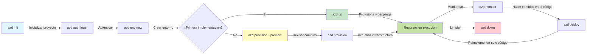
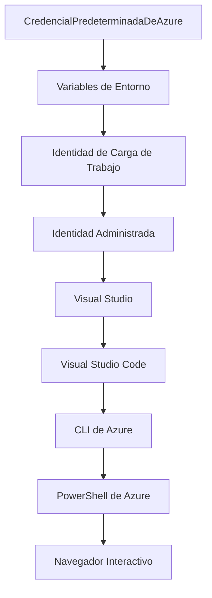

# Conceptos básicos de AZD - Comprendiendo Azure Developer CLI

# Conceptos básicos de AZD - Conceptos fundamentales y esenciales

**Navegación del capítulo:**
- **📚 Inicio del curso**: [AZD para principiantes](../../README.md)
- **📖 Capítulo actual**: Capítulo 1 - Fundamentos y guía rápida
- **⬅️ Anterior**: [Descripción general del curso](../../README.md#-chapter-1-foundation--quick-start)
- **➡️ Siguiente**: [Instalación y configuración](installation.md)
- **🚀 Próximo capítulo**: [Capítulo 2: Desarrollo centrado en IA](../microsoft-foundry/microsoft-foundry-integration.md)

## Introducción

Esta lección te presenta Azure Developer CLI (azd), una herramienta de línea de comandos poderosa que acelera tu transición del desarrollo local al despliegue en Azure. Aprenderás los conceptos fundamentales, las características principales y cómo azd simplifica el despliegue de aplicaciones nativas en la nube.

## Objetivos de aprendizaje

Al final de esta lección, podrás:
- Comprender qué es Azure Developer CLI y su propósito principal
- Aprender los conceptos clave de plantillas, entornos y servicios
- Explorar características clave como desarrollo basado en plantillas e Infraestructura como Código
- Entender la estructura y el flujo de trabajo de proyectos azd
- Estar preparado para instalar y configurar azd en tu entorno de desarrollo

## Resultados de aprendizaje

Después de completar esta lección, serás capaz de:
- Explicar el papel de azd en los flujos de trabajo modernos de desarrollo en la nube
- Identificar los componentes de la estructura de un proyecto azd
- Describir cómo las plantillas, los entornos y los servicios trabajan juntos
- Comprender los beneficios de Infraestructura como Código con azd
- Reconocer diferentes comandos de azd y sus propósitos

## ¿Qué es Azure Developer CLI (azd)?

Azure Developer CLI (azd) es una herramienta de línea de comandos diseñada para acelerar tu transición del desarrollo local al despliegue en Azure. Simplifica el proceso de construir, desplegar y gestionar aplicaciones nativas en la nube en Azure.

### 🎯 ¿Por qué usar AZD? Una comparación práctica

Comparemos el despliegue de una aplicación web sencilla con base de datos:

#### ❌ SIN AZD: Despliegue manual en Azure (más de 30 minutos)

```bash
# Paso 1: Crear grupo de recursos
az group create --name myapp-rg --location eastus

# Paso 2: Crear Plan de Servicio de Aplicaciones
az appservice plan create --name myapp-plan \
  --resource-group myapp-rg \
  --sku B1 --is-linux

# Paso 3: Crear Aplicación Web
az webapp create --name myapp-web-unique123 \
  --resource-group myapp-rg \
  --plan myapp-plan \
  --runtime "NODE:18-lts"

# Paso 4: Crear cuenta de Cosmos DB (10-15 minutos)
az cosmosdb create --name myapp-cosmos-unique123 \
  --resource-group myapp-rg \
  --kind MongoDB

# Paso 5: Crear base de datos
az cosmosdb mongodb database create \
  --account-name myapp-cosmos-unique123 \
  --resource-group myapp-rg \
  --name tododb

# Paso 6: Crear colección
az cosmosdb mongodb collection create \
  --account-name myapp-cosmos-unique123 \
  --resource-group myapp-rg \
  --database-name tododb \
  --name todos

# Paso 7: Obtener cadena de conexión
CONN_STR=$(az cosmosdb keys list \
  --name myapp-cosmos-unique123 \
  --resource-group myapp-rg \
  --type connection-strings \
  --query "connectionStrings[0].connectionString" -o tsv)

# Paso 8: Configurar ajustes de la aplicación
az webapp config appsettings set \
  --name myapp-web-unique123 \
  --resource-group myapp-rg \
  --settings MONGODB_URI="$CONN_STR"

# Paso 9: Habilitar registro de logs
az webapp log config --name myapp-web-unique123 \
  --resource-group myapp-rg \
  --application-logging filesystem \
  --detailed-error-messages true

# Paso 10: Configurar Application Insights
az monitor app-insights component create \
  --app myapp-insights \
  --location eastus \
  --resource-group myapp-rg

# Paso 11: Vincular App Insights a la Aplicación Web
INSTRUMENTATION_KEY=$(az monitor app-insights component show \
  --app myapp-insights \
  --resource-group myapp-rg \
  --query "instrumentationKey" -o tsv)

az webapp config appsettings set \
  --name myapp-web-unique123 \
  --resource-group myapp-rg \
  --settings APPINSIGHTS_INSTRUMENTATIONKEY="$INSTRUMENTATION_KEY"

# Paso 12: Construir la aplicación localmente
npm install
npm run build

# Paso 13: Crear paquete de implementación
zip -r app.zip . -x "*.git*" "node_modules/*"

# Paso 14: Implementar la aplicación
az webapp deployment source config-zip \
  --resource-group myapp-rg \
  --name myapp-web-unique123 \
  --src app.zip

# Paso 15: Esperar y rezar para que funcione 🙏
# (Sin validación automatizada, se requiere prueba manual)
```

**Problemas:**
- ❌ Más de 15 comandos que recordar y ejecutar en orden
- ❌ 30-45 minutos de trabajo manual
- ❌ Fácil cometer errores (errores tipográficos, parámetros incorrectos)
- ❌ Cadenas de conexión expuestas en el historial del terminal
- ❌ Sin reversión automática si algo falla
- ❌ Difícil de replicar para los miembros del equipo
- ❌ Diferente cada vez (no reproducible)

#### ✅ CON AZD: Despliegue automatizado (5 comandos, 10-15 minutos)

```bash
# Paso 1: Inicializar desde la plantilla
azd init --template todo-nodejs-mongo

# Paso 2: Autenticar
azd auth login

# Paso 3: Crear entorno
azd env new dev

# Paso 4: Previsualizar cambios (opcional pero recomendado)
azd provision --preview

# Paso 5: Desplegar todo
azd up

# ✨ ¡Hecho! Todo está desplegado, configurado y monitoreado
```

**Beneficios:**
- ✅ **5 comandos** frente a más de 15 pasos manuales
- ✅ **10-15 minutos** en total (principalmente esperando a Azure)
- ✅ **Cero errores** - automatizado y probado
- ✅ **Gestión segura de secretos** mediante Key Vault
- ✅ **Reversión automática** en caso de fallos
- ✅ **Totalmente reproducible** - mismo resultado cada vez
- ✅ **Preparado para el equipo** - cualquiera puede desplegar con los mismos comandos
- ✅ **Infraestructura como Código** - plantillas Bicep controladas por versión
- ✅ **Monitoreo integrado** - Application Insights configurado automáticamente

### 📊 Reducción de tiempo y errores

| Métrica | Despliegue manual | Despliegue con AZD | Mejora |
|:-------|:------------------|:-------------------|:-------|
| **Comandos** | Más de 15 | 5 | 67% menos |
| **Tiempo** | 30-45 min | 10-15 min | 60% más rápido |
| **Tasa de errores** | ~40% | <5% | 88% menos |
| **Consistencia** | Baja (manual) | 100% (automatizado) | Perfecta |
| **Onboarding del equipo** | 2-4 horas | 30 minutos | 75% más rápido |
| **Tiempo de reversión** | Más de 30 min (manual) | 2 min (automatizado) | 93% más rápido |

## Conceptos clave

### Plantillas
Las plantillas son la base de azd. Contienen:
- **Código de la aplicación** - Tu código fuente y dependencias
- **Definiciones de infraestructura** - Recursos de Azure definidos en Bicep o Terraform
- **Archivos de configuración** - Configuraciones y variables de entorno
- **Scripts de despliegue** - Flujos de trabajo de despliegue automatizados

### Entornos
Los entornos representan diferentes objetivos de despliegue:
- **Desarrollo** - Para pruebas y desarrollo
- **Staging** - Entorno de preproducción
- **Producción** - Entorno de producción en vivo

Cada entorno mantiene su propio:
- Grupo de recursos de Azure
- Configuración
- Estado de despliegue

### Servicios
Los servicios son los bloques de construcción de tu aplicación:
- **Frontend** - Aplicaciones web, SPAs
- **Backend** - APIs, microservicios
- **Base de datos** - Soluciones de almacenamiento de datos
- **Almacenamiento** - Almacenamiento de archivos y blobs

## Características clave

### 1. Desarrollo basado en plantillas
```bash
# Explorar plantillas disponibles
azd template list

# Inicializar desde una plantilla
azd init --template <template-name>
```

### 2. Infraestructura como Código
- **Bicep** - Lenguaje específico de dominio de Azure
- **Terraform** - Herramienta de infraestructura multicloud
- **Plantillas ARM** - Plantillas de Azure Resource Manager

### 3. Flujos de trabajo integrados
```bash
# Completar el flujo de trabajo de implementación
azd up            # Provisión + Implementación, esto es automático para la configuración inicial

# 🧪 NUEVO: Previsualizar cambios en la infraestructura antes de la implementación (SEGURO)
azd provision --preview    # Simular la implementación de infraestructura sin realizar cambios

azd provision     # Crear recursos de Azure si actualizas la infraestructura usa esto
azd deploy        # Implementar código de la aplicación o volver a implementar el código de la aplicación una vez actualizado
azd down          # Limpiar recursos
```

#### 🛡️ Planificación segura de infraestructura con vista previa
El comando `azd provision --preview` es revolucionario para despliegues seguros:
- **Análisis de prueba** - Muestra lo que se creará, modificará o eliminará
- **Cero riesgos** - No se realizan cambios reales en tu entorno de Azure
- **Colaboración en equipo** - Comparte resultados de vista previa antes del despliegue
- **Estimación de costos** - Comprende los costos de recursos antes de comprometerte

```bash
# Ejemplo de flujo de trabajo de vista previa
azd provision --preview           # Ver qué cambiará
# Revisar el resultado, discutir con el equipo
azd provision                     # Aplicar los cambios con confianza
```

### 📊 Visual: Flujo de trabajo de desarrollo con AZD


**Explicación del flujo de trabajo:**
1. **Init** - Comienza con una plantilla o proyecto nuevo
2. **Auth** - Autentícate con Azure
3. **Environment** - Crea un entorno de despliegue aislado
4. **Preview** - 🆕 Siempre previsualiza los cambios de infraestructura primero (práctica segura)
5. **Provision** - Crea/actualiza recursos de Azure
6. **Deploy** - Sube tu código de aplicación
7. **Monitor** - Observa el rendimiento de la aplicación
8. **Iterate** - Realiza cambios y vuelve a desplegar el código
9. **Cleanup** - Elimina recursos cuando termines

### 4. Gestión de entornos
```bash
# Crear y gestionar entornos
azd env new <environment-name>
azd env select <environment-name>
azd env list
```

## 📁 Estructura del proyecto

Una estructura típica de proyecto azd:
```
my-app/
├── .azd/                    # azd configuration
│   └── config.json
├── .azure/                  # Azure deployment artifacts
├── .devcontainer/          # Development container config
├── .github/workflows/      # GitHub Actions
├── .vscode/               # VS Code settings
├── infra/                 # Infrastructure code
│   ├── main.bicep        # Main infrastructure template
│   ├── main.parameters.json
│   └── modules/          # Reusable modules
├── src/                  # Application source code
│   ├── api/             # Backend services
│   └── web/             # Frontend application
├── azure.yaml           # azd project configuration
└── README.md
```

## 🔧 Archivos de configuración

### azure.yaml
El archivo principal de configuración del proyecto:
```yaml
name: my-awesome-app
metadata:
  template: my-template@1.0.0

services:
  web:
    project: ./src/web
    language: js
    host: appservice
  api:
    project: ./src/api
    language: js
    host: appservice

hooks:
  preprovision:
    shell: pwsh
    run: echo "Preparing to provision..."
```

### .azure/config.json
Configuración específica del entorno:
```json
{
  "version": 1,
  "defaultEnvironment": "dev",
  "environments": {
    "dev": {
      "subscriptionId": "your-subscription-id",
      "location": "eastus"
    }
  }
}
```

## 🎪 Flujos de trabajo comunes con ejercicios prácticos

> **💡 Consejo de aprendizaje:** Sigue estos ejercicios en orden para desarrollar tus habilidades con AZD progresivamente.

### 🎯 Ejercicio 1: Inicializa tu primer proyecto

**Objetivo:** Crear un proyecto AZD y explorar su estructura

**Pasos:**
```bash
# Usar una plantilla probada
azd init --template todo-nodejs-mongo

# Explorar los archivos generados
ls -la  # Ver todos los archivos, incluidos los ocultos

# Archivos clave creados:
# - azure.yaml (configuración principal)
# - infra/ (código de infraestructura)
# - src/ (código de la aplicación)
```

**✅ Éxito:** Tienes los directorios azure.yaml, infra/ y src/

---

### 🎯 Ejercicio 2: Despliega en Azure

**Objetivo:** Completar un despliegue de principio a fin

**Pasos:**
```bash
# 1. Autenticar
az login && azd auth login

# 2. Crear entorno
azd env new dev
azd env set AZURE_LOCATION eastus

# 3. Previsualizar cambios (RECOMENDADO)
azd provision --preview

# 4. Implementar todo
azd up

# 5. Verificar implementación
azd show    # Ver la URL de tu aplicación
```

**Tiempo estimado:** 10-15 minutos  
**✅ Éxito:** La URL de la aplicación se abre en el navegador

---

### 🎯 Ejercicio 3: Múltiples entornos

**Objetivo:** Desplegar en desarrollo y staging

**Pasos:**
```bash
# Ya tenemos desarrollo, crear staging
azd env new staging
azd env set AZURE_LOCATION westus2
azd up

# Cambiar entre ellos
azd env list
azd env select dev
```

**✅ Éxito:** Dos grupos de recursos separados en el portal de Azure

---

### 🛡️ Estado limpio: `azd down --force --purge`

Cuando necesites reiniciar completamente:

```bash
azd down --force --purge
```

**Qué hace:**
- `--force`: Sin confirmaciones
- `--purge`: Elimina todo el estado local y los recursos de Azure

**Usar cuando:**
- El despliegue falló a mitad de camino
- Cambiando de proyectos
- Necesitas un nuevo comienzo

---

## 🎪 Referencia del flujo de trabajo original

### Iniciar un nuevo proyecto
```bash
# Método 1: Usar plantilla existente
azd init --template todo-nodejs-mongo

# Método 2: Comenzar desde cero
azd init

# Método 3: Usar el directorio actual
azd init .
```

### Ciclo de desarrollo
```bash
# Configurar el entorno de desarrollo
azd auth login
azd env new dev
azd env select dev

# Desplegar todo
azd up

# Realizar cambios y volver a desplegar
azd deploy

# Limpiar cuando se termine
azd down --force --purge # El comando en la CLI de Azure Developer es un **reinicio completo** para tu entorno, especialmente útil cuando estás solucionando problemas de despliegues fallidos, limpiando recursos huérfanos o preparándote para un nuevo despliegue.
```

## Comprendiendo `azd down --force --purge`
El comando `azd down --force --purge` es una forma poderosa de desmantelar completamente tu entorno azd y todos los recursos asociados. Aquí tienes un desglose de lo que hace cada bandera:
```
--force
```
- Omite las confirmaciones.
- Útil para automatización o scripts donde la entrada manual no es factible.
- Asegura que el desmantelamiento proceda sin interrupciones, incluso si la CLI detecta inconsistencias.

```
--purge
```
Elimina **todos los metadatos asociados**, incluyendo:
Estado del entorno
Carpeta local `.azure`
Información de despliegue en caché
Evita que azd "recuerde" despliegues anteriores, lo que puede causar problemas como grupos de recursos desajustados o referencias de registro obsoletas.

### ¿Por qué usar ambos?
Cuando te encuentras con problemas con `azd up` debido a estado persistente o despliegues parciales, esta combinación asegura un **nuevo comienzo**.

Es especialmente útil después de eliminaciones manuales de recursos en el portal de Azure o al cambiar plantillas, entornos o convenciones de nombres de grupos de recursos.

### Gestión de múltiples entornos
```bash
# Crear entorno de preparación
azd env new staging
azd env select staging
azd up

# Cambiar de nuevo a desarrollo
azd env select dev

# Comparar entornos
azd env list
```

## 🔐 Autenticación y credenciales

Comprender la autenticación es crucial para despliegues exitosos con azd. Azure utiliza múltiples métodos de autenticación, y azd aprovecha la misma cadena de credenciales utilizada por otras herramientas de Azure.

### Autenticación con Azure CLI (`az login`)

Antes de usar azd, necesitas autenticarte con Azure. El método más común es usar Azure CLI:

```bash
# Inicio de sesión interactivo (abre el navegador)
az login

# Iniciar sesión con un inquilino específico
az login --tenant <tenant-id>

# Iniciar sesión con un principal de servicio
az login --service-principal -u <app-id> -p <password> --tenant <tenant-id>

# Verificar el estado actual de inicio de sesión
az account show

# Listar suscripciones disponibles
az account list --output table

# Establecer suscripción predeterminada
az account set --subscription <subscription-id>
```

### Flujo de autenticación
1. **Inicio de sesión interactivo**: Abre tu navegador predeterminado para autenticación
2. **Flujo de código de dispositivo**: Para entornos sin acceso a navegador
3. **Principal de servicio**: Para escenarios de automatización y CI/CD
4. **Identidad administrada**: Para aplicaciones alojadas en Azure

### Cadena de credenciales DefaultAzureCredential

`DefaultAzureCredential` es un tipo de credencial que proporciona una experiencia de autenticación simplificada al intentar automáticamente múltiples fuentes de credenciales en un orden específico:

#### Orden de la cadena de credenciales

#### 1. Variables de entorno
```bash
# Establecer variables de entorno para el principal del servicio
export AZURE_CLIENT_ID="<app-id>"
export AZURE_CLIENT_SECRET="<password>"
export AZURE_TENANT_ID="<tenant-id>"
```

#### 2. Identidad de carga de trabajo (Kubernetes/Acciones de GitHub)
Usado automáticamente en:
- Azure Kubernetes Service (AKS) con Identidad de carga de trabajo
- Acciones de GitHub con federación OIDC
- Otros escenarios de identidad federada

#### 3. Identidad administrada
Para recursos de Azure como:
- Máquinas virtuales
- App Service
- Azure Functions
- Instancias de contenedor

```bash
# Verificar si se está ejecutando en un recurso de Azure con identidad administrada
az account show --query "user.type" --output tsv
# Devuelve: "servicePrincipal" si se utiliza identidad administrada
```

#### 4. Integración con herramientas de desarrollo
- **Visual Studio**: Usa automáticamente la cuenta iniciada
- **VS Code**: Usa las credenciales de la extensión Azure Account
- **Azure CLI**: Usa las credenciales de `az login` (más común para desarrollo local)

### Configuración de autenticación con AZD

```bash
# Método 1: Usar Azure CLI (Recomendado para desarrollo)
az login
azd auth login  # Usa credenciales existentes de Azure CLI

# Método 2: Autenticación directa de azd
azd auth login --use-device-code  # Para entornos sin interfaz gráfica

# Método 3: Verificar el estado de autenticación
azd auth login --check-status

# Método 4: Cerrar sesión y volver a autenticar
azd auth logout
azd auth login
```

### Mejores prácticas de autenticación

#### Para desarrollo local
```bash
# 1. Iniciar sesión con Azure CLI
az login

# 2. Verificar la suscripción correcta
az account show
az account set --subscription "Your Subscription Name"

# 3. Usar azd con credenciales existentes
azd auth login
```

#### Para pipelines de CI/CD
```yaml
# GitHub Actions example
- name: Azure Login
  uses: azure/login@v1
  with:
    creds: ${{ secrets.AZURE_CREDENTIALS }}

- name: Deploy with azd
  run: |
    azd auth login --client-id ${{ secrets.AZURE_CLIENT_ID }} \
                    --client-secret ${{ secrets.AZURE_CLIENT_SECRET }} \
                    --tenant-id ${{ secrets.AZURE_TENANT_ID }}
    azd up --no-prompt
```

#### Para entornos de producción
- Usa **Identidad administrada** cuando se ejecuta en recursos de Azure
- Usa **Principal de servicio** para escenarios de automatización
- Evita almacenar credenciales en código o archivos de configuración
- Usa **Azure Key Vault** para configuraciones sensibles

### Problemas comunes de autenticación y soluciones

#### Problema: "No se encontró suscripción"
```bash
# Solución: Establecer suscripción predeterminada
az account list --output table
az account set --subscription "<subscription-id>"
azd env set AZURE_SUBSCRIPTION_ID "<subscription-id>"
```

#### Problema: "Permisos insuficientes"
```bash
# Solución: Verificar y asignar roles requeridos
az role assignment list --assignee $(az account show --query user.name --output tsv)

# Roles requeridos comunes:
# - Contribuyente (para la gestión de recursos)
# - Administrador de acceso de usuario (para asignaciones de roles)
```

#### Problema: "Token expirado"
```bash
# Solución: Reautenticar
az logout
az login
azd auth logout
azd auth login
```

### Autenticación en diferentes escenarios

#### Desarrollo local
```bash
# Cuenta de desarrollo personal
az login
azd auth login
```

#### Desarrollo en equipo
```bash
# Usar un inquilino específico para la organización
az login --tenant contoso.onmicrosoft.com
azd auth login
```

#### Escenarios multicliente
```bash
# Cambiar entre inquilinos
az login --tenant tenant1.onmicrosoft.com
# Implementar en el inquilino 1
azd up

az login --tenant tenant2.onmicrosoft.com  
# Implementar en el inquilino 2
azd up
```

### Consideraciones de seguridad

1. **Almacenamiento de credenciales**: Nunca almacenes credenciales en el código fuente
2. **Limitación de alcance**: Usa el principio de privilegio mínimo para principales de servicio
3. **Rotación de tokens**: Rota regularmente los secretos de principales de servicio
4. **Rastro de auditoría**: Monitorea actividades de autenticación y despliegue
5. **Seguridad de red**: Usa puntos finales privados cuando sea posible

### Solución de problemas de autenticación

```bash
# Depurar problemas de autenticación
azd auth login --check-status
az account show
az account get-access-token

# Comandos de diagnóstico comunes
whoami                          # Contexto del usuario actual
az ad signed-in-user show      # Detalles del usuario de Azure AD
az group list                  # Probar acceso a recursos
```

## Comprendiendo `azd down --force --purge`

### Descubrimiento
```bash
azd template list              # Explorar plantillas
azd template show <template>   # Detalles de la plantilla
azd init --help               # Opciones de inicialización
```

### Gestión de proyectos
```bash
azd show                     # Resumen del proyecto
azd env show                 # Entorno actual
azd config list             # Configuración de ajustes
```

### Monitoreo
```bash
azd monitor                  # Abrir el portal de Azure
azd pipeline config          # Configurar CI/CD
azd logs                     # Ver registros de la aplicación
```

## Mejores prácticas

### 1. Usa nombres significativos
```bash
# Bueno
azd env new production-east
azd init --template web-app-secure

# Evitar
azd env new env1
azd init --template template1
```

### 2. Aprovecha las plantillas
- Comienza con plantillas existentes
- Personaliza según tus necesidades
- Crea plantillas reutilizables para tu organización

### 3. Aislamiento de entornos
- Usa entornos separados para desarrollo/staging/producción
- Nunca despliegues directamente en producción desde tu máquina local
- Usa pipelines de CI/CD para despliegues en producción

### 4. Gestión de configuración
- Usa variables de entorno para datos sensibles
- Mantén la configuración bajo control de versiones
- Documenta configuraciones específicas de cada entorno

## Progresión de aprendizaje

### Principiante (Semana 1-2)
1. Instala azd y autentícate
2. Despliega una plantilla sencilla
3. Comprende la estructura del proyecto
4. Aprende comandos básicos (up, down, deploy)

### Intermedio (Semana 3-4)
1. Personaliza plantillas
2. Gestiona múltiples entornos
3. Comprende el código de infraestructura
4. Configura pipelines de CI/CD

### Avanzado (Semana 5+)
1. Crea plantillas personalizadas
2. Patrones avanzados de infraestructura
3. Despliegues multirregión
4. Configuraciones de nivel empresarial

## Próximos pasos

**📖 Continúa con el aprendizaje del Capítulo 1:**
- [Instalación y Configuración](installation.md) - Instala y configura azd
- [Tu Primer Proyecto](first-project.md) - Tutorial práctico completo
- [Guía de Configuración](configuration.md) - Opciones avanzadas de configuración

**🎯 ¿Listo para el Próximo Capítulo?**
- [Capítulo 2: Desarrollo con Enfoque en IA](../microsoft-foundry/microsoft-foundry-integration.md) - Comienza a construir aplicaciones de IA

## Recursos Adicionales

- [Descripción General de Azure Developer CLI](https://learn.microsoft.com/en-us/azure/developer/azure-developer-cli/)
- [Galería de Plantillas](https://azure.github.io/awesome-azd/)
- [Ejemplos de la Comunidad](https://github.com/Azure-Samples)

---

## 🙋 Preguntas Frecuentes

### Preguntas Generales

**P: ¿Cuál es la diferencia entre AZD y Azure CLI?**

R: Azure CLI (`az`) se utiliza para gestionar recursos individuales de Azure. AZD (`azd`) se utiliza para gestionar aplicaciones completas:

```bash
# Azure CLI - Gestión de recursos de bajo nivel
az webapp create --name myapp --resource-group rg
az sql server create --name myserver --resource-group rg
# ...se necesitan muchos más comandos

# AZD - Gestión a nivel de aplicación
azd up  # Despliega toda la aplicación con todos los recursos
```

**Piénsalo de esta manera:**
- `az` = Operar sobre piezas individuales de Lego
- `azd` = Trabajar con sets completos de Lego

---

**P: ¿Necesito saber Bicep o Terraform para usar AZD?**

R: ¡No! Comienza con plantillas:
```bash
# Usar plantilla existente - no se necesita conocimiento de IaC
azd init --template todo-nodejs-mongo
azd up
```

Puedes aprender Bicep más adelante para personalizar la infraestructura. Las plantillas proporcionan ejemplos funcionales para aprender.

---

**P: ¿Cuánto cuesta ejecutar plantillas de AZD?**

R: Los costos varían según la plantilla. La mayoría de las plantillas de desarrollo cuestan entre $50-150/mes:

```bash
# Previsualizar costos antes de implementar
azd provision --preview

# Siempre limpiar cuando no se esté usando
azd down --force --purge  # Elimina todos los recursos
```

**Consejo profesional:** Usa niveles gratuitos cuando estén disponibles:
- App Service: Nivel F1 (Gratis)
- Azure OpenAI: 50,000 tokens/mes gratis
- Cosmos DB: Nivel gratuito de 1000 RU/s

---

**P: ¿Puedo usar AZD con recursos existentes de Azure?**

R: Sí, pero es más fácil comenzar desde cero. AZD funciona mejor cuando gestiona todo el ciclo de vida. Para recursos existentes:

```bash
# Opción 1: Importar recursos existentes (avanzado)
azd init
# Luego modifique infra/ para referenciar recursos existentes

# Opción 2: Comenzar desde cero (recomendado)
azd init --template matching-your-stack
azd up  # Crea un nuevo entorno
```

---

**P: ¿Cómo comparto mi proyecto con compañeros de equipo?**

R: Haz commit del proyecto AZD en Git (pero NO de la carpeta .azure):

```bash
# Ya está en .gitignore por defecto
.azure/        # Contiene secretos y datos del entorno
*.env          # Variables de entorno

# Miembros del equipo entonces:
git clone <your-repo>
azd auth login
azd env new <their-name>-dev
azd up
```

Todos obtienen infraestructura idéntica a partir de las mismas plantillas.

---

### Preguntas de Solución de Problemas

**P: "azd up" falló a mitad de camino. ¿Qué hago?**

R: Revisa el error, corrígelo y vuelve a intentarlo:

```bash
# Ver registros detallados
azd show

# Soluciones comunes:

# 1. Si se excedió la cuota:
azd env set AZURE_LOCATION "westus2"  # Intenta con una región diferente

# 2. Si hay conflicto en el nombre del recurso:
azd down --force --purge  # Comenzar desde cero
azd up  # Reintentar

# 3. Si la autenticación expiró:
az login
azd auth login
azd up
```

**Problema más común:** Selección incorrecta de suscripción de Azure
```bash
az account list --output table
az account set --subscription "<correct-subscription>"
```

---

**P: ¿Cómo despliego solo cambios en el código sin reprovisionar?**

R: Usa `azd deploy` en lugar de `azd up`:

```bash
azd up          # Primera vez: provisión + despliegue (lento)

# Realizar cambios en el código...

azd deploy      # Veces posteriores: solo despliegue (rápido)
```

Comparación de velocidad:
- `azd up`: 10-15 minutos (provisiona infraestructura)
- `azd deploy`: 2-5 minutos (solo código)

---

**P: ¿Puedo personalizar las plantillas de infraestructura?**

R: ¡Sí! Edita los archivos Bicep en `infra/`:

```bash
# Después de azd init
cd infra/
code main.bicep  # Editar en VS Code

# Previsualizar cambios
azd provision --preview

# Aplicar cambios
azd provision
```

**Consejo:** Comienza con cambios pequeños, como modificar los SKUs:
```bicep
// infra/main.bicep
sku: {
  name: 'B1'  // Change to 'P1V2' for production
}
```

---

**P: ¿Cómo elimino todo lo que creó AZD?**

R: Un comando elimina todos los recursos:

```bash
azd down --force --purge

# Esto elimina:
# - Todos los recursos de Azure
# - Grupo de recursos
# - Estado del entorno local
# - Datos de implementación en caché
```

**Siempre ejecuta esto cuando:**
- Termines de probar una plantilla
- Cambies a un proyecto diferente
- Quieras comenzar desde cero

**Ahorro de costos:** Eliminar recursos no utilizados = $0 cargos

---

**P: ¿Qué pasa si eliminé recursos accidentalmente en el Portal de Azure?**

R: El estado de AZD puede desincronizarse. Enfoque de borrón y cuenta nueva:

```bash
# 1. Eliminar el estado local
azd down --force --purge

# 2. Comenzar de nuevo
azd up

# Alternativa: Permitir que AZD detecte y solucione
azd provision  # Creará recursos faltantes
```

---

### Preguntas Avanzadas

**P: ¿Puedo usar AZD en pipelines de CI/CD?**

R: ¡Sí! Ejemplo con GitHub Actions:

```yaml
# .github/workflows/deploy.yml
name: Deploy with AZD

on:
  push:
    branches: [main]

jobs:
  deploy:
    runs-on: ubuntu-latest
    steps:
      - uses: actions/checkout@v2
      
      - name: Install azd
        run: curl -fsSL https://aka.ms/install-azd.sh | bash
      
      - name: Azure Login
        run: |
          azd auth login \
            --client-id ${{ secrets.AZURE_CLIENT_ID }} \
            --client-secret ${{ secrets.AZURE_CLIENT_SECRET }} \
            --tenant-id ${{ secrets.AZURE_TENANT_ID }}
      
      - name: Deploy
        run: azd up --no-prompt
```

---

**P: ¿Cómo manejo secretos y datos sensibles?**

R: AZD se integra automáticamente con Azure Key Vault:

```bash
# Los secretos se almacenan en Key Vault, no en el código
azd env set DATABASE_PASSWORD "$(openssl rand -base64 32)"

# AZD automáticamente:
# 1. Crea Key Vault
# 2. Almacena el secreto
# 3. Concede acceso a la aplicación mediante Identidad Administrada
# 4. Inyecta en tiempo de ejecución
```

**Nunca hagas commit de:**
- Carpeta `.azure/` (contiene datos del entorno)
- Archivos `.env` (secretos locales)
- Cadenas de conexión

---

**P: ¿Puedo desplegar en múltiples regiones?**

R: Sí, crea un entorno por región:

```bash
# Entorno del este de EE. UU.
azd env new prod-eastus
azd env set AZURE_LOCATION eastus
azd up

# Entorno de Europa occidental
azd env new prod-westeurope
azd env set AZURE_LOCATION westeurope
azd up

# Cada entorno es independiente
azd env list
```

Para aplicaciones verdaderamente multirregionales, personaliza las plantillas Bicep para desplegar en varias regiones simultáneamente.

---

**P: ¿Dónde puedo obtener ayuda si estoy atascado?**

1. **Documentación de AZD:** https://learn.microsoft.com/azure/developer/azure-developer-cli/
2. **GitHub Issues:** https://github.com/Azure/azure-dev/issues
3. **Discord:** [Azure Discord](https://discord.gg/microsoft-azure) - Canal #azure-developer-cli
4. **Stack Overflow:** Etiqueta `azure-developer-cli`
5. **Este Curso:** [Guía de Solución de Problemas](../troubleshooting/common-issues.md)

**Consejo profesional:** Antes de preguntar, ejecuta:
```bash
azd show       # Muestra el estado actual
azd version    # Muestra tu versión
```
Incluye esta información en tu pregunta para obtener ayuda más rápida.

---

## 🎓 ¿Qué Sigue?

Ahora entiendes los fundamentos de AZD. Elige tu camino:

### 🎯 Para Principiantes:
1. **Siguiente:** [Instalación y Configuración](installation.md) - Instala AZD en tu máquina
2. **Luego:** [Tu Primer Proyecto](first-project.md) - Despliega tu primera aplicación
3. **Práctica:** Completa los 3 ejercicios de esta lección

### 🚀 Para Desarrolladores de IA:
1. **Sáltate a:** [Capítulo 2: Desarrollo con Enfoque en IA](../microsoft-foundry/microsoft-foundry-integration.md)
2. **Despliega:** Comienza con `azd init --template get-started-with-ai-chat`
3. **Aprende:** Construye mientras despliegas

### 🏗️ Para Desarrolladores Experimentados:
1. **Revisa:** [Guía de Configuración](configuration.md) - Configuraciones avanzadas
2. **Explora:** [Infraestructura como Código](../deployment/provisioning.md) - Profundiza en Bicep
3. **Construye:** Crea plantillas personalizadas para tu stack

---

**Navegación del Capítulo:**
- **📚 Inicio del Curso**: [AZD Para Principiantes](../../README.md)
- **📖 Capítulo Actual**: Capítulo 1 - Fundamentos y Comienzo Rápido  
- **⬅️ Anterior**: [Descripción del Curso](../../README.md#-chapter-1-foundation--quick-start)
- **➡️ Siguiente**: [Instalación y Configuración](installation.md)
- **🚀 Próximo Capítulo**: [Capítulo 2: Desarrollo con Enfoque en IA](../microsoft-foundry/microsoft-foundry-integration.md)

---

<!-- CO-OP TRANSLATOR DISCLAIMER START -->
**Descargo de responsabilidad**:  
Este documento ha sido traducido utilizando el servicio de traducción automática [Co-op Translator](https://github.com/Azure/co-op-translator). Si bien nos esforzamos por lograr precisión, tenga en cuenta que las traducciones automáticas pueden contener errores o imprecisiones. El documento original en su idioma nativo debe considerarse la fuente autorizada. Para información crítica, se recomienda una traducción profesional realizada por humanos. No nos hacemos responsables de malentendidos o interpretaciones erróneas que surjan del uso de esta traducción.
<!-- CO-OP TRANSLATOR DISCLAIMER END -->