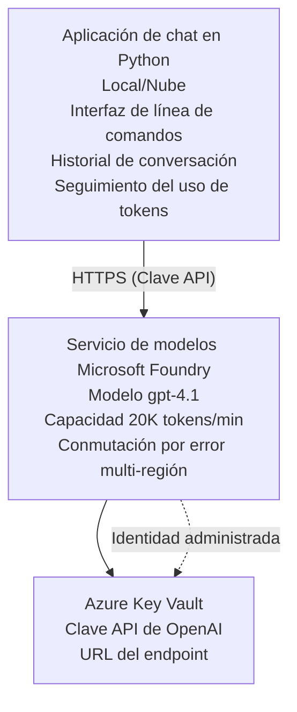

# Aplicación de chat de Microsoft Foundry Models

**Ruta de aprendizaje:** Intermedio ⭐⭐ | **Tiempo:** 35-45 minutos | **Costo:** $50-200/mes

Una aplicación de chat completa de Microsoft Foundry Models desplegada usando Azure Developer CLI (azd). Este ejemplo demuestra el despliegue de gpt-4.1, acceso seguro a la API y una interfaz de chat sencilla.

## 🎯 Qué aprenderás

- Desplegar Microsoft Foundry Models Service con el modelo gpt-4.1
- Asegurar las claves API de OpenAI con Key Vault
- Construir una interfaz de chat sencilla con Python
- Monitorear el uso de tokens y costos
- Implementar limitación de tasa y manejo de errores

## 📦 Qué incluye

✅ **Microsoft Foundry Models Service** - despliegue del modelo gpt-4.1  
✅ **Python Chat App** - Interfaz de chat simple en línea de comandos  
✅ **Key Vault Integration** - Almacenamiento seguro de claves API  
✅ **ARM Templates** - Infraestructura como código completa  
✅ **Cost Monitoring** - Seguimiento del uso de tokens  
✅ **Rate Limiting** - Prevención del agotamiento de cuota  

## Arquitectura



## Requisitos previos

### Requerido

- **Azure Developer CLI (azd)** - [Guía de instalación](https://learn.microsoft.com/azure/developer/azure-developer-cli/install-azd)
- **Suscripción de Azure** con acceso a OpenAI - [Solicitar acceso](https://aka.ms/oai/access)
- **Python 3.9+** - [Instalar Python](https://www.python.org/downloads/)

### Verificar requisitos previos

```bash
# Comprobar la versión de azd (se necesita 1.5.0 o superior)
azd version

# Verificar inicio de sesión en Azure
azd auth login

# Comprobar la versión de Python
python --version  # o python3 --version

# Verificar el acceso a OpenAI (comprobar en el Portal de Azure)
az cognitiveservices account list-skus \
  --kind OpenAI \
  --location eastus
```

> **⚠️ Importante:** Microsoft Foundry Models requiere aprobación de la aplicación. Si no has solicitado acceso, visita [aka.ms/oai/access](https://aka.ms/oai/access). La aprobación normalmente tarda 1-2 días hábiles.

## ⏱️ Cronograma de despliegue

| Fase | Duración | Qué sucede |
|-------|----------|--------------|
| Verificación de requisitos previos | 2-3 minutos | Verificar disponibilidad de cuota de OpenAI |
| Desplegar infraestructura | 8-12 minutos | Crear OpenAI, Key Vault, despliegue del modelo |
| Configurar la aplicación | 2-3 minutos | Configurar entorno y dependencias |
| **Total** | **12-18 minutes** | Listo para chatear con gpt-4.1 |

**Nota:** El primer despliegue de OpenAI puede tardar más debido a la provisión del modelo.

## Inicio rápido

```bash
# Navega al ejemplo
cd examples/azure-openai-chat

# Inicializa el entorno
azd env new myopenai

# Despliega todo (infraestructura + configuración)
azd up
# Se te pedirá que:
# 1. Selecciona la suscripción de Azure
# 2. Elige una ubicación con disponibilidad de OpenAI (por ejemplo, eastus, eastus2, westus)
# 3. Espera 12-18 minutos para el despliegue

# Instala las dependencias de Python
pip install -r requirements.txt

# ¡Empieza a chatear!
python chat.py
```

**Salida esperada:**
```
🤖 Microsoft Foundry Models Chat Application
Connected to: gpt-4.1 (eastus)
Type your message (or 'quit' to exit)

You: Hello! Tell me about Microsoft Foundry Models.
Assistant: Microsoft Foundry Models Service provides REST API access to OpenAI's powerful language models including gpt-4.1, GPT-3.5-Turbo, and Embeddings...

[Tokens used: 145 | Estimated cost: $0.0044]
```

## ✅ Verificar despliegue

### Paso 1: Comprobar recursos de Azure

```bash
# Ver recursos desplegados
azd show

# La salida esperada muestra:
# - Servicio de OpenAI: (nombre del recurso)
# - Cofre de claves: (nombre del recurso)
# - Despliegue: gpt-4.1
# - Ubicación: eastus (o la región seleccionada)
```

### Paso 2: Probar la API de OpenAI

```bash
# Obtener el endpoint y la clave de OpenAI
OPENAI_ENDPOINT=$(azd env get-value AZURE_OPENAI_ENDPOINT)
OPENAI_KEY=$(azd env get-value AZURE_OPENAI_API_KEY)

# Probar la llamada a la API
curl "$OPENAI_ENDPOINT/openai/deployments/gpt-4.1/chat/completions?api-version=2024-08-01-preview" \
  -H "Content-Type: application/json" \
  -H "api-key: $OPENAI_KEY" \
  -d '{
    "messages": [{"role": "user", "content": "Say hello!"}],
    "max_tokens": 50
  }'
```

**Respuesta esperada:**
```json
{
  "choices": [
    {
      "message": {
        "role": "assistant",
        "content": "Hello! How can I assist you today?"
      }
    }
  ],
  "usage": {
    "prompt_tokens": 8,
    "completion_tokens": 9,
    "total_tokens": 17
  }
}
```

### Paso 3: Verificar acceso a Key Vault

```bash
# Listar secretos en Key Vault
KV_NAME=$(azd env get-value AZURE_KEY_VAULT_NAME)

az keyvault secret list \
  --vault-name $KV_NAME \
  --query "[].name" \
  --output table
```

**Secretos esperados:**
- `openai-api-key`
- `openai-endpoint`

**Criterios de éxito:**
- ✅ Servicio de OpenAI desplegado con gpt-4.1
- ✅ La llamada a la API devuelve una completación válida
- ✅ Secretos almacenados en Key Vault
- ✅ El seguimiento de uso de tokens funciona

## Estructura del proyecto

```
azure-openai-chat/
├── README.md                   ✅ This guide
├── azure.yaml                  ✅ AZD configuration
├── infra/                      ✅ Infrastructure as Code
│   ├── main.bicep             ✅ Main Bicep template
│   ├── main.parameters.json   ✅ Parameters
│   └── openai.bicep           ✅ OpenAI resource definition
├── src/                        ✅ Application code
│   ├── chat.py                ✅ Chat interface
│   ├── config.py              ✅ Configuration loader
│   └── requirements.txt       ✅ Python dependencies
└── .gitignore                  ✅ Git ignore rules
```

## Características de la aplicación

### Interfaz de chat (`chat.py`)

La aplicación de chat incluye:

- **Historial de conversación** - Mantiene el contexto entre mensajes
- **Conteo de tokens** - Rastrea el uso y estima costos
- **Manejo de errores** - Manejo elegante de límites de tasa y errores de API
- **Estimación de costos** - Cálculo en tiempo real del costo por mensaje
- **Soporte de streaming** - Respuestas en streaming opcionales

### Comandos

Mientras chateas, puedes usar:
- `quit` or `exit` - Finalizar la sesión
- `clear` - Borrar historial de conversación
- `tokens` - Mostrar uso total de tokens
- `cost` - Mostrar costo total estimado

### Configuración (`config.py`)

Carga la configuración desde variables de entorno:
```python
AZURE_OPENAI_ENDPOINT  # Desde Key Vault
AZURE_OPENAI_API_KEY   # Desde Key Vault
AZURE_OPENAI_MODEL     # Predeterminado: gpt-4.1
AZURE_OPENAI_MAX_TOKENS # Predeterminado: 800
```

## Ejemplos de uso

### Chat básico

```bash
python chat.py
```

### Chat con modelo personalizado

```bash
export AZURE_OPENAI_MODEL=gpt-35-turbo
python chat.py
```

### Chat con streaming

```bash
python chat.py --stream
```

### Conversación de ejemplo

```
You: Explain Microsoft Foundry Models Service in 3 sentences.
Assistant: Microsoft Foundry Models Service is Microsoft Azure's cloud platform offering 
that provides access to OpenAI's powerful language models. It enables developers 
to integrate capabilities like gpt-4.1 into their applications with enterprise-grade 
security and compliance. The service includes features for content filtering, 
abuse monitoring, and responsible AI practices.

[Tokens used: 89 | Estimated cost: $0.0027]

You: What models are available?
Assistant: Microsoft Foundry Models Service offers several model families including gpt-4.1 
(most capable), GPT-3.5-Turbo (faster and cost-effective), and Embeddings models 
for vector search. Each model has different capabilities, pricing, and token limits.

[Tokens used: 67 | Estimated cost: $0.0020]

Total session: 156 tokens | $0.0047
```

## Gestión de costos

### Precio de tokens (gpt-4.1)

| Modelo | Entrada (por 1K tokens) | Salida (por 1K tokens) |
|-------|----------------------|------------------------|
| gpt-4.1 | $0.03 | $0.06 |
| GPT-3.5-Turbo | $0.0015 | $0.002 |

### Costos mensuales estimados

Basado en patrones de uso:

| Nivel de uso | Mensajes/día | Tokens/día | Costo mensual |
|-------------|--------------|------------|--------------|
| **Ligero** | 20 messages | 3,000 tokens | $3-5 |
| **Moderado** | 100 messages | 15,000 tokens | $15-25 |
| **Intenso** | 500 messages | 75,000 tokens | $75-125 |

**Costo base de infraestructura:** $1-2/mes (Key Vault + cómputo mínimo)

### Consejos para optimizar costos

```bash
# 1. Use GPT-3.5-Turbo para tareas más sencillas (20 veces más barato)
export AZURE_OPENAI_MODEL=gpt-35-turbo

# 2. Reducir el número máximo de tokens para respuestas más cortas
export AZURE_OPENAI_MAX_TOKENS=400

# 3. Supervisar el uso de tokens
python chat.py --show-tokens

# 4. Configurar alertas de presupuesto
az consumption budget create \
  --budget-name "openai-budget" \
  --amount 50 \
  --time-grain Monthly
```

## Monitoreo

### Ver uso de tokens

```bash
# En el Portal de Azure:
# Recurso de OpenAI → Métricas → Seleccione "Transacción de tokens"

# O mediante Azure CLI:
az monitor metrics list \
  --resource $(azd env get-value AZURE_OPENAI_RESOURCE_ID) \
  --metric "TokenTransaction" \
  --start-time $(date -u -d '1 hour ago' '+%Y-%m-%dT%H:%M:%S') \
  --interval PT1M
```

### Ver registros de la API

```bash
# Transmitir registros de diagnóstico
az monitor diagnostic-settings create \
  --resource $(azd env get-value AZURE_OPENAI_RESOURCE_ID) \
  --name openai-logs \
  --logs '[{"category": "Audit", "enabled": true}]' \
  --workspace $(azd env get-value LOG_ANALYTICS_WORKSPACE_ID)

# Consultar registros
az monitor log-analytics query \
  --workspace $(azd env get-value LOG_ANALYTICS_WORKSPACE_ID) \
  --analytics-query "AzureDiagnostics | where Category == 'Audit' | top 10 by TimeGenerated"
```

## Resolución de problemas

### Problema: Error "Access Denied"

**Síntomas:** 403 Forbidden al llamar a la API

**Soluciones:**
```bash
# 1. Verifique que el acceso a OpenAI esté aprobado
az cognitiveservices account show \
  --name $(azd env get-value AZURE_OPENAI_NAME) \
  --resource-group $(azd env get-value AZURE_RESOURCE_GROUP)

# 2. Compruebe que la clave de la API sea correcta
azd env get-value AZURE_OPENAI_API_KEY

# 3. Verifique el formato de la URL del endpoint
azd env get-value AZURE_OPENAI_ENDPOINT
# Debería ser: https://[name].openai.azure.com/
```

### Problema: "Rate Limit Exceeded"

**Síntomas:** 429 Too Many Requests

**Soluciones:**
```bash
# 1. Comprobar la cuota actual
az cognitiveservices account deployment show \
  --name $(azd env get-value AZURE_OPENAI_NAME) \
  --resource-group $(azd env get-value AZURE_RESOURCE_GROUP) \
  --deployment-name gpt-4.1

# 2. Solicitar aumento de cuota (si es necesario)
# Ir al Portal de Azure → Recurso de OpenAI → Cuotas → Solicitar aumento

# 3. Implementar lógica de reintentos (ya en chat.py)
# La aplicación reintenta automáticamente con retroceso exponencial
```

### Problema: "Model Not Found"

**Síntomas:** 404 error for deployment

**Soluciones:**
```bash
# 1. Listar implementaciones disponibles
az cognitiveservices account deployment list \
  --name $(azd env get-value AZURE_OPENAI_NAME) \
  --resource-group $(azd env get-value AZURE_RESOURCE_GROUP)

# 2. Verificar el nombre del modelo en el entorno
echo $AZURE_OPENAI_MODEL

# 3. Actualizar al nombre de implementación correcto
export AZURE_OPENAI_MODEL=gpt-4.1  # or gpt-35-turbo
```

### Problema: "High Latency"

**Síntomas:** Slow response times (>5 seconds)

**Soluciones:**
```bash
# 1. Comprobar la latencia regional
# Desplegar en la región más cercana a los usuarios

# 2. Reducir max_tokens para respuestas más rápidas
export AZURE_OPENAI_MAX_TOKENS=400

# 3. Usar streaming para una mejor experiencia de usuario
python chat.py --stream
```

## Mejores prácticas de seguridad

### 1. Protege las claves API

```bash
# Nunca incluyas claves en el control de código fuente
# Usa Key Vault (ya configurado)

# Rota las claves regularmente
az cognitiveservices account keys regenerate \
  --name $(azd env get-value AZURE_OPENAI_NAME) \
  --resource-group $(azd env get-value AZURE_RESOURCE_GROUP) \
  --key-name key1
```

### 2. Implementa filtrado de contenido

```python
# Microsoft Foundry Models incluye filtrado de contenido incorporado
# Configurar en el Portal de Azure:
# Recurso de OpenAI → Filtros de contenido → Crear filtro personalizado

# Categorías: Odio, Sexual, Violencia, Autolesiones
# Niveles: filtrado bajo, medio y alto
```

### 3. Usa Managed Identity (producción)

```bash
# Para implementaciones en producción, use identidad administrada
# en lugar de claves de API (requiere hospedar la aplicación en Azure)

# Actualice infra/openai.bicep para incluir:
# identity: { type: 'SystemAssigned' }
```

## Desarrollo

### Ejecutar localmente

```bash
# Instalar dependencias
pip install -r src/requirements.txt

# Establecer variables de entorno
export AZURE_OPENAI_ENDPOINT="https://[name].openai.azure.com/"
export AZURE_OPENAI_API_KEY="your-api-key"
export AZURE_OPENAI_MODEL="gpt-4.1"

# Ejecutar la aplicación
python src/chat.py
```

### Ejecutar pruebas

```bash
# Instalar dependencias para pruebas
pip install pytest pytest-cov

# Ejecutar pruebas
pytest tests/ -v

# Con cobertura
pytest tests/ --cov=src --cov-report=html
```

### Actualizar despliegue del modelo

```bash
# Desplegar una versión diferente del modelo
az cognitiveservices account deployment create \
  --name $(azd env get-value AZURE_OPENAI_NAME) \
  --resource-group $(azd env get-value AZURE_RESOURCE_GROUP) \
  --deployment-name gpt-35-turbo \
  --model-name gpt-35-turbo \
  --model-version "0613" \
  --model-format OpenAI \
  --sku-capacity 20 \
  --sku-name "Standard"
```

## Limpieza

```bash
# Eliminar todos los recursos de Azure
azd down --force --purge

# Esto elimina:
# - Servicio de OpenAI
# - Key Vault (con eliminación suave de 90 días)
# - Grupo de recursos
# - Todas las implementaciones y configuraciones
```

## Próximos pasos

### Amplía este ejemplo

1. **Agregar interfaz web** - Build React/Vue frontend
   ```bash
   # Agregar servicio frontend a azure.yaml
   # Desplegar en Azure Static Web Apps
   ```

2. **Implementar RAG** - Agregar búsqueda de documentos con Azure AI Search
   ```python
   # Integrar Azure AI Search
   # Subir documentos y crear índice vectorial
   ```

3. **Agregar llamadas a funciones** - Habilitar uso de herramientas
   ```python
   # Define funciones en chat.py
   # Permitir que gpt-4.1 llame a APIs externas
   ```

4. **Soporte multi-modelo** - Desplegar múltiples modelos
   ```bash
   # Agregar gpt-35-turbo, modelos de embeddings
   # Implementar la lógica de enrutamiento de modelos
   ```

### Ejemplos relacionados

- **[Retail Multi-Agent](../retail-scenario.md)** - Arquitectura avanzada de multi-agentes
- **[Database App](../../../../examples/database-app)** - Agregar almacenamiento persistente
- **[Container Apps](../../../../examples/container-app)** - Desplegar como servicio en contenedores

### Recursos de aprendizaje

- 📚 [AZD For Beginners Course](../../README.md) - Página principal del curso
- 📚 [Microsoft Foundry Models Documentation](https://learn.microsoft.com/azure/ai-services/openai/) - Documentación oficial
- 📚 [OpenAI API Reference](https://platform.openai.com/docs/api-reference) - Detalles de la API
- 📚 [Responsible AI](https://www.microsoft.com/ai/responsible-ai) - Mejores prácticas

## Recursos adicionales

### Documentación
- **[Microsoft Foundry Models Service](https://learn.microsoft.com/azure/ai-services/openai/)** - Guía completa
- **[gpt-4.1 Models](https://learn.microsoft.com/azure/ai-services/openai/concepts/models)** - Capacidades del modelo
- **[Content Filtering](https://learn.microsoft.com/azure/ai-services/openai/concepts/content-filter)** - Funciones de seguridad
- **[Azure Developer CLI](https://learn.microsoft.com/azure/developer/azure-developer-cli/)** - Referencia de azd

### Tutoriales
- **[OpenAI Quickstart](https://learn.microsoft.com/azure/ai-services/openai/quickstart)** - Primer despliegue
- **[Chat Completions](https://learn.microsoft.com/azure/ai-services/openai/how-to/chatgpt)** - Cómo construir aplicaciones de chat
- **[Function Calling](https://learn.microsoft.com/azure/ai-services/openai/how-to/function-calling)** - Funciones avanzadas

### Herramientas
- **[Microsoft Foundry Models Studio](https://oai.azure.com/)** - Playground web
- **[Prompt Engineering Guide](https://platform.openai.com/docs/guides/prompt-engineering)** - Cómo escribir mejores prompts
- **[Token Calculator](https://platform.openai.com/tokenizer)** - Estimar el uso de tokens

### Comunidad
- **[Azure AI Discord](https://discord.gg/azure)** - Obtén ayuda de la comunidad
- **[GitHub Discussions](https://github.com/Azure-Samples/openai/discussions)** - Foro de preguntas y respuestas
- **[Azure Blog](https://azure.microsoft.com/blog/tag/azure-openai-service/)** - Últimas actualizaciones

---

**🎉 ¡Éxito!** Has desplegado Microsoft Foundry Models y creado una aplicación de chat funcional. Comienza a explorar las capacidades de gpt-4.1 y experimenta con diferentes indicaciones y casos de uso.

**¿Preguntas?** [Abre un issue](https://github.com/microsoft/AZD-for-beginners/issues) o consulta las [Preguntas frecuentes](../../resources/faq.md)

**Alerta de costos:** Recuerda ejecutar `azd down` cuando termines las pruebas para evitar cargos continuos (~$50-100/mes por uso activo).

---

<!-- CO-OP TRANSLATOR DISCLAIMER START -->
**Descargo de responsabilidad**:
Este documento ha sido traducido utilizando el servicio de traducción automática [Co-op Translator](https://github.com/Azure/co-op-translator). Aunque nos esforzamos por la precisión, tenga en cuenta que las traducciones automatizadas pueden contener errores o inexactitudes. El documento original en su idioma nativo debe considerarse la fuente autorizada. Para información crítica, se recomienda una traducción profesional humana. No somos responsables de cualquier malentendido o interpretación errónea que surja del uso de esta traducción.
<!-- CO-OP TRANSLATOR DISCLAIMER END -->