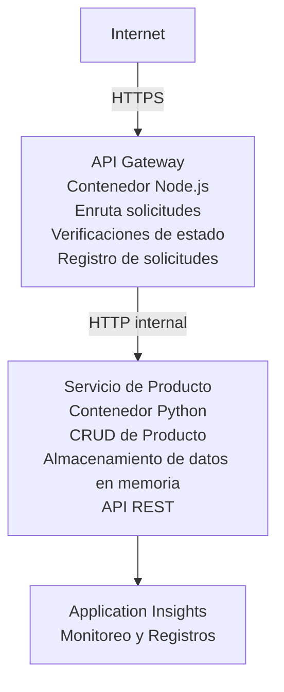

# Arquitectura de Microservicios - Ejemplo de Aplicación en Contenedores

⏱️ **Tiempo Estimado**: 25-35 minutos | 💰 **Costo Estimado**: ~$50-100/mes | ⭐ **Complejidad**: Avanzado

Una arquitectura de microservicios **simplificada pero funcional** desplegada en Azure Container Apps usando AZD CLI. Este ejemplo demuestra comunicación entre servicios, orquestación de contenedores y monitoreo con una configuración práctica de 2 servicios.

> **📚 Enfoque de Aprendizaje**: Este ejemplo comienza con una arquitectura mínima de 2 servicios (API Gateway + Servicio Backend) que puedes desplegar y aprender realmente. Tras dominar esta base, ofrecemos orientación para expandir a un ecosistema completo de microservicios.

## Lo Que Aprenderás

Al completar este ejemplo, podrás:
- Desplegar múltiples contenedores en Azure Container Apps
- Implementar comunicación entre servicios con red interna
- Configurar escalado basado en el entorno y verificaciones de salud
- Monitorear aplicaciones distribuidas con Application Insights
- Entender patrones y mejores prácticas de despliegue de microservicios
- Aprender expansión progresiva de arquitecturas simples a complejas

## Arquitectura

### Fase 1: Lo que Construimos (Incluido en Este Ejemplo)


**¿Por qué Empezar Simple?**
- ✅ Desplegar y entender rápidamente (25-35 minutos)
- ✅ Aprender patrones clave de microservicios sin complejidad
- ✅ Código funcional que puedes modificar y experimentar
- ✅ Menor costo para aprendizaje (~$50-100/mes vs $300-1400/mes)
- ✅ Generar confianza antes de añadir bases de datos y colas de mensajes

**Analogía**: Piensa en esto como aprender a conducir. Comienzas con un estacionamiento vacío (2 servicios), dominas lo básico y luego avanzas al tráfico de la ciudad (5+ servicios con bases de datos).

### Fase 2: Expansión Futura (Arquitectura de Referencia)

Una vez domines la arquitectura de 2 servicios, puedes expandir a:

```
Full Architecture (Not Included - For Reference)
├── API Gateway (✅ Included)
├── Product Service (✅ Included)
├── Order Service (🔜 Add next)
├── User Service (🔜 Add next)
├── Notification Service (🔜 Add last)
├── Azure Service Bus (🔜 For async communication)
├── Cosmos DB (🔜 For product persistence)
├── Azure SQL (🔜 For order management)
└── Azure Storage (🔜 For file storage)
```

Consulta la sección "Guía de Expansión" al final para instrucciones paso a paso.

## Funciones Incluidas

✅ **Descubrimiento de Servicios**: Descubrimiento automático basado en DNS entre contenedores  
✅ **Balanceo de Carga**: Balanceo integrado entre réplicas  
✅ **Auto-escalado**: Escalado independiente por servicio basado en solicitudes HTTP  
✅ **Monitoreo de Salud**: Probes de liveness y readiness para ambos servicios  
✅ **Registro Distribuido**: Registro centralizado con Application Insights  
✅ **Red Interna**: Comunicación segura entre servicios  
✅ **Orquestación de Contenedores**: Despliegue y escalado automático  
✅ **Actualizaciones Sin Tiempo de Inactividad**: Actualizaciones rolling con gestión de revisiones  

## Requisitos Previos

### Herramientas Requeridas

Antes de empezar, verifica que tengas estas herramientas instaladas:

1. **[Azure Developer CLI (azd)](https://learn.microsoft.com/azure/developer/azure-developer-cli/install-azd)** (versión 1.0.0 o superior)
   ```bash
   azd version
   # Salida esperada: versión azd 1.0.0 o superior
   ```

2. **[Azure CLI](https://learn.microsoft.com/cli/azure/install-azure-cli)** (versión 2.50.0 o superior)
   ```bash
   az --version
   # Salida esperada: azure-cli 2.50.0 o superior
   ```

3. **[Docker](https://www.docker.com/get-started)** (para desarrollo/pruebas local - opcional)
   ```bash
   docker --version
   # Salida esperada: versión de Docker 20.10 o superior
   ```

### Requisitos de Azure

- Una **suscripción activa de Azure** ([crea una cuenta gratuita](https://azure.microsoft.com/free/))
- Permisos para crear recursos en tu suscripción
- Rol de **Colaborador** en la suscripción o grupo de recursos

### Conocimientos Previos

Este es un ejemplo de nivel **avanzado**. Debes tener:
- Haber completado el [ejemplo Simple Flask API](../../../../../examples/container-app/simple-flask-api) 
- Entendimiento básico de arquitectura de microservicios
- Familiaridad con APIs REST y HTTP
- Conocimiento de conceptos de contenedores

**¿Nuevo en Container Apps?** Comienza primero con el [ejemplo Simple Flask API](../../../../../examples/container-app/simple-flask-api) para aprender lo básico.

## Inicio Rápido (Paso a Paso)

### Paso 1: Clonar y Navegar

```bash
git clone https://github.com/microsoft/AZD-for-beginners.git
cd AZD-for-beginners/examples/container-app/microservices
```

**✓ Verificación de Éxito**: Asegúrate de ver `azure.yaml`:
```bash
ls
# Esperado: README.md, azure.yaml, infra/, src/
```

### Paso 2: Autenticar con Azure

```bash
azd auth login
```

Esto abrirá tu navegador para autenticación en Azure. Inicia sesión con tus credenciales de Azure.

**✓ Verificación de Éxito**: Debes ver:
```
Logged in to Azure.
```

### Paso 3: Inicializar el Entorno

```bash
azd init
```

**Prompts que verás**:
- **Nombre del entorno**: Ingresa un nombre corto (ej., `microservices-dev`)
- **Suscripción de Azure**: Selecciona tu suscripción
- **Ubicación de Azure**: Elige una región (ej., `eastus`, `westeurope`)

**✓ Verificación de Éxito**: Debes ver:
```
SUCCESS: New project initialized!
```

### Paso 4: Desplegar Infraestructura y Servicios

```bash
azd up
```

**Qué sucede** (toma 8-12 minutos):
1. Crea ambiente de Container Apps
2. Crea Application Insights para monitoreo
3. Construye contenedor API Gateway (Node.js)
4. Construye contenedor Product Service (Python)
5. Despliega ambos contenedores a Azure
6. Configura red y verificaciones de salud
7. Configura monitoreo y logging

**✓ Verificación de Éxito**: Debes ver:
```
SUCCESS: Your application was deployed to Azure in X minutes Y seconds.
Endpoint: https://api-gateway-<unique-id>.azurecontainerapps.io
```

**⏱️ Tiempo**: 8-12 minutos

### Paso 5: Probar el Despliegue

```bash
# Obtener el punto final del gateway
GATEWAY_URL=$(azd env get-values | grep API_GATEWAY_URL | cut -d '=' -f2 | tr -d '"')

# Probar el estado de salud del API Gateway
curl $GATEWAY_URL/health

# Salida esperada:
# {"status":"healthy","service":"api-gateway","timestamp":"2025-11-19T10:30:00Z"}
```

**Prueba el servicio de productos a través del gateway**:
```bash
# Listar productos
curl $GATEWAY_URL/api/products

# Salida esperada:
# [
#   {"id":1,"name":"Laptop","price":999.99,"stock":50},
#   {"id":2,"name":"Mouse","price":29.99,"stock":200},
#   {"id":3,"name":"Keyboard","price":79.99,"stock":150}
# ]
```

**✓ Verificación de Éxito**: Ambos endpoints devuelven datos JSON sin errores.

---

**🎉 ¡Felicidades!** ¡Has desplegado una arquitectura de microservicios en Azure!

## Estructura del Proyecto

Todos los archivos de implementación están incluidos — este es un ejemplo completo y funcional:

```
microservices/
│
├── README.md                         # This file
├── azure.yaml                        # AZD configuration
├── .gitignore                        # Git ignore patterns
│
├── infra/                           # Infrastructure as Code (Bicep)
│   ├── main.bicep                   # Main orchestration
│   ├── abbreviations.json           # Naming conventions
│   ├── core/                        # Shared infrastructure
│   │   ├── container-apps-environment.bicep  # Container environment + registry
│   │   └── monitor.bicep            # Application Insights + Log Analytics
│   └── app/                         # Service definitions
│       ├── api-gateway.bicep        # API Gateway container app
│       └── product-service.bicep    # Product Service container app
│
└── src/                             # Application source code
    ├── api-gateway/                 # Node.js API Gateway
    │   ├── app.js                   # Express server with routing
    │   ├── package.json             # Node dependencies
    │   └── Dockerfile               # Container definition
    └── product-service/             # Python Product Service
        ├── main.py                  # Flask API with product data
        ├── requirements.txt         # Python dependencies
        └── Dockerfile               # Container definition
```

**Qué Hace Cada Componente:**

**Infraestructura (infra/)**:
- `main.bicep`: Orquesta todos los recursos de Azure y sus dependencias
- `core/container-apps-environment.bicep`: Crea el ambiente Container Apps y el Registro de Contenedores de Azure
- `core/monitor.bicep`: Configura Application Insights para logging distribuido
- `app/*.bicep`: Definiciones individuales de apps de contenedor con escalado y chequeos de salud

**API Gateway (src/api-gateway/)**:
- Servicio público que enruta peticiones a servicios backend
- Implementa logging, manejo de errores y reenvío de solicitudes
- Demuestra comunicación HTTP entre servicios

**Product Service (src/product-service/)**:
- Servicio interno con catálogo de productos (en memoria para simplicidad)
- API REST con verificaciones de salud
- Ejemplo de patrón de microservicio backend

## Resumen de Servicios

### API Gateway (Node.js/Express)

**Puerto**: 8080  
**Acceso**: Público (ingreso externo)  
**Propósito**: Enrutar solicitudes entrantes a servicios backend  

**Endpoints**:
- `GET /` - Información del servicio
- `GET /health` - Endpoint de chequeo de salud
- `GET /api/products` - Reenvía a product service (listado completo)
- `GET /api/products/:id` - Reenvía a product service (por ID)

**Características Clave**:
- Enrutamiento de solicitudes con axios
- Logging centralizado
- Manejo de errores y gestión de timeout
- Descubrimiento de servicios vía variables de entorno
- Integración con Application Insights

**Código Destacado** (`src/api-gateway/app.js`):
```javascript
// Comunicación interna del servicio
app.get('/api/products', async (req, res) => {
  const response = await axios.get(`${PRODUCT_SERVICE_URL}/products`);
  res.json(response.data);
});
```

### Product Service (Python/Flask)

**Puerto**: 8000  
**Acceso**: Solo interno (sin ingreso externo)  
**Propósito**: Gestiona catálogo de productos con datos en memoria  

**Endpoints**:
- `GET /` - Información del servicio
- `GET /health` - Endpoint de chequeo de salud
- `GET /products` - Lista todos los productos
- `GET /products/<id>` - Obtiene producto por ID

**Características Clave**:
- API RESTful con Flask
- Almacén de productos en memoria (simple, sin base de datos)
- Monitoreo de salud con probes
- Logging estructurado
- Integración con Application Insights

**Modelo de Datos**:
```python
{
  "id": 1,
  "name": "Laptop",
  "description": "High-performance laptop",
  "price": 999.99,
  "stock": 50
}
```

**¿Por qué solo Interno?**
El servicio de productos no está expuesto públicamente. Todas las solicitudes deben pasar por el API Gateway, que proporciona:
- Seguridad: Punto de acceso controlado
- Flexibilidad: Se puede cambiar el backend sin afectar clientes
- Monitoreo: Logging centralizado de solicitudes

## Entendiendo la Comunicación entre Servicios

### Cómo se Comunican los Servicios

En este ejemplo, el API Gateway se comunica con el Product Service usando **llamadas HTTP internas**:

```javascript
// Pasarela API (src/api-gateway/app.js)
const PRODUCT_SERVICE_URL = process.env.PRODUCT_SERVICE_URL;

// Realizar solicitud HTTP interna
const response = await axios.get(`${PRODUCT_SERVICE_URL}/products`);
```

**Puntos Clave**:

1. **Descubrimiento basado en DNS**: Container Apps proporciona automáticamente DNS para servicios internos
   - FQDN del Product Service: `product-service.internal.<environment>.azurecontainerapps.io`
   - Simplificado como: `http://product-service` (Container Apps lo resuelve)

2. **No Exposición Pública**: El Product Service tiene `external: false` en Bicep
   - Solo accesible dentro del ambiente de Container Apps
   - No puede ser accedido desde internet

3. **Variables de Entorno**: Las URLs de servicio se inyectan en tiempo de despliegue
   - Bicep pasa el FQDN interno al gateway
   - No hay URLs codificadas en la aplicación

**Analogía**: Es como oficinas. El API Gateway es la recepción (público), y el Product Service es una oficina (solo interna). Los visitantes deben pasar por recepción para acceder a las oficinas.

## Opciones de Despliegue

### Despliegue Completo (Recomendado)

```bash
# Desplegar infraestructura y ambos servicios
azd up
```

Esto despliega:
1. Ambiente Container Apps
2. Application Insights
3. Registro de Contenedores
4. Contenedor API Gateway
5. Contenedor Product Service

**Tiempo**: 8-12 minutos

### Desplegar Servicio Individual

```bash
# Desplegar solo un servicio (después del azd up inicial)
azd deploy api-gateway

# O desplegar el servicio de producto
azd deploy product-service
```

**Caso de Uso**: Cuando actualizas el código de un servicio y quieres redeplegar solo ese servicio.

### Actualizar Configuración

```bash
# Cambiar parámetros de escala
azd env set GATEWAY_MAX_REPLICAS 30

# Reimplementar con nueva configuración
azd up
```

## Configuración

### Configuración de Escalado

Ambos servicios están configurados con autoscaling basado en HTTP en sus archivos Bicep:

**API Gateway**:
- Réplicas mínimas: 2 (siempre al menos 2 para disponibilidad)
- Réplicas máximas: 20
- Disparador de escalado: 50 solicitudes concurrentes por réplica

**Product Service**:
- Réplicas mínimas: 1 (puede escalar a cero si es necesario)
- Réplicas máximas: 10
- Disparador de escalado: 100 solicitudes concurrentes por réplica

**Personalizar Escalado** (en `infra/app/*.bicep`):
```bicep
scale: {
  minReplicas: 1
  maxReplicas: 10
  rules: [
    {
      name: 'http-scale-rule'
      http: {
        metadata: {
          concurrentRequests: '100'  // Adjust this
        }
      }
    }
  ]
}
```

### Asignación de Recursos

**API Gateway**:
- CPU: 1.0 vCPU
- Memoria: 2 GiB
- Razón: Maneja todo el tráfico externo

**Product Service**:
- CPU: 0.5 vCPU
- Memoria: 1 GiB
- Razón: Operaciones ligeras en memoria

### Chequeos de Salud

Ambos servicios incluyen probes de liveness y readiness:

```bicep
probes: [
  {
    type: 'Liveness'
    httpGet: {
      path: '/health'
      port: 8080
    }
    initialDelaySeconds: 10
    periodSeconds: 30
  }
  {
    type: 'Readiness'
    httpGet: {
      path: '/health'
      port: 8080
    }
    initialDelaySeconds: 5
    periodSeconds: 10
  }
]
```

**Qué Significa Esto**:
- **Liveness**: Si falla el chequeo, Container Apps reinicia el contenedor
- **Readiness**: Si no está listo, Container Apps deja de enviar tráfico a esa réplica


## Monitoreo y Observabilidad

### Ver Logs del Servicio

```bash
# Ver registros usando azd monitor
azd monitor --logs

# O usa Azure CLI para aplicaciones de contenedor específicas:
# Transmitir registros desde API Gateway
az containerapp logs show --name api-gateway --resource-group $RG_NAME --follow

# Ver registros recientes del servicio de productos
az containerapp logs show --name product-service --resource-group $RG_NAME --tail 100
```

**Salida Esperada**:
```
[api-gateway] API Gateway listening on port 8080
[api-gateway] Product Service URL: http://product-service
[api-gateway] GET /api/products 200 - 45ms
[product-service] Retrieved 5 products
```

### Consultas en Application Insights

Accede a Application Insights en Azure Portal y ejecuta estas consultas:

**Encontrar Solicitudes Lentas**:
```kusto
requests
| where timestamp > ago(1h)
| where duration > 1000  // Requests taking >1 second
| summarize count() by name, cloud_RoleName
| order by count_ desc
```

**Seguimiento de Llamadas entre Servicios**:
```kusto
dependencies
| where timestamp > ago(1h)
| where type == "Http"
| project timestamp, name, target, duration, success
| order by timestamp desc
```

**Tasa de Errores por Servicio**:
```kusto
exceptions
| where timestamp > ago(24h)
| summarize errorCount = count() by cloud_RoleName, type
| order by errorCount desc
```

**Volumen de Solicitudes en el Tiempo**:
```kusto
requests
| where timestamp > ago(1h)
| summarize requestCount = count() by bin(timestamp, 5m), cloud_RoleName
| render timechart
```

### Acceder al Panel de Monitoreo

```bash
# Obtener detalles de Application Insights
azd env get-values | grep APPLICATIONINSIGHTS

# Abrir el monitoreo del Portal de Azure
az monitor app-insights component show \
  --app $(azd env get-values | grep APPLICATIONINSIGHTS_CONNECTION_STRING | cut -d '=' -f2) \
  --resource-group $(azd env get-values | grep AZURE_RESOURCE_GROUP | cut -d '=' -f2) \
  --query "appId" -o tsv
```

### Métricas en Vivo

1. Navega a Application Insights en Azure Portal
2. Haz clic en "Live Metrics"
3. Visualiza solicitudes en tiempo real, fallos y desempeño
4. Prueba ejecutando: `curl $(azd env get-values | grep API_GATEWAY_URL | cut -d '=' -f2 | tr -d '"')/api/products`

## Ejercicios Prácticos

[Nota: Consulta los ejercicios completos más arriba en la sección "Practical Exercises" para ejercicios detallados paso a paso incluyendo verificación de despliegue, modificación de datos, pruebas de autoscaling, manejo de errores y añadir un tercer servicio.]

## Análisis de Costos

### Costos Mensuales Estimados (Para Este Ejemplo de 2 Servicios)

| Recurso | Configuración | Costo Estimado |
|----------|--------------|----------------|
| API Gateway | 2-20 réplicas, 1 vCPU, 2GB RAM | $30-150 |
| Product Service | 1-10 réplicas, 0.5 vCPU, 1GB RAM | $15-75 |
| Registro de Contenedores | Nivel básico | $5 |
| Application Insights | 1-2 GB/mes | $5-10 |
| Log Analytics | 1 GB/mes | $3 |
| **Total** | | **$58-243/mes** |

**Desglose por Uso**:
- **Tráfico ligero** (pruebas/aprendizaje): ~$60/mes
- **Tráfico moderado** (producción pequeña): ~$120/mes
- **Tráfico alto** (periodos ocupados): ~$240/mes

### Consejos para Optimizar Costos

1. **Escalar a Cero para Desarrollo**:
   ```bicep
   scale: {
     minReplicas: 0  // Save $30-40/month when not in use
     maxReplicas: 10
   }
   ```

2. **Usar Plan de Consumo para Cosmos DB** (cuando lo añadas):
   - Paga solo por lo que uses
   - Sin cargos mínimos

3. **Configurar Muestreo en Application Insights**:
   ```javascript
   appInsights.defaultClient.config.samplingPercentage = 50; // Muestrear el 50% de las solicitudes
   ```

4. **Limpiar Recursos cuando No se Necesiten**:
   ```bash
   azd down
   ```

### Opciones de Nivel Gratis

Para aprendizaje/pruebas, considera:
- Usa créditos gratuitos de Azure (primeros 30 días)
- Mantén el mínimo de réplicas
- Elimina después de las pruebas (sin cargos continuos)

---

## Limpieza

Para evitar cargos continuos, elimina todos los recursos:

```bash
azd down --force --purge
```

**Confirmación**:
```
? Total resources to delete: 6, are you sure you want to continue? (y/N)
```

Escribe `y` para confirmar.

**Qué se elimina**:
- Entorno de Container Apps
- Ambas Container Apps (gateway y servicio de producto)
- Registro de Contenedores
- Application Insights
- Espacio de trabajo de Log Analytics
- Grupo de recursos

**✓ Verificar limpieza**:
```bash
az group list --query "[?starts_with(name,'rg-microservices')]" --output table
```

Debería devolver vacío.

---

## Guía de Expansión: De 2 a 5+ Servicios

Una vez que domines esta arquitectura de 2 servicios, aquí te mostramos cómo expandirla:

### Fase 1: Agregar Persistencia de Base de Datos (Siguiente paso)

**Agregar Cosmos DB para el Servicio de Producto**:

1. Crear `infra/core/cosmos.bicep`:
   ```bicep
   resource cosmosAccount 'Microsoft.DocumentDB/databaseAccounts@2023-04-15' = {
     name: name
     location: location
     kind: 'GlobalDocumentDB'
     properties: {
       databaseAccountOfferType: 'Standard'
       locations: [{ locationName: location, failoverPriority: 0 }]
     }
   }
   ```

2. Actualizar el servicio de producto para usar Cosmos DB en lugar de datos en memoria

3. Costo adicional estimado: ~25 $/mes (serverless)

### Fase 2: Agregar Tercer Servicio (Gestión de Pedidos)

**Crear Servicio de Pedidos**:

1. Nueva carpeta: `src/order-service/` (Python/Node.js/C#)
2. Nuevo Bicep: `infra/app/order-service.bicep`
3. Actualizar API Gateway para enrutar `/api/orders`
4. Agregar Azure SQL Database para persistencia de pedidos

**La arquitectura queda así**:
```
API Gateway → Product Service (Cosmos DB)
           → Order Service (Azure SQL)
```

### Fase 3: Agregar Comunicación Asíncrona (Service Bus)

**Implementar Arquitectura Basada en Eventos**:

1. Agregar Azure Service Bus: `infra/core/servicebus.bicep`
2. Servicio de Producto publica eventos "ProductCreated"
3. Servicio de Pedidos se suscribe a eventos de producto
4. Agregar Servicio de Notificaciones para procesar eventos

**Patrón**: Solicitud/Respuesta (HTTP) + Basado en Eventos (Service Bus)

### Fase 4: Agregar Autenticación de Usuarios

**Implementar Servicio de Usuarios**:

1. Crear `src/user-service/` (Go/Node.js)
2. Agregar Azure AD B2C o autenticación JWT personalizada
3. API Gateway valida tokens
4. Servicios verifican permisos de usuario

### Fase 5: Preparación para Producción

**Agregar estos componentes**:
- Azure Front Door (balanceo de carga global)
- Azure Key Vault (gestión de secretos)
- Azure Monitor Workbooks (paneles personalizados)
- Pipeline CI/CD (GitHub Actions)
- Despliegues Blue-Green
- Managed Identity para todos los servicios

**Costo estimado de arquitectura de producción completa**: ~300-1,400 $/mes

---

## Aprende Más

### Documentación relacionada
- [Documentación de Azure Container Apps](https://learn.microsoft.com/azure/container-apps/)
- [Guía de Arquitectura de Microservicios](https://learn.microsoft.com/azure/architecture/guide/architecture-styles/microservices)
- [Application Insights para trazado distribuido](https://learn.microsoft.com/azure/azure-monitor/app/distributed-tracing)
- [Documentación de Azure Developer CLI](https://learn.microsoft.com/azure/developer/azure-developer-cli/)

### Próximos pasos en este curso
- ← Anterior: [Simple Flask API](../../../../../examples/container-app/simple-flask-api) - Ejemplo sencillo de un solo contenedor
- → Siguiente: [Guía de integración con IA](../../../../../examples/docs/ai-foundry) - Añadir capacidades de IA
- 🏠 [Inicio del curso](../../README.md)

### Comparación: Cuándo usar qué

**Aplicación de un solo contenedor** (Ejemplo Simple Flask API):
- ✅ Aplicaciones simples
- ✅ Arquitectura monolítica
- ✅ Despliegue rápido
- ❌ Escalabilidad limitada
- **Costo**: ~15-50 $/mes

**Microservicios** (este ejemplo):
- ✅ Aplicaciones complejas
- ✅ Escalado independiente por servicio
- ✅ Autonomía de equipos (diferentes servicios, diferentes equipos)
- ❌ Más complejo de gestionar
- **Costo**: ~60-250 $/mes

**Kubernetes (AKS)**:
- ✅ Máximo control y flexibilidad
- ✅ Portabilidad multicloud
- ✅ Redes avanzadas
- ❌ Requiere experiencia en Kubernetes
- **Costo**: mínimo ~150-500 $/mes

**Recomendación**: Comienza con Container Apps (este ejemplo), avanza a AKS solo si necesitas características específicas de Kubernetes.

---

## Preguntas Frecuentes

**P: ¿Por qué solo 2 servicios en lugar de 5+?**  
R: Progresión educativa. Domina los fundamentos (comunicación entre servicios, monitoreo, escalado) con un ejemplo simple antes de agregar complejidad. Los patrones que aprendes aquí se aplican a arquitecturas de 100 servicios.

**P: ¿Puedo agregar más servicios por mi cuenta?**  
R: ¡Claro que sí! Sigue la guía de expansión arriba. Cada nuevo servicio sigue el mismo patrón: crear carpeta src, crear archivo Bicep, actualizar azure.yaml, desplegar.

**P: ¿Esto está listo para producción?**  
R: Es una base sólida. Para producción, agrega: managed identity, Key Vault, bases de datos persistentes, pipeline CI/CD, alertas de monitoreo y estrategia de respaldo.

**P: ¿Por qué no usar Dapr u otra malla de servicios?**  
R: Manténlo simple para aprender. Una vez que entiendas la red nativa de Container Apps, puedes añadir Dapr para escenarios avanzados.

**P: ¿Cómo depuro localmente?**  
R: Ejecuta los servicios localmente con Docker:
```bash
cd src/api-gateway
docker build -t local-gateway .
docker run -p 8080:8080 -e PRODUCT_SERVICE_URL=http://localhost:8000 local-gateway
```

**P: ¿Puedo usar diferentes lenguajes de programación?**  
R: ¡Sí! Este ejemplo muestra Node.js (gateway) + Python (servicio de producto). Puedes mezclar cualquier lenguaje que se ejecute en contenedores.

**P: ¿Y si no tengo créditos de Azure?**  
R: Usa el nivel gratuito de Azure (primeros 30 días con cuentas nuevas) o despliega para períodos cortos de prueba y elimina inmediatamente.

---

> **🎓 Resumen del Camino de Aprendizaje**: Has aprendido a desplegar una arquitectura multi-servicio con escalado automático, red interna, monitoreo centralizado y patrones listos para producción. Esta base te prepara para sistemas distribuidos complejos y arquitecturas de microservicios empresariales.

**📚 Navegación del curso:**
- ← Anterior: [Simple Flask API](../../../../../examples/container-app/simple-flask-api)
- → Siguiente: [Ejemplo de integración de base de datos](../../../../../examples/database-app)
- 🏠 [Inicio del curso](../../../README.md)
- 📖 [Buenas prácticas de Container Apps](../../../docs/chapter-04-infrastructure/deployment-guide.md)

---

<!-- CO-OP TRANSLATOR DISCLAIMER START -->
**Descargo de responsabilidad**:
Este documento ha sido traducido utilizando el servicio de traducción automática [Co-op Translator](https://github.com/Azure/co-op-translator). Aunque nos esforzamos por lograr precisión, tenga en cuenta que las traducciones automáticas pueden contener errores o inexactitudes. El documento original en su idioma nativo debe considerarse la fuente autorizada. Para información crítica, se recomienda una traducción profesional realizada por un humano. No nos responsabilizamos por malentendidos o interpretaciones erróneas derivadas del uso de esta traducción.
<!-- CO-OP TRANSLATOR DISCLAIMER END -->