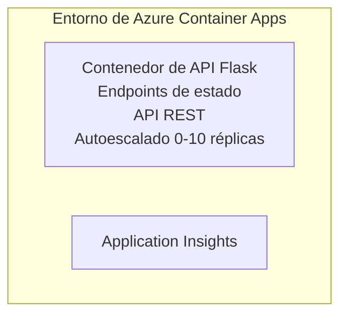

# Simple Flask API - Container App Example

**Ruta de aprendizaje:** Beginner ⭐ | **Tiempo:** 25-35 minutos | **Coste:** $0-15/month

Una API REST completa y funcional en Python Flask desplegada en Azure Container Apps usando Azure Developer CLI (azd). Este ejemplo demuestra despliegue de contenedores, escalado automático y conceptos básicos de supervisión.

## 🎯 Qué aprenderás

- Desplegar una aplicación Python en contenedores a Azure
- Configurar escalado automático con scale-to-zero
- Implementar sondas de estado y comprobaciones de disponibilidad
- Supervisar registros y métricas de la aplicación
- Usar Azure Developer CLI para despliegues rápidos

## 📦 Qué incluye

✅ **Flask Application** - API REST completa con operaciones CRUD (`src/app.py`)  
✅ **Dockerfile** - Configuración de contenedor preparada para producción  
✅ **Bicep Infrastructure** - Entorno de Container Apps y despliegue de la API  
✅ **AZD Configuration** - Configuración de despliegue con un solo comando  
✅ **Health Probes** - Sondas de liveness y readiness configuradas  
✅ **Auto-scaling** - 0-10 réplicas basado en carga HTTP  

## Architecture



## Prerequisites

### Required
- **Azure Developer CLI (azd)** - [Install guide](https://learn.microsoft.com/azure/developer/azure-developer-cli/install-azd)
- **Azure subscription** - [Free account](https://azure.microsoft.com/free/)
- **Docker Desktop** - [Install Docker](https://www.docker.com/products/docker-desktop/) (para pruebas locales)

### Verify Prerequisites

```bash
# Comprobar la versión de azd (requiere 1.5.0 o superior)
azd version

# Verificar inicio de sesión en Azure
azd auth login

# Comprobar Docker (opcional, para pruebas locales)
docker --version
```

## ⏱️ Cronograma de despliegue

| Phase | Duration | What Happens |
|-------|----------|--------------||
| Environment setup | 30 seconds | Create azd environment |
| Build container | 2-3 minutes | Docker build Flask app |
| Provision infrastructure | 3-5 minutes | Create Container Apps, registry, monitoring |
| Deploy application | 2-3 minutes | Push image and deploy to Container Apps |
| **Total** | **8-12 minutes** | Complete deployment ready |

## Inicio rápido

```bash
# Navegar al ejemplo
cd examples/container-app/simple-flask-api

# Iniciar el entorno (elegir un nombre único)
azd env new myflaskapi

# Desplegar todo (infraestructura + aplicación)
azd up
# Se le pedirá que:
# 1. Seleccione la suscripción de Azure
# 2. Elija la ubicación (p. ej., eastus2)
# 3. Espere entre 8 y 12 minutos para el despliegue

# Obtenga el endpoint de su API
azd env get-values

# Pruebe la API
curl $(azd env get-value API_ENDPOINT)/health
```

**Salida esperada:**
```json
{
  "status": "healthy",
  "timestamp": "2025-11-19T10:30:00Z",
  "service": "simple-flask-api",
  "version": "1.0.0"
}
```

## ✅ Verificar despliegue

### Paso 1: Comprobar el estado del despliegue

```bash
# Ver los servicios desplegados
azd show

# La salida esperada muestra:
# - Servicio: api
# - Punto de enlace: https://ca-api-[env].xxx.azurecontainerapps.io
# - Estado: En ejecución
```

### Paso 2: Probar endpoints de la API

```bash
# Obtener el endpoint de la API
API_URL=$(azd env get-value API_ENDPOINT)

# Comprobar el estado de salud
curl $API_URL/health

# Comprobar el endpoint raíz
curl $API_URL/

# Crear un elemento
curl -X POST $API_URL/api/items \
  -H "Content-Type: application/json" \
  -d '{"name": "Test Item", "description": "My first item"}'

# Obtener todos los elementos
curl $API_URL/api/items
```

**Criterios de éxito:**
- ✅ El endpoint de health devuelve HTTP 200
- ✅ El endpoint raíz muestra información de la API
- ✅ POST crea un elemento y devuelve HTTP 201
- ✅ GET devuelve los elementos creados

### Paso 3: Ver registros

```bash
# Transmitir registros en tiempo real usando azd monitor
azd monitor --logs

# O use la CLI de Azure:
az containerapp logs show --name api --resource-group $RG_NAME --follow

# Debería ver:
# - Mensajes de inicio de Gunicorn
# - Registros de solicitudes HTTP
# - Registros de información de la aplicación
```

## Estructura del proyecto

```
simple-flask-api/
├── azure.yaml              # AZD configuration
├── infra/
│   ├── main.bicep         # Main infrastructure
│   ├── main.parameters.json
│   └── app/
│       ├── container-env.bicep
│       └── api.bicep
└── src/
    ├── app.py             # Flask application
    ├── requirements.txt
    └── Dockerfile
```

## Endpoints de la API

| Endpoint | Method | Description |
|----------|--------|-------------|
| `/health` | GET | Health check |
| `/api/items` | GET | List all items |
| `/api/items` | POST | Create new item |
| `/api/items/{id}` | GET | Get specific item |
| `/api/items/{id}` | PUT | Update item |
| `/api/items/{id}` | DELETE | Delete item |

## Configuración

### Variables de entorno

```bash
# Establecer configuración personalizada
azd env set PORT 8000
azd env set LOG_LEVEL info
azd env set MAX_REPLICAS 20
```

### Configuración de escalado

La API escala automáticamente según el tráfico HTTP:
- **Min Replicas**: 0 (escala a cero cuando está inactiva)
- **Max Replicas**: 10
- **Concurrent Requests per Replica**: 50

## Desarrollo

### Ejecutar localmente

```bash
# Instalar dependencias
cd src
pip install -r requirements.txt

# Ejecutar la aplicación
python app.py

# Probar localmente
curl http://localhost:8000/health
```

### Construir y probar el contenedor

```bash
# Construir la imagen de Docker
docker build -t flask-api:local ./src

# Ejecutar el contenedor localmente
docker run -p 8000:8000 flask-api:local

# Probar el contenedor
curl http://localhost:8000/health
```

## Despliegue

### Despliegue completo

```bash
# Desplegar la infraestructura y la aplicación
azd up
```

### Despliegue solo de código

```bash
# Desplegar solo el código de la aplicación (infraestructura sin cambios)
azd deploy api
```

### Actualizar configuración

```bash
# Actualizar las variables de entorno
azd env set API_KEY "new-api-key"

# Volver a desplegar con la nueva configuración
azd deploy api
```

## Supervisión

### Ver registros

```bash
# Transmitir registros en vivo con azd monitor
azd monitor --logs

# O usa la Azure CLI para Container Apps:
az containerapp logs show --name api --resource-group $RG_NAME --follow

# Ver las últimas 100 líneas
az containerapp logs show --name api --resource-group $RG_NAME --tail 100
```

### Supervisar métricas

```bash
# Abrir el panel de Azure Monitor
azd monitor --overview

# Ver métricas específicas
az monitor metrics list \
  --resource $(azd show --output json | jq -r '.services.api.resourceId') \
  --metric "Requests,ResponseTime"
```

## Pruebas

### Comprobación de estado

```bash
curl $(azd show --output json | jq -r '.services.api.endpoint')/health
```

Respuesta esperada:
```json
{
  "status": "healthy",
  "timestamp": "2025-11-19T10:30:00Z"
}
```

### Crear elemento

```bash
curl -X POST $(azd show --output json | jq -r '.services.api.endpoint')/api/items \
  -H "Content-Type: application/json" \
  -d '{"name": "Test Item", "description": "A test item"}'
```

### Obtener todos los elementos

```bash
curl $(azd show --output json | jq -r '.services.api.endpoint')/api/items
```

## Optimización de costes

Este despliegue usa scale-to-zero, por lo que solo pagas cuando la API está procesando solicitudes:

- **Coste en inactividad**: ~$0/month (escalado a cero)
- **Coste activo**: ~$0.000024/second per replica
- **Coste mensual esperado** (uso ligero): $5-15

### Reducir costes aún más

```bash
# Reducir las réplicas máximas para desarrollo
azd env set MAX_REPLICAS 3

# Usar un tiempo de espera de inactividad más corto
azd env set SCALE_TO_ZERO_TIMEOUT 300  # 5 minutos
```

## Solución de problemas

### El contenedor no se inicia

```bash
# Consultar los registros del contenedor usando Azure CLI
az containerapp logs show --name api --resource-group $RG_NAME --tail 100

# Verificar que la imagen de Docker se construye localmente
docker build -t test ./src
```

### API no accesible

```bash
# Verificar que el Ingress sea externo
az containerapp show --name api --resource-group rg-simple-flask-api \
  --query properties.configuration.ingress.external
```

### Tiempos de respuesta elevados

```bash
# Comprobar el uso de CPU/memoria
az monitor metrics list \
  --resource $(azd show --output json | jq -r '.services.api.resourceId') \
  --metric "CPUPercentage,MemoryPercentage"

# Escalar recursos si es necesario
az containerapp update --name api --resource-group rg-simple-flask-api \
  --cpu 1.0 --memory 2Gi
```

## Limpieza

```bash
# Eliminar todos los recursos
azd down --force --purge
```

## Siguientes pasos

### Ampliar este ejemplo

1. **Add Database** - Integrar Azure Cosmos DB o SQL Database
   ```bash
   # Agregar el módulo de Cosmos DB a infra/main.bicep
   # Actualizar app.py con la conexión a la base de datos
   ```

2. **Add Authentication** - Implementar Microsoft Entra ID o claves de API
   ```python
   # Agregar middleware de autenticación a app.py
   from functools import wraps
   ```

3. **Set Up CI/CD** - Flujo de trabajo de GitHub Actions
   ```yaml
   # Create .github/workflows/deploy.yml
   name: Deploy to Azure
   on: [push]
   ```

4. **Add Managed Identity** - Asegurar el acceso a servicios de Azure
   ```bicep
   # Update infra/app/api.bicep
   identity: { type: 'SystemAssigned' }
   ```

### Ejemplos relacionados

- **[Database App](../../../../../examples/database-app)** - Ejemplo completo con Base de datos SQL
- **[Microservices](../../../../../examples/container-app/microservices)** - Arquitectura de múltiples servicios
- **[Container Apps Master Guide](../README.md)** - Todos los patrones de contenedores

### Recursos de aprendizaje

- 📚 [AZD For Beginners Course](../../../README.md) - Página principal del curso
- 📚 [Container Apps Patterns](../README.md) - Más patrones de despliegue
- 📚 [AZD Templates Gallery](https://azure.github.io/awesome-azd/) - Plantillas de la comunidad

## Recursos adicionales

### Documentación
- **[Flask Documentation](https://flask.palletsprojects.com/)** - Guía del framework Flask
- **[Azure Container Apps](https://learn.microsoft.com/azure/container-apps/)** - Documentación oficial de Azure
- **[Azure Developer CLI](https://learn.microsoft.com/azure/developer/azure-developer-cli/)** - Referencia de comandos azd

### Tutoriales
- **[Container Apps Quickstart](https://learn.microsoft.com/azure/container-apps/quickstart-portal)** - Despliega tu primera aplicación
- **[Python on Azure](https://learn.microsoft.com/azure/developer/python/)** - Guía de desarrollo en Python
- **[Bicep Language](https://learn.microsoft.com/azure/azure-resource-manager/bicep/)** - Infraestructura como código

### Herramientas
- **[Azure Portal](https://portal.azure.com)** - Gestiona recursos visualmente
- **[VS Code Azure Extension](https://marketplace.visualstudio.com/items?itemName=ms-azuretools.vscode-azurecontainerapps)** - Integración en el IDE

---

**🎉 ¡Felicidades!** Has desplegado una API Flask lista para producción en Azure Container Apps con escalado automático y supervisión.

**¿Preguntas?** [Open an issue](https://github.com/microsoft/AZD-for-beginners/issues) o consulta las [Preguntas frecuentes](../../../resources/faq.md)

---

<!-- CO-OP TRANSLATOR DISCLAIMER START -->
**Descargo de responsabilidad**:
Este documento ha sido traducido utilizando el servicio de traducción automática [Co-op Translator](https://github.com/Azure/co-op-translator). Aunque nos esforzamos por la precisión, tenga en cuenta que las traducciones automatizadas pueden contener errores o inexactitudes. El documento original en su idioma nativo debe considerarse la fuente autorizada. Para información crítica, se recomienda una traducción profesional humana. No somos responsables de cualquier malentendido o interpretación errónea que surja del uso de esta traducción.
<!-- CO-OP TRANSLATOR DISCLAIMER END -->