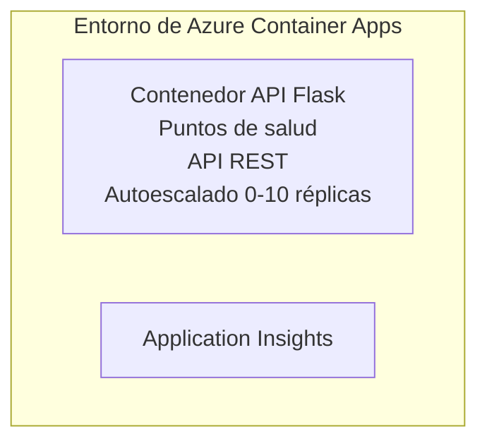

# API Simple Flask - Ejemplo de Aplicación en Contenedor

**Ruta de aprendizaje:** Principiante ⭐ | **Tiempo:** 25-35 minutos | **Costo:** $0-15/mes

Una API REST completa y funcional en Python Flask desplegada en Azure Container Apps usando Azure Developer CLI (azd). Este ejemplo demuestra el despliegue en contenedor, autoescalado y conceptos básicos de monitoreo.

## 🎯 Lo que aprenderás

- Desplegar una aplicación Python en contenedor a Azure  
- Configurar autoescalado con escala a cero  
- Implementar probes de salud y chequeos de readiness  
- Monitorear logs y métricas de la aplicación  
- Usar Azure Developer CLI para despliegue rápido  

## 📦 Qué incluye

✅ **Aplicación Flask** - API REST completa con operaciones CRUD (`src/app.py`)  
✅ **Dockerfile** - Configuración de contenedor lista para producción  
✅ **Infraestructura Bicep** - Entorno Container Apps y despliegue de API  
✅ **Configuración AZD** - Despliegue con un solo comando  
✅ **Probes de Salud** - Comprobaciones de liveness y readiness configuradas  
✅ **Autoescalado** - 0-10 réplicas basado en carga HTTP  

## Arquitectura


## Prerrequisitos

### Requeridos
- **Azure Developer CLI (azd)** - [Guía de instalación](https://learn.microsoft.com/azure/developer/azure-developer-cli/install-azd)
- **Suscripción a Azure** - [Cuenta gratuita](https://azure.microsoft.com/free/)
- **Docker Desktop** - [Instalar Docker](https://www.docker.com/products/docker-desktop/) (para pruebas locales)

### Verificar prerrequisitos

```bash
# Verificar versión de azd (se requiere 1.5.0 o superior)
azd version

# Verificar inicio de sesión en Azure
azd auth login

# Comprobar Docker (opcional, para pruebas locales)
docker --version
```

## ⏱️ Línea de tiempo del despliegue

| Fase | Duración | Qué sucede |
|-------|----------|--------------||
| Configuración de entorno | 30 segundos | Crear entorno azd |
| Construir contenedor | 2-3 minutos | Docker construye aplicación Flask |
| Provisión de infraestructura | 3-5 minutos | Crear Container Apps, registro, monitoreo |
| Desplegar aplicación | 2-3 minutos | Subir imagen y desplegar en Container Apps |
| **Total** | **8-12 minutos** | Despliegue completo listo |

## Inicio rápido

```bash
# Navegar al ejemplo
cd examples/container-app/simple-flask-api

# Inicializar el entorno (elegir un nombre único)
azd env new myflaskapi

# Desplegar todo (infraestructura + aplicación)
azd up
# Se te pedirá:
# 1. Seleccionar suscripción de Azure
# 2. Elegir ubicación (por ejemplo, eastus2)
# 3. Esperar 8-12 minutos para el despliegue

# Obtener tu punto final de API
azd env get-values

# Probar la API
curl $(azd env get-value API_ENDPOINT)/health
```

**Salida esperada:**
```json
{
  "status": "healthy",
  "timestamp": "2025-11-19T10:30:00Z",
  "service": "simple-flask-api",
  "version": "1.0.0"
}
```

## ✅ Verificar despliegue

### Paso 1: Verificar estado del despliegue

```bash
# Ver servicios desplegados
azd show

# La salida esperada muestra:
# - Servicio: api
# - Punto de enlace: https://ca-api-[env].xxx.azurecontainerapps.io
# - Estado: En ejecución
```

### Paso 2: Probar endpoints de la API

```bash
# Obtener endpoint de la API
API_URL=$(azd env get-value API_ENDPOINT)

# Probar estado de salud
curl $API_URL/health

# Probar endpoint raíz
curl $API_URL/

# Crear un ítem
curl -X POST $API_URL/api/items \
  -H "Content-Type: application/json" \
  -d '{"name": "Test Item", "description": "My first item"}'

# Obtener todos los ítems
curl $API_URL/api/items
```

**Criterios de éxito:**
- ✅ Endpoint de salud retorna HTTP 200  
- ✅ Endpoint raíz muestra información de la API  
- ✅ POST crea ítem y retorna HTTP 201  
- ✅ GET retorna ítems creados  

### Paso 3: Ver logs

```bash
# Transmitir logs en vivo usando azd monitor
azd monitor --logs

# O usar Azure CLI:
az containerapp logs show --name api --resource-group $RG_NAME --follow

# Deberías ver:
# - Mensajes de inicio de Gunicorn
# - Registros de solicitudes HTTP
# - Registros de información de la aplicación
```

## Estructura del proyecto

```
simple-flask-api/
├── azure.yaml              # AZD configuration
├── infra/
│   ├── main.bicep         # Main infrastructure
│   ├── main.parameters.json
│   └── app/
│       ├── container-env.bicep
│       └── api.bicep
└── src/
    ├── app.py             # Flask application
    ├── requirements.txt
    └── Dockerfile
```

## Endpoints de la API

| Endpoint | Método | Descripción |
|----------|--------|-------------|
| `/health` | GET | Chequeo de salud |
| `/api/items` | GET | Listar todos los ítems |
| `/api/items` | POST | Crear un nuevo ítem |
| `/api/items/{id}` | GET | Obtener ítem específico |
| `/api/items/{id}` | PUT | Actualizar ítem |
| `/api/items/{id}` | DELETE | Eliminar ítem |

## Configuración

### Variables de entorno

```bash
# Establecer configuración personalizada
azd env set PORT 8000
azd env set LOG_LEVEL info
azd env set MAX_REPLICAS 20
```

### Configuración de escalado

La API escala automáticamente según el tráfico HTTP:  
- **Réplicas mínimas**: 0 (escala a cero cuando está inactiva)  
- **Réplicas máximas**: 10  
- **Solicitudes concurrentes por réplica**: 50  

## Desarrollo

### Ejecutar localmente

```bash
# Instalar dependencias
cd src
pip install -r requirements.txt

# Ejecutar la aplicación
python app.py

# Probar localmente
curl http://localhost:8000/health
```

### Construir y probar contenedor

```bash
# Construir imagen Docker
docker build -t flask-api:local ./src

# Ejecutar contenedor localmente
docker run -p 8000:8000 flask-api:local

# Probar contenedor
curl http://localhost:8000/health
```

## Despliegue

### Despliegue completo

```bash
# Desplegar infraestructura y aplicación
azd up
```

### Despliegue solo de código

```bash
# Desplegar solo el código de la aplicación (infraestructura sin cambios)
azd deploy api
```

### Actualizar configuración

```bash
# Actualizar variables de entorno
azd env set API_KEY "new-api-key"

# Re-deplegar con nueva configuración
azd deploy api
```

## Monitoreo

### Ver logs

```bash
# Transmitir registros en vivo usando azd monitor
azd monitor --logs

# O usar Azure CLI para Container Apps:
az containerapp logs show --name api --resource-group $RG_NAME --follow

# Ver las últimas 100 líneas
az containerapp logs show --name api --resource-group $RG_NAME --tail 100
```

### Monitorear métricas

```bash
# Abrir el panel de Azure Monitor
azd monitor --overview

# Ver métricas específicas
az monitor metrics list \
  --resource $(azd show --output json | jq -r '.services.api.resourceId') \
  --metric "Requests,ResponseTime"
```

## Pruebas

### Chequeo de salud

```bash
curl $(azd show --output json | jq -r '.services.api.endpoint')/health
```

Respuesta esperada:
```json
{
  "status": "healthy",
  "timestamp": "2025-11-19T10:30:00Z"
}
```

### Crear ítem

```bash
curl -X POST $(azd show --output json | jq -r '.services.api.endpoint')/api/items \
  -H "Content-Type: application/json" \
  -d '{"name": "Test Item", "description": "A test item"}'
```

### Obtener todos los ítems

```bash
curl $(azd show --output json | jq -r '.services.api.endpoint')/api/items
```

## Optimización de costos

Este despliegue usa escala a cero, por lo que solo pagas cuando la API está procesando solicitudes:

- **Costo en reposo**: ~ $0/mes (escala a cero)  
- **Costo activo**: ~ $0.000024/segundo por réplica  
- **Costo mensual esperado** (uso ligero): $5-15  

### Reducir costos aún más

```bash
# Reducir el número máximo de réplicas para desarrollo
azd env set MAX_REPLICAS 3

# Usar un tiempo de espera inactivo más corto
azd env set SCALE_TO_ZERO_TIMEOUT 300  # 5 minutos
```

## Solución de problemas

### El contenedor no inicia

```bash
# Verificar los registros del contenedor usando Azure CLI
az containerapp logs show --name api --resource-group $RG_NAME --tail 100

# Verificar la construcción de imágenes Docker localmente
docker build -t test ./src
```

### API no accesible

```bash
# Verificar que el ingreso sea externo
az containerapp show --name api --resource-group rg-simple-flask-api \
  --query properties.configuration.ingress.external
```

### Tiempos de respuesta elevados

```bash
# Comprobar el uso de CPU/Memoria
az monitor metrics list \
  --resource $(azd show --output json | jq -r '.services.api.resourceId') \
  --metric "CPUPercentage,MemoryPercentage"

# Escalar recursos si es necesario
az containerapp update --name api --resource-group rg-simple-flask-api \
  --cpu 1.0 --memory 2Gi
```

## Limpieza

```bash
# Eliminar todos los recursos
azd down --force --purge
```

## Próximos pasos

### Expandir este ejemplo

1. **Agregar base de datos** - Integrar Azure Cosmos DB o SQL Database  
   ```bash
   # Agregar módulo de Cosmos DB a infra/main.bicep
   # Actualizar app.py con la conexión a la base de datos
   ```

2. **Agregar autenticación** - Implementar Azure AD o claves API  
   ```python
   # Agregar middleware de autenticación a app.py
   from functools import wraps
   ```

3. **Configurar CI/CD** - Flujo de trabajo con GitHub Actions  
   ```yaml
   # Create .github/workflows/deploy.yml
   name: Deploy to Azure
   on: [push]
   ```

4. **Agregar identidad administrada** - Acceso seguro a servicios Azure  
   ```bicep
   # Update infra/app/api.bicep
   identity: { type: 'SystemAssigned' }
   ```

### Ejemplos relacionados

- **[Aplicación con base de datos](../../../../../examples/database-app)** - Ejemplo completo con SQL Database  
- **[Microservicios](../../../../../examples/container-app/microservices)** - Arquitectura multi-servicio  
- **[Guía maestra de Container Apps](../README.md)** - Todos los patrones de contenedores  

### Recursos para aprender

- 📚 [Curso AZD para principiantes](../../../README.md) - Curso principal  
- 📚 [Patrones Container Apps](../README.md) - Más patrones de despliegue  
- 📚 [Galería de plantillas AZD](https://azure.github.io/awesome-azd/) - Plantillas de la comunidad  

## Recursos adicionales

### Documentación
- **[Documentación Flask](https://flask.palletsprojects.com/)** - Guía del framework Flask  
- **[Azure Container Apps](https://learn.microsoft.com/azure/container-apps/)** - Documentación oficial de Azure  
- **[Azure Developer CLI](https://learn.microsoft.com/azure/developer/azure-developer-cli/)** - Referencia del comando azd  

### Tutoriales
- **[Inicio rápido Container Apps](https://learn.microsoft.com/azure/container-apps/quickstart-portal)** - Despliega tu primera app  
- **[Python en Azure](https://learn.microsoft.com/azure/developer/python/)** - Guía para desarrollo en Python  
- **[Lenguaje Bicep](https://learn.microsoft.com/azure/azure-resource-manager/bicep/)** - Infraestructura como código  

### Herramientas
- **[Azure Portal](https://portal.azure.com)** - Administración visual de recursos  
- **[Extensión VS Code para Azure](https://marketplace.visualstudio.com/items?itemName=ms-azuretools.vscode-azurecontainerapps)** - Integración IDE  

---

**🎉 ¡Felicidades!** Has desplegado una API Flask lista para producción en Azure Container Apps con autoescalado y monitoreo.

**¿Preguntas?** [Abre un issue](https://github.com/microsoft/AZD-for-beginners/issues) o consulta las [Preguntas frecuentes](../../../resources/faq.md)

---

<!-- CO-OP TRANSLATOR DISCLAIMER START -->
**Aviso Legal**:
Este documento ha sido traducido utilizando el servicio de traducción automática [Co-op Translator](https://github.com/Azure/co-op-translator). Aunque nos esforzamos por la precisión, tenga en cuenta que las traducciones automáticas pueden contener errores o inexactitudes. El documento original en su idioma nativo debe considerarse la fuente autorizada. Para información crítica, se recomienda una traducción profesional realizada por un humano. No nos hacemos responsables por cualquier malentendido o interpretación errónea derivada del uso de esta traducción.
<!-- CO-OP TRANSLATOR DISCLAIMER END -->