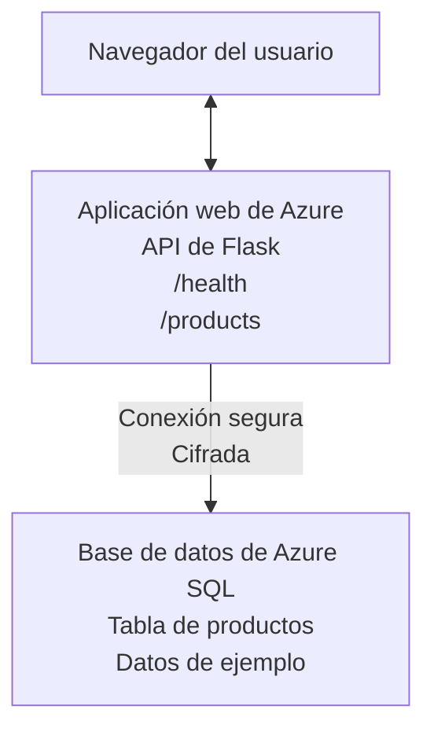

# Deploying a Microsoft SQL Database and Web App with AZD

⏱️ **Estimated Time**: 20-30 minutes | 💰 **Estimated Cost**: ~$15-25/month | ⭐ **Complexity**: Intermediate

This **complete, working example** demonstrates how to use the [Azure Developer CLI (azd)](https://learn.microsoft.com/azure/developer/azure-developer-cli/) to deploy a Python Flask web application with a Microsoft SQL Database to Azure. All code is included and tested—no external dependencies required.

## What You'll Learn

By completing this example, you will:
- Deploy a multi-tier application (web app + database) using infrastructure-as-code
- Configure secure database connections without hardcoding secrets
- Monitor application health with Application Insights
- Manage Azure resources efficiently with AZD CLI
- Follow Azure best practices for security, cost optimization, and observability

## Scenario Overview
- **Web App**: Python Flask REST API with database connectivity
- **Database**: Azure SQL Database with sample data
- **Infrastructure**: Provisioned using Bicep (modular, reusable templates)
- **Deployment**: Fully automated with `azd` commands
- **Monitoring**: Application Insights for logs and telemetry

## Prerequisites

### Required Tools

Before starting, verify you have these tools installed:

1. **[Azure CLI](https://learn.microsoft.com/cli/azure/install-azure-cli)** (version 2.50.0 or higher)
   ```sh
   az --version
   # Salida esperada: azure-cli 2.50.0 o superior
   ```

2. **[Azure Developer CLI (azd)](https://learn.microsoft.com/azure/developer/azure-developer-cli/install-azd)** (version 1.0.0 or higher)
   ```sh
   azd version
   # Salida esperada: azd versión 1.0.0 o superior
   ```

3. **[Python 3.8+](https://www.python.org/downloads/)** (for local development)
   ```sh
   python --version
   # Salida esperada: Python 3.8 o superior
   ```

4. **[Docker](https://www.docker.com/get-started)** (optional, for local containerized development)
   ```sh
   docker --version
   # Salida esperada: versión de Docker 20.10 o superior
   ```

### Azure Requirements

- An active **Azure subscription** ([create a free account](https://azure.microsoft.com/free/))
- Permissions to create resources in your subscription
- **Owner** or **Contributor** role on the subscription or resource group

### Knowledge Prerequisites

This is an **intermediate-level** example. You should be familiar with:
- Basic command-line operations
- Fundamental cloud concepts (resources, resource groups)
- Basic understanding of web applications and databases

**New to AZD?** Start with the [Getting Started guide](../../docs/chapter-01-foundation/azd-basics.md) first.

## Architecture

This example deploys a two-tier architecture with a web application and SQL database:



**Resource Deployment:**
- **Resource Group**: Container for all resources
- **App Service Plan**: Linux-based hosting (B1 tier for cost efficiency)
- **Web App**: Python 3.11 runtime with Flask application
- **SQL Server**: Managed database server with TLS 1.2 minimum
- **SQL Database**: Basic tier (2GB, suitable for development/testing)
- **Application Insights**: Monitoring and logging
- **Log Analytics Workspace**: Centralized log storage

**Analogy**: Think of this like a restaurant (web app) with a walk-in freezer (database). Customers order from the menu (API endpoints), and the kitchen (Flask app) retrieves ingredients (data) from the freezer. The restaurant manager (Application Insights) tracks everything that happens.

## Folder Structure

All files are included in this example—no external dependencies required:

```
examples/database-app/
│
├── README.md                    # This file
├── azure.yaml                   # AZD configuration file
├── .env.sample                  # Sample environment variables
├── .gitignore                   # Git ignore patterns
│
├── infra/                       # Infrastructure as Code (Bicep)
│   ├── main.bicep              # Main orchestration template
│   ├── abbreviations.json      # Azure naming conventions
│   └── resources/              # Modular resource templates
│       ├── sql-server.bicep    # SQL Server configuration
│       ├── sql-database.bicep  # Database configuration
│       ├── app-service-plan.bicep  # Hosting plan
│       ├── app-insights.bicep  # Monitoring setup
│       └── web-app.bicep       # Web application
│
└── src/
    └── web/                    # Application source code
        ├── app.py              # Flask REST API
        ├── requirements.txt    # Python dependencies
        └── Dockerfile          # Container definition
```

**What Each File Does:**
- **azure.yaml**: Tells AZD what to deploy and where
- **infra/main.bicep**: Orchestrates all Azure resources
- **infra/resources/*.bicep**: Individual resource definitions (modular for reuse)
- **src/web/app.py**: Flask application with database logic
- **requirements.txt**: Python package dependencies
- **Dockerfile**: Containerization instructions for deployment

## Quickstart (Step-by-Step)

### Step 1: Clone and Navigate

```sh
git clone https://github.com/microsoft/AZD-for-beginners.git
cd AZD-for-beginners/examples/database-app
```

**✓ Success Check**: Verify you see `azure.yaml` and `infra/` folder:
```sh
ls
# Esperado: README.md, azure.yaml, infra/, src/
```

### Step 2: Authenticate with Azure

```sh
azd auth login
```

This opens your browser for Azure authentication. Sign in with your Azure credentials.

**✓ Success Check**: You should see:
```
Logged in to Azure.
```

### Step 3: Initialize the Environment

```sh
azd init
```

**What happens**: AZD creates a local configuration for your deployment.

**Prompts you'll see**:
- **Environment name**: Enter a short name (e.g., `dev`, `myapp`)
- **Azure subscription**: Select your subscription from the list
- **Azure location**: Choose a region (e.g., `eastus`, `westeurope`)

**✓ Success Check**: You should see:
```
SUCCESS: New project initialized!
```

### Step 4: Provision Azure Resources

```sh
azd provision
```

**What happens**: AZD deploys all infrastructure (takes 5-8 minutes):
1. Creates resource group
2. Creates SQL Server and Database
3. Creates App Service Plan
4. Creates Web App
5. Creates Application Insights
6. Configures networking and security

**You'll be prompted for**:
- **SQL admin username**: Enter a username (e.g., `sqladmin`)
- **SQL admin password**: Enter a strong password (save this!)

**✓ Success Check**: You should see:
```
SUCCESS: Your application was provisioned in Azure in X minutes Y seconds.
You can view the resources created under the resource group rg-<env-name> in Azure Portal:
https://portal.azure.com/#@/resource/subscriptions/.../resourceGroups/rg-<env-name>
```

**⏱️ Time**: 5-8 minutes

### Step 5: Deploy the Application

```sh
azd deploy
```

**What happens**: AZD builds and deploys your Flask application:
1. Packages the Python application
2. Builds the Docker container
3. Pushes to Azure Web App
4. Initializes the database with sample data
5. Starts the application

**✓ Success Check**: You should see:
```
SUCCESS: Your application was deployed to Azure in X minutes Y seconds.
You can view the resources created under the resource group rg-<env-name> in Azure Portal:
https://portal.azure.com/#@/resource/subscriptions/.../resourceGroups/rg-<env-name>
```

**⏱️ Time**: 3-5 minutes

### Step 6: Browse the Application

```sh
azd browse
```

This opens your deployed web app in the browser at `https://app-<unique-id>.azurewebsites.net`

**✓ Success Check**: You should see JSON output:
```json
{
  "message": "Welcome to the Database App API",
  "endpoints": {
    "/": "This help message",
    "/health": "Health check endpoint",
    "/products": "List all products",
    "/products/<id>": "Get product by ID"
  }
}
```

### Step 7: Test the API Endpoints

**Health Check** (verify database connection):
```sh
curl https://app-<your-id>.azurewebsites.net/health
```

**Expected Response**:
```json
{
  "status": "healthy",
  "database": "connected"
}
```

**List Products** (sample data):
```sh
curl https://app-<your-id>.azurewebsites.net/products
```

**Expected Response**:
```json
[
  {
    "id": 1,
    "name": "Laptop",
    "description": "High-performance laptop",
    "price": 1299.99,
    "created_at": "2025-11-19T10:30:00"
  },
  ...
]
```

**Get Single Product**:
```sh
curl https://app-<your-id>.azurewebsites.net/products/1
```

**✓ Success Check**: All endpoints return JSON data without errors.

---

**🎉 Congratulations!** You've successfully deployed a web application with a database to Azure using AZD.

## Configuration Deep-Dive

### Environment Variables

Secrets are managed securely via Azure App Service configuration—**never hardcoded in source code**.

**Configured Automatically by AZD**:
- `SQL_CONNECTION_STRING`: Database connection with encrypted credentials
- `APPLICATIONINSIGHTS_CONNECTION_STRING`: Monitoring telemetry endpoint
- `SCM_DO_BUILD_DURING_DEPLOYMENT`: Enables automatic dependency installation

**Where Secrets Are Stored**:
1. During `azd provision`, you provide SQL credentials via secure prompts
2. AZD stores these in your local `.azure/<env-name>/.env` file (git-ignored)
3. AZD injects them into Azure App Service configuration (encrypted at rest)
4. Application reads them via `os.getenv()` at runtime

### Local Development

For local testing, create a `.env` file from the sample:

```sh
cp .env.sample .env
# Edita .env con la conexión a tu base de datos local
```

**Local Development Workflow**:
```sh
# Instalar dependencias
cd src/web
pip install -r requirements.txt

# Establecer variables de entorno
export SQL_CONNECTION_STRING="your-local-connection-string"

# Ejecutar la aplicación
python app.py
```

**Test locally**:
```sh
curl http://localhost:8000/health
# Esperado: {"status": "healthy", "database": "connected"}
```

### Infrastructure as Code

All Azure resources are defined in **Bicep templates** (`infra/` folder):

- **Modular Design**: Each resource type has its own file for reusability
- **Parameterized**: Customize SKUs, regions, naming conventions
- **Best Practices**: Follows Azure naming standards and security defaults
- **Version Controlled**: Infrastructure changes are tracked in Git

**Customization Example**:
To change the database tier, edit `infra/resources/sql-database.bicep`:
```bicep
sku: {
  name: 'Standard'  // Changed from 'Basic'
  tier: 'Standard'
  capacity: 10
}
```

## Security Best Practices

This example follows Azure security best practices:

### 1. **No Secrets in Source Code**
- ✅ Credentials stored in Azure App Service configuration (encrypted)
- ✅ `.env` files excluded from Git via `.gitignore`
- ✅ Secrets passed via secure parameters during provisioning

### 2. **Encrypted Connections**
- ✅ TLS 1.2 minimum for SQL Server
- ✅ HTTPS-only enforced for Web App
- ✅ Database connections use encrypted channels

### 3. **Network Security**
- ✅ SQL Server firewall configured to allow Azure services only
- ✅ Public network access restricted (can be further locked down with Private Endpoints)
- ✅ FTPS disabled on Web App

### 4. **Authentication & Authorization**
- ⚠️ **Current**: SQL authentication (username/password)
- ✅ **Production Recommendation**: Use Azure Managed Identity for passwordless authentication

**To Upgrade to Managed Identity** (for production):
1. Enable managed identity on Web App
2. Grant identity SQL permissions
3. Update connection string to use managed identity
4. Remove password-based authentication

### 5. **Auditing & Compliance**
- ✅ Application Insights logs all requests and errors
- ✅ SQL Database auditing enabled (can be configured for compliance)
- ✅ All resources tagged for governance

**Security Checklist Before Production**:
- [ ] Enable Azure Defender for SQL
- [ ] Configure Private Endpoints for SQL Database
- [ ] Enable Web Application Firewall (WAF)
- [ ] Implement Azure Key Vault for secret rotation
- [ ] Configure Microsoft Entra ID authentication
- [ ] Enable diagnostic logging for all resources

## Cost Optimization

**Estimated Monthly Costs** (as of November 2025):

| Resource | SKU/Tier | Estimated Cost |
|----------|----------|----------------|
| App Service Plan | B1 (Basic) | ~$13/month |
| SQL Database | Basic (2GB) | ~$5/month |
| Application Insights | Pay-as-you-go | ~$2/month (low traffic) |
| **Total** | | **~$20/month** |

**💡 Cost-Saving Tips**:

1. **Use Free Tier for Learning**:
   - App Service: F1 tier (free, limited hours)
   - SQL Database: Use Azure SQL Database serverless
   - Application Insights: 5GB/month free ingestion

2. **Stop Resources When Not in Use**:
   ```sh
   # Detener la aplicación web (la base de datos sigue cobrando)
   az webapp stop --name <app-name> --resource-group <rg-name>
   
   # Reiniciar cuando sea necesario
   az webapp start --name <app-name> --resource-group <rg-name>
   ```

3. **Delete Everything After Testing**:
   ```sh
   azd down
   ```
   This removes ALL resources and stops charges.

4. **Development vs. Production SKUs**:
   - **Development**: Basic tier (used in this example)
   - **Production**: Standard/Premium tier with redundancy

**Cost Monitoring**:
- View costs in [Azure Cost Management](https://portal.azure.com/#view/Microsoft_Azure_CostManagement)
- Set up cost alerts to avoid surprises
- Tag all resources with `azd-env-name` for tracking

**Free Tier Alternative**:
For learning purposes, you can modify `infra/resources/app-service-plan.bicep`:
```bicep
sku: {
  name: 'F1'  // Free tier
  tier: 'Free'
}
```
**Note**: Free tier has limitations (60 min/day CPU, no always-on).

## Monitoring & Observability

### Application Insights Integration

This example includes **Application Insights** for comprehensive monitoring:

**What's Monitored**:
- ✅ HTTP requests (latency, status codes, endpoints)
- ✅ Application errors and exceptions
- ✅ Custom logging from Flask app
- ✅ Database connection health
- ✅ Performance metrics (CPU, memory)

**Access Application Insights**:
1. Open [Azure Portal](https://portal.azure.com)
2. Navigate to your resource group (`rg-<env-name>`)
3. Click on Application Insights resource (`appi-<unique-id>`)

**Useful Queries** (Application Insights → Logs):

**View All Requests**:
```kusto
requests
| where timestamp > ago(1h)
| order by timestamp desc
| project timestamp, name, url, resultCode, duration
```

**Find Errors**:
```kusto
exceptions
| where timestamp > ago(24h)
| order by timestamp desc
| project timestamp, type, outerMessage, operation_Name
```

**Check Health Endpoint**:
```kusto
requests
| where name contains "health"
| summarize count() by resultCode, bin(timestamp, 1h)
```

### SQL Database Auditing

**SQL Database auditing is enabled** to track:
- Database access patterns
- Failed login attempts
- Schema changes
- Data access (for compliance)

**Access Audit Logs**:
1. Azure Portal → SQL Database → Auditing
2. View logs in Log Analytics workspace

### Real-Time Monitoring

**View Live Metrics**:
1. Application Insights → Live Metrics
2. See requests, failures, and performance in real-time

**Set Up Alerts**:
Create alerts for critical events:
- HTTP 500 errors > 5 in 5 minutes
- Database connection failures
- High response times (>2 seconds)

**Example Alert Creation**:
```sh
az monitor metrics alert create \
  --name "High-Response-Time" \
  --resource-group <rg-name> \
  --scopes <app-insights-resource-id> \
  --condition "avg requests/duration > 2000" \
  --description "Alert when response time exceeds 2 seconds"
```

## Troubleshooting
### Problemas comunes y soluciones

#### 1. `azd provision` falla con "Location not available"

**Síntoma**:
```
Error: The subscription is not registered for the resource type 'components' in the location 'centralus'.
```

**Solución**:
Elija una región de Azure diferente o registre el proveedor de recursos:
```sh
az provider register --namespace Microsoft.Insights
```

#### 2. La conexión SQL falla durante el despliegue

**Síntoma**:
```
pyodbc.OperationalError: ('08001', '[08001] [Microsoft][ODBC Driver 18 for SQL Server]TCP Provider...')
```

**Solución**:
- Verifique que el firewall del servidor SQL permita los servicios de Azure (configurado automáticamente)
- Compruebe que la contraseña del administrador de SQL se ingresó correctamente durante `azd provision`
- Asegúrese de que el servidor SQL esté completamente aprovisionado (puede tardar 2-3 minutos)

**Verificar conexión**:
```sh
# Desde el Portal de Azure, ve a SQL Database → Editor de consultas
# Intenta conectarte con tus credenciales
```

#### 3. La aplicación web muestra "Application Error"

**Síntoma**:
El navegador muestra una página de error genérica.

**Solución**:
Compruebe los registros de la aplicación:
```sh
# Ver registros recientes
az webapp log tail --name <app-name> --resource-group <rg-name>
```

**Causas comunes**:
- Variables de entorno faltantes (ver App Service → Configuración)
- Falló la instalación de paquetes de Python (ver registros de despliegue)
- Error de inicialización de la base de datos (verifique la conectividad SQL)

#### 4. `azd deploy` falla con "Build Error"

**Síntoma**:
```
Error: Failed to build project
```

**Solución**:
- Asegúrese de que `requirements.txt` no tenga errores de sintaxis
- Verifique que Python 3.11 esté especificado en `infra/resources/web-app.bicep`
- Verifique que el Dockerfile tenga la imagen base correcta

**Depurar localmente**:
```sh
cd src/web
docker build -t test-app .
docker run -p 8000:8000 test-app
```

#### 5. "Unauthorized" al ejecutar comandos AZD

**Síntoma**:
```
ERROR: (Unauthorized) The client '<id>' with object id '<id>' does not have authorization
```

**Solución**:
Vuelva a autenticarse en Azure:
```sh
# Requerido para los flujos de trabajo de AZD
azd auth login

# Opcional si también usa comandos de Azure CLI directamente
az login
```

Verifique que tenga los permisos correctos (rol de Colaborador) en la suscripción.

#### 6. Costos altos de la base de datos

**Síntoma**:
Factura inesperada de Azure.

**Solución**:
- Compruebe si olvidó ejecutar `azd down` después de las pruebas
- Verifique que la base de datos SQL esté usando el nivel Basic (no Premium)
- Revise los costos en Azure Cost Management
- Configure alertas de costos

### Obtener ayuda

**Ver todas las variables de entorno de AZD**:
```sh
azd env get-values
```

**Comprobar el estado del despliegue**:
```sh
az webapp show --name <app-name> --resource-group <rg-name> --query state
```

**Acceder a los registros de la aplicación**:
```sh
az webapp log download --name <app-name> --resource-group <rg-name> --log-file app-logs.zip
```

**¿Necesitas más ayuda?**
- [Guía de resolución de problemas de AZD](../../docs/chapter-07-troubleshooting/common-issues.md)
- [Solución de problemas de Azure App Service](https://learn.microsoft.com/azure/app-service/troubleshoot-diagnostic-logs)
- [Solución de problemas de Azure SQL](https://learn.microsoft.com/azure/azure-sql/database/troubleshoot-common-errors-issues)

## Ejercicios prácticos

### Ejercicio 1: Verifica tu despliegue (Principiante)

**Objetivo**: Confirmar que todos los recursos estén desplegados y que la aplicación funcione.

**Pasos**:
1. Enumera todos los recursos en tu grupo de recursos:
   ```sh
   az resource list --resource-group rg-<env-name> --output table
   ```
   **Esperado**: 6-7 recursos (Web App, SQL Server, SQL Database, App Service Plan, Application Insights, Log Analytics)

2. Prueba todos los endpoints de la API:
   ```sh
   curl https://app-<your-id>.azurewebsites.net/
   curl https://app-<your-id>.azurewebsites.net/health
   curl https://app-<your-id>.azurewebsites.net/products
   curl https://app-<your-id>.azurewebsites.net/products/1
   ```
   **Esperado**: Todos devuelven JSON válido sin errores

3. Revisa Application Insights:
   - Navega a Application Insights en el Portal de Azure
   - Ve a "Live Metrics"
   - Actualiza tu navegador en la aplicación web
   **Esperado**: Ver solicitudes apareciendo en tiempo real

**Criterios de éxito**: Los 6-7 recursos existen, todos los endpoints devuelven datos, Live Metrics muestra actividad.

---

### Ejercicio 2: Agregar un nuevo endpoint de API (Intermedio)

**Objetivo**: Extender la aplicación Flask con un nuevo endpoint.

**Código inicial**: Endpoints actuales en `src/web/app.py`

**Pasos**:
1. Edita `src/web/app.py` y agrega un nuevo endpoint después de la función `get_product()`:
   ```python
   @app.route('/products/search/<keyword>')
   def search_products(keyword):
       """Search products by name or description."""
       try:
           conn = get_db_connection()
           cursor = conn.cursor()
           cursor.execute(
               "SELECT id, name, description, price, created_at FROM products WHERE name LIKE ? OR description LIKE ?",
               (f'%{keyword}%', f'%{keyword}%')
           )
           
           products = []
           for row in cursor.fetchall():
               products.append({
                   'id': row[0],
                   'name': row[1],
                   'description': row[2],
                   'price': float(row[3]) if row[3] else None,
                   'created_at': row[4].isoformat() if row[4] else None
               })
           
           cursor.close()
           conn.close()
           
           logger.info(f"Search for '{keyword}' returned {len(products)} results")
           return jsonify(products), 200
           
       except Exception as e:
           logger.error(f"Error searching products: {str(e)}")
           return jsonify({'error': str(e)}), 500
   ```

2. Despliega la aplicación actualizada:
   ```sh
   azd deploy
   ```

3. Prueba el nuevo endpoint:
   ```sh
   curl https://app-<your-id>.azurewebsites.net/products/search/laptop
   ```
   **Esperado**: Devuelve productos que coinciden con "laptop"

**Criterios de éxito**: El nuevo endpoint funciona, devuelve resultados filtrados y aparece en los registros de Application Insights.

---

### Ejercicio 3: Agregar supervisión y alertas (Avanzado)

**Objetivo**: Configurar supervisión proactiva con alertas.

**Pasos**:
1. Crea una alerta para errores HTTP 500:
   ```sh
   # Obtener el ID del recurso de Application Insights
   AI_ID=$(az monitor app-insights component show \
     --app appi-<your-id> \
     --resource-group rg-<env-name> \
     --query id -o tsv)
   
   # Crear alerta
   az monitor metrics alert create \
     --name "High-Error-Rate" \
     --resource-group rg-<env-name> \
     --scopes $AI_ID \
     --condition "count requests/failed > 5" \
     --window-size 5m \
     --evaluation-frequency 1m \
     --description "Alert when >5 failed requests in 5 minutes"
   ```

2. Provoca la alerta generando errores:
   ```sh
   # Solicitar un producto inexistente
   for i in {1..10}; do curl https://app-<your-id>.azurewebsites.net/products/999; done
   ```

3. Comprueba si la alerta se activó:
   - Azure Portal → Alerts → Alert Rules
   - Revisa tu correo electrónico (si está configurado)

**Criterios de éxito**: Se crea la regla de alerta, se activa ante errores y se reciben notificaciones.

---

### Ejercicio 4: Cambios en el esquema de la base de datos (Avanzado)

**Objetivo**: Agregar una nueva tabla y modificar la aplicación para usarla.

**Pasos**:
1. Conéctate a la base de datos SQL a través del Editor de consultas en el Portal de Azure

2. Crea una nueva tabla `categories`:
   ```sql
   CREATE TABLE categories (
       id INT PRIMARY KEY IDENTITY(1,1),
       name NVARCHAR(50) NOT NULL,
       description NVARCHAR(200)
   );
   
   INSERT INTO categories (name, description) VALUES
   ('Electronics', 'Electronic devices and accessories'),
   ('Office Supplies', 'Office equipment and supplies');
   
   -- Add category to products table
   ALTER TABLE products ADD category_id INT;
   UPDATE products SET category_id = 1; -- Set all to Electronics
   ```

3. Actualiza `src/web/app.py` para incluir la información de categoría en las respuestas

4. Despliega y prueba

**Criterios de éxito**: La nueva tabla existe, los productos muestran información de categoría y la aplicación sigue funcionando.

---

### Ejercicio 5: Implementar caché (Experto)

**Objetivo**: Añadir Azure Redis Cache para mejorar el rendimiento.

**Pasos**:
1. Agrega Redis Cache a `infra/main.bicep`
2. Actualiza `src/web/app.py` para almacenar en caché las consultas de productos
3. Mide la mejora de rendimiento con Application Insights
4. Compara los tiempos de respuesta antes/después de la caché

**Criterios de éxito**: Redis está desplegado, la caché funciona y los tiempos de respuesta mejoran en >50%.

**Sugerencia**: Comienza con la [documentación de Azure Cache for Redis](https://learn.microsoft.com/azure/azure-cache-for-redis/).

---

## Limpieza

Para evitar cargos continuos, elimina todos los recursos cuando termines:

```sh
azd down
```

**Aviso de confirmación**:
```
? Total resources to delete: 7, are you sure you want to continue? (y/N)
```

Escribe `y` para confirmar.

**✓ Comprobación de éxito**: 
- Todos los recursos se han eliminado del Portal de Azure
- No hay cargos en curso
- La carpeta local `.azure/<env-name>` puede eliminarse

**Alternativa** (mantener la infraestructura, eliminar los datos):
```sh
# Eliminar solo el grupo de recursos (conservar la configuración de AZD)
az group delete --name rg-<env-name> --yes
```
## Más información

### Documentación relacionada
- [Documentación de Azure Developer CLI](https://learn.microsoft.com/azure/developer/azure-developer-cli/)
- [Documentación de Azure SQL Database](https://learn.microsoft.com/azure/azure-sql/database/)
- [Documentación de Azure App Service](https://learn.microsoft.com/azure/app-service/)
- [Documentación de Application Insights](https://learn.microsoft.com/azure/azure-monitor/app/app-insights-overview)
- [Referencia del lenguaje Bicep](https://learn.microsoft.com/azure/azure-resource-manager/bicep/)

### Próximos pasos en este curso
- **[Ejemplo de Container Apps](../../../../examples/container-app)**: Despliega microservicios con Azure Container Apps
- **[Guía de integración de IA](../../../../docs/ai-foundry)**: Agrega capacidades de IA a tu aplicación
- **[Mejores prácticas de despliegue](../../docs/chapter-04-infrastructure/deployment-guide.md)**: Patrones de despliegue para producción

### Temas avanzados
- **Identidad administrada**: Elimina contraseñas y usa autenticación de Microsoft Entra ID
- **Puntos finales privados**: Asegura las conexiones a la base de datos dentro de una red virtual
- **Integración CI/CD**: Automatiza despliegues con GitHub Actions o Azure DevOps
- **Multi-entorno**: Configura entornos dev, staging y producción
- **Migraciones de base de datos**: Usa Alembic o Entity Framework para versionado de esquemas

### Comparación con otros enfoques

**AZD vs. Plantillas ARM**:
- ✅ AZD: Abstracción de nivel superior, comandos más simples
- ⚠️ ARM: Más verboso, control más granular

**AZD vs. Terraform**:
- ✅ AZD: Nativo de Azure, integrado con servicios de Azure
- ⚠️ Terraform: Soporte multi-nube, ecosistema más amplio

**AZD vs. Azure Portal**:
- ✅ AZD: Reproducible, con control de versiones y automatizable
- ⚠️ Portal: Clics manuales, difícil de reproducir

**Piensa en AZD como**: Docker Compose para Azure—configuración simplificada para despliegues complejos.

---

## Preguntas frecuentes

**Q: Can I use a different programming language?**  
A: ¡Sí! Reemplaza `src/web/` por Node.js, C#, Go o cualquier lenguaje. Actualiza `azure.yaml` y Bicep en consecuencia.

**Q: How do I add more databases?**  
A: Agrega otro módulo de SQL Database en `infra/main.bicep` o utiliza PostgreSQL/MySQL de los servicios de base de datos de Azure.

**Q: Can I use this for production?**  
A: Este es un punto de partida. Para producción, añade: identidad administrada, endpoints privados, redundancia, estrategia de backup, WAF y supervisión mejorada.

**Q: What if I want to use containers instead of code deployment?**  
A: Consulta el [Ejemplo de Container Apps](../../../../examples/container-app) que usa contenedores Docker en todo el flujo.

**Q: How do I connect to the database from my local machine?**  
A: Añade tu IP al firewall del servidor SQL:
```sh
az sql server firewall-rule create \
  --resource-group rg-<env-name> \
  --server sql-<unique-id> \
  --name AllowMyIP \
  --start-ip-address <your-ip> \
  --end-ip-address <your-ip>
```

**Q: Can I use an existing database instead of creating a new one?**  
A: Sí, modifica `infra/main.bicep` para referenciar un servidor SQL existente y actualiza los parámetros de la cadena de conexión.

---

> **Nota:** Este ejemplo demuestra las mejores prácticas para desplegar una aplicación web con una base de datos usando AZD. Incluye código funcional, documentación completa y ejercicios prácticos para reforzar el aprendizaje. Para despliegues en producción, revise los requisitos de seguridad, escalado, cumplimiento y costos específicos de su organización.

**📚 Navegación del curso:**
- ← Anterior: [Ejemplo de Container Apps](../../../../examples/container-app)
- → Siguiente: [Guía de integración de IA](../../../../docs/ai-foundry)
- 🏠 [Inicio del curso](../../README.md)

---

<!-- CO-OP TRANSLATOR DISCLAIMER START -->
**Descargo de responsabilidad**:
Este documento ha sido traducido utilizando el servicio de traducción automática [Co-op Translator](https://github.com/Azure/co-op-translator). Aunque nos esforzamos por la precisión, tenga en cuenta que las traducciones automatizadas pueden contener errores o inexactitudes. El documento original en su idioma nativo debe considerarse la fuente autorizada. Para información crítica, se recomienda una traducción profesional humana. No somos responsables de cualquier malentendido o interpretación errónea que surja del uso de esta traducción.
<!-- CO-OP TRANSLATOR DISCLAIMER END -->