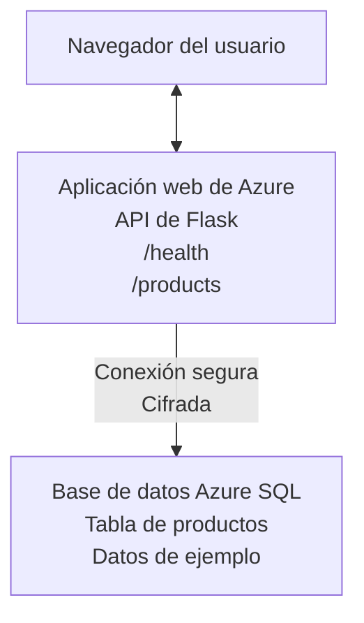

# Desplegando una base de datos Microsoft SQL y una aplicación web con AZD

⏱️ **Tiempo estimado**: 20-30 minutos | 💰 **Costo estimado**: ~$15-25/mes | ⭐ **Complejidad**: Intermedio

Este **ejemplo completo y funcional** demuestra cómo usar la [CLI de Desarrollador de Azure (azd)](https://learn.microsoft.com/azure/developer/azure-developer-cli/) para desplegar una aplicación web Python Flask con una base de datos Microsoft SQL en Azure. Todo el código está incluido y probado—no se requieren dependencias externas.

## Lo que aprenderás

Al completar este ejemplo, podrás:
- Desplegar una aplicación de varias capas (aplicación web + base de datos) usando infraestructura como código
- Configurar conexiones seguras a la base de datos sin incrustar secretos en el código
- Monitorizar la salud de la aplicación con Application Insights
- Gestionar recursos de Azure eficazmente con la CLI AZD
- Seguir las mejores prácticas de Azure para seguridad, optimización de costos y observabilidad

## Resumen del escenario
- **Web App**: API REST con Python Flask y conectividad a la base de datos
- **Base de datos**: Azure SQL Database con datos de ejemplo
- **Infraestructura**: Provisionada usando Bicep (plantillas modulares y reutilizables)
- **Despliegue**: Totalmente automatizado con comandos `azd`
- **Monitorización**: Application Insights para logs y telemetría

## Requisitos previos

### Herramientas requeridas

Antes de empezar, verifica que tienes instaladas estas herramientas:

1. **[Azure CLI](https://learn.microsoft.com/cli/azure/install-azure-cli)** (versión 2.50.0 o superior)
   ```sh
   az --version
   # Salida esperada: azure-cli 2.50.0 o superior
   ```

2. **[Azure Developer CLI (azd)](https://learn.microsoft.com/azure/developer/azure-developer-cli/install-azd)** (versión 1.0.0 o superior)
   ```sh
   azd version
   # Salida esperada: azd versión 1.0.0 o superior
   ```

3. **[Python 3.8+](https://www.python.org/downloads/)** (para desarrollo local)
   ```sh
   python --version
   # Salida esperada: Python 3.8 o superior
   ```

4. **[Docker](https://www.docker.com/get-started)** (opcional, para desarrollo local en contenedores)
   ```sh
   docker --version
   # Salida esperada: Docker versión 20.10 o superior
   ```

### Requisitos de Azure

- Una **suscripción de Azure** activa ([crea una cuenta gratuita](https://azure.microsoft.com/free/))
- Permisos para crear recursos en tu suscripción
- Rol de **Owner** o **Contributor** en la suscripción o en el grupo de recursos

### Conocimientos previos

Este es un ejemplo de **nivel intermedio**. Debes estar familiarizado con:
- Operaciones básicas en la línea de comandos
- Conceptos fundamentales de la nube (recursos, grupos de recursos)
- Entendimiento básico de aplicaciones web y bases de datos

**¿Nuevo en AZD?** Comienza con la [guía de Introducción](../../docs/chapter-01-foundation/azd-basics.md) primero.

## Arquitectura

Este ejemplo despliega una arquitectura de dos capas con una aplicación web y una base de datos SQL:


**Despliegue de recursos:**
- **Resource Group**: Contenedor para todos los recursos
- **App Service Plan**: Alojamiento en Linux (nivel B1 para eficiencia de costos)
- **Web App**: Runtime Python 3.11 con aplicación Flask
- **SQL Server**: Servidor de base de datos gestionado con TLS 1.2 mínimo
- **SQL Database**: Nivel básico (2GB, adecuado para desarrollo/pruebas)
- **Application Insights**: Monitorización y logging
- **Log Analytics Workspace**: Almacenamiento centralizado de logs

**Analogía**: Piensa en esto como un restaurante (aplicación web) con una cámara frigorífica (base de datos). Los clientes piden del menú (endpoints de la API), y la cocina (app Flask) recupera ingredientes (datos) de la cámara. El gerente del restaurante (Application Insights) supervisa todo lo que sucede.

## Estructura de carpetas

Todos los archivos están incluidos en este ejemplo—no se requieren dependencias externas:

```
examples/database-app/
│
├── README.md                    # This file
├── azure.yaml                   # AZD configuration file
├── .env.sample                  # Sample environment variables
├── .gitignore                   # Git ignore patterns
│
├── infra/                       # Infrastructure as Code (Bicep)
│   ├── main.bicep              # Main orchestration template
│   ├── abbreviations.json      # Azure naming conventions
│   └── resources/              # Modular resource templates
│       ├── sql-server.bicep    # SQL Server configuration
│       ├── sql-database.bicep  # Database configuration
│       ├── app-service-plan.bicep  # Hosting plan
│       ├── app-insights.bicep  # Monitoring setup
│       └── web-app.bicep       # Web application
│
└── src/
    └── web/                    # Application source code
        ├── app.py              # Flask REST API
        ├── requirements.txt    # Python dependencies
        └── Dockerfile          # Container definition
```

**Qué hace cada archivo:**
- **azure.yaml**: Indica a AZD qué desplegar y dónde
- **infra/main.bicep**: Orquesta todos los recursos de Azure
- **infra/resources/*.bicep**: Definiciones individuales de recursos (modulares para reutilizar)
- **src/web/app.py**: Aplicación Flask con lógica de base de datos
- **requirements.txt**: Dependencias de Python
- **Dockerfile**: Instrucciones de contenedorización para el despliegue

## Inicio rápido (paso a paso)

### Paso 1: Clonar y navegar

```sh
git clone https://github.com/microsoft/AZD-for-beginners.git
cd AZD-for-beginners/examples/database-app
```

**✓ Comprobación de éxito**: Verifica que ves `azure.yaml` y la carpeta `infra/`:
```sh
ls
# Esperado: README.md, azure.yaml, infra/, src/
```

### Paso 2: Autenticarse en Azure

```sh
azd auth login
```

Esto abre tu navegador para la autenticación en Azure. Inicia sesión con tus credenciales de Azure.

**✓ Comprobación de éxito**: Deberías ver:
```
Logged in to Azure.
```

### Paso 3: Inicializar el entorno

```sh
azd init
```

**Qué sucede**: AZD crea una configuración local para tu despliegue.

**Indicaciones que verás**:
- **Environment name**: Ingresa un nombre corto (p. ej., `dev`, `myapp`)
- **Azure subscription**: Selecciona tu suscripción de la lista
- **Azure location**: Elige una región (p. ej., `eastus`, `westeurope`)

**✓ Comprobación de éxito**: Deberías ver:
```
SUCCESS: New project initialized!
```

### Paso 4: Provisionar recursos en Azure

```sh
azd provision
```

**Qué sucede**: AZD despliega toda la infraestructura (toma 5-8 minutos):
1. Crea el grupo de recursos
2. Crea el servidor SQL y la base de datos
3. Crea el App Service Plan
4. Crea la Web App
5. Crea Application Insights
6. Configura redes y seguridad

**Te pedirán**:
- **SQL admin username**: Ingresa un nombre de usuario (p. ej., `sqladmin`)
- **SQL admin password**: Ingresa una contraseña segura (¡guárdala!)

**✓ Comprobación de éxito**: Deberías ver:
```
SUCCESS: Your application was provisioned in Azure in X minutes Y seconds.
You can view the resources created under the resource group rg-<env-name> in Azure Portal:
https://portal.azure.com/#@/resource/subscriptions/.../resourceGroups/rg-<env-name>
```

**⏱️ Tiempo**: 5-8 minutos

### Paso 5: Desplegar la aplicación

```sh
azd deploy
```

**Qué sucede**: AZD construye y despliega tu aplicación Flask:
1. Empaqueta la aplicación Python
2. Construye el contenedor Docker
3. Lo publica en la Web App de Azure
4. Inicializa la base de datos con datos de ejemplo
5. Inicia la aplicación

**✓ Comprobación de éxito**: Deberías ver:
```
SUCCESS: Your application was deployed to Azure in X minutes Y seconds.
You can view the resources created under the resource group rg-<env-name> in Azure Portal:
https://portal.azure.com/#@/resource/subscriptions/.../resourceGroups/rg-<env-name>
```

**⏱️ Tiempo**: 3-5 minutos

### Paso 6: Navegar por la aplicación

```sh
azd browse
```

Esto abre tu aplicación desplegada en el navegador en `https://app-<unique-id>.azurewebsites.net`

**✓ Comprobación de éxito**: Deberías ver salida JSON:
```json
{
  "message": "Welcome to the Database App API",
  "endpoints": {
    "/": "This help message",
    "/health": "Health check endpoint",
    "/products": "List all products",
    "/products/<id>": "Get product by ID"
  }
}
```

### Paso 7: Probar los endpoints de la API

**Comprobación de salud** (verifica la conexión a la base de datos):
```sh
curl https://app-<your-id>.azurewebsites.net/health
```

**Respuesta esperada**:
```json
{
  "status": "healthy",
  "database": "connected"
}
```

**Listar productos** (datos de ejemplo):
```sh
curl https://app-<your-id>.azurewebsites.net/products
```

**Respuesta esperada**:
```json
[
  {
    "id": 1,
    "name": "Laptop",
    "description": "High-performance laptop",
    "price": 1299.99,
    "created_at": "2025-11-19T10:30:00"
  },
  ...
]
```

**Obtener un solo producto**:
```sh
curl https://app-<your-id>.azurewebsites.net/products/1
```

**✓ Comprobación de éxito**: Todos los endpoints devuelven datos JSON sin errores.

---

**🎉 ¡Felicidades!** Has desplegado correctamente una aplicación web con una base de datos en Azure usando AZD.

## Análisis detallado de la configuración

### Variables de entorno

Los secretos se gestionan de forma segura a través de la configuración de Azure App Service—**nunca se incrustan en el código fuente**.

**Configurado automáticamente por AZD**:
- `SQL_CONNECTION_STRING`: Cadena de conexión a la base de datos con credenciales cifradas
- `APPLICATIONINSIGHTS_CONNECTION_STRING`: Punto de conexión de telemetría de monitorización
- `SCM_DO_BUILD_DURING_DEPLOYMENT`: Habilita la instalación automática de dependencias

**Dónde se almacenan los secretos**:
1. Durante `azd provision`, proporcionas las credenciales SQL mediante indicaciones seguras
2. AZD las guarda en tu archivo local `.azure/<env-name>/.env` (ignorado por Git)
3. AZD las inyecta en la configuración de Azure App Service (cifrado en reposo)
4. La aplicación las lee mediante `os.getenv()` en tiempo de ejecución

### Desarrollo local

Para pruebas locales, crea un archivo `.env` a partir del ejemplo:

```sh
cp .env.sample .env
# Edita .env con la conexión a la base de datos local
```

**Flujo de trabajo para desarrollo local**:
```sh
# Instalar dependencias
cd src/web
pip install -r requirements.txt

# Establecer variables de entorno
export SQL_CONNECTION_STRING="your-local-connection-string"

# Ejecutar la aplicación
python app.py
```

**Probar localmente**:
```sh
curl http://localhost:8000/health
# Esperado: {"status": "healthy", "database": "connected"}
```

### Infraestructura como Código

Todos los recursos de Azure están definidos en **plantillas Bicep** (carpeta `infra/`):

- **Diseño modular**: Cada tipo de recurso tiene su propio archivo para reutilización
- **Parametrizado**: Personaliza SKUs, regiones, convenciones de nombres
- **Mejores prácticas**: Sigue los estándares de nomenclatura y los valores predeterminados de seguridad de Azure
- **Control de versiones**: Los cambios de infraestructura se rastrean en Git

**Ejemplo de personalización**:
Para cambiar el nivel de la base de datos, edita `infra/resources/sql-database.bicep`:
```bicep
sku: {
  name: 'Standard'  // Changed from 'Basic'
  tier: 'Standard'
  capacity: 10
}
```

## Mejores prácticas de seguridad

Este ejemplo sigue las mejores prácticas de seguridad de Azure:

### 1. **No almacenar secretos en el código fuente**
- ✅ Las credenciales se almacenan en la configuración de Azure App Service (cifrado)
- ✅ Los archivos `.env` están excluidos de Git mediante `.gitignore`
- ✅ Los secretos se pasan mediante parámetros seguros durante el aprovisionamiento

### 2. **Conexiones cifradas**
- ✅ TLS 1.2 mínimo para el servidor SQL
- ✅ HTTPS-only forzado para la Web App
- ✅ Las conexiones a la base de datos usan canales cifrados

### 3. **Seguridad de red**
- ✅ Firewall del servidor SQL configurado para permitir solo servicios de Azure
- ✅ Acceso público restringido (se puede restringir más con Endpoints Privados)
- ✅ FTPS deshabilitado en la Web App

### 4. **Autenticación y autorización**
- ⚠️ **Actual**: Autenticación SQL (usuario/contraseña)
- ✅ **Recomendación para producción**: Usar Managed Identity para autenticación sin contraseña

**Para actualizar a Managed Identity** (para producción):
1. Habilitar Managed Identity en la Web App
2. Conceder permisos SQL a la identidad
3. Actualizar la cadena de conexión para usar Managed Identity
4. Eliminar la autenticación basada en contraseña

### 5. **Auditoría y cumplimiento**
- ✅ Application Insights registra todas las solicitudes y errores
- ✅ Auditoría de SQL Database habilitada (se puede configurar para cumplimiento)
- ✅ Todos los recursos etiquetados para gobernanza

**Lista de comprobación de seguridad antes de producción**:
- [ ] Habilitar Azure Defender para SQL
- [ ] Configurar Endpoints Privados para la base de datos SQL
- [ ] Habilitar Web Application Firewall (WAF)
- [ ] Implementar Azure Key Vault para la rotación de secretos
- [ ] Configurar autenticación con Azure AD
- [ ] Habilitar logging de diagnóstico para todos los recursos

## Optimización de costos

**Costos mensuales estimados** (a fecha de noviembre de 2025):

| Resource | SKU/Tier | Estimated Cost |
|----------|----------|----------------|
| App Service Plan | B1 (Basic) | ~$13/month |
| SQL Database | Basic (2GB) | ~$5/month |
| Application Insights | Pay-as-you-go | ~$2/month (low traffic) |
| **Total** | | **~$20/month** |

**💡 Consejos para ahorrar costos**:

1. **Usar el nivel gratuito para aprendizaje**:
   - App Service: nivel F1 (gratuito, horas limitadas)
   - SQL Database: usar Azure SQL Database serverless
   - Application Insights: 5GB/mes de ingestión gratuita

2. **Detener recursos cuando no estén en uso**:
   ```sh
   # Detener la aplicación web (la base de datos seguirá generando cargos)
   az webapp stop --name <app-name> --resource-group <rg-name>
   
   # Reiniciar cuando sea necesario
   az webapp start --name <app-name> --resource-group <rg-name>
   ```

3. **Eliminar todo después de las pruebas**:
   ```sh
   azd down
   ```
   Esto elimina TODOS los recursos y detiene los cargos.

4. **SKUs de desarrollo vs producción**:
   - **Desarrollo**: Nivel básico (usado en este ejemplo)
   - **Producción**: Nivel Standard/Premium con redundancia

**Monitorización de costos**:
- Ver los costos en [Azure Cost Management](https://portal.azure.com/#view/Microsoft_Azure_CostManagement)
- Configurar alertas de costo para evitar sorpresas
- Etiquetar todos los recursos con `azd-env-name` para seguimiento

**Alternativa de nivel gratuito**:
Para fines de aprendizaje, puedes modificar `infra/resources/app-service-plan.bicep`:
```bicep
sku: {
  name: 'F1'  // Free tier
  tier: 'Free'
}
```
**Nota**: El nivel gratuito tiene limitaciones (60 min/día de CPU, no siempre activo).

## Monitorización y observabilidad

### Integración con Application Insights

Este ejemplo incluye **Application Insights** para una monitorización completa:

**Qué se monitoriza**:
- ✅ Solicitudes HTTP (latencia, códigos de estado, endpoints)
- ✅ Errores y excepciones de la aplicación
- ✅ Logging personalizado desde la app Flask
- ✅ Salud de la conexión a la base de datos
- ✅ Métricas de rendimiento (CPU, memoria)

**Acceder a Application Insights**:
1. Abre el [Portal de Azure](https://portal.azure.com)
2. Navega al grupo de recursos (`rg-<env-name>`)
3. Haz clic en el recurso Application Insights (`appi-<unique-id>`)

**Consultas útiles** (Application Insights → Logs):

**Ver todas las solicitudes**:
```kusto
requests
| where timestamp > ago(1h)
| order by timestamp desc
| project timestamp, name, url, resultCode, duration
```

**Encontrar errores**:
```kusto
exceptions
| where timestamp > ago(24h)
| order by timestamp desc
| project timestamp, type, outerMessage, operation_Name
```

**Comprobar el endpoint de salud**:
```kusto
requests
| where name contains "health"
| summarize count() by resultCode, bin(timestamp, 1h)
```

### Auditoría de la base de datos SQL

**La auditoría de SQL Database está habilitada** para rastrear:
- Patrones de acceso a la base de datos
- Intentos de inicio de sesión fallidos
- Cambios en el esquema
- Acceso a datos (para cumplimiento)

**Acceder a los logs de auditoría**:
1. Portal de Azure → SQL Database → Auditoría
2. Ver logs en el Log Analytics workspace

### Monitorización en tiempo real

**Ver métricas en vivo**:
1. Application Insights → Live Metrics
2. Ver solicitudes, fallos y rendimiento en tiempo real

**Configurar alertas**:
Crea alertas para eventos críticos:
- Errores HTTP 500 > 5 en 5 minutos
- Fallos de conexión a la base de datos
- Altos tiempos de respuesta (>2 segundos)

**Ejemplo de creación de alerta**:
```sh
az monitor metrics alert create \
  --name "High-Response-Time" \
  --resource-group <rg-name> \
  --scopes <app-insights-resource-id> \
  --condition "avg requests/duration > 2000" \
  --description "Alert when response time exceeds 2 seconds"
```

## Resolución de problemas
### Problemas comunes y soluciones

#### 1. `azd provision` fails with "Location not available"

**Síntoma**:
```
Error: The subscription is not registered for the resource type 'components' in the location 'centralus'.
```

**Solución**:
Elija una región de Azure diferente o registre el proveedor de recursos:
```sh
az provider register --namespace Microsoft.Insights
```

#### 2. SQL Connection Fails During Deployment

**Síntoma**:
```
pyodbc.OperationalError: ('08001', '[08001] [Microsoft][ODBC Driver 18 for SQL Server]TCP Provider...')
```

**Solución**:
- Verifique que el firewall de SQL Server permita servicios de Azure (configurado automáticamente)
- Compruebe que la contraseña de administrador de SQL se ingresó correctamente durante `azd provision`
- Asegúrese de que SQL Server esté completamente aprovisionado (puede tardar 2-3 minutos)

**Verificar la conexión**:
```sh
# Desde el Portal de Azure, vaya a Base de datos SQL → Editor de consultas
# Intente conectarse con sus credenciales
```

#### 3. Web App Shows "Application Error"

**Síntoma**:
El navegador muestra una página de error genérica.

**Solución**:
Compruebe los registros de la aplicación:
```sh
# Ver registros recientes
az webapp log tail --name <app-name> --resource-group <rg-name>
```

**Causas comunes**:
- Variables de entorno faltantes (ver App Service → Configuration)
- La instalación de paquetes de Python falló (compruebe los registros de despliegue)
- Error en la inicialización de la base de datos (compruebe la conectividad con SQL)

#### 4. `azd deploy` Fails with "Build Error"

**Síntoma**:
```
Error: Failed to build project
```

**Solución**:
- Asegúrese de que `requirements.txt` no tenga errores de sintaxis
- Compruebe que Python 3.11 esté especificado en `infra/resources/web-app.bicep`
- Verifique que el Dockerfile tenga la imagen base correcta

**Depurar localmente**:
```sh
cd src/web
docker build -t test-app .
docker run -p 8000:8000 test-app
```

#### 5. "Unauthorized" When Running AZD Commands

**Síntoma**:
```
ERROR: (Unauthorized) The client '<id>' with object id '<id>' does not have authorization
```

**Solución**:
Vuelva a autenticarse con Azure:
```sh
# Requerido para los flujos de trabajo de AZD
azd auth login

# Opcional si también usa comandos de Azure CLI directamente
az login
```

Verifique que tenga los permisos correctos (rol de Contributor) en la suscripción.

#### 6. High Database Costs

**Síntoma**:
Factura inesperada de Azure.

**Solución**:
- Compruebe si olvidó ejecutar `azd down` después de las pruebas
- Verifique que la base de datos SQL esté usando el nivel Basic (no Premium)
- Revise los costos en Azure Cost Management
- Configure alertas de costos

### Obtener ayuda

**Ver todas las variables de entorno de AZD**:
```sh
azd env get-values
```

**Comprobar el estado del despliegue**:
```sh
az webapp show --name <app-name> --resource-group <rg-name> --query state
```

**Acceder a los registros de la aplicación**:
```sh
az webapp log download --name <app-name> --resource-group <rg-name> --log-file app-logs.zip
```

**¿Necesita más ayuda?**
- [Guía de solución de problemas de AZD](../../docs/chapter-07-troubleshooting/common-issues.md)
- [Solución de problemas de Azure App Service](https://learn.microsoft.com/azure/app-service/troubleshoot-diagnostic-logs)
- [Solución de problemas de Azure SQL](https://learn.microsoft.com/azure/azure-sql/database/troubleshoot-common-errors-issues)

## Ejercicios prácticos

### Ejercicio 1: Verifique su despliegue (Principiante)

**Objetivo**: Confirmar que todos los recursos estén desplegados y que la aplicación funcione.

**Pasos**:
1. Enumere todos los recursos en su grupo de recursos:
   ```sh
   az resource list --resource-group rg-<env-name> --output table
   ```
   **Esperado**: 6-7 recursos (Web App, SQL Server, SQL Database, App Service Plan, Application Insights, Log Analytics)

2. Pruebe todos los endpoints de la API:
   ```sh
   curl https://app-<your-id>.azurewebsites.net/
   curl https://app-<your-id>.azurewebsites.net/health
   curl https://app-<your-id>.azurewebsites.net/products
   curl https://app-<your-id>.azurewebsites.net/products/1
   ```
   **Esperado**: Todos devuelven JSON válido sin errores

3. Compruebe Application Insights:
   - Vaya a Application Insights en el Portal de Azure
   - Vaya a "Live Metrics"
   - Actualice su navegador en la aplicación web
   **Esperado**: Ver solicitudes que aparecen en tiempo real

**Criterios de éxito**: Existen todas las 6-7 recursos, todos los endpoints devuelven datos, Live Metrics muestra actividad.

---

### Ejercicio 2: Añadir un nuevo endpoint de API (Intermedio)

**Objetivo**: Extender la aplicación Flask con un nuevo endpoint.

**Código inicial**: Endpoints actuales en `src/web/app.py`

**Pasos**:
1. Edite `src/web/app.py` y agregue un nuevo endpoint después de la función `get_product()`:
   ```python
   @app.route('/products/search/<keyword>')
   def search_products(keyword):
       """Search products by name or description."""
       try:
           conn = get_db_connection()
           cursor = conn.cursor()
           cursor.execute(
               "SELECT id, name, description, price, created_at FROM products WHERE name LIKE ? OR description LIKE ?",
               (f'%{keyword}%', f'%{keyword}%')
           )
           
           products = []
           for row in cursor.fetchall():
               products.append({
                   'id': row[0],
                   'name': row[1],
                   'description': row[2],
                   'price': float(row[3]) if row[3] else None,
                   'created_at': row[4].isoformat() if row[4] else None
               })
           
           cursor.close()
           conn.close()
           
           logger.info(f"Search for '{keyword}' returned {len(products)} results")
           return jsonify(products), 200
           
       except Exception as e:
           logger.error(f"Error searching products: {str(e)}")
           return jsonify({'error': str(e)}), 500
   ```

2. Despliegue la aplicación actualizada:
   ```sh
   azd deploy
   ```

3. Pruebe el nuevo endpoint:
   ```sh
   curl https://app-<your-id>.azurewebsites.net/products/search/laptop
   ```
   **Esperado**: Devuelve productos que coinciden con "laptop"

**Criterios de éxito**: El nuevo endpoint funciona, devuelve resultados filtrados y aparece en los registros de Application Insights.

---

### Ejercicio 3: Añadir monitorización y alertas (Avanzado)

**Objetivo**: Configurar monitorización proactiva con alertas.

**Pasos**:
1. Cree una alerta para errores HTTP 500:
   ```sh
   # Obtener el ID de recurso de Application Insights
   AI_ID=$(az monitor app-insights component show \
     --app appi-<your-id> \
     --resource-group rg-<env-name> \
     --query id -o tsv)
   
   # Crear alerta
   az monitor metrics alert create \
     --name "High-Error-Rate" \
     --resource-group rg-<env-name> \
     --scopes $AI_ID \
     --condition "count requests/failed > 5" \
     --window-size 5m \
     --evaluation-frequency 1m \
     --description "Alert when >5 failed requests in 5 minutes"
   ```

2. Genere la alerta provocando errores:
   ```sh
   # Solicitar un producto inexistente
   for i in {1..10}; do curl https://app-<your-id>.azurewebsites.net/products/999; done
   ```

3. Compruebe si la alerta se disparó:
   - Azure Portal → Alerts → Alert Rules
   - Revise su correo electrónico (si está configurado)

**Criterios de éxito**: Se creó la regla de alerta, se dispara ante errores y se reciben notificaciones.

---

### Ejercicio 4: Cambios en el esquema de la base de datos (Avanzado)

**Objetivo**: Añadir una nueva tabla y modificar la aplicación para usarla.

**Pasos**:
1. Conéctese a la base de datos SQL a través del Query Editor del Portal de Azure

2. Cree una nueva tabla `categories`:
   ```sql
   CREATE TABLE categories (
       id INT PRIMARY KEY IDENTITY(1,1),
       name NVARCHAR(50) NOT NULL,
       description NVARCHAR(200)
   );
   
   INSERT INTO categories (name, description) VALUES
   ('Electronics', 'Electronic devices and accessories'),
   ('Office Supplies', 'Office equipment and supplies');
   
   -- Add category to products table
   ALTER TABLE products ADD category_id INT;
   UPDATE products SET category_id = 1; -- Set all to Electronics
   ```

3. Actualice `src/web/app.py` para incluir información de categoría en las respuestas

4. Despliegue y pruebe

**Criterios de éxito**: La nueva tabla existe, los productos muestran información de categoría y la aplicación sigue funcionando.

---

### Ejercicio 5: Implementar caché (Experto)

**Objetivo**: Añadir Azure Redis Cache para mejorar el rendimiento.

**Pasos**:
1. Añada Redis Cache a `infra/main.bicep`
2. Actualice `src/web/app.py` para cachear las consultas de productos
3. Mida la mejora de rendimiento con Application Insights
4. Compare los tiempos de respuesta antes/después del cache

**Criterios de éxito**: Redis está desplegado, el cache funciona y los tiempos de respuesta mejoran en >50%.

**Pista**: Empiece con la [documentación de Azure Cache for Redis](https://learn.microsoft.com/azure/azure-cache-for-redis/).

---

## Limpieza

Para evitar cargos continuos, elimine todos los recursos cuando termine:

```sh
azd down
```

**Mensaje de confirmación**:
```
? Total resources to delete: 7, are you sure you want to continue? (y/N)
```

Escriba `y` para confirmar.

**✓ Verificación de éxito**: 
- Todos los recursos están eliminados del Portal de Azure
- No hay cargos continuos
- La carpeta local `.azure/<env-name>` puede eliminarse

**Alternativa** (conservar la infraestructura, eliminar los datos):
```sh
# Eliminar solo el grupo de recursos (conservar la configuración de AZD)
az group delete --name rg-<env-name> --yes
```
## Más información

### Documentación relacionada
- [Azure Developer CLI Documentation](https://learn.microsoft.com/azure/developer/azure-developer-cli/)
- [Azure SQL Database Documentation](https://learn.microsoft.com/azure/azure-sql/database/)
- [Azure App Service Documentation](https://learn.microsoft.com/azure/app-service/)
- [Application Insights Documentation](https://learn.microsoft.com/azure/azure-monitor/app/app-insights-overview)
- [Bicep Language Reference](https://learn.microsoft.com/azure/azure-resource-manager/bicep/)

### Próximos pasos en este curso
- **[Container Apps Example](../../../../examples/container-app)**: Desplegar microservicios con Azure Container Apps
- **[AI Integration Guide](../../../../docs/ai-foundry)**: Añadir capacidades de IA a su aplicación
- **[Deployment Best Practices](../../docs/chapter-04-infrastructure/deployment-guide.md)**: Patrones de despliegue para producción

### Temas avanzados
- **Managed Identity**: Elimine contraseñas y use autenticación de Azure AD
- **Private Endpoints**: Asegure las conexiones a la base de datos dentro de una red virtual
- **CI/CD Integration**: Automatice despliegues con GitHub Actions o Azure DevOps
- **Multi-Environment**: Configure entornos de dev, staging y producción
- **Database Migrations**: Use Alembic o Entity Framework para versionado de esquemas

### Comparación con otros enfoques

**AZD vs. ARM Templates**:
- ✅ AZD: Abstracción de alto nivel, comandos más simples
- ⚠️ ARM: Más verboso, control más granular

**AZD vs. Terraform**:
- ✅ AZD: Nativo de Azure, integrado con servicios de Azure
- ⚠️ Terraform: Soporte multicloud, ecosistema más amplio

**AZD vs. Azure Portal**:
- ✅ AZD: Reproducible, controlado por versiones, automatizable
- ⚠️ Portal: Clics manuales, difícil de reproducir

**Piense en AZD como**: Docker Compose para Azure—configuración simplificada para despliegues complejos.

---

## Preguntas frecuentes

**P: ¿Puedo usar un lenguaje de programación diferente?**  
R: ¡Sí! Reemplace `src/web/` con Node.js, C#, Go o cualquier lenguaje. Actualice `azure.yaml` y Bicep según corresponda.

**P: ¿Cómo añado más bases de datos?**  
R: Añada otro módulo de SQL Database en `infra/main.bicep` o use PostgreSQL/MySQL de los servicios de base de datos de Azure.

**P: ¿Puedo usar esto en producción?**  
R: Este es un punto de partida. Para producción, añada: managed identity, private endpoints, redundancia, estrategia de backups, WAF y monitorización mejorada.

**P: ¿Qué sucede si quiero usar contenedores en lugar de despliegue de código?**  
R: Consulte el [Container Apps Example](../../../../examples/container-app) que usa Docker containers en todo el flujo.

**P: ¿Cómo me conecto a la base de datos desde mi máquina local?**  
R: Añada su IP al firewall del servidor SQL:
```sh
az sql server firewall-rule create \
  --resource-group rg-<env-name> \
  --server sql-<unique-id> \
  --name AllowMyIP \
  --start-ip-address <your-ip> \
  --end-ip-address <your-ip>
```

**P: ¿Puedo usar una base de datos existente en lugar de crear una nueva?**  
R: Sí, modifique `infra/main.bicep` para referenciar un SQL Server existente y actualice los parámetros de la cadena de conexión.

---

> **Nota:** Este ejemplo demuestra las mejores prácticas para desplegar una aplicación web con una base de datos usando AZD. Incluye código funcional, documentación completa y ejercicios prácticos para reforzar el aprendizaje. Para despliegues en producción, revise los requisitos de seguridad, escalado, cumplimiento y costos específicos de su organización.

**📚 Navegación del curso:**
- ← Anterior: [Container Apps Example](../../../../examples/container-app)
- → Siguiente: [AI Integration Guide](../../../../docs/ai-foundry)
- 🏠 [Inicio del curso](../../README.md)

---

<!-- CO-OP TRANSLATOR DISCLAIMER START -->
**Disclaimer**:
Este documento ha sido traducido utilizando el servicio de traducción por IA [Co-op Translator](https://github.com/Azure/co-op-translator). Aunque nos esforzamos por la precisión, tenga en cuenta que las traducciones automatizadas pueden contener errores o inexactitudes. El documento original en su idioma nativo debe considerarse la fuente autorizada. Para información crítica, se recomienda una traducción profesional realizada por un humano. No nos hacemos responsables de malentendidos o interpretaciones erróneas que surjan del uso de esta traducción.
<!-- CO-OP TRANSLATOR DISCLAIMER END -->