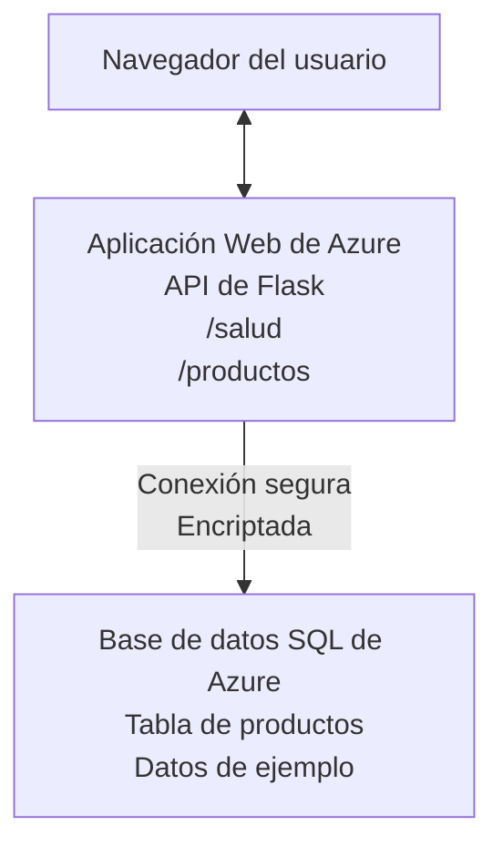

# Despliegue de una base de datos Microsoft SQL y aplicación web con AZD

⏱️ **Tiempo estimado**: 20-30 minutos | 💰 **Costo estimado**: ~$15-25/mes | ⭐ **Complejidad**: Intermedio

Este **ejemplo completo y funcional** demuestra cómo usar el [Azure Developer CLI (azd)](https://learn.microsoft.com/azure/developer/azure-developer-cli/) para desplegar una aplicación web Python Flask con una base de datos Microsoft SQL en Azure. Todo el código está incluido y probado—no se requieren dependencias externas.

## Lo que aprenderás

Al completar este ejemplo, podrás:
- Desplegar una aplicación en múltiples capas (web + base de datos) usando infraestructura como código
- Configurar conexiones seguras a bases de datos sin codificar secretos en el código
- Monitorear la salud de la aplicación con Application Insights
- Administrar recursos de Azure de forma eficiente con la CLI AZD
- Seguir las mejores prácticas de Azure para seguridad, optimización de costos y observabilidad

## Descripción del escenario
- **Aplicación web**: API REST Python Flask con conectividad a base de datos
- **Base de datos**: Azure SQL Database con datos de muestra
- **Infraestructura**: Provisionada usando Bicep (plantillas modulares y reutilizables)
- **Despliegue**: Totalmente automatizado con comandos `azd`
- **Monitoreo**: Application Insights para registros y telemetría

## Prerrequisitos

### Herramientas requeridas

Antes de comenzar, verifica que tienes estas herramientas instaladas:

1. **[Azure CLI](https://learn.microsoft.com/cli/azure/install-azure-cli)** (versión 2.50.0 o superior)
   ```sh
   az --version
   # Salida esperada: azure-cli 2.50.0 o superior
   ```

2. **[Azure Developer CLI (azd)](https://learn.microsoft.com/azure/developer/azure-developer-cli/install-azd)** (versión 1.0.0 o superior)
   ```sh
   azd version
   # Salida esperada: versión azd 1.0.0 o superior
   ```

3. **[Python 3.8+](https://www.python.org/downloads/)** (para desarrollo local)
   ```sh
   python --version
   # Salida esperada: Python 3.8 o superior
   ```

4. **[Docker](https://www.docker.com/get-started)** (opcional, para desarrollo local con contenedores)
   ```sh
   docker --version
   # Salida esperada: versión de Docker 20.10 o superior
   ```

### Requisitos de Azure

- Una **suscripción activa de Azure** ([crea una cuenta gratuita](https://azure.microsoft.com/free/))
- Permisos para crear recursos en tu suscripción
- Rol de **Propietario** o **Colaborador** en la suscripción o grupo de recursos

### Conocimientos previos

Este es un ejemplo de nivel **intermedio**. Debes estar familiarizado con:
- Operaciones básicas de línea de comandos
- Conceptos fundamentales de la nube (recursos, grupos de recursos)
- Comprensión básica de aplicaciones web y bases de datos

**¿Nuevo en AZD?** Comienza primero con la [guía de inicio](../../docs/chapter-01-foundation/azd-basics.md).

## Arquitectura

Este ejemplo despliega una arquitectura de dos capas con una aplicación web y base de datos SQL:


**Despliegue de recursos:**
- **Grupo de recursos**: Contenedor para todos los recursos
- **Plan de App Service**: Hosting basado en Linux (nivel B1 para eficiencia de costo)
- **Aplicación web**: Runtime Python 3.11 con aplicación Flask
- **Servidor SQL**: Servidor de base de datos administrado con TLS 1.2 mínimo
- **Base de datos SQL**: Nivel básico (2GB, apto para desarrollo/pruebas)
- **Application Insights**: Monitoreo y registro
- **Log Analytics Workspace**: Almacenamiento centralizado de logs

**Analogía**: Piensa en esto como un restaurante (app web) con un congelador (base de datos). Los clientes hacen pedidos del menú (endpoints API), y la cocina (app Flask) obtiene los ingredientes (datos) del congelador. El gerente del restaurante (Application Insights) supervisa todo lo que ocurre.

## Estructura de carpetas

Todos los archivos están incluidos en este ejemplo—no se requieren dependencias externas:

```
examples/database-app/
│
├── README.md                    # This file
├── azure.yaml                   # AZD configuration file
├── .env.sample                  # Sample environment variables
├── .gitignore                   # Git ignore patterns
│
├── infra/                       # Infrastructure as Code (Bicep)
│   ├── main.bicep              # Main orchestration template
│   ├── abbreviations.json      # Azure naming conventions
│   └── resources/              # Modular resource templates
│       ├── sql-server.bicep    # SQL Server configuration
│       ├── sql-database.bicep  # Database configuration
│       ├── app-service-plan.bicep  # Hosting plan
│       ├── app-insights.bicep  # Monitoring setup
│       └── web-app.bicep       # Web application
│
└── src/
    └── web/                    # Application source code
        ├── app.py              # Flask REST API
        ├── requirements.txt    # Python dependencies
        └── Dockerfile          # Container definition
```

**Qué hace cada archivo:**
- **azure.yaml**: Indica a AZD qué desplegar y dónde
- **infra/main.bicep**: Orquesta todos los recursos de Azure
- **infra/resources/*.bicep**: Definiciones individuales de recursos (modulares para reutilización)
- **src/web/app.py**: Aplicación Flask con lógica de base de datos
- **requirements.txt**: Dependencias de paquetes Python
- **Dockerfile**: Instrucciones de contenedorización para despliegue

## Inicio rápido (paso a paso)

### Paso 1: Clonar y navegar

```sh
git clone https://github.com/microsoft/AZD-for-beginners.git
cd AZD-for-beginners/examples/database-app
```

**✓ Verificación de éxito**: Asegúrate de ver `azure.yaml` y la carpeta `infra/`:
```sh
ls
# Esperado: README.md, azure.yaml, infra/, src/
```

### Paso 2: Autenticarse con Azure

```sh
azd auth login
```

Esto abrirá tu navegador para autenticación en Azure. Inicia sesión con tus credenciales de Azure.

**✓ Verificación de éxito**: Deberías ver:
```
Logged in to Azure.
```

### Paso 3: Inicializar el entorno

```sh
azd init
```

**Qué sucede**: AZD crea una configuración local para tu despliegue.

**Indicaciones que verás**:
- **Nombre del entorno**: Ingresa un nombre corto (p. ej., `dev`, `myapp`)
- **Suscripción de Azure**: Selecciona tu suscripción de la lista
- **Ubicación de Azure**: Elige una región (p. ej., `eastus`, `westeurope`)

**✓ Verificación de éxito**: Deberías ver:
```
SUCCESS: New project initialized!
```

### Paso 4: Proveer recursos de Azure

```sh
azd provision
```

**Qué sucede**: AZD despliega toda la infraestructura (tarda 5-8 minutos):
1. Crea grupo de recursos
2. Crea servidor y base de datos SQL
3. Crea plan de App Service
4. Crea aplicación web
5. Crea Application Insights
6. Configura red y seguridad

**Se te solicitará**:
- **Nombre de administrador SQL**: Ingresa un usuario (p. ej., `sqladmin`)
- **Contraseña de administrador SQL**: Ingresa una contraseña fuerte (¡guárdala!)

**✓ Verificación de éxito**: Deberías ver:
```
SUCCESS: Your application was provisioned in Azure in X minutes Y seconds.
You can view the resources created under the resource group rg-<env-name> in Azure Portal:
https://portal.azure.com/#@/resource/subscriptions/.../resourceGroups/rg-<env-name>
```

**⏱️ Tiempo**: 5-8 minutos

### Paso 5: Desplegar la aplicación

```sh
azd deploy
```

**Qué sucede**: AZD compila y despliega tu aplicación Flask:
1. Empaqueta la aplicación Python
2. Construye el contenedor Docker
3. Lo sube a Azure Web App
4. Inicializa la base de datos con datos de muestra
5. Inicia la aplicación

**✓ Verificación de éxito**: Deberías ver:
```
SUCCESS: Your application was deployed to Azure in X minutes Y seconds.
You can view the resources created under the resource group rg-<env-name> in Azure Portal:
https://portal.azure.com/#@/resource/subscriptions/.../resourceGroups/rg-<env-name>
```

**⏱️ Tiempo**: 3-5 minutos

### Paso 6: Navegar la aplicación

```sh
azd browse
```

Esto abrirá tu aplicación web desplegada en el navegador en `https://app-<unique-id>.azurewebsites.net`

**✓ Verificación de éxito**: Deberías ver una salida JSON:
```json
{
  "message": "Welcome to the Database App API",
  "endpoints": {
    "/": "This help message",
    "/health": "Health check endpoint",
    "/products": "List all products",
    "/products/<id>": "Get product by ID"
  }
}
```

### Paso 7: Probar los endpoints de la API

**Chequeo de salud** (verificar conexión a base de datos):
```sh
curl https://app-<your-id>.azurewebsites.net/health
```

**Respuesta esperada**:
```json
{
  "status": "healthy",
  "database": "connected"
}
```

**Listado de productos** (datos de muestra):
```sh
curl https://app-<your-id>.azurewebsites.net/products
```

**Respuesta esperada**:
```json
[
  {
    "id": 1,
    "name": "Laptop",
    "description": "High-performance laptop",
    "price": 1299.99,
    "created_at": "2025-11-19T10:30:00"
  },
  ...
]
```

**Obtener un solo producto**:
```sh
curl https://app-<your-id>.azurewebsites.net/products/1
```

**✓ Verificación de éxito**: Todos los endpoints devuelven datos JSON sin errores.

---

**🎉 ¡Felicidades!** Has desplegado correctamente una aplicación web con base de datos en Azure usando AZD.

## Profundización en la configuración

### Variables de entorno

Los secretos se gestionan de forma segura vía la configuración de Azure App Service—**nunca codificados en el código fuente**.

**Configurado automáticamente por AZD**:
- `SQL_CONNECTION_STRING`: Cadena de conexión a base de datos con credenciales cifradas
- `APPLICATIONINSIGHTS_CONNECTION_STRING`: Punto de telemetría para monitoreo
- `SCM_DO_BUILD_DURING_DEPLOYMENT`: Habilita instalación automática de dependencias

**Dónde se almacenan los secretos**:
1. Durante `azd provision`, proporcionas credenciales SQL mediante indicaciones seguras
2. AZD las guarda en tu archivo local `.azure/<nombre-entorno>/.env` (ignorado por git)
3. AZD las inyecta en la configuración de Azure App Service (cifrada en reposo)
4. La aplicación las lee mediante `os.getenv()` en tiempo de ejecución

### Desarrollo local

Para pruebas locales, crea un archivo `.env` a partir del ejemplo:

```sh
cp .env.sample .env
# Edite .env con la conexión a su base de datos local
```

**Flujo de trabajo de desarrollo local**:
```sh
# Instalar dependencias
cd src/web
pip install -r requirements.txt

# Configurar variables de entorno
export SQL_CONNECTION_STRING="your-local-connection-string"

# Ejecutar la aplicación
python app.py
```

**Prueba localmente**:
```sh
curl http://localhost:8000/health
# Esperado: {"estado": "saludable", "base de datos": "conectada"}
```

### Infraestructura como código

Todos los recursos de Azure están definidos en **plantillas Bicep** (carpeta `infra/`):

- **Diseño modular**: Cada tipo de recurso tiene su propio archivo para reutilización
- **Parametrizado**: Personaliza SKUs, regiones, convenciones de nombres
- **Mejores prácticas**: Sigue estándares de nombres y seguridad de Azure
- **Control de versiones**: Cambios en infraestructura se rastrean en Git

**Ejemplo de personalización**:
Para cambiar el nivel de la base de datos, edita `infra/resources/sql-database.bicep`:
```bicep
sku: {
  name: 'Standard'  // Changed from 'Basic'
  tier: 'Standard'
  capacity: 10
}
```

## Mejoras de seguridad

Este ejemplo sigue las mejores prácticas de seguridad de Azure:

### 1. **No almacenar secretos en código**
- ✅ Credenciales almacenadas en configuración de Azure App Service (cifrado)
- ✅ Archivos `.env` excluidos de Git con `.gitignore`
- ✅ Secretos pasados como parámetros seguros durante la provisión

### 2. **Conexiones cifradas**
- ✅ TLS 1.2 mínimo para SQL Server
- ✅ HTTPS obligatorio para la aplicación web
- ✅ Conexiones a base de datos usan canales cifrados

### 3. **Seguridad de red**
- ✅ Firewall de SQL Server configurado para permitir solo servicios Azure
- ✅ Acceso público restringido (se puede reforzar con Endpoints Privados)
- ✅ FTPS deshabilitado en la aplicación web

### 4. **Autenticación y autorización**
- ⚠️ **Actual**: autenticación SQL (usuario/contraseña)
- ✅ **Recomendación para producción**: usar Identidad Administrada de Azure para autenticación sin contraseña

**Para migrar a Identidad Administrada** (producción):
1. Habilitar identidad administrada en la aplicación web
2. Conceder permisos SQL a la identidad
3. Actualizar cadena de conexión para usar identidad administrada
4. Eliminar autenticación basada en contraseña

### 5. **Auditoría y cumplimiento**
- ✅ Application Insights registra todas las solicitudes y errores
- ✅ Auditoría de base de datos habilitada (configurable para cumplimiento)
- ✅ Todos los recursos etiquetados para gobernanza

**Lista de verificación de seguridad antes de producción**:
- [ ] Habilitar Azure Defender para SQL
- [ ] Configurar Endpoints Privados para base de datos SQL
- [ ] Activar Firewall de Aplicación Web (WAF)
- [ ] Implementar Azure Key Vault para rotación de secretos
- [ ] Configurar autenticación Azure AD
- [ ] Habilitar registros diagnósticos para todos los recursos

## Optimización de costos

**Costos mensuales estimados** (a noviembre de 2025):

| Recurso | SKU/Nivel | Costo estimado |
|----------|----------|----------------|
| Plan App Service | B1 (Básico) | ~$13/mes |
| Base de datos SQL | Básico (2GB) | ~$5/mes |
| Application Insights | Pago por uso | ~$2/mes (bajo tráfico) |
| **Total** | | **~$20/mes** |

**💡 Consejos para ahorrar costos**:

1. **Usar nivel gratuito para aprendizaje**:
   - App Service: nivel F1 (gratis, horas limitadas)
   - Base de datos SQL: usar servidor SQL serverless
   - Application Insights: 5GB/mes ingestión gratuita

2. **Detener recursos cuando no se usen**:
   ```sh
   # Detener la aplicación web (la base de datos sigue cobrando)
   az webapp stop --name <app-name> --resource-group <rg-name>
   
   # Reiniciar cuando sea necesario
   az webapp start --name <app-name> --resource-group <rg-name>
   ```

3. **Eliminar todo después de pruebas**:
   ```sh
   azd down
   ```
   Esto elimina TODOS los recursos y detiene cobros.

4. **SKUs para desarrollo vs producción**:
   - **Desarrollo**: Nivel básico (usado en este ejemplo)
   - **Producción**: Nivel estándar/premium con redundancia

**Monitoreo de costos**:
- Ver costos en [Azure Cost Management](https://portal.azure.com/#view/Microsoft_Azure_CostManagement)
- Configurar alertas de costos para evitar sorpresas
- Etiquetar todos los recursos con `azd-env-name` para seguimiento

**Alternativa de nivel gratuito**:
Para propósitos de aprendizaje, puedes modificar `infra/resources/app-service-plan.bicep`:
```bicep
sku: {
  name: 'F1'  // Free tier
  tier: 'Free'
}
```
**Nota**: El nivel gratuito tiene limitaciones (60 min/día CPU, sin always-on).

## Monitoreo y observabilidad

### Integración con Application Insights

Este ejemplo incluye **Application Insights** para monitoreo completo:

**Qué se monitorea**:
- ✅ Solicitudes HTTP (latencia, códigos de estado, endpoints)
- ✅ Errores y excepciones de la aplicación
- ✅ Registro personalizado desde la app Flask
- ✅ Estado de la conexión a la base de datos
- ✅ Métricas de rendimiento (CPU, memoria)

**Acceder a Application Insights**:
1. Abre [Azure Portal](https://portal.azure.com)
2. Navega al grupo de recursos (`rg-<nombre-entorno>`)
3. Haz clic en el recurso Application Insights (`appi-<unique-id>`)

**Consultas útiles** (Application Insights → Logs):

**Ver todas las solicitudes**:
```kusto
requests
| where timestamp > ago(1h)
| order by timestamp desc
| project timestamp, name, url, resultCode, duration
```

**Encontrar errores**:
```kusto
exceptions
| where timestamp > ago(24h)
| order by timestamp desc
| project timestamp, type, outerMessage, operation_Name
```

**Verificar endpoint de salud**:
```kusto
requests
| where name contains "health"
| summarize count() by resultCode, bin(timestamp, 1h)
```

### Auditoría de base de datos SQL

**La auditoría de base de datos SQL está habilitada** para rastrear:
- Patrones de acceso a la base de datos
- Intentos fallidos de inicio de sesión
- Cambios en el esquema
- Accesos a datos (para cumplimiento)

**Acceder a registros de auditoría**:
1. Portal Azure → Base de datos SQL → Auditoría
2. Ver registros en Log Analytics workspace

### Monitoreo en tiempo real

**Ver métricas en vivo**:
1. Application Insights → Live Metrics
2. Ver solicitudes, fallos y rendimiento en tiempo real

**Configurar alertas**:
Crea alertas para eventos críticos:
- Errores HTTP 500 > 5 en 5 minutos
- Fallos en conexión a base de datos
- Tiempos de respuesta elevados (>2 segundos)

**Ejemplo creación de alerta**:
```sh
az monitor metrics alert create \
  --name "High-Response-Time" \
  --resource-group <rg-name> \
  --scopes <app-insights-resource-id> \
  --condition "avg requests/duration > 2000" \
  --description "Alert when response time exceeds 2 seconds"
```

## Solución de problemas
### Problemas Comunes y Soluciones

#### 1. `azd provision` falla con "Ubicación no disponible"

**Síntoma**:
```
Error: The subscription is not registered for the resource type 'components' in the location 'centralus'.
```

**Solución**:
Elija una región de Azure diferente o registre el proveedor de recursos:
```sh
az provider register --namespace Microsoft.Insights
```

#### 2. La conexión SQL falla durante el despliegue

**Síntoma**:
```
pyodbc.OperationalError: ('08001', '[08001] [Microsoft][ODBC Driver 18 for SQL Server]TCP Provider...')
```

**Solución**:
- Verifique que el firewall del servidor SQL permita servicios de Azure (configurado automáticamente)
- Compruebe que la contraseña del administrador SQL se haya introducido correctamente durante `azd provision`
- Asegúrese de que el servidor SQL esté completamente aprovisionado (puede tardar de 2 a 3 minutos)

**Verificar conexión**:
```sh
# Desde el Portal de Azure, vaya a Base de datos SQL → Editor de consultas
# Intente conectarse con sus credenciales
```

#### 3. La aplicación web muestra "Error de aplicación"

**Síntoma**:
El navegador muestra una página de error genérica.

**Solución**:
Revise los logs de la aplicación:
```sh
# Ver registros recientes
az webapp log tail --name <app-name> --resource-group <rg-name>
```

**Causas comunes**:
- Variables de entorno faltantes (verifique App Service → Configuración)
- Falla en la instalación de paquetes de Python (revise los registros de despliegue)
- Error en la inicialización de la base de datos (verifique la conectividad SQL)

#### 4. `azd deploy` falla con "Error de compilación"

**Síntoma**:
```
Error: Failed to build project
```

**Solución**:
- Asegúrese de que `requirements.txt` no tenga errores de sintaxis
- Compruebe que Python 3.11 esté especificado en `infra/resources/web-app.bicep`
- Verifique que el Dockerfile tenga la imagen base correcta

**Depurar localmente**:
```sh
cd src/web
docker build -t test-app .
docker run -p 8000:8000 test-app
```

#### 5. "No autorizado" al ejecutar comandos AZD

**Síntoma**:
```
ERROR: (Unauthorized) The client '<id>' with object id '<id>' does not have authorization
```

**Solución**:
Volver a autenticarse con Azure:
```sh
azd auth login
az login
```

Verifique que tenga los permisos correctos (rol de Colaborador) en la suscripción.

#### 6. Costos altos de base de datos

**Síntoma**:
Factura inesperada de Azure.

**Solución**:
- Verifique si olvidó ejecutar `azd down` después de las pruebas
- Asegúrese de que la base de datos SQL esté usando el nivel Básico (no Premium)
- Revise los costos en Azure Cost Management
- Configure alertas de costos

### Obtener ayuda

**Ver todas las variables de entorno AZD**:
```sh
azd env get-values
```

**Verificar estado del despliegue**:
```sh
az webapp show --name <app-name> --resource-group <rg-name> --query state
```

**Acceder a los logs de la aplicación**:
```sh
az webapp log download --name <app-name> --resource-group <rg-name> --log-file app-logs.zip
```

**¿Necesita más ayuda?**
- [Guía de solución de problemas AZD](../../docs/chapter-07-troubleshooting/common-issues.md)
- [Solución de problemas de Azure App Service](https://learn.microsoft.com/azure/app-service/troubleshoot-diagnostic-logs)
- [Solución de problemas de Azure SQL](https://learn.microsoft.com/azure/azure-sql/database/troubleshoot-common-errors-issues)

## Ejercicios Prácticos

### Ejercicio 1: Verificar su despliegue (Principiante)

**Objetivo**: Confirmar que todos los recursos están desplegados y la aplicación funciona.

**Pasos**:
1. Liste todos los recursos en su grupo de recursos:
   ```sh
   az resource list --resource-group rg-<env-name> --output table
   ```
   **Esperado**: 6-7 recursos (Aplicación web, Servidor SQL, Base de datos SQL, Plan de App Service, Application Insights, Log Analytics)

2. Pruebe todos los endpoints de la API:
   ```sh
   curl https://app-<your-id>.azurewebsites.net/
   curl https://app-<your-id>.azurewebsites.net/health
   curl https://app-<your-id>.azurewebsites.net/products
   curl https://app-<your-id>.azurewebsites.net/products/1
   ```
   **Esperado**: Todos devuelven JSON válido sin errores

3. Verifique Application Insights:
   - Navegue a Application Insights en el portal de Azure
   - Vaya a "Live Metrics"
   - Actualice el navegador en la aplicación web
   **Esperado**: Ver solicitudes en tiempo real

**Criterios de éxito**: Existen todos los recursos (6-7), todos los endpoints devuelven datos, Live Metrics muestra actividad.

---

### Ejercicio 2: Agregar un nuevo endpoint API (Intermedio)

**Objetivo**: Extender la aplicación Flask con un nuevo endpoint.

**Código inicial**: Endpoints actuales en `src/web/app.py`

**Pasos**:
1. Edite `src/web/app.py` y agregue un nuevo endpoint después de la función `get_product()`:
   ```python
   @app.route('/products/search/<keyword>')
   def search_products(keyword):
       """Search products by name or description."""
       try:
           conn = get_db_connection()
           cursor = conn.cursor()
           cursor.execute(
               "SELECT id, name, description, price, created_at FROM products WHERE name LIKE ? OR description LIKE ?",
               (f'%{keyword}%', f'%{keyword}%')
           )
           
           products = []
           for row in cursor.fetchall():
               products.append({
                   'id': row[0],
                   'name': row[1],
                   'description': row[2],
                   'price': float(row[3]) if row[3] else None,
                   'created_at': row[4].isoformat() if row[4] else None
               })
           
           cursor.close()
           conn.close()
           
           logger.info(f"Search for '{keyword}' returned {len(products)} results")
           return jsonify(products), 200
           
       except Exception as e:
           logger.error(f"Error searching products: {str(e)}")
           return jsonify({'error': str(e)}), 500
   ```

2. Despliegue la aplicación actualizada:
   ```sh
   azd deploy
   ```

3. Pruebe el nuevo endpoint:
   ```sh
   curl https://app-<your-id>.azurewebsites.net/products/search/laptop
   ```
   **Esperado**: Devuelve productos que coincidan con "laptop"

**Criterios de éxito**: El nuevo endpoint funciona, devuelve resultados filtrados, aparece en los logs de Application Insights.

---

### Ejercicio 3: Agregar monitoreo y alertas (Avanzado)

**Objetivo**: Configurar monitoreo proactivo con alertas.

**Pasos**:
1. Cree una alerta para errores HTTP 500:
   ```sh
   # Obtener ID de recurso de Application Insights
   AI_ID=$(az monitor app-insights component show \
     --app appi-<your-id> \
     --resource-group rg-<env-name> \
     --query id -o tsv)
   
   # Crear alerta
   az monitor metrics alert create \
     --name "High-Error-Rate" \
     --resource-group rg-<env-name> \
     --scopes $AI_ID \
     --condition "count requests/failed > 5" \
     --window-size 5m \
     --evaluation-frequency 1m \
     --description "Alert when >5 failed requests in 5 minutes"
   ```

2. Genere la alerta provocando errores:
   ```sh
   # Solicitar un producto inexistente
   for i in {1..10}; do curl https://app-<your-id>.azurewebsites.net/products/999; done
   ```

3. Verifique si la alerta se activó:
   - Portal de Azure → Alertas → Reglas de alerta
   - Revise su correo electrónico (si está configurado)

**Criterios de éxito**: Regla de alerta creada, se activa con errores, se reciben notificaciones.

---

### Ejercicio 4: Cambios en el esquema de la base de datos (Avanzado)

**Objetivo**: Agregar una nueva tabla y modificar la aplicación para usarla.

**Pasos**:
1. Conéctese a la base de datos SQL mediante el editor de consultas del portal de Azure

2. Cree una nueva tabla `categories`:
   ```sql
   CREATE TABLE categories (
       id INT PRIMARY KEY IDENTITY(1,1),
       name NVARCHAR(50) NOT NULL,
       description NVARCHAR(200)
   );
   
   INSERT INTO categories (name, description) VALUES
   ('Electronics', 'Electronic devices and accessories'),
   ('Office Supplies', 'Office equipment and supplies');
   
   -- Add category to products table
   ALTER TABLE products ADD category_id INT;
   UPDATE products SET category_id = 1; -- Set all to Electronics
   ```

3. Actualice `src/web/app.py` para incluir información de categoría en las respuestas

4. Despliegue y pruebe

**Criterios de éxito**: La nueva tabla existe, los productos muestran información de categoría, la aplicación sigue funcionando.

---

### Ejercicio 5: Implementar caching (Experto)

**Objetivo**: Añadir Azure Redis Cache para mejorar el rendimiento.

**Pasos**:
1. Añada Redis Cache a `infra/main.bicep`
2. Actualice `src/web/app.py` para cachear consultas de productos
3. Mida la mejora de rendimiento con Application Insights
4. Compare tiempos de respuesta antes y después del caching

**Criterios de éxito**: Redis está desplegado, el caching funciona, tiempos de respuesta mejoran en más del 50%.

**Consejo**: Comience con la [documentación de Azure Cache for Redis](https://learn.microsoft.com/azure/azure-cache-for-redis/).

---

## Limpieza

Para evitar cargos continuos, elimine todos los recursos al finalizar:

```sh
azd down
```

**Mensaje de confirmación**:
```
? Total resources to delete: 7, are you sure you want to continue? (y/N)
```

Escriba `y` para confirmar.

**✓ Comprobación de éxito**: 
- Todos los recursos se eliminaron del portal de Azure
- No hay cargos en curso
- La carpeta local `.azure/<env-name>` puede eliminarse

**Alternativa** (mantener infraestructura, eliminar datos):
```sh
# Eliminar solo el grupo de recursos (mantener la configuración de AZD)
az group delete --name rg-<env-name> --yes
```
## Aprenda Más

### Documentación relacionada
- [Documentación de Azure Developer CLI](https://learn.microsoft.com/azure/developer/azure-developer-cli/)
- [Documentación de Azure SQL Database](https://learn.microsoft.com/azure/azure-sql/database/)
- [Documentación de Azure App Service](https://learn.microsoft.com/azure/app-service/)
- [Documentación de Application Insights](https://learn.microsoft.com/azure/azure-monitor/app/app-insights-overview)
- [Referencia del lenguaje Bicep](https://learn.microsoft.com/azure/azure-resource-manager/bicep/)

### Próximos pasos en este curso
- **[Ejemplo de Container Apps](../../../../examples/container-app)**: Despliegue microservicios con Azure Container Apps
- **[Guía de integración AI](../../../../docs/ai-foundry)**: Añada capacidades de IA a su aplicación
- **[Mejores prácticas de despliegue](../../docs/chapter-04-infrastructure/deployment-guide.md)**: Patrones para despliegue en producción

### Temas avanzados
- **Identidad gestionada**: Elimine contraseñas y use autenticación Azure AD
- **Endpoints privados**: Asegure conexiones de base de datos dentro de una red virtual
- **Integración CI/CD**: Automatice despliegues con GitHub Actions o Azure DevOps
- **Multiambientes**: Configure ambientes de desarrollo, pruebas y producción
- **Migraciones de base de datos**: Use Alembic o Entity Framework para versionar esquemas

### Comparación con otros enfoques

**AZD vs. ARM Templates**:
- ✅ AZD: Abstracción de alto nivel, comandos más simples
- ⚠️ ARM: Más detallado, control granular

**AZD vs. Terraform**:
- ✅ AZD: Nativo de Azure, integrado con servicios de Azure
- ⚠️ Terraform: Soporte multi-nube, ecosistema más amplio

**AZD vs. Portal de Azure**:
- ✅ AZD: Repetible, control de versiones, automatizable
- ⚠️ Portal: Clics manuales, difícil de reproducir

**Piense en AZD como**: Docker Compose para Azure—configuración simplificada para despliegues complejos.

---

## Preguntas frecuentes

**P: ¿Puedo usar otro lenguaje de programación?**  
R: ¡Sí! Reemplace `src/web/` con Node.js, C#, Go o cualquier lenguaje. Actualice `azure.yaml` y Bicep según corresponda.

**P: ¿Cómo agrego más bases de datos?**  
R: Añada otro módulo de base de datos SQL en `infra/main.bicep` o use PostgreSQL/MySQL desde servicios de Azure Database.

**P: ¿Puedo usar esto para producción?**  
R: Esto es un punto de partida. Para producción añada: identidad gestionada, endpoints privados, redundancia, estrategia de respaldo, WAF y monitoreo mejorado.

**P: ¿Y si quiero usar contenedores en vez de desplegar código?**  
R: Consulte el [Ejemplo de Container Apps](../../../../examples/container-app) que usa contenedores Docker en todo el proceso.

**P: ¿Cómo me conecto a la base de datos desde mi máquina local?**  
R: Agregue su IP al firewall del servidor SQL:
```sh
az sql server firewall-rule create \
  --resource-group rg-<env-name> \
  --server sql-<unique-id> \
  --name AllowMyIP \
  --start-ip-address <your-ip> \
  --end-ip-address <your-ip>
```

**P: ¿Puedo usar una base de datos existente en lugar de crear una nueva?**  
R: Sí, modifique `infra/main.bicep` para referenciar un servidor SQL existente y actualice los parámetros de cadena de conexión.

---

> **Nota:** Este ejemplo demuestra las mejores prácticas para desplegar una aplicación web con base de datos usando AZD. Incluye código funcional, documentación completa y ejercicios prácticos para reforzar el aprendizaje. Para despliegues en producción, revise requisitos de seguridad, escalabilidad, cumplimiento y costos específicos de su organización.

**📚 Navegación del curso:**
- ← Anterior: [Ejemplo de Container Apps](../../../../examples/container-app)
- → Siguiente: [Guía de integración AI](../../../../docs/ai-foundry)
- 🏠 [Inicio del curso](../../README.md)

---

<!-- CO-OP TRANSLATOR DISCLAIMER START -->
**Aviso legal**:
Este documento ha sido traducido mediante el servicio de traducción automática [Co-op Translator](https://github.com/Azure/co-op-translator). Aunque nos esforzamos por la precisión, tenga en cuenta que las traducciones automatizadas pueden contener errores o inexactitudes. El documento original en su idioma nativo debe considerarse la fuente autorizada. Para información crítica, se recomienda una traducción profesional realizada por un humano. No nos hacemos responsables de malentendidos o interpretaciones erróneas derivadas del uso de esta traducción.
<!-- CO-OP TRANSLATOR DISCLAIMER END -->